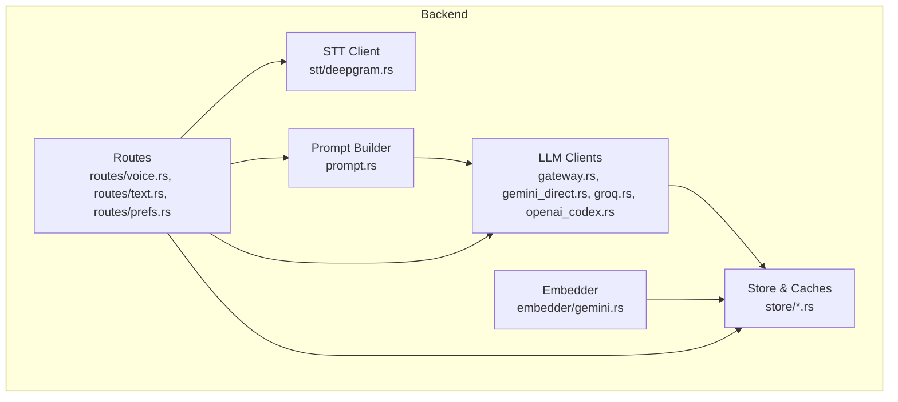
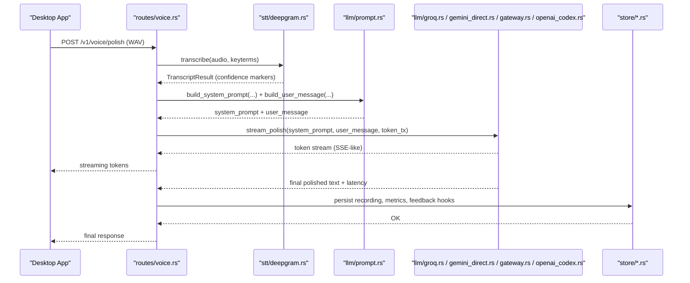
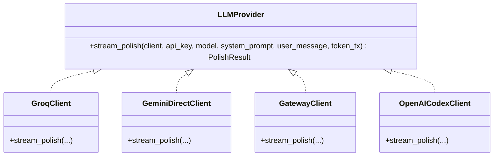
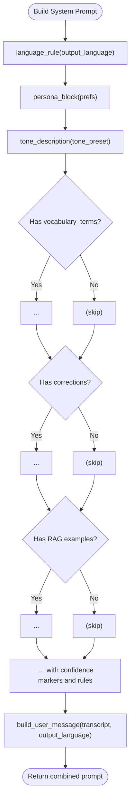
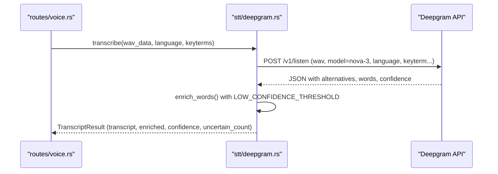
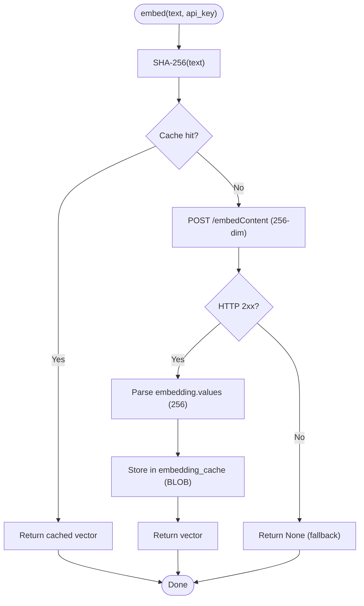
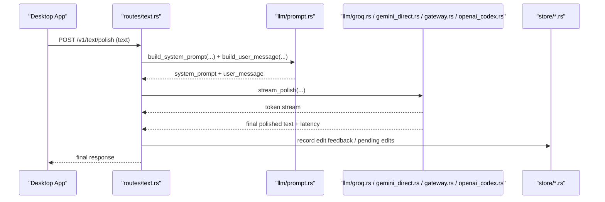
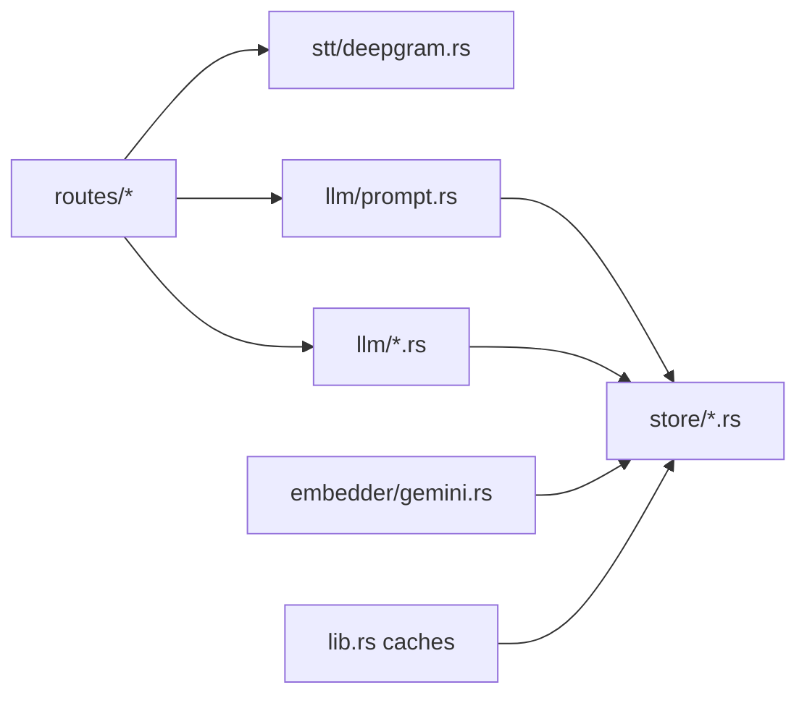

# AI and Machine Learning Integration

<cite>
**Referenced Files in This Document**
- [lib.rs](file://crates/backend/src/lib.rs)
- [main.rs](file://crates/backend/src/main.rs)
- [llm/mod.rs](file://crates/backend/src/llm/mod.rs)
- [llm/gateway.rs](file://crates/backend/src/llm/gateway.rs)
- [llm/gemini_direct.rs](file://crates/backend/src/llm/gemini_direct.rs)
- [llm/groq.rs](file://crates/backend/src/llm/groq.rs)
- [llm/openai_codex.rs](file://crates/backend/src/llm/openai_codex.rs)
- [llm/prompt.rs](file://crates/backend/src/llm/prompt.rs)
- [embedder/mod.rs](file://crates/backend/src/embedder/mod.rs)
- [embedder/gemini.rs](file://crates/backend/src/embedder/gemini.rs)
- [stt/mod.rs](file://crates/backend/src/stt/mod.rs)
- [stt/deepgram.rs](file://crates/backend/src/stt/deepgram.rs)
- [routes/voice.rs](file://crates/backend/src/routes/voice.rs)
- [routes/text.rs](file://crates/backend/src/routes/text.rs)
- [routes/prefs.rs](file://crates/backend/src/routes/prefs.rs)
- [routes/history.rs](file://crates/backend/src/routes/history.rs)
- [store/prefs.rs](file://crates/backend/src/store/prefs.rs)
- [store/corrections.rs](file://crates/backend/src/store/corrections.rs)
- [store/stt_replacements.rs](file://crates/backend/src/store/stt_replacements.rs)
- [store/vectors.rs](file://crates/backend/src/store/vectors.rs)
- [store/vocabulary.rs](file://crates/backend/src/store/vocabulary.rs)
- [store/users.rs](file://crates/backend/src/store/users.rs)
- [store/migrations/002_vectors.sql](file://crates/backend/src/store/migrations/002_vectors.sql)
- [store/migrations/005_llm_provider.sql](file://crates/backend/src/store/migrations/005_llm_provider.sql)
- [store/migrations/007_pending_edits.sql](file://crates/backend/src/store/migrations/007_pending_edits.sql)
- [store/migrations/010_groq_api_key.sql](file://crates/backend/src/store/migrations/010_groq_api_key.sql)
- [store/migrations/011_embed_dims_256.sql](file://crates/backend/src/store/migrations/011_embed_dims_256.sql)
- [store/migrations/012_vocabulary_and_stt_replacements.sql](file://crates/backend/src/store/migrations/012_vocabulary_and_stt_replacements.sql)
</cite>

## Table of Contents
1. [Introduction](#introduction)
2. [Project Structure](#project-structure)
3. [Core Components](#core-components)
4. [Architecture Overview](#architecture-overview)
5. [Detailed Component Analysis](#detailed-component-analysis)
6. [Dependency Analysis](#dependency-analysis)
7. [Performance Considerations](#performance-considerations)
8. [Troubleshooting Guide](#troubleshooting-guide)
9. [Conclusion](#conclusion)
10. [Appendices](#appendices)

## Introduction
This document explains the AI and machine learning integration in WISPR Hindi Bridge. It covers the language model integration architecture supporting multiple providers (Gateway, Gemini, OpenAI Codex, Groq) with a unified streaming interface, the prompt engineering system with templates, context management, and performance tuning, the speech-to-text integration with Deepgram confidence scoring and audio processing, the embedding system for vector generation, similarity search, and caching strategies, and the AI-powered language polishing algorithms, edit detection, and feedback collection. It also addresses streaming response handling, error recovery, rate limiting considerations, model selection criteria, cost optimization strategies, and fallback mechanisms.

## Project Structure
The AI/ML stack resides primarily in the backend crate under:
- LLM providers: crates/backend/src/llm/*
- Embeddings: crates/backend/src/embedder/*
- Speech-to-text: crates/backend/src/stt/*
- Routes orchestrating AI flows: crates/backend/src/routes/*
- Data persistence and caches: crates/backend/src/store/*

**Diagram sources**
- [llm/gateway.rs:1-186](file://crates/backend/src/llm/gateway.rs#L1-L186)
- [llm/gemini_direct.rs:1-139](file://crates/backend/src/llm/gemini_direct.rs#L1-L139)
- [llm/groq.rs:1-143](file://crates/backend/src/llm/groq.rs#L1-L143)
- [llm/openai_codex.rs:1-177](file://crates/backend/src/llm/openai_codex.rs#L1-L177)
- [llm/prompt.rs:1-358](file://crates/backend/src/llm/prompt.rs#L1-L358)
- [embedder/gemini.rs:1-197](file://crates/backend/src/embedder/gemini.rs#L1-L197)
- [stt/deepgram.rs:1-200](file://crates/backend/src/stt/deepgram.rs#L1-L200)
- [routes/voice.rs](file://crates/backend/src/routes/voice.rs)
- [routes/text.rs](file://crates/backend/src/routes/text.rs)
- [routes/prefs.rs](file://crates/backend/src/routes/prefs.rs)
- [store/prefs.rs](file://crates/backend/src/store/prefs.rs)
- [store/corrections.rs](file://crates/backend/src/store/corrections.rs)
- [store/stt_replacements.rs](file://crates/backend/src/store/stt_replacements.rs)
- [store/vectors.rs](file://crates/backend/src/store/vectors.rs)
- [store/vocabulary.rs](file://crates/backend/src/store/vocabulary.rs)

**Section sources**
- [lib.rs:13-19](file://crates/backend/src/lib.rs#L13-L19)
- [main.rs:1-234](file://crates/backend/src/main.rs#L1-L234)

## Core Components
- Unified LLM streaming client interface: All providers implement a streaming polish method returning a shared result type with final text and latency.
- Provider clients: Gateway, Gemini (OpenAI-compatible), Groq (OpenAI-compatible), and OpenAI Codex (non-standard SSE).
- Prompt engineering: Template-driven system with language rules, persona, tone, vocabulary preservation, contextual corrections, and RAG examples.
- Embedding system: Gemini embeddings with persistent SQLite cache, Matryoshka dimensionality reduction, and retry/backoff.
- Speech-to-text: Deepgram Nova-3 transcription with confidence markers and optional personal vocabulary keyterms.
- Feedback and edit capture: Routes and storage for collecting user edits and pending edits to improve future polish.
- Hot caches: Preferences and lexicon caches to reduce database overhead during AI flows.

**Section sources**
- [llm/mod.rs:1-17](file://crates/backend/src/llm/mod.rs#L1-L17)
- [llm/gateway.rs:39-140](file://crtes/backend/src/llm/gateway.rs#L39-L140)
- [llm/gemini_direct.rs:44-138](file://crates/backend/src/llm/gemini_direct.rs#L44-L138)
- [llm/groq.rs:56-142](file://crates/backend/src/llm/groq.rs#L56-L142)
- [llm/openai_codex.rs:35-131](file://crates/backend/src/llm/openai_codex.rs#L35-L131)
- [llm/prompt.rs:38-184](file://crates/backend/src/llm/prompt.rs#L38-L184)
- [embedder/gemini.rs:50-131](file://crates/backend/src/embedder/gemini.rs#L50-L131)
- [stt/deepgram.rs:59-146](file://crates/backend/src/stt/deepgram.rs#L59-L146)
- [lib.rs:41-131](file://crates/backend/src/lib.rs#L41-L131)

## Architecture Overview
The AI/ML pipeline integrates STT, prompt construction, provider selection, streaming polish, and feedback capture. Providers expose a uniform streaming interface. Embeddings power RAG-style contextual examples. Hot caches minimize DB hits. Routes orchestrate flows for voice and text polish.

**Diagram sources**
- [routes/voice.rs](file://crates/backend/src/routes/voice.rs)
- [stt/deepgram.rs:59-146](file://crates/backend/src/stt/deepgram.rs#L59-L146)
- [llm/prompt.rs:38-184](file://crates/backend/src/llm/prompt.rs#L38-L184)
- [llm/groq.rs:56-142](file://crates/backend/src/llm/groq.rs#L56-L142)
- [llm/gemini_direct.rs:44-138](file://crates/backend/src/llm/gemini_direct.rs#L44-L138)
- [llm/gateway.rs:39-140](file://crates/backend/src/llm/gateway.rs#L39-L140)
- [llm/openai_codex.rs:35-131](file://crates/backend/src/llm/openai_codex.rs#L35-L131)
- [store/prefs.rs](file://crates/backend/src/store/prefs.rs)
- [store/corrections.rs](file://crates/backend/src/store/corrections.rs)
- [store/stt_replacements.rs](file://crates/backend/src/store/stt_replacements.rs)

## Detailed Component Analysis

### LLM Provider Clients and Abstraction
All provider clients implement a streaming polish function that:
- Accepts a system prompt and user message
- Streams tokens via an async channel
- Returns a shared result with polished text and latency
- Handles timeouts and non-success HTTP statuses
- Uses provider-specific endpoints and headers

**Diagram sources**
- [llm/mod.rs:12-17](file://crates/backend/src/llm/mod.rs#L12-L17)
- [llm/groq.rs:56-142](file://crates/backend/src/llm/groq.rs#L56-L142)
- [llm/gemini_direct.rs:44-138](file://crates/backend/src/llm/gemini_direct.rs#L44-L138)
- [llm/gateway.rs:39-140](file://crates/backend/src/llm/gateway.rs#L39-L140)
- [llm/openai_codex.rs:35-131](file://crates/backend/src/llm/openai_codex.rs#L35-L131)

Key characteristics:
- Groq: OpenAI-compatible SSE, fast TTFT, temperature tuning, model selection.
- Gemini (direct): OpenAI-compatible endpoint, similar SSE format.
- Gateway: Custom endpoint with SSE chunks, debug request dumping.
- OpenAI Codex: Non-standard SSE with delta events, token refresh flow.

**Section sources**
- [llm/groq.rs:1-143](file://crates/backend/src/llm/groq.rs#L1-L143)
- [llm/gemini_direct.rs:1-139](file://crates/backend/src/llm/gemini_direct.rs#L1-L139)
- [llm/gateway.rs:1-186](file://crates/backend/src/llm/gateway.rs#L1-L186)
- [llm/openai_codex.rs:1-177](file://crates/backend/src/llm/openai_codex.rs#L1-L177)

### Prompt Engineering System
The prompt builder composes a structured system prompt with:
- Language rule enforcing output language and script
- Persona and tone presets
- Personal vocabulary preservation block
- Polish-layer corrections (soft preferences)
- Contextual RAG examples from similar past edits
- Task instructions for STT transcripts, confidence markers, dictation patterns, and output rules
- Script final check inserted near the end of the task block

**Diagram sources**
- [llm/prompt.rs:38-184](file://crates/backend/src/llm/prompt.rs#L38-L184)
- [llm/prompt.rs:219-228](file://crates/backend/src/llm/prompt.rs#L219-L228)

Performance tuning strategies:
- Keep vocabulary and corrections blocks conditional to avoid noise.
- Place the script final check at the bottom of the task for stronger enforcement.
- Use concise tone presets and minimal RAG examples to reduce context length.

**Section sources**
- [llm/prompt.rs:1-358](file://crates/backend/src/llm/prompt.rs#L1-L358)

### Speech-to-Text Integration with Deepgram
Deepgram Nova-3 transcription:
- Endpoint accepts WAV audio with language and keyterms biasing.
- Returns top transcript, overall confidence, and per-word confidence.
- Enriched transcript marks low-confidence words as [word?XX%] for the LLM.
- Optional personal vocabulary terms passed as keyterms (up to 100).

Confidence scoring and audio processing:
- Threshold determines uncertain words.
- Word-level punctuation preserved when available.
- URL encoding for keyterms to ensure correctness.

**Diagram sources**
- [stt/deepgram.rs:59-146](file://crates/backend/src/stt/deepgram.rs#L59-L146)

**Section sources**
- [stt/deepgram.rs:1-200](file://crates/backend/src/stt/deepgram.rs#L1-L200)

### Embedding System for Vector Generation, Similarity Search, and Caching
Gemini Embedding 2 client:
- Generates 256-dimension embeddings (Matryoshka truncation) for improved KNN performance and smaller cache.
- Persistent SQLite cache keyed by SHA-256 of input text.
- Retry with exponential backoff on server errors.
- Encodes/decodes vectors for storage and retrieval.

Similarity search and RAG:
- Embeddings are stored with created timestamps for cache hygiene.
- Similarity search leverages cosine distance on cached vectors.
- RAG examples are constructed from similar past edits to guide the LLM.

**Diagram sources**
- [embedder/gemini.rs:50-131](file://crates/backend/src/embedder/gemini.rs#L50-L131)
- [store/migrations/002_vectors.sql](file://crates/backend/src/store/migrations/002_vectors.sql)
- [store/migrations/011_embed_dims_256.sql](file://crates/backend/src/store/migrations/011_embed_dims_256.sql)

**Section sources**
- [embedder/gemini.rs:1-197](file://crates/backend/src/embedder/gemini.rs#L1-L197)
- [store/vectors.rs](file://crates/backend/src/store/vectors.rs)

### AI-Powered Language Polishing, Edit Detection, and Feedback Collection
- Polishing routes accept voice or text input, build prompts, select provider, stream tokens, and return final text.
- Edit detection captures user-initiated changes to polished output for training contextual preferences.
- Pending edits are tracked and resolved separately.
- Preferences and corrections inform the prompt builder to avoid over-correcting.

**Diagram sources**
- [routes/text.rs](file://crates/backend/src/routes/text.rs)
- [llm/prompt.rs:38-184](file://crates/backend/src/llm/prompt.rs#L38-L184)
- [llm/groq.rs:56-142](file://crates/backend/src/llm/groq.rs#L56-L142)
- [llm/gemini_direct.rs:44-138](file://crates/backend/src/llm/gemini_direct.rs#L44-L138)
- [llm/gateway.rs:39-140](file://crates/backend/src/llm/gateway.rs#L39-L140)
- [llm/openai_codex.rs:35-131](file://crates/backend/src/llm/openai_codex.rs#L35-L131)
- [store/prefs.rs](file://crates/backend/src/store/prefs.rs)
- [store/corrections.rs](file://crates/backend/src/store/corrections.rs)
- [store/pending_edits.rs](file://crates/backend/src/store/pending_edits.rs)

**Section sources**
- [routes/text.rs](file://crates/backend/src/routes/text.rs)
- [routes/prefs.rs](file://crates/backend/src/routes/prefs.rs)
- [store/pending_edits.rs](file://crates/backend/src/store/pending_edits.rs)

### Streaming Response Handling, Error Recovery, and Rate Limiting
- Streaming: All provider clients use byte streams and parse SSE-like chunks, yielding tokens as they arrive.
- Error recovery: Non-success HTTP statuses return descriptive errors; OpenAI Codex and Gateway clients log and propagate errors; embedding client retries on server errors.
- Timeouts: Requests are bounded to prevent hanging.
- Rate limiting considerations: Shared HTTP client pools idle connections; provider endpoints may enforce quotas; consider jittered backoff and circuit breaker patterns at the application level.

**Section sources**
- [llm/gateway.rs:78-87](file://crates/backend/src/llm/gateway.rs#L78-L87)
- [llm/gemini_direct.rs:76-88](file://crates/backend/src/llm/gemini_direct.rs#L76-L88)
- [llm/groq.rs:88-98](file://crates/backend/src/llm/groq.rs#L88-L98)
- [llm/openai_codex.rs:68-77](file://crates/backend/src/llm/openai_codex.rs#L68-L77)
- [embedder/gemini.rs:78-127](file://crates/backend/src/embedder/gemini.rs#L78-L127)
- [main.rs:62-66](file://crates/backend/src/main.rs#L62-L66)

### Model Selection Criteria, Cost Optimization, and Fallbacks
Model selection:
- Groq models: Balance quality and speed; default and fast variants selectable.
- Gemini: OpenAI-compatible endpoint; useful when provider keys differ.
- Gateway/OpenAI Codex: Alternative providers with distinct SSE formats and token refresh for Codex.

Cost optimization:
- Embedding dimensionality reduced to 256 for faster similarity search and smaller cache.
- Hot caches for preferences and lexicon reduce DB load.
- Streaming reduces perceived latency and improves user experience.

Fallback mechanisms:
- Missing API keys return explicit errors; embedding misses return None (polish still works).
- Provider errors are surfaced; consider round-robin or failover strategies at the route level.

**Section sources**
- [llm/groq.rs:30-33](file://crates/backend/src/llm/groq.rs#L30-L33)
- [embedder/gemini.rs:28-31](file://crates/backend/src/embedder/gemini.rs#L28-L31)
- [lib.rs:41-131](file://crates/backend/src/lib.rs#L41-L131)

## Dependency Analysis
The backend composes modular components with clear boundaries:
- Routes depend on STT, Prompt, and LLM clients.
- Prompt depends on Preferences, Corrections, and Vocabulary.
- Embedder depends on Preferences and SQLite cache.
- Hot caches reduce DB contention.

**Diagram sources**
- [lib.rs:41-131](file://crates/backend/src/lib.rs#L41-L131)
- [llm/prompt.rs:38-184](file://crates/backend/src/llm/prompt.rs#L38-L184)
- [stt/deepgram.rs:59-146](file://crates/backend/src/stt/deepgram.rs#L59-L146)
- [embedder/gemini.rs:50-131](file://crates/backend/src/embedder/gemini.rs#L50-L131)
- [routes/voice.rs](file://crates/backend/src/routes/voice.rs)
- [routes/text.rs](file://crates/backend/src/routes/text.rs)

**Section sources**
- [lib.rs:13-19](file://crates/backend/src/lib.rs#L13-L19)
- [main.rs:1-234](file://crates/backend/src/main.rs#L1-L234)

## Performance Considerations
- Streaming polish: Immediate token delivery reduces perceived latency.
- Embedding dimensionality: 256-dim vectors improve KNN performance and cache efficiency.
- Hot caches: Preferences (30s TTL) and lexicon (60s TTL) minimize DB queries.
- Connection pooling: Shared HTTP client with idle timeouts.
- Prompt size: Keep vocabulary and corrections blocks concise; use RAG sparingly.

[No sources needed since this section provides general guidance]

## Troubleshooting Guide
Common issues and resolutions:
- Provider errors: Check API keys and network connectivity; review status and body previews in logs.
- Empty transcripts: Verify audio input and language settings; ensure keyterms are URL-encoded.
- Missing embeddings: Confirm API key presence; inspect cache entries and retry behavior.
- Slow polish: Switch to faster Groq model or reduce prompt length; enable hot caches.

**Section sources**
- [llm/gateway.rs:84-87](file://crates/backend/src/llm/gateway.rs#L84-L87)
- [llm/gemini_direct.rs:82-88](file://crates/backend/src/llm/gemini_direct.rs#L82-L88)
- [llm/groq.rs:94-98](file://crates/backend/src/llm/groq.rs#L94-L98)
- [llm/openai_codex.rs:72-77](file://crates/backend/src/llm/openai_codex.rs#L72-L77)
- [stt/deepgram.rs:98-102](file://crates/backend/src/stt/deepgram.rs#L98-L102)
- [embedder/gemini.rs:56-59](file://crates/backend/src/embedder/gemini.rs#L56-L59)
- [embedder/gemini.rs:95-101](file://crates/backend/src/embedder/gemini.rs#L95-L101)

## Conclusion
WISPR Hindi Bridge integrates multiple LLM providers behind a unified streaming interface, a robust prompt engineering system, and efficient STT with confidence scoring. The embedding system accelerates similarity search with dimensionality reduction and persistent caching. Hot caches, streaming, and careful prompt design deliver responsive, accurate polish tailored to Hinglish and Hindi contexts. Provider diversity, explicit error handling, and fallbacks ensure reliability and cost-conscious operation.

[No sources needed since this section summarizes without analyzing specific files]

## Appendices

### Provider Capabilities and Notes
- Groq: Fast TTFT, OpenAI-compatible SSE, model selection.
- Gemini (direct): OpenAI-compatible endpoint, similar SSE.
- Gateway: Custom SSE, debug request logging.
- OpenAI Codex: Non-standard SSE, token refresh flow.

**Section sources**
- [llm/groq.rs:12-16](file://crates/backend/src/llm/groq.rs#L12-L16)
- [llm/gemini_direct.rs:1-8](file://crates/backend/src/llm/gemini_direct.rs#L1-L8)
- [llm/gateway.rs:1-5](file://crates/backend/src/llm/gateway.rs#L1-L5)
- [llm/openai_codex.rs:1-14](file://crates/backend/src/llm/openai_codex.rs#L1-L14)

### Data Stores and Migrations Relevant to AI/ML
- Vectors and embeddings: migration defines vector storage and dimensionality.
- LLM provider preference: migration persists provider selection.
- Pending edits: migration supports edit capture and resolution.
- API keys: dedicated migrations for provider credentials.
- Embedding dimensions: migration to 256-dim vectors.
- Vocabulary and STT replacements: migration enabling personal vocabulary and replacements.

**Section sources**
- [store/migrations/002_vectors.sql](file://crates/backend/src/store/migrations/002_vectors.sql)
- [store/migrations/005_llm_provider.sql](file://crates/backend/src/store/migrations/005_llm_provider.sql)
- [store/migrations/007_pending_edits.sql](file://crates/backend/src/store/migrations/007_pending_edits.sql)
- [store/migrations/010_groq_api_key.sql](file://crates/backend/src/store/migrations/010_groq_api_key.sql)
- [store/migrations/011_embed_dims_256.sql](file://crates/backend/src/store/migrations/011_embed_dims_256.sql)
- [store/migrations/012_vocabulary_and_stt_replacements.sql](file://crates/backend/src/store/migrations/012_vocabulary_and_stt_replacements.sql)