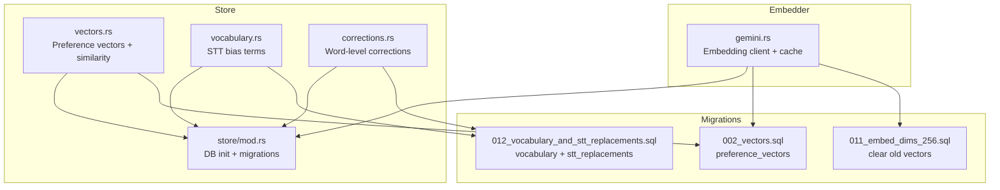
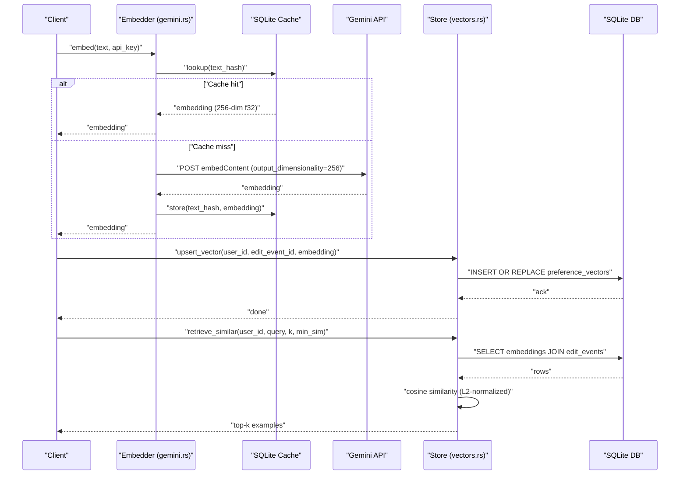
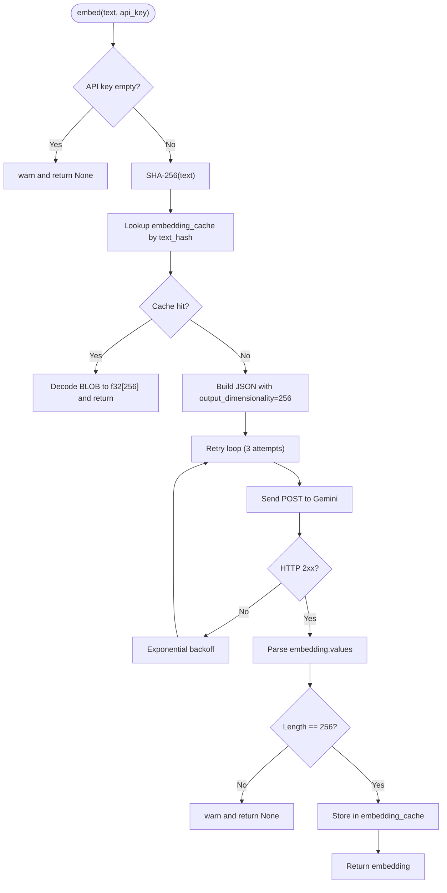
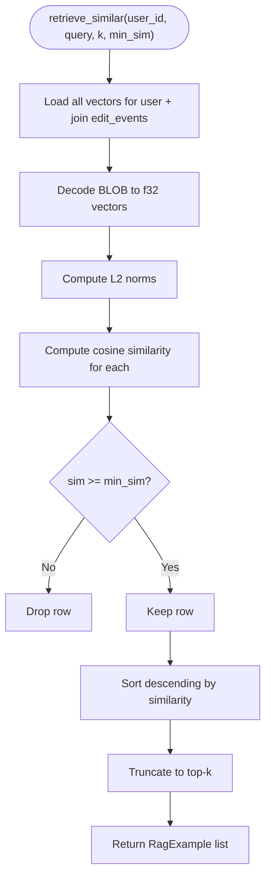
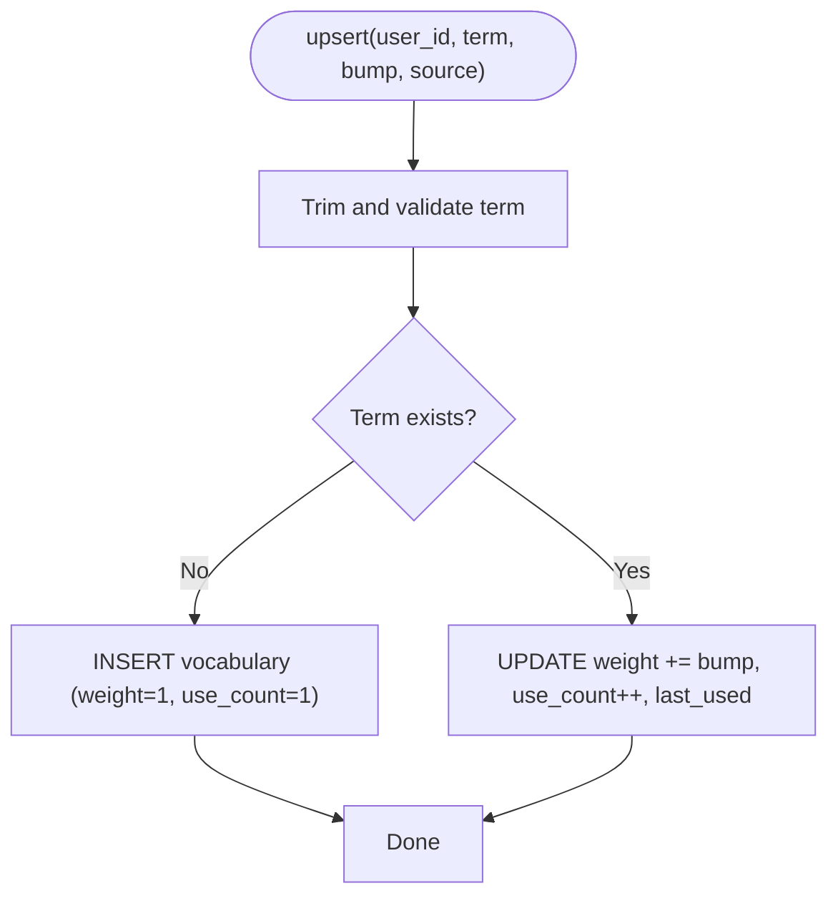
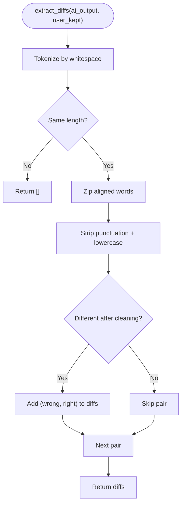
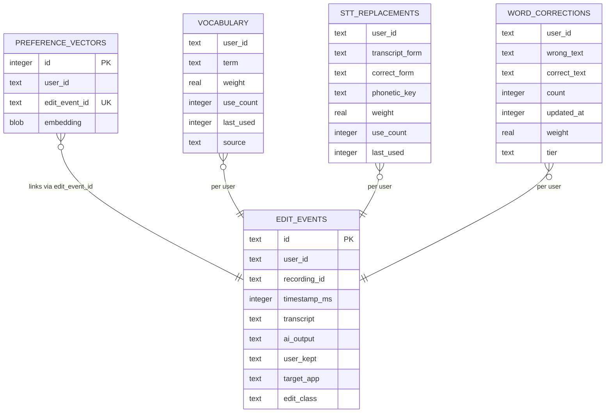
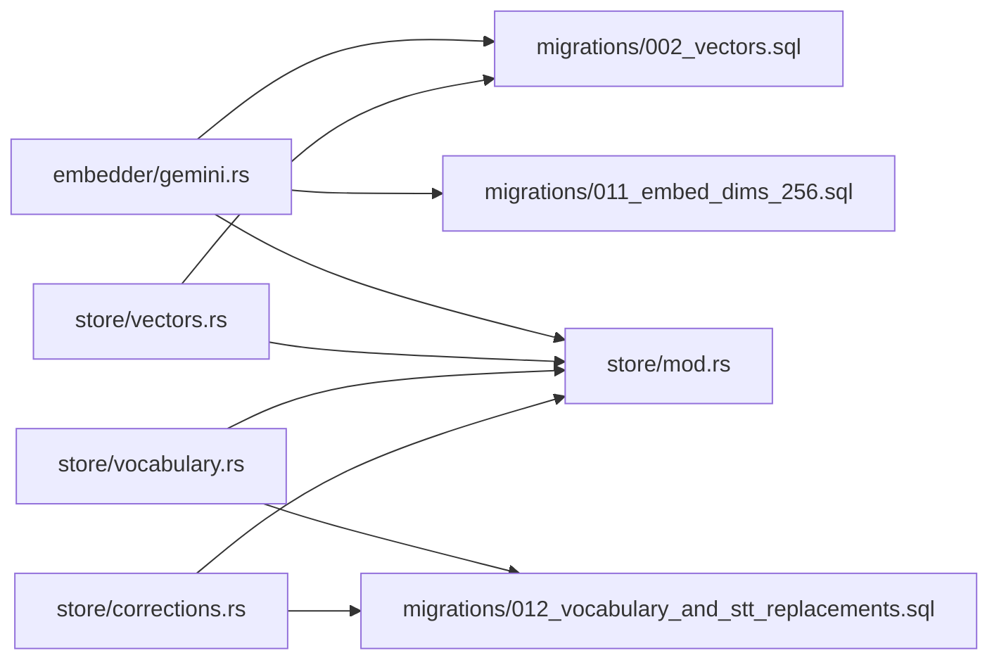

# Embedding and Vector System

<cite>
**Referenced Files in This Document**
- [gemini.rs](file://crates/backend/src/embedder/gemini.rs)
- [vectors.rs](file://crates/backend/src/store/vectors.rs)
- [vocabulary.rs](file://crates/backend/src/store/vocabulary.rs)
- [corrections.rs](file://crates/backend/src/store/corrections.rs)
- [store/mod.rs](file://crates/backend/src/store/mod.rs)
- [002_vectors.sql](file://crates/backend/src/store/migrations/002_vectors.sql)
- [011_embed_dims_256.sql](file://crates/backend/src/store/migrations/011_embed_dims_256.sql)
- [012_vocabulary_and_stt_replacements.sql](file://crates/backend/src/store/migrations/012_vocabulary_and_stt_replacements.sql)
</cite>

## Table of Contents
1. [Introduction](#introduction)
2. [Project Structure](#project-structure)
3. [Core Components](#core-components)
4. [Architecture Overview](#architecture-overview)
5. [Detailed Component Analysis](#detailed-component-analysis)
6. [Dependency Analysis](#dependency-analysis)
7. [Performance Considerations](#performance-considerations)
8. [Troubleshooting Guide](#troubleshooting-guide)
9. [Conclusion](#conclusion)
10. [Appendices](#appendices)

## Introduction
This document describes the embedding and vector system that powers semantic search and similarity matching in WISPR Hindi Bridge. It covers vector generation via Gemini embeddings, dimension management, storage strategies, similarity search algorithms, caching, and integration with the language processing pipeline. It also documents vocabulary and word correction systems, contextual updates, and operational considerations for distributed consistency.

## Project Structure
The embedding and vector system spans three primary areas:
- Embedding generation and caching: implemented in the embedder module
- Vector storage and retrieval: implemented in the store module
- Supporting stores for vocabulary and word corrections: part of the store module

**Diagram sources**
- [gemini.rs:1-197](file://crates/backend/src/embedder/gemini.rs#L1-L197)
- [vectors.rs:1-162](file://crates/backend/src/store/vectors.rs#L1-L162)
- [vocabulary.rs:1-248](file://crates/backend/src/store/vocabulary.rs#L1-L248)
- [corrections.rs:1-136](file://crates/backend/src/store/corrections.rs#L1-L136)
- [store/mod.rs:1-284](file://crates/backend/src/store/mod.rs#L1-L284)
- [002_vectors.sql:1-14](file://crates/backend/src/store/migrations/002_vectors.sql#L1-L14)
- [011_embed_dims_256.sql:1-9](file://crates/backend/src/store/migrations/011_embed_dims_256.sql#L1-L9)
- [012_vocabulary_and_stt_replacements.sql:1-55](file://crates/backend/src/store/migrations/012_vocabulary_and_stt_replacements.sql#L1-L55)

**Section sources**
- [gemini.rs:1-197](file://crates/backend/src/embedder/gemini.rs#L1-L197)
- [vectors.rs:1-162](file://crates/backend/src/store/vectors.rs#L1-L162)
- [vocabulary.rs:1-248](file://crates/backend/src/store/vocabulary.rs#L1-L248)
- [corrections.rs:1-136](file://crates/backend/src/store/corrections.rs#L1-L136)
- [store/mod.rs:1-284](file://crates/backend/src/store/mod.rs#L1-L284)
- [002_vectors.sql:1-14](file://crates/backend/src/store/migrations/002_vectors.sql#L1-L14)
- [011_embed_dims_256.sql:1-9](file://crates/backend/src/store/migrations/011_embed_dims_256.sql#L1-L9)
- [012_vocabulary_and_stt_replacements.sql:1-55](file://crates/backend/src/store/migrations/012_vocabulary_and_stt_replacements.sql#L1-L55)

## Core Components
- Embedding client and cache: generates 256-dimension vectors from text using Gemini, caches results in SQLite, and retries on transient failures.
- Preference vector store: persists user-specific edit embeddings and performs cosine similarity KNN retrieval.
- Vocabulary store: manages STT-layer bias terms with weighted promotion/demotion and recency-aware ordering.
- Word corrections store: extracts and persists word-level corrections derived from user edits.
- Database initialization and migrations: sets up SQLite, runs migrations, and ensures schema consistency.

Key implementation references:
- Embedding generation and cache: [gemini.rs:50-131](file://crates/backend/src/embedder/gemini.rs#L50-L131)
- Vector persistence and similarity: [vectors.rs:24-125](file://crates/backend/src/store/vectors.rs#L24-L125)
- Vocabulary management: [vocabulary.rs:33-154](file://crates/backend/src/store/vocabulary.rs#L33-L154)
- Word corrections extraction and storage: [corrections.rs:25-93](file://crates/backend/src/store/corrections.rs#L25-L93)
- Database setup and migrations: [store/mod.rs:34-165](file://crates/backend/src/store/mod.rs#L34-L165)

**Section sources**
- [gemini.rs:1-197](file://crates/backend/src/embedder/gemini.rs#L1-L197)
- [vectors.rs:1-162](file://crates/backend/src/store/vectors.rs#L1-L162)
- [vocabulary.rs:1-248](file://crates/backend/src/store/vocabulary.rs#L1-L248)
- [corrections.rs:1-136](file://crates/backend/src/store/corrections.rs#L1-L136)
- [store/mod.rs:1-284](file://crates/backend/src/store/mod.rs#L1-L284)

## Architecture Overview
The system integrates embedding generation, caching, and similarity search into the language processing pipeline. At runtime:
- Text inputs are embedded using Gemini with 256-dimension output.
- Embeddings are cached locally to avoid repeated API calls.
- User preference vectors are stored and retrieved for similarity-based RAG examples.
- Vocabulary and word corrections inform STT and post-processing behavior.

**Diagram sources**
- [gemini.rs:50-131](file://crates/backend/src/embedder/gemini.rs#L50-L131)
- [vectors.rs:24-125](file://crates/backend/src/store/vectors.rs#L24-L125)
- [store/mod.rs:34-60](file://crates/backend/src/store/mod.rs#L34-L60)

## Detailed Component Analysis

### Embedding Generation and Caching (Gemini)
- Dimensionality: 256 (Matryoshka truncation from 768) for faster cosine KNN and smaller cache sizes.
- Caching: SHA-256 of input text hashed and used as the cache key in a dedicated table; values stored as little-endian f32 BLOBs.
- API integration: Calls the Gemini endpoint with the configured API key and retries on server errors with exponential backoff.
- Fallback behavior: Returns None when API key is missing or all retries fail; this disables vectorization but allows polish to proceed without RAG.

**Diagram sources**
- [gemini.rs:50-131](file://crates/backend/src/embedder/gemini.rs#L50-L131)

**Section sources**
- [gemini.rs:1-197](file://crates/backend/src/embedder/gemini.rs#L1-L197)
- [011_embed_dims_256.sql:1-9](file://crates/backend/src/store/migrations/011_embed_dims_256.sql#L1-L9)

### Preference Vector Storage and Similarity Search
- Storage: Embeddings are stored as BLOBs in the preference_vectors table. The 256-dimension vectors are compatible with the cache and enable efficient similarity computation.
- Retrieval: Performs full-table scan per user, converts BLOBs to f32 vectors, normalizes, computes cosine similarity, filters by minimum similarity, sorts, and returns top-k examples joined with edit events.
- Indexing: A user index accelerates per-user queries.

**Diagram sources**
- [vectors.rs:44-125](file://crates/backend/src/store/vectors.rs#L44-L125)
- [002_vectors.sql:6-14](file://crates/backend/src/store/migrations/002_vectors.sql#L6-L14)

**Section sources**
- [vectors.rs:1-162](file://crates/backend/src/store/vectors.rs#L1-L162)
- [002_vectors.sql:1-14](file://crates/backend/src/store/migrations/002_vectors.sql#L1-L14)

### Vocabulary Embedding System and STT Bias Terms
- Purpose: Maintain a weighted vocabulary of correctly spelled terms to bias the STT engine toward domain-specific jargon, names, brands, and identifiers.
- Behavior: Upserts terms with bounded weights, increments use counts, updates last_used timestamps, and supports manual “star” weighting that is preserved across demotions.
- Retrieval: Provides top-N terms ordered by weight and recency for injection into STT requests.

**Diagram sources**
- [vocabulary.rs:33-72](file://crates/backend/src/store/vocabulary.rs#L33-L72)

**Section sources**
- [vocabulary.rs:1-248](file://crates/backend/src/store/vocabulary.rs#L1-L248)
- [012_vocabulary_and_stt_replacements.sql:22-32](file://crates/backend/src/store/migrations/012_vocabulary_and_stt_replacements.sql#L22-L32)

### Word Correction Vectors and Contextual Updates
- Extraction: Computes word-level differences between AI output and user-kept text when they have equal word counts, cleaning punctuation and lowercasing.
- Persistence: Upserts corrections with counts and timestamps; loads all corrections per user for prompt injection.
- Backfill: Populates corrections from historical edit events on first run.

**Diagram sources**
- [corrections.rs:25-45](file://crates/backend/src/store/corrections.rs#L25-L45)

**Section sources**
- [corrections.rs:1-136](file://crates/backend/src/store/corrections.rs#L1-L136)
- [012_vocabulary_and_stt_replacements.sql:1-55](file://crates/backend/src/store/migrations/012_vocabulary_and_stt_replacements.sql#L1-L55)

### Database Schema and Indexing
- preference_vectors: Stores user_id, edit_event_id, and embedding BLOB. Indexed by user for fast retrieval.
- embedding_cache: Stores text_hash and embedding BLOB for the embedding client cache.
- vocabulary: Tracks STT bias terms with weights, counts, recency, and source.
- stt_replacements: Stores post-STT literal and phonetic substitutions.
- word_corrections: Expanded with weight and tier columns for layered correction enforcement.

**Diagram sources**
- [002_vectors.sql:6-14](file://crates/backend/src/store/migrations/002_vectors.sql#L6-L14)
- [012_vocabulary_and_stt_replacements.sql:22-55](file://crates/backend/src/store/migrations/012_vocabulary_and_stt_replacements.sql#L22-L55)

**Section sources**
- [002_vectors.sql:1-14](file://crates/backend/src/store/migrations/002_vectors.sql#L1-L14)
- [011_embed_dims_256.sql:1-9](file://crates/backend/src/store/migrations/011_embed_dims_256.sql#L1-L9)
- [012_vocabulary_and_stt_replacements.sql:1-55](file://crates/backend/src/store/migrations/012_vocabulary_and_stt_replacements.sql#L1-L55)

## Dependency Analysis
- Embedder depends on the store’s database pool and uses helper functions to encode/decode vectors.
- Vector retrieval joins preference_vectors with edit_events to produce RAG examples.
- Vocabulary and corrections are independent stores that influence STT and polish prompts.
- Migrations coordinate schema changes and maintain compatibility across dimension shifts.

**Diagram sources**
- [gemini.rs:1-197](file://crates/backend/src/embedder/gemini.rs#L1-L197)
- [vectors.rs:1-162](file://crates/backend/src/store/vectors.rs#L1-L162)
- [vocabulary.rs:1-248](file://crates/backend/src/store/vocabulary.rs#L1-L248)
- [corrections.rs:1-136](file://crates/backend/src/store/corrections.rs#L1-L136)
- [store/mod.rs:1-284](file://crates/backend/src/store/mod.rs#L1-L284)
- [002_vectors.sql:1-14](file://crates/backend/src/store/migrations/002_vectors.sql#L1-L14)
- [011_embed_dims_256.sql:1-9](file://crates/backend/src/store/migrations/011_embed_dims_256.sql#L1-L9)
- [012_vocabulary_and_stt_replacements.sql:1-55](file://crates/backend/src/store/migrations/012_vocabulary_and_stt_replacements.sql#L1-L55)

**Section sources**
- [gemini.rs:1-197](file://crates/backend/src/embedder/gemini.rs#L1-L197)
- [vectors.rs:1-162](file://crates/backend/src/store/vectors.rs#L1-L162)
- [vocabulary.rs:1-248](file://crates/backend/src/store/vocabulary.rs#L1-L248)
- [corrections.rs:1-136](file://crates/backend/src/store/corrections.rs#L1-L136)
- [store/mod.rs:1-284](file://crates/backend/src/store/mod.rs#L1-L284)

## Performance Considerations
- Dimension reduction: 256-dimension embeddings reduce API payload sizes, cache footprint, and similarity computation cost while preserving quality for personal-scale corpora.
- Caching: Embedding results are cached keyed by SHA-256 of input text, avoiding redundant API calls and reducing latency.
- Local similarity: Cosine similarity is computed in-process against the full user corpus; indexing and small dataset sizes keep retrieval near-instantaneous.
- Batch processing: While not explicitly implemented, vectors can be batch-updated by invoking upsert_vector in batches after generating embeddings in bulk.
- Memory management: Vectors are decoded on demand and processed in-memory; for very large corpora, consider pagination or external vector databases.

[No sources needed since this section provides general guidance]

## Troubleshooting Guide
- Missing API key: Embedding returns None; polish continues without RAG. Verify preferences and environment configuration.
- Cache inconsistencies after dimension change: Migration clears 768-dim vectors and cache; embeddings will rebuild at 256 dimensions on next use.
- Garbage edits: Startup purges edit_events with negligible word overlap to prevent poisoning RAG; review purge logic if expected edits are missing.
- Similarity returns empty: Ensure query vector is non-zero and normalized; confirm minimum similarity threshold is appropriate for the corpus.

**Section sources**
- [gemini.rs:56-59](file://crates/backend/src/embedder/gemini.rs#L56-L59)
- [store/mod.rs:229-283](file://crates/backend/src/store/mod.rs#L229-L283)
- [vectors.rs:93-96](file://crates/backend/src/store/vectors.rs#L93-L96)

## Conclusion
The embedding and vector system combines a lightweight Gemini-based embedder with a local SQLite-backed vector store and supporting knowledge stores for vocabulary and corrections. It emphasizes simplicity, low-latency retrieval, and robustness through caching and migrations. The 256-dimension embedding choice balances performance and fidelity for personal-scale usage, while the layered correction and vocabulary stores improve STT accuracy and polish quality.

[No sources needed since this section summarizes without analyzing specific files]

## Appendices

### API and Data Model References
- Embedding client and cache: [gemini.rs:50-131](file://crates/backend/src/embedder/gemini.rs#L50-L131)
- Preference vectors and similarity: [vectors.rs:24-125](file://crates/backend/src/store/vectors.rs#L24-L125)
- Vocabulary store: [vocabulary.rs:33-154](file://crates/backend/src/store/vocabulary.rs#L33-L154)
- Word corrections: [corrections.rs:25-93](file://crates/backend/src/store/corrections.rs#L25-L93)
- Database initialization and migrations: [store/mod.rs:34-165](file://crates/backend/src/store/mod.rs#L34-L165)

**Section sources**
- [gemini.rs:1-197](file://crates/backend/src/embedder/gemini.rs#L1-L197)
- [vectors.rs:1-162](file://crates/backend/src/store/vectors.rs#L1-L162)
- [vocabulary.rs:1-248](file://crates/backend/src/store/vocabulary.rs#L1-L248)
- [corrections.rs:1-136](file://crates/backend/src/store/corrections.rs#L1-L136)
- [store/mod.rs:1-284](file://crates/backend/src/store/mod.rs#L1-L284)