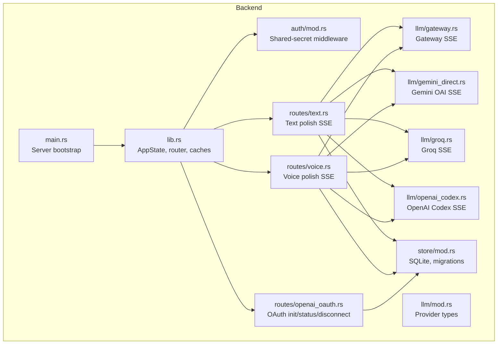
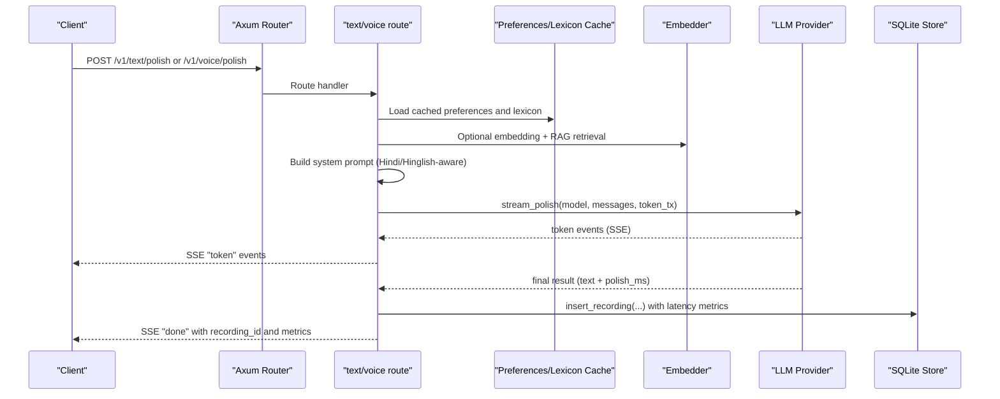
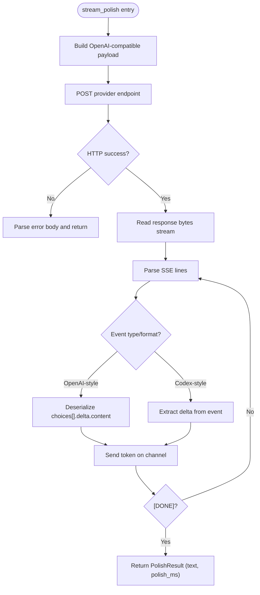
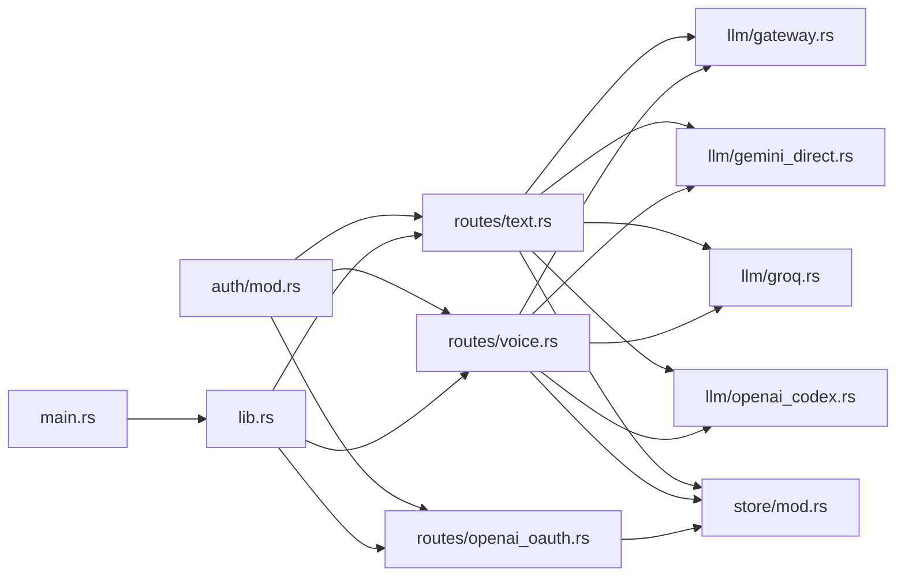

# Language Model Integration

<cite>
**Referenced Files in This Document**
- [main.rs](file://crates/backend/src/main.rs)
- [lib.rs](file://crates/backend/src/lib.rs)
- [auth/mod.rs](file://crates/backend/src/auth/mod.rs)
- [routes/text.rs](file://crates/backend/src/routes/text.rs)
- [routes/voice.rs](file://crates/backend/src/routes/voice.rs)
- [routes/openai_oauth.rs](file://crates/backend/src/routes/openai_oauth.rs)
- [llm/mod.rs](file://crates/backend/src/llm/mod.rs)
- [llm/gateway.rs](file://crates/backend/src/llm/gateway.rs)
- [llm/gemini_direct.rs](file://crates/backend/src/llm/gemini_direct.rs)
- [llm/groq.rs](file://crates/backend/src/llm/groq.rs)
- [llm/openai_codex.rs](file://crates/backend/src/llm/openai_codex.rs)
- [store/mod.rs](file://crates/backend/src/store/mod.rs)
</cite>

## Table of Contents
1. [Introduction](#introduction)
2. [Project Structure](#project-structure)
3. [Core Components](#core-components)
4. [Architecture Overview](#architecture-overview)
5. [Detailed Component Analysis](#detailed-component-analysis)
6. [Dependency Analysis](#dependency-analysis)
7. [Performance Considerations](#performance-considerations)
8. [Troubleshooting Guide](#troubleshooting-guide)
9. [Conclusion](#conclusion)

## Introduction
This document explains the language model integration system in WISPR Hindi Bridge. It covers the provider abstraction layer supporting multiple AI model providers (Gateway, OpenAI-compatible, Gemini, and Groq) with unified streaming interfaces. It documents the OpenAI-compatible API client implementations, SSE chunk parsing, model selection and provider switching, API key management, rate-limiting strategies, gateway pattern implementation, error handling and fallbacks, streaming token delivery, performance metrics collection, timeouts, authentication flows, endpoint routing, and provider-specific optimizations for Hindi/Hinglish processing.

## Project Structure
The backend is organized into modules:
- Application lifecycle and router: [main.rs](file://crates/backend/src/main.rs), [lib.rs](file://crates/backend/src/lib.rs)
- Authentication middleware: [auth/mod.rs](file://crates/backend/src/auth/mod.rs)
- LLM providers and streaming: [llm/mod.rs](file://crates/backend/src/llm/mod.rs), [llm/gateway.rs](file://crates/backend/src/llm/gateway.rs), [llm/gemini_direct.rs](file://crates/backend/src/llm/gemini_direct.rs), [llm/groq.rs](file://crates/backend/src/llm/groq.rs), [llm/openai_codex.rs](file://crates/backend/src/llm/openai_codex.rs)
- Routes for text and voice polishing: [routes/text.rs](file://crates/backend/src/routes/text.rs), [routes/voice.rs](file://crates/backend/src/routes/voice.rs)
- OAuth flow for OpenAI Codex: [routes/openai_oauth.rs](file://crates/backend/src/routes/openai_oauth.rs)
- Storage and migrations: [store/mod.rs](file://crates/backend/src/store/mod.rs)

**Diagram sources**
- [main.rs:18-145](file://crates/backend/src/main.rs#L18-L145)
- [lib.rs:150-227](file://crates/backend/src/lib.rs#L150-L227)
- [auth/mod.rs:19-38](file://crates/backend/src/auth/mod.rs#L19-L38)
- [routes/text.rs:47-266](file://crates/backend/src/routes/text.rs#L47-L266)
- [routes/voice.rs:85-460](file://crates/backend/src/routes/voice.rs#L85-L460)
- [routes/openai_oauth.rs:116-201](file://crates/backend/src/routes/openai_oauth.rs#L116-L201)
- [llm/mod.rs:1-17](file://crates/backend/src/llm/mod.rs#L1-L17)
- [llm/gateway.rs:39-186](file://crates/backend/src/llm/gateway.rs#L39-L186)
- [llm/gemini_direct.rs:41-139](file://crates/backend/src/llm/gemini_direct.rs#L41-L139)
- [llm/groq.rs:51-143](file://crates/backend/src/llm/groq.rs#L51-L143)
- [llm/openai_codex.rs:33-177](file://crates/backend/src/llm/openai_codex.rs#L33-L177)
- [store/mod.rs:32-165](file://crates/backend/src/store/mod.rs#L32-L165)

**Section sources**
- [main.rs:18-145](file://crates/backend/src/main.rs#L18-L145)
- [lib.rs:150-227](file://crates/backend/src/lib.rs#L150-L227)

## Core Components
- Provider abstraction and shared result:
  - A unified streaming result type captures the polished text and latency for all providers.
  - See [llm/mod.rs:12-17](file://crates/backend/src/llm/mod.rs#L12-L17).

- Gateway provider (OpenAI-compatible SSE):
  - Streams tokens via SSE with “data: ” lines, parses JSON chunks, and forwards tokens to a channel.
  - Supports timeouts and robust error reporting.
  - See [llm/gateway.rs:39-186](file://crates/backend/src/llm/gateway.rs#L39-L186).

- Gemini provider (OpenAI-compatible endpoint):
  - Mirrors Gateway’s SSE format and signature for drop-in replacement.
  - See [llm/gemini_direct.rs:41-139](file://crates/backend/src/llm/gemini_direct.rs#L41-L139).

- Groq provider (OpenAI-compatible endpoint):
  - Emphasizes fast TTFT with configurable model selection and temperature.
  - See [llm/groq.rs:51-143](file://crates/backend/src/llm/groq.rs#L51-L143).

- OpenAI Codex provider (OpenAI-compatible endpoint with distinct payload and SSE):
  - Uses a dedicated endpoint and SSE event type; includes token refresh logic.
  - See [llm/openai_codex.rs:33-177](file://crates/backend/src/llm/openai_codex.rs#L33-L177).

- Routing and provider switching:
  - Routes select provider and model based on user preferences and stored tokens.
  - See [routes/text.rs:142-187](file://crates/backend/src/routes/text.rs#L142-L187) and [routes/voice.rs:286-333](file://crates/backend/src/routes/voice.rs#L286-L333).

- Authentication and secrets:
  - Shared-secret bearer middleware protects local endpoints.
  - See [auth/mod.rs:19-38](file://crates/backend/src/auth/mod.rs#L19-L38).

- API keys and OAuth:
  - Keys are resolved from preferences or environment variables; OpenAI Codex uses OAuth tokens persisted in SQLite.
  - See [routes/text.rs:131-140](file://crates/backend/src/routes/text.rs#L131-L140) and [routes/voice.rs:146-159](file://crates/backend/src/routes/voice.rs#L146-L159).

**Section sources**
- [llm/mod.rs:12-17](file://crates/backend/src/llm/mod.rs#L12-L17)
- [llm/gateway.rs:39-186](file://crates/backend/src/llm/gateway.rs#L39-L186)
- [llm/gemini_direct.rs:41-139](file://crates/backend/src/llm/gemini_direct.rs#L41-L139)
- [llm/groq.rs:51-143](file://crates/backend/src/llm/groq.rs#L51-L143)
- [llm/openai_codex.rs:33-177](file://crates/backend/src/llm/openai_codex.rs#L33-L177)
- [routes/text.rs:131-187](file://crates/backend/src/routes/text.rs#L131-L187)
- [routes/voice.rs:146-333](file://crates/backend/src/routes/voice.rs#L146-L333)
- [auth/mod.rs:19-38](file://crates/backend/src/auth/mod.rs#L19-L38)

## Architecture Overview
The system exposes two primary SSE endpoints:
- Text polish: [routes/text.rs](file://crates/backend/src/routes/text.rs)
- Voice polish: [routes/voice.rs](file://crates/backend/src/routes/voice.rs)

Both routes:
- Load preferences and lexicon caches
- Optionally embed the input and retrieve RAG examples
- Build a system prompt tailored to Hindi/Hinglish
- Dispatch to a selected provider (Gateway, Gemini, Groq, or OpenAI Codex)
- Stream tokens via SSE until completion
- Persist recording with latency metrics

**Diagram sources**
- [routes/text.rs:67-260](file://crates/backend/src/routes/text.rs#L67-L260)
- [routes/voice.rs:125-414](file://crates/backend/src/routes/voice.rs#L125-L414)
- [llm/gateway.rs:39-186](file://crates/backend/src/llm/gateway.rs#L39-L186)
- [llm/gemini_direct.rs:41-139](file://crates/backend/src/llm/gemini_direct.rs#L41-L139)
- [llm/groq.rs:51-143](file://crates/backend/src/llm/groq.rs#L51-L143)
- [llm/openai_codex.rs:33-177](file://crates/backend/src/llm/openai_codex.rs#L33-L177)
- [store/mod.rs:32-165](file://crates/backend/src/store/mod.rs#L32-L165)

## Detailed Component Analysis

### Provider Abstraction and SSE Streaming
- Unified streaming interface:
  - All providers export a function with the same signature: stream_polish(client, api_key/access_token, model, system_prompt, user_message, token_tx) returning a shared result type containing polished text and latency.
  - See [llm/gateway.rs:39-186](file://crates/backend/src/llm/gateway.rs#L39-L186), [llm/gemini_direct.rs:41-139](file://crates/backend/src/llm/gemini_direct.rs#L41-L139), [llm/groq.rs:51-143](file://crates/backend/src/llm/groq.rs#L51-L143), [llm/openai_codex.rs:33-177](file://crates/backend/src/llm/openai_codex.rs#L33-L177).

- SSE parsing and token delivery:
  - Gateway and Gemini use OpenAI-compatible SSE chunks with choices[].delta.content.
  - Groq uses identical SSE format.
  - OpenAI Codex uses a different SSE event type and payload shape; the route adapts accordingly.
  - Tokens are forwarded on an async channel and emitted as SSE “token” events to the client.
  - See [llm/gateway.rs:93-134](file://crates/backend/src/llm/gateway.rs#L93-L134), [llm/gemini_direct.rs:90-132](file://crates/backend/src/llm/gemini_direct.rs#L90-L132), [llm/groq.rs:100-136](file://crates/backend/src/llm/groq.rs#L100-L136), [llm/openai_codex.rs:85-126](file://crates/backend/src/llm/openai_codex.rs#L85-L126).

- Timeouts and error handling:
  - Gateway and Gemini enforce a 120s timeout; Groq enforces 60s; blocking variant sets 60s.
  - Non-success HTTP statuses are parsed and surfaced with body previews.
  - Parsing errors are logged and ignored to keep streaming resilient.
  - See [llm/gateway.rs:78-87](file://crates/backend/src/llm/gateway.rs#L78-L87), [llm/gemini_direct.rs:76-88](file://crates/backend/src/llm/gemini_direct.rs#L76-L88), [llm/groq.rs:88-98](file://crates/backend/src/llm/groq.rs#L88-L98).

**Diagram sources**
- [llm/gateway.rs:62-139](file://crates/backend/src/llm/gateway.rs#L62-L139)
- [llm/gemini_direct.rs:60-137](file://crates/backend/src/llm/gemini_direct.rs#L60-L137)
- [llm/groq.rs:71-141](file://crates/backend/src/llm/groq.rs#L71-L141)
- [llm/openai_codex.rs:46-130](file://crates/backend/src/llm/openai_codex.rs#L46-L130)

**Section sources**
- [llm/gateway.rs:39-186](file://crates/backend/src/llm/gateway.rs#L39-L186)
- [llm/gemini_direct.rs:41-139](file://crates/backend/src/llm/gemini_direct.rs#L41-L139)
- [llm/groq.rs:51-143](file://crates/backend/src/llm/groq.rs#L51-L143)
- [llm/openai_codex.rs:33-177](file://crates/backend/src/llm/openai_codex.rs#L33-L177)

### Model Selection and Provider Switching
- Provider resolution:
  - The route selects provider and model based on preferences and stored tokens.
  - For OpenAI Codex, the route fetches an access token from storage; otherwise, it uses the configured provider.
  - See [routes/text.rs:142-187](file://crates/backend/src/routes/text.rs#L142-L187) and [routes/voice.rs:286-333](file://crates/backend/src/routes/voice.rs#L286-L333).

- Model identifiers:
  - Gateway and Gemini share the same OpenAI-compatible model semantics.
  - Groq exposes recommended models optimized for speed and Hinglish.
  - OpenAI Codex exposes model constants for smart and mini variants.
  - See [llm/groq.rs:30-33](file://crates/backend/src/llm/groq.rs#L30-L33), [llm/openai_codex.rs:29-32](file://crates/backend/src/llm/openai_codex.rs#L29-L32).

- Provider-specific optimizations:
  - Groq emphasizes low TTFT with configurable temperature.
  - OpenAI Codex supports token refresh and distinct SSE payload.
  - See [llm/groq.rs:74-75](file://crates/backend/src/llm/groq.rs#L74-L75), [llm/openai_codex.rs:142-177](file://crates/backend/src/llm/openai_codex.rs#L142-L177).

**Section sources**
- [routes/text.rs:142-187](file://crates/backend/src/routes/text.rs#L142-L187)
- [routes/voice.rs:286-333](file://crates/backend/src/routes/voice.rs#L286-L333)
- [llm/groq.rs:30-33](file://crates/backend/src/llm/groq.rs#L30-L33)
- [llm/openai_codex.rs:29-32](file://crates/backend/src/llm/openai_codex.rs#L29-L32)
- [llm/groq.rs:74-75](file://crates/backend/src/llm/groq.rs#L74-L75)
- [llm/openai_codex.rs:142-177](file://crates/backend/src/llm/openai_codex.rs#L142-L177)

### API Key Management and OAuth
- Key resolution order:
  - Prefer values stored in preferences; fall back to environment variables for development.
  - Gateway key also falls back to a shared API key helper.
  - See [routes/text.rs:131-140](file://crates/backend/src/routes/text.rs#L131-L140) and [routes/voice.rs:146-159](file://crates/backend/src/routes/voice.rs#L146-L159).

- OpenAI Codex OAuth:
  - Initiate flow builds PKCE challenge, spawns a one-shot callback server on localhost:1455, exchanges code for tokens, and stores them in SQLite.
  - Status endpoint reports connection state and expiration; disconnect removes tokens.
  - See [routes/openai_oauth.rs:116-201](file://crates/backend/src/routes/openai_oauth.rs#L116-L201), [routes/openai_oauth.rs:205-308](file://crates/backend/src/routes/openai_oauth.rs#L205-L308).

- Token refresh:
  - Refresh endpoint exchanges refresh_token for new access/refresh tokens and expiration.
  - See [llm/openai_codex.rs:142-177](file://crates/backend/src/llm/openai_codex.rs#L142-L177).

**Section sources**
- [routes/text.rs:131-140](file://crates/backend/src/routes/text.rs#L131-L140)
- [routes/voice.rs:146-159](file://crates/backend/src/routes/voice.rs#L146-L159)
- [routes/openai_oauth.rs:116-201](file://crates/backend/src/routes/openai_oauth.rs#L116-L201)
- [routes/openai_oauth.rs:205-308](file://crates/backend/src/routes/openai_oauth.rs#L205-L308)
- [llm/openai_codex.rs:142-177](file://crates/backend/src/llm/openai_codex.rs#L142-L177)

### Streaming Token Delivery and Metrics
- SSE streaming:
  - Tokens are emitted as SSE “token” events; the final “done” event carries recording metadata and latency breakdown.
  - See [routes/text.rs:189-259](file://crates/backend/src/routes/text.rs#L189-L259) and [routes/voice.rs:336-413](file://crates/backend/src/routes/voice.rs#L336-L413).

- Metrics collection:
  - Embedding time, polish latency, and total time are recorded and returned in the “done” event.
  - Voice route additionally includes STT confidence and timing.
  - See [routes/text.rs:209-259](file://crates/backend/src/routes/text.rs#L209-L259) and [routes/voice.rs:359-413](file://crates/backend/src/routes/voice.rs#L359-L413).

**Section sources**
- [routes/text.rs:189-259](file://crates/backend/src/routes/text.rs#L189-L259)
- [routes/voice.rs:336-413](file://crates/backend/src/routes/voice.rs#L336-L413)

### Authentication and Endpoint Routing
- Shared-secret bearer:
  - All authenticated routes require Authorization: Bearer <shared-secret>.
  - See [auth/mod.rs:19-38](file://crates/backend/src/auth/mod.rs#L19-L38).

- Router composition:
  - Public health endpoint plus authenticated routes for text/voice polish, preferences, history, vocabulary, and OAuth.
  - See [lib.rs:150-199](file://crates/backend/src/lib.rs#L150-L199).

- Server bootstrap:
  - Loads environment, opens DB, ensures default user, builds shared HTTP client, and binds listener.
  - See [main.rs:41-86](file://crates/backend/src/main.rs#L41-L86).

**Section sources**
- [auth/mod.rs:19-38](file://crates/backend/src/auth/mod.rs#L19-L38)
- [lib.rs:150-199](file://crates/backend/src/lib.rs#L150-L199)
- [main.rs:41-86](file://crates/backend/src/main.rs#L41-L86)

### Rate Limiting and Timeouts
- Timeouts:
  - Gateway and Gemini: 120 seconds
  - Groq: 60 seconds
  - Blocking variant: 60 seconds
  - See [llm/gateway.rs:78](file://crates/backend/src/llm/gateway.rs#L78), [llm/gemini_direct.rs:76](file://crates/backend/src/llm/gemini_direct.rs#L76), [llm/groq.rs:88](file://crates/backend/src/llm/groq.rs#L88).

- Connection pooling:
  - Shared HTTP client with idle pool settings to reuse connections efficiently.
  - See [main.rs:62-66](file://crates/backend/src/main.rs#L62-L66) and [lib.rs:210-214](file://crates/backend/src/lib.rs#L210-L214).

- Recommendations:
  - Consider per-route rate limits and circuit-breaker patterns for upstream providers.
  - Add jittered retries for transient network errors.

**Section sources**
- [llm/gateway.rs:78](file://crates/backend/src/llm/gateway.rs#L78)
- [llm/gemini_direct.rs:76](file://crates/backend/src/llm/gemini_direct.rs#L76)
- [llm/groq.rs:88](file://crates/backend/src/llm/groq.rs#L88)
- [main.rs:62-66](file://crates/backend/src/main.rs#L62-L66)
- [lib.rs:210-214](file://crates/backend/src/lib.rs#L210-L214)

### Hindi/Hinglish Optimizations
- Prompt engineering:
  - System prompts incorporate RAG examples, vocabulary terms, and soft corrections to tailor output for Hindi/Hinglish contexts.
  - See [routes/text.rs:118-128](file://crates/backend/src/routes/text.rs#L118-L128) and [routes/voice.rs:280-284](file://crates/backend/src/routes/voice.rs#L280-L284).

- Confidence-aware STT enrichment:
  - Voice route enriches transcripts with [word?XX%] markers for uncertain words, preserving uncertainty signals for the LLM.
  - See [routes/voice.rs:192-201](file://crates/backend/src/routes/voice.rs#L192-L201) and [routes/voice.rs:421-459](file://crates/backend/src/routes/voice.rs#L421-L459).

**Section sources**
- [routes/text.rs:118-128](file://crates/backend/src/routes/text.rs#L118-L128)
- [routes/voice.rs:192-201](file://crates/backend/src/routes/voice.rs#L192-L201)
- [routes/voice.rs:280-284](file://crates/backend/src/routes/voice.rs#L280-L284)
- [routes/voice.rs:421-459](file://crates/backend/src/routes/voice.rs#L421-L459)

## Dependency Analysis

**Diagram sources**
- [routes/text.rs:25-36](file://crates/backend/src/routes/text.rs#L25-L36)
- [routes/voice.rs:71-83](file://crates/backend/src/routes/voice.rs#L71-L83)
- [routes/openai_oauth.rs:24-28](file://crates/backend/src/routes/openai_oauth.rs#L24-L28)
- [auth/mod.rs:19-38](file://crates/backend/src/auth/mod.rs#L19-L38)
- [main.rs:78](file://crates/backend/src/main.rs#L78)
- [lib.rs:150-199](file://crates/backend/src/lib.rs#L150-L199)

**Section sources**
- [routes/text.rs:25-36](file://crates/backend/src/routes/text.rs#L25-L36)
- [routes/voice.rs:71-83](file://crates/backend/src/routes/voice.rs#L71-L83)
- [routes/openai_oauth.rs:24-28](file://crates/backend/src/routes/openai_oauth.rs#L24-L28)
- [auth/mod.rs:19-38](file://crates/backend/src/auth/mod.rs#L19-L38)
- [main.rs:78](file://crates/backend/src/main.rs#L78)
- [lib.rs:150-199](file://crates/backend/src/lib.rs#L150-L199)

## Performance Considerations
- Streaming-first design:
  - All providers stream tokens via SSE to minimize perceived latency.
  - See [llm/gateway.rs:89](file://crates/backend/src/llm/gateway.rs#L89), [llm/gemini_direct.rs:90](file://crates/backend/src/llm/gemini_direct.rs#L90), [llm/groq.rs:100](file://crates/backend/src/llm/groq.rs#L100), [llm/openai_codex.rs:80](file://crates/backend/src/llm/openai_codex.rs#L80).

- Parallelization:
  - Embedding and prompt construction overlap to reduce total latency.
  - See [routes/voice.rs:243-245](file://crates/backend/src/routes/voice.rs#L243-L245).

- Connection reuse:
  - Shared HTTP client with idle pool reduces handshake overhead.
  - See [main.rs:62-66](file://crates/backend/src/main.rs#L62-L66).

- Recommendations:
  - Add provider-side rate limiting and exponential backoff.
  - Instrument TTFT and throughput per provider.
  - Consider adaptive model selection based on latency targets.

[No sources needed since this section provides general guidance]

## Troubleshooting Guide
- Common errors:
  - Missing API keys: ensure preferences or environment variables are set.
  - Provider errors: inspect HTTP status and truncated body in logs.
  - SSE parsing failures: malformed chunks are logged and ignored to keep streaming alive.
  - See [llm/gateway.rs:84-87](file://crates/backend/src/llm/gateway.rs#L84-L87), [llm/gemini_direct.rs:81-88](file://crates/backend/src/llm/gemini_direct.rs#L81-L88), [llm/groq.rs:93-98](file://crates/backend/src/llm/groq.rs#L93-L98), [llm/openai_codex.rs:72-77](file://crates/backend/src/llm/openai_codex.rs#L72-L77).

- OAuth issues:
  - Verify callback server binding and state validation.
  - Use status endpoint to check token expiration.
  - See [routes/openai_oauth.rs:205-308](file://crates/backend/src/routes/openai_oauth.rs#L205-L308), [routes/openai_oauth.rs:172-193](file://crates/backend/src/routes/openai_oauth.rs#L172-L193).

- SSE delivery:
  - Ensure client consumes “token” events and handles “error” events gracefully.
  - See [routes/text.rs:189-207](file://crates/backend/src/routes/text.rs#L189-L207), [routes/voice.rs:336-357](file://crates/backend/src/routes/voice.rs#L336-L357).

**Section sources**
- [llm/gateway.rs:84-87](file://crates/backend/src/llm/gateway.rs#L84-L87)
- [llm/gemini_direct.rs:81-88](file://crates/backend/src/llm/gemini_direct.rs#L81-L88)
- [llm/groq.rs:93-98](file://crates/backend/src/llm/groq.rs#L93-L98)
- [llm/openai_codex.rs:72-77](file://crates/backend/src/llm/openai_codex.rs#L72-L77)
- [routes/openai_oauth.rs:205-308](file://crates/backend/src/routes/openai_oauth.rs#L205-L308)
- [routes/openai_oauth.rs:172-193](file://crates/backend/src/routes/openai_oauth.rs#L172-L193)
- [routes/text.rs:189-207](file://crates/backend/src/routes/text.rs#L189-L207)
- [routes/voice.rs:336-357](file://crates/backend/src/routes/voice.rs#L336-L357)

## Conclusion
WISPR Hindi Bridge integrates multiple LLM providers behind a unified streaming interface, enabling fast, reliable, and adaptable text polishing for Hindi/Hinglish. The gateway pattern allows seamless provider switching, while SSE streaming and metrics collection deliver responsive user experiences. Robust error handling, OAuth-based token management, and performance-conscious design ensure reliability across diverse deployment scenarios.

[No sources needed since this section summarizes without analyzing specific files]