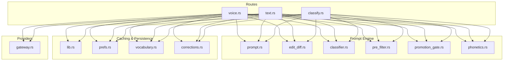
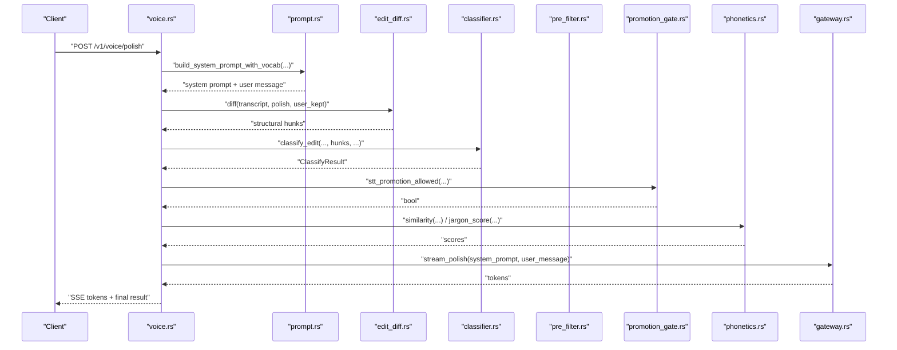
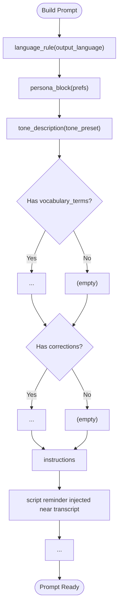
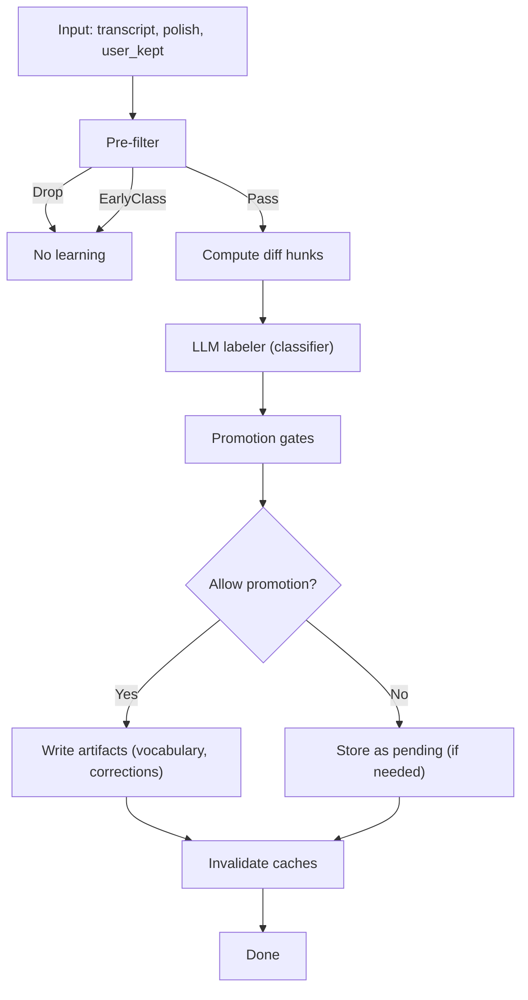
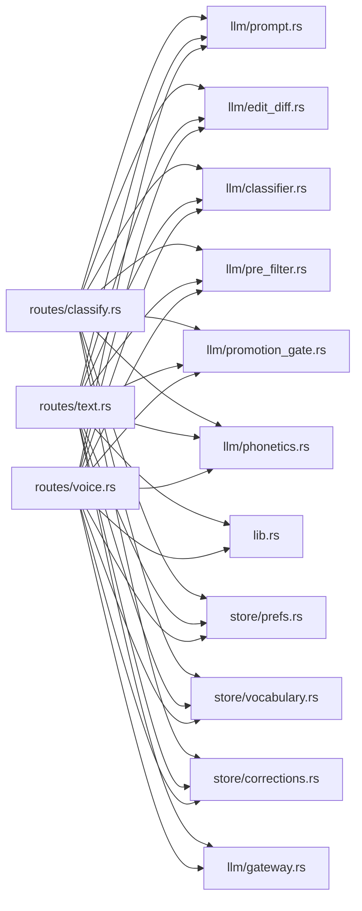

# Prompt Engineering System

<cite>
**Referenced Files in This Document**
- [prompt.rs](file://crates/backend/src/llm/prompt.rs)
- [classifier.rs](file://crates/backend/src/llm/classifier.rs)
- [pre_filter.rs](file://crates/backend/src/llm/pre_filter.rs)
- [edit_diff.rs](file://crates/backend/src/llm/edit_diff.rs)
- [phonetics.rs](file://crates/backend/src/llm/phonetics.rs)
- [promotion_gate.rs](file://crates/backend/src/llm/promotion_gate.rs)
- [lib.rs](file://crates/backend/src/lib.rs)
- [classify.rs](file://crates/backend/src/routes/classify.rs)
- [text.rs](file://crates/backend/src/routes/text.rs)
- [voice.rs](file://crates/backend/src/routes/voice.rs)
- [prefs.rs](file://crates/backend/src/store/prefs.rs)
- [corrections.rs](file://crates/backend/src/store/corrections.rs)
- [vocabulary.rs](file://crates/backend/src/store/vocabulary.rs)
- [gateway.rs](file://crates/backend/src/llm/gateway.rs)
</cite>

## Table of Contents
1. [Introduction](#introduction)
2. [Project Structure](#project-structure)
3. [Core Components](#core-components)
4. [Architecture Overview](#architecture-overview)
5. [Detailed Component Analysis](#detailed-component-analysis)
6. [Dependency Analysis](#dependency-analysis)
7. [Performance Considerations](#performance-considerations)
8. [Troubleshooting Guide](#troubleshooting-guide)
9. [Conclusion](#conclusion)
10. [Appendices](#appendices)

## Introduction
This document describes the prompt engineering system powering AI language processing in WISPR Hindi Bridge. It explains how prompts are designed and constructed, how context is injected, how roles and tones are encoded, and how classification and learning are performed. It covers the classification taxonomy, pre-filtering logic, dynamic prompt construction, caching strategies, safety and bias mitigation, and operational performance characteristics.

## Project Structure
The prompt system spans several modules:
- Prompt construction and injection: prompt builder, user message assembly, and language/script enforcement
- Learning pipeline: pre-filter, diff-based structural hunks, classifier, and promotion gates
- Route orchestration: voice and text polish endpoints
- Caching and persistence: preferences and lexicon caches, vocabulary and corrections stores
- Provider abstraction: streaming clients for multiple LLM providers

**Diagram sources**
- [voice.rs:1-460](file://crates/backend/src/routes/voice.rs#L1-L460)
- [text.rs:1-266](file://crates/backend/src/routes/text.rs#L1-L266)
- [classify.rs:1-423](file://crates/backend/src/routes/classify.rs#L1-L423)
- [prompt.rs:1-358](file://crates/backend/src/llm/prompt.rs#L1-L358)
- [edit_diff.rs:1-246](file://crates/backend/src/llm/edit_diff.rs#L1-L246)
- [classifier.rs:1-713](file://crates/backend/src/llm/classifier.rs#L1-L713)
- [pre_filter.rs:1-212](file://crates/backend/src/llm/pre_filter.rs#L1-L212)
- [promotion_gate.rs:1-307](file://crates/backend/src/llm/promotion_gate.rs#L1-L307)
- [phonetics.rs:1-242](file://crates/backend/src/llm/phonetics.rs#L1-L242)
- [lib.rs:1-227](file://crates/backend/src/lib.rs#L1-L227)
- [prefs.rs:1-163](file://crates/backend/src/store/prefs.rs#L1-L163)
- [vocabulary.rs:1-248](file://crates/backend/src/store/vocabulary.rs#L1-L248)
- [corrections.rs:1-136](file://crates/backend/src/store/corrections.rs#L1-L136)
- [gateway.rs:1-186](file://crates/backend/src/llm/gateway.rs#L1-L186)

**Section sources**
- [prompt.rs:1-358](file://crates/backend/src/llm/prompt.rs#L1-L358)
- [lib.rs:1-227](file://crates/backend/src/lib.rs#L1-L227)

## Core Components
- Prompt builder: constructs a layered system prompt with output language rules, role/persona, tone, vocabulary preservation, polish preferences, and task instructions. Includes a user message wrapper with a script reminder.
- Classification pipeline: four-stage process with pre-filter, diff-based hunks, LLM labeler, and promotion gates.
- Caching: preferences and lexicon hot caches to reduce database overhead and improve latency.
- Provider streaming: unified interface to multiple LLM providers with streaming token delivery.

Key responsibilities:
- Prompt template design: enforce output language and script, inject user preferences and vocabulary, and guide the model’s task.
- Context injection: RAG examples, vocabulary terms, and polish corrections are embedded into the system prompt safely.
- Role-based prompting: persona and tone presets shape model behavior; tray “Polish my message” uses a locked English prompt.
- Safety and quality: pre-filter rejects obvious non-learning shapes; classifier enforces strict JSON schema; promotion gates prevent hallucinations and inappropriate script mixing.

**Section sources**
- [prompt.rs:23-184](file://crates/backend/src/llm/prompt.rs#L23-L184)
- [classifier.rs:156-230](file://crates/backend/src/llm/classifier.rs#L156-L230)
- [pre_filter.rs:20-109](file://crates/backend/src/llm/pre_filter.rs#L20-L109)
- [lib.rs:29-69](file://crates/backend/src/lib.rs#L29-L69)
- [lib.rs:77-131](file://crates/backend/src/lib.rs#L77-L131)

## Architecture Overview
The system builds a layered prompt, streams tokens from the selected provider, and persists results. Learning occurs asynchronously via a classification endpoint that applies deterministic pre-filtering and diff-based structural analysis before invoking the LLM.

**Diagram sources**
- [voice.rs:85-419](file://crates/backend/src/routes/voice.rs#L85-L419)
- [prompt.rs:38-184](file://crates/backend/src/llm/prompt.rs#L38-L184)
- [edit_diff.rs:44-153](file://crates/backend/src/llm/edit_diff.rs#L44-L153)
- [classifier.rs:239-356](file://crates/backend/src/llm/classifier.rs#L239-L356)
- [promotion_gate.rs:294-346](file://crates/backend/src/llm/promotion_gate.rs#L294-L346)
- [phonetics.rs:136-192](file://crates/backend/src/llm/phonetics.rs#L136-L192)
- [gateway.rs:39-140](file://crates/backend/src/llm/gateway.rs#L39-L140)

## Detailed Component Analysis

### Prompt Template Design Patterns
- Layered structure: output language rule, role/persona, tone, vocabulary preservation, polish preferences, and task instructions.
- Injection safety: transcript is wrapped in tags and appended last; language/script enforcement blocks are placed first and at the bottom of the task.
- Parameter substitution: preferences (tone, custom prompt), vocabulary terms, and polish corrections are injected conditionally and formatted into blocks.
- Tray prompt: a specialized English-only prompt for “Polish my message” without RAG or persona.

**Diagram sources**
- [prompt.rs:38-184](file://crates/backend/src/llm/prompt.rs#L38-L184)
- [prompt.rs:219-228](file://crates/backend/src/llm/prompt.rs#L219-L228)
- [prompt.rs:244-275](file://crates/backend/src/llm/prompt.rs#L244-L275)

**Section sources**
- [prompt.rs:23-184](file://crates/backend/src/llm/prompt.rs#L23-L184)
- [prompt.rs:187-211](file://crates/backend/src/llm/prompt.rs#L187-L211)

### Context Injection Mechanisms
- RAG examples: retrieved via embeddings and injected into the system prompt as “preferences.”
- Vocabulary preservation: user-specific terms are listed with explicit instructions to keep them verbatim.
- Polish corrections: contextual corrections learned from prior edits are presented as “polish preferences.”

These contexts are built dynamically from user preferences, lexicon cache, and history.

**Section sources**
- [prompt.rs:106-127](file://crates/backend/src/llm/prompt.rs#L106-L127)
- [prompt.rs:60-84](file://crates/backend/src/llm/prompt.rs#L60-L84)
- [prompt.rs:86-104](file://crates/backend/src/llm/prompt.rs#L86-L104)
- [text.rs:84-103](file://crates/backend/src/routes/text.rs#L84-L103)
- [voice.rs:258-273](file://crates/backend/src/routes/voice.rs#L258-L273)

### Role-Based Prompting Strategies
- Persona: custom prompt if provided; otherwise a default personal writing assistant.
- Tone: preset-driven tone descriptions (“professional,” “casual,” “assertive,” “concise,” “neutral”).
- Tray override: English-only prompt with a locked tone for “Polish my message.”

**Section sources**
- [prompt.rs:277-284](file://crates/backend/src/llm/prompt.rs#L277-L284)
- [prompt.rs:286-296](file://crates/backend/src/llm/prompt.rs#L286-L296)
- [prompt.rs:192-211](file://crates/backend/src/llm/prompt.rs#L192-L211)

### Classification System and Learning Pipeline
- Four stages:
  1) Pre-filter: deterministic rejection of non-learning edits (drop, rewrite, script mismatch).
  2) Diff: structural hunks derived from polish vs user_kept.
  3) Classify: LLM labels each hunk and overall edit.
  4) Promotion gates: data-driven checks to allow vocabulary and correction promotions.

**Diagram sources**
- [classify.rs:85-291](file://crates/backend/src/routes/classify.rs#L85-L291)
- [pre_filter.rs:40-109](file://crates/backend/src/llm/pre_filter.rs#L40-L109)
- [edit_diff.rs:44-153](file://crates/backend/src/llm/edit_diff.rs#L44-L153)
- [classifier.rs:239-356](file://crates/backend/src/llm/classifier.rs#L239-L356)
- [promotion_gate.rs:294-346](file://crates/backend/src/llm/promotion_gate.rs#L294-L346)

**Section sources**
- [classify.rs:3-28](file://crates/backend/src/routes/classify.rs#L3-L28)
- [pre_filter.rs:20-109](file://crates/backend/src/llm/pre_filter.rs#L20-L109)
- [edit_diff.rs:28-41](file://crates/backend/src/llm/edit_diff.rs#L28-L41)
- [classifier.rs:106-140](file://crates/backend/src/llm/classifier.rs#L106-L140)

### Pre-Filtering Logic
- Drops edits where polish == user_kept or diff is vacuous.
- Flags user additions: large length delta, pure insertion, or significant prefix/suffix wrapping.
- Script-consistency check: rejects edits where user_kept script mismatches output language preference.

**Section sources**
- [pre_filter.rs:40-139](file://crates/backend/src/llm/pre_filter.rs#L40-L139)

### Dynamic Prompt Construction and Parameter Substitution
- System prompt assembled from:
  - Output language rule (absolute requirement)
  - Persona and tone
  - Optional vocabulary preservation block
  - Optional polish preferences block
  - Task instructions and final script reminder
- User message wraps transcript with a script reminder and tag-safe injection.

**Section sources**
- [prompt.rs:38-184](file://crates/backend/src/llm/prompt.rs#L38-L184)
- [prompt.rs:219-228](file://crates/backend/src/llm/prompt.rs#L219-L228)

### Prompt Caching Strategies
- Preferences hot-cache: TTL 30 seconds; invalidated on preference updates.
- Lexicon hot-cache: corrections + STT replacements; TTL 60 seconds; invalidated on writes.
- Shared HTTP client: connection pooling for provider calls.

**Section sources**
- [lib.rs:29-69](file://crates/backend/src/lib.rs#L29-L69)
- [lib.rs:77-131](file://crates/backend/src/lib.rs#L77-L131)
- [lib.rs:143-146](file://crates/backend/src/lib.rs#L143-L146)

### Prompt Evaluation, Metrics, and A/B Testing
- Metrics:
  - Latency breakdown: transcribe, embed, polish, total.
  - Examples used in RAG.
  - Learned artifacts and repeats.
- A/B testing:
  - Capture method policy determines auto-promotion eligibility.
  - Provider selection via preferences supports routing experiments.

Note: There is no explicit A/B testing framework in the code; provider routing and capture policy act as implicit experiment mechanisms.

**Section sources**
- [text.rs:209-260](file://crates/backend/src/routes/text.rs#L209-L260)
- [voice.rs:359-414](file://crates/backend/src/routes/voice.rs#L359-L414)
- [classify.rs:62-66](file://crates/backend/src/routes/classify.rs#L62-L66)
- [classify.rs:150-159](file://crates/backend/src/routes/classify.rs#L150-L159)

### Safety Measures, Bias Mitigation, and Quality Assurance
- Hallucination prevention:
  - Classifier schema enforces strict JSON and rejects missing labels.
  - Extraction validation requires whole-word substrings within windows.
- Script enforcement:
  - Gates ensure candidate script matches output language preference.
  - Concatenation pattern detection prevents insertion-without-deletion artifacts.
- Negative signals:
  - Demotion pass reduces weights for vocabulary terms removed by the user.
- Jargon detection:
  - Phonetic similarity and jargon scoring inform promotion decisions.

**Section sources**
- [classifier.rs:386-493](file://crates/backend/src/llm/classifier.rs#L386-L493)
- [promotion_gate.rs:23-66](file://crates/backend/src/llm/promotion_gate.rs#L23-L66)
- [promotion_gate.rs:89-115](file://crates/backend/src/llm/promotion_gate.rs#L89-L115)
- [classify.rs:359-377](file://crates/backend/src/routes/classify.rs#L359-L377)
- [phonetics.rs:161-192](file://crates/backend/src/llm/phonetics.rs#L161-L192)

## Dependency Analysis
The prompt system integrates tightly with routes, stores, and providers. Routes load preferences and lexicon caches, construct prompts, and stream tokens. Stores manage vocabulary and corrections. Providers encapsulate external LLM APIs.

**Diagram sources**
- [voice.rs:85-419](file://crates/backend/src/routes/voice.rs#L85-L419)
- [text.rs:47-266](file://crates/backend/src/routes/text.rs#L47-L266)
- [classify.rs:85-291](file://crates/backend/src/routes/classify.rs#L85-L291)
- [prompt.rs:1-358](file://crates/backend/src/llm/prompt.rs#L1-L358)
- [edit_diff.rs:1-246](file://crates/backend/src/llm/edit_diff.rs#L1-L246)
- [classifier.rs:1-713](file://crates/backend/src/llm/classifier.rs#L1-L713)
- [pre_filter.rs:1-212](file://crates/backend/src/llm/pre_filter.rs#L1-L212)
- [promotion_gate.rs:1-307](file://crates/backend/src/llm/promotion_gate.rs#L1-L307)
- [phonetics.rs:1-242](file://crates/backend/src/llm/phonetics.rs#L1-L242)
- [lib.rs:1-227](file://crates/backend/src/lib.rs#L1-L227)
- [prefs.rs:1-163](file://crates/backend/src/store/prefs.rs#L1-L163)
- [vocabulary.rs:1-248](file://crates/backend/src/store/vocabulary.rs#L1-L248)
- [corrections.rs:1-136](file://crates/backend/src/store/corrections.rs#L1-L136)
- [gateway.rs:1-186](file://crates/backend/src/llm/gateway.rs#L1-L186)

**Section sources**
- [voice.rs:71-83](file://crates/backend/src/routes/voice.rs#L71-L83)
- [text.rs:23-36](file://crates/backend/src/routes/text.rs#L23-L36)
- [classify.rs:34-44](file://crates/backend/src/routes/classify.rs#L34-L44)

## Performance Considerations
- Caching:
  - Preferences cache (30s TTL) and lexicon cache (60s TTL) reduce DB queries and improve throughput.
- Concurrency:
  - Embedding computation runs concurrently with prompt building in voice polish.
  - Parallel reads for corrections and STT replacements.
- Streaming:
  - Provider clients stream tokens to the UI for immediate feedback.
- Provider routing:
  - Flexible provider selection allows balancing latency and quality.

[No sources needed since this section provides general guidance]

## Troubleshooting Guide
Common issues and mitigations:
- Classifier unavailable: endpoint gracefully returns a safe default classification and reason.
- Empty hunks or pre-filter drops: indicates no structural change or non-learning shape.
- Script mismatch: user_kept in a different script than output language triggers a rephrase classification.
- Hallucinated corrections: extraction validation and gates prevent promotions outside the actual text.
- Capture method restrictions: low-confidence capture disables auto-promotion; writes pending edits for review.

**Section sources**
- [classify.rs:150-168](file://crates/backend/src/routes/classify.rs#L150-L168)
- [classify.rs:115-135](file://crates/backend/src/routes/classify.rs#L115-L135)
- [classify.rs:90-99](file://crates/backend/src/routes/classify.rs#L90-L99)
- [promotion_gate.rs:23-66](file://crates/backend/src/llm/promotion_gate.rs#L23-L66)
- [classify.rs:182-188](file://crates/backend/src/routes/classify.rs#L182-L188)

## Conclusion
The prompt engineering system in WISPR Hindi Bridge combines robust prompt design, deterministic pre-filtering, diff-based structural analysis, and strict safety gates to ensure reliable, safe, and high-quality language processing. Caching and streaming optimize performance, while provider flexibility enables experimentation and scalability.

## Appendices

### Prompt Template Blocks Reference
- Output language rule: absolute requirement for script and language.
- Role/persona: customizable or default assistant persona.
- Tone: preset-driven tone description.
- Personal vocabulary: preserve-verbatim instructions for user terms.
- Polish preferences: contextual corrections learned from prior edits.
- Task: detailed instructions for handling STT uncertainty, dictation patterns, disfluencies, and output rules.
- Script final check: enforced before generation begins.

**Section sources**
- [prompt.rs:244-275](file://crates/backend/src/llm/prompt.rs#L244-L275)
- [prompt.rs:277-284](file://crates/backend/src/llm/prompt.rs#L277-L284)
- [prompt.rs:286-296](file://crates/backend/src/llm/prompt.rs#L286-L296)
- [prompt.rs:60-84](file://crates/backend/src/llm/prompt.rs#L60-L84)
- [prompt.rs:86-104](file://crates/backend/src/llm/prompt.rs#L86-L104)
- [prompt.rs:129-184](file://crates/backend/src/llm/prompt.rs#L129-L184)
- [prompt.rs:232-242](file://crates/backend/src/llm/prompt.rs#L232-L242)