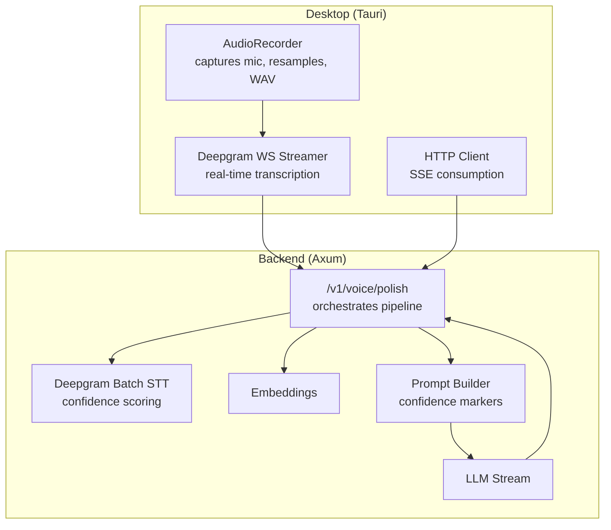
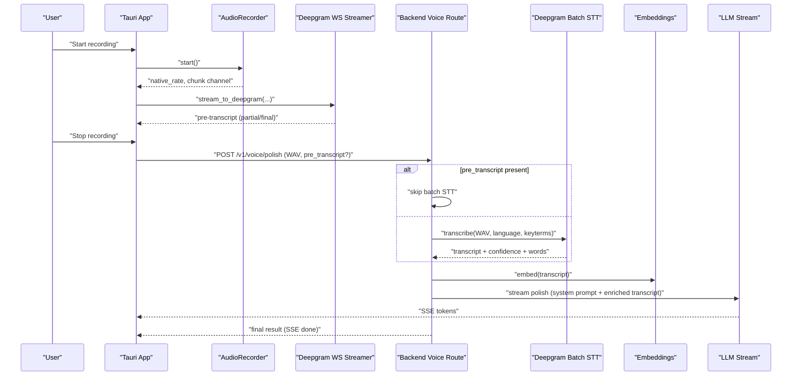
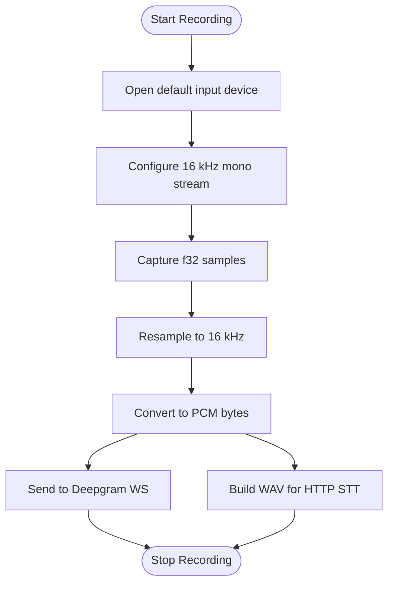
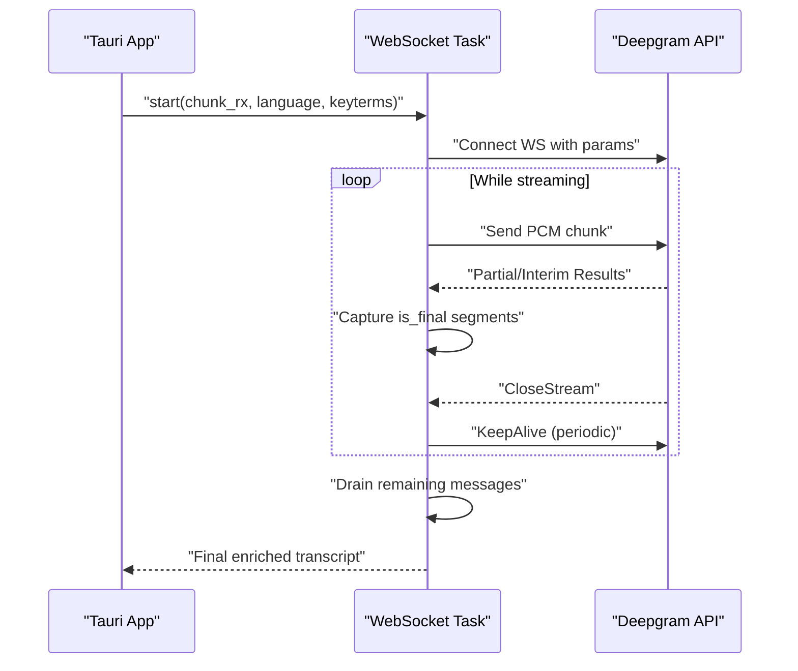
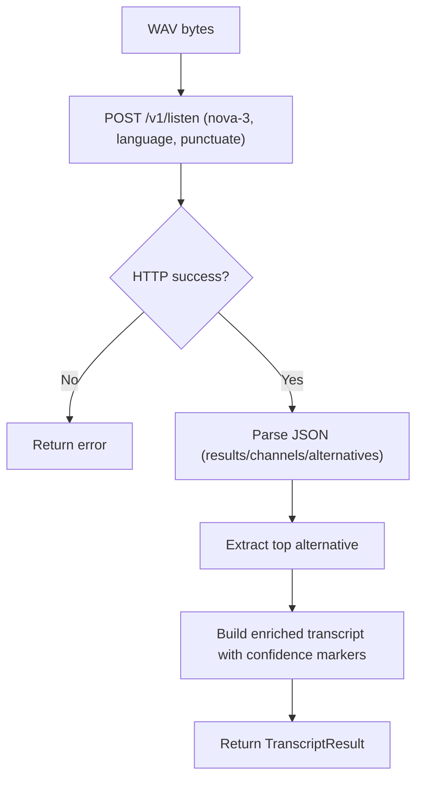
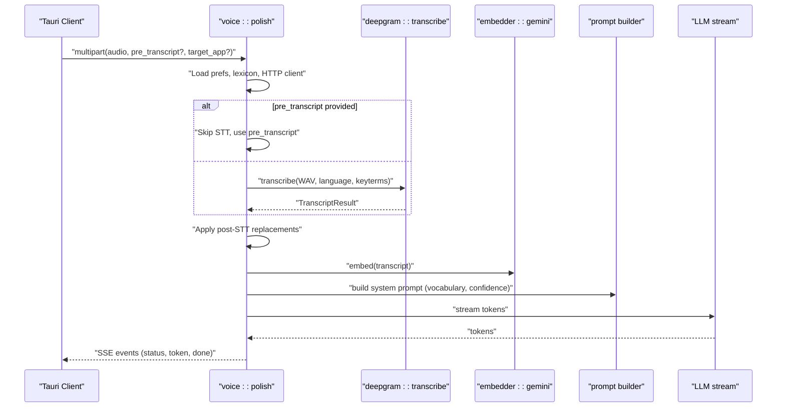
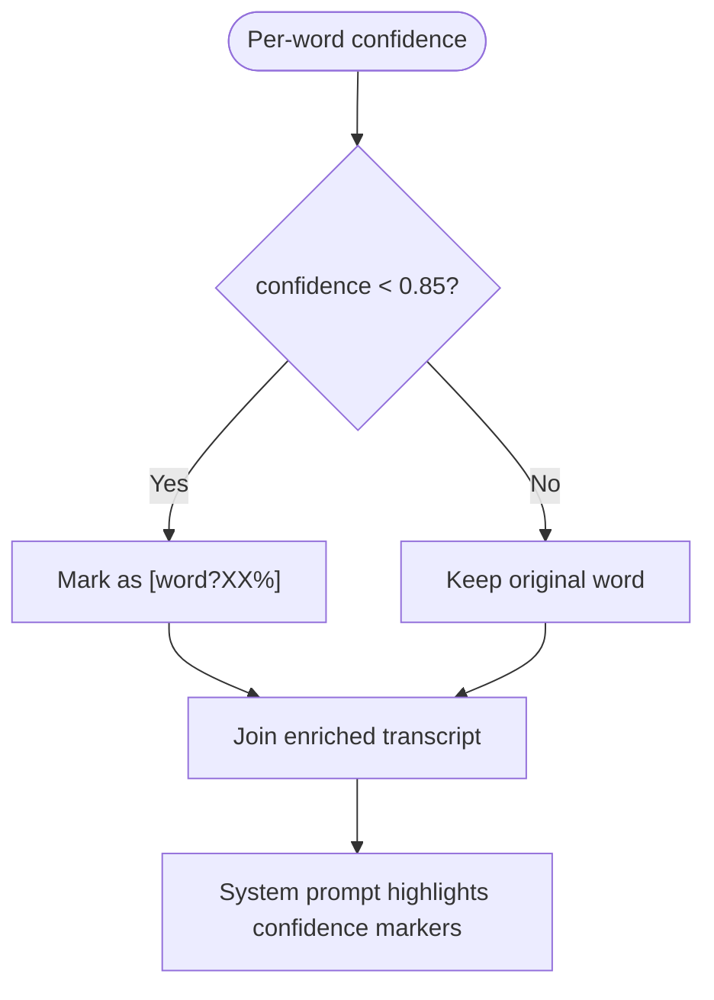
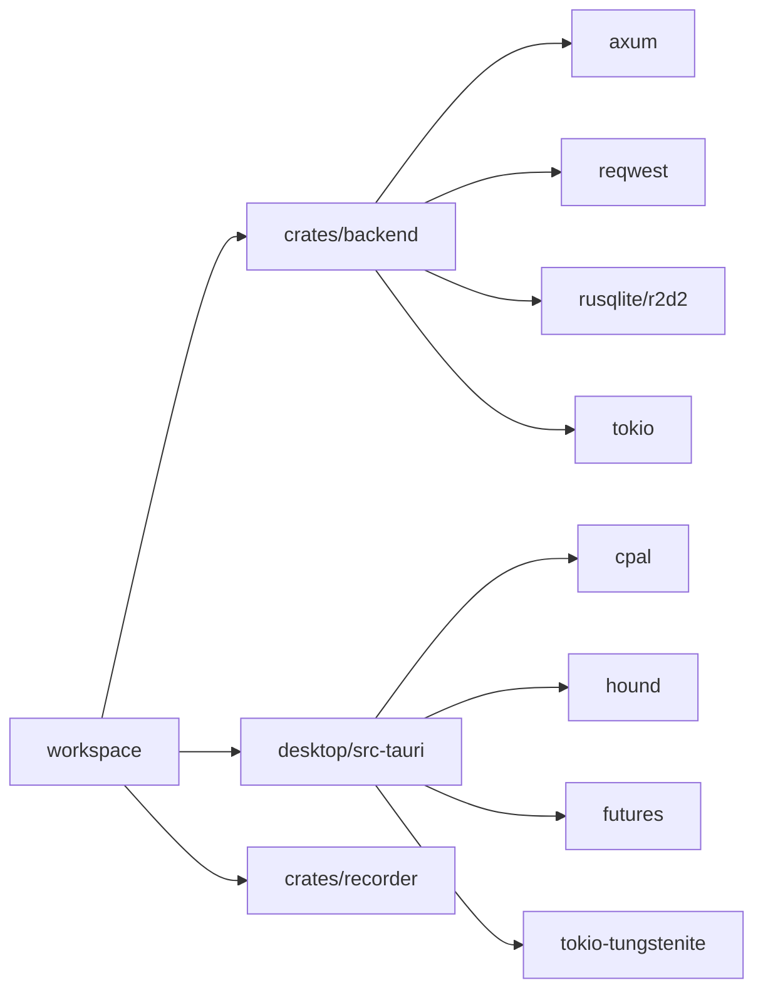

# Speech Processing Integration

<cite>
**Referenced Files in This Document**
- [Cargo.toml](file://Cargo.toml)
- [crates/backend/Cargo.toml](file://crates/backend/Cargo.toml)
- [crates/backend/src/lib.rs](file://crates/backend/src/lib.rs)
- [crates/backend/src/stt/mod.rs](file://crates/backend/src/stt/mod.rs)
- [crates/backend/src/stt/deepgram.rs](file://crates/backend/src/stt/deepgram.rs)
- [crates/backend/src/routes/voice.rs](file://crates/backend/src/routes/voice.rs)
- [crates/backend/src/store/vocabulary.rs](file://crates/backend/src/store/vocabulary.rs)
- [crates/backend/src/store/stt_replacements.rs](file://crates/backend/src/store/stt_replacements.rs)
- [crates/backend/src/llm/prompt.rs](file://crates/backend/src/llm/prompt.rs)
- [crates/recorder/src/lib.rs](file://crates/recorder/src/lib.rs)
- [desktop/src-tauri/src/dg_stream.rs](file://desktop/src-tauri/src/dg_stream.rs)
- [desktop/src-tauri/src/main.rs](file://desktop/src-tauri/src/main.rs)
- [desktop/src-tauri/src/api.rs](file://desktop/src-tauri/src/api.rs)
</cite>

## Table of Contents
1. [Introduction](#introduction)
2. [Project Structure](#project-structure)
3. [Core Components](#core-components)
4. [Architecture Overview](#architecture-overview)
5. [Detailed Component Analysis](#detailed-component-analysis)
6. [Dependency Analysis](#dependency-analysis)
7. [Performance Considerations](#performance-considerations)
8. [Troubleshooting Guide](#troubleshooting-guide)
9. [Conclusion](#conclusion)

## Introduction
This document explains the speech-to-text integration with the Deepgram API in the WISPR Hindi Bridge. It covers the audio processing pipeline, confidence scoring, real-time transcription workflows, and the end-to-end integration with the backend language processing pipeline. It also documents authentication, endpoint configuration, streaming audio handling, Hindi/Hinglish-specific optimizations, confidence thresholds, partial result processing, final transcription assembly, error handling, and latency optimization strategies.

## Project Structure
The integration spans three layers:
- Desktop client (Tauri) handles recording, real-time streaming to Deepgram, and SSE consumption.
- Backend service (Axum) orchestrates STT, embeddings, RAG, and LLM processing.
- Shared libraries provide audio capture, vocabulary, and prompt construction.

**Diagram sources**
- [crates/recorder/src/lib.rs:1-235](file://crates/recorder/src/lib.rs#L1-L235)
- [desktop/src-tauri/src/dg_stream.rs:1-500](file://desktop/src-tauri/src/dg_stream.rs#L1-L500)
- [desktop/src-tauri/src/api.rs:1-800](file://desktop/src-tauri/src/api.rs#L1-L800)
- [crates/backend/src/routes/voice.rs:1-460](file://crates/backend/src/routes/voice.rs#L1-L460)
- [crates/backend/src/stt/deepgram.rs:1-200](file://crates/backend/src/stt/deepgram.rs#L1-L200)
- [crates/backend/src/llm/prompt.rs:1-358](file://crates/backend/src/llm/prompt.rs#L1-L358)

**Section sources**
- [Cargo.toml:1-30](file://Cargo.toml#L1-L30)
- [crates/backend/Cargo.toml:1-42](file://crates/backend/Cargo.toml#L1-L42)

## Core Components
- AudioRecorder: Captures microphone input, resamples to 16 kHz, converts to WAV, and exposes a channel for real-time streaming.
- Deepgram WebSocket Streamer: Streams raw PCM chunks to Deepgram, receives partial and final results, and assembles a final transcript.
- Deepgram Batch STT: Sends WAV to Deepgram’s HTTP batch API for transcription with confidence and per-word data.
- Voice Route: Orchestrates preferences loading, vocabulary biasing, STT (batch or pre-transcript), post-processing, embeddings, RAG, and LLM streaming.
- Prompt Builder: Builds a system prompt that emphasizes confidence markers and personal vocabulary.
- Vocabulary and STT Replacement Stores: Provide personal terms and post-STT corrections to improve accuracy.

**Section sources**
- [crates/recorder/src/lib.rs:1-235](file://crates/recorder/src/lib.rs#L1-L235)
- [desktop/src-tauri/src/dg_stream.rs:1-500](file://desktop/src-tauri/src/dg_stream.rs#L1-L500)
- [crates/backend/src/stt/deepgram.rs:1-200](file://crates/backend/src/stt/deepgram.rs#L1-L200)
- [crates/backend/src/routes/voice.rs:1-460](file://crates/backend/src/routes/voice.rs#L1-L460)
- [crates/backend/src/llm/prompt.rs:1-358](file://crates/backend/src/llm/prompt.rs#L1-L358)
- [crates/backend/src/store/vocabulary.rs:1-248](file://crates/backend/src/store/vocabulary.rs#L1-L248)
- [crates/backend/src/store/stt_replacements.rs:1-312](file://crates/backend/src/store/stt_replacements.rs#L1-L312)

## Architecture Overview
The system supports two STT paths:
- Real-time Deepgram WebSocket streaming (P5): Starts at recording begin, streams PCM chunks, and returns a pre-transcript by the time recording stops.
- HTTP batch STT: Used when WebSocket fails or returns insufficient content.

The backend route integrates:
- Preferences and vocabulary loading
- Optional pre-transcript from WebSocket
- Deepgram batch STT (if needed)
- Post-STT replacements and confidence enrichment
- Embeddings and RAG
- LLM polish stream with SSE

**Diagram sources**
- [desktop/src-tauri/src/main.rs:800-1080](file://desktop/src-tauri/src/main.rs#L800-L1080)
- [desktop/src-tauri/src/dg_stream.rs:1-500](file://desktop/src-tauri/src/dg_stream.rs#L1-L500)
- [crates/recorder/src/lib.rs:1-235](file://crates/recorder/src/lib.rs#L1-L235)
- [crates/backend/src/routes/voice.rs:1-460](file://crates/backend/src/routes/voice.rs#L1-L460)
- [crates/backend/src/stt/deepgram.rs:1-200](file://crates/backend/src/stt/deepgram.rs#L1-L200)

## Detailed Component Analysis

### Audio Processing Pipeline
- Microphone capture: Uses cpal to open the default input device and configure a 16 kHz mono stream.
- Resampling: Converts captured f32 samples to 16 kHz using linear interpolation.
- Real-time streaming: Exposes a channel for the WebSocket task to read PCM chunks and send them to Deepgram.
- WAV generation: On stop, resamples to 16 kHz, clamps amplitudes, and writes a WAV file for HTTP STT.

**Diagram sources**
- [crates/recorder/src/lib.rs:69-218](file://crates/recorder/src/lib.rs#L69-L218)

**Section sources**
- [crates/recorder/src/lib.rs:1-235](file://crates/recorder/src/lib.rs#L1-L235)

### Deepgram WebSocket Streaming (P5)
- Connects to Deepgram WS with model nova-3, language, punctuation, encoding, sample rate, channels, interim results, endpointing, and utterance end.
- Biasing: Up to 100 vocabulary terms passed as keyterm parameters.
- Streaming loop: Sends PCM chunks, handles KeepAlive, captures Results with is_final and speech_final, and drains remaining messages after CloseStream.
- Transcript assembly: Joins enriched segments and strips confidence markers for embedding.

**Diagram sources**
- [desktop/src-tauri/src/dg_stream.rs:37-388](file://desktop/src-tauri/src/dg_stream.rs#L37-L388)

**Section sources**
- [desktop/src-tauri/src/dg_stream.rs:1-500](file://desktop/src-tauri/src/dg_stream.rs#L1-L500)

### Deepgram Batch STT
- Endpoint: POST /v1/listen with model nova-3, language, and punctuation enabled.
- Biasing: Up to 100 keyterms appended to the URL.
- Response parsing: Extracts top alternative, overall confidence, and per-word data.
- Confidence enrichment: Marks low-confidence words with [word?XX%] markers for the LLM.

**Diagram sources**
- [crates/backend/src/stt/deepgram.rs:59-146](file://crates/backend/src/stt/deepgram.rs#L59-L146)

**Section sources**
- [crates/backend/src/stt/deepgram.rs:1-200](file://crates/backend/src/stt/deepgram.rs#L1-L200)

### Voice Route Orchestration
- Loads preferences, vocabulary, and lexicon caches.
- Accepts pre_transcript from WebSocket to skip batch STT.
- Applies post-STT replacements to both plain and enriched transcripts.
- Builds system prompt with personal vocabulary and confidence instructions.
- Streams LLM tokens via SSE and persists results.

**Diagram sources**
- [crates/backend/src/routes/voice.rs:85-419](file://crates/backend/src/routes/voice.rs#L85-L419)

**Section sources**
- [crates/backend/src/routes/voice.rs:1-460](file://crates/backend/src/routes/voice.rs#L1-L460)

### Confidence Scoring and Threshold Management
- Threshold: Words with confidence below 0.85 are marked as uncertain.
- Enrichment: Per-word confidence is embedded as [word?XX%] in the enriched transcript.
- Prompt emphasis: The system prompt instructs the LLM to pay special attention to confidence markers and contextually prefer vocabulary terms when phonetically similar.

**Diagram sources**
- [crates/backend/src/stt/deepgram.rs:148-166](file://crates/backend/src/stt/deepgram.rs#L148-L166)
- [crates/backend/src/llm/prompt.rs:139-183](file://crates/backend/src/llm/prompt.rs#L139-L183)

**Section sources**
- [crates/backend/src/stt/deepgram.rs:12-16](file://crates/backend/src/stt/deepgram.rs#L12-L16)
- [crates/backend/src/llm/prompt.rs:139-183](file://crates/backend/src/llm/prompt.rs#L139-L183)

### Partial Results and Final Assembly
- WebSocket: Captures is_final=true segments and joins them into a transcript; continues draining for up to 500 ms after speech_final or UtteranceEnd to collect additional fragments.
- Batch STT: Uses top alternative and per-word data to construct enriched text.

**Section sources**
- [desktop/src-tauri/src/dg_stream.rs:260-388](file://desktop/src-tauri/src/dg_stream.rs#L260-L388)
- [crates/backend/src/stt/deepgram.rs:122-146](file://crates/backend/src/stt/deepgram.rs#L122-L146)

### Language-Specific Optimizations (Hindi/Hinglish)
- Language defaults: Falls back to "hi" when language is empty or "auto".
- Endpointing: Uses 500 ms for Hindi/multi to reduce premature segment splits.
- Personal vocabulary: Bias terms improve recognition of jargon, names, brands, and technical terms.
- Post-STT replacements: Applies exact and phonetic fuzzy matches to correct persistent mishears.

**Section sources**
- [crates/backend/src/stt/deepgram.rs:66-84](file://crates/backend/src/stt/deepgram.rs#L66-L84)
- [desktop/src-tauri/src/dg_stream.rs:51-84](file://desktop/src-tauri/src/dg_stream.rs#L51-L84)
- [crates/backend/src/store/vocabulary.rs:105-141](file://crates/backend/src/store/vocabulary.rs#L105-L141)
- [crates/backend/src/store/stt_replacements.rs:133-190](file://crates/backend/src/store/stt_replacements.rs#L133-L190)

### Integration with Language Processing Pipeline
- Prompt builder constructs a structured system prompt that:
  - Enforces output language/script rules
  - Instructs the LLM to honor personal vocabulary verbatim
  - Emphasizes confidence markers and context-based corrections
- Embeddings and RAG: Parallelized embedding computation and retrieval of similar examples to personalize polish.

**Section sources**
- [crates/backend/src/llm/prompt.rs:23-184](file://crates/backend/src/llm/prompt.rs#L23-L184)
- [crates/backend/src/routes/voice.rs:236-273](file://crates/backend/src/routes/voice.rs#L236-L273)

### Timing and Latency Optimization Strategies
- P5 WebSocket streaming: Starts at recording begin; transcript ready by stop, reducing STT latency.
- Hot-path caching: Preferences and vocabulary loaded once and reused to avoid network calls on the critical path.
- Shared HTTP client: Keeps connections alive across requests.
- Parallelization: Embedding and prompt building overlap with LLM streaming.

**Section sources**
- [desktop/src-tauri/src/main.rs:902-961](file://desktop/src-tauri/src/main.rs#L902-L961)
- [crates/backend/src/lib.rs:23-131](file://crates/backend/src/lib.rs#L23-L131)

## Dependency Analysis
The workspace uses a shared dependency resolver and builds both backend and desktop components. The backend depends on Axum, reqwest, SQLite, and Tokio; the desktop integrates cpal, hound, futures, and tokio-tungstenite for audio and WebSocket handling.

**Diagram sources**
- [Cargo.toml:1-30](file://Cargo.toml#L1-L30)
- [crates/backend/Cargo.toml:14-42](file://crates/backend/Cargo.toml#L14-L42)

**Section sources**
- [Cargo.toml:1-30](file://Cargo.toml#L1-L30)
- [crates/backend/Cargo.toml:1-42](file://crates/backend/Cargo.toml#L1-L42)

## Performance Considerations
- Audio resampling reduces payload size for STT uploads.
- Keep-alive and drain strategies ensure Deepgram finalizes results promptly.
- Parallel embedding and prompt building minimize end-to-end latency.
- Hot-path caches reduce database and network overhead on the critical path.

[No sources needed since this section provides general guidance]

## Troubleshooting Guide
Common error categories and handling:
- Empty transcript or silence: Detected during recording and STT; backend returns user-friendly messages.
- Authentication failures: 401/403 from Deepgram mapped to guidance about API key configuration.
- Rate limiting: 429 errors surfaced as “rate-limited” messages.
- Network timeouts: Mapped to “connection took too long” guidance.
- WebSocket errors: Logged and retried via HTTP STT fallback.

**Section sources**
- [desktop/src-tauri/src/main.rs:76-128](file://desktop/src-tauri/src/main.rs#L76-L128)
- [desktop/src-tauri/src/dg_stream.rs:148-253](file://desktop/src-tauri/src/dg_stream.rs#L148-L253)
- [crates/backend/src/stt/deepgram.rs:97-102](file://crates/backend/src/stt/deepgram.rs#L97-L102)
- [crates/backend/src/routes/voice.rs:202-209](file://crates/backend/src/routes/voice.rs#L202-L209)

## Conclusion
The WISPR Hindi Bridge integrates Deepgram via both real-time WebSocket streaming and HTTP batch STT, with robust confidence scoring, personal vocabulary biasing, and a language-aware prompt pipeline. The system prioritizes low-latency transcription and polish, with careful error handling and user-friendly messaging. The modular design enables efficient audio capture, flexible STT paths, and scalable backend orchestration.