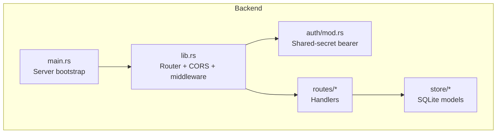
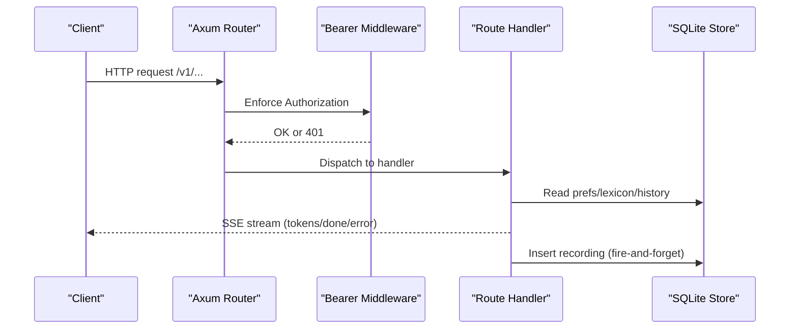
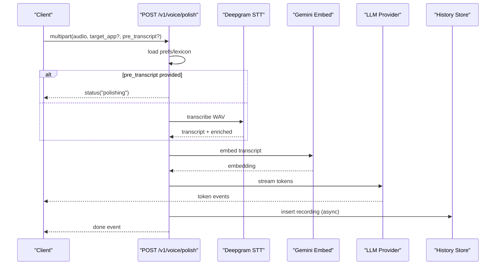
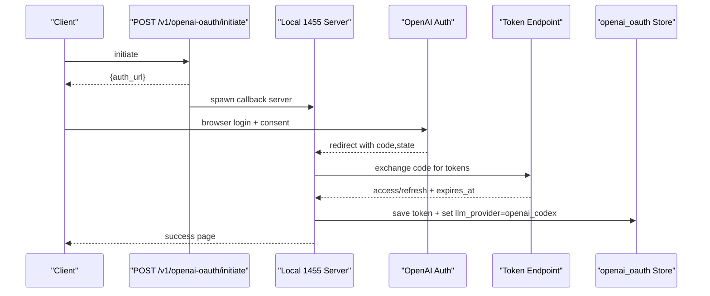
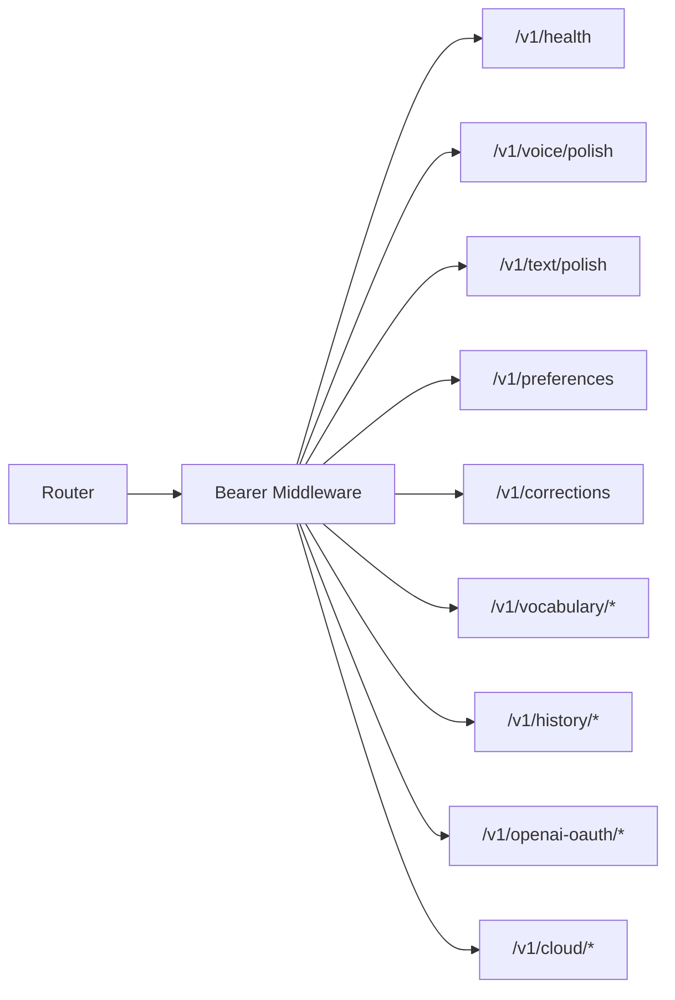

# API Reference

<cite>
**Referenced Files in This Document**
- [main.rs](file://crates/backend/src/main.rs)
- [lib.rs](file://crates/backend/src/lib.rs)
- [auth/mod.rs](file://crates/backend/src/auth/mod.rs)
- [routes/mod.rs](file://crates/backend/src/routes/mod.rs)
- [routes/health.rs](file://crates/backend/src/routes/health.rs)
- [routes/voice.rs](file://crates/backend/src/routes/voice.rs)
- [routes/text.rs](file://crates/backend/src/routes/text.rs)
- [routes/history.rs](file://crates/backend/src/routes/history.rs)
- [routes/vocabulary.rs](file://crates/backend/src/routes/vocabulary.rs)
- [routes/prefs.rs](file://crates/backend/src/routes/prefs.rs)
- [routes/openai_oauth.rs](file://crates/backend/src/routes/openai_oauth.rs)
- [routes/cloud.rs](file://crates/backend/src/routes/cloud.rs)
- [store/prefs.rs](file://crates/backend/src/store/prefs.rs)
- [store/history.rs](file://crates/backend/src/store/history.rs)
- [store/vocabulary.rs](file://crates/backend/src/store/vocabulary.rs)
- [store/openai_oauth.rs](file://crates/backend/src/store/openai_oauth.rs)
</cite>

## Table of Contents
1. [Introduction](#introduction)
2. [Project Structure](#project-structure)
3. [Core Components](#core-components)
4. [Architecture Overview](#architecture-overview)
5. [Detailed Component Analysis](#detailed-component-analysis)
6. [Dependency Analysis](#dependency-analysis)
7. [Performance Considerations](#performance-considerations)
8. [Troubleshooting Guide](#troubleshooting-guide)
9. [Conclusion](#conclusion)
10. [Appendices](#appendices)

## Introduction
This document describes the WISPR Hindi Bridge backend API. It covers all REST endpoints, authentication, request/response schemas, streaming behavior, and operational details. The backend is a Rust Axum service that exposes a versioned API under /v1, protected by a shared-secret bearer token. It supports:
- Health checks
- Real-time voice processing via streaming
- Text-only processing via streaming
- History management (listing, deletion, audio retrieval)
- Vocabulary management (personalized STT bias)
- Preferences and corrections
- Cloud token bridging
- OpenAI OAuth 2.0 with PKCE for ChatGPT access

## Project Structure
The backend is organized into:
- Entry point and application state
- Routing and middleware
- Feature-specific route handlers
- Storage modules for preferences, history, vocabulary, and OAuth tokens

**Diagram sources**
- [main.rs:18-145](file://crates/backend/src/main.rs#L18-L145)
- [lib.rs:150-199](file://crates/backend/src/lib.rs#L150-L199)
- [auth/mod.rs:19-37](file://crates/backend/src/auth/mod.rs#L19-L37)
- [routes/mod.rs:1-13](file://crates/backend/src/routes/mod.rs#L1-L13)

**Section sources**
- [main.rs:18-145](file://crates/backend/src/main.rs#L18-L145)
- [lib.rs:150-199](file://crates/backend/src/lib.rs#L150-L199)

## Core Components
- Authentication: Shared-secret bearer token via Authorization: Bearer <uuid>. The secret is provided via environment variable and enforced by middleware.
- Router: Public routes (health) and authenticated routes (/v1/*) behind the bearer middleware.
- CORS: Allows selected origins/methods/headers for Tauri and dev servers.
- Application state: Holds DB pool, shared secret, default user ID, caches for preferences and lexicon, and a shared HTTP client.

Key behaviors:
- Preferences and lexicon are cached in-memory with TTLs to reduce SQLite overhead.
- Streaming responses use Server-Sent Events (SSE) for voice and text endpoints.

**Section sources**
- [auth/mod.rs:19-37](file://crates/backend/src/auth/mod.rs#L19-L37)
- [lib.rs:150-199](file://crates/backend/src/lib.rs#L150-L199)
- [lib.rs:23-131](file://crates/backend/src/lib.rs#L23-L131)

## Architecture Overview
High-level flow for authenticated requests:
- Incoming request hits router
- Middleware validates Authorization: Bearer <secret>
- Handler extracts state, loads preferences/lexicon from cache or DB
- Performs processing (STT, embeddings, LLM) and streams results
- Persists history records asynchronously

**Diagram sources**
- [lib.rs:150-199](file://crates/backend/src/lib.rs#L150-L199)
- [auth/mod.rs:19-37](file://crates/backend/src/auth/mod.rs#L19-L37)
- [routes/voice.rs:85-419](file://crates/backend/src/routes/voice.rs#L85-L419)
- [routes/text.rs:47-265](file://crates/backend/src/routes/text.rs#L47-L265)

## Detailed Component Analysis

### Health Check Endpoint
- Method: GET
- URL: /v1/health
- Authentication: Not required
- Response: JSON with boolean flag and version string
- Example curl:
  - curl -s http://127.0.0.1:48484/v1/health
- Notes: Intended for system monitoring and readiness checks.

**Section sources**
- [lib.rs:152-153](file://crates/backend/src/lib.rs#L152-L153)
- [routes/health.rs:4-9](file://crates/backend/src/routes/health.rs#L4-L9)

### Voice Processing Endpoint
- Method: POST
- URL: /v1/voice/polish
- Authentication: Required
- Content-Type: multipart/form-data
- Fields:
  - audio (binary, WAV) – required
  - target_app (string) – optional
  - pre_transcript (string) – optional; if provided, STT is skipped
- Response: SSE stream with events:
  - status: phase and transcript
  - token: incremental LLM tokens
  - error: error messages with optional audio_id
  - done: final payload with recording_id, polished text, model_used, confidence, latency_ms breakdown, examples_used
- Behavior:
  - Loads preferences and lexicon (cached)
  - Optionally skips STT if pre_transcript is provided
  - Applies STT replacement rules and builds system prompt with RAG and vocabulary
  - Streams tokens, then persists recording with timing metrics
- Example curl (multipart):
  - curl -N -X POST "http://127.0.0.1:48484/v1/voice/polish" -H "Authorization: Bearer <your-secret>" -F audio="@/path/to/recording.wav" -F target_app="com.example.app"
- Notes:
  - Audio is persisted locally for 24 hours and cleaned up by a scheduled task.
  - Confidence and latency metrics are included in the done event.

**Diagram sources**
- [routes/voice.rs:85-419](file://crates/backend/src/routes/voice.rs#L85-L419)

**Section sources**
- [routes/voice.rs:85-419](file://crates/backend/src/routes/voice.rs#L85-L419)

### Text Processing Endpoint
- Method: POST
- URL: /v1/text/polish
- Authentication: Required
- Content-Type: application/json
- Body:
  - text (string) – required
  - target_app (string) – optional
  - tone_override (string) – optional; forces English output and tray prompt
- Response: SSE stream identical to voice endpoint (status, token, error, done)
- Behavior:
  - Embeds text and retrieves RAG examples
  - Builds system prompt (with optional tray override)
  - Streams tokens and persists recording
- Example curl:
  - curl -N -X POST "http://127.0.0.1:48484/v1/text/polish" -H "Authorization: Bearer <your-secret>" -H "Content-Type: application/json" -d '{"text":"Hello world","target_app":"com.example.app"}'

**Section sources**
- [routes/text.rs:47-265](file://crates/backend/src/routes/text.rs#L47-L265)

### History Management Endpoints
- List recordings
  - Method: GET
  - URL: /v1/history
  - Query:
    - limit (integer, default 50)
    - before (integer milliseconds, optional)
  - Response: Array of recording objects
- Delete recording
  - Method: DELETE
  - URL: /v1/recordings/:id
  - Response: 204 No Content or 404 Not Found
- Retrieve audio
  - Method: GET
  - URL: /v1/recordings/:id/audio
  - Response: audio/wav stream or 404 Not Found
- Recording object fields:
  - id, user_id, timestamp_ms, transcript, polished, final_text, word_count, recording_seconds, model_used, confidence, transcribe_ms, embed_ms, polish_ms, target_app, edit_count, source, audio_id
- Example curl:
  - curl "http://127.0.0.1:48484/v1/history?limit=20"
  - curl -X DELETE "http://127.0.0.1:48484/v1/recordings/<id>"
  - curl -O -L "http://127.0.0.1:48484/v1/recordings/<id>/audio"

**Section sources**
- [routes/history.rs:23-70](file://crates/backend/src/routes/history.rs#L23-L70)
- [store/history.rs:7-26](file://crates/backend/src/store/history.rs#L7-L26)

### Vocabulary Management Endpoints
- Get top terms (for STT bias)
  - Method: GET
  - URL: /v1/vocabulary/terms
  - Response: JSON with array of term strings
- List vocabulary (management)
  - Method: GET
  - URL: /v1/vocabulary
  - Response: JSON with terms array and total count
- Add term
  - Method: POST
  - URL: /v1/vocabulary
  - Body: { term: string }
  - Response: 201 Created with term or 400/500 on failure
- Delete term
  - Method: DELETE
  - URL: /v1/vocabulary/:term
  - Response: 204 No Content or 400/404/500
- Toggle star
  - Method: POST
  - URL: /v1/vocabulary/:term/star
  - Response: JSON { starred: boolean }, 200/400/404/500
- Example curl:
  - curl "http://127.0.0.1:48484/v1/vocabulary/terms"
  - curl "http://127.0.0.1:48484/v1/vocabulary"
  - curl -X POST "http://127.0.0.1:48484/v1/vocabulary" -H "Content-Type: application/json" -d '{"term":"WISPR"}'
  - curl -X DELETE "http://127.0.0.1:48484/v1/vocabulary/WISPR"
  - curl -X POST "http://127.0.0.1:48484/v1/vocabulary/WISPR/star"

**Section sources**
- [routes/vocabulary.rs:27-150](file://crates/backend/src/routes/vocabulary.rs#L27-L150)
- [store/vocabulary.rs:33-154](file://crates/backend/src/store/vocabulary.rs#L33-L154)

### Preferences and Corrections Endpoints
- Get preferences
  - Method: GET
  - URL: /v1/preferences
  - Response: Preferences object
- Patch preferences
  - Method: PATCH
  - URL: /v1/preferences
  - Body: Partial update object (all fields optional)
  - Response: Updated Preferences object
- Get corrections (for STT keyterms)
  - Method: GET
  - URL: /v1/corrections
  - Response: { keyterms: string[] }
- Preferences fields:
  - selected_model, tone_preset, custom_prompt, language, output_language, auto_paste, edit_capture, polish_text_hotkey, updated_at, gateway_api_key, deepgram_api_key, gemini_api_key, llm_provider, groq_api_key
- Example curl:
  - curl "http://127.0.0.1:48484/v1/preferences"
  - curl -X PATCH "http://127.0.0.1:48484/v1/preferences" -H "Content-Type: application/json" -d '{"llm_provider":"openai_codex"}'
  - curl "http://127.0.0.1:48484/v1/corrections"

**Section sources**
- [routes/prefs.rs:29-56](file://crates/backend/src/routes/prefs.rs#L29-L56)
- [store/prefs.rs:6-45](file://crates/backend/src/store/prefs.rs#L6-L45)

### Cloud Token Bridging Endpoints
- Store token
  - Method: PUT
  - URL: /v1/cloud/token
  - Body: { token: string, license_tier: string }
  - Response: 204 No Content
- Clear token
  - Method: DELETE
  - URL: /v1/cloud/token
  - Response: 204 No Content
- Status
  - Method: GET
  - URL: /v1/cloud/status
  - Response: { connected: boolean, license_tier: string, email?: string }
- Example curl:
  - curl -X PUT "http://127.0.0.1:48484/v1/cloud/token" -H "Content-Type: application/json" -d '{"token":"<cloud-bearer>","license_tier":"pro"}'
  - curl -X DELETE "http://127.0.0.1:48484/v1/cloud/token"
  - curl "http://127.0.0.1:48484/v1/cloud/status"

**Section sources**
- [routes/cloud.rs:28-60](file://crates/backend/src/routes/cloud.rs#L28-L60)

### OpenAI OAuth Endpoints
- Initiate OAuth
  - Method: POST
  - URL: /v1/openai-oauth/initiate
  - Response: { auth_url: string }
  - Spawns a one-shot local server on port 1455 to receive the OAuth callback
- Status
  - Method: GET
  - URL: /v1/openai-oauth/status
  - Response: { connected: boolean, expires_at?: number, connected_at?: number, model_smart: string, model_mini: string }
- Disconnect
  - Method: DELETE
  - URL: /v1/openai-oauth/disconnect
  - Response: 204 No Content
- Notes:
  - Uses PKCE (S256) with a module-level pending session
  - On success, stores tokens and switches llm_provider to openai_codex
  - On disconnect, clears tokens and reverts llm_provider to gateway
- Example curl:
  - curl -X POST "http://127.0.0.1:48484/v1/openai-oauth/initiate"
  - curl "http://127.0.0.1:48484/v1/openai-oauth/status"
  - curl -X DELETE "http://127.0.0.1:48484/v1/openai-oauth/disconnect"

**Diagram sources**
- [routes/openai_oauth.rs:118-201](file://crates/backend/src/routes/openai_oauth.rs#L118-L201)
- [routes/openai_oauth.rs:205-308](file://crates/backend/src/routes/openai_oauth.rs#L205-L308)
- [store/openai_oauth.rs:36-59](file://crates/backend/src/store/openai_oauth.rs#L36-L59)

**Section sources**
- [routes/openai_oauth.rs:118-201](file://crates/backend/src/routes/openai_oauth.rs#L118-L201)
- [routes/openai_oauth.rs:205-308](file://crates/backend/src/routes/openai_oauth.rs#L205-L308)
- [store/openai_oauth.rs:17-59](file://crates/backend/src/store/openai_oauth.rs#L17-L59)

## Dependency Analysis
- Router composition:
  - Public: /v1/health
  - Authenticated: all other /v1/* routes
- Middleware:
  - Shared-secret bearer enforced for authenticated routes
- Caching:
  - Preferences: TTL 30 seconds; invalidated on PATCH /v1/preferences
  - Lexicon: TTL 60 seconds; invalidated on classify/feedback writes
- External integrations:
  - Deepgram (STT), Gemini (embeddings), OpenAI Codex/Gemini Direct/Groq (LLM providers)
  - Local 1455 callback server for OAuth

**Diagram sources**
- [lib.rs:150-199](file://crates/backend/src/lib.rs#L150-L199)
- [auth/mod.rs:19-37](file://crates/backend/src/auth/mod.rs#L19-L37)

**Section sources**
- [lib.rs:150-199](file://crates/backend/src/lib.rs#L150-L199)
- [lib.rs:23-131](file://crates/backend/src/lib.rs#L23-L131)

## Performance Considerations
- Streaming: Both voice and text endpoints stream tokens via SSE to minimize latency.
- Caching: Preferences and lexicon caches reduce DB load and improve throughput.
- Connection pooling: A shared HTTP client keeps connections alive across requests.
- Background tasks:
  - Periodic cleanup of old recordings and audio files
  - Hourly metering report to cloud (when token present)
- Recommendations:
  - Use pre_transcript in voice endpoint to skip STT and reduce latency.
  - Keep preferences cached; avoid frequent updates to reduce invalidation overhead.
  - Monitor SSE consumers to avoid buffering large token bursts.

[No sources needed since this section provides general guidance]

## Troubleshooting Guide
Common errors and resolutions:
- 401 Unauthorized
  - Cause: Missing or invalid Authorization: Bearer header
  - Resolution: Ensure POLISH_SHARED_SECRET matches the backend and send Bearer <secret>
- 400 Bad Request
  - Voice: Empty audio field
  - Text: Empty text
  - Vocabulary create: Empty or too-long term
  - Resolution: Validate inputs before sending
- 404 Not Found
  - Delete recording or audio retrieval for missing ID
  - Resolution: Verify recording ID exists
- 500 Internal Server Error
  - Preferences not found, DB errors, LLM provider misconfiguration
  - Resolution: Check preferences and provider keys; confirm OAuth connection if using OpenAI Codex
- SSE behavior
  - Clients must handle status, token, error, and done events
  - Ensure long-lived connections and keep-alive settings

**Section sources**
- [auth/mod.rs:32-36](file://crates/backend/src/auth/mod.rs#L32-L36)
- [routes/voice.rs:103-106](file://crates/backend/src/routes/voice.rs#L103-L106)
- [routes/text.rs:51-53](file://crates/backend/src/routes/text.rs#L51-L53)
- [routes/vocabulary.rs:58-69](file://crates/backend/src/routes/vocabulary.rs#L58-L69)
- [routes/history.rs:36-47](file://crates/backend/src/routes/history.rs#L36-L47)

## Conclusion
The backend provides a robust, streaming-first API for voice and text polishing, backed by SQLite and optional external providers. Authentication is strict, caching improves performance, and SSE enables responsive client experiences. The OpenAI OAuth endpoints enable secure, user-controlled access to ChatGPT models.

[No sources needed since this section summarizes without analyzing specific files]

## Appendices

### Authentication and Security
- Shared-secret bearer token is required for all /v1/* routes except /v1/health
- Secret is read from environment and enforced by middleware
- CORS allows appropriate origins for desktop and development

**Section sources**
- [auth/mod.rs:19-37](file://crates/backend/src/auth/mod.rs#L19-L37)
- [lib.rs:189-193](file://crates/backend/src/lib.rs#L189-L193)

### Rate Limiting and Throttling
- No built-in rate limiter in the backend
- Recommendation: Apply rate limiting at reverse proxy or client-side

[No sources needed since this section provides general guidance]

### API Versioning and Backward Compatibility
- Base path is /v1; endpoints are versioned under this prefix
- Backward compatibility is not explicitly enforced; clients should pin to /v1

[No sources needed since this section provides general guidance]

### Client Implementation Guidelines
- Use Authorization: Bearer <secret> for authenticated routes
- For SSE:
  - Handle status, token, error, and done events
  - Use long-lived connections
- For voice:
  - Provide audio WAV; optionally pre_transcript to skip STT
- For text:
  - Send JSON body with text and optional target_app/tone_override
- For OAuth:
  - Call initiate to get auth_url, then poll status until connected
- For cloud bridging:
  - Store tokens and tiers; check status for connectivity

**Section sources**
- [routes/voice.rs:85-419](file://crates/backend/src/routes/voice.rs#L85-L419)
- [routes/text.rs:47-265](file://crates/backend/src/routes/text.rs#L47-L265)
- [routes/openai_oauth.rs:118-201](file://crates/backend/src/routes/openai_oauth.rs#L118-L201)
- [routes/cloud.rs:28-60](file://crates/backend/src/routes/cloud.rs#L28-L60)