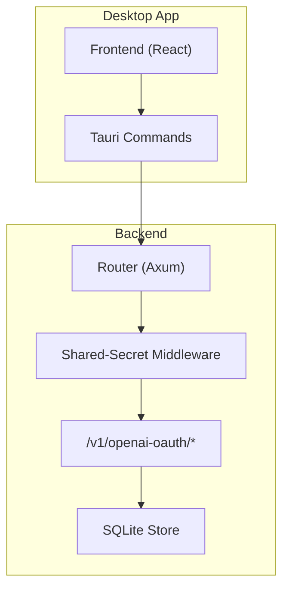
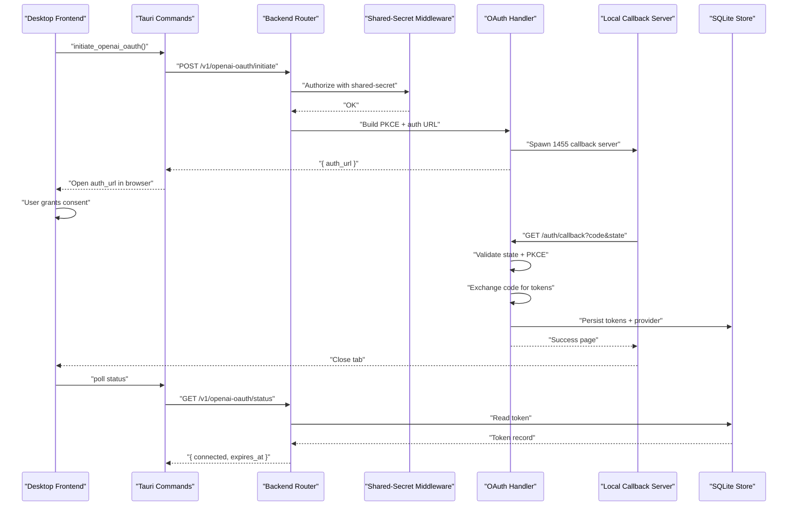
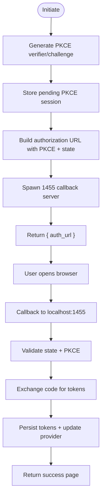
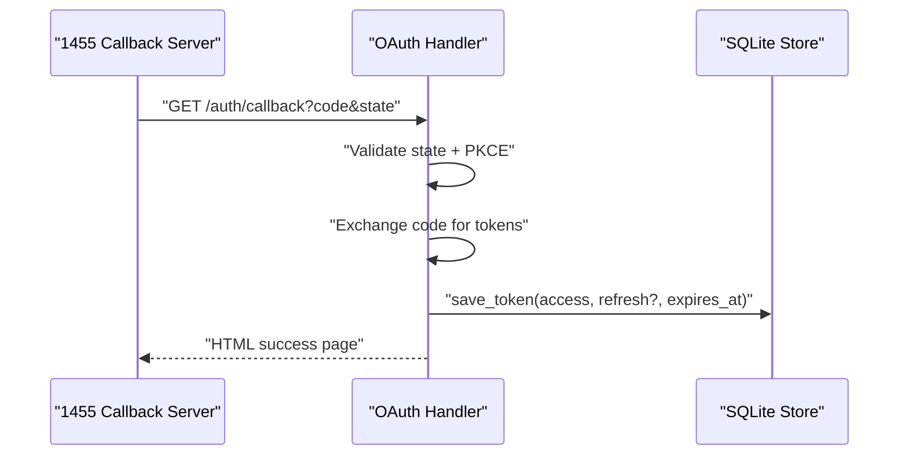
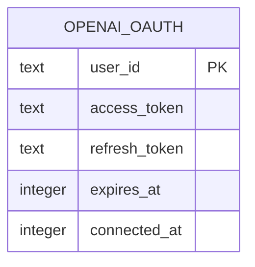
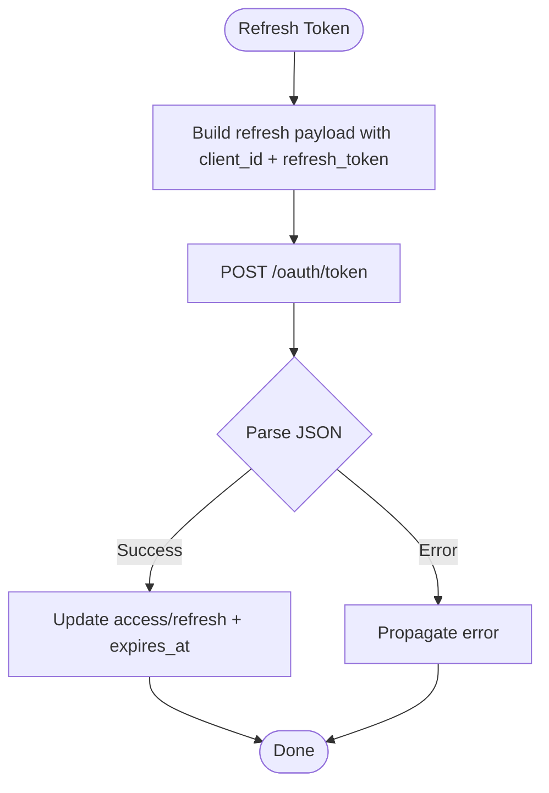
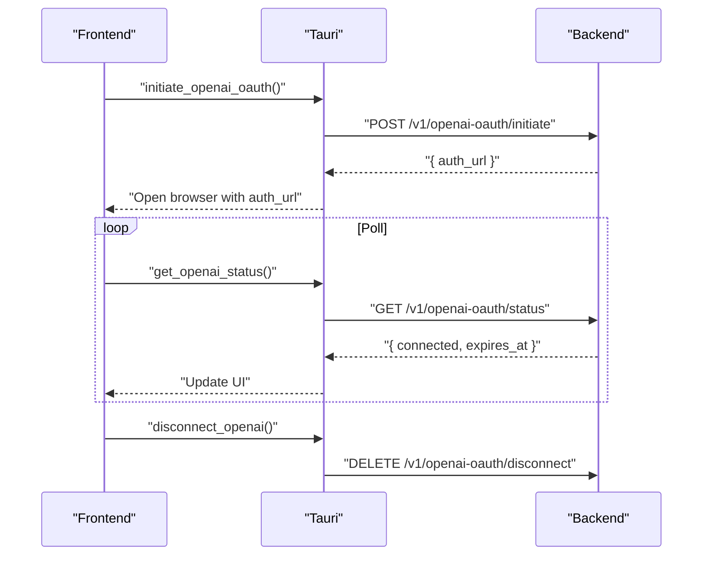
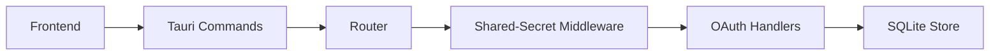

# Authentication Endpoints

<cite>
**Referenced Files in This Document**
- [openai_oauth.rs](file://crates/backend/src/routes/openai_oauth.rs)
- [openai_oauth_store.rs](file://crates/backend/src/store/openai_oauth.rs)
- [openai_oauth_migration.sql](file://crates/backend/src/store/migrations/006_openai_oauth.sql)
- [lib.rs](file://crates/backend/src/lib.rs)
- [main.rs](file://crates/backend/src/main.rs)
- [auth_middleware.rs](file://crates/backend/src/auth/mod.rs)
- [api.rs](file://desktop/src-tauri/src/api.rs)
- [invoke.ts](file://desktop/src/lib/invoke.ts)
- [openai_codex.rs](file://crates/backend/src/llm/openai_codex.rs)
</cite>

## Table of Contents
1. [Introduction](#introduction)
2. [Project Structure](#project-structure)
3. [Core Components](#core-components)
4. [Architecture Overview](#architecture-overview)
5. [Detailed Component Analysis](#detailed-component-analysis)
6. [Dependency Analysis](#dependency-analysis)
7. [Performance Considerations](#performance-considerations)
8. [Troubleshooting Guide](#troubleshooting-guide)
9. [Conclusion](#conclusion)

## Introduction
This document describes the OpenAI OAuth authentication flow for the WISPR Hindi Bridge backend. It covers the secure authorization code exchange, PKCE implementation, state parameter validation, token storage, expiration handling, and session management. It also documents the client integration pattern used by the desktop application and provides troubleshooting guidance for common OAuth issues.

## Project Structure
The authentication system spans the backend Rust service, the desktop Tauri integration, and the local SQLite storage layer:
- Backend routes implement the OAuth initiation, callback handling, status checks, and disconnection.
- Middleware enforces shared-secret bearer authentication for internal routes.
- Desktop commands trigger the flow and poll for completion.
- Storage persists tokens and updates provider preferences.

**Diagram sources**
- [lib.rs:150-199](file://crates/backend/src/lib.rs#L150-L199)
- [auth_middleware.rs:19-37](file://crates/backend/src/auth/mod.rs#L19-L37)
- [openai_oauth.rs:116-201](file://crates/backend/src/routes/openai_oauth.rs#L116-L201)
- [openai_oauth_store.rs:17-83](file://crates/backend/src/store/openai_oauth.rs#L17-L83)

**Section sources**
- [lib.rs:150-199](file://crates/backend/src/lib.rs#L150-L199)
- [auth_middleware.rs:19-37](file://crates/backend/src/auth/mod.rs#L19-L37)
- [openai_oauth.rs:116-201](file://crates/backend/src/routes/openai_oauth.rs#L116-L201)
- [openai_oauth_store.rs:17-83](file://crates/backend/src/store/openai_oauth.rs#L17-L83)

## Core Components
- OAuth routes:
  - POST /v1/openai-oauth/initiate: Builds the authorization URL with PKCE challenge and spawns a one-shot callback server on localhost:1455.
  - GET /v1/openai-oauth/status: Reports connection status, expiration, and provider models.
  - DELETE /v1/openai-oauth/disconnect: Removes stored tokens and reverts provider preference.
- Token storage:
  - SQLite table stores access_token, optional refresh_token, expiration timestamp, and connection timestamp.
  - Automatic provider switch to openai_codex upon successful connection.
- Middleware:
  - Shared-secret bearer authentication protects internal routes.
- Desktop integration:
  - Tauri commands invoke backend endpoints and drive the UI flow.

**Section sources**
- [openai_oauth.rs:116-201](file://crates/backend/src/routes/openai_oauth.rs#L116-L201)
- [openai_oauth_store.rs:17-83](file://crates/backend/src/store/openai_oauth.rs#L17-L83)
- [openai_oauth_migration.sql:4-10](file://crates/backend/src/store/migrations/006_openai_oauth.sql#L4-L10)
- [auth_middleware.rs:19-37](file://crates/backend/src/auth/mod.rs#L19-L37)
- [api.rs:555-596](file://desktop/src-tauri/src/api.rs#L555-L596)

## Architecture Overview
The OAuth flow uses PKCE with a one-shot callback server bound to localhost:1455. The desktop app triggers initiation, opens the authorization URL in the system browser, and polls for completion.

**Diagram sources**
- [openai_oauth.rs:116-308](file://crates/backend/src/routes/openai_oauth.rs#L116-L308)
- [openai_oauth_store.rs:17-83](file://crates/backend/src/store/openai_oauth.rs#L17-L83)
- [api.rs:555-596](file://desktop/src-tauri/src/api.rs#L555-L596)

## Detailed Component Analysis

### OAuth Routes and Handlers
- POST /v1/openai-oauth/initiate
  - Generates PKCE verifier and challenge.
  - Creates a random state parameter.
  - Stores the pending PKCE session in memory.
  - Builds the authorization URL with client_id, redirect_uri, response_type, scope, code_challenge, code_challenge_method, state, and additional parameters.
  - Spawns a one-shot Axum server on 127.0.0.1:1455 to handle the OAuth callback.
  - Returns the authorization URL to the caller.
- GET /v1/openai-oauth/status
  - Reads the stored token for the default user.
  - Computes connection status based on expiration.
  - Returns connected flag, expiration timestamp, connection timestamp, and model identifiers.
- DELETE /v1/openai-oauth/disconnect
  - Deletes the stored token.
  - Reverts the provider preference to gateway.

**Diagram sources**
- [openai_oauth.rs:116-158](file://crates/backend/src/routes/openai_oauth.rs#L116-L158)
- [openai_oauth.rs:205-308](file://crates/backend/src/routes/openai_oauth.rs#L205-L308)

**Section sources**
- [openai_oauth.rs:116-201](file://crates/backend/src/routes/openai_oauth.rs#L116-L201)

### Local Callback Server and Authorization Code Exchange
- The callback server listens on 127.0.0.1:1455 for a single request.
- Validates presence of error, code, and state parameters.
- Validates state against the pending session and ensures the session is consumed.
- Exchanges the authorization code for tokens using the PKCE verifier.
- Persists tokens and provider preference, then returns a success page.

**Diagram sources**
- [openai_oauth.rs:205-308](file://crates/backend/src/routes/openai_oauth.rs#L205-L308)
- [openai_oauth_store.rs:36-59](file://crates/backend/src/store/openai_oauth.rs#L36-L59)

**Section sources**
- [openai_oauth.rs:205-308](file://crates/backend/src/routes/openai_oauth.rs#L205-L308)
- [openai_oauth_store.rs:36-59](file://crates/backend/src/store/openai_oauth.rs#L36-L59)

### Token Storage and Expiration Handling
- Storage schema includes user_id, access_token, optional refresh_token, expires_at (unix ms), and connected_at (unix ms).
- On successful connection, provider preference is switched to openai_codex.
- Disconnection clears tokens and reverts provider to gateway.
- Status endpoint computes connectedness based on current time vs expires_at.

**Diagram sources**
- [openai_oauth_migration.sql:4-10](file://crates/backend/src/store/migrations/006_openai_oauth.sql#L4-L10)

**Section sources**
- [openai_oauth_store.rs:17-83](file://crates/backend/src/store/openai_oauth.rs#L17-L83)
- [openai_oauth_migration.sql:4-10](file://crates/backend/src/store/migrations/006_openai_oauth.sql#L4-L10)

### Token Refresh Mechanism
- The backend supports refreshing access tokens using the refresh_token via the OpenAI-compatible token endpoint.
- The refresh operation returns a new access token, possibly a new refresh token, and a new expiration timestamp.

**Diagram sources**
- [openai_codex.rs:142-176](file://crates/backend/src/llm/openai_codex.rs#L142-L176)

**Section sources**
- [openai_codex.rs:142-176](file://crates/backend/src/llm/openai_codex.rs#L142-L176)

### Session Management and Provider Routing
- Upon successful OAuth connection, the backend automatically switches the llm_provider to openai_codex.
- On disconnection, provider preference is reverted to gateway.
- The frontend polls status to reflect connection state and model availability.

**Section sources**
- [openai_oauth_store.rs:52-59](file://crates/backend/src/store/openai_oauth.rs#L52-L59)
- [openai_oauth_store.rs:77-82](file://crates/backend/src/store/openai_oauth.rs#L77-L82)

### Desktop Integration Pattern
- The desktop app invokes backend endpoints via Tauri commands.
- It opens the authorization URL in the system browser and polls for status.
- Commands include initiating OAuth, retrieving status, and disconnecting.

**Diagram sources**
- [api.rs:555-596](file://desktop/src-tauri/src/api.rs#L555-L596)
- [invoke.ts:483-495](file://desktop/src/lib/invoke.ts#L483-L495)

**Section sources**
- [api.rs:555-596](file://desktop/src-tauri/src/api.rs#L555-L596)
- [invoke.ts:483-495](file://desktop/src/lib/invoke.ts#L483-L495)

## Dependency Analysis
- Router wiring places OAuth routes under the shared-secret middleware.
- OAuth handler depends on:
  - State for database pool and default user ID.
  - Store module for token persistence.
  - Runtime spawning of the callback server.
- Desktop integration depends on:
  - Tauri commands to call backend endpoints.
  - Frontend polling to observe status changes.

**Diagram sources**
- [lib.rs:150-199](file://crates/backend/src/lib.rs#L150-L199)
- [auth_middleware.rs:19-37](file://crates/backend/src/auth/mod.rs#L19-L37)
- [openai_oauth.rs:116-201](file://crates/backend/src/routes/openai_oauth.rs#L116-L201)

**Section sources**
- [lib.rs:150-199](file://crates/backend/src/lib.rs#L150-L199)
- [auth_middleware.rs:19-37](file://crates/backend/src/auth/mod.rs#L19-L37)
- [openai_oauth.rs:116-201](file://crates/backend/src/routes/openai_oauth.rs#L116-L201)

## Performance Considerations
- The backend uses a shared HTTP client with connection pooling to minimize overhead for token exchanges.
- The callback server is one-shot and short-lived, reducing resource contention.
- Status queries read from SQLite; caching is not used for token state in this flow.

[No sources needed since this section provides general guidance]

## Troubleshooting Guide
Common OAuth issues and resolutions:
- Missing code or state in callback:
  - The callback server validates presence of code and state; absence triggers an error page.
  - Verify the redirect_uri and state handling in the frontend/browser.
- State mismatch:
  - The callback compares the received state with the pending session; mismatches abort the flow.
  - Ensure the state is generated per-session and not reused.
- No pending session:
  - If the session has been consumed or never created, the callback rejects the request.
  - Confirm initiate was called and the callback server is reachable on localhost:1455.
- Port binding conflicts:
  - If port 1455 is already in use, the callback server exits early.
  - Close any lingering processes or retry after the previous flow completes.
- Token exchange failures:
  - Errors from the token endpoint are captured and surfaced in the callback page.
  - Check network connectivity and ensure the authorization code is valid and unexpired.
- Expiration handling:
  - The status endpoint reports expiration; clients should refresh tokens proactively.
  - Use the refresh mechanism documented below to obtain a new access token.

Security considerations:
- Shared-secret bearer middleware prevents unauthorized access to internal routes.
- PKCE prevents authorization code interception attacks.
- Tokens are stored in SQLite; protect the database file and restrict filesystem access.
- The callback server binds to localhost to minimize exposure.

**Section sources**
- [openai_oauth.rs:247-291](file://crates/backend/src/routes/openai_oauth.rs#L247-L291)
- [openai_oauth.rs:301-307](file://crates/backend/src/routes/openai_oauth.rs#L301-L307)
- [auth_middleware.rs:19-37](file://crates/backend/src/auth/mod.rs#L19-L37)

## Conclusion
The WISPR Hindi Bridge implements a secure OpenAI OAuth flow using PKCE and a local callback server. The backend exposes straightforward endpoints for initiation, status, and disconnection, protected by a shared-secret bearer middleware. The desktop app integrates seamlessly by invoking backend commands, opening the authorization URL, and polling for completion. Token storage and provider routing are automated, and refresh support is available for robust session management.