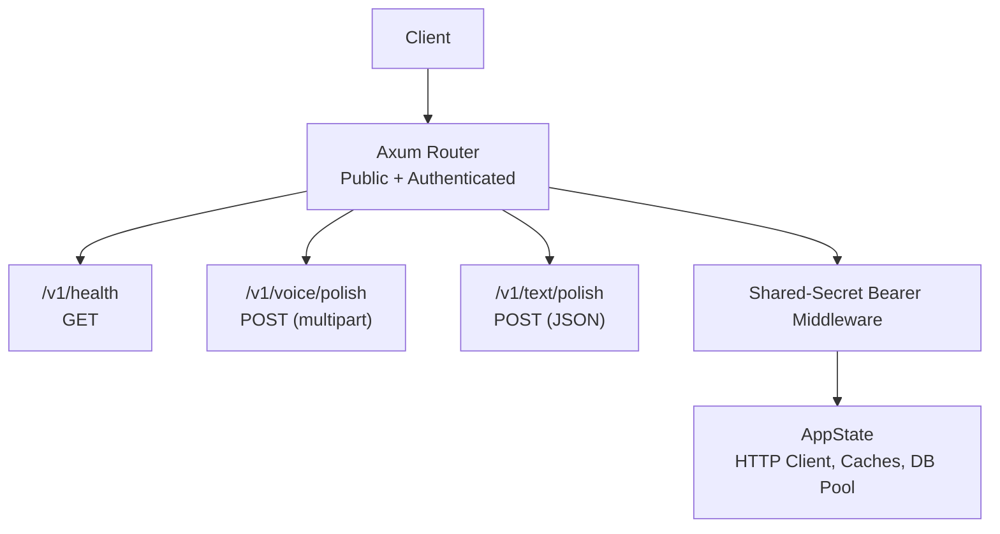
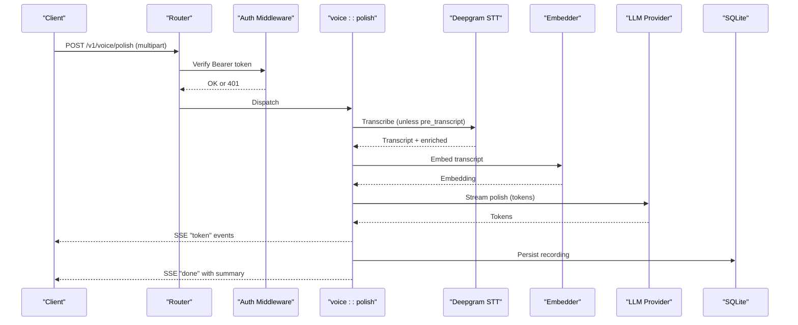
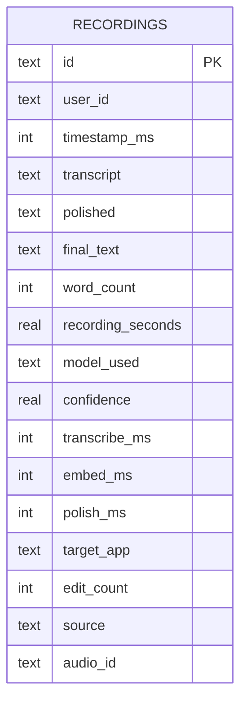
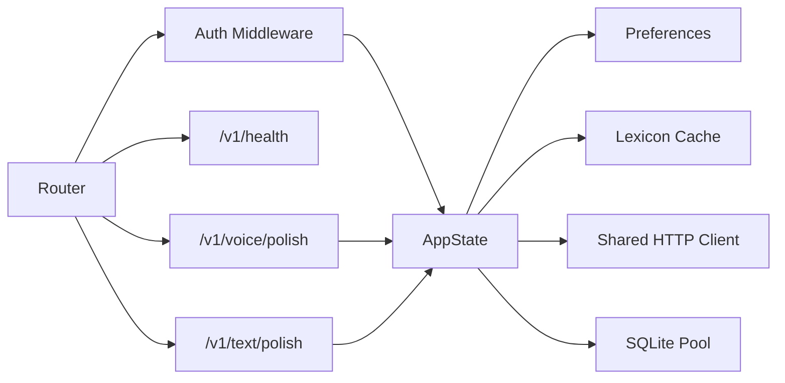

# Core Endpoints

<cite>
**Referenced Files in This Document**
- [lib.rs](file://crates/backend/src/lib.rs)
- [main.rs](file://crates/backend/src/main.rs)
- [health.rs](file://crates/backend/src/routes/health.rs)
- [voice.rs](file://crates/backend/src/routes/voice.rs)
- [text.rs](file://crates/backend/src/routes/text.rs)
- [mod.rs](file://crates/backend/src/auth/mod.rs)
- [lib.rs](file://crates/core/src/lib.rs)
- [001_initial.sql](file://crates/backend/src/store/migrations/001_initial.sql)
- [history.rs](file://crates/backend/src/store/history.rs)
- [prefs.rs](file://crates/backend/src/store/prefs.rs)
</cite>

## Table of Contents
1. [Introduction](#introduction)
2. [Project Structure](#project-structure)
3. [Core Components](#core-components)
4. [Architecture Overview](#architecture-overview)
5. [Detailed Component Analysis](#detailed-component-analysis)
6. [Dependency Analysis](#dependency-analysis)
7. [Performance Considerations](#performance-considerations)
8. [Troubleshooting Guide](#troubleshooting-guide)
9. [Conclusion](#conclusion)

## Introduction
This document describes the core WISPR Hindi Bridge API endpoints for health checks and two content polishing endpoints: voice and text. It covers request/response schemas, authentication, error handling, and operational characteristics such as rate limiting, timeouts, and performance considerations. The service runs as a local daemon on port 48484 by default and exposes public and authenticated routes behind a shared-secret bearer middleware.

## Project Structure
The backend is implemented in Rust using Axum and serves endpoints under /v1. Public routes (no auth) include health checks. Authenticated routes include voice and text polishers, preferences, history, and vocabulary management. The application state holds a shared HTTP client, caches for preferences and lexicon, and a SQLite connection pool.

**Diagram sources**
- [lib.rs:150-199](file://crates/backend/src/lib.rs#L150-L199)
- [health.rs:1-10](file://crates/backend/src/routes/health.rs#L1-L10)
- [voice.rs:1-10](file://crates/backend/src/routes/voice.rs#L1-L10)
- [text.rs:1-5](file://crates/backend/src/routes/text.rs#L1-L5)

**Section sources**
- [lib.rs:150-199](file://crates/backend/src/lib.rs#L150-L199)
- [main.rs:80-86](file://crates/backend/src/main.rs#L80-L86)

## Core Components
- Health endpoint: GET /v1/health returns a JSON object indicating service availability and version.
- Voice polish endpoint: POST /v1/voice/polish streams polished text via Server-Sent Events (SSE) and persists results to SQLite.
- Text polish endpoint: POST /v1/text/polish streams polished text via SSE and persists results to SQLite.
- Authentication: All authenticated routes require Authorization: Bearer <shared-secret>.
- Application state: Holds a shared HTTP client, preference and lexicon caches, and a SQLite pool.

**Section sources**
- [health.rs:4-9](file://crates/backend/src/routes/health.rs#L4-L9)
- [voice.rs:85-419](file://crates/backend/src/routes/voice.rs#L85-L419)
- [text.rs:47-265](file://crates/backend/src/routes/text.rs#L47-L265)
- [mod.rs:19-37](file://crates/backend/src/auth/mod.rs#L19-L37)
- [lib.rs:135-146](file://crates/backend/src/lib.rs#L135-L146)

## Architecture Overview
The authenticated routes are protected by a shared-secret bearer middleware. Requests are processed asynchronously and streamed via SSE. The voice endpoint optionally leverages a pre-transcript to skip STT, while the text endpoint bypasses STT entirely. Both endpoints compute embeddings, retrieve RAG examples, and stream tokens from the configured LLM provider.

**Diagram sources**
- [lib.rs:184-187](file://crates/backend/src/lib.rs#L184-L187)
- [voice.rs:173-357](file://crates/backend/src/routes/voice.rs#L173-L357)
- [history.rs:45-63](file://crates/backend/src/store/history.rs#L45-L63)

## Detailed Component Analysis

### Health Endpoint (/v1/health)
- Method: GET
- Path: /v1/health
- Authentication: None
- Response: JSON object containing a boolean flag and version string
- Typical success response:
  - ok: true
  - version: string (package version)

curl example:
- curl -s http://127.0.0.1:48484/v1/health

Notes:
- The endpoint returns a static JSON payload and does not depend on external services.

**Section sources**
- [health.rs:4-9](file://crates/backend/src/routes/health.rs#L4-L9)

### Voice Polishing Endpoint (/v1/voice/polish)
- Method: POST
- Path: /v1/voice/polish
- Authentication: Required (Bearer <shared-secret>)
- Content-Type: multipart/form-data
- Request fields:
  - audio (required): WAV bytes
  - target_app (optional): bundle identifier of the active app
  - pre_transcript (optional): transcript from a prior Deepgram WebSocket session; if provided, STT is skipped
- Streaming response (SSE):
  - event: status
    - data: { phase: "transcribing"|"polishing", transcript: string }
  - event: token
    - data: { token: string }
  - event: error
    - data: { message: string, audio_id?: string }
  - event: done
    - data: {
        recording_id: string,
        polished: string,
        model_used: string,
        confidence: number,
        latency_ms: {
          transcribe: number,
          embed: number,
          retrieve: number,
          polish: number,
          total: number
        },
        examples_used: number
      }
- Behavior:
  - Validates presence of audio bytes; returns 400 Bad Request if missing.
  - Saves audio to disk for retention and retry support.
  - Loads user preferences and lexicon from caches; fetches API keys from preferences or environment.
  - If pre_transcript is provided, STT is skipped; otherwise, Deepgram HTTP transcription is performed.
  - Applies post-STT replacements and builds an enriched transcript with confidence markers.
  - Computes embedding and retrieves RAG examples.
  - Streams tokens from the selected LLM provider (gateway, gemini_direct, groq, or openai_codex).
  - Persists the result to SQLite with timing metrics and metadata.
- Error handling:
  - Returns 400 Bad Request on empty audio.
  - Emits SSE "error" events with messages and audio_id when STT or LLM fails.
- Practical curl example (multipart):
  - curl -N -X POST "http://127.0.0.1:48484/v1/voice/polish" \
    -H "Authorization: Bearer $POLISH_SHARED_SECRET" \
    -F "audio=@/absolute/path/to/recording.wav" \
    -F "target_app=com.example.App"

- Notes:
  - The voice endpoint supports a pre_transcript optimization to skip STT when the caller already has a transcript from a WebSocket session.

**Section sources**
- [voice.rs:1-17](file://crates/backend/src/routes/voice.rs#L1-L17)
- [voice.rs:85-106](file://crates/backend/src/routes/voice.rs#L85-L106)
- [voice.rs:173-210](file://crates/backend/src/routes/voice.rs#L173-L210)
- [voice.rs:212-231](file://crates/backend/src/routes/voice.rs#L212-L231)
- [voice.rs:236-272](file://crates/backend/src/routes/voice.rs#L236-L272)
- [voice.rs:286-357](file://crates/backend/src/routes/voice.rs#L286-L357)
- [voice.rs:363-392](file://crates/backend/src/routes/voice.rs#L363-L392)
- [voice.rs:396-414](file://crates/backend/src/routes/voice.rs#L396-L414)

### Text Polishing Endpoint (/v1/text/polish)
- Method: POST
- Path: /v1/text/polish
- Authentication: Required (Bearer <shared-secret>)
- Content-Type: application/json
- Request body:
  - text (required): string to polish
  - target_app (optional): bundle identifier of the active app
  - tone_override (optional): when set, forces English output and tray-specific prompt
- Streaming response (SSE):
  - event: status
    - data: { phase: "polishing", transcript: string }
  - event: token
    - data: { token: string }
  - event: error
    - data: { message: string }
  - event: done
    - data: {
        recording_id: string,
        polished: string,
        model_used: string,
        confidence: null,
        latency_ms: {
          transcribe: 0,
          embed: number,
          retrieve: 0,
          polish: number,
          total: number
        },
        examples_used: number
      }
- Behavior:
  - Validates non-empty text; returns 400 Bad Request if empty.
  - Loads user preferences and lexicon from caches; resolves model and provider.
  - Computes embedding and retrieves RAG examples.
  - Streams tokens from the selected LLM provider.
  - Persists the result to SQLite with timing metrics and metadata.
- Error handling:
  - Returns 400 Bad Request on empty text.
  - Emits SSE "error" events with messages when LLM fails.
- Practical curl example:
  - curl -N -X POST "http://127.0.0.1:48484/v1/text/polish" \
    -H "Authorization: Bearer $POLISH_SHARED_SECRET" \
    -H "Content-Type: application/json" \
    -d '{"text":"Write a polite reply","target_app":"com.example.App"}'

**Section sources**
- [text.rs:1-5](file://crates/backend/src/routes/text.rs#L1-L5)
- [text.rs:47-53](file://crates/backend/src/routes/text.rs#L47-L53)
- [text.rs:81-82](file://crates/backend/src/routes/text.rs#L81-L82)
- [text.rs:84-104](file://crates/backend/src/routes/text.rs#L84-L104)
- [text.rs:116-128](file://crates/backend/src/routes/text.rs#L116-L128)
- [text.rs:130-187](file://crates/backend/src/routes/text.rs#L130-L187)
- [text.rs:189-207](file://crates/backend/src/routes/text.rs#L189-L207)
- [text.rs:213-239](file://crates/backend/src/routes/text.rs#L213-L239)
- [text.rs:243-259](file://crates/backend/src/routes/text.rs#L243-L259)

### Authentication
- All authenticated routes require Authorization: Bearer <shared-secret>.
- The shared secret is provided via the POLISH_SHARED_SECRET environment variable and is compared against the request header.
- Unauthorized requests receive a 401 status.

curl example (authenticated):
- curl -H "Authorization: Bearer $POLISH_SHARED_SECRET" http://127.0.0.1:48484/v1/health

**Section sources**
- [mod.rs:19-37](file://crates/backend/src/auth/mod.rs#L19-L37)
- [lib.rs:204-206](file://crates/backend/src/lib.rs#L204-L206)

### Data Persistence and Schema
- Recordings are stored in SQLite with fields for timestamps, transcripts, polished text, word counts, model used, confidence, timing metrics, target app, and source.
- The schema defines indexes for efficient queries by user and time.

**Diagram sources**
- [001_initial.sql:29-48](file://crates/backend/src/store/migrations/001_initial.sql#L29-L48)

**Section sources**
- [history.rs:7-26](file://crates/backend/src/store/history.rs#L7-L26)
- [001_initial.sql:29-48](file://crates/backend/src/store/migrations/001_initial.sql#L29-L48)

## Dependency Analysis
- Router registration binds public and authenticated routes and applies CORS.
- Auth middleware enforces shared-secret bearer requirement for authenticated routes.
- Application state provides a shared HTTP client, caches for preferences and lexicon, and a SQLite pool.
- Voice and text endpoints depend on preferences, lexicon, embedding, RAG retrieval, and LLM providers.

**Diagram sources**
- [lib.rs:150-199](file://crates/backend/src/lib.rs#L150-L199)
- [mod.rs:19-37](file://crates/backend/src/auth/mod.rs#L19-L37)
- [lib.rs:135-146](file://crates/backend/src/lib.rs#L135-L146)

**Section sources**
- [lib.rs:150-199](file://crates/backend/src/lib.rs#L150-L199)
- [mod.rs:19-37](file://crates/backend/src/auth/mod.rs#L19-L37)
- [lib.rs:135-146](file://crates/backend/src/lib.rs#L135-L146)

## Performance Considerations
- Localhost-only daemon: The server listens on 127.0.0.1 by default, minimizing network overhead.
- Shared HTTP client: A single HTTP client with connection pooling reduces overhead across requests.
- Caching: Preferences and lexicon are cached to avoid repeated database reads.
- SSE streaming: Responses are streamed incrementally to reduce perceived latency.
- Cleanup tasks: Background jobs remove old recordings and audio files to maintain performance and storage hygiene.
- Model resolution: The core module resolves the model to a fixed value, simplifying routing.

Operational notes:
- Port binding: Default port is 48484; can be overridden via CLI argument.
- Logging: Structured logs are written to a platform-specific log directory.
- No explicit rate limiting: The code does not implement request-rate throttling; consider upstream rate limits from LLM providers.

**Section sources**
- [main.rs:80-86](file://crates/backend/src/main.rs#L80-L86)
- [main.rs:210-214](file://crates/backend/src/main.rs#L210-L214)
- [lib.rs:29-62](file://crates/backend/src/lib.rs#L29-L62)
- [lib.rs:77-131](file://crates/backend/src/lib.rs#L77-L131)
- [main.rs:88-101](file://crates/backend/src/main.rs#L88-L101)
- [lib.rs:42-45](file://crates/core/src/lib.rs#L42-L45)

## Troubleshooting Guide
Common issues and resolutions:
- 401 Unauthorized:
  - Cause: Missing or incorrect Authorization header.
  - Resolution: Ensure the Bearer token matches the POLISH_SHARED_SECRET environment variable.
- 400 Bad Request (voice):
  - Cause: Missing audio bytes in multipart form.
  - Resolution: Include a valid WAV file in the audio field.
- 400 Bad Request (text):
  - Cause: Empty text in JSON body.
  - Resolution: Provide non-empty text to polish.
- SSE errors:
  - Voice and text endpoints emit SSE "error" events with messages and, for voice, an audio_id for correlation.
  - Check logs for warnings and errors emitted by the endpoints.
- Provider configuration:
  - Ensure required API keys are configured in preferences or environment variables for the selected LLM provider.
- Model selection:
  - The model is resolved by the core module; verify provider-specific keys and settings.

**Section sources**
- [mod.rs:32-36](file://crates/backend/src/auth/mod.rs#L32-L36)
- [voice.rs:103-106](file://crates/backend/src/routes/voice.rs#L103-L106)
- [text.rs:51-53](file://crates/backend/src/routes/text.rs#L51-L53)
- [voice.rs:202-208](file://crates/backend/src/routes/voice.rs#L202-L208)
- [text.rs:196-201](file://crates/backend/src/routes/text.rs#L196-L201)
- [lib.rs:47-49](file://crates/core/src/lib.rs#L47-L49)

## Conclusion
The WISPR Hindi Bridge exposes a health check and two content polishing endpoints with authenticated access. The voice endpoint supports a pre-transcript optimization to skip STT, while the text endpoint bypasses STT entirely. Both endpoints stream polished text via SSE, persist results to SQLite, and rely on a shared HTTP client and caches for performance. There is no explicit rate limiting; upstream provider quotas and timeouts apply. Proper configuration of API keys and the shared secret is essential for reliable operation.