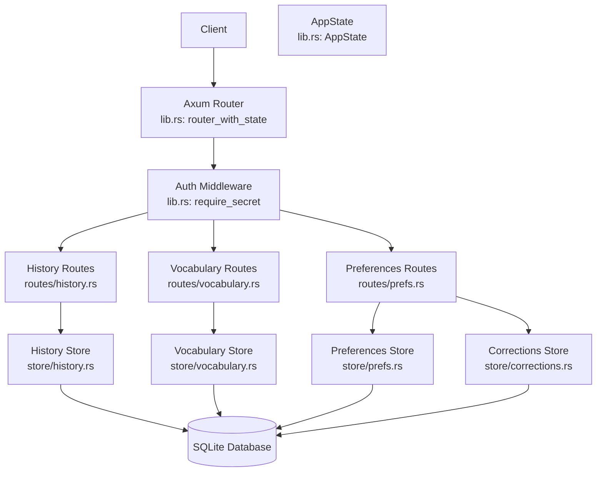
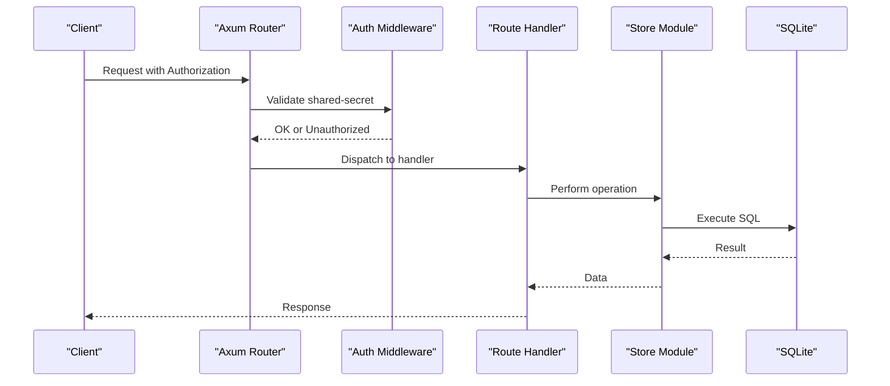
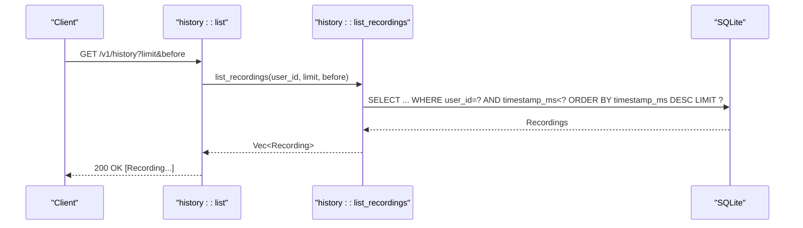
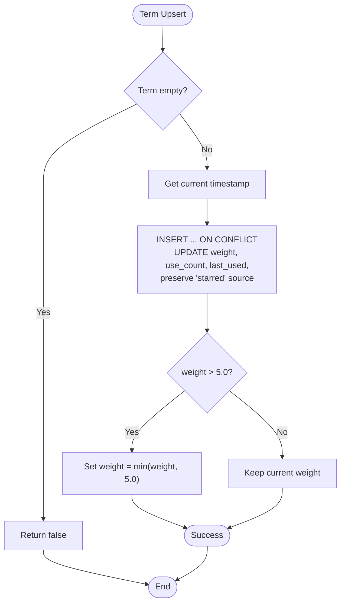
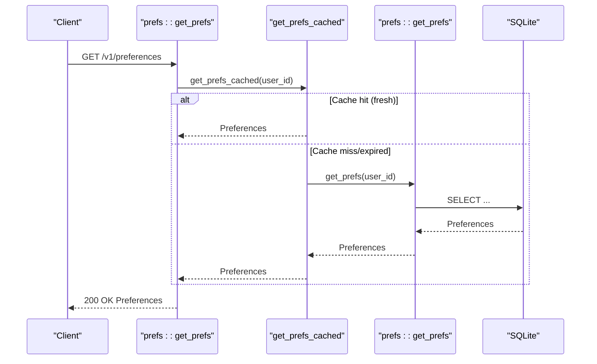
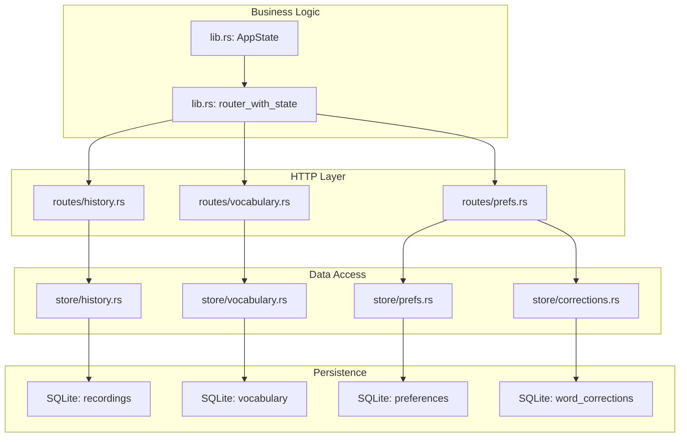

# Data Management Endpoints

<cite>
**Referenced Files in This Document**
- [main.rs](file://crates/backend/src/main.rs)
- [lib.rs](file://crates/backend/src/lib.rs)
- [history.rs](file://crates/backend/src/routes/history.rs)
- [vocabulary.rs](file://crates/backend/src/routes/vocabulary.rs)
- [prefs.rs](file://crates/backend/src/routes/prefs.rs)
- [history_store.rs](file://crates/backend/src/store/history.rs)
- [vocabulary_store.rs](file://crates/backend/src/store/vocabulary.rs)
- [prefs_store.rs](file://crates/backend/src/store/prefs.rs)
- [corrections_store.rs](file://crates/backend/src/store/corrections.rs)
- [migrations_001.sql](file://crates/backend/src/store/migrations/001_initial.sql)
- [migrations_012.sql](file://crates/backend/src/store/migrations/012_vocabulary_and_stt_replacements.sql)
</cite>

## Table of Contents
1. [Introduction](#introduction)
2. [Project Structure](#project-structure)
3. [Core Components](#core-components)
4. [Architecture Overview](#architecture-overview)
5. [Detailed Component Analysis](#detailed-component-analysis)
6. [Dependency Analysis](#dependency-analysis)
7. [Performance Considerations](#performance-considerations)
8. [Troubleshooting Guide](#troubleshooting-guide)
9. [Conclusion](#conclusion)

## Introduction
This document provides comprehensive API documentation for the data management endpoints in WISPR Hindi Bridge. It covers:
- History endpoint (/v1/history) for recording archives with CRUD operations, pagination, filtering, and audio streaming
- Vocabulary endpoint (/v1/vocabulary) for personal learning items with term management, batch operations, and learning progress tracking
- Preferences endpoint (/v1/preferences) for user configuration including validation, defaults, and synchronization across devices

The documentation includes request/response schemas, query parameters, sorting options, and practical examples for common workflows such as bulk imports, history filtering, and preference updates.

## Project Structure
The backend is implemented in Rust using Axum for HTTP routing and SQLite for persistence. Routes are registered in the router and bound to application state containing database pools, caches, and shared secrets.

**Diagram sources**
- [lib.rs:150-199](file://crates/backend/src/lib.rs#L150-L199)
- [history.rs:1-80](file://crates/backend/src/routes/history.rs#L1-L80)
- [vocabulary.rs:1-151](file://crates/backend/src/routes/vocabulary.rs#L1-L151)
- [prefs.rs:1-57](file://crates/backend/src/routes/prefs.rs#L1-L57)
- [history_store.rs:1-154](file://crates/backend/src/store/history.rs#L1-L154)
- [vocabulary_store.rs:1-248](file://crates/backend/src/store/vocabulary.rs#L1-L248)
- [prefs_store.rs:1-163](file://crates/backend/src/store/prefs.rs#L1-L163)
- [corrections_store.rs:1-136](file://crates/backend/src/store/corrections.rs#L1-L136)

**Section sources**
- [lib.rs:148-199](file://crates/backend/src/lib.rs#L148-L199)
- [main.rs:78-79](file://crates/backend/src/main.rs#L78-L79)

## Core Components
- Application State: Holds database pool, shared secret, default user ID, preference cache, lexicon cache, and HTTP client
- Router Factory: Registers public and authenticated routes with CORS and authentication middleware
- Stores: Encapsulate database operations for history, vocabulary, preferences, and corrections

Key responsibilities:
- Authentication: All authenticated routes require a shared-secret bearer token
- Caching: Preferences and lexicon caches reduce database load with TTL-based invalidation
- Persistence: SQLite tables for recordings, vocabulary, preferences, and corrections

**Section sources**
- [lib.rs:135-146](file://crates/backend/src/lib.rs#L135-L146)
- [lib.rs:150-199](file://crates/backend/src/lib.rs#L150-L199)
- [lib.rs:23-69](file://crates/backend/src/lib.rs#L23-L69)

## Architecture Overview
The backend follows a layered architecture:
- HTTP Layer: Axum routes handle requests and responses
- Business Logic: Route handlers orchestrate store operations
- Data Access: Stores encapsulate SQLite operations with prepared statements
- Caching: Hot caches improve performance for frequently accessed data

**Diagram sources**
- [lib.rs:184-187](file://crates/backend/src/lib.rs#L184-L187)
- [history.rs:23-30](file://crates/backend/src/routes/history.rs#L23-L30)
- [vocabulary.rs:40-44](file://crates/backend/src/routes/vocabulary.rs#L40-L44)
- [prefs.rs:29-36](file://crates/backend/src/routes/prefs.rs#L29-L36)

## Detailed Component Analysis

### History Endpoint (/v1/history)
The history endpoint manages recording archives with full CRUD support and audio streaming.

#### Endpoints
- GET /v1/history
  - Purpose: List recent recordings with pagination
  - Query Parameters:
    - limit: Number of records to return (default: 50)
    - before: Timestamp threshold (only records before this timestamp are included)
  - Response: Array of Recording objects sorted by timestamp descending
  - Status Codes: 200 OK

- DELETE /v1/recordings/{id}
  - Purpose: Remove a specific recording
  - Path Parameter: id (recording identifier)
  - Behavior: Also deletes associated WAV audio file if present
  - Status Codes: 204 No Content, 404 Not Found

- GET /v1/recordings/{id}/audio
  - Purpose: Stream recorded audio as WAV
  - Path Parameter: id (recording identifier)
  - Response: audio/wav stream with no-store caching
  - Status Codes: 200 OK, 404 Not Found

#### Data Model: Recording
- id: Unique identifier
- user_id: Owner of the recording
- timestamp_ms: Creation time in milliseconds
- transcript: Original transcription
- polished: Polished text
- final_text: User-accepted text (optional)
- word_count: Number of words
- recording_seconds: Duration in seconds
- model_used: Model identifier
- confidence: Confidence score (optional)
- transcribe_ms: Transcription duration (optional)
- embed_ms: Embedding duration (optional)
- polish_ms: Polishing duration (optional)
- target_app: Target application (optional)
- edit_count: Number of edits performed
- source: Origin of the recording
- audio_id: Associated audio file identifier (optional)

#### Pagination and Filtering
- Pagination: Controlled by limit parameter with default 50
- Filtering: Records are filtered by user_id and timestamp threshold (before)
- Sorting: Records are ordered by timestamp descending

#### Audio Streaming
- Audio files are stored under a platform-specific directory
- WAV files are streamed directly from disk
- Cache control prevents browser caching

**Diagram sources**
- [history.rs:23-30](file://crates/backend/src/routes/history.rs#L23-L30)
- [history_store.rs:92-110](file://crates/backend/src/store/history.rs#L92-L110)

**Section sources**
- [history.rs:14-21](file://crates/backend/src/routes/history.rs#L14-L21)
- [history.rs:23-30](file://crates/backend/src/routes/history.rs#L23-L30)
- [history.rs:32-48](file://crates/backend/src/routes/history.rs#L32-L48)
- [history.rs:50-70](file://crates/backend/src/routes/history.rs#L50-L70)
- [history_store.rs:7-26](file://crates/backend/src/store/history.rs#L7-L26)
- [history_store.rs:92-110](file://crates/backend/src/store/history.rs#L92-L110)
- [migrations_001.sql:29-48](file://crates/backend/src/store/migrations/001_initial.sql#L29-L48)

### Vocabulary Endpoint (/v1/vocabulary)
The vocabulary endpoint manages personal learning items for STT biasing and learning progress tracking.

#### Endpoints
- GET /v1/vocabulary/terms
  - Purpose: Lightweight endpoint returning top-N term strings for STT keyterms
  - Response: TermsResponse with terms array
  - Typical usage: STT engine integration (e.g., Deepgram keyterm)

- GET /v1/vocabulary
  - Purpose: Full vocabulary listing with metadata
  - Response: VocabListResponse with terms array and total count
  - Sorting: By weight descending, then last_used descending

- POST /v1/vocabulary
  - Purpose: Manually add a new term
  - Request Body: CreateBody with term field
  - Behavior: Creates with weight 1.5 and source "manual"
  - Validation: Term must be non-empty and ≤ 64 characters
  - Response: 201 Created with term, or 400 Bad Request

- DELETE /v1/vocabulary/{term}
  - Purpose: Hard-remove a specific term
  - Path Parameter: term (trimmed)
  - Response: 204 No Content, 400 Bad Request, 404 Not Found

- POST /v1/vocabulary/{term}/star
  - Purpose: Toggle starred status (immunity to demotion)
  - Path Parameter: term (trimmed)
  - Behavior: 
    - Starred → manual (weight 1.5, preserve weight)
    - Unstarred → starred (weight 3.0, become demotion-immune)
  - Response: 200 OK with starred flag

#### Data Model: VocabTerm
- term: The correctly spelled term
- weight: Strength (caps at 5.0)
- use_count: Number of times encountered
- last_used: Last usage timestamp
- source: 'auto' | 'manual' | 'starred'

#### Learning Progress Tracking
- Weight increases on repeated sightings (up to cap of 5.0)
- Manual additions start at weight 1.5
- Starred terms are immune to demotion
- Demotion removes terms when weight drops to zero (except starred)

#### Batch Operations
- Automatic promotion: Terms discovered during classification receive weight bumps
- Bulk import: Use POST /v1/vocabulary for adding multiple terms programmatically

**Diagram sources**
- [vocabulary_store.rs:33-72](file://crates/backend/src/store/vocabulary.rs#L33-L72)

**Section sources**
- [vocabulary.rs:20-30](file://crates/backend/src/routes/vocabulary.rs#L20-L30)
- [vocabulary.rs:32-44](file://crates/backend/src/routes/vocabulary.rs#L32-L44)
- [vocabulary.rs:46-82](file://crates/backend/src/routes/vocabulary.rs#L46-L82)
- [vocabulary.rs:84-104](file://crates/backend/src/routes/vocabulary.rs#L84-L104)
- [vocabulary.rs:106-150](file://crates/backend/src/routes/vocabulary.rs#L106-L150)
- [vocabulary_store.rs:22-29](file://crates/backend/src/store/vocabulary.rs#L22-L29)
- [vocabulary_store.rs:105-133](file://crates/backend/src/store/vocabulary.rs#L105-L133)
- [vocabulary_store.rs:33-72](file://crates/backend/src/store/vocabulary.rs#L33-L72)
- [migrations_012.sql:22-32](file://crates/backend/src/store/migrations/012_vocabulary_and_stt_replacements.sql#L22-L32)

### Preferences Endpoint (/v1/preferences)
The preferences endpoint manages user configuration with validation, defaults, and synchronization.

#### Endpoints
- GET /v1/preferences
  - Purpose: Retrieve current preferences
  - Response: Preferences object with all fields
  - Caching: Uses hot cache with 30-second TTL

- PATCH /v1/preferences
  - Purpose: Partially update preferences
  - Request Body: PrefsUpdate (all fields optional)
  - Behavior: Updates only provided fields, preserves others
  - Response: Updated Preferences object
  - Cache Invalidation: Immediately invalidates cache

- GET /v1/corrections
  - Purpose: Retrieve correction keyterms for STT
  - Response: CorrectionsResponse with keyterms array

#### Data Model: Preferences
- user_id: User identifier
- selected_model: Model selection
- tone_preset: Preset tone
- custom_prompt: Optional custom prompt
- language: Language setting
- output_language: "hinglish" | "hindi" | "english" (default: "hinglish")
- auto_paste: Boolean (default: true)
- edit_capture: Boolean (default: true)
- polish_text_hotkey: Hotkey string (default: "cmd+shift+p")
- updated_at: Last modification timestamp
- gateway_api_key: Optional API key
- deepgram_api_key: Optional API key
- gemini_api_key: Optional API key
- groq_api_key: Optional API key
- llm_provider: "gateway" | "gemini_direct" | "groq" | "openai_codex" (default: "gateway")

#### Validation and Defaults
- Output language defaults to "hinglish" if not set
- Boolean fields default to true/false as shown
- LLM provider defaults to "gateway"
- API keys are optional and stored locally

#### Synchronization Across Devices
- Single user per installation maintains one preferences record
- Cache invalidation ensures subsequent reads fetch fresh data
- Device-to-device sync occurs through the shared database

**Diagram sources**
- [lib.rs:41-62](file://crates/backend/src/lib.rs#L41-L62)
- [prefs.rs:29-36](file://crates/backend/src/routes/prefs.rs#L29-L36)

**Section sources**
- [prefs.rs:29-36](file://crates/backend/src/routes/prefs.rs#L29-L36)
- [prefs.rs:38-56](file://crates/backend/src/routes/prefs.rs#L38-L56)
- [prefs.rs:15-27](file://crates/backend/src/routes/prefs.rs#L15-L27)
- [prefs_store.rs:6-25](file://crates/backend/src/store/prefs.rs#L6-L25)
- [prefs_store.rs:28-45](file://crates/backend/src/store/prefs.rs#L28-L45)
- [lib.rs:23-69](file://crates/backend/src/lib.rs#L23-L69)

## Dependency Analysis
The system exhibits clear separation of concerns with minimal coupling between layers.

**Diagram sources**
- [lib.rs:150-199](file://crates/backend/src/lib.rs#L150-L199)
- [history.rs:12-12](file://crates/backend/src/routes/history.rs#L12-L12)
- [vocabulary.rs:18-18](file://crates/backend/src/routes/vocabulary.rs#L18-L18)
- [prefs.rs:9-13](file://crates/backend/src/routes/prefs.rs#L9-L13)
- [history_store.rs:1-5](file://crates/backend/src/store/history.rs#L1-L5)
- [vocabulary_store.rs:16-20](file://crates/backend/src/store/vocabulary.rs#L16-L20)
- [prefs_store.rs:1-4](file://crates/backend/src/store/prefs.rs#L1-L4)
- [corrections_store.rs:7-10](file://crates/backend/src/store/corrections.rs#L7-L10)

**Section sources**
- [lib.rs:150-199](file://crates/backend/src/lib.rs#L150-L199)
- [history_store.rs:1-5](file://crates/backend/src/store/history.rs#L1-L5)
- [vocabulary_store.rs:16-20](file://crates/backend/src/store/vocabulary.rs#L16-L20)
- [prefs_store.rs:1-4](file://crates/backend/src/store/prefs.rs#L1-L4)

## Performance Considerations
- Caching Strategy:
  - Preferences cache: 30-second TTL with immediate invalidation on updates
  - Lexicon cache: 60-second TTL for corrections and STT replacements
  - Both caches use concurrent RwLock for thread-safe access

- Database Indexes:
  - recordings: composite index on (user_id, timestamp_ms DESC)
  - vocabulary: index on (user_id, weight DESC)
  - Optimizes frequent queries for recent recordings and top-weight terms

- Background Cleanup:
  - Old recordings (older than 7 days) are cleaned up every 6 hours
  - Audio files older than 24 hours are removed

- Concurrency:
  - Separate HTTP client with connection pooling
  - Non-blocking operations for cache refreshes

**Section sources**
- [lib.rs:23-69](file://crates/backend/src/lib.rs#L23-L69)
- [lib.rs:71-131](file://crates/backend/src/lib.rs#L71-L131)
- [migrations_001.sql:48](file://crates/backend/src/store/migrations/001_initial.sql#L48)
- [migrations_012.sql:32](file://crates/backend/src/store/migrations/012_vocabulary_and_stt_replacements.sql#L32)
- [main.rs:88-101](file://crates/backend/src/main.rs#L88-L101)

## Troubleshooting Guide
Common issues and resolutions:

- Authentication Failures:
  - Symptom: 401 Unauthorized on authenticated endpoints
  - Cause: Missing or incorrect shared-secret bearer token
  - Resolution: Verify POLISH_SHARED_SECRET environment variable and include Authorization header

- Database Connectivity:
  - Symptom: 500 Internal Server Error on data operations
  - Cause: SQLite connection pool exhaustion or file permissions
  - Resolution: Check database file path and permissions; verify disk space

- Cache Invalidation:
  - Symptom: Stale preferences after updates
  - Cause: Cache TTL expiration or missed invalidation
  - Resolution: Wait for 30-second TTL or ensure PATCH /v1/preferences completes successfully

- Audio Streaming Issues:
  - Symptom: 404 Not Found for /v1/recordings/{id}/audio
  - Cause: Missing WAV file or incorrect audio_id
  - Resolution: Verify recording exists and audio_id is set; check audio directory permissions

- Vocabulary Operations:
  - Symptom: Terms not appearing in STT
  - Cause: Low weight or incorrect source
  - Resolution: Use POST /v1/vocabulary/{term}/star to increase prominence

**Section sources**
- [lib.rs:184-187](file://crates/backend/src/lib.rs#L184-L187)
- [history.rs:32-48](file://crates/backend/src/routes/history.rs#L32-L48)
- [vocabulary.rs:106-150](file://crates/backend/src/routes/vocabulary.rs#L106-L150)
- [lib.rs:64-69](file://crates/backend/src/lib.rs#L64-L69)

## Conclusion
The WISPR Hindi Bridge data management endpoints provide a robust foundation for recording history, vocabulary management, and user preferences. The architecture emphasizes performance through caching, maintains data integrity with SQLite, and offers flexible APIs for common workflows. The documented endpoints enable comprehensive CRUD operations, efficient pagination, and seamless integration with STT systems while preserving user privacy through local-only storage.