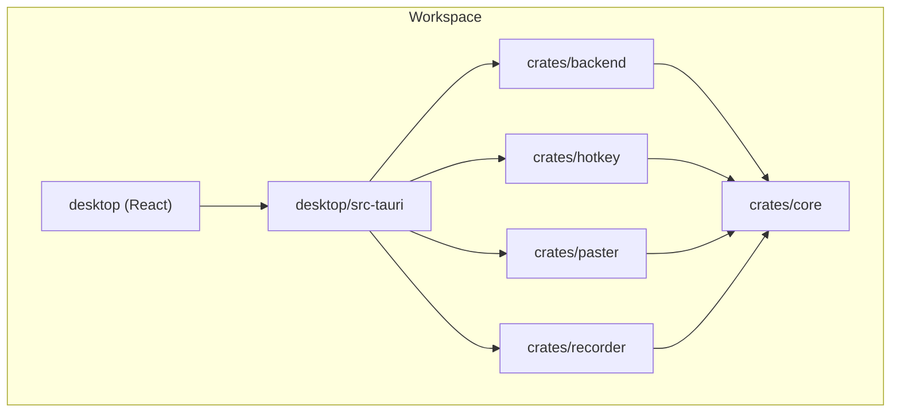
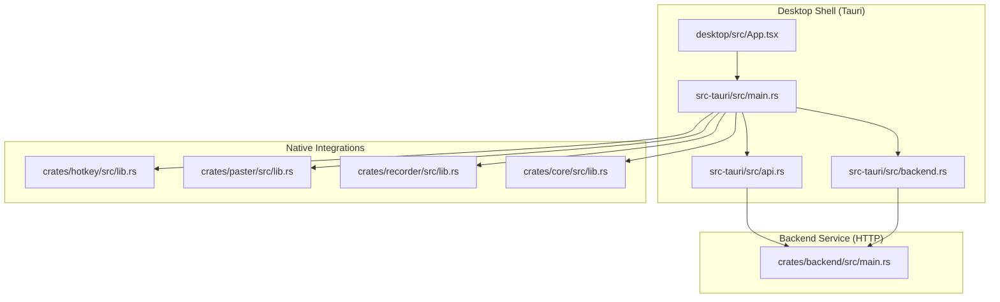
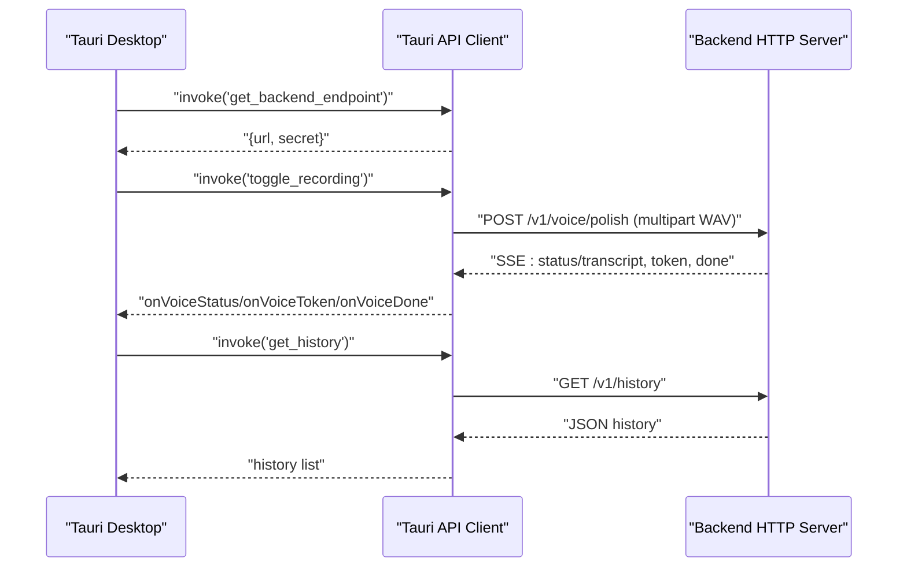
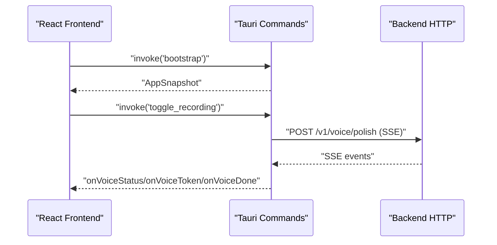
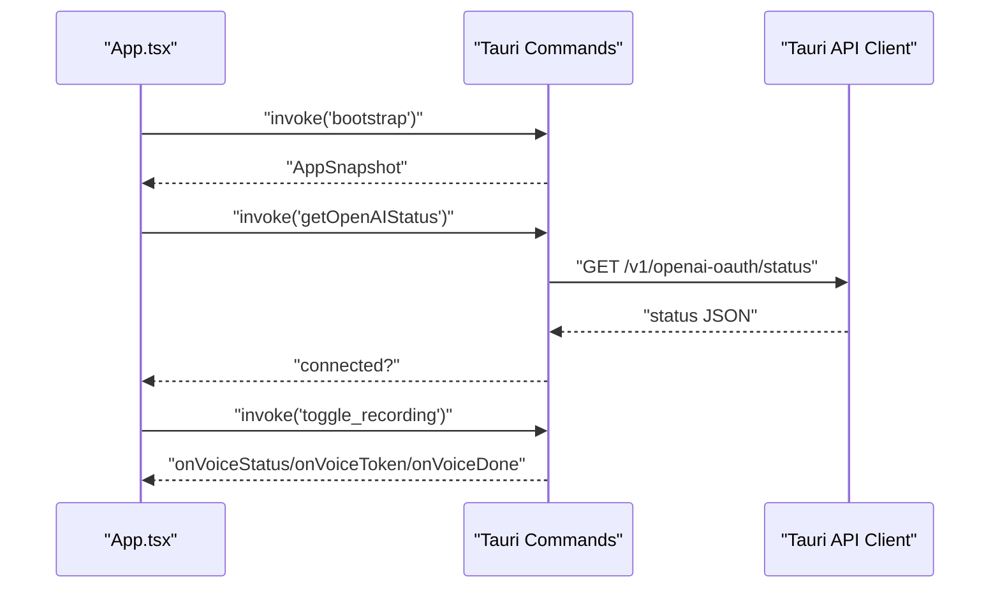
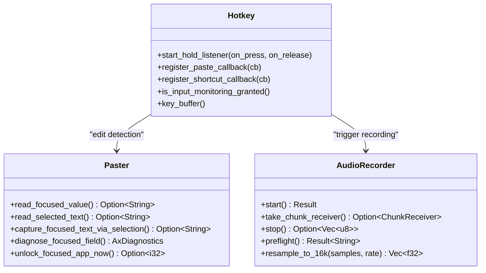
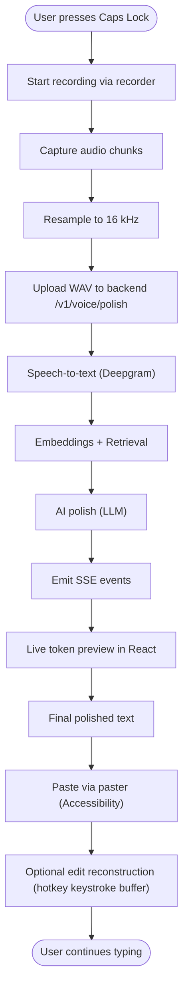
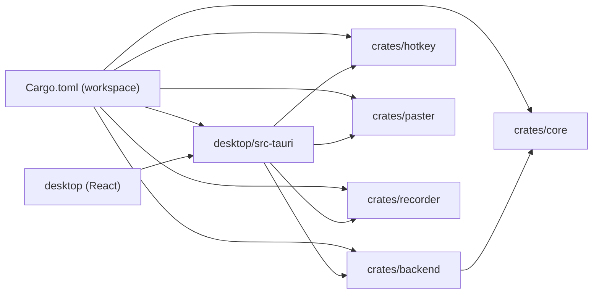

# Architecture Overview

<cite>
**Referenced Files in This Document**
- [Cargo.toml](file://Cargo.toml)
- [crates/backend/Cargo.toml](file://crates/backend/Cargo.toml)
- [desktop/src-tauri/Cargo.toml](file://desktop/src-tauri/Cargo.toml)
- [desktop/package.json](file://desktop/package.json)
- [desktop/src-tauri/tauri.conf.json](file://desktop/src-tauri/tauri.conf.json)
- [crates/backend/src/main.rs](file://crates/backend/src/main.rs)
- [desktop/src-tauri/src/main.rs](file://desktop/src-tauri/src/main.rs)
- [desktop/src-tauri/src/api.rs](file://desktop/src-tauri/src/api.rs)
- [desktop/src-tauri/src/backend.rs](file://desktop/src-tauri/src/backend.rs)
- [crates/hotkey/src/lib.rs](file://crates/hotkey/src/lib.rs)
- [crates/paster/src/lib.rs](file://crates/paster/src/lib.rs)
- [crates/recorder/src/lib.rs](file://crates/recorder/src/lib.rs)
- [crates/core/src/lib.rs](file://crates/core/src/lib.rs)
- [desktop/src/App.tsx](file://desktop/src/App.tsx)
- [desktop/src/main.tsx](file://desktop/src/main.tsx)
</cite>

## Table of Contents
1. [Introduction](#introduction)
2. [Project Structure](#project-structure)
3. [Core Components](#core-components)
4. [Architecture Overview](#architecture-overview)
5. [Detailed Component Analysis](#detailed-component-analysis)
6. [Dependency Analysis](#dependency-analysis)
7. [Performance Considerations](#performance-considerations)
8. [Troubleshooting Guide](#troubleshooting-guide)
9. [Conclusion](#conclusion)

## Introduction
This document describes the WISPR Hindi Bridge system architecture. It is a macOS-native voice-to-polished-text application built with a Tauri-based desktop shell, a Rust-powered backend HTTP API, and a React-based frontend. The system integrates native macOS capabilities (hotkeys, paste automation, Accessibility) with a modular Rust crate architecture for hotkey handling, text pasting, and audio recording. The backend coordinates speech-to-text, AI language processing, and data persistence, exposing a local HTTP API consumed by the desktop app via Tauri IPC commands.

## Project Structure
The repository is organized as a Cargo workspace with:
- A Rust backend HTTP service under crates/backend
- A Tauri desktop application under desktop/src-tauri
- A React frontend under desktop
- Native macOS integration crates: hotkey, paster, recorder
- A shared core crate for common types and constants

**Diagram sources**
- [Cargo.toml:1-30](file://Cargo.toml#L1-L30)
- [crates/backend/Cargo.toml:1-42](file://crates/backend/Cargo.toml#L1-L42)
- [desktop/src-tauri/Cargo.toml:1-53](file://desktop/src-tauri/Cargo.toml#L1-L53)

**Section sources**
- [Cargo.toml:1-30](file://Cargo.toml#L1-L30)
- [crates/backend/Cargo.toml:1-42](file://crates/backend/Cargo.toml#L1-L42)
- [desktop/src-tauri/Cargo.toml:1-53](file://desktop/src-tauri/Cargo.toml#L1-L53)

## Core Components
- Backend HTTP API (Axum): Listens on localhost, serves preferences, history, voice/text polish, STT, and cloud auth endpoints; manages SQLite and periodic tasks.
- Tauri Desktop App: Spawns and communicates with the backend, exposes IPC commands to the React frontend, and orchestrates native integrations.
- React Frontend: UI views, state management, and event subscriptions for real-time updates from the backend.
- Native Crates:
  - hotkey: macOS CGEventTap-based hotkey listener and keystroke reconstruction for edit detection.
  - paster: Accessibility-driven text read and paste automation across AX-enabled and AX-blind apps.
  - recorder: Low-level audio capture via cpal, resampling, and WAV generation for STT.

**Section sources**
- [crates/backend/src/main.rs:18-145](file://crates/backend/src/main.rs#L18-L145)
- [desktop/src-tauri/src/main.rs:1-200](file://desktop/src-tauri/src/main.rs#L1-L200)
- [desktop/src/App.tsx:120-147](file://desktop/src/App.tsx#L120-L147)
- [crates/hotkey/src/lib.rs:1-200](file://crates/hotkey/src/lib.rs#L1-L200)
- [crates/paster/src/lib.rs:1-200](file://crates/paster/src/lib.rs#L1-L200)
- [crates/recorder/src/lib.rs:69-218](file://crates/recorder/src/lib.rs#L69-L218)

## Architecture Overview
The system follows a microservices-like separation:
- Backend service: Runs as a separate process, reachable only on localhost, serving HTTP endpoints.
- Desktop app: Orchestrates UI, native integrations, and IPC between frontend and backend.
- Frontend: React SPA rendered inside Tauri’s webview, communicating via Tauri commands.

**Diagram sources**
- [desktop/src-tauri/src/main.rs:1-200](file://desktop/src-tauri/src/main.rs#L1-L200)
- [desktop/src-tauri/src/backend.rs:45-101](file://desktop/src-tauri/src/backend.rs#L45-L101)
- [desktop/src-tauri/src/api.rs:126-178](file://desktop/src-tauri/src/api.rs#L126-L178)
- [crates/backend/src/main.rs:18-145](file://crates/backend/src/main.rs#L18-L145)
- [crates/hotkey/src/lib.rs:1-200](file://crates/hotkey/src/lib.rs#L1-L200)
- [crates/paster/src/lib.rs:1-200](file://crates/paster/src/lib.rs#L1-L200)
- [crates/recorder/src/lib.rs:69-218](file://crates/recorder/src/lib.rs#L69-L218)

## Detailed Component Analysis

### Backend HTTP API Service
- Lifecycle: Parses CLI args for port and DB path, initializes logging, loads environment, opens SQLite, and starts the Axum server.
- State: Holds a shared AppState with DB pool, shared secret, default user ID, and caches for preferences and lexicon.
- Routes: Exposes health, preferences, history, voice/text polish, STT replacements, corrections, vocabulary, and cloud auth endpoints.
- Background tasks: Periodic cleanup of old recordings/audio, hourly metering reports to a cloud endpoint.
- Security: Uses a shared secret for Authorization headers; binds to 127.0.0.1 only.

**Diagram sources**
- [desktop/src-tauri/src/api.rs:126-178](file://desktop/src-tauri/src/api.rs#L126-L178)
- [crates/backend/src/main.rs:18-145](file://crates/backend/src/main.rs#L18-L145)

**Section sources**
- [crates/backend/src/main.rs:18-145](file://crates/backend/src/main.rs#L18-L145)
- [crates/backend/Cargo.toml:14-42](file://crates/backend/Cargo.toml#L14-L42)

### Tauri Desktop App and IPC Commands
- Bootstrapping: Loads backend endpoint (URL + secret), subscribes to state and SSE events, and renders the React UI.
- IPC commands: Expose typed functions for preferences, history, feedback, diagnostics, and toggling recording.
- Backend lifecycle: Spawns the backend binary, discovers a free port, and polls health until ready.
- Native integrations: Registers hotkey listeners, paste callbacks, and AX-based text read/paste.

**Diagram sources**
- [desktop/src-tauri/src/main.rs:604-750](file://desktop/src-tauri/src/main.rs#L604-L750)
- [desktop/src-tauri/src/api.rs:126-178](file://desktop/src-tauri/src/api.rs#L126-L178)

**Section sources**
- [desktop/src-tauri/src/main.rs:604-750](file://desktop/src-tauri/src/main.rs#L604-L750)
- [desktop/src-tauri/src/backend.rs:45-101](file://desktop/src-tauri/src/backend.rs#L45-L101)
- [desktop/src-tauri/Cargo.toml:36-53](file://desktop/src-tauri/Cargo.toml#L36-L53)

### React Frontend
- Initializes with bootstrap and auth checks, subscribes to Tauri events, and renders views.
- Handles real-time updates: status phases, token streams, final results, and error banners.
- Integrates with Tauri commands for preferences, history, and diagnostics.

**Diagram sources**
- [desktop/src/App.tsx:120-147](file://desktop/src/App.tsx#L120-L147)
- [desktop/src/App.tsx:200-305](file://desktop/src/App.tsx#L200-L305)
- [desktop/src-tauri/src/api.rs:555-596](file://desktop/src-tauri/src/api.rs#L555-L596)

**Section sources**
- [desktop/src/App.tsx:120-147](file://desktop/src/App.tsx#L120-L147)
- [desktop/src/App.tsx:200-305](file://desktop/src/App.tsx#L200-L305)
- [desktop/src/main.tsx:1-11](file://desktop/src/main.tsx#L1-L11)

### Native Library Architecture
- hotkey: CGEventTap-based listener for Caps Lock hold-to-record, paste hotkey, and option-digit shortcuts. Maintains a rolling keystroke buffer for edit reconstruction in AX-blind apps.
- paster: Accessibility-driven text read and paste automation. Supports AX direct reads, unlocking Chrome/Electron AX trees, fallback clipboard capture, and AX tree traversal.
- recorder: cpal-based audio capture, resampling to 16 kHz, and WAV generation for STT.

**Diagram sources**
- [crates/hotkey/src/lib.rs:436-527](file://crates/hotkey/src/lib.rs#L436-L527)
- [crates/paster/src/lib.rs:216-316](file://crates/paster/src/lib.rs#L216-L316)
- [crates/recorder/src/lib.rs:69-218](file://crates/recorder/src/lib.rs#L69-L218)

**Section sources**
- [crates/hotkey/src/lib.rs:1-200](file://crates/hotkey/src/lib.rs#L1-L200)
- [crates/paster/src/lib.rs:1-200](file://crates/paster/src/lib.rs#L1-L200)
- [crates/recorder/src/lib.rs:69-218](file://crates/recorder/src/lib.rs#L69-L218)

### Data Flow Architecture
End-to-end voice-to-output flow:
- Microphone input captured by recorder, resampled to 16 kHz, and streamed to Deepgram WebSocket (P5) when available.
- Backend performs STT, embeddings, retrieval, and AI polish, emitting SSE events to the desktop app.
- Desktop app updates UI in real time and pastes the polished text via paster, optionally reconstructing edits for AX-blind apps using hotkey keystroke buffer.

**Diagram sources**
- [crates/recorder/src/lib.rs:69-218](file://crates/recorder/src/lib.rs#L69-L218)
- [desktop/src-tauri/src/api.rs:126-178](file://desktop/src-tauri/src/api.rs#L126-L178)
- [crates/paster/src/lib.rs:439-513](file://crates/paster/src/lib.rs#L439-L513)
- [crates/hotkey/src/lib.rs:80-203](file://crates/hotkey/src/lib.rs#L80-L203)

**Section sources**
- [crates/recorder/src/lib.rs:69-218](file://crates/recorder/src/lib.rs#L69-L218)
- [desktop/src-tauri/src/api.rs:126-178](file://desktop/src-tauri/src/api.rs#L126-L178)
- [crates/paster/src/lib.rs:439-513](file://crates/paster/src/lib.rs#L439-L513)
- [crates/hotkey/src/lib.rs:80-203](file://crates/hotkey/src/lib.rs#L80-L203)

## Dependency Analysis
- Workspace configuration centralizes dependency versions and excludes control-plane for compatibility.
- Backend depends on Axum, SQLite, Tokio, and the shared core crate.
- Tauri desktop depends on Tauri, reqwest (blocking for backend health), tokio-tungstenite (WS), and native crates for macOS hotkeys.
- Frontend uses React, Radix UI, Tailwind, and @tauri-apps/api.

**Diagram sources**
- [Cargo.toml:1-30](file://Cargo.toml#L1-L30)
- [crates/backend/Cargo.toml:14-42](file://crates/backend/Cargo.toml#L14-L42)
- [desktop/src-tauri/Cargo.toml:9-53](file://desktop/src-tauri/Cargo.toml#L9-L53)
- [desktop/package.json:12-37](file://desktop/package.json#L12-L37)

**Section sources**
- [Cargo.toml:1-30](file://Cargo.toml#L1-L30)
- [crates/backend/Cargo.toml:14-42](file://crates/backend/Cargo.toml#L14-L42)
- [desktop/src-tauri/Cargo.toml:9-53](file://desktop/src-tauri/Cargo.toml#L9-L53)
- [desktop/package.json:12-37](file://desktop/package.json#L12-L37)

## Performance Considerations
- Backend release profile enables size optimization, LTO, and symbol stripping.
- Recorder resamples to 16 kHz to reduce upload size and improve STT throughput.
- SSE streaming avoids large payloads and provides live token previews.
- Hot-path caching of preferences and vocabulary terms reduces latency during recording.

[No sources needed since this section provides general guidance]

## Troubleshooting Guide
- Backend not ready: Tauri polls health until success; ensure the backend binary is built and discoverable.
- Permissions: Input Monitoring and Accessibility must be granted; the app surfaces prompts and diagnostics.
- Silence detection: Recorder validates audio amplitude and minimum duration; check microphone permissions if silence is detected.
- Cloud connectivity: Metering and cloud token operations require network connectivity and valid tokens.

**Section sources**
- [desktop/src-tauri/src/backend.rs:79-101](file://desktop/src-tauri/src/backend.rs#L79-L101)
- [crates/recorder/src/lib.rs:184-198](file://crates/recorder/src/lib.rs#L184-L198)
- [crates/hotkey/src/lib.rs:279-317](file://crates/hotkey/src/lib.rs#L279-L317)
- [crates/paster/src/lib.rs:439-513](file://crates/paster/src/lib.rs#L439-L513)

## Conclusion
The WISPR Hindi Bridge employs a clean separation of concerns: a Rust backend handles AI-powered language processing and data management, Tauri bridges the native macOS ecosystem with a React UI, and modular crates encapsulate hotkey, paste, and recording functionality. The IPC-based communication model ensures robustness, while native integrations deliver seamless user experiences across dictation, editing, and output.