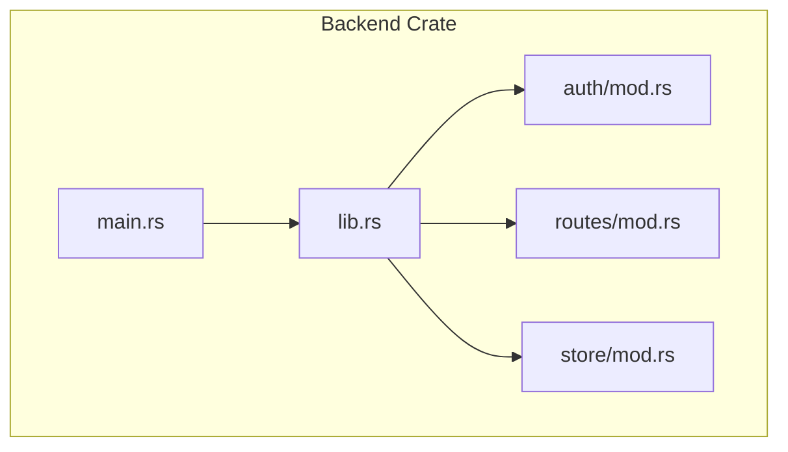
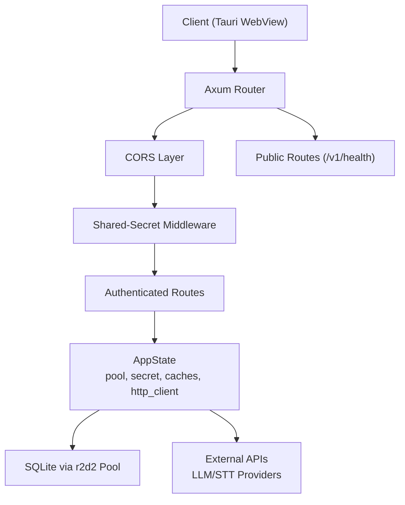
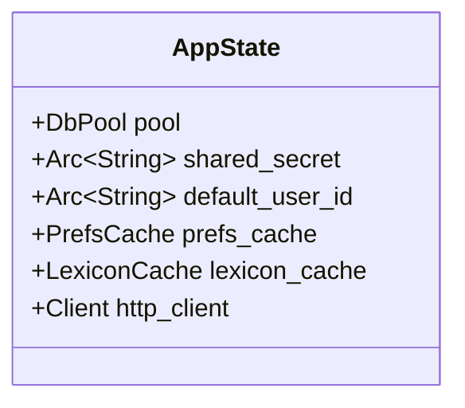
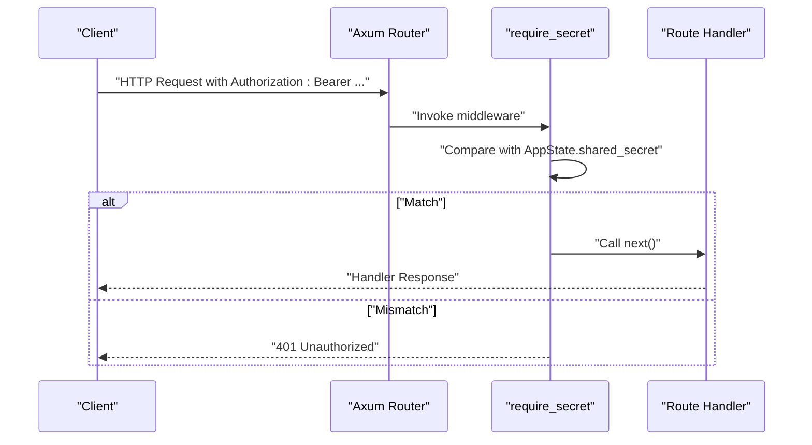
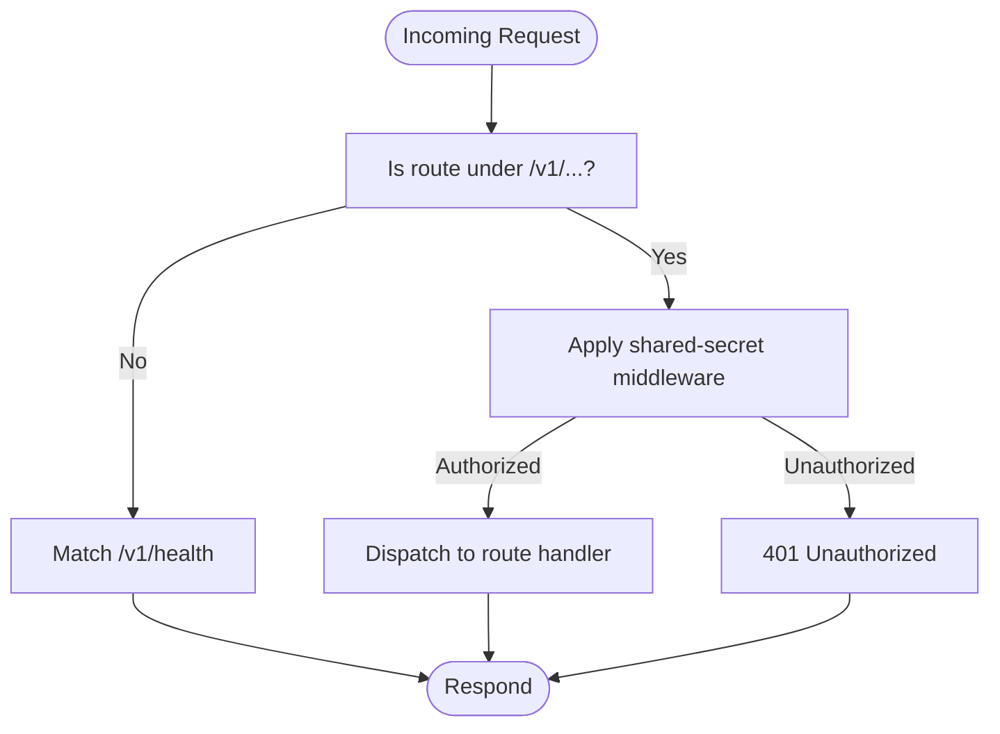
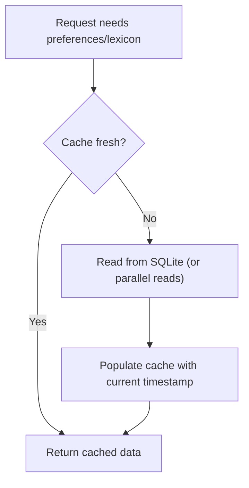
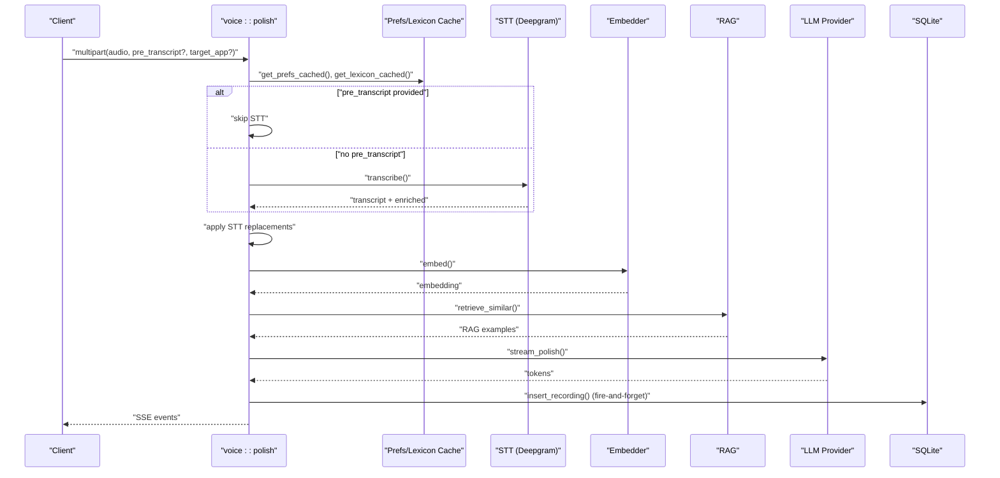
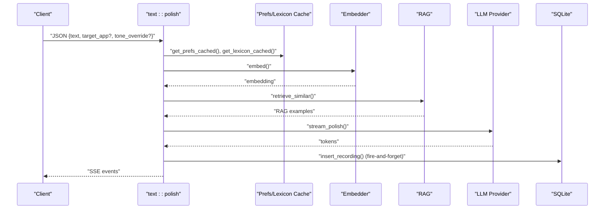
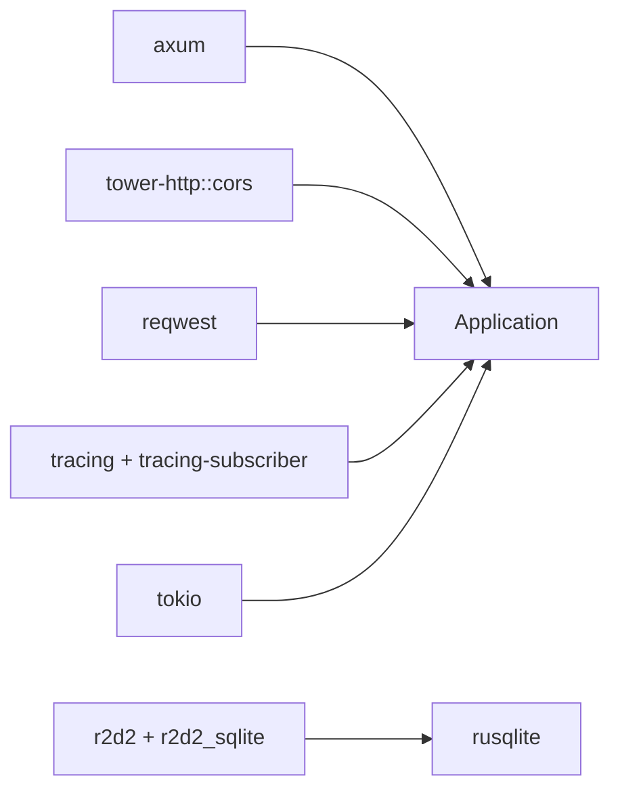

# Backend Architecture

<cite>
**Referenced Files in This Document**
- [main.rs](file://crates/backend/src/main.rs)
- [lib.rs](file://crates/backend/src/lib.rs)
- [Cargo.toml](file://crates/backend/Cargo.toml)
- [auth/mod.rs](file://crates/backend/src/auth/mod.rs)
- [routes/mod.rs](file://crates/backend/src/routes/mod.rs)
- [routes/health.rs](file://crates/backend/src/routes/health.rs)
- [routes/voice.rs](file://crates/backend/src/routes/voice.rs)
- [routes/text.rs](file://crates/backend/src/routes/text.rs)
- [routes/prefs.rs](file://crates/backend/src/routes/prefs.rs)
- [routes/history.rs](file://crates/backend/src/routes/history.rs)
- [store/mod.rs](file://crates/backend/src/store/mod.rs)
</cite>

## Table of Contents
1. [Introduction](#introduction)
2. [Project Structure](#project-structure)
3. [Core Components](#core-components)
4. [Architecture Overview](#architecture-overview)
5. [Detailed Component Analysis](#detailed-component-analysis)
6. [Dependency Analysis](#dependency-analysis)
7. [Performance Considerations](#performance-considerations)
8. [Troubleshooting Guide](#troubleshooting-guide)
9. [Conclusion](#conclusion)

## Introduction
This document describes the backend architecture of the WISPR Hindi Bridge HTTP API service. Built with the Axum web framework, the service exposes a modular set of REST endpoints behind a shared-secret bearer authentication scheme. It integrates middleware for CORS, manages application state centrally, and implements two high-performance in-memory caches for preferences and lexicon data. The backend orchestrates voice and text polishing workflows using external APIs and a local SQLite database with a robust connection pool. It also includes periodic maintenance tasks and structured logging for observability.

## Project Structure
The backend crate is organized into cohesive modules:
- Entry point and lifecycle: main.rs
- Application state, router factory, and caching utilities: lib.rs
- Authentication middleware: auth/mod.rs
- Route modules: routes/* (health, voice, text, history, preferences, vocabulary, cloud, feedback, etc.)
- Storage and persistence: store/* (SQLite, migrations, models)
- Dependencies and build configuration: Cargo.toml

**Diagram sources**
- [main.rs:1-234](file://crates/backend/src/main.rs#L1-L234)
- [lib.rs:1-227](file://crates/backend/src/lib.rs#L1-L227)
- [auth/mod.rs:1-38](file://crates/backend/src/auth/mod.rs#L1-L38)
- [routes/mod.rs:1-13](file://crates/backend/src/routes/mod.rs#L1-L13)
- [store/mod.rs:1-284](file://crates/backend/src/store/mod.rs#L1-L284)

**Section sources**
- [Cargo.toml:1-42](file://crates/backend/Cargo.toml#L1-L42)
- [main.rs:1-234](file://crates/backend/src/main.rs#L1-L234)
- [lib.rs:148-199](file://crates/backend/src/lib.rs#L148-L199)

## Core Components
- Application State (AppState): Centralized container holding the SQLite connection pool, shared secret, default user ID, preferences cache, lexicon cache, and a shared HTTP client configured with connection pooling.
- Router Factory: Builds public and authenticated route groups, applies CORS, and injects state.
- Middleware: Shared-secret bearer authentication enforced on authenticated routes.
- Caching Utilities: Hot caches for preferences and lexicon with TTL and invalidation semantics.

Key responsibilities:
- State initialization and lifetime management
- Route registration and middleware composition
- Request-scoped access to caches and database
- External HTTP client reuse for performance

**Section sources**
- [lib.rs:135-146](file://crates/backend/src/lib.rs#L135-L146)
- [lib.rs:150-199](file://crates/backend/src/lib.rs#L150-L199)
- [auth/mod.rs:19-37](file://crates/backend/src/auth/mod.rs#L19-L37)
- [lib.rs:41-69](file://crates/backend/src/lib.rs#L41-L69)
- [lib.rs:90-131](file://crates/backend/src/lib.rs#L90-L131)

## Architecture Overview
The backend follows a layered architecture:
- Transport and Routing: Axum Router with middleware layers
- Authentication: Shared-secret bearer middleware
- CORS: Tower HTTP CORS layer
- Business Logic: Route handlers for voice, text, history, preferences, and others
- Persistence: SQLite via r2d2 pool with migrations
- External Services: HTTP client for LLM providers and STT
- Observability: Structured logging and periodic maintenance tasks

**Diagram sources**
- [lib.rs:150-199](file://crates/backend/src/lib.rs#L150-L199)
- [auth/mod.rs:19-37](file://crates/backend/src/auth/mod.rs#L19-L37)
- [store/mod.rs:34-60](file://crates/backend/src/store/mod.rs#L34-L60)
- [main.rs:62-75](file://crates/backend/src/main.rs#L62-L75)

## Detailed Component Analysis

### Application State Management (AppState)
AppState encapsulates:
- Database pool for SQLite
- Shared secret for authentication
- Default user ID
- Preferences cache (hot cache)
- Lexicon cache (hot cache)
- Shared HTTP client with connection pooling

Lifecycle:
- Constructed in main.rs from CLI-provided DB path and environment variables
- Passed into router_with_state to become available to all handlers via State extractor

**Diagram sources**
- [lib.rs:135-146](file://crates/backend/src/lib.rs#L135-L146)
- [main.rs:68-75](file://crates/backend/src/main.rs#L68-L75)

**Section sources**
- [lib.rs:135-146](file://crates/backend/src/lib.rs#L135-L146)
- [main.rs:57-75](file://crates/backend/src/main.rs#L57-L75)

### Middleware Pattern and Authentication
- Shared-secret bearer middleware validates Authorization: Bearer <secret> against AppState.shared_secret
- Applied to authenticated routes only
- Returns 401 Unauthorized on mismatch

**Diagram sources**
- [auth/mod.rs:19-37](file://crates/backend/src/auth/mod.rs#L19-L37)
- [lib.rs:184-187](file://crates/backend/src/lib.rs#L184-L187)

**Section sources**
- [auth/mod.rs:1-38](file://crates/backend/src/auth/mod.rs#L1-L38)
- [lib.rs:184-187](file://crates/backend/src/lib.rs#L184-L187)

### Routing Architecture
- Public routes: /v1/health
- Authenticated routes: /v1/voice/polish, /v1/text/polish, /v1/history, /v1/preferences, /v1/vocabulary, /v1/cloud/token, /v1/openai-oauth/*
- CORS: Allow Any origin, common HTTP methods, and essential headers

**Diagram sources**
- [lib.rs:150-199](file://crates/backend/src/lib.rs#L150-L199)
- [routes/health.rs:1-10](file://crates/backend/src/routes/health.rs#L1-L10)

**Section sources**
- [lib.rs:150-199](file://crates/backend/src/lib.rs#L150-L199)
- [routes/mod.rs:1-13](file://crates/backend/src/routes/mod.rs#L1-L13)

### Caching Strategy
Two hot caches reduce database load:
- Preferences Cache
  - TTL: 30 seconds
  - Fast path: read from RwLock<Option<CachedPrefs>>
  - Slow path: read from SQLite, populate cache
  - Invalidation: explicit after PATCH /v1/preferences
- Lexicon Cache
  - TTL: 60 seconds
  - Fast path: read corrections and STT replacements together
  - Slow path: parallel blocking reads for corrections and STT replacements, then populate cache
  - Invalidation: explicit after writes affecting lexicon

**Diagram sources**
- [lib.rs:41-69](file://crates/backend/src/lib.rs#L41-L69)
- [lib.rs:90-131](file://crates/backend/src/lib.rs#L90-L131)

**Section sources**
- [lib.rs:23-69](file://crates/backend/src/lib.rs#L23-L69)
- [lib.rs:71-131](file://crates/backend/src/lib.rs#L71-L131)

### HTTP Client and Connection Pooling
- Shared reqwest Client built once and stored in AppState
- Connection pooling: max idle per host = 4, idle timeout = 90 seconds
- Reused across all external API calls (STT, LLM providers)
- Benefits: reduced TCP/TLS handshake overhead, improved latency

**Section sources**
- [main.rs:62-66](file://crates/backend/src/main.rs#L62-L66)
- [lib.rs:210-214](file://crates/backend/src/lib.rs#L210-L214)

### Modular Route Organization
- Health: /v1/health
- Voice: /v1/voice/polish (SSE stream)
- Text: /v1/text/polish (SSE stream)
- History: list, delete, audio streaming
- Preferences: get and patch preferences; corrections endpoint
- Vocabulary: list, create, delete, star toggling
- Cloud: token store/clear and status
- OpenAI OAuth: initiate, status, disconnect
- Pending Edits: create, list, resolve

Each route module exports a handler function registered in the router factory.

**Section sources**
- [lib.rs:150-199](file://crates/backend/src/lib.rs#L150-L199)
- [routes/health.rs:1-10](file://crates/backend/src/routes/health.rs#L1-L10)
- [routes/voice.rs:85-419](file://crates/backend/src/routes/voice.rs#L85-L419)
- [routes/text.rs:47-265](file://crates/backend/src/routes/text.rs#L47-L265)
- [routes/history.rs:23-79](file://crates/backend/src/routes/history.rs#L23-L79)
- [routes/prefs.rs:29-56](file://crates/backend/src/routes/prefs.rs#L29-L56)

### Voice Processing Workflow
End-to-end flow for POST /v1/voice/polish:
- Extract multipart fields (audio, optional pre-transcript, optional target_app)
- Save audio to local storage (1-day retention)
- Load preferences and lexicon via caches
- Optional STT (Deepgram) if no pre-transcript
- Apply STT replacements from lexicon
- Embed transcript and retrieve RAG examples
- Build system prompt with vocabulary and corrections
- Stream tokens from chosen LLM provider (OpenAI Codex, Gemini Direct, Groq, or Gateway)
- Persist recording asynchronously
- Emit SSE events: status, token, done

**Diagram sources**
- [routes/voice.rs:85-419](file://crates/backend/src/routes/voice.rs#L85-L419)

**Section sources**
- [routes/voice.rs:1-460](file://crates/backend/src/routes/voice.rs#L1-L460)

### Text Processing Workflow
End-to-end flow for POST /v1/text/polish:
- Deserialize JSON body (text, optional target_app, optional tone_override)
- Load preferences and lexicon via caches
- Embed transcript and retrieve RAG examples
- Build system prompt (with or without RAG and corrections depending on tone_override)
- Stream tokens from chosen LLM provider
- Persist recording asynchronously
- Emit SSE events: status, token, done

**Diagram sources**
- [routes/text.rs:47-265](file://crates/backend/src/routes/text.rs#L47-L265)

**Section sources**
- [routes/text.rs:1-266](file://crates/backend/src/routes/text.rs#L1-L266)

### Database and Migration Management
- SQLite connection pool via r2d2 with:
  - Max pool size: 5
  - Connection timeout: 10 seconds
  - WAL mode, foreign keys enabled, 5-second busy timeout
- Automatic migrations up to version 12
- Default DB path under user data directory
- Ensures default local user and initial preferences on startup

**Section sources**
- [store/mod.rs:34-60](file://crates/backend/src/store/mod.rs#L34-L60)
- [store/mod.rs:62-165](file://crates/backend/src/store/mod.rs#L62-L165)
- [store/mod.rs:167-215](file://crates/backend/src/store/mod.rs#L167-L215)

### Background Tasks and Maintenance
- Periodic cleanup:
  - Every 6 hours: remove old recordings and old audio files
- Hourly metering report:
  - Aggregates usage over the last 7 days and posts to cloud endpoint using bearer token from user record

**Section sources**
- [main.rs:88-118](file://crates/backend/src/main.rs#L88-L118)
- [main.rs:149-233](file://crates/backend/src/main.rs#L149-L233)

## Dependency Analysis
External dependencies relevant to architecture:
- Axum: HTTP framework and SSE streaming
- tower-http: CORS middleware
- reqwest: HTTP client with connection pooling
- r2d2 + r2d2_sqlite + rusqlite: SQLite connection pooling and driver
- tracing/tracing-subscriber: structured logging
- tokio: async runtime and tasks

**Diagram sources**
- [Cargo.toml:14-39](file://crates/backend/Cargo.toml#L14-L39)

**Section sources**
- [Cargo.toml:14-39](file://crates/backend/Cargo.toml#L14-L39)

## Performance Considerations
- Connection pooling:
  - Single shared HTTP client with max idle per host and idle timeouts reduces connection churn
  - SQLite pool size tuned for local workload
- Caching:
  - Preferences cache (30s TTL) and lexicon cache (60s TTL) minimize database reads
  - Parallel blocking reads for lexicon reduce latency
- Streaming:
  - SSE streams tokens as they arrive, avoiding large intermediate buffers
- Asynchronous persistence:
  - Recording inserts are fire-and-forget to keep streaming responsive
- Maintenance:
  - Scheduled cleanup prevents disk growth and stale data accumulation

[No sources needed since this section provides general guidance]

## Troubleshooting Guide
Common issues and diagnostics:
- Authentication failures:
  - Verify Authorization header format and value matches shared secret
  - Confirm POLISH_SHARED_SECRET environment variable is set and consistent
- CORS errors:
  - Ensure requests originate from allowed origins; check browser console for CORS denial
- Database connectivity:
  - Check default DB path and permissions; verify WAL/foreign keys pragmas
  - Review pool size and timeouts if encountering connection exhaustion
- External API errors:
  - Inspect provider keys and network reachability; review SSE error events
- Logging:
  - Backend logs to a dedicated file; inspect for warnings and errors during request lifecycle

**Section sources**
- [auth/mod.rs:24-36](file://crates/backend/src/auth/mod.rs#L24-L36)
- [store/mod.rs:34-60](file://crates/backend/src/store/mod.rs#L34-L60)
- [main.rs:20-39](file://crates/backend/src/main.rs#L20-L39)

## Conclusion
The WISPR Hindi Bridge backend leverages Axum for a clean, modular routing model, a shared-secret bearer middleware for local protection, and Tower HTTP CORS for flexible integration. Application state centralizes resources and caches for predictable performance. The SQLite-backed persistence with migrations and a dedicated connection pool supports reliable local operation. Background tasks maintain data hygiene and reporting. Together, these components deliver a robust, observable, and efficient HTTP API for voice and text polishing workflows.