# Data Flow Architecture

<cite>
**Referenced Files in This Document**
- [main.rs](file://crates/backend/src/main.rs)
- [lib.rs](file://crates/backend/src/lib.rs)
- [voice.rs](file://crates/backend/src/routes/voice.rs)
- [text.rs](file://crates/backend/src/routes/text.rs)
- [deepgram.rs](file://crates/backend/src/stt/deepgram.rs)
- [dg_stream.rs](file://desktop/src-tauri/src/dg_stream.rs)
- [api.rs](file://desktop/src-tauri/src/api.rs)
- [store/mod.rs](file://crates/backend/src/store/mod.rs)
- [history.rs](file://crates/backend/src/store/history.rs)
- [vocabulary.rs](file://crates/backend/src/store/vocabulary.rs)
- [prefs.rs](file://crates/backend/src/store/prefs.rs)
- [Cargo.toml](file://Cargo.toml)
</cite>

## Table of Contents
1. [Introduction](#introduction)
2. [Project Structure](#project-structure)
3. [Core Components](#core-components)
4. [Architecture Overview](#architecture-overview)
5. [Detailed Component Analysis](#detailed-component-analysis)
6. [Dependency Analysis](#dependency-analysis)
7. [Performance Considerations](#performance-considerations)
8. [Troubleshooting Guide](#troubleshooting-guide)
9. [Conclusion](#conclusion)

## Introduction
This document describes the end-to-end data flow architecture for the WISPR Hindi Bridge processing pipeline. It covers the complete journey from microphone input through audio capture, speech-to-text (STT), AI language processing, to polished output display. It documents both streaming (real-time) and batch (saved recordings) processing modes, the data transformation pipeline (confidence scoring, edit detection, feedback collection), database integration patterns, cache invalidation strategies, error handling, retry logic, graceful degradation, and asynchronous processing with concurrent request handling.

## Project Structure
The system is organized into:
- Backend service (Rust Axum server) exposing REST APIs and managing state, caches, and persistence.
- Desktop client (Tauri) orchestrating recording, streaming to Deepgram, and consuming SSE streams.
- Shared crates for core logic, recorder, paster, and hotkey utilities.

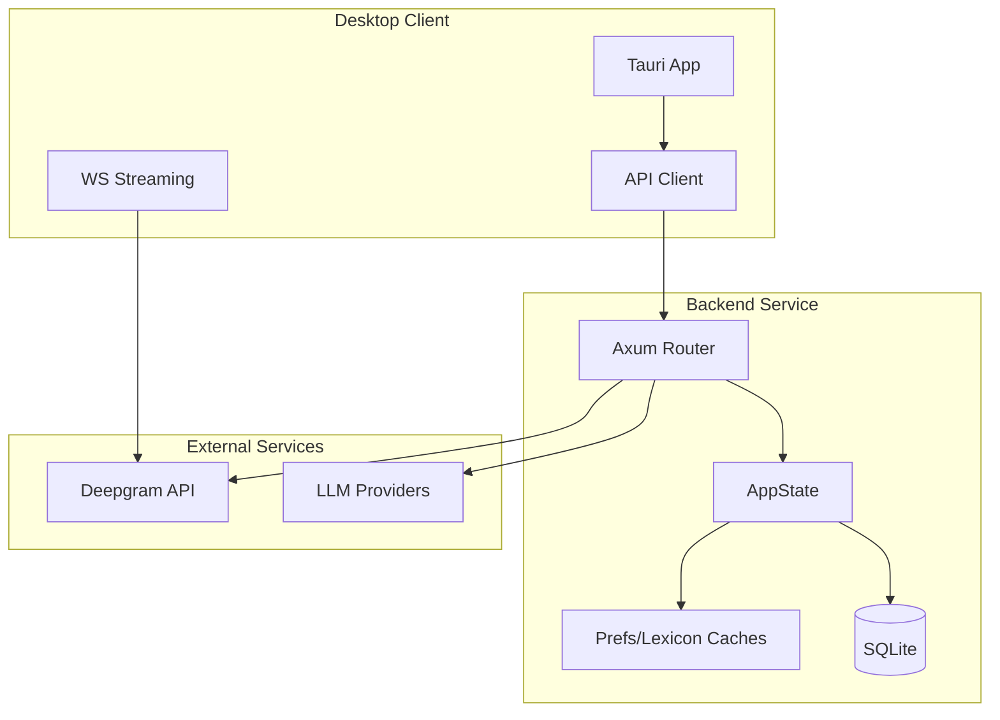

**Diagram sources**
- [main.rs:18-145](file://crates/backend/src/main.rs#L18-L145)
- [lib.rs:150-227](file://crates/backend/src/lib.rs#L150-L227)
- [voice.rs:85-460](file://crates/backend/src/routes/voice.rs#L85-L460)
- [text.rs:47-266](file://crates/backend/src/routes/text.rs#L47-L266)
- [dg_stream.rs:37-388](file://desktop/src-tauri/src/dg_stream.rs#L37-L388)

**Section sources**
- [Cargo.toml:1-30](file://Cargo.toml#L1-L30)

## Core Components
- Backend server: HTTP router, middleware, state management, SSE streaming, and scheduled tasks.
- STT module: Deepgram batch and WebSocket streaming integrations.
- LLM routing: Provider selection and streaming clients.
- Storage: SQLite-backed persistence for preferences, history, vocabulary, and embeddings.
- Caching: Hot-path caches for preferences and lexicon to minimize DB reads.
- Desktop client: Recording orchestration, streaming to Deepgram, SSE consumption, and UI updates.

**Section sources**
- [lib.rs:23-131](file://crates/backend/src/lib.rs#L23-L131)
- [store/mod.rs:34-60](file://crates/backend/src/store/mod.rs#L34-L60)
- [voice.rs:85-460](file://crates/backend/src/routes/voice.rs#L85-L460)
- [text.rs:47-266](file://crates/backend/src/routes/text.rs#L47-L266)

## Architecture Overview
The backend exposes REST endpoints protected by a shared secret. Requests are served via Axum with SSE for streaming responses. The desktop client communicates with the backend over localhost and optionally streams audio to Deepgram via WebSocket for near-real-time transcription.

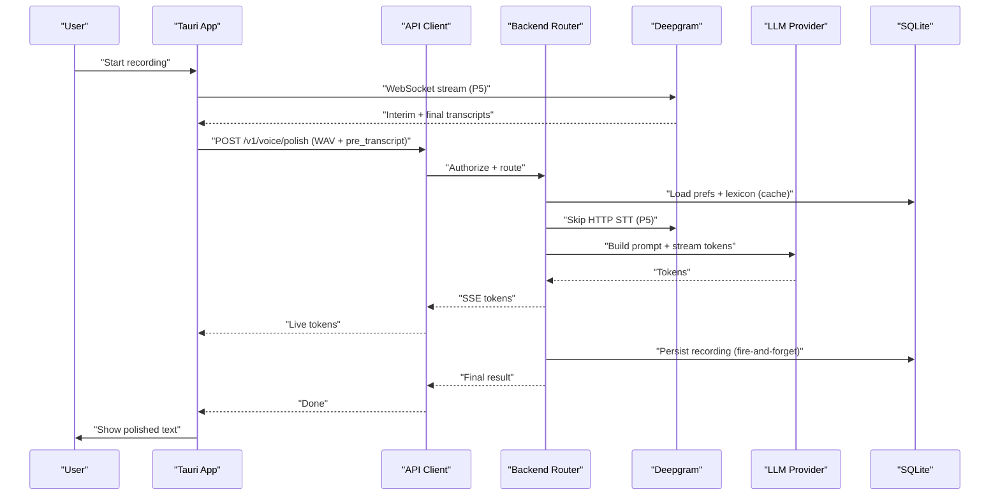

**Diagram sources**
- [dg_stream.rs:37-388](file://desktop/src-tauri/src/dg_stream.rs#L37-L388)
- [api.rs:132-178](file://desktop/src-tauri/src/api.rs#L132-L178)
- [voice.rs:85-460](file://crates/backend/src/routes/voice.rs#L85-L460)

## Detailed Component Analysis

### Real-Time Streaming Pipeline (P5)
- Microphone capture feeds a resampling and PCM conversion pipeline.
- WebSocket connects to Deepgram with endpointing tuned for Hindi/Hinglish.
- Interim results are captured and enriched with confidence markers; final transcript assembled after drain window.
- Optional speculative embedding request is sent to backend’s pre-embed endpoint to warm caches.

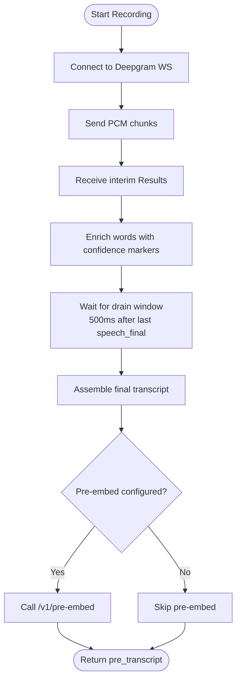

**Diagram sources**
- [dg_stream.rs:37-388](file://desktop/src-tauri/src/dg_stream.rs#L37-L388)

**Section sources**
- [dg_stream.rs:37-388](file://desktop/src-tauri/src/dg_stream.rs#L37-L388)

### Batch Processing Pipeline (Saved Recordings)
- WAV bytes are uploaded to the backend.
- Preferences and lexicon are loaded from hot-path caches.
- If no pre-transcript is provided, Deepgram batch API is invoked.
- Post-STT replacements and enrichment with confidence markers are applied.
- Embedding is computed concurrently with prompt construction; RAG examples are retrieved.
- LLM tokens are streamed via SSE; final result persisted asynchronously.

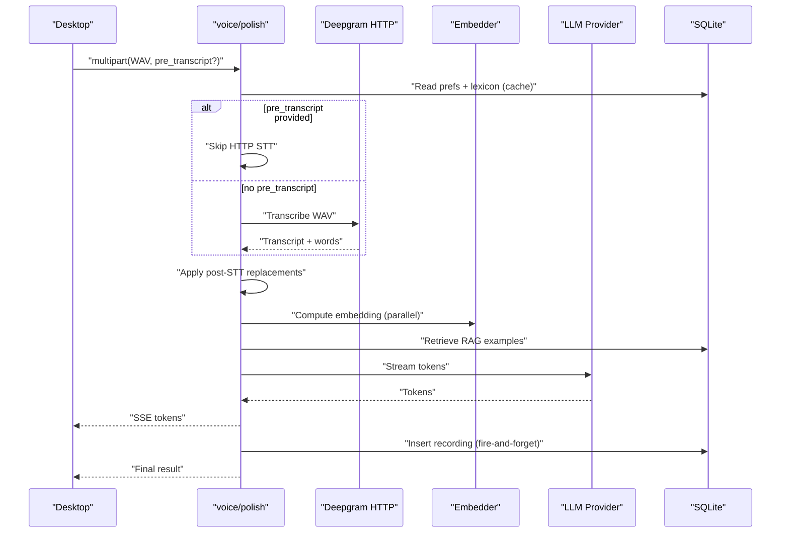

**Diagram sources**
- [voice.rs:85-460](file://crates/backend/src/routes/voice.rs#L85-L460)
- [deepgram.rs:59-146](file://crates/backend/src/stt/deepgram.rs#L59-L146)

**Section sources**
- [voice.rs:85-460](file://crates/backend/src/routes/voice.rs#L85-L460)
- [deepgram.rs:59-146](file://crates/backend/src/stt/deepgram.rs#L59-L146)

### Text-Based Processing Pipeline
- Desktop sends plain text to the backend.
- Embedding and RAG retrieval are performed; prompt is built differently for tray-triggered polish vs. user preferences.
- LLM tokens are streamed; result persisted asynchronously.

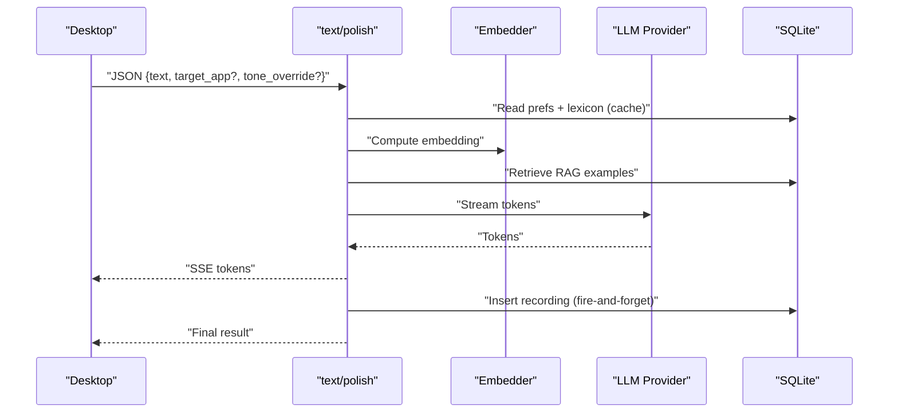

**Diagram sources**
- [text.rs:47-266](file://crates/backend/src/routes/text.rs#L47-L266)

**Section sources**
- [text.rs:47-266](file://crates/backend/src/routes/text.rs#L47-L266)

### Data Transformation Pipeline
- Confidence scoring: Deepgram word-level confidence thresholds flag uncertain words with markers for downstream scrutiny.
- Enrichment: Confidence markers are embedded into transcripts for LLM context.
- Post-STT replacements: Rules applied to both plain and enriched transcripts to normalize spelling and pronunciation.
- RAG retrieval: Similar past edits and examples are retrieved using vector embeddings.

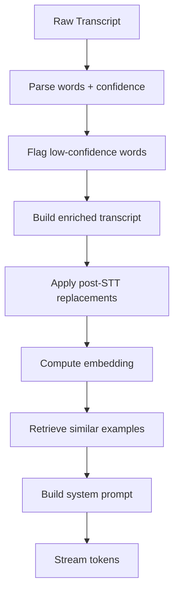

**Diagram sources**
- [deepgram.rs:148-166](file://crates/backend/src/stt/deepgram.rs#L148-L166)
- [voice.rs:212-231](file://crates/backend/src/routes/voice.rs#L212-L231)
- [voice.rs:254-272](file://crates/backend/src/routes/voice.rs#L254-L272)

**Section sources**
- [deepgram.rs:148-166](file://crates/backend/src/stt/deepgram.rs#L148-L166)
- [voice.rs:212-231](file://crates/backend/src/routes/voice.rs#L212-L231)
- [voice.rs:254-272](file://crates/backend/src/routes/voice.rs#L254-L272)

### Database Integration Patterns
- Schema migration and initialization are handled on open; WAL mode and foreign keys are enabled.
- Default user and preferences are ensured at startup.
- Recording history is inserted asynchronously after SSE completion.
- Vocabulary terms are upserted with decay and weighting; used to bias STT keyterms.
- Preferences and lexicon are cached with TTL and invalidated on writes.

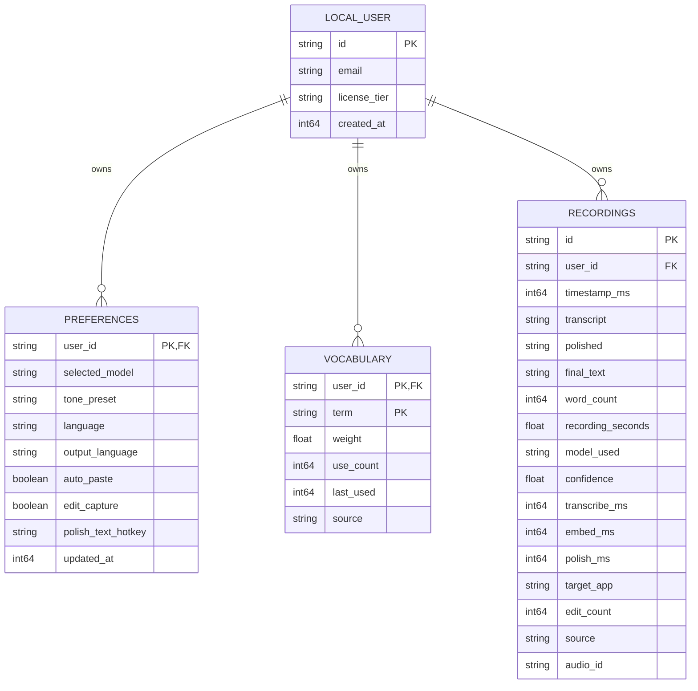

**Diagram sources**
- [store/mod.rs:34-60](file://crates/backend/src/store/mod.rs#L34-L60)
- [history.rs:28-63](file://crates/backend/src/store/history.rs#L28-L63)
- [vocabulary.rs:33-72](file://crates/backend/src/store/vocabulary.rs#L33-L72)
- [prefs.rs:47-76](file://crates/backend/src/store/prefs.rs#L47-L76)

**Section sources**
- [store/mod.rs:34-60](file://crates/backend/src/store/mod.rs#L34-L60)
- [history.rs:28-63](file://crates/backend/src/store/history.rs#L28-L63)
- [vocabulary.rs:33-72](file://crates/backend/src/store/vocabulary.rs#L33-L72)
- [prefs.rs:47-76](file://crates/backend/src/store/prefs.rs#L47-L76)

### Cache Invalidation and Data Consistency
- Preferences cache: 30s TTL; invalidated on PATCH /v1/preferences.
- Lexicon cache: 60s TTL; invalidated on writes to corrections or stt_replacements.
- Hot-path caches in desktop: language and vocabulary terms cached for the recording critical path; refreshed on preference changes or feedback.

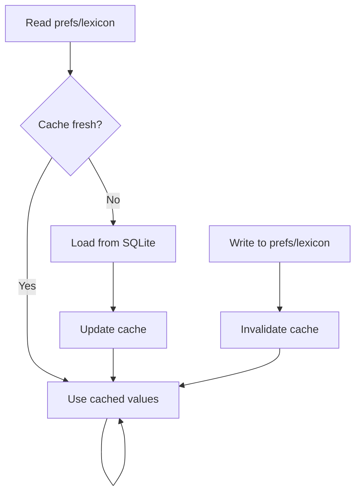

**Diagram sources**
- [lib.rs:41-69](file://crates/backend/src/lib.rs#L41-L69)
- [lib.rs:90-131](file://crates/backend/src/lib.rs#L90-L131)

**Section sources**
- [lib.rs:41-69](file://crates/backend/src/lib.rs#L41-L69)
- [lib.rs:90-131](file://crates/backend/src/lib.rs#L90-L131)

### Feedback Collection and Edit Detection
- Feedback submission updates the recording’s final text and increments edit count.
- Classification endpoint determines whether to promote vocabulary or adjust corrections based on edit outcomes.
- Pending edits can be stored and later resolved.

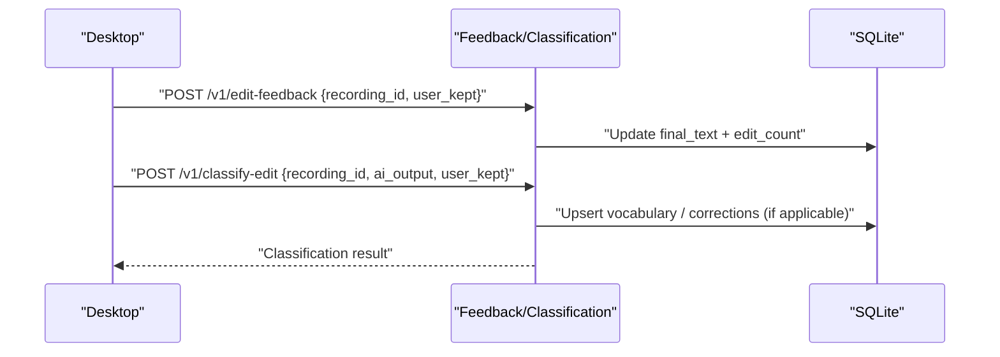

**Diagram sources**
- [voice.rs:396-413](file://crates/backend/src/routes/voice.rs#L396-L413)
- [api.rs:607-634](file://desktop/src-tauri/src/api.rs#L607-L634)
- [api.rs:713-738](file://desktop/src-tauri/src/api.rs#L713-L738)

**Section sources**
- [voice.rs:396-413](file://crates/backend/src/routes/voice.rs#L396-L413)
- [api.rs:607-634](file://desktop/src-tauri/src/api.rs#L607-L634)
- [api.rs:713-738](file://desktop/src-tauri/src/api.rs#L713-L738)

### Asynchronous Processing and Concurrency
- SSE streaming uses Tokio channels to deliver tokens to clients.
- Background tasks handle periodic cleanup and metering reports.
- Parallelism: embedding computation overlaps with prompt construction; multiple DB reads are parallelized via blocking tasks.

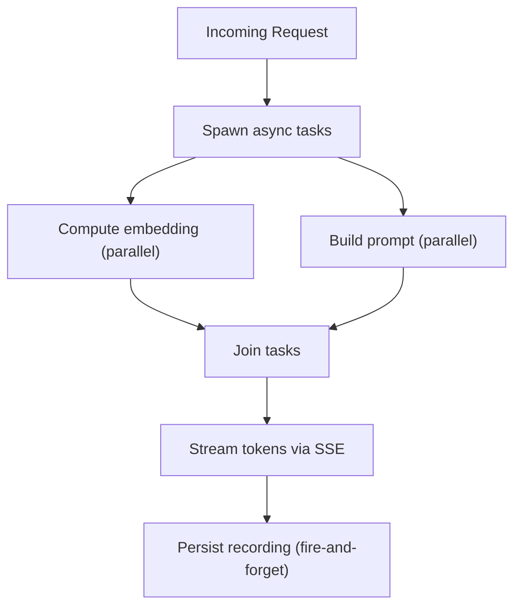

**Diagram sources**
- [voice.rs:243-245](file://crates/backend/src/routes/voice.rs#L243-L245)
- [voice.rs:313-333](file://crates/backend/src/routes/voice.rs#L313-L333)
- [main.rs:89-118](file://crates/backend/src/main.rs#L89-L118)

**Section sources**
- [voice.rs:243-245](file://crates/backend/src/routes/voice.rs#L243-L245)
- [voice.rs:313-333](file://crates/backend/src/routes/voice.rs#L313-L333)
- [main.rs:89-118](file://crates/backend/src/main.rs#L89-L118)

## Dependency Analysis
- Backend depends on Axum for routing, Tokio for async runtime, Reqwest for HTTP, and Rusqlite for SQLite.
- Desktop client depends on Tauri, Reqwest for SSE consumption, and the recorder crate for audio capture.
- Caching reduces DB pressure; scheduled tasks maintain data hygiene.

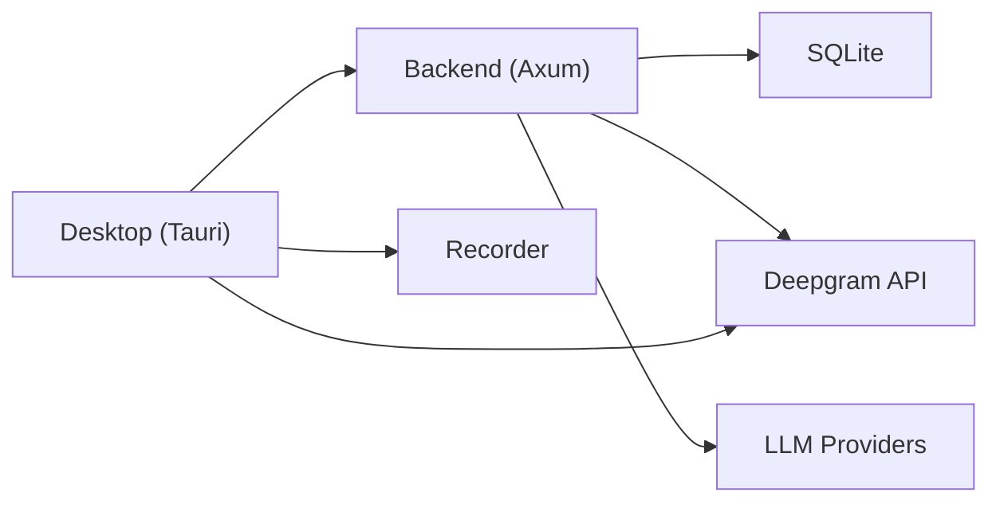

**Diagram sources**
- [Cargo.toml:16-25](file://Cargo.toml#L16-L25)
- [main.rs:18-145](file://crates/backend/src/main.rs#L18-L145)
- [lib.rs:150-227](file://crates/backend/src/lib.rs#L150-L227)

**Section sources**
- [Cargo.toml:16-25](file://Cargo.toml#L16-L25)
- [main.rs:18-145](file://crates/backend/src/main.rs#L18-L145)

## Performance Considerations
- Hot-path caching minimizes DB reads for preferences and lexicon.
- Parallel embedding and prompt building reduce latency.
- Streaming SSE avoids buffering large payloads.
- Scheduled cleanup and metering tasks prevent resource accumulation.
- Endpointing tuning improves STT accuracy for Hindi/Hinglish.

[No sources needed since this section provides general guidance]

## Troubleshooting Guide
- Humanized error messages translate backend errors into friendly user-facing text.
- STT failures (e.g., empty transcript, API key issues, rate limits) are surfaced via SSE error events.
- LLM provider errors (e.g., unauthorized, rate-limited) are handled gracefully with fallback messaging.
- Graceful shutdown on signals ensures clean termination.

**Section sources**
- [main.rs:120-142](file://crates/backend/src/main.rs#L120-L142)
- [api.rs:221-259](file://desktop/src-tauri/src/api.rs#L221-L259)
- [voice.rs:202-208](file://crates/backend/src/routes/voice.rs#L202-L208)
- [voice.rs:341-357](file://crates/backend/src/routes/voice.rs#L341-L357)

## Conclusion
The WISPR Hindi Bridge employs a robust, asynchronous architecture combining local caching, real-time streaming, and batch processing. Confidence-aware transcripts, RAG-enhanced prompts, and structured feedback loops drive continuous improvement. The backend’s SSE streaming, scheduled maintenance, and SQLite-backed persistence provide a responsive and reliable user experience across both real-time dictation and saved recordings.