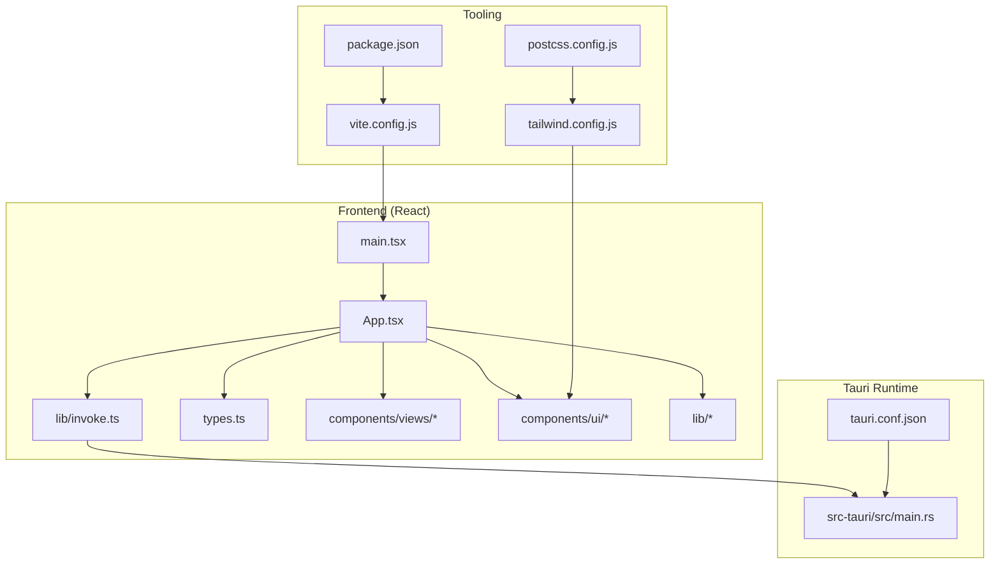
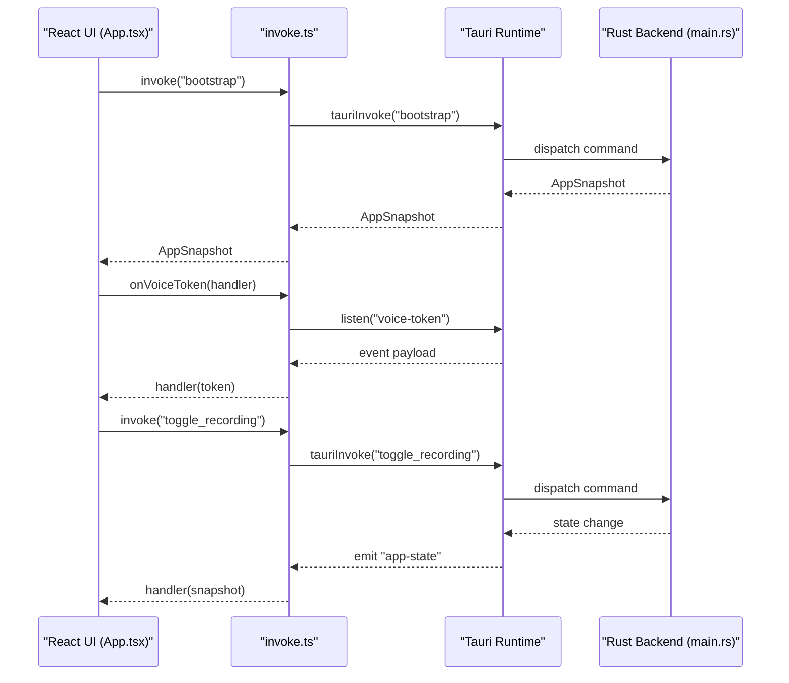
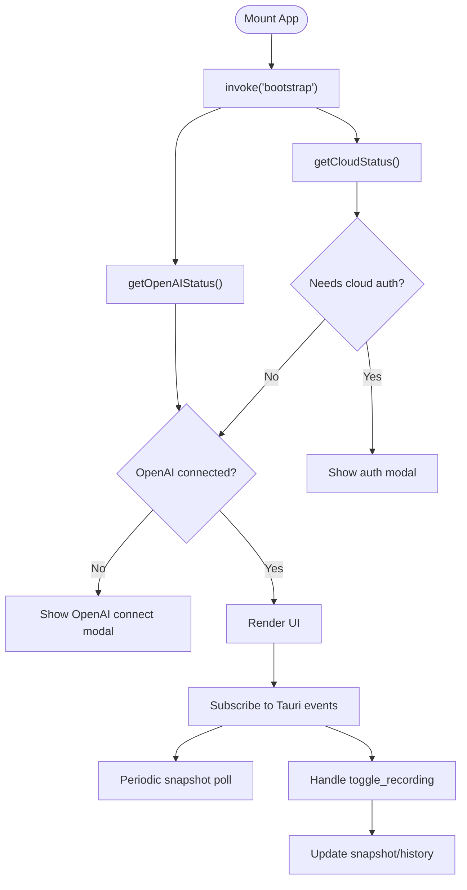
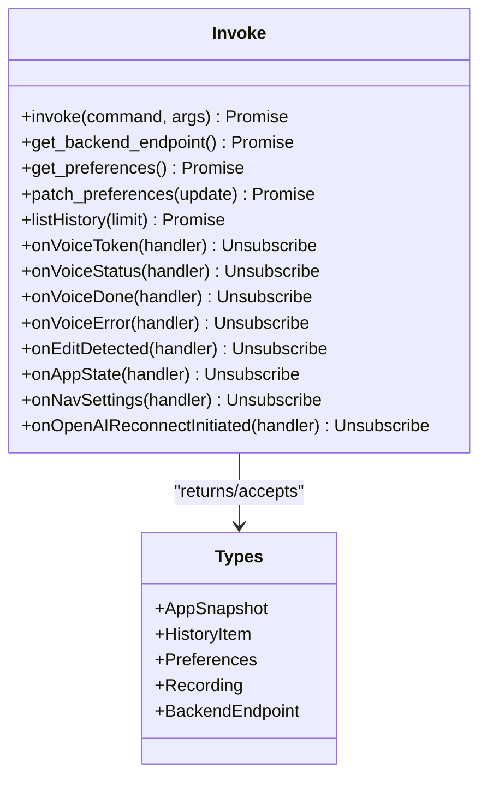
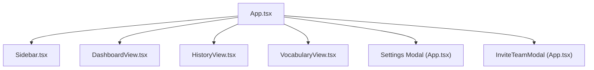
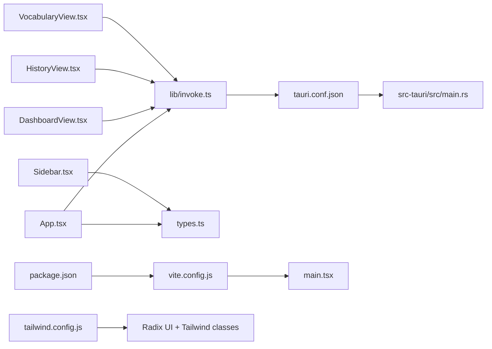

# Frontend Architecture

<cite>
**Referenced Files in This Document**
- [desktop/src/main.tsx](file://desktop/src/main.tsx)
- [desktop/src/App.tsx](file://desktop/src/App.tsx)
- [desktop/src/lib/invoke.ts](file://desktop/src/lib/invoke.ts)
- [desktop/src/types.ts](file://desktop/src/types.ts)
- [desktop/src/components/views/DashboardView.tsx](file://desktop/src/components/views/DashboardView.tsx)
- [desktop/src/components/views/HistoryView.tsx](file://desktop/src/components/views/HistoryView.tsx)
- [desktop/src/components/views/VocabularyView.tsx](file://desktop/src/components/views/VocabularyView.tsx)
- [desktop/src/components/Sidebar.tsx](file://desktop/src/components/Sidebar.tsx)
- [desktop/src/lib/useTheme.ts](file://desktop/src/lib/useTheme.ts)
- [desktop/src-tauri/src/main.rs](file://desktop/src-tauri/src/main.rs)
- [desktop/src-tauri/tauri.conf.json](file://desktop/src-tauri/tauri.conf.json)
- [desktop/package.json](file://desktop/package.json)
- [desktop/vite.config.js](file://desktop/vite.config.js)
- [desktop/tailwind.config.js](file://desktop/tailwind.config.js)
- [desktop/postcss.config.js](file://desktop/postcss.config.js)
</cite>

## Table of Contents
1. [Introduction](#introduction)
2. [Project Structure](#project-structure)
3. [Core Components](#core-components)
4. [Architecture Overview](#architecture-overview)
5. [Detailed Component Analysis](#detailed-component-analysis)
6. [Dependency Analysis](#dependency-analysis)
7. [Performance Considerations](#performance-considerations)
8. [Troubleshooting Guide](#troubleshooting-guide)
9. [Conclusion](#conclusion)
10. [Appendices](#appendices)

## Introduction
This document describes the frontend architecture of the WISPR Hindi Bridge React application built with Tauri. It explains how the React UI integrates with the Rust backend through Tauri’s Inter-Process Communication (IPC) commands and events, outlines the component hierarchy across main views (Dashboard, History, Vocabulary, Settings, and Insights), documents state management patterns using React hooks and Tauri’s event system, and details TypeScript integration and styling with Tailwind CSS and Radix UI. It also covers the build process, asset bundling, and cross-platform compilation strategy, and clarifies the separation between web-based UI logic and native functionality.

## Project Structure
The desktop application is organized into:
- React frontend under desktop/src, with views, components, and shared libraries
- Tauri configuration and Rust backend under desktop/src-tauri
- Build tooling with Vite, Tailwind CSS, and PostCSS
- Type-safe contracts defined in TypeScript

**Diagram sources**
- [desktop/src/main.tsx:1-11](file://desktop/src/main.tsx#L1-L11)
- [desktop/src/App.tsx:1-671](file://desktop/src/App.tsx#L1-L671)
- [desktop/src/lib/invoke.ts:1-667](file://desktop/src/lib/invoke.ts#L1-L667)
- [desktop/src/types.ts:1-247](file://desktop/src/types.ts#L1-L247)
- [desktop/src-tauri/tauri.conf.json:1-51](file://desktop/src-tauri/tauri.conf.json#L1-L51)
- [desktop/src-tauri/src/main.rs:1-800](file://desktop/src-tauri/src/main.rs#L1-L800)
- [desktop/vite.config.js:1-22](file://desktop/vite.config.js#L1-L22)
- [desktop/package.json:1-38](file://desktop/package.json#L1-L38)
- [desktop/tailwind.config.js:1-45](file://desktop/tailwind.config.js#L1-L45)
- [desktop/postcss.config.js:1-7](file://desktop/postcss.config.js#L1-L7)

**Section sources**
- [desktop/src/main.tsx:1-11](file://desktop/src/main.tsx#L1-L11)
- [desktop/src-tauri/tauri.conf.json:1-51](file://desktop/src-tauri/tauri.conf.json#L1-L51)
- [desktop/package.json:1-38](file://desktop/package.json#L1-L38)
- [desktop/vite.config.js:1-22](file://desktop/vite.config.js#L1-L22)
- [desktop/tailwind.config.js:1-45](file://desktop/tailwind.config.js#L1-L45)
- [desktop/postcss.config.js:1-7](file://desktop/postcss.config.js#L1-L7)

## Core Components
- App shell and orchestration: The root App component manages application-wide state, bootstraps the backend, subscribes to Tauri events, and renders the active view along with global toasts and modals.
- IPC abstraction: The invoke library encapsulates Tauri commands and event listeners, with a runtime detection mechanism to support development previews without Tauri.
- Typed contracts: The types module defines strongly typed shapes for snapshots, history items, preferences, and backend endpoints to ensure type safety across the UI and backend.
- Views: Dashboard, History, Vocabulary, and Insights provide domain-specific UIs backed by backend data and events.
- UI primitives: Shared components (buttons, cards, scroll areas, tabs) and styling via Tailwind CSS and Radix UI.

**Section sources**
- [desktop/src/App.tsx:1-671](file://desktop/src/App.tsx#L1-L671)
- [desktop/src/lib/invoke.ts:1-667](file://desktop/src/lib/invoke.ts#L1-L667)
- [desktop/src/types.ts:1-247](file://desktop/src/types.ts#L1-L247)

## Architecture Overview
The frontend uses Tauri’s IPC to communicate with the Rust backend:
- Commands: The frontend invokes named commands (e.g., bootstrap, get_history, toggle_recording) that are implemented in Rust and return typed data.
- Events: The backend emits named events (e.g., app-state, voice-token, voice-done) that the frontend listens to for real-time updates.
- Runtime detection: During development, the invoke library can emulate backend behavior when Tauri is unavailable, ensuring the UI remains functional.

**Diagram sources**
- [desktop/src/App.tsx:130-146](file://desktop/src/App.tsx#L130-L146)
- [desktop/src/App.tsx:200-305](file://desktop/src/App.tsx#L200-L305)
- [desktop/src/lib/invoke.ts:204-212](file://desktop/src/lib/invoke.ts#L204-L212)
- [desktop/src/lib/invoke.ts:343-377](file://desktop/src/lib/invoke.ts#L343-L377)
- [desktop/src-tauri/src/main.rs:658-671](file://desktop/src-tauri/src/main.rs#L658-L671)

**Section sources**
- [desktop/src/App.tsx:129-147](file://desktop/src/App.tsx#L129-L147)
- [desktop/src/lib/invoke.ts:191-212](file://desktop/src/lib/invoke.ts#L191-L212)
- [desktop/src-tauri/src/main.rs:658-671](file://desktop/src-tauri/src/main.rs#L658-L671)

## Detailed Component Analysis

### App Shell and State Management
- Application state: Manages snapshot, history, UI busy/error states, active view, and modals.
- Bootstrapping: Calls bootstrap to initialize backend state and checks cloud/OpenAI connectivity.
- Event subscriptions: Subscribes to app-state, voice-status, voice-token, voice-done, voice-error, edit-detected, pending-edits-changed, vocab-toast, nav-settings, and openai-reconnect-initiated.
- Periodic polling: Reads snapshot periodically to reflect permission changes.
- Navigation: Routes to views and handles Settings as a modal.

**Diagram sources**
- [desktop/src/App.tsx:129-147](file://desktop/src/App.tsx#L129-L147)
- [desktop/src/App.tsx:200-305](file://desktop/src/App.tsx#L200-L305)
- [desktop/src/App.tsx:309-320](file://desktop/src/App.tsx#L309-L320)
- [desktop/src/App.tsx:323-342](file://desktop/src/App.tsx#L323-L342)

**Section sources**
- [desktop/src/App.tsx:80-401](file://desktop/src/App.tsx#L80-L401)
- [desktop/src/App.tsx:408-536](file://desktop/src/App.tsx#L408-L536)

### IPC Abstraction and Type Safety
- Runtime detection: Determines whether running under Tauri to decide between real IPC and mock behavior.
- Commands: Provides typed wrappers for backend commands (e.g., bootstrap, get_history, toggle_recording, get_preferences, patch_preferences).
- Events: Wraps listen to subscribe to backend-emitted events and returns unsubscribe handlers.
- Types: Exposes AppSnapshot, HistoryItem, Preferences, Recording, and others to ensure compile-time safety across the UI.

**Diagram sources**
- [desktop/src/lib/invoke.ts:204-212](file://desktop/src/lib/invoke.ts#L204-L212)
- [desktop/src/lib/invoke.ts:343-433](file://desktop/src/lib/invoke.ts#L343-L433)
- [desktop/src/types.ts:32-131](file://desktop/src/types.ts#L32-L131)

**Section sources**
- [desktop/src/lib/invoke.ts:191-212](file://desktop/src/lib/invoke.ts#L191-L212)
- [desktop/src/lib/invoke.ts:214-256](file://desktop/src/lib/invoke.ts#L214-L256)
- [desktop/src/lib/invoke.ts:343-433](file://desktop/src/lib/invoke.ts#L343-L433)
- [desktop/src/types.ts:1-247](file://desktop/src/types.ts#L1-L247)

### Component Hierarchy and Main Views
- DashboardView: Shows stats, activity heatmap, recent recordings, pending edits, and live transcription preview. Integrates with sidebar navigation and accessibility prompts.
- HistoryView: Lists recordings with playback controls, context menus, and deletion. Groups items by date and supports filtering.
- VocabularyView: Manages vocabulary terms (manual, auto, starred), search/filter, and notifications.
- Sidebar: Provides navigation, status indicator, and quick actions; integrates with theme and invites.
- Settings: Implemented as a modal in App.tsx; opens via navigation interception.

**Diagram sources**
- [desktop/src/App.tsx:543-593](file://desktop/src/App.tsx#L543-L593)
- [desktop/src/components/Sidebar.tsx:145-348](file://desktop/src/components/Sidebar.tsx#L145-L348)
- [desktop/src/components/views/DashboardView.tsx:32-260](file://desktop/src/components/views/DashboardView.tsx#L32-L260)
- [desktop/src/components/views/HistoryView.tsx:216-314](file://desktop/src/components/views/HistoryView.tsx#L216-L314)
- [desktop/src/components/views/VocabularyView.tsx:251-415](file://desktop/src/components/views/VocabularyView.tsx#L251-L415)

**Section sources**
- [desktop/src/components/Sidebar.tsx:145-348](file://desktop/src/components/Sidebar.tsx#L145-L348)
- [desktop/src/components/views/DashboardView.tsx:32-260](file://desktop/src/components/views/DashboardView.tsx#L32-L260)
- [desktop/src/components/views/HistoryView.tsx:216-314](file://desktop/src/components/views/HistoryView.tsx#L216-L314)
- [desktop/src/components/views/VocabularyView.tsx:251-415](file://desktop/src/components/views/VocabularyView.tsx#L251-L415)

### State Management Patterns
- React hooks: useState and useEffect manage local UI state, timers, and event subscriptions.
- Global state: App.tsx holds application-wide state (snapshot, history, busy, error, active view) and passes derived props down to views.
- Event-driven updates: Real-time updates from the backend are handled via event listeners in App.tsx, keeping the UI synchronized without polling.
- Local caching: Views cache data (e.g., recent recordings) and refresh on demand or on backend events.

**Section sources**
- [desktop/src/App.tsx:80-147](file://desktop/src/App.tsx#L80-L147)
- [desktop/src/App.tsx:200-305](file://desktop/src/App.tsx#L200-L305)
- [desktop/src/components/views/DashboardView.tsx:53-57](file://desktop/src/components/views/DashboardView.tsx#L53-L57)
- [desktop/src/components/views/HistoryView.tsx:220-222](file://desktop/src/components/views/HistoryView.tsx#L220-L222)

### Styling Architecture (Tailwind CSS + Radix UI)
- Tailwind CSS: Configured with custom color tokens mapped to CSS variables, safelisted dynamic classes, and animations. Used extensively for layout, spacing, and theming.
- Radix UI: Components like Tabs, Scroll Area, Progress, Separator, and Slots are integrated for accessible and consistent UI elements.
- Theme: useTheme persists and toggles theme state in localStorage and applies it to the document element dataset for downstream CSS variable consumption.

**Section sources**
- [desktop/tailwind.config.js:1-45](file://desktop/tailwind.config.js#L1-L45)
- [desktop/postcss.config.js:1-7](file://desktop/postcss.config.js#L1-L7)
- [desktop/src/lib/useTheme.ts:1-33](file://desktop/src/lib/useTheme.ts#L1-L33)

## Dependency Analysis
- Frontend-to-backend dependencies:
  - App.tsx depends on invoke.ts for all IPC operations and event subscriptions.
  - Views depend on invoke.ts for data fetching and on App.tsx for shared state.
  - invoke.ts depends on Tauri APIs and exports typed contracts from types.ts.
- Tooling dependencies:
  - Vite resolves aliases and hosts the dev server.
  - Tailwind scans components for class usage and generates styles.
  - Tauri configuration defines build, bundling, and external binaries.

**Diagram sources**
- [desktop/src/App.tsx:11-36](file://desktop/src/App.tsx#L11-L36)
- [desktop/src/lib/invoke.ts:1-15](file://desktop/src/lib/invoke.ts#L1-L15)
- [desktop/src-tauri/tauri.conf.json:1-51](file://desktop/src-tauri/tauri.conf.json#L1-L51)
- [desktop/src-tauri/src/main.rs:11-21](file://desktop/src-tauri/src/main.rs#L11-L21)
- [desktop/vite.config.js:1-22](file://desktop/vite.config.js#L1-L22)
- [desktop/package.json:1-38](file://desktop/package.json#L1-L38)
- [desktop/tailwind.config.js:1-45](file://desktop/tailwind.config.js#L1-L45)

**Section sources**
- [desktop/src/App.tsx:11-36](file://desktop/src/App.tsx#L11-L36)
- [desktop/src/lib/invoke.ts:1-15](file://desktop/src/lib/invoke.ts#L1-L15)
- [desktop/src-tauri/tauri.conf.json:1-51](file://desktop/src-tauri/tauri.conf.json#L1-L51)
- [desktop/vite.config.js:1-22](file://desktop/vite.config.js#L1-L22)
- [desktop/package.json:1-38](file://desktop/package.json#L1-L38)
- [desktop/tailwind.config.js:1-45](file://desktop/tailwind.config.js#L1-L45)

## Performance Considerations
- Minimize backend round-trips: Use event-driven updates (e.g., app-state, voice-done) to avoid frequent polling.
- Efficient rendering: Views rely on shallow props and memoization-friendly structures; avoid unnecessary re-renders by passing derived data from App.tsx.
- Streaming UX: Live token streaming (voice-token) is rendered incrementally to provide responsive feedback.
- Asset bundling: Vite and Tauri optimize builds; keep Tailwind purge safe-lists minimal to reduce CSS size.

[No sources needed since this section provides general guidance]

## Troubleshooting Guide
- Authentication gates: If the UI remains in a loading state, verify bootstrap and status checks in App.tsx and ensure backend endpoints are reachable.
- Connectivity issues: For OpenAI, use the reconnect flow initiated by the backend and poll until connected.
- Permissions: Accessibility and Input Monitoring require explicit user grants; the UI surfaces prompts and allows re-requesting permissions.
- Notifications: On macOS, the backend uses a hybrid approach for notifications; verify permission state and fallback behavior.

**Section sources**
- [desktop/src/App.tsx:408-536](file://desktop/src/App.tsx#L408-L536)
- [desktop/src/App.tsx:487-536](file://desktop/src/App.tsx#L487-L536)
- [desktop/src-tauri/src/main.rs:52-74](file://desktop/src-tauri/src/main.rs#L52-L74)

## Conclusion
The frontend architecture cleanly separates UI logic from native functionality through Tauri IPC, enabling a responsive, type-safe React application that integrates deeply with macOS system features. The App shell orchestrates state, events, and navigation, while typed contracts and modular views ensure maintainability. Tailwind CSS and Radix UI deliver a consistent, accessible design system, and the build toolchain supports efficient development and cross-platform distribution.

[No sources needed since this section summarizes without analyzing specific files]

## Appendices

### Build Process and Cross-Platform Compilation
- Development: Vite serves the React app locally; Tauri CLI launches the desktop app with the dev server URL.
- Production: Tauri bundles the frontend dist into the app bundle and packages external binaries as configured.
- Platform specifics: macOS minimum version and signing identity are configured; icons and resources are included per configuration.

**Section sources**
- [desktop/src-tauri/tauri.conf.json:6-49](file://desktop/src-tauri/tauri.conf.json#L6-L49)
- [desktop/package.json:6-11](file://desktop/package.json#L6-L11)
- [desktop/vite.config.js:8-21](file://desktop/vite.config.js#L8-L21)