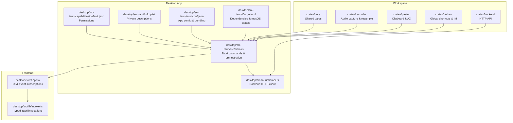
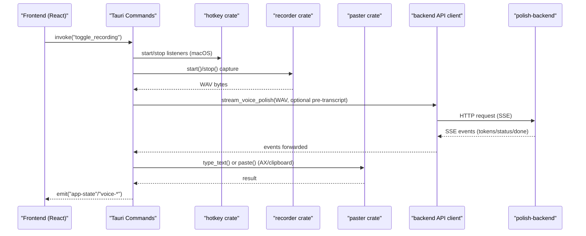
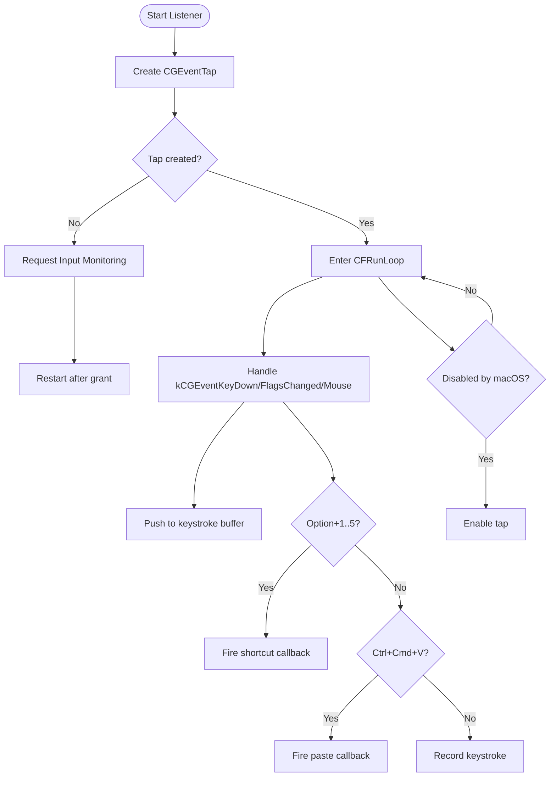
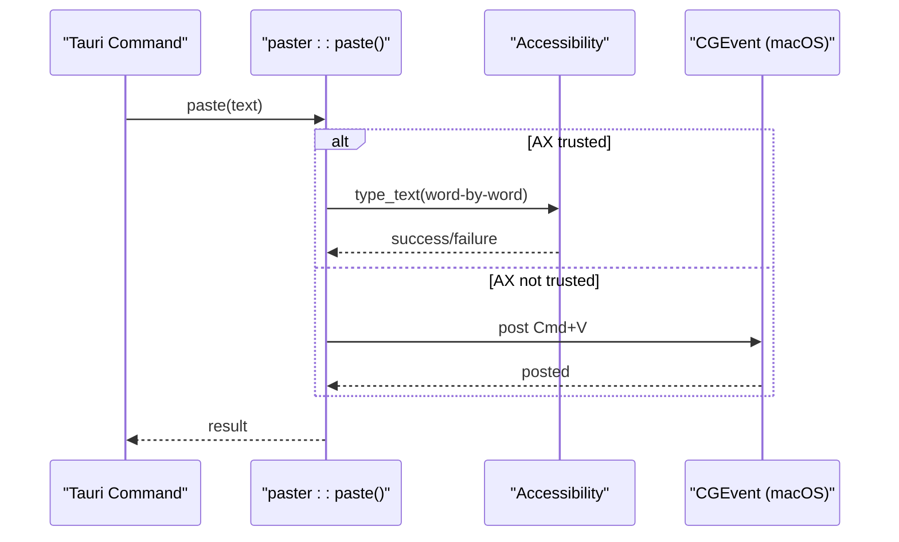
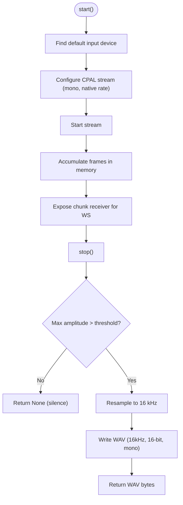
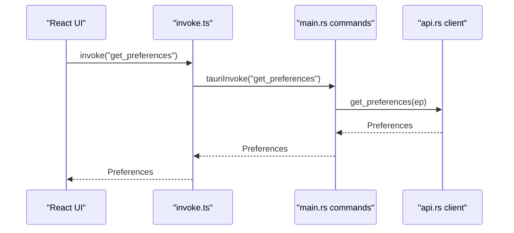
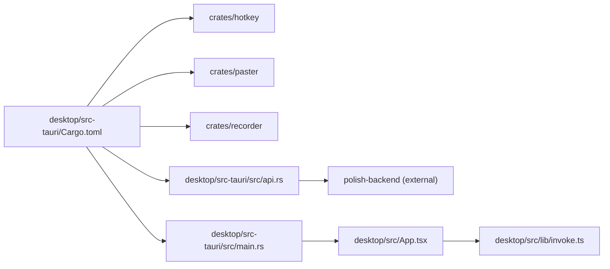

# Native Integration Architecture

<cite>
**Referenced Files in This Document**
- [Cargo.toml](file://Cargo.toml)
- [crates/hotkey/src/lib.rs](file://crates/hotkey/src/lib.rs)
- [crates/paster/src/lib.rs](file://crates/paster/src/lib.rs)
- [crates/recorder/src/lib.rs](file://crates/recorder/src/lib.rs)
- [desktop/src-tauri/src/main.rs](file://desktop/src-tauri/src/main.rs)
- [desktop/src-tauri/src/api.rs](file://desktop/src-tauri/src/api.rs)
- [desktop/src-tauri/Cargo.toml](file://desktop/src-tauri/Cargo.toml)
- [desktop/src-tauri/tauri.conf.json](file://desktop/src-tauri/tauri.conf.json)
- [desktop/src-tauri/Info.plist](file://desktop/src-tauri/Info.plist)
- [desktop/src-tauri/capabilities/default.json](file://desktop/src-tauri/capabilities/default.json)
- [desktop/src/App.tsx](file://desktop/src/App.tsx)
- [desktop/src/lib/invoke.ts](file://desktop/src/lib/invoke.ts)
</cite>

## Table of Contents
1. [Introduction](#introduction)
2. [Project Structure](#project-structure)
3. [Core Components](#core-components)
4. [Architecture Overview](#architecture-overview)
5. [Detailed Component Analysis](#detailed-component-analysis)
6. [Dependency Analysis](#dependency-analysis)
7. [Performance Considerations](#performance-considerations)
8. [Troubleshooting Guide](#troubleshooting-guide)
9. [Conclusion](#conclusion)

## Introduction
This document describes the native integration architecture for the WISPR Hindi Bridge macOS functionality. The application separates native capabilities into dedicated crates:
- hotkey: global shortcuts and input monitoring
- paster: clipboard and Accessibility-based text manipulation
- recorder: audio capture and processing

It bridges web and native code via Tauri commands, manages permissions (Accessibility, Input Monitoring, Microphone), integrates with the clipboard, and implements a robust audio capture pipeline with quality settings. The document also covers platform-specific behavior differences, security considerations, and sandboxing requirements.

## Project Structure
The workspace organizes functionality into modular crates and a Tauri desktop application:
- crates/hotkey: macOS CGEventTap-based hotkey listener and permission management
- crates/paster: cross-platform clipboard operations and macOS Accessibility integration
- crates/recorder: audio capture using CPAL with resampling and WAV generation
- desktop/src-tauri: Tauri application with command handlers, permission flows, and UI bridge
- Frontend (React) communicates with Tauri via typed invocations

**Diagram sources**
- [Cargo.toml:1-30](file://Cargo.toml#L1-L30)
- [desktop/src-tauri/src/main.rs:1-120](file://desktop/src-tauri/src/main.rs#L1-L120)
- [desktop/src-tauri/src/api.rs:1-60](file://desktop/src-tauri/src/api.rs#L1-L60)
- [desktop/src-tauri/Cargo.toml:1-53](file://desktop/src-tauri/Cargo.toml#L1-L53)
- [desktop/src-tauri/tauri.conf.json:1-51](file://desktop/src-tauri/tauri.conf.json#L1-L51)
- [desktop/src-tauri/Info.plist:1-18](file://desktop/src-tauri/Info.plist#L1-L18)
- [desktop/src-tauri/capabilities/default.json:1-11](file://desktop/src-tauri/capabilities/default.json#L1-L11)
- [desktop/src/App.tsx:1-120](file://desktop/src/App.tsx#L1-L120)
- [desktop/src/lib/invoke.ts:1-60](file://desktop/src/lib/invoke.ts#L1-L60)

**Section sources**
- [Cargo.toml:1-30](file://Cargo.toml#L1-L30)
- [desktop/src-tauri/Cargo.toml:1-53](file://desktop/src-tauri/Cargo.toml#L1-L53)

## Core Components
- Hotkey crate (macOS): Implements CGEventTap-based listeners for Caps Lock toggle and hold-to-record, captures keystrokes for edit detection in AX-blind apps, and manages Input Monitoring permission checks and prompts.
- Paster crate: Provides clipboard operations on non-macOS and macOS Accessibility-based synthesis for Cmd+V. Includes AX tree unlocking for Chrome/Electron, text reading strategies, and diagnostic utilities.
- Recorder crate: Captures audio via CPAL, buffers frames, resamples to 16 kHz, converts to WAV, and enforces minimum duration and silence thresholds.

These crates are consumed by the Tauri desktop application, which exposes typed commands to the frontend and orchestrates the end-to-end voice polish pipeline.

**Section sources**
- [crates/hotkey/src/lib.rs:1-120](file://crates/hotkey/src/lib.rs#L1-L120)
- [crates/paster/src/lib.rs:1-120](file://crates/paster/src/lib.rs#L1-L120)
- [crates/recorder/src/lib.rs:1-60](file://crates/recorder/src/lib.rs#L1-L60)

## Architecture Overview
The system uses Tauri commands to bridge web and native code. The frontend invokes typed commands (e.g., toggle_recording, get_snapshot, request_accessibility), which are implemented in the Tauri main module. These commands coordinate:
- Hotkey listener lifecycle and permission checks
- Audio recording via the recorder crate
- Backend HTTP requests via the API client
- Clipboard and Accessibility operations via the paster crate
- Event emission to the frontend for live updates

**Diagram sources**
- [desktop/src-tauri/src/main.rs:800-880](file://desktop/src-tauri/src/main.rs#L800-L880)
- [desktop/src-tauri/src/main.rs:880-1080](file://desktop/src-tauri/src/main.rs#L880-L1080)
- [desktop/src-tauri/src/main.rs:1080-1217](file://desktop/src-tauri/src/main.rs#L1080-L1217)
- [desktop/src-tauri/src/api.rs:120-180](file://desktop/src-tauri/src/api.rs#L120-L180)
- [crates/recorder/src/lib.rs:69-166](file://crates/recorder/src/lib.rs#L69-L166)
- [crates/paster/src/lib.rs:214-316](file://crates/paster/src/lib.rs#L214-L316)

## Detailed Component Analysis

### Hotkey Crate (macOS)
Responsibilities:
- Global shortcuts: Caps Lock toggle listener and hold-to-record listener
- Keystroke buffer: Records kCGEventKeyDown and mouse clicks for edit reconstruction
- Input Monitoring permission: Uses CGPreflightListenEventAccess() and CGRequestListenEventAccess() APIs
- Option+1..5 shortcuts: Tone preset selection callback registration
- Ctrl+Cmd+V passthrough: Suppresses system paste and triggers app-defined paste

Key behaviors:
- Listeners run on a dedicated thread with a CFRunLoop; tap is re-enabled if macOS disables it
- Permission state is debounced and tracked; if granted after launch, hold listener is restarted
- Keystroke classification supports character insertion, deletions, navigation, and selection operations

**Diagram sources**
- [crates/hotkey/src/lib.rs:543-588](file://crates/hotkey/src/lib.rs#L543-L588)
- [crates/hotkey/src/lib.rs:279-317](file://crates/hotkey/src/lib.rs#L279-L317)
- [crates/hotkey/src/lib.rs:384-445](file://crates/hotkey/src/lib.rs#L384-L445)
- [crates/hotkey/src/lib.rs:447-527](file://crates/hotkey/src/lib.rs#L447-L527)

**Section sources**
- [crates/hotkey/src/lib.rs:1-120](file://crates/hotkey/src/lib.rs#L1-L120)
- [crates/hotkey/src/lib.rs:255-317](file://crates/hotkey/src/lib.rs#L255-L317)
- [crates/hotkey/src/lib.rs:384-527](file://crates/hotkey/src/lib.rs#L384-L527)

### Paster Crate (Cross-platform)
Responsibilities:
- Clipboard operations on non-macOS platforms
- macOS Accessibility integration:
  - AXIsProcessTrusted() checks
  - Unlock Chrome/Electron AX trees (AXEnhancedUserInterface, AXManualAccessibility)
  - Read focused element value via AXValue, AXSelectedText, or tree traversal
  - Synthetic key posting for paste (Cmd+V) using CGEvent
  - Diagnostic reporting of AX methods and attributes

Integration patterns:
- Pre-unlock before recording to improve AX readiness
- Fallback to Cmd+A → Cmd+C capture when AX is unavailable
- Paste via AX typing when available, with clipboard fallback

**Diagram sources**
- [crates/paster/src/lib.rs:214-316](file://crates/paster/src/lib.rs#L214-L316)
- [crates/paster/src/lib.rs:386-429](file://crates/paster/src/lib.rs#L386-L429)
- [crates/paster/src/lib.rs:439-513](file://crates/paster/src/lib.rs#L439-L513)

**Section sources**
- [crates/paster/src/lib.rs:1-120](file://crates/paster/src/lib.rs#L1-L120)
- [crates/paster/src/lib.rs:214-316](file://crates/paster/src/lib.rs#L214-L316)
- [crates/paster/src/lib.rs:386-513](file://crates/paster/src/lib.rs#L386-L513)

### Recorder Crate (Audio Capture)
Responsibilities:
- Capture audio via CPAL default input device
- Buffer frames and expose a channel for WebSocket streaming (P5)
- Resample captured float samples to 16 kHz for Deepgram
- Convert to 16-bit WAV with 1 channel
- Enforce minimum duration and silence detection

Quality settings:
- Sample rate: 16 kHz
- Channels: mono
- Minimum duration: 0.5 seconds
- Silence threshold: rejects very low amplitude recordings

**Diagram sources**
- [crates/recorder/src/lib.rs:69-166](file://crates/recorder/src/lib.rs#L69-L166)
- [crates/recorder/src/lib.rs:167-218](file://crates/recorder/src/lib.rs#L167-L218)

**Section sources**
- [crates/recorder/src/lib.rs:1-60](file://crates/recorder/src/lib.rs#L1-L60)
- [crates/recorder/src/lib.rs:69-218](file://crates/recorder/src/lib.rs#L69-L218)

### Tauri Command System and Frontend Bridge
Commands implemented in the desktop application:
- bootstrap, get_snapshot, get_backend_endpoint
- get_preferences, patch_preferences
- get_history, submit_edit_feedback
- set_mode (mode switching removed)
- request_accessibility, request_input_monitoring, diagnose_ax
- toggle_recording (UI and hotkey path)
- paste_latest, retry_recording, delete_recording
- get_recording_audio_url
- Pending edits and vocabulary management commands
- Cloud auth and OpenAI OAuth commands

Frontend integration:
- Typed invocations via invoke.ts wrap Tauri commands and event listeners
- Real-time SSE events emitted to the UI (voice-token, voice-status, voice-done, voice-error)
- Periodic snapshot polling to reflect permission changes

**Diagram sources**
- [desktop/src-tauri/src/main.rs:656-720](file://desktop/src-tauri/src/main.rs#L656-L720)
- [desktop/src-tauri/src/api.rs:347-380](file://desktop/src-tauri/src/api.rs#L347-L380)
- [desktop/src/lib/invoke.ts:204-246](file://desktop/src/lib/invoke.ts#L204-L246)

**Section sources**
- [desktop/src-tauri/src/main.rs:656-720](file://desktop/src-tauri/src/main.rs#L656-L720)
- [desktop/src-tauri/src/api.rs:347-380](file://desktop/src-tauri/src/api.rs#L347-L380)
- [desktop/src/lib/invoke.ts:204-246](file://desktop/src/lib/invoke.ts#L204-L246)

## Dependency Analysis
The desktop application depends on the three native crates and integrates them through Tauri commands. The workspace configuration centralizes dependency versions and build profiles.

**Diagram sources**
- [desktop/src-tauri/Cargo.toml:36-46](file://desktop/src-tauri/Cargo.toml#L36-L46)
- [Cargo.toml:17-25](file://Cargo.toml#L17-L25)

**Section sources**
- [desktop/src-tauri/Cargo.toml:1-53](file://desktop/src-tauri/Cargo.toml#L1-L53)
- [Cargo.toml:1-30](file://Cargo.toml#L1-L30)

## Performance Considerations
- Audio capture: CPAL runs on its own thread; chunk channel buffering prevents backpressure in the WebSocket pipeline. Resampling is linear interpolation in pure Rust for minimal overhead.
- Keystroke buffer: Circular buffer capped at ~2000 entries to avoid memory growth during long dictation sessions.
- AX operations: Tree traversal is bounded (max 64 elements, max depth 4) to keep polling loops fast.
- Permission polling: Snapshot polling every 5 seconds to detect permission changes without excessive overhead.
- SSE streaming: WebSocket pre-transcript path avoids redundant HTTP STT calls by forwarding Deepgram WS output to the backend.

[No sources needed since this section provides general guidance]

## Troubleshooting Guide
Common issues and remedies:
- Input Monitoring permission denied: The hotkey crate detects denial via CGPreflightListenEventAccess() and requests permission via CGRequestListenEventAccess(). The frontend exposes a request_input_monitoring command to trigger this flow.
- Accessibility permission denied: The paster crate reports AXIsProcessTrusted() status and provides request_accessibility command. The frontend polls snapshots to reflect permission state.
- Microphone access denied: The recorder crate checks for silence and prints guidance to System Settings → Privacy & Security → Microphone.
- AX-blind apps: The paster crate includes multiple strategies (AXValue, AXSelectedText, tree traversal, clipboard capture) and diagnostic utilities to identify the best approach.
- Hotkey not firing: Verify Caps Lock listener is active and Input Monitoring is granted. The hotkey crate logs detailed keystroke and flag information.

**Section sources**
- [crates/hotkey/src/lib.rs:279-317](file://crates/hotkey/src/lib.rs#L279-L317)
- [crates/paster/src/lib.rs:214-316](file://crates/paster/src/lib.rs#L214-L316)
- [crates/recorder/src/lib.rs:188-192](file://crates/recorder/src/lib.rs#L188-L192)
- [desktop/src-tauri/src/main.rs:768-778](file://desktop/src-tauri/src/main.rs#L768-L778)

## Conclusion
The WISPR Hindi Bridge employs a clean separation of concerns across dedicated crates for hotkey, paster, and recorder functionality. Tauri commands provide a robust bridge between the web UI and native capabilities, enabling seamless audio capture, intelligent text manipulation, and permission management. The architecture balances performance, reliability, and user privacy through careful use of macOS APIs, bounded AX operations, and clear permission flows.