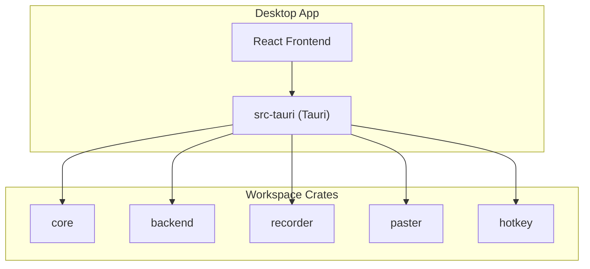
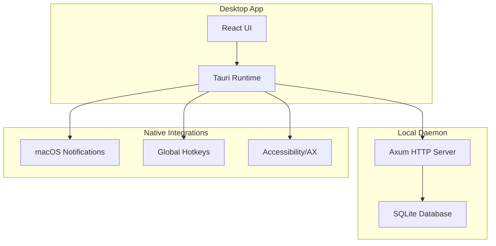
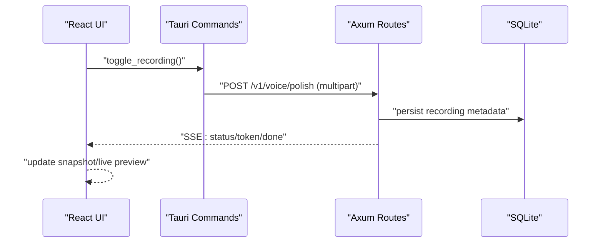
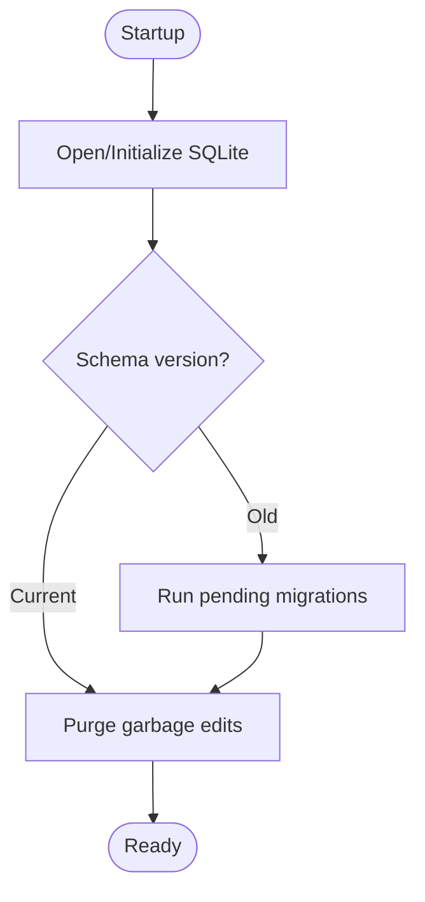
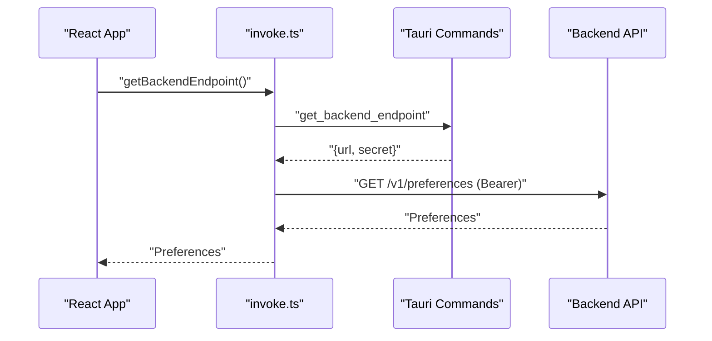
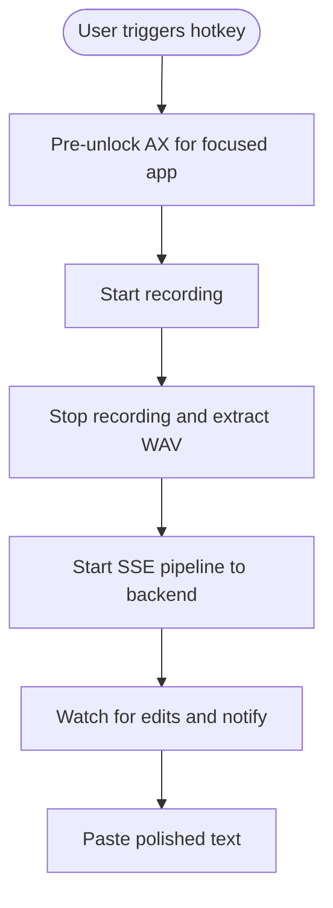
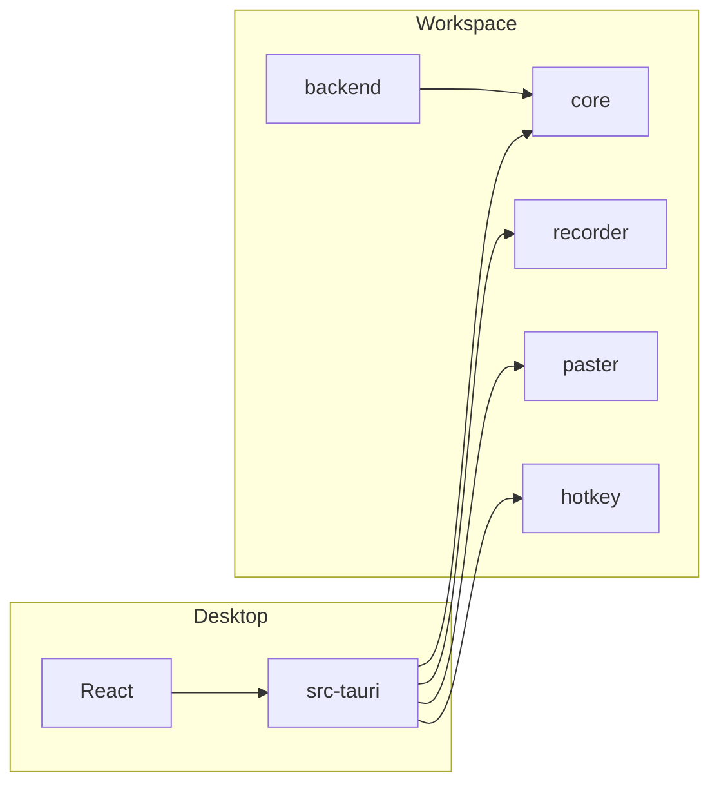

# System Design

<cite>
**Referenced Files in This Document**
- [Cargo.toml](file://Cargo.toml)
- [crates/backend/Cargo.toml](file://crates/backend/Cargo.toml)
- [crates/backend/src/lib.rs](file://crates/backend/src/lib.rs)
- [crates/backend/src/main.rs](file://crates/backend/src/main.rs)
- [crates/backend/src/routes/mod.rs](file://crates/backend/src/routes/mod.rs)
- [crates/backend/src/store/mod.rs](file://crates/backend/src/store/mod.rs)
- [crates/core/src/lib.rs](file://crates/core/src/lib.rs)
- [desktop/src-tauri/Cargo.toml](file://desktop/src-tauri/Cargo.toml)
- [desktop/src-tauri/tauri.conf.json](file://desktop/src-tauri/tauri.conf.json)
- [desktop/src-tauri/src/main.rs](file://desktop/src-tauri/src/main.rs)
- [desktop/src-tauri/src/api.rs](file://desktop/src-tauri/src/api.rs)
- [desktop/src/App.tsx](file://desktop/src/App.tsx)
- [desktop/src/main.tsx](file://desktop/src/main.tsx)
- [desktop/src/lib/invoke.ts](file://desktop/src/lib/invoke.ts)
</cite>

## Table of Contents
1. [Introduction](#introduction)
2. [Project Structure](#project-structure)
3. [Core Components](#core-components)
4. [Architecture Overview](#architecture-overview)
5. [Detailed Component Analysis](#detailed-component-analysis)
6. [Dependency Analysis](#dependency-analysis)
7. [Performance Considerations](#performance-considerations)
8. [Troubleshooting Guide](#troubleshooting-guide)
9. [Conclusion](#conclusion)

## Introduction
This document describes the system design of the WISPR Hindi Bridge application. It explains how the Rust backend service, React-based Tauri desktop application, and native macOS integrations collaborate to deliver a speech-to-polished-text pipeline. The system follows a microservices-style workspace with clear separation of concerns:
- Speech processing (STT and audio handling)
- Language modeling (LLM-driven polish)
- Data management (preferences, history, vocabulary, and corrections)

Technology choices emphasize performance and portability:
- Rust for the backend HTTP service and native integrations
- Tauri for cross-platform desktop packaging and secure IPC
- React for the user interface
- Axum for HTTP routing and SSE streaming
- SQLite for local persistence

## Project Structure
The repository is organized as a Cargo workspace with multiple crates and a Tauri desktop application:
- Workspace crates:
  - core: shared constants, types, and environment loading
  - backend: HTTP API, routes, stores, and orchestration
  - recorder: audio capture utilities
  - paster: text selection and paste helpers
  - hotkey: macOS global hotkey integration
- Desktop application:
  - Tauri app with React frontend, TypeScript/TSX, and Tailwind CSS
  - Tauri configuration and native capabilities

**Diagram sources**
- [Cargo.toml:1-15](file://Cargo.toml#L1-L15)
- [desktop/src-tauri/Cargo.toml:37-39](file://desktop/src-tauri/Cargo.toml#L37-L39)

**Section sources**
- [Cargo.toml:1-15](file://Cargo.toml#L1-L15)
- [desktop/src-tauri/Cargo.toml:1-53](file://desktop/src-tauri/Cargo.toml#L1-L53)

## Core Components
- Rust backend service (Axum HTTP server):
  - Provides REST endpoints for voice/text polish, history, preferences, vocabulary, and cloud/OpenAI OAuth bridging
  - Streams intermediate tokens via Server-Sent Events (SSE)
  - Uses SQLite for local persistence and a connection pool
- Tauri desktop application:
  - React UI with TypeScript/TSX
  - Tauri commands and event subscriptions for UI state and streaming
  - Native macOS integrations (notifications, hotkeys, accessibility)
- Shared core library:
  - Constants, mode registry, and environment loading utilities
- Native modules:
  - Audio recording and paste utilities
  - macOS hotkey and AX event handling

**Section sources**
- [crates/backend/src/lib.rs:148-199](file://crates/backend/src/lib.rs#L148-L199)
- [crates/backend/src/main.rs:18-145](file://crates/backend/src/main.rs#L18-L145)
- [crates/core/src/lib.rs:10-57](file://crates/core/src/lib.rs#L10-L57)
- [desktop/src-tauri/src/main.rs:602-800](file://desktop/src-tauri/src/main.rs#L602-L800)
- [desktop/src/App.tsx:1-671](file://desktop/src/App.tsx#L1-L671)

## Architecture Overview
The system architecture combines a local Rust backend with a Tauri-packaged React desktop app. The desktop app communicates with the backend via:
- Direct HTTP calls (for SSE streams and REST endpoints)
- Tauri commands (for bootstrapping state and invoking native features)

**Diagram sources**
- [desktop/src-tauri/src/main.rs:1-100](file://desktop/src-tauri/src/main.rs#L1-L100)
- [crates/backend/src/main.rs:18-145](file://crates/backend/src/main.rs#L18-L145)
- [crates/backend/src/lib.rs:148-199](file://crates/backend/src/lib.rs#L148-L199)

## Detailed Component Analysis

### Backend HTTP Service (Axum)
Responsibilities:
- Serve authenticated endpoints for voice/text polish, history, preferences, vocabulary, and feedback
- Stream polish tokens via SSE to the desktop app
- Manage application state (preferences cache, lexicon cache) and database operations
- Periodic tasks (cleanup, metering reports)

Key implementation highlights:
- Application state encapsulation with shared HTTP client and caches
- Router composition with CORS and bearer-secret authentication
- SSE streaming for live polish updates

**Diagram sources**
- [crates/backend/src/lib.rs:148-199](file://crates/backend/src/lib.rs#L148-L199)
- [crates/backend/src/main.rs:18-145](file://crates/backend/src/main.rs#L18-L145)
- [desktop/src-tauri/src/api.rs:128-178](file://desktop/src-tauri/src/api.rs#L128-L178)

**Section sources**
- [crates/backend/src/lib.rs:133-199](file://crates/backend/src/lib.rs#L133-L199)
- [crates/backend/src/main.rs:18-145](file://crates/backend/src/main.rs#L18-L145)

### Data Management (SQLite)
Responsibilities:
- Persistent storage for preferences, history, vocabulary, corrections, and user records
- Migration management and schema versioning
- Background cleanup and garbage collection

Key implementation highlights:
- Connection pooling with WAL mode and foreign keys enabled
- Migration scripts embedded as resources
- Utility functions to ensure default user and calculate timestamps

**Diagram sources**
- [crates/backend/src/store/mod.rs:32-165](file://crates/backend/src/store/mod.rs#L32-L165)

**Section sources**
- [crates/backend/src/store/mod.rs:1-284](file://crates/backend/src/store/mod.rs#L1-L284)

### Desktop Application (React + Tauri)
Responsibilities:
- Present UI, manage state, and subscribe to Tauri events
- Bootstrap backend endpoint and preferences
- Drive recording and polish flows, including retries and edit feedback
- Integrate native macOS features (notifications, hotkeys, accessibility)

Key implementation highlights:
- Event-driven UI updates via Tauri event listeners
- Direct HTTP calls to backend for SSE streams
- Preference caching and hot-path vocabulary retrieval

**Diagram sources**
- [desktop/src/lib/invoke.ts:214-246](file://desktop/src/lib/invoke.ts#L214-L246)
- [desktop/src-tauri/src/main.rs:619-625](file://desktop/src-tauri/src/main.rs#L619-L625)
- [desktop/src-tauri/src/api.rs:347-358](file://desktop/src-tauri/src/api.rs#L347-L358)

**Section sources**
- [desktop/src/App.tsx:129-147](file://desktop/src/App.tsx#L129-L147)
- [desktop/src/lib/invoke.ts:214-246](file://desktop/src/lib/invoke.ts#L214-L246)
- [desktop/src-tauri/src/main.rs:602-666](file://desktop/src-tauri/src/main.rs#L602-L666)

### Native macOS Integrations
Responsibilities:
- Global hotkeys and accessibility permissions
- macOS notifications and input monitoring
- Keystroke reconstruction for edit detection in AX-blind apps

Key implementation highlights:
- Platform-specific dependencies and conditional compilation
- Notification plugin usage and AppleScript fallback in development
- Keystroke replay and cursor movement helpers

**Diagram sources**
- [desktop/src-tauri/src/main.rs:750-800](file://desktop/src-tauri/src/main.rs#L750-L800)

**Section sources**
- [desktop/src-tauri/src/main.rs:1-100](file://desktop/src-tauri/src/main.rs#L1-L100)
- [desktop/src-tauri/src/main.rs:750-800](file://desktop/src-tauri/src/main.rs#L750-L800)

## Dependency Analysis
Workspace and external dependencies:
- Workspace crates depend on shared versions for serde, tokio, reqwest, tracing, uuid
- Backend depends on Axum, Tower HTTP, rusqlite, and r2d2/r2d2_sqlite
- Tauri desktop depends on Tauri core, reqwest (blocking), tokio-tungstenite, and platform-specific crates
- Frontend depends on React, Tauri APIs, Radix UI, and Tailwind

**Diagram sources**
- [Cargo.toml:16-24](file://Cargo.toml#L16-L24)
- [crates/backend/Cargo.toml:14-42](file://crates/backend/Cargo.toml#L14-L42)
- [desktop/src-tauri/Cargo.toml:9-39](file://desktop/src-tauri/Cargo.toml#L9-L39)

**Section sources**
- [Cargo.toml:1-30](file://Cargo.toml#L1-L30)
- [crates/backend/Cargo.toml:1-42](file://crates/backend/Cargo.toml#L1-L42)
- [desktop/src-tauri/Cargo.toml:1-53](file://desktop/src-tauri/Cargo.toml#L1-L53)

## Performance Considerations
- Backend
  - Connection pooling for SQLite to reduce contention
  - Hot caches for preferences and lexicon to minimize database reads
  - Shared HTTP client with connection reuse for upstream LLM calls
- Desktop
  - SSE streaming for low-latency polish previews
  - Hot-path cache for language and vocabulary terms to avoid network calls during recording
- Native
  - Blocking operations (e.g., diagnostics) executed on dedicated threads to keep UI responsive

[No sources needed since this section provides general guidance]

## Troubleshooting Guide
Common areas to inspect:
- Backend logs and environment variables (logging to a user-writable path)
- Database initialization and migrations
- SSE connectivity and bearer-secret authentication
- Tauri command availability and event subscriptions
- macOS permissions (accessibility, input monitoring, notifications)

**Section sources**
- [crates/backend/src/main.rs:20-39](file://crates/backend/src/main.rs#L20-L39)
- [crates/backend/src/store/mod.rs:32-60](file://crates/backend/src/store/mod.rs#L32-L60)
- [desktop/src/lib/invoke.ts:340-433](file://desktop/src/lib/invoke.ts#L340-L433)
- [desktop/src-tauri/src/main.rs:408-446](file://desktop/src-tauri/src/main.rs#L408-L446)

## Conclusion
The WISPR Hindi Bridge employs a clean, modular architecture:
- Rust backend encapsulates business logic and data persistence
- Tauri desktop app provides a responsive, native-feeling UI with secure IPC
- Native macOS integrations enhance usability and accessibility
- SSE streaming enables real-time polish previews
- Workspace organization and shared dependencies simplify maintenance and deployment