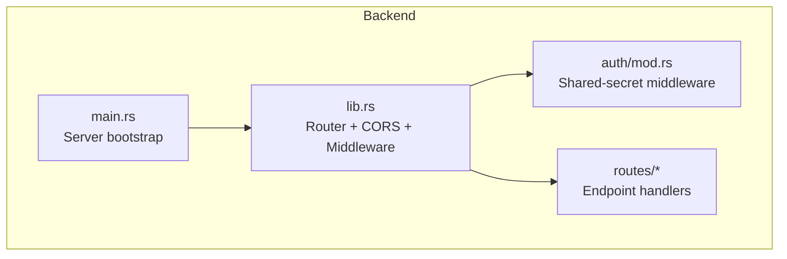
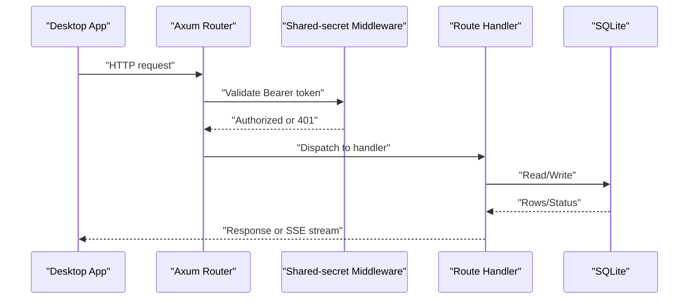
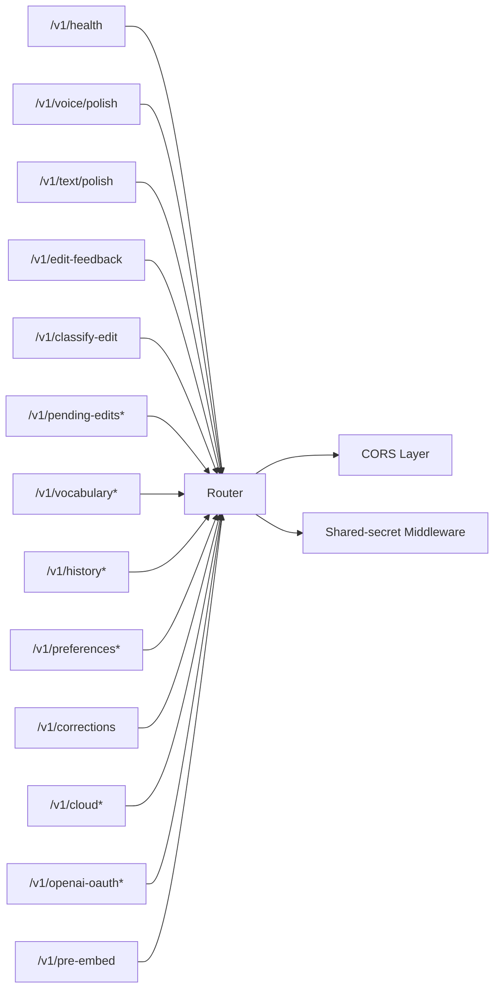

# API Reference

<cite>
**Referenced Files in This Document**
- [crates/backend/src/main.rs](file://crates/backend/src/main.rs)
- [crates/backend/src/lib.rs](file://crates/backend/src/lib.rs)
- [crates/backend/src/auth/mod.rs](file://crates/backend/src/auth/mod.rs)
- [crates/backend/src/routes/health.rs](file://crates/backend/src/routes/health.rs)
- [crates/backend/src/routes/voice.rs](file://crates/backend/src/routes/voice.rs)
- [crates/backend/src/routes/text.rs](file://crates/backend/src/routes/text.rs)
- [crates/backend/src/routes/history.rs](file://crates/backend/src/routes/history.rs)
- [crates/backend/src/routes/vocabulary.rs](file://crates/backend/src/routes/vocabulary.rs)
- [crates/backend/src/routes/prefs.rs](file://crates/backend/src/routes/prefs.rs)
- [crates/backend/src/routes/feedback.rs](file://crates/backend/src/routes/feedback.rs)
- [crates/backend/src/routes/cloud.rs](file://crates/backend/src/routes/cloud.rs)
- [crates/backend/src/routes/openai_oauth.rs](file://crates/backend/src/routes/openai_oauth.rs)
- [crates/backend/src/routes/pre_embed.rs](file://crates/backend/src/routes/pre_embed.rs)
- [crates/backend/src/routes/classify.rs](file://crates/backend/src/routes/classify.rs)
- [crates/backend/src/routes/pending_edits.rs](file://crates/backend/src/routes/pending_edits.rs)
</cite>

## Table of Contents
1. [Introduction](#introduction)
2. [Project Structure](#project-structure)
3. [Core Components](#core-components)
4. [Architecture Overview](#architecture-overview)
5. [Detailed Component Analysis](#detailed-component-analysis)
6. [Dependency Analysis](#dependency-analysis)
7. [Performance Considerations](#performance-considerations)
8. [Troubleshooting Guide](#troubleshooting-guide)
9. [Conclusion](#conclusion)
10. [Appendices](#appendices)

## Introduction
This document provides a comprehensive API reference for the WISPR Hindi Bridge backend service. It covers all REST endpoints, authentication, CORS, rate limiting, and operational behaviors. The backend exposes a localhost-only HTTP API protected by a shared-secret bearer token. Requests are served over SSE for streaming LLM outputs and standard HTTP for other operations.

## Project Structure
The backend is implemented as a Rust Axum application with modular route handlers and a shared application state. Authentication middleware enforces shared-secret bearer tokens for authenticated routes. CORS is configured broadly to allow the desktop app’s webview and development origins.

**Diagram sources**
- [crates/backend/src/main.rs:18-145](file://crates/backend/src/main.rs#L18-L145)
- [crates/backend/src/lib.rs:150-199](file://crates/backend/src/lib.rs#L150-L199)
- [crates/backend/src/auth/mod.rs:19-37](file://crates/backend/src/auth/mod.rs#L19-L37)

**Section sources**
- [crates/backend/src/main.rs:18-145](file://crates/backend/src/main.rs#L18-L145)
- [crates/backend/src/lib.rs:150-199](file://crates/backend/src/lib.rs#L150-L199)

## Core Components
- Application state encapsulates the database pool, shared secret, default user ID, caches for preferences and lexicon, and a shared HTTP client.
- Router composes public and authenticated routes and applies CORS middleware.
- Authentication middleware validates Authorization: Bearer <shared-secret>.
- CORS allows common methods and headers and accepts any origin.

Key behaviors:
- Health check is publicly accessible.
- All other routes require shared-secret bearer.
- CORS configuration supports the desktop webview and localhost development.

**Section sources**
- [crates/backend/src/lib.rs:135-146](file://crates/backend/src/lib.rs#L135-L146)
- [crates/backend/src/lib.rs:150-199](file://crates/backend/src/lib.rs#L150-L199)
- [crates/backend/src/auth/mod.rs:19-37](file://crates/backend/src/auth/mod.rs#L19-L37)

## Architecture Overview
The backend listens on localhost and serves authenticated endpoints. Voice and text processing streams results via Server-Sent Events. Persistent data is stored in an embedded SQLite database.

**Diagram sources**
- [crates/backend/src/lib.rs:150-199](file://crates/backend/src/lib.rs#L150-L199)
- [crates/backend/src/auth/mod.rs:19-37](file://crates/backend/src/auth/mod.rs#L19-L37)

## Detailed Component Analysis

### Health Check
- Method: GET
- URL: /v1/health
- Authentication: Not required
- Response: JSON with keys ok and version

Example response:
{
  "ok": true,
  "version": "<backend-version>"
}

**Section sources**
- [crates/backend/src/routes/health.rs:4-9](file://crates/backend/src/routes/health.rs#L4-L9)
- [crates/backend/src/lib.rs:152-153](file://crates/backend/src/lib.rs#L152-L153)

### Voice Processing
- Method: POST
- URL: /v1/voice/polish
- Authentication: Required
- Content-Type: multipart/form-data
- Fields:
  - audio (binary, WAV bytes) – required
  - target_app (string) – optional
  - pre_transcript (string) – optional; if provided, STT is skipped
- Response: SSE stream with events:
  - status: phase and transcript
  - token: incremental LLM tokens
  - done: recording metadata and latency breakdown
  - error: error messages with optional audio_id

Processing pipeline:
- Loads preferences and lexicon from cache
- Optionally skips STT if pre_transcript is provided
- Applies STT replacement rules
- Builds system prompt with RAG examples and vocabulary
- Streams tokens from the selected LLM provider (OpenAI Codex, Gemini Direct, Groq, or Gateway)
- Persists recording with timing metrics

Common errors:
- 400 Bad Request: empty audio
- 403 Forbidden: invalid shared-secret
- Provider-specific errors emitted as SSE error events

curl example:
curl -N -X POST "http://127.0.0.1:48484/v1/voice/polish" \
  -H "Authorization: Bearer <shared-secret>" \
  -F "audio=@/path/to/recording.wav" \
  -F "target_app=com.example.app"

Notes:
- The SSE stream yields structured JSON for each event type.

**Section sources**
- [crates/backend/src/lib.rs:156-187](file://crates/backend/src/lib.rs#L156-L187)
- [crates/backend/src/routes/voice.rs:85-419](file://crates/backend/src/routes/voice.rs#L85-L419)

### Text Processing
- Method: POST
- URL: /v1/text/polish
- Authentication: Required
- Content-Type: application/json
- Body:
  - text (string) – required
  - target_app (string) – optional
  - tone_override (string) – optional; forces English output for tray usage
- Response: SSE stream identical to voice processing

Processing pipeline:
- Embeds the text and retrieves RAG examples
- Builds system prompt (with optional tray-specific English lock)
- Streams tokens from the selected LLM provider
- Persists recording with timing metrics

curl example:
curl -N -X POST "http://127.0.0.1:48484/v1/text/polish" \
  -H "Authorization: Bearer <shared-secret>" \
  -H "Content-Type: application/json" \
  -d '{"text":"Hello world","target_app":"com.example.app"}'

**Section sources**
- [crates/backend/src/lib.rs:156-187](file://crates/backend/src/lib.rs#L156-L187)
- [crates/backend/src/routes/text.rs:47-265](file://crates/backend/src/routes/text.rs#L47-L265)

### History Management
- GET /v1/history
  - Query parameters:
    - limit (integer, default 50)
    - before (integer, optional timestamp)
  - Response: array of recordings
- DELETE /v1/recordings/:id
  - Response: 204 No Content or 404 Not Found
- GET /v1/recordings/:id/audio
  - Response: audio/wav stream or 404 Not Found

curl examples:
- List: curl "http://127.0.0.1:48484/v1/history?limit=50&before=1700000000000"
- Delete: curl -X DELETE "http://127.0.0.1:48484/v1/recordings/<id>"
- Audio: curl -OJ "http://127.0.0.1:48484/v1/recordings/<id>/audio"

**Section sources**
- [crates/backend/src/lib.rs:156-187](file://crates/backend/src/lib.rs#L156-L187)
- [crates/backend/src/routes/history.rs:23-79](file://crates/backend/src/routes/history.rs#L23-L79)

### Vocabulary Management
- GET /v1/vocabulary/terms
  - Response: JSON with terms array (top ~100 personal terms for STT bias)
- GET /v1/vocabulary
  - Response: JSON with terms array and total count
- POST /v1/vocabulary
  - Body: { term: string }
  - Response: 201 Created with term or 400/500 on failure
- DELETE /v1/vocabulary/:term
  - Response: 204 No Content or 400/404/500
- POST /v1/vocabulary/:term/star
  - Response: JSON with starred boolean

curl examples:
- Add: curl -X POST "http://127.0.0.1:48484/v1/vocabulary" -H "Authorization: Bearer <shared-secret>" -H "Content-Type: application/json" -d '{"term":"नमस्ते"}'
- Star: curl -X POST "http://127.0.0.1:48484/v1/vocabulary/नमस्ते/star"
- List: curl "http://127.0.0.1:48484/v1/vocabulary"

**Section sources**
- [crates/backend/src/lib.rs:156-187](file://crates/backend/src/lib.rs#L156-L187)
- [crates/backend/src/routes/vocabulary.rs:27-150](file://crates/backend/src/routes/vocabulary.rs#L27-L150)

### Preferences
- GET /v1/preferences
  - Response: Preferences object
- PATCH /v1/preferences
  - Body: PrefsUpdate (provider/model/API keys)
  - Response: Updated Preferences
- GET /v1/corrections
  - Response: { keyterms: string[] } derived from user’s correction history

curl examples:
- Get: curl "http://127.0.0.1:48484/v1/preferences"
- Patch: curl -X PATCH "http://127.0.0.1:48484/v1/preferences" -H "Authorization: Bearer <shared-secret>" -H "Content-Type: application/json" -d '{}'

Notes:
- Preferences are cached with TTL and invalidated on updates.

**Section sources**
- [crates/backend/src/lib.rs:156-187](file://crates/backend/src/lib.rs#L156-L187)
- [crates/backend/src/routes/prefs.rs:29-56](file://crates/backend/src/routes/prefs.rs#L29-L56)

### Feedback Collection
- POST /v1/edit-feedback
  - Body: { recording_id: string, user_kept: string, target_app?: string }
  - Response: 204 No Content, 404 Not Found, 403 Forbidden, 400 Bad Request, 500 Internal Server Error

Behavior:
- Validates ownership and that the kept text differs from polished
- Updates final_text and inserts edit_event
- Extracts and stores word-level corrections
- Asynchronously embeds transcript and upserts preference_vector

curl example:
curl -X POST "http://127.0.0.1:48484/v1/edit-feedback" \
  -H "Authorization: Bearer <shared-secret>" \
  -H "Content-Type: application/json" \
  -d '{"recording_id":"<uuid>","user_kept":"Corrected text"}'

**Section sources**
- [crates/backend/src/lib.rs:156-187](file://crates/backend/src/lib.rs#L156-L187)
- [crates/backend/src/routes/feedback.rs:27-109](file://crates/backend/src/routes/feedback.rs#L27-L109)

### Cloud Synchronization
- PUT /v1/cloud/token
  - Body: { token: string, license_tier: string }
  - Response: 204 No Content
- DELETE /v1/cloud/token
  - Response: 204 No Content
- GET /v1/cloud/status
  - Response: { connected: boolean, license_tier: string, email?: string }

curl examples:
- Store token: curl -X PUT "http://127.0.0.1:48484/v1/cloud/token" -H "Authorization: Bearer <shared-secret>" -H "Content-Type: application/json" -d '{"token":"<cloud-bearer>","license_tier":"pro"}'
- Status: curl "http://127.0.0.1:48484/v1/cloud/status"

**Section sources**
- [crates/backend/src/lib.rs:156-187](file://crates/backend/src/lib.rs#L156-L187)
- [crates/backend/src/routes/cloud.rs:28-60](file://crates/backend/src/routes/cloud.rs#L28-L60)

### OpenAI Codex OAuth
- POST /v1/openai-oauth/initiate
  - Response: { auth_url: string } and spawns a one-shot callback server on localhost:1455
- GET /v1/openai-oauth/status
  - Response: { connected: boolean, expires_at?: number, connected_at?: number, model_smart: string, model_mini: string }
- DELETE /v1/openai-oauth/disconnect
  - Response: 204 No Content

curl example:
- Initiate: curl -X POST "http://127.0.0.1:48484/v1/openai-oauth/initiate" -H "Authorization: Bearer <shared-secret>"

Notes:
- The callback server is short-lived and bound to 127.0.0.1:1455.

**Section sources**
- [crates/backend/src/lib.rs:156-187](file://crates/backend/src/lib.rs#L156-L187)
- [crates/backend/src/routes/openai_oauth.rs:118-201](file://crates/backend/src/routes/openai_oauth.rs#L118-L201)

### Pre-Embedding
- POST /v1/pre-embed
  - Body: { text: string }
  - Response: 202 Accepted (immediate), background embedding stored in cache

curl example:
curl -X POST "http://127.0.0.1:48484/v1/pre-embed" -H "Authorization: Bearer <shared-secret>" -H "Content-Type: application/json" -d '{"text":"Hello world"}'

**Section sources**
- [crates/backend/src/lib.rs:156-187](file://crates/backend/src/lib.rs#L156-L187)
- [crates/backend/src/routes/pre_embed.rs:21-56](file://crates/backend/src/routes/pre_embed.rs#L21-L56)

### Classification and Learning
- POST /v1/classify-edit
  - Body: { recording_id: string, ai_output: string, user_kept: string, capture_method?: string }
  - Response: JSON with classification outcome, candidates, learned flags, notifications, and promoted terms

Behavior:
- Runs pre-filter, computes diff hunks, classifies via LLM, and applies promotion gates
- May auto-promote vocabulary/stt_replacements or store as pending edits

curl example:
curl -X POST "http://127.0.0.1:48484/v1/classify-edit" -H "Authorization: Bearer <shared-secret>" -H "Content-Type: application/json" -d '{"recording_id":"<uuid>","ai_output":"AI polished","user_kept":"User kept"}'

**Section sources**
- [crates/backend/src/lib.rs:156-187](file://crates/backend/src/lib.rs#L156-L187)
- [crates/backend/src/routes/classify.rs:85-290](file://crates/backend/src/routes/classify.rs#L85-L290)

### Pending Edits
- POST /v1/pending-edits
  - Body: { recording_id?: string, ai_output: string, user_kept: string }
  - Response: { id: string } on creation
- GET /v1/pending-edits
  - Response: { edits: array, total: integer }
- POST /v1/pending-edits/:id/resolve
  - Body: { action: "approve" | "skip" }
  - Response: 204 No Content or 404 Not Found

curl example:
- List: curl "http://127.0.0.1:48484/v1/pending-edits"
- Resolve: curl -X POST "http://127.0.0.1:48484/v1/pending-edits/<id>/resolve" -H "Authorization: Bearer <shared-secret>" -H "Content-Type: application/json" -d '{"action":"approve"}'

**Section sources**
- [crates/backend/src/lib.rs:156-187](file://crates/backend/src/lib.rs#L156-L187)
- [crates/backend/src/routes/pending_edits.rs:32-141](file://crates/backend/src/routes/pending_edits.rs#L32-L141)

## Dependency Analysis
- Endpoint coverage matrix:
  - Public: /v1/health
  - Authenticated: /v1/voice/polish, /v1/text/polish, /v1/edit-feedback, /v1/classify-edit, /v1/pending-edits, /v1/vocabulary, /v1/history, /v1/preferences, /v1/corrections, /v1/cloud, /v1/openai-oauth, /v1/pre-embed
- Middleware and CORS:
  - Shared-secret bearer enforced for authenticated routes
  - CORS allows GET/POST/PATCH/DELETE/OPTIONS and common headers from any origin

**Diagram sources**
- [crates/backend/src/lib.rs:150-199](file://crates/backend/src/lib.rs#L150-L199)
- [crates/backend/src/auth/mod.rs:19-37](file://crates/backend/src/auth/mod.rs#L19-L37)

**Section sources**
- [crates/backend/src/lib.rs:150-199](file://crates/backend/src/lib.rs#L150-L199)

## Performance Considerations
- Streaming via SSE reduces latency and enables incremental rendering.
- Preferences and lexicon are cached to avoid frequent SQLite queries.
- A shared HTTP client keeps persistent connections across requests.
- Background tasks handle cleanup and periodic reporting.

[No sources needed since this section provides general guidance]

## Troubleshooting Guide
Common HTTP statuses:
- 200 OK: Successful operation (non-streaming)
- 202 Accepted: Pre-embedding accepted
- 204 No Content: Feedback processed, pending resolution succeeded
- 201 Created: Vocabulary created
- 400 Bad Request: Empty audio or invalid request body
- 401 Unauthorized: Missing or invalid shared-secret
- 403 Forbidden: Ownership verification failed
- 404 Not Found: Recording or vocabulary term not found
- 500 Internal Server Error: Server-side failures

Operational tips:
- Verify Authorization header format: Bearer <shared-secret>
- Ensure the backend is reachable at 127.0.0.1:48484
- Confirm CORS is not blocking the desktop webview origin

**Section sources**
- [crates/backend/src/auth/mod.rs:32-36](file://crates/backend/src/auth/mod.rs#L32-L36)
- [crates/backend/src/routes/voice.rs:103-106](file://crates/backend/src/routes/voice.rs#L103-L106)
- [crates/backend/src/routes/feedback.rs:34-40](file://crates/backend/src/routes/feedback.rs#L34-L40)
- [crates/backend/src/routes/history.rs:32-48](file://crates/backend/src/routes/history.rs#L32-L48)
- [crates/backend/src/routes/vocabulary.rs:56-82](file://crates/backend/src/routes/vocabulary.rs#L56-L82)

## Conclusion
The backend exposes a cohesive set of endpoints for voice and text polishing, history, vocabulary, preferences, feedback, cloud sync, and OAuth integration. Authentication and CORS are configured to secure and integrate with the desktop application. SSE-based streaming provides responsive user experiences.

[No sources needed since this section summarizes without analyzing specific files]

## Appendices

### Authentication
- Mechanism: Shared-secret bearer token
- Header: Authorization: Bearer <shared-secret>
- Origin: Localhost-only daemon

**Section sources**
- [crates/backend/src/auth/mod.rs:19-37](file://crates/backend/src/auth/mod.rs#L19-L37)
- [crates/backend/src/main.rs:59-60](file://crates/backend/src/main.rs#L59-L60)

### CORS Configuration
- Allowed methods: GET, POST, PATCH, DELETE, OPTIONS
- Allowed headers: Authorization, Content-Type, Accept
- Allowed origins: Any

**Section sources**
- [crates/backend/src/lib.rs:189-193](file://crates/backend/src/lib.rs#L189-L193)

### Rate Limiting
- No explicit rate limiting is implemented in the backend.

[No sources needed since this section provides general guidance]

### Example curl Commands
- Health: curl "http://127.0.0.1:48484/v1/health"
- Voice polish: curl -N -X POST "http://127.0.0.1:48484/v1/voice/polish" -H "Authorization: Bearer <shared-secret>" -F "audio=@/path/to/recording.wav"
- Text polish: curl -N -X POST "http://127.0.0.1:48484/v1/text/polish" -H "Authorization: Bearer <shared-secret>" -H "Content-Type: application/json" -d '{"text":"Hello world"}'
- History list: curl "http://127.0.0.1:48484/v1/history?limit=50"
- Vocabulary add: curl -X POST "http://127.0.0.1:48484/v1/vocabulary" -H "Authorization: Bearer <shared-secret>" -H "Content-Type: application/json" -d '{"term":"नमस्ते"}'
- Preferences get/patch: curl "http://127.0.0.1:48484/v1/preferences" && curl -X PATCH "http://127.0.0.1:48484/v1/preferences" -H "Authorization: Bearer <shared-secret>" -H "Content-Type: application/json" -d '{}'
- Cloud token: curl -X PUT "http://127.0.0.1:48484/v1/cloud/token" -H "Authorization: Bearer <shared-secret>" -H "Content-Type: application/json" -d '{"token":"<cloud-bearer>","license_tier":"pro"}'
- OAuth initiate: curl -X POST "http://127.0.0.1:48484/v1/openai-oauth/initiate" -H "Authorization: Bearer <shared-secret>"

**Section sources**
- [crates/backend/src/routes/health.rs:4-9](file://crates/backend/src/routes/health.rs#L4-L9)
- [crates/backend/src/routes/voice.rs:85-419](file://crates/backend/src/routes/voice.rs#L85-L419)
- [crates/backend/src/routes/text.rs:47-265](file://crates/backend/src/routes/text.rs#L47-L265)
- [crates/backend/src/routes/history.rs:23-79](file://crates/backend/src/routes/history.rs#L23-L79)
- [crates/backend/src/routes/vocabulary.rs:53-82](file://crates/backend/src/routes/vocabulary.rs#L53-L82)
- [crates/backend/src/routes/prefs.rs:29-56](file://crates/backend/src/routes/prefs.rs#L29-L56)
- [crates/backend/src/routes/cloud.rs:28-60](file://crates/backend/src/routes/cloud.rs#L28-L60)
- [crates/backend/src/routes/openai_oauth.rs:118-157](file://crates/backend/src/routes/openai_oauth.rs#L118-L157)

### SDK Integration Guidelines
- Use Authorization: Bearer <shared-secret> for authenticated routes.
- For SSE endpoints, consume Server-Sent Events with a robust client that handles reconnects and partial messages.
- For multipart uploads, ensure proper boundary handling and streaming of WAV data.
- Respect response semantics: 202 for pre-embed, 204 for feedback, 201 for vocabulary creation, 400/401/403/404/500 as documented.
- Configure CORS appropriately in the desktop app’s webview to allow requests from the backend origin.

[No sources needed since this section provides general guidance]