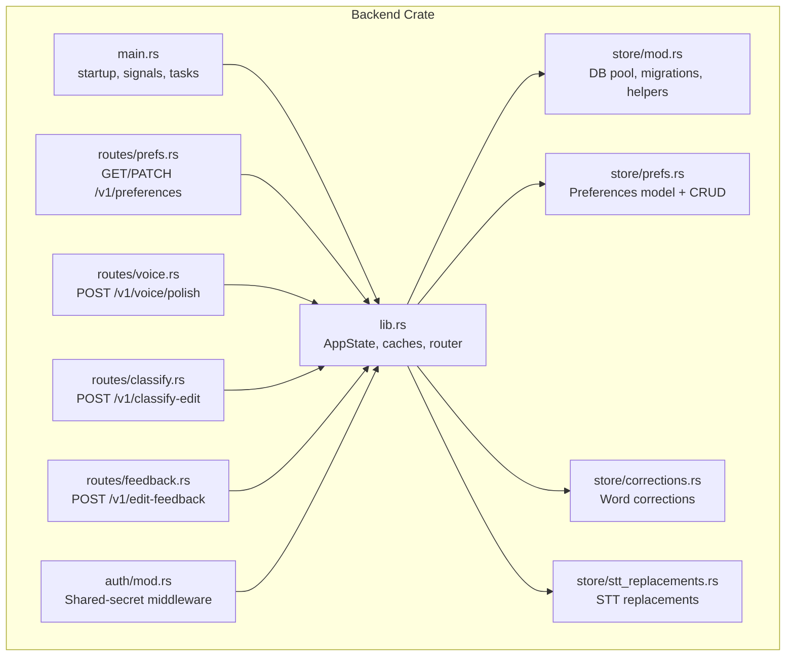
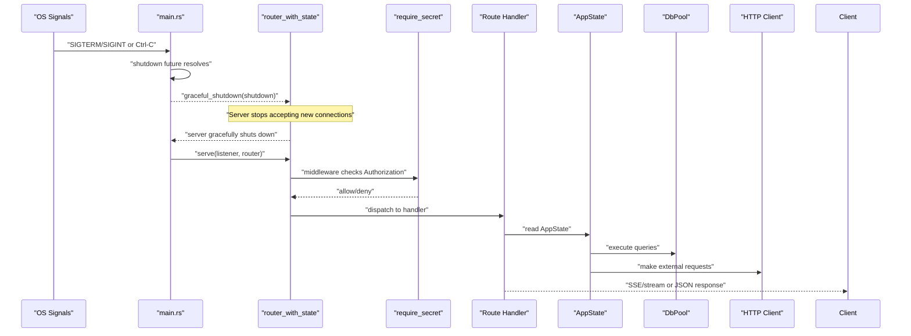
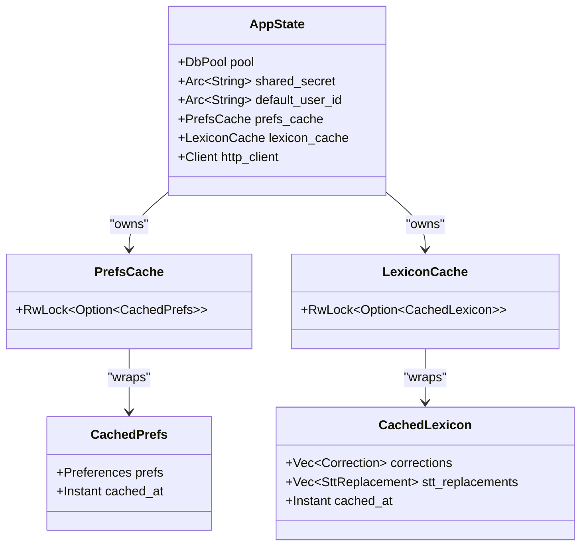
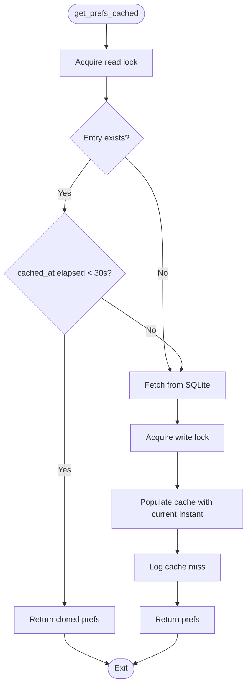
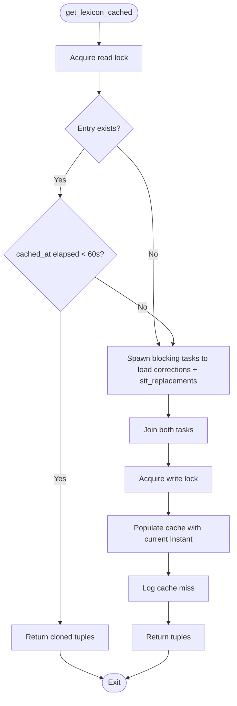
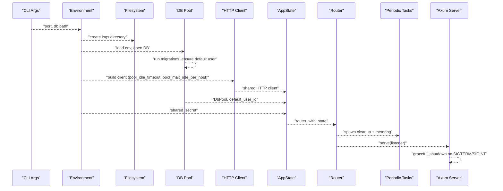
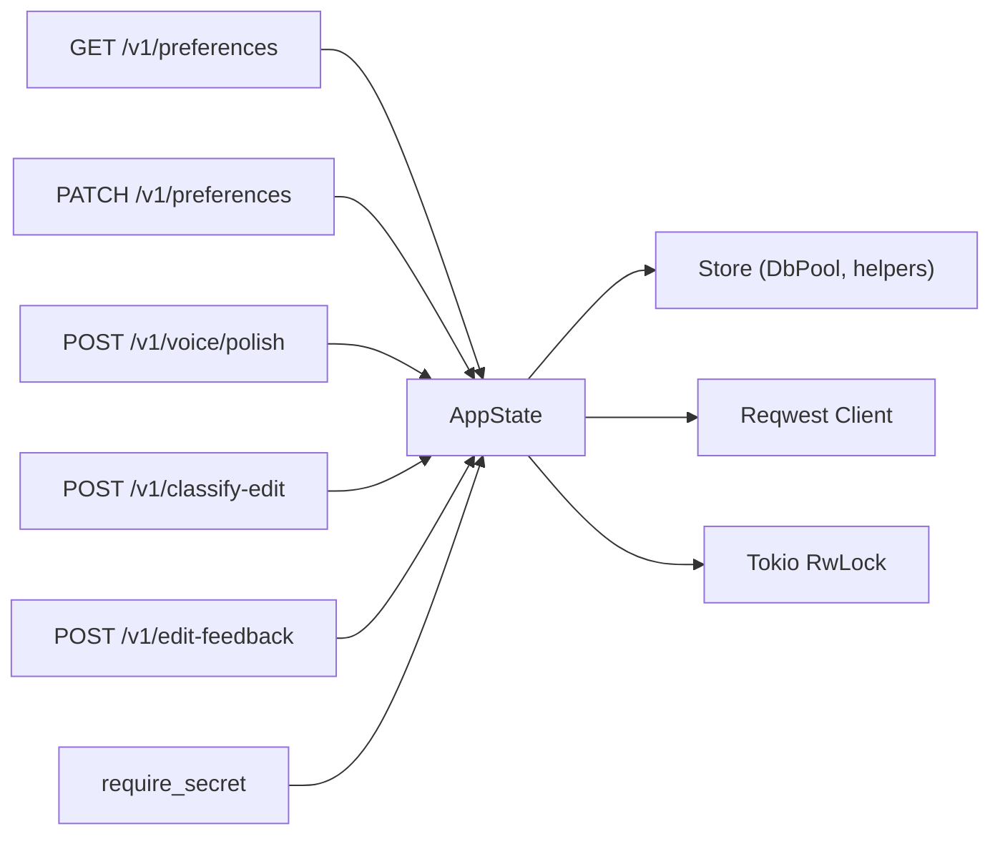

# Application State Management

<cite>
**Referenced Files in This Document**
- [lib.rs](file://crates/backend/src/lib.rs)
- [main.rs](file://crates/backend/src/main.rs)
- [mod.rs](file://crates/backend/src/store/mod.rs)
- [prefs.rs](file://crates/backend/src/store/prefs.rs)
- [corrections.rs](file://crates/backend/src/store/corrections.rs)
- [stt_replacements.rs](file://crates/backend/src/store/stt_replacements.rs)
- [prefs_routes.rs](file://crates/backend/src/routes/prefs.rs)
- [voice_routes.rs](file://crates/backend/src/routes/voice.rs)
- [classify_routes.rs](file://crates/backend/src/routes/classify.rs)
- [feedback_routes.rs](file://crates/backend/src/routes/feedback.rs)
- [auth_mod.rs](file://crates/backend/src/auth/mod.rs)
- [Cargo.toml](file://Cargo.toml)
</cite>

## Table of Contents
1. [Introduction](#introduction)
2. [Project Structure](#project-structure)
3. [Core Components](#core-components)
4. [Architecture Overview](#architecture-overview)
5. [Detailed Component Analysis](#detailed-component-analysis)
6. [Dependency Analysis](#dependency-analysis)
7. [Performance Considerations](#performance-considerations)
8. [Troubleshooting Guide](#troubleshooting-guide)
9. [Conclusion](#conclusion)

## Introduction
This document explains the application state management system in WISPR Hindi Bridge’s backend. It covers the AppState structure, database connection pooling, shared secrets, default user handling, hot-cache implementations for preferences and lexicon, HTTP client configuration, startup sequence, graceful shutdown, and memory management. It also documents cache usage patterns and state access across routes.

## Project Structure
The backend crate organizes state and runtime concerns under a single library module that exposes:
- The AppState structure containing shared resources
- Hot-cache helpers for preferences and lexicon
- HTTP client configuration
- Router construction with middleware and CORS
- Startup routine that initializes state and schedules periodic tasks

**Diagram sources**
- [lib.rs:135-146](file://crates/backend/src/lib.rs#L135-L146)
- [main.rs:68-75](file://crates/backend/src/main.rs#L68-L75)
- [mod.rs:17-60](file://crates/backend/src/store/mod.rs#L17-L60)
- [prefs.rs:6-25](file://crates/backend/src/store/prefs.rs#L6-L25)
- [corrections.rs:13-18](file://crates/backend/src/store/corrections.rs#L13-L18)
- [stt_replacements.rs:22-30](file://crates/backend/src/store/stt_replacements.rs#L22-L30)
- [prefs_routes.rs:29-56](file://crates/backend/src/routes/prefs.rs#L29-L56)
- [voice_routes.rs:85-419](file://crates/backend/src/routes/voice.rs#L85-L419)
- [classify_routes.rs:85-291](file://crates/backend/src/routes/classify.rs#L85-L291)
- [feedback_routes.rs:27-109](file://crates/backend/src/routes/feedback.rs#L27-L109)
- [auth_mod.rs:19-37](file://crates/backend/src/auth/mod.rs#L19-L37)

**Section sources**
- [lib.rs:135-146](file://crates/backend/src/lib.rs#L135-L146)
- [main.rs:68-75](file://crates/backend/src/main.rs#L68-L75)

## Core Components
- AppState: Holds the database pool, shared secret, default user ID, preferences cache, lexicon cache, and a shared HTTP client.
- Preferences cache: Short-lived in-memory cache with 30-second TTL and immediate invalidation on updates.
- Lexicon cache: Combined cache for corrections and STT replacements with 60-second TTL and invalidation on writes.
- Database pool: SQLite via r2d2 with WAL mode, foreign keys, and a 5-connection pool.
- HTTP client: Reusable reqwest client with connection pooling and idle timeouts configured at startup.
- Middleware and CORS: Shared-secret bearer auth and CORS layer applied to authenticated routes.

**Section sources**
- [lib.rs:23-146](file://crates/backend/src/lib.rs#L23-L146)
- [mod.rs:17-60](file://crates/backend/src/store/mod.rs#L17-L60)
- [main.rs:62-66](file://crates/backend/src/main.rs#L62-L66)

## Architecture Overview
The backend constructs AppState at startup, builds a router with CORS and shared-secret middleware, and serves routes that read/write state. Background tasks handle cleanup and metering reports. Graceful shutdown listens for OS signals.

**Diagram sources**
- [main.rs:120-142](file://crates/backend/src/main.rs#L120-L142)
- [lib.rs:150-199](file://crates/backend/src/lib.rs#L150-L199)
- [auth_mod.rs:19-37](file://crates/backend/src/auth/mod.rs#L19-L37)

## Detailed Component Analysis

### AppState and Shared Resources
AppState aggregates:
- Database pool: r2d2 SQLite pool with WAL and foreign keys enabled.
- Shared secret: Arc<String> used by middleware for bearer auth.
- Default user ID: Arc<String> representing the single local user.
- Preferences cache: RwLock<Option<CachedPrefs>> with 30-second TTL.
- Lexicon cache: RwLock<Option<CachedLexicon>> combining corrections and STT replacements with 60-second TTL.
- HTTP client: reqwest client with pooled connections and idle timeouts.

**Diagram sources**
- [lib.rs:135-146](file://crates/backend/src/lib.rs#L135-L146)
- [lib.rs:31-37](file://crates/backend/src/lib.rs#L31-L37)
- [lib.rs:79-86](file://crates/backend/src/lib.rs#L79-L86)

**Section sources**
- [lib.rs:135-146](file://crates/backend/src/lib.rs#L135-L146)
- [mod.rs:17-60](file://crates/backend/src/store/mod.rs#L17-L60)
- [main.rs:62-66](file://crates/backend/src/main.rs#L62-L66)

### Preferences Cache (30-second TTL)
- Fast path: read lock on cached entry; if fresh, return clone.
- Slow path: fetch from SQLite, populate cache, log miss.
- Invalidates immediately on successful preferences update.

**Diagram sources**
- [lib.rs:41-69](file://crates/backend/src/lib.rs#L41-L69)

**Section sources**
- [lib.rs:23-69](file://crates/backend/src/lib.rs#L23-L69)
- [prefs_routes.rs:29-56](file://crates/backend/src/routes/prefs.rs#L29-L56)
- [prefs.rs:47-76](file://crates/backend/src/store/prefs.rs#L47-L76)

### Lexicon Cache (60-second TTL)
- Fast path: read lock on cached entry; if fresh, return clones of both lists.
- Slow path: run both SQLite reads in parallel on blocking threads, populate cache, log miss.
- Invalidates immediately on writes to corrections or stt_replacements.

**Diagram sources**
- [lib.rs:90-131](file://crates/backend/src/lib.rs#L90-L131)

**Section sources**
- [lib.rs:71-131](file://crates/backend/src/lib.rs#L71-L131)
- [corrections.rs:68-93](file://crates/backend/src/store/corrections.rs#L68-L93)
- [stt_replacements.rs:102-131](file://crates/backend/src/store/stt_replacements.rs#L102-L131)
- [classify_routes.rs:245-248](file://crates/backend/src/routes/classify.rs#L245-L248)
- [feedback_routes.rs:73-75](file://crates/backend/src/routes/feedback.rs#L73-L75)

### HTTP Client Configuration
- Connection pooling: max idle per host = 4
- Idle timeout: 90 seconds
- Built once at startup and shared across all requests

**Section sources**
- [lib.rs:210-214](file://crates/backend/src/lib.rs#L210-L214)
- [main.rs:62-66](file://crates/backend/src/main.rs#L62-L66)

### Database Pool and Migration
- Opens/creates SQLite at configured path
- Enables WAL, foreign keys, and 5-second busy timeout
- Builds r2d2 pool with 5 max connections and 10s connection timeout
- Runs migrations up to version 12
- Ensures default user and initial preferences exist

**Section sources**
- [mod.rs:34-60](file://crates/backend/src/store/mod.rs#L34-L60)
- [mod.rs:62-165](file://crates/backend/src/store/mod.rs#L62-L165)
- [mod.rs:177-215](file://crates/backend/src/store/mod.rs#L177-L215)

### Startup Sequence and Initialization
- Loads environment variables and CLI args
- Resolves database path (CLI override or default)
- Initializes logging to a platform-appropriate log file
- Opens DB pool, ensures default user, loads shared secret
- Builds shared HTTP client
- Constructs AppState and router
- Spawns periodic tasks:
  - Cleanup old recordings and audio files every 6 hours
  - Hourly metering report to cloud
- Binds TCP listener and starts server with graceful shutdown

**Diagram sources**
- [main.rs:18-142](file://crates/backend/src/main.rs#L18-L142)

**Section sources**
- [main.rs:18-142](file://crates/backend/src/main.rs#L18-L142)

### Graceful Shutdown and Memory Management
- Listens for SIGTERM/SIGINT on Unix or Ctrl-C elsewhere
- Uses tokio::select to await either signal
- Axum server is started with graceful_shutdown, ensuring in-flight requests complete and new connections are rejected
- Memory management relies on:
  - Arc for shared secrets and user IDs
  - RwLock for caches to enable concurrent reads
  - Blocking tasks for SQLite queries to keep async executor responsive
  - Periodic cleanup tasks to remove old files and recordings

**Section sources**
- [main.rs:120-142](file://crates/backend/src/main.rs#L120-L142)
- [lib.rs:31-37](file://crates/backend/src/lib.rs#L31-L37)
- [lib.rs:79-86](file://crates/backend/src/lib.rs#L79-L86)

### Cache Usage Patterns Across Routes
- Preferences:
  - GET /v1/preferences: read through get_prefs_cached
  - PATCH /v1/preferences: update via store, then invalidate_prefs_cache
- Voice polish:
  - Reads prefs and lexicon before streaming begins to avoid stalls
  - Uses shared HTTP client for external APIs
- Classify edit:
  - Invalidates lexicon cache after writing corrections or STT replacements
- Edit feedback:
  - Invalidates lexicon cache after storing word corrections
  - Embeds transcript and upserts vectors asynchronously

**Section sources**
- [prefs_routes.rs:29-56](file://crates/backend/src/routes/prefs.rs#L29-L56)
- [voice_routes.rs:115-121](file://crates/backend/src/routes/voice.rs#L115-L121)
- [classify_routes.rs:245-248](file://crates/backend/src/routes/classify.rs#L245-L248)
- [feedback_routes.rs:73-75](file://crates/backend/src/routes/feedback.rs#L73-L75)

## Dependency Analysis
- AppState depends on:
  - Store module for DB pool and helpers
  - Reqwest for HTTP client
  - Tokio RwLock for cache synchronization
- Routes depend on AppState for:
  - Database access
  - Cache helpers
  - HTTP client
- Middleware depends on AppState for shared secret enforcement

**Diagram sources**
- [lib.rs:135-146](file://crates/backend/src/lib.rs#L135-L146)
- [prefs_routes.rs:29-56](file://crates/backend/src/routes/prefs.rs#L29-L56)
- [voice_routes.rs:85-419](file://crates/backend/src/routes/voice.rs#L85-L419)
- [classify_routes.rs:85-291](file://crates/backend/src/routes/classify.rs#L85-L291)
- [feedback_routes.rs:27-109](file://crates/backend/src/routes/feedback.rs#L27-L109)
- [auth_mod.rs:19-37](file://crates/backend/src/auth/mod.rs#L19-L37)

**Section sources**
- [lib.rs:135-146](file://crates/backend/src/lib.rs#L135-L146)
- [Cargo.toml:17-25](file://Cargo.toml#L17-L25)

## Performance Considerations
- Caching:
  - Preferences: 30s TTL reduces SQLite reads for frequent requests
  - Lexicon: 60s TTL with combined reads reduces latency for corrections and STT replacements
  - Parallel blocking reads for lexicon avoid stalling the async executor
- Connection pooling:
  - HTTP client reuse reduces TCP/TLS handshake overhead
  - DB pool limits concurrency to prevent resource contention
- Streaming:
  - SSE streams and parallel tasks minimize perceived latency
- Logging and diagnostics:
  - Structured logs with timestamps and directives aid performance triage

[No sources needed since this section provides general guidance]

## Troubleshooting Guide
- Unauthorized requests:
  - Ensure Authorization header contains the shared secret set via environment variable
- Cache misses:
  - Expect debug logs indicating cache misses when TTL expires or after invalidation
- Database connectivity:
  - Verify DB path and permissions; check WAL and busy_timeout settings
- HTTP failures:
  - Confirm API keys and network reachability; inspect idle timeout and pool settings
- Graceful shutdown:
  - On Unix systems, SIGTERM/SIGINT triggers shutdown; on Windows, Ctrl-C is supported

**Section sources**
- [auth_mod.rs:19-37](file://crates/backend/src/auth/mod.rs#L19-L37)
- [lib.rs:41-69](file://crates/backend/src/lib.rs#L41-L69)
- [lib.rs:90-131](file://crates/backend/src/lib.rs#L90-L131)
- [mod.rs:34-60](file://crates/backend/src/store/mod.rs#L34-L60)
- [main.rs:120-142](file://crates/backend/src/main.rs#L120-L142)

## Conclusion
The backend’s state management centers on a single AppState that unifies database access, caching, and HTTP clients. Hot-caches for preferences and lexicon dramatically reduce database load with short TTLs and explicit invalidation on writes. The startup sequence initializes state, spawns periodic maintenance tasks, and configures graceful shutdown. Middleware and CORS protect endpoints while enabling cross-origin access from the desktop. This design balances performance, reliability, and maintainability for the WISPR Hindi Bridge service.