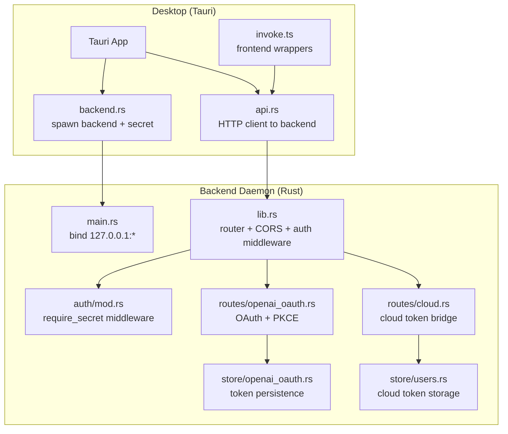
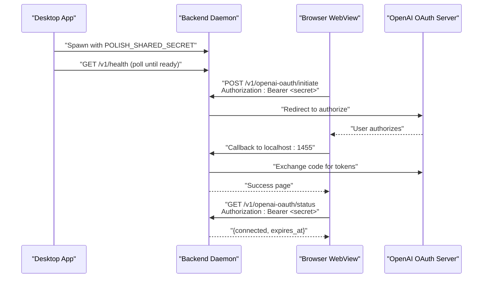
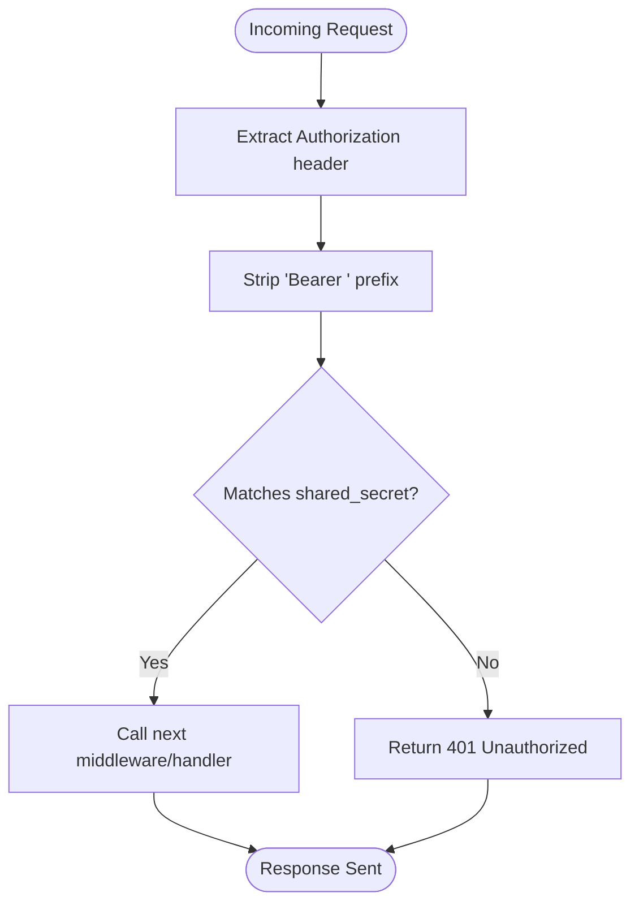
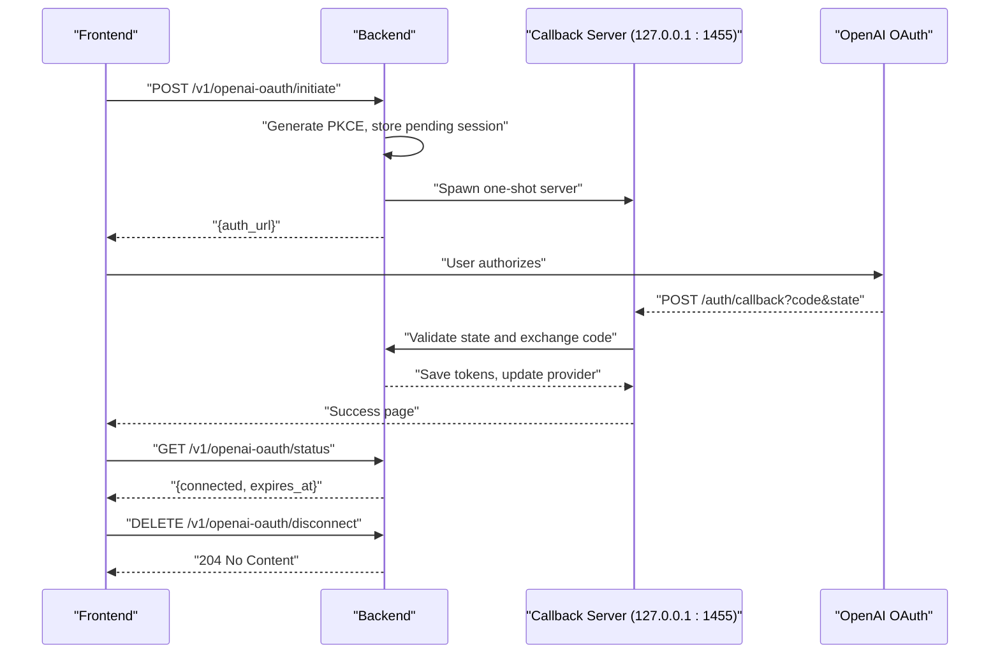
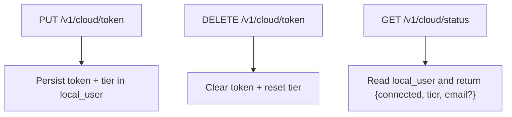
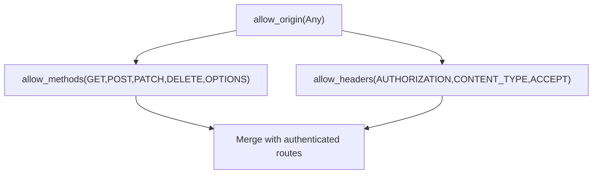
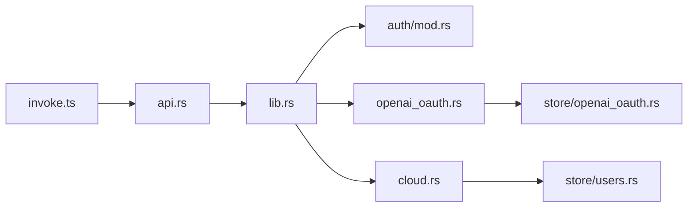

# Authentication and Security

<cite>
**Referenced Files in This Document**
- [auth/mod.rs](file://crates/backend/src/auth/mod.rs)
- [lib.rs](file://crates/backend/src/lib.rs)
- [main.rs](file://crates/backend/src/main.rs)
- [openai_oauth.rs](file://crates/backend/src/routes/openai_oauth.rs)
- [openai_oauth.rs](file://crates/backend/src/store/openai_oauth.rs)
- [cloud.rs](file://crates/backend/src/routes/cloud.rs)
- [users.rs](file://crates/backend/src/store/users.rs)
- [006_openai_oauth.sql](file://crates/backend/src/store/migrations/006_openai_oauth.sql)
- [tauri.conf.json](file://desktop/src-tauri/tauri.conf.json)
- [backend.rs](file://desktop/src-tauri/src/backend.rs)
- [api.rs](file://desktop/src-tauri/src/api.rs)
- [invoke.ts](file://desktop/src/lib/invoke.ts)
</cite>

## Table of Contents
1. [Introduction](#introduction)
2. [Project Structure](#project-structure)
3. [Core Components](#core-components)
4. [Architecture Overview](#architecture-overview)
5. [Detailed Component Analysis](#detailed-component-analysis)
6. [Dependency Analysis](#dependency-analysis)
7. [Performance Considerations](#performance-considerations)
8. [Troubleshooting Guide](#troubleshooting-guide)
9. [Conclusion](#conclusion)
10. [Appendices](#appendices)

## Introduction
This document details the authentication and security model for WISPR Hindi Bridge. It explains the shared-secret bearer token mechanism used to protect the local backend daemon, the OpenAI OAuth 2.0 + PKCE flow for optional cloud synchronization, CORS configuration for Tauri webview and development, and operational controls around permissions, access, and auditing. It also outlines best practices, mitigation strategies, and compliance considerations for local-first processing with optional cloud sync.

## Project Structure
Security-relevant components span the Rust backend, Tauri desktop integration, and frontend invocation layer:
- Backend daemon: shared-secret bearer middleware, route protection, OAuth flow, and cloud token bridging
- Tauri backend integration: spawning the backend, passing the shared secret, and exposing endpoints
- Frontend: invoking backend APIs with Authorization headers and managing OAuth flows

**Diagram sources**
- [backend.rs:51-77](file://desktop/src-tauri/src/backend.rs#L51-L77)
- [api.rs:502-551](file://desktop/src-tauri/src/api.rs#L502-L551)
- [main.rs:80-86](file://crates/backend/src/main.rs#L80-L86)
- [lib.rs:189-199](file://crates/backend/src/lib.rs#L189-L199)
- [auth/mod.rs:19-37](file://crates/backend/src/auth/mod.rs#L19-L37)
- [openai_oauth.rs:116-158](file://crates/backend/src/routes/openai_oauth.rs#L116-L158)
- [openai_oauth.rs:36-59](file://crates/backend/src/store/openai_oauth.rs#L36-L59)
- [cloud.rs:28-39](file://crates/backend/src/routes/cloud.rs#L28-L39)
- [users.rs:15-22](file://crates/backend/src/store/users.rs#L15-L22)
- [invoke.ts:216-224](file://desktop/src/lib/invoke.ts#L216-L224)

**Section sources**
- [backend.rs:51-77](file://desktop/src-tauri/src/backend.rs#L51-L77)
- [api.rs:502-551](file://desktop/src-tauri/src/api.rs#L502-L551)
- [main.rs:80-86](file://crates/backend/src/main.rs#L80-L86)
- [lib.rs:189-199](file://crates/backend/src/lib.rs#L189-L199)

## Core Components
- Shared-secret bearer token middleware: protects all authenticated routes by validating a Bearer token derived from a per-session UUID passed to the backend via an environment variable.
- OpenAI OAuth 2.0 + PKCE: initiates an OAuth flow, validates state, exchanges the authorization code for tokens, stores them locally, and exposes status and disconnect endpoints.
- Cloud token bridging: persists a cloud bearer token and license tier locally for optional metering and cloud features.
- CORS configuration: allows the Tauri webview origin and localhost development server to call authenticated endpoints.
- Tauri backend lifecycle: spawns the backend with a generated secret, binds to a local address, and exposes the endpoint to the frontend.

**Section sources**
- [auth/mod.rs:1-38](file://crates/backend/src/auth/mod.rs#L1-L38)
- [openai_oauth.rs:116-158](file://crates/backend/src/routes/openai_oauth.rs#L116-L158)
- [openai_oauth.rs:36-59](file://crates/backend/src/store/openai_oauth.rs#L36-L59)
- [cloud.rs:28-39](file://crates/backend/src/routes/cloud.rs#L28-L39)
- [lib.rs:189-199](file://crates/backend/src/lib.rs#L189-L199)
- [backend.rs:51-77](file://desktop/src-tauri/src/backend.rs#L51-L77)

## Architecture Overview
The desktop app spawns the backend daemon, generates a shared secret, and forwards it to the backend via an environment variable. All authenticated backend routes require the Authorization header with the shared secret. Optional cloud synchronization uses two flows:
- OpenAI OAuth: PKCE-based authorization with a one-shot callback server bound to localhost.
- Cloud token bridge: stores a cloud bearer token locally for metering and optional cloud features.

**Diagram sources**
- [backend.rs:51-77](file://desktop/src-tauri/src/backend.rs#L51-L77)
- [openai_oauth.rs:116-158](file://crates/backend/src/routes/openai_oauth.rs#L116-L158)
- [openai_oauth.rs:205-308](file://crates/backend/src/routes/openai_oauth.rs#L205-L308)
- [openai_oauth.rs:172-193](file://crates/backend/src/routes/openai_oauth.rs#L172-L193)

## Detailed Component Analysis

### Shared-Secret Bearer Token Authentication
- Secret generation: Tauri generates a UUID at startup and passes it to the backend via the POLISH_SHARED_SECRET environment variable.
- Middleware: require_secret extracts the Authorization header, strips the Bearer prefix, and compares it to the in-memory shared secret. Requests with a matching token are forwarded; otherwise, the server responds with Unauthorized.
- Route protection: All authenticated routes are layered with the middleware, ensuring only the desktop app can call protected endpoints.

**Diagram sources**
- [auth/mod.rs:19-37](file://crates/backend/src/auth/mod.rs#L19-L37)

**Section sources**
- [auth/mod.rs:1-38](file://crates/backend/src/auth/mod.rs#L1-L38)
- [backend.rs:51-77](file://desktop/src-tauri/src/backend.rs#L51-L77)
- [lib.rs:184-187](file://crates/backend/src/lib.rs#L184-L187)

### OpenAI OAuth 2.0 + PKCE Flow
- Initiation: Generates PKCE verifier/challenge, stores a pending session in memory, builds the authorization URL, and spawns a one-shot callback server on localhost:1455.
- Callback handling: Validates the OAuth state, verifies the pending session, exchanges the authorization code for access and refresh tokens, and persists them to SQLite. Updates the LLM provider preference to OpenAI Codex.
- Status and disconnect: Reports connection status (including expiration), and clears tokens and reverts the provider.
- Token storage: Uses a dedicated table with access token, optional refresh token, expiration timestamp, and connection timestamp.

**Diagram sources**
- [openai_oauth.rs:116-158](file://crates/backend/src/routes/openai_oauth.rs#L116-L158)
- [openai_oauth.rs:205-308](file://crates/backend/src/routes/openai_oauth.rs#L205-L308)
- [openai_oauth.rs:172-193](file://crates/backend/src/routes/openai_oauth.rs#L172-L193)
- [openai_oauth.rs:36-59](file://crates/backend/src/store/openai_oauth.rs#L36-L59)
- [006_openai_oauth.sql:4-10](file://crates/backend/src/store/migrations/006_openai_oauth.sql#L4-L10)

**Section sources**
- [openai_oauth.rs:1-394](file://crates/backend/src/routes/openai_oauth.rs#L1-L394)
- [openai_oauth.rs:1-84](file://crates/backend/src/store/openai_oauth.rs#L1-L84)
- [006_openai_oauth.sql:1-11](file://crates/backend/src/store/migrations/006_openai_oauth.sql#L1-L11)

### Cloud Token Bridging
- Store token: Accepts a bearer token and license tier, persists them in the local user record.
- Clear token: Removes the cloud token and resets license tier.
- Status: Returns connection state, license tier, and optionally the user’s email if a token is present.

**Diagram sources**
- [cloud.rs:28-60](file://crates/backend/src/routes/cloud.rs#L28-L60)
- [users.rs:15-31](file://crates/backend/src/store/users.rs#L15-L31)

**Section sources**
- [cloud.rs:1-61](file://crates/backend/src/routes/cloud.rs#L1-L61)
- [users.rs:1-51](file://crates/backend/src/store/users.rs#L1-L51)

### CORS Configuration for Tauri Webview and Development
- The backend enables CORS allowing any origin for the listed HTTP methods and headers, including Authorization and Content-Type.
- Tauri’s configuration sets the CSP to null, indicating permissive content security policy for the packaged app.
- Development uses a Tauri dev URL; the backend’s CORS configuration permits it.

**Diagram sources**
- [lib.rs:189-193](file://crates/backend/src/lib.rs#L189-L193)
- [tauri.conf.json:27-29](file://desktop/src-tauri/tauri.conf.json#L27-L29)

**Section sources**
- [lib.rs:189-199](file://crates/backend/src/lib.rs#L189-L199)
- [tauri.conf.json:1-51](file://desktop/src-tauri/tauri.conf.json#L1-L51)

### Permission Handling and Access Control Patterns
- Process boundary: The backend listens only on 127.0.0.1, preventing external access.
- Identity boundary: Only the desktop app possesses the shared secret and can call authenticated endpoints.
- Capability surface: Tauri capabilities define minimal permissions for the main window and notifications.
- Consent and opt-in: Users explicitly initiate OAuth and cloud login; tokens are stored locally and can be cleared.

**Section sources**
- [main.rs:80-86](file://crates/backend/src/main.rs#L80-L86)
- [backend.rs:51-77](file://desktop/src-tauri/src/backend.rs#L51-L77)
- [default.json:1-10](file://desktop/src-tauri/capabilities/default.json#L1-L10)

### Audit Logging and Observability
- Structured logging: The backend initializes structured logs and writes to a user-writable log file.
- Operational events: Health checks, OAuth callbacks, token updates, and metering reports are logged with contextual messages.
- Metering: Periodic aggregation and reporting to the cloud endpoint using the stored bearer token.

**Section sources**
- [main.rs:20-39](file://crates/backend/src/main.rs#L20-L39)
- [openai_oauth.rs:205-308](file://crates/backend/src/routes/openai_oauth.rs#L205-L308)
- [openai_oauth.rs:36-59](file://crates/backend/src/store/openai_oauth.rs#L36-L59)
- [main.rs:149-233](file://crates/backend/src/main.rs#L149-L233)

## Dependency Analysis
- Desktop to backend: The desktop spawns the backend and forwards the shared secret; frontend wrappers call backend endpoints with Authorization headers.
- Backend to storage: OAuth and cloud routes persist tokens in SQLite; preferences and lexicon caches reduce DB load.
- External integrations: OpenAI OAuth endpoints and optional cloud metering endpoint.

**Diagram sources**
- [invoke.ts:216-224](file://desktop/src/lib/invoke.ts#L216-L224)
- [api.rs:502-551](file://desktop/src-tauri/src/api.rs#L502-L551)
- [lib.rs:184-187](file://crates/backend/src/lib.rs#L184-L187)
- [auth/mod.rs:19-37](file://crates/backend/src/auth/mod.rs#L19-L37)
- [openai_oauth.rs:116-158](file://crates/backend/src/routes/openai_oauth.rs#L116-L158)
- [openai_oauth.rs:36-59](file://crates/backend/src/store/openai_oauth.rs#L36-L59)
- [cloud.rs:28-39](file://crates/backend/src/routes/cloud.rs#L28-L39)
- [users.rs:15-31](file://crates/backend/src/store/users.rs#L15-L31)

**Section sources**
- [invoke.ts:216-224](file://desktop/src/lib/invoke.ts#L216-L224)
- [api.rs:502-551](file://desktop/src-tauri/src/api.rs#L502-L551)
- [lib.rs:184-187](file://crates/backend/src/lib.rs#L184-L187)

## Performance Considerations
- Connection pooling: A shared HTTP client with idle pools reduces overhead for outbound requests.
- Caching: Preferences and lexicon hot-caches minimize SQLite queries for frequently accessed data.
- Background tasks: Cleanup and metering run on intervals to avoid impacting request latency.

[No sources needed since this section provides general guidance]

## Troubleshooting Guide
- Backend not reachable: Verify the backend is bound to 127.0.0.1 and the port is free; confirm the desktop app successfully polled /v1/health.
- Unauthorized responses: Ensure the Authorization header matches the POLISH_SHARED_SECRET; confirm the desktop app is sending the header.
- OAuth callback failures: Confirm the one-shot callback server bound to localhost:1455; check for state mismatches or missing code/state in the callback.
- Cloud token issues: Validate that the token is stored locally and that the metering task sees the token before reporting.

**Section sources**
- [main.rs:80-86](file://crates/backend/src/main.rs#L80-L86)
- [backend.rs:79-101](file://desktop/src-tauri/src/backend.rs#L79-L101)
- [auth/mod.rs:19-37](file://crates/backend/src/auth/mod.rs#L19-L37)
- [openai_oauth.rs:205-308](file://crates/backend/src/routes/openai_oauth.rs#L205-L308)
- [cloud.rs:28-39](file://crates/backend/src/routes/cloud.rs#L28-L39)

## Conclusion
WISPR Hindi Bridge employs a robust local-first security model: a per-session shared secret restricts access to the backend, a secure OAuth flow with PKCE enables optional cloud synchronization, and CORS is configured to support the Tauri webview and development. Operational controls include structured logging, caching, and background maintenance. These measures balance user privacy and convenience while maintaining strong access controls.

[No sources needed since this section summarizes without analyzing specific files]

## Appendices

### Security Best Practices and Mitigations
- Least privilege: Tauri capabilities are minimal; backend only accepts localhost traffic.
- Secrets management: The shared secret is ephemeral and never persisted; tokens are stored encrypted at rest in SQLite.
- Transport: All authenticated calls occur over localhost; no TLS termination is required for internal traffic.
- Input validation: Rely on typed deserialization and strict route definitions; avoid parsing untrusted headers beyond the Authorization scheme.
- Rotation and expiration: OAuth tokens include expiration; implement refresh logic if needed and enforce token deletion on logout.
- Compliance: Respect user consent for cloud sync; provide clear opt-out mechanisms and data deletion.

[No sources needed since this section provides general guidance]