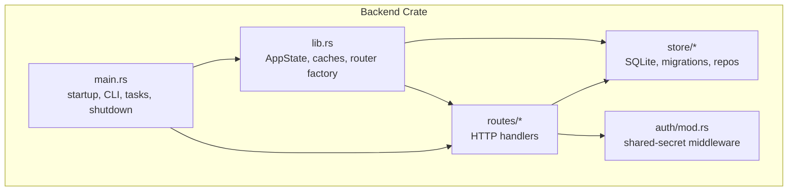
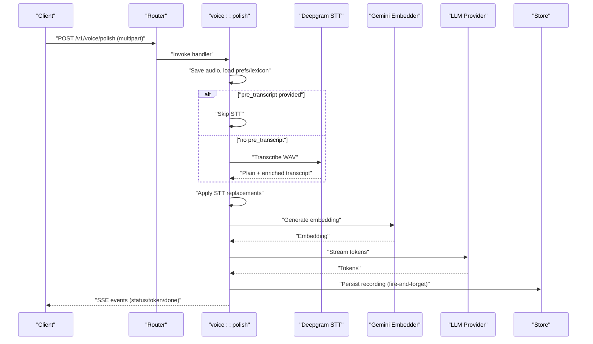
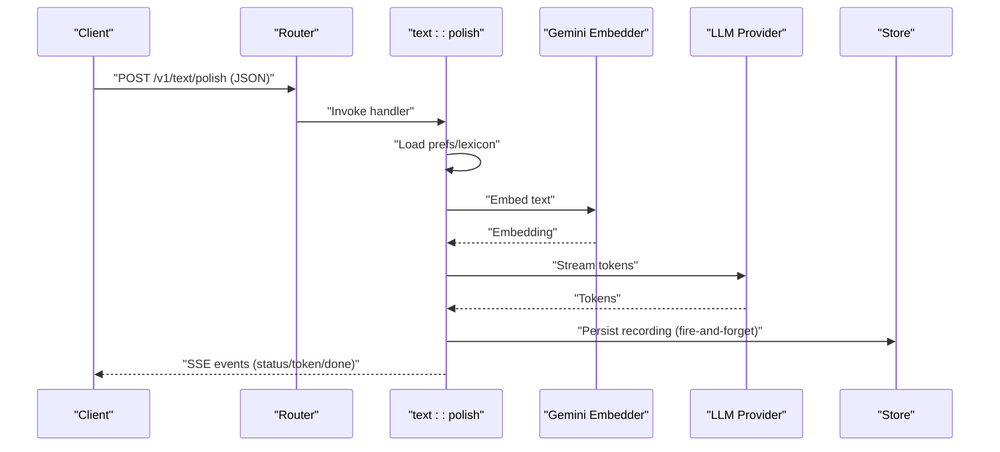
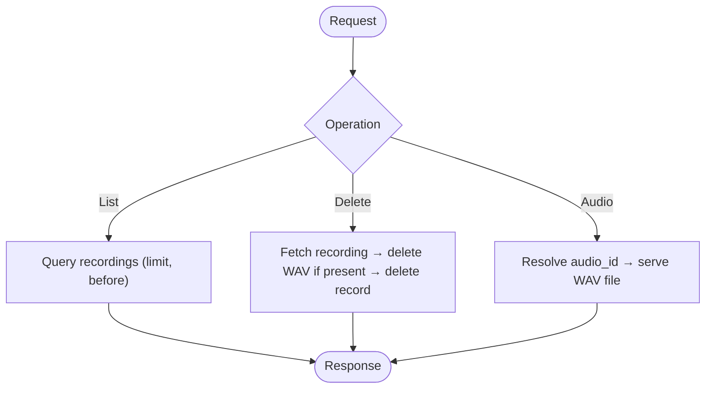
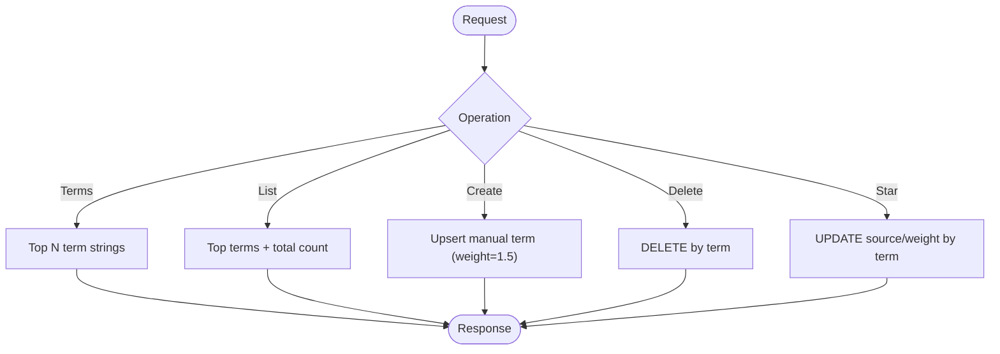
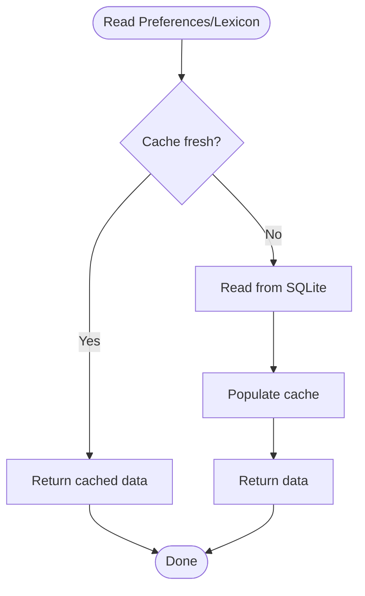
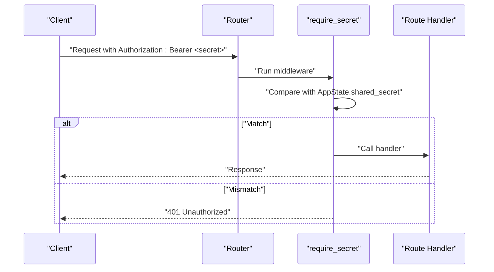
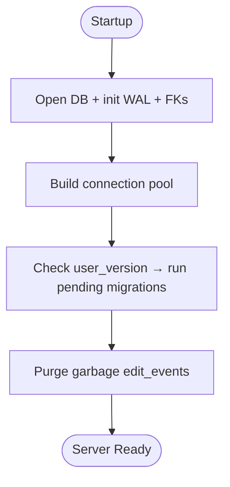
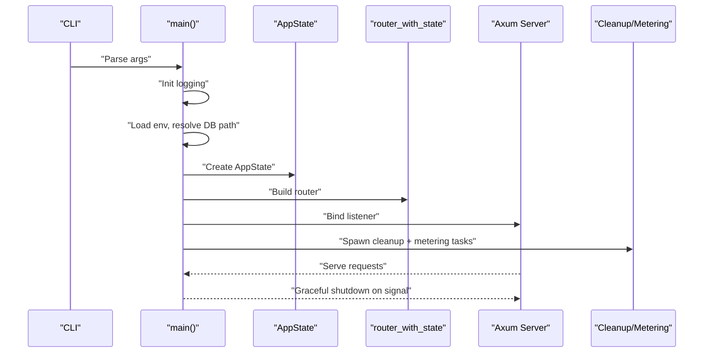
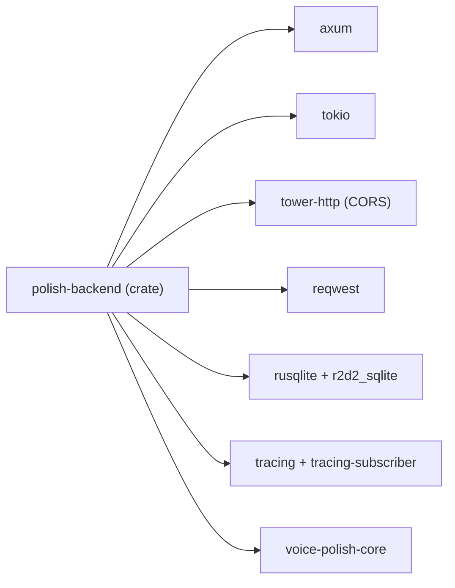

# Backend Service

<cite>
**Referenced Files in This Document**
- [lib.rs](file://crates/backend/src/lib.rs)
- [main.rs](file://crates/backend/src/main.rs)
- [Cargo.toml](file://crates/backend/Cargo.toml)
- [routes/mod.rs](file://crates/backend/src/routes/mod.rs)
- [store/mod.rs](file://crates/backend/src/store/mod.rs)
- [auth/mod.rs](file://crates/backend/src/auth/mod.rs)
- [routes/health.rs](file://crates/backend/src/routes/health.rs)
- [routes/voice.rs](file://crates/backend/src/routes/voice.rs)
- [routes/text.rs](file://crates/backend/src/routes/text.rs)
- [routes/history.rs](file://crates/backend/src/routes/history.rs)
- [routes/vocabulary.rs](file://crates/backend/src/routes/vocabulary.rs)
- [routes/prefs.rs](file://crates/backend/src/routes/prefs.rs)
- [store/prefs.rs](file://crates/backend/src/store/prefs.rs)
- [store/migrations/001_initial.sql](file://crates/backend/src/store/migrations/001_initial.sql)
- [store/migrations/002_vectors.sql](file://crates/backend/src/store/migrations/002_vectors.sql)
- [store/migrations/003_output_language.sql](file://crates/backend/src/store/migrations/003_output_language.sql)
- [store/migrations/004_api_keys.sql](file://crates/backend/src/store/migrations/004_api_keys.sql)
- [store/migrations/005_llm_provider.sql](file://crates/backend/src/store/migrations/005_llm_provider.sql)
- [store/migrations/006_openai_oauth.sql](file://crates/backend/src/store/migrations/006_openai_oauth.sql)
- [store/migrations/007_pending_edits.sql](file://crates/backend/src/store/migrations/007_pending_edits.sql)
- [store/migrations/008_recording_audio_id.sql](file://crates/backend/src/store/migrations/008_recording_audio_id.sql)
- [store/migrations/009_word_corrections.sql](file://crates/backend/src/store/migrations/009_word_corrections.sql)
- [store/migrations/010_groq_api_key.sql](file://crates/backend/src/store/migrations/010_groq_api_key.sql)
- [store/migrations/011_embed_dims_256.sql](file://crates/backend/src/store/migrations/011_embed_dims_256.sql)
- [store/migrations/012_vocabulary_and_stt_replacements.sql](file://crates/backend/src/store/migrations/012_vocabulary_and_stt_replacements.sql)
</cite>

## Table of Contents
1. [Introduction](#introduction)
2. [Project Structure](#project-structure)
3. [Core Components](#core-components)
4. [Architecture Overview](#architecture-overview)
5. [Detailed Component Analysis](#detailed-component-analysis)
6. [Dependency Analysis](#dependency-analysis)
7. [Performance Considerations](#performance-considerations)
8. [Troubleshooting Guide](#troubleshooting-guide)
9. [Conclusion](#conclusion)

## Introduction
This document describes the backend service for WISPR Hindi Bridge, an Axum-based HTTP API daemon designed to provide voice and text polishing workflows with integrated speech-to-text, embeddings, retrieval-augmented generation (RAG), and LLM streaming. The backend exposes authenticated endpoints for voice and text processing, manages application state with caching strategies for preferences and vocabulary, persists data via SQLite with migrations, and integrates with external providers (Deepgram, Gemini, Groq, OpenAI). It also includes health checks, history management, vocabulary management, preference handling, cloud metering, and graceful shutdown.

## Project Structure
The backend crate is organized into cohesive modules:
- Application state and router factory
- Route handlers for health, voice, text, history, vocabulary, preferences, and auxiliary flows
- Store module with SQLite abstraction, migrations, and domain-specific repositories
- Authentication middleware enforcing a shared-secret bearer token
- LLM and embedder integrations (selected at runtime via preferences)
- STT integration (Deepgram)



**Diagram sources**
- [lib.rs:13-227](file://crates/backend/src/lib.rs#L13-L227)
- [main.rs:18-145](file://crates/backend/src/main.rs#L18-L145)
- [routes/mod.rs:1-13](file://crates/backend/src/routes/mod.rs#L1-L13)
- [store/mod.rs:1-284](file://crates/backend/src/store/mod.rs#L1-L284)
- [auth/mod.rs:1-38](file://crates/backend/src/auth/mod.rs#L1-L38)

**Section sources**
- [Cargo.toml:1-42](file://crates/backend/Cargo.toml#L1-L42)
- [lib.rs:13-227](file://crates/backend/src/lib.rs#L13-L227)
- [main.rs:18-145](file://crates/backend/src/main.rs#L18-L145)
- [routes/mod.rs:1-13](file://crates/backend/src/routes/mod.rs#L1-L13)
- [store/mod.rs:1-284](file://crates/backend/src/store/mod.rs#L1-L284)
- [auth/mod.rs:1-38](file://crates/backend/src/auth/mod.rs#L1-L38)

## Core Components
- Application state encapsulates the database pool, shared secret, default user ID, hot caches for preferences and lexicon, and a shared HTTP client.
- Hot caches:
  - Preferences cache: TTL 30 seconds; invalidated on PATCH /v1/preferences.
  - Lexicon cache: corrections + STT replacements; TTL 60 seconds; invalidated on writes.
- Router factory composes public and authenticated routes, applies CORS, and injects state.
- Middleware enforces shared-secret bearer auth for authenticated routes.
- Shared HTTP client pools connections to reduce overhead across requests.

Key implementation references:
- Application state and caches: [lib.rs:23-146](file://crates/backend/src/lib.rs#L23-L146)
- Router composition and CORS: [lib.rs:148-199](file://crates/backend/src/lib.rs#L148-L199)
- Middleware: [auth/mod.rs:19-37](file://crates/backend/src/auth/mod.rs#L19-L37)
- Shared HTTP client: [lib.rs:210-214](file://crates/backend/src/lib.rs#L210-L214), [main.rs:62-66](file://crates/backend/src/main.rs#L62-L66)

**Section sources**
- [lib.rs:23-146](file://crates/backend/src/lib.rs#L23-L146)
- [lib.rs:148-199](file://crates/backend/src/lib.rs#L148-L199)
- [auth/mod.rs:19-37](file://crates/backend/src/auth/mod.rs#L19-L37)
- [main.rs:62-66](file://crates/backend/src/main.rs#L62-L66)

## Architecture Overview
The backend is a single-process Axum server with:
- A health endpoint for readiness
- An authenticated route group protected by shared-secret bearer auth
- SSE-based streaming responses for voice and text polishing
- Background tasks for cleanup and metering
- Graceful shutdown on OS signals

```mermaid
graph TB
Client["Client (Tauri)"] --> Router["Axum Router"]
Router --> Health["GET /v1/health"]
Router --> AuthLayer["Shared-secret middleware"]
AuthLayer --> Voice["POST /v1/voice/polish"]
AuthLayer --> Text["POST /v1/text/polish"]
AuthLayer --> History["GET /v1/history<br/>DELETE /v1/recordings/:id<br/>GET /v1/recordings/:id/audio"]
AuthLayer --> Vocab["GET/POST/DELETE /v1/vocabulary<br/>POST /v1/vocabulary/:term/star<br/>GET /v1/vocabulary/terms"]
AuthLayer --> Prefs["GET/PATCH /v1/preferences<br/>GET /v1/corrections"]
AuthLayer --> Cloud["PUT/DELETE /v1/cloud/token<br/>GET /v1/cloud/status"]
AuthLayer --> OAuth["POST /v1/openai-oauth/initiate<br/>GET /v1/openai-oauth/status<br/>DELETE /v1/openai-oauth/disconnect"]
subgraph "State"
State["AppState<br/>DbPool, caches, HTTP client"]
end
Voice --> State
Text --> State
History --> State
Vocab --> State
Prefs --> State
Cloud --> State
OAuth --> State
```

**Diagram sources**
- [lib.rs:150-199](file://crates/backend/src/lib.rs#L150-L199)
- [auth/mod.rs:19-37](file://crates/backend/src/auth/mod.rs#L19-L37)
- [routes/health.rs:4-9](file://crates/backend/src/routes/health.rs#L4-L9)
- [routes/voice.rs:85-419](file://crates/backend/src/routes/voice.rs#L85-L419)
- [routes/text.rs:47-265](file://crates/backend/src/routes/text.rs#L47-L265)
- [routes/history.rs:23-79](file://crates/backend/src/routes/history.rs#L23-L79)
- [routes/vocabulary.rs:27-150](file://crates/backend/src/routes/vocabulary.rs#L27-L150)
- [routes/prefs.rs:29-56](file://crates/backend/src/routes/prefs.rs#L29-L56)

## Detailed Component Analysis

### HTTP API Endpoints and Routing
- Health: GET /v1/health
- Voice: POST /v1/voice/polish (multipart with audio, optional target_app, optional pre_transcript)
- Text: POST /v1/text/polish (JSON body with text, optional target_app, optional tone_override)
- History: GET /v1/history (paginated), DELETE /v1/recordings/:id, GET /v1/recordings/:id/audio
- Vocabulary: GET /v1/vocabulary/terms, GET/POST/DELETE /v1/vocabulary, POST /v1/vocabulary/:term/star
- Preferences: GET /v1/preferences, PATCH /v1/preferences, GET /v1/corrections
- Cloud: PUT /v1/cloud/token, DELETE /v1/cloud/token, GET /v1/cloud/status
- OpenAI OAuth: POST /v1/openai-oauth/initiate, GET /v1/openai-oauth/status, DELETE /v1/openai-oauth/disconnect
- Pending edits: POST /v1/pending-edits, GET /v1/pending-edits, POST /v1/pending-edits/:id/resolve
- Pre-embed: POST /v1/pre-embed

Routing and CORS are configured in the router factory. Authentication is enforced via a middleware on the authenticated route group.

**Section sources**
- [lib.rs:150-199](file://crates/backend/src/lib.rs#L150-L199)
- [routes/health.rs:4-9](file://crates/backend/src/routes/health.rs#L4-L9)
- [routes/voice.rs:85-419](file://crates/backend/src/routes/voice.rs#L85-L419)
- [routes/text.rs:47-265](file://crates/backend/src/routes/text.rs#L47-L265)
- [routes/history.rs:23-79](file://crates/backend/src/routes/history.rs#L23-L79)
- [routes/vocabulary.rs:27-150](file://crates/backend/src/routes/vocabulary.rs#L27-L150)
- [routes/prefs.rs:29-56](file://crates/backend/src/routes/prefs.rs#L29-L56)
- [auth/mod.rs:19-37](file://crates/backend/src/auth/mod.rs#L19-L37)

### Voice Processing Pipeline
The voice endpoint streams polished output via Server-Sent Events (SSE). The pipeline:
- Validates multipart fields and saves audio to disk for retention
- Loads preferences and lexicon from caches
- Optionally uses a pre-supplied transcript to skip STT
- Applies STT replacements to both raw and enriched transcripts
- Builds a system prompt incorporating RAG examples and vocabulary
- Streams tokens from the selected LLM provider (Gateway, Gemini Direct, Groq, OpenAI Codex)
- Persists the recording asynchronously with timing metrics



**Diagram sources**
- [routes/voice.rs:85-419](file://crates/backend/src/routes/voice.rs#L85-L419)

**Section sources**
- [routes/voice.rs:85-419](file://crates/backend/src/routes/voice.rs#L85-L419)

### Text Processing Pipeline
The text endpoint mirrors the voice pipeline but omits STT:
- Loads preferences and lexicon
- Embeds the input text and retrieves RAG examples
- Builds a system prompt (with optional tray-specific English-locked mode)
- Streams tokens from the selected LLM provider
- Persists the recording asynchronously



**Diagram sources**
- [routes/text.rs:47-265](file://crates/backend/src/routes/text.rs#L47-L265)

**Section sources**
- [routes/text.rs:47-265](file://crates/backend/src/routes/text.rs#L47-L265)

### History Management
- List recordings with pagination
- Delete a recording and its associated audio file if present
- Serve audio WAV files for a recording



**Diagram sources**
- [routes/history.rs:23-79](file://crates/backend/src/routes/history.rs#L23-L79)

**Section sources**
- [routes/history.rs:23-79](file://crates/backend/src/routes/history.rs#L23-L79)

### Vocabulary Management
- Retrieve top N term strings for STT bias
- List vocabulary with weights/sources
- Add a manual term with elevated weight
- Delete a term
- Toggle star status to make a term demotion-immune



**Diagram sources**
- [routes/vocabulary.rs:27-150](file://crates/backend/src/routes/vocabulary.rs#L27-L150)

**Section sources**
- [routes/vocabulary.rs:27-150](file://crates/backend/src/routes/vocabulary.rs#L27-L150)

### Preferences and Lexicon Caching
- Preferences cache: fast-path read from memory; slow-path read from SQLite; invalidated on PATCH
- Lexicon cache: parallel load of corrections and STT replacements; invalidated on writes
- Preference updates are persisted and invalidate caches to ensure freshness



**Diagram sources**
- [lib.rs:41-131](file://crates/backend/src/lib.rs#L41-L131)

**Section sources**
- [lib.rs:41-131](file://crates/backend/src/lib.rs#L41-L131)
- [routes/prefs.rs:29-56](file://crates/backend/src/routes/prefs.rs#L29-L56)
- [store/prefs.rs:47-162](file://crates/backend/src/store/prefs.rs#L47-L162)

### Authentication and Security
- Shared-secret bearer middleware validates Authorization: Bearer <uuid>
- Secret is provided via environment variable and injected into AppState
- Routes under the authenticated layer require this token
- CORS allows origins and headers suitable for Tauri webview and development



**Diagram sources**
- [auth/mod.rs:19-37](file://crates/backend/src/auth/mod.rs#L19-L37)
- [lib.rs:184-187](file://crates/backend/src/lib.rs#L184-L187)

**Section sources**
- [auth/mod.rs:19-37](file://crates/backend/src/auth/mod.rs#L19-L37)
- [lib.rs:184-187](file://crates/backend/src/lib.rs#L184-L187)

### Database Abstraction and Schema Evolution
- SQLite with r2d2 pooling and WAL mode enabled
- Migrations executed on startup, advancing user_version
- Default user and initial preferences created if missing
- Utility functions for time and garbage edit purging



**Diagram sources**
- [store/mod.rs:34-60](file://crates/backend/src/store/mod.rs#L34-L60)
- [store/mod.rs:62-165](file://crates/backend/src/store/mod.rs#L62-L165)
- [store/mod.rs:177-215](file://crates/backend/src/store/mod.rs#L177-L215)

**Section sources**
- [store/mod.rs:34-60](file://crates/backend/src/store/mod.rs#L34-L60)
- [store/mod.rs:62-165](file://crates/backend/src/store/mod.rs#L62-L165)
- [store/mod.rs:177-215](file://crates/backend/src/store/mod.rs#L177-L215)

### Migration Files Overview
The migration set evolves the schema across 12 steps, adding tables and columns for vectors, output language, API keys, LLM provider, OpenAI OAuth, pending edits, recording audio IDs, word corrections, Groq API key, embedding dimensions, and vocabulary plus STT replacements.

**Section sources**
- [store/migrations/001_initial.sql](file://crates/backend/src/store/migrations/001_initial.sql)
- [store/migrations/002_vectors.sql](file://crates/backend/src/store/migrations/002_vectors.sql)
- [store/migrations/003_output_language.sql](file://crates/backend/src/store/migrations/003_output_language.sql)
- [store/migrations/004_api_keys.sql](file://crates/backend/src/store/migrations/004_api_keys.sql)
- [store/migrations/005_llm_provider.sql](file://crates/backend/src/store/migrations/005_llm_provider.sql)
- [store/migrations/006_openai_oauth.sql](file://crates/backend/src/store/migrations/006_openai_oauth.sql)
- [store/migrations/007_pending_edits.sql](file://crates/backend/src/store/migrations/007_pending_edits.sql)
- [store/migrations/008_recording_audio_id.sql](file://crates/backend/src/store/migrations/008_recording_audio_id.sql)
- [store/migrations/009_word_corrections.sql](file://crates/backend/src/store/migrations/009_word_corrections.sql)
- [store/migrations/010_groq_api_key.sql](file://crates/backend/src/store/migrations/010_groq_api_key.sql)
- [store/migrations/011_embed_dims_256.sql](file://crates/backend/src/store/migrations/011_embed_dims_256.sql)
- [store/migrations/012_vocabulary_and_stt_replacements.sql](file://crates/backend/src/store/migrations/012_vocabulary_and_stt_replacements.sql)

### Service Startup, Dependency Injection, and Shutdown
- CLI supports port and DB path options
- Logs structured output to a platform-appropriate log file
- Loads environment variables and initializes the default user
- Builds AppState with shared HTTP client, caches, and DB pool
- Spawns periodic tasks:
  - Cleanup of old recordings and audio files every 6 hours
  - Hourly metering report to cloud when a token is present
- Binds to 127.0.0.1 with graceful shutdown on SIGTERM/SIGINT (Unix) or Ctrl-C (non-Unix)



**Diagram sources**
- [main.rs:44-145](file://crates/backend/src/main.rs#L44-L145)

**Section sources**
- [main.rs:44-145](file://crates/backend/src/main.rs#L44-L145)

## Dependency Analysis
The backend crate depends on Axum for routing and HTTP, Tokio for async runtime, Tower HTTP for CORS, Rusqlite with r2d2 pooling for SQLite, Reqwest for outbound HTTP, and voice-polish-core for shared utilities and API key resolution.



**Diagram sources**
- [Cargo.toml:14-42](file://crates/backend/Cargo.toml#L14-L42)

**Section sources**
- [Cargo.toml:14-42](file://crates/backend/Cargo.toml#L14-L42)

## Performance Considerations
- Hot caches:
  - Preferences: 30-second TTL to minimize SQLite reads
  - Lexicon: 60-second TTL with parallel loads for corrections and STT replacements
- Shared HTTP client with connection pooling reduces TCP/TLS overhead
- Blocking operations offloaded to blocking threads (e.g., vocabulary fetch, SQLite queries) to avoid stalling async executors
- SSE streaming ensures responsive UI updates during long-running operations
- Asynchronous persistence of recordings decouples latency-sensitive paths

[No sources needed since this section provides general guidance]

## Troubleshooting Guide
- Health check: GET /v1/health confirms service availability and version
- Authentication failures: 401 Unauthorized indicates mismatched shared-secret bearer token
- Missing preferences: GET /v1/preferences returns 500 if not found; ensure default user initialization succeeded
- STT errors: Voice endpoint emits SSE error events with audio_id for correlation
- LLM errors: Text and voice endpoints emit SSE error events with contextual messages
- Cleanup tasks: Periodic cleanup removes old recordings and audio files; verify filesystem permissions and paths
- Metering reports: Ensure cloud token exists and network connectivity for hourly reports

**Section sources**
- [routes/health.rs:4-9](file://crates/backend/src/routes/health.rs#L4-L9)
- [auth/mod.rs:32-36](file://crates/backend/src/auth/mod.rs#L32-L36)
- [routes/prefs.rs:29-36](file://crates/backend/src/routes/prefs.rs#L29-L36)
- [routes/voice.rs:130-140](file://crates/backend/src/routes/voice.rs#L130-L140)
- [routes/text.rs:70-77](file://crates/backend/src/routes/text.rs#L70-L77)
- [main.rs:88-101](file://crates/backend/src/main.rs#L88-L101)
- [main.rs:103-118](file://crates/backend/src/main.rs#L103-L118)

## Conclusion
The backend service implements a robust, cache-aware Axum API with secure, authenticated endpoints for voice and text polishing. It leverages SQLite with migrations, maintains hot caches for preferences and lexicon, and integrates external providers through a shared HTTP client. Background tasks handle cleanup and metering, while graceful shutdown ensures clean termination. The modular design supports incremental feature additions and maintainable evolution of the data layer and routing surface.