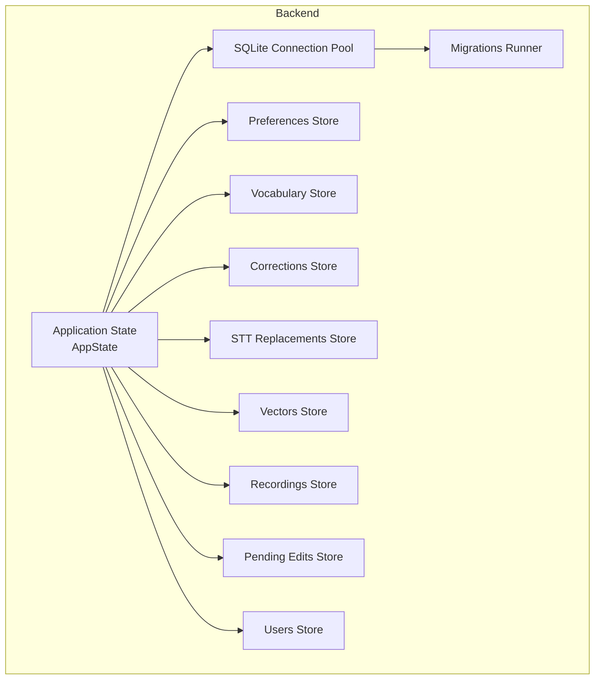
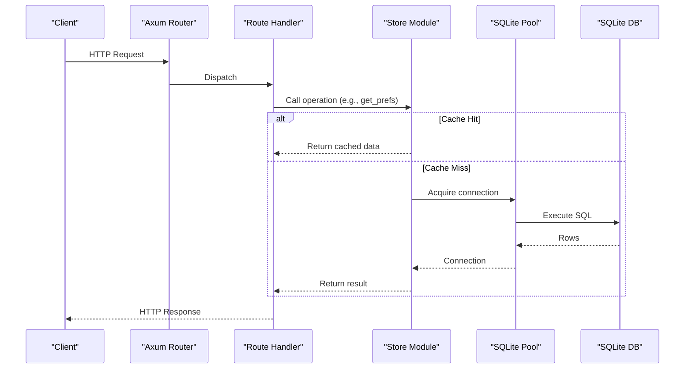
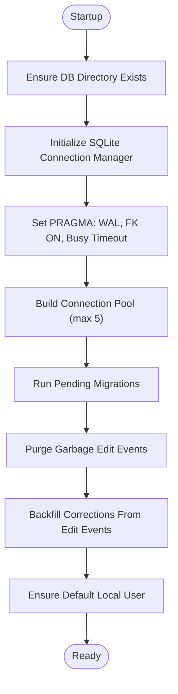
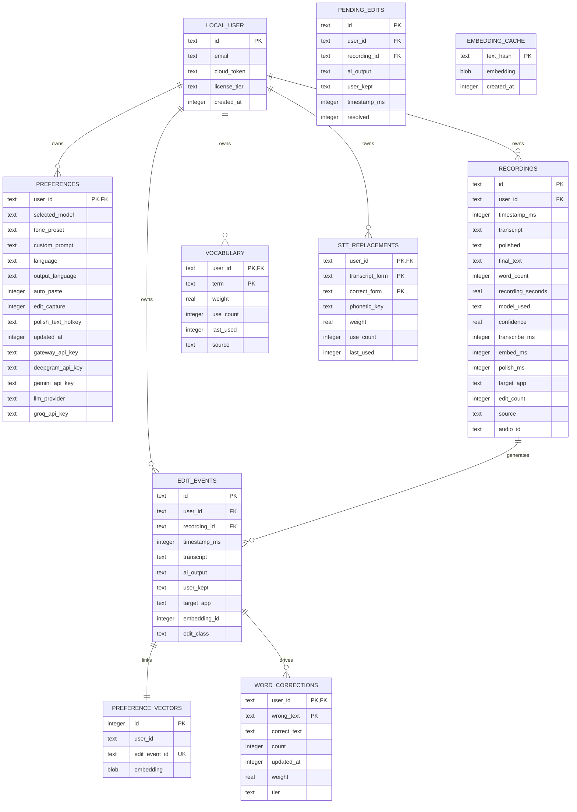
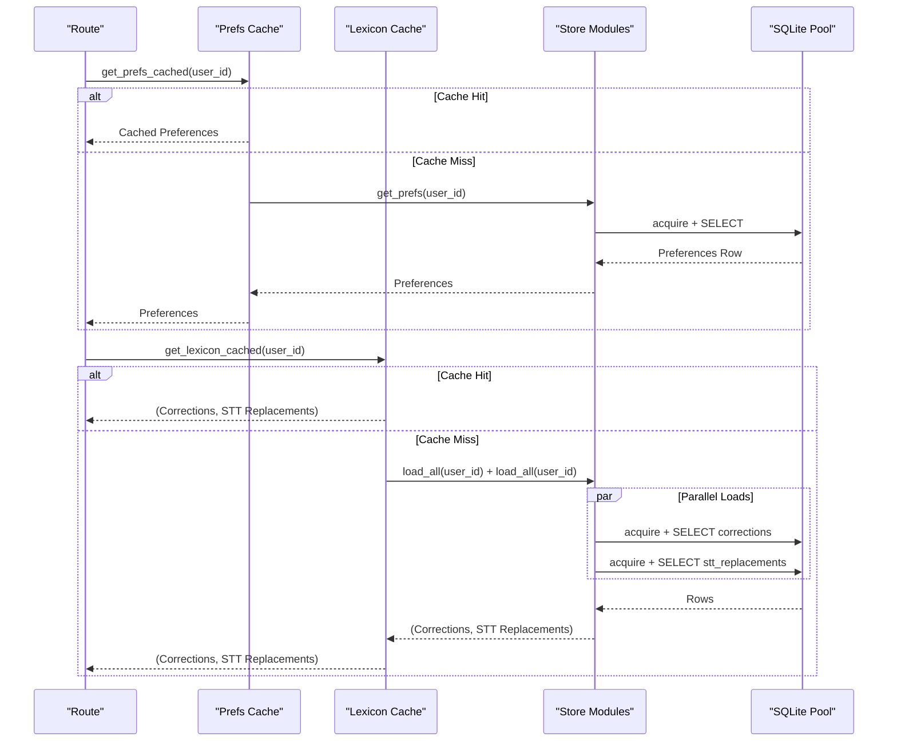
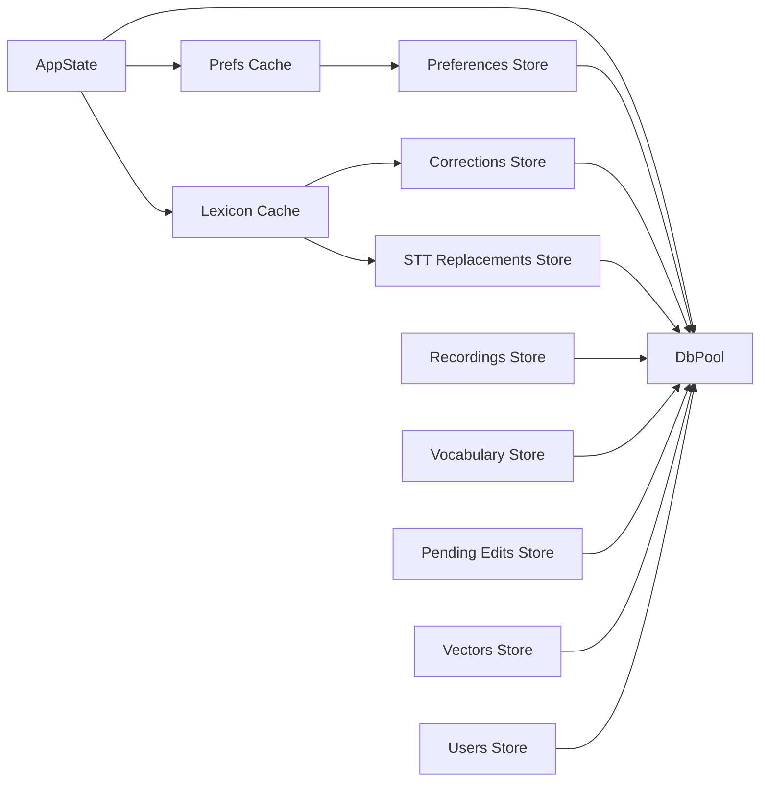

# Data Management Layer

<cite>
**Referenced Files in This Document**
- [lib.rs](file://crates/backend/src/lib.rs)
- [main.rs](file://crates/backend/src/main.rs)
- [store/mod.rs](file://crates/backend/src/store/mod.rs)
- [store/history.rs](file://crates/backend/src/store/history.rs)
- [store/prefs.rs](file://crates/backend/src/store/prefs.rs)
- [store/vocabulary.rs](file://crates/backend/src/store/vocabulary.rs)
- [store/users.rs](file://crates/backend/src/store/users.rs)
- [store/pending_edits.rs](file://crates/backend/src/store/pending_edits.rs)
- [store/vectors.rs](file://crates/backend/src/store/vectors.rs)
- [store/corrections.rs](file://crates/backend/src/store/corrections.rs)
- [store/stt_replacements.rs](file://crates/backend/src/store/stt_replacements.rs)
- [store/migrations/001_initial.sql](file://crates/backend/src/store/migrations/001_initial.sql)
- [store/migrations/002_vectors.sql](file://crates/backend/src/store/migrations/002_vectors.sql)
- [store/migrations/007_pending_edits.sql](file://crates/backend/src/store/migrations/007_pending_edits.sql)
- [store/migrations/012_vocabulary_and_stt_replacements.sql](file://crates/backend/src/store/migrations/012_vocabulary_and_stt_replacements.sql)
</cite>

## Table of Contents
1. [Introduction](#introduction)
2. [Project Structure](#project-structure)
3. [Core Components](#core-components)
4. [Architecture Overview](#architecture-overview)
5. [Detailed Component Analysis](#detailed-component-analysis)
6. [Dependency Analysis](#dependency-analysis)
7. [Performance Considerations](#performance-considerations)
8. [Troubleshooting Guide](#troubleshooting-guide)
9. [Conclusion](#conclusion)
10. [Appendices](#appendices)

## Introduction
This document describes the data management layer of the WISPR Hindi Bridge backend. It covers the SQLite database abstraction, connection pooling, transaction management, data models, schema evolution via migrations, validation and constraints, CRUD operations, query optimization and indexing, caching integration with application state, performance characteristics, backup and recovery, data export, cloud synchronization, and privacy/security considerations.

## Project Structure
The data layer is implemented in the backend crate under the store module. It includes:
- A central store initialization that sets up SQLite, runs migrations, and prepares the default user and caches.
- Feature-specific stores for recordings, preferences, vocabulary, users, pending edits, vectors, corrections, and STT replacements.
- A migration system that evolves the schema over time.
- Application-level caches for preferences and lexicon to reduce SQLite overhead.

**Diagram sources**
- [lib.rs:133-146](file://crates/backend/src/lib.rs#L133-L146)
- [store/mod.rs:34-60](file://crates/backend/src/store/mod.rs#L34-L60)

**Section sources**
- [lib.rs:133-146](file://crates/backend/src/lib.rs#L133-L146)
- [store/mod.rs:34-60](file://crates/backend/src/store/mod.rs#L34-L60)

## Core Components
- SQLite abstraction and connection pooling: The store module initializes SQLite with WAL mode, foreign keys enabled, and a busy timeout. It builds a connection pool sized to five concurrent connections with a 10-second connection timeout.
- Migration system: The store runs incremental migrations based on the SQLite user_version pragma, applying SQL scripts in order and updating the version marker.
- Data models: Core entities include local users, preferences, recordings, edit events, pending edits, vocabulary terms, STT replacements, and word corrections. Each store module exposes typed records and CRUD operations.
- Caching: Two hot caches are integrated into application state:
  - Preferences cache with a 30-second TTL and immediate invalidation on updates.
  - Lexicon cache (corrections + STT replacements) with a 60-second TTL and parallelized refresh.
- Cleanup tasks: Background jobs remove old recordings and old audio files on a six-hour cadence.

**Section sources**
- [store/mod.rs:34-60](file://crates/backend/src/store/mod.rs#L34-L60)
- [store/mod.rs:62-165](file://crates/backend/src/store/mod.rs#L62-L165)
- [lib.rs:29-69](file://crates/backend/src/lib.rs#L29-L69)
- [lib.rs:77-131](file://crates/backend/src/lib.rs#L77-L131)
- [main.rs:88-101](file://crates/backend/src/main.rs#L88-L101)

## Architecture Overview
The backend exposes HTTP endpoints via Axum and uses a shared AppState containing the SQLite pool, caches, and HTTP client. Requests flow through routes to store modules, which perform CRUD operations against SQLite. Hot caches minimize repeated reads for frequently accessed data.

**Diagram sources**
- [lib.rs:150-199](file://crates/backend/src/lib.rs#L150-L199)
- [lib.rs:41-62](file://crates/backend/src/lib.rs#L41-L62)
- [lib.rs:90-124](file://crates/backend/src/lib.rs#L90-L124)

## Detailed Component Analysis

### SQLite Abstraction and Connection Pooling
- Initialization: Creates the database directory if missing, configures PRAGMA journal_mode=WAL, foreign_keys=ON, and busy_timeout=5000ms to handle stale WAL locks gracefully.
- Pool configuration: max_size=5, connection_timeout=10s, built via r2d2_sqlite with SqliteConnectionManager.
- Default path: ~/Library/Application Support/VoicePolish/db.sqlite.
- Startup tasks: Runs migrations, purges garbage edit events, backfills corrections from edit events, and ensures a default local user exists.

**Diagram sources**
- [store/mod.rs:34-60](file://crates/backend/src/store/mod.rs#L34-L60)
- [store/mod.rs:62-165](file://crates/backend/src/store/mod.rs#L62-L165)
- [store/mod.rs:177-215](file://crates/backend/src/store/mod.rs#L177-L215)

**Section sources**
- [store/mod.rs:34-60](file://crates/backend/src/store/mod.rs#L34-L60)
- [store/mod.rs:62-165](file://crates/backend/src/store/mod.rs#L62-L165)
- [store/mod.rs:177-215](file://crates/backend/src/store/mod.rs#L177-L215)

### Schema Evolution Through Migrations
- Initial schema (001): Defines local_user, preferences, recordings, edit_events, and embedding_cache with primary keys, foreign keys, and indexes.
- Vectors (002): Adds preference_vectors table and index for efficient retrieval.
- Pending edits (007): Introduces pending_edits table with resolution state and supporting index.
- Vocabulary and STT replacements (012): Replaces word_corrections with vocabulary, stt_replacements, and adds edit_class to edit_events; adds weights and tiers to word_corrections.

**Diagram sources**
- [store/migrations/001_initial.sql:7-70](file://crates/backend/src/store/migrations/001_initial.sql#L7-L70)
- [store/migrations/002_vectors.sql:6-14](file://crates/backend/src/store/migrations/002_vectors.sql#L6-L14)
- [store/migrations/007_pending_edits.sql:2-13](file://crates/backend/src/store/migrations/007_pending_edits.sql#L2-L13)
- [store/migrations/012_vocabulary_and_stt_replacements.sql:22-55](file://crates/backend/src/store/migrations/012_vocabulary_and_stt_replacements.sql#L22-L55)

**Section sources**
- [store/migrations/001_initial.sql:1-70](file://crates/backend/src/store/migrations/001_initial.sql#L1-L70)
- [store/migrations/002_vectors.sql:1-14](file://crates/backend/src/store/migrations/002_vectors.sql#L1-L14)
- [store/migrations/007_pending_edits.sql:1-13](file://crates/backend/src/store/migrations/007_pending_edits.sql#L1-L13)
- [store/migrations/012_vocabulary_and_stt_replacements.sql:1-55](file://crates/backend/src/store/migrations/012_vocabulary_and_stt_replacements.sql#L1-L55)

### Data Models and CRUD Operations

#### Users
- Model: LocalUser with id, email, cloud_token, license_tier, created_at.
- Operations: Update cloud auth token and tier, clear token, fetch user.

**Section sources**
- [store/users.rs:6-13](file://crates/backend/src/store/users.rs#L6-L13)
- [store/users.rs:15-31](file://crates/backend/src/store/users.rs#L15-L31)
- [store/users.rs:33-50](file://crates/backend/src/store/users.rs#L33-L50)

#### Preferences
- Model: Preferences with user_id, selected_model, tone_preset, custom_prompt, language, output_language, auto_paste, edit_capture, polish_text_hotkey, updated_at, and provider-specific API keys, plus llm_provider.
- Operations: Get preferences, partial update with selective field updates and timestamp refresh.

**Section sources**
- [store/prefs.rs:6-25](file://crates/backend/src/store/prefs.rs#L6-L25)
- [store/prefs.rs:47-76](file://crates/backend/src/store/prefs.rs#L47-L76)
- [store/prefs.rs:78-162](file://crates/backend/src/store/prefs.rs#L78-L162)

#### Recordings
- Model: Recording with id, user_id, timestamp_ms, transcript, polished, final_text, word_count, recording_seconds, model_used, confidence, timing metrics, target_app, edit_count, source, audio_id.
- Operations: Insert recording, list with pagination and time bounds, get by id, delete by id, apply edit feedback, cleanup old recordings.

**Section sources**
- [store/history.rs:7-26](file://crates/backend/src/store/history.rs#L7-L26)
- [store/history.rs:45-63](file://crates/backend/src/store/history.rs#L45-L63)
- [store/history.rs:92-110](file://crates/backend/src/store/history.rs#L92-L110)
- [store/history.rs:113-127](file://crates/backend/src/store/history.rs#L113-L127)
- [store/history.rs:129-133](file://crates/backend/src/store/history.rs#L129-L133)
- [store/history.rs:136-144](file://crates/backend/src/store/history.rs#L136-L144)
- [store/history.rs:146-153](file://crates/backend/src/store/history.rs#L146-L153)

#### Pending Edits
- Model: PendingEdit with id, recording_id, ai_output, user_kept, timestamp_ms.
- Operations: Insert pending edit, get by id, list pending for user, count pending, resolve by marking resolved flag.

**Section sources**
- [store/pending_edits.rs:6-13](file://crates/backend/src/store/pending_edits.rs#L6-L13)
- [store/pending_edits.rs:15-32](file://crates/backend/src/store/pending_edits.rs#L15-L32)
- [store/pending_edits.rs:34-49](file://crates/backend/src/store/pending_edits.rs#L34-L49)
- [store/pending_edits.rs:51-78](file://crates/backend/src/store/pending_edits.rs#L51-L78)
- [store/pending_edits.rs:80-91](file://crates/backend/src/store/pending_edits.rs#L80-L91)
- [store/pending_edits.rs:93-105](file://crates/backend/src/store/pending_edits.rs#L93-L105)

#### Vocabulary Terms
- Model: VocabTerm with term, weight, use_count, last_used, source.
- Operations: Upsert term with weight increase and capped at 5.0, demote with penalty and removal when weight <= 0 (except starred), fetch top-N by weight and recency, count entries, extract term strings.

**Section sources**
- [store/vocabulary.rs:22-29](file://crates/backend/src/store/vocabulary.rs#L22-L29)
- [store/vocabulary.rs:33-72](file://crates/backend/src/store/vocabulary.rs#L33-L72)
- [store/vocabulary.rs:76-103](file://crates/backend/src/store/vocabulary.rs#L76-L103)
- [store/vocabulary.rs:106-133](file://crates/backend/src/store/vocabulary.rs#L106-L133)
- [store/vocabulary.rs:144-154](file://crates/backend/src/store/vocabulary.rs#L144-L154)
- [store/vocabulary.rs:136-141](file://crates/backend/src/store/vocabulary.rs#L136-L141)

#### STT Replacements
- Model: SttReplacement with transcript_form, correct_form, phonetic_key, weight, use_count, last_used.
- Operations: Upsert with phonetic key generation and weight bump, demote with deletion when weight <= 0, load all ordered by weight, apply exact and phonetic fuzzy replacement passes to transcripts.

**Section sources**
- [store/stt_replacements.rs:22-30](file://crates/backend/src/store/stt_replacements.rs#L22-L30)
- [store/stt_replacements.rs:36-67](file://crates/backend/src/store/stt_replacements.rs#L36-L67)
- [store/stt_replacements.rs:69-100](file://crates/backend/src/store/stt_replacements.rs#L69-L100)
- [store/stt_replacements.rs:104-131](file://crates/backend/src/store/stt_replacements.rs#L104-L131)
- [store/stt_replacements.rs:141-190](file://crates/backend/src/store/stt_replacements.rs#L141-L190)

#### Word Corrections
- Model: Correction with wrong, right, count.
- Operations: Extract diffs from AI output vs user kept text, upsert with conflict resolution and count increments, load all ordered by count, backfill from edit_events.

**Section sources**
- [store/corrections.rs:12-18](file://crates/backend/src/store/corrections.rs#L12-L18)
- [store/corrections.rs:25-45](file://crates/backend/src/store/corrections.rs#L25-L45)
- [store/corrections.rs:49-66](file://crates/backend/src/store/corrections.rs#L49-L66)
- [store/corrections.rs:69-93](file://crates/backend/src/store/corrections.rs#L69-L93)
- [store/corrections.rs:95-135](file://crates/backend/src/store/corrections.rs#L95-L135)

#### Preference Vectors
- Model: Embedding storage as BLOB with user_id and edit_event_id linkage.
- Operations: Insert or replace vector, retrieve similar vectors by cosine similarity, compute dot product and L2 norms, join with edit_events to return examples.

**Section sources**
- [store/vectors.rs:16-21](file://crates/backend/src/store/vectors.rs#L16-L21)
- [store/vectors.rs:24-39](file://crates/backend/src/store/vectors.rs#L24-L39)
- [store/vectors.rs:44-125](file://crates/backend/src/store/vectors.rs#L44-L125)
- [store/vectors.rs:127-149](file://crates/backend/src/store/vectors.rs#L127-L149)
- [store/vectors.rs:154-161](file://crates/backend/src/store/vectors.rs#L154-L161)

### Transaction Management
- The store relies on SQLite’s ACID semantics and WAL mode for concurrency. Transactions are not explicitly used in the provided modules; operations are executed as individual statements. Foreign keys are enabled to enforce referential integrity.
- Connection acquisition uses the pool with timeouts configured at pool creation. There is no explicit transaction wrapper in the analyzed code; implicit transactions occur per statement execution.

**Section sources**
- [store/mod.rs:40-54](file://crates/backend/src/store/mod.rs#L40-L54)
- [store/mod.rs:62-165](file://crates/backend/src/store/mod.rs#L62-L165)

### Indexing Strategies and Query Optimization
- Recordings: Composite index on (user_id, timestamp_ms DESC) to optimize paginated listing and time-bound queries.
- Edit events: Index on (user_id, timestamp_ms DESC) for similar reasons.
- Preference vectors: Index on (user_id) to accelerate retrieval of user-specific vectors.
- Pending edits: Composite index on (user_id, resolved, timestamp_ms DESC) to efficiently list pending items.
- Vocabulary: Index on (user_id, weight DESC) to support top-N retrieval by weight and recency.
- STT replacements: Indexes on (user_id) and (user_id, phonetic_key) to support exact and phonetic lookups.
- Embedding cache: Primary key on text_hash for fast lookup.

**Section sources**
- [store/migrations/001_initial.sql:48-48](file://crates/backend/src/store/migrations/001_initial.sql#L48-L48)
- [store/migrations/001_initial.sql:62-62](file://crates/backend/src/store/migrations/001_initial.sql#L62-L62)
- [store/migrations/002_vectors.sql:13-13](file://crates/backend/src/store/migrations/002_vectors.sql#L13-L13)
- [store/migrations/007_pending_edits.sql:11-12](file://crates/backend/src/store/migrations/007_pending_edits.sql](file://crates/backend/src/store/migrations/007_pending_edits.sql#L11-L12)
- [store/migrations/012_vocabulary_and_stt_replacements.sql:32-32](file://crates/backend/src/store/migrations/012_vocabulary_and_stt_replacements.sql#L32-L32)
- [store/migrations/012_vocabulary_and_stt_replacements.sql:45-46](file://crates/backend/src/store/migrations/012_vocabulary_and_stt_replacements.sql#L45-L46)

### Data Access Patterns and Caching Integration
- Preferences cache: TTL 30 seconds; invalidated immediately upon successful preference updates. Reads check cache first, otherwise hit SQLite and repopulate cache.
- Lexicon cache: TTL 60 seconds; invalidated on writes to corrections or stt_replacements. Parallelizes loading corrections and replacements via blocking tasks and combines results.

**Diagram sources**
- [lib.rs:41-62](file://crates/backend/src/lib.rs#L41-L62)
- [lib.rs:90-124](file://crates/backend/src/lib.rs#L90-L124)

**Section sources**
- [lib.rs:29-69](file://crates/backend/src/lib.rs#L29-L69)
- [lib.rs:77-131](file://crates/backend/src/lib.rs#L77-L131)

### Backup and Recovery Procedures
- Backup: Copy the SQLite database file from the default location (~/.wine/.../db.sqlite) while the application is shut down to ensure consistency. The WAL mode and foreign keys are configured at startup; copying the file preserves the WAL state.
- Recovery: Restore the database file from backup, restart the application. The migration runner will apply any pending migrations based on user_version. If corruption is suspected, use SQLite’s integrity checks and consider rebuilding from a clean backup.

[No sources needed since this section provides general guidance]

### Data Export Capabilities
- Export recordings: Use the list endpoint to retrieve paginated recordings for a user and serialize to desired format. The recordings store supports filtering by time bounds and limits.
- Export preferences and lexicon: Fetch preferences and corrections/stt_replacements via their respective endpoints and serialize to JSON or CSV.

**Section sources**
- [store/history.rs:92-110](file://crates/backend/src/store/history.rs#L92-L110)
- [store/prefs.rs:47-76](file://crates/backend/src/store/prefs.rs#L47-L76)
- [store/corrections.rs:69-93](file://crates/backend/src/store/corrections.rs#L69-L93)
- [store/stt_replacements.rs:104-131](file://crates/backend/src/store/stt_replacements.rs#L104-L131)

### Cloud Synchronization Mechanisms
- Metering reports: Periodic aggregation of recording counts and word totals over the last seven days is sent to a cloud endpoint using the user’s cloud token. The report includes date, model, polish_count, and word_count grouped by date and model.
- Cloud token lifecycle: Users can store or clear cloud tokens via dedicated endpoints; metering only proceeds when a token is present.

**Section sources**
- [main.rs:151-233](file://crates/backend/src/main.rs#L151-L233)
- [store/users.rs:15-31](file://crates/backend/src/store/users.rs#L15-L31)

### Privacy, Retention Policies, and Security Measures
- Data locality: API keys and user data are stored locally in SQLite and never leave the device.
- Retention: Recordings older than one day are automatically cleaned up by a background job. Historical retention aligns with seven days for metering reporting.
- Authentication: Routes require a shared-secret bearer token; CORS is configured broadly for development and Tauri webview origins.
- Integrity: Foreign keys are enabled; migrations enforce schema changes atomically; WAL mode improves concurrency and durability.

**Section sources**
- [store/prefs.rs:18-25](file://crates/backend/src/store/prefs.rs#L18-L25)
- [store/mod.rs:40-48](file://crates/backend/src/store/mod.rs#L40-L48)
- [main.rs:189-193](file://crates/backend/src/main.rs#L189-L193)
- [main.rs:88-101](file://crates/backend/src/main.rs#L88-L101)

## Dependency Analysis
The store module composes multiple specialized stores, each depending on the shared pool. The application state holds the pool and caches, wiring them into route handlers.

**Diagram sources**
- [lib.rs:133-146](file://crates/backend/src/lib.rs#L133-L146)
- [lib.rs:150-199](file://crates/backend/src/lib.rs#L150-L199)

**Section sources**
- [lib.rs:133-146](file://crates/backend/src/lib.rs#L133-L146)
- [lib.rs:150-199](file://crates/backend/src/lib.rs#L150-L199)

## Performance Considerations
- Connection pool sizing: Five connections balance concurrency and resource usage for a personal-scale workload.
- WAL mode: Improves concurrent reads/writes and reduces writer stalls.
- Indexes: Strategic composite indexes optimize frequent queries (time-series pagination, user-scoped lookups).
- Caching: Hot caches reduce SQLite load for preferences and lexicon, with short TTLs ensuring freshness.
- Vector similarity: Cosine similarity computed in-process on user-sized corpora; consider vector dimensionality and memory footprint if scaling.

[No sources needed since this section provides general guidance]

## Troubleshooting Guide
- Database connectivity errors: Verify the database path exists and is writable; check pool acquisition timeouts and busy timeouts.
- Migration failures: Inspect user_version and ensure all migration steps succeed; WAL locks can cause delays if a prior session held a stale lock.
- Garbage edit events: Startup purge removes edit events with minimal word overlap; review purge logic if unexpected edits persist.
- Cache misses: Confirm cache TTLs and invalidation triggers; verify that cache writes occur on successful updates.

**Section sources**
- [store/mod.rs:34-60](file://crates/backend/src/store/mod.rs#L34-L60)
- [store/mod.rs:229-271](file://crates/backend/src/store/mod.rs#L229-L271)
- [lib.rs:64-69](file://crates/backend/src/lib.rs#L64-L69)
- [lib.rs:126-131](file://crates/backend/src/lib.rs#L126-L131)

## Conclusion
The WISPR Hindi Bridge backend employs a robust, personal-scale SQLite data layer with careful indexing, migrations, and caching. It enforces referential integrity, maintains strict data locality, and provides efficient access patterns for recordings, preferences, vocabulary, and learning corpora. Background tasks manage retention and cloud metering, while hot caches optimize latency-sensitive operations.

## Appendices

### Appendix A: Endpoint-to-Store Mapping
- Preferences: GET/PATCH /v1/preferences → preferences store
- History: GET /v1/history, DELETE /v1/recordings/:id → history store
- Vocabulary: GET/POST/DELETE /v1/vocabulary/* → vocabulary store
- Pending edits: POST /v1/pending-edits, GET /v1/pending-edits, POST /v1/pending-edits/:id/resolve → pending_edits store
- Lexicon: GET /v1/corrections, GET /v1/vocabulary → corrections + stt_replacements stores
- Cloud: PUT/DELETE /v1/cloud/token, GET /v1/cloud/status → users store
- Metering: Background aggregation and POST to cloud endpoint

**Section sources**
- [lib.rs:150-199](file://crates/backend/src/lib.rs#L150-L199)