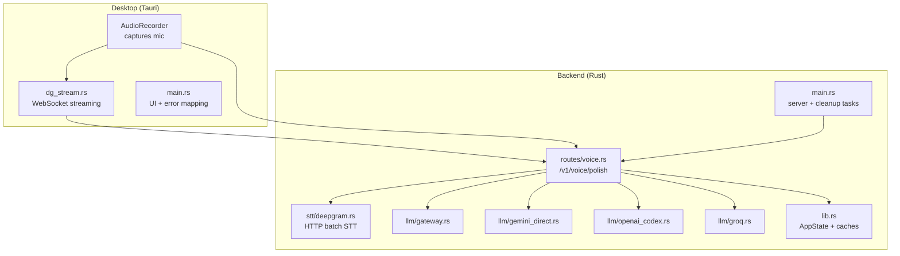
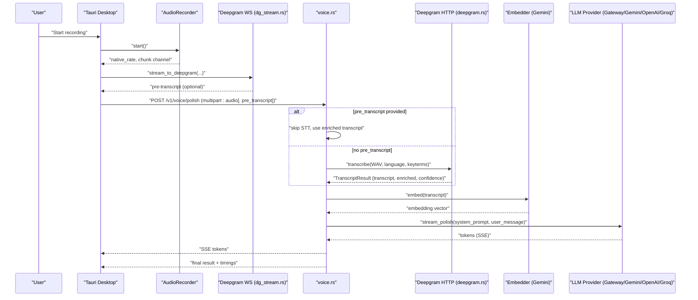
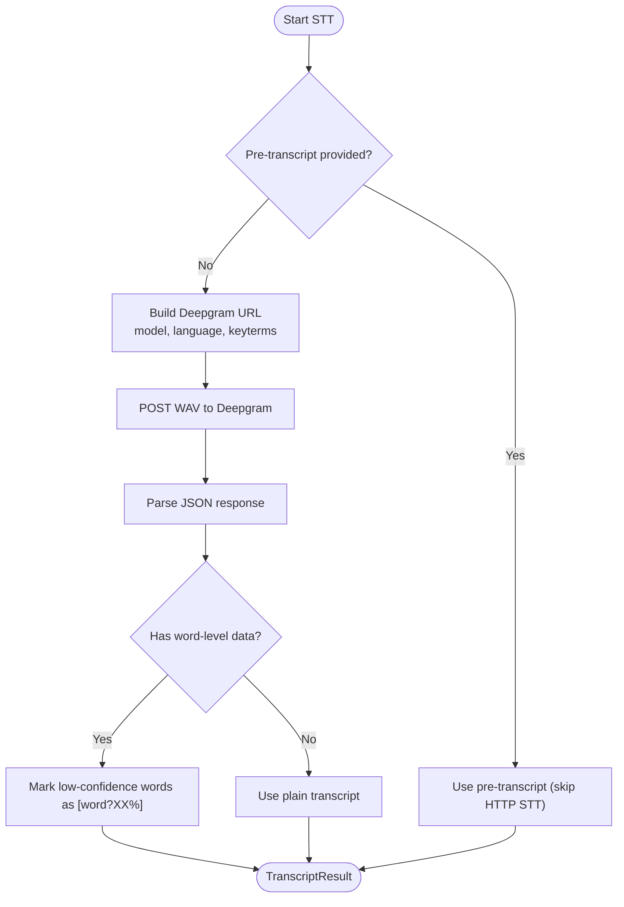
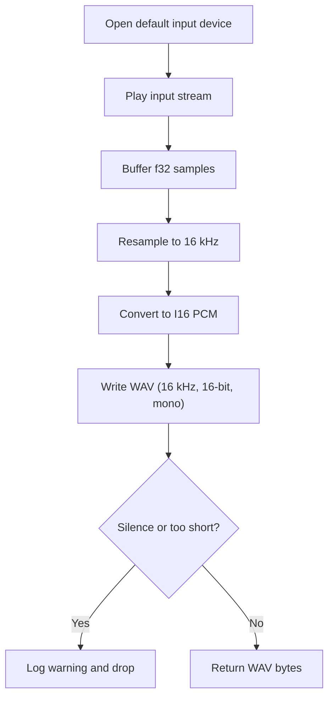
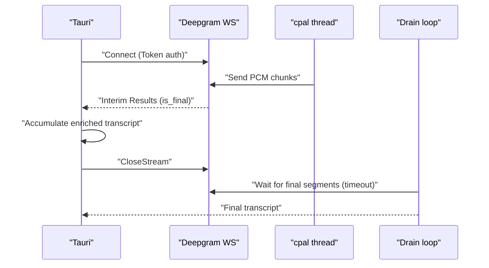
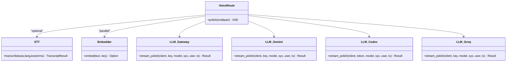
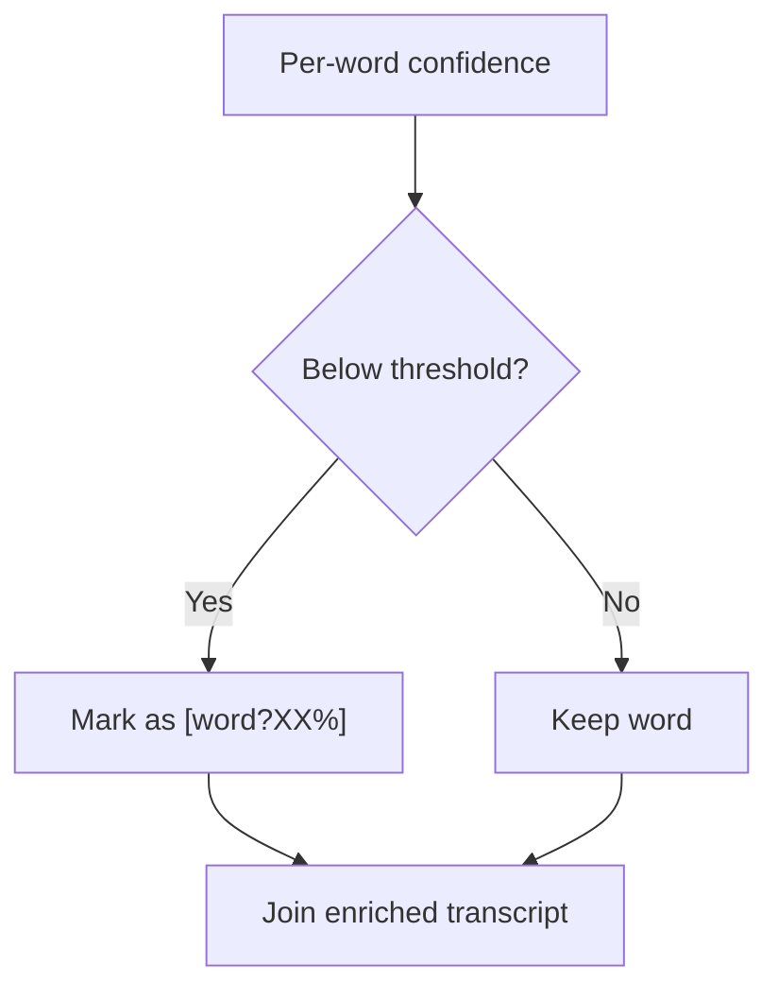
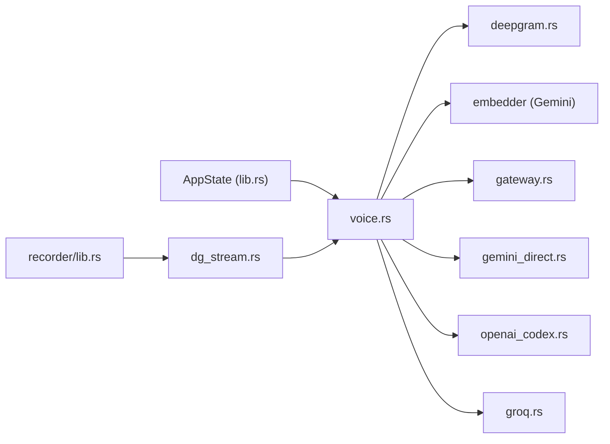

# Speech Processing Integration

<cite>
**Referenced Files in This Document**
- [crates/backend/src/stt/deepgram.rs](file://crates/backend/src/stt/deepgram.rs)
- [crates/backend/src/stt/mod.rs](file://crates/backend/src/stt/mod.rs)
- [crates/backend/src/routes/voice.rs](file://crates/backend/src/routes/voice.rs)
- [crates/backend/src/lib.rs](file://crates/backend/src/lib.rs)
- [crates/backend/src/main.rs](file://crates/backend/src/main.rs)
- [crates/recorder/src/lib.rs](file://crates/recorder/src/lib.rs)
- [desktop/src-tauri/src/dg_stream.rs](file://desktop/src-tauri/src/dg_stream.rs)
- [desktop/src-tauri/src/main.rs](file://desktop/src-tauri/src/main.rs)
- [crates/backend/src/llm/gateway.rs](file://crates/backend/src/llm/gateway.rs)
- [crates/backend/src/llm/gemini_direct.rs](file://crates/backend/src/llm/gemini_direct.rs)
- [crates/backend/src/llm/openai_codex.rs](file://crates/backend/src/llm/openai_codex.rs)
- [crates/backend/src/llm/groq.rs](file://crates/backend/src/llm/groq.rs)
</cite>

## Table of Contents
1. [Introduction](#introduction)
2. [Project Structure](#project-structure)
3. [Core Components](#core-components)
4. [Architecture Overview](#architecture-overview)
5. [Detailed Component Analysis](#detailed-component-analysis)
6. [Dependency Analysis](#dependency-analysis)
7. [Performance Considerations](#performance-considerations)
8. [Troubleshooting Guide](#troubleshooting-guide)
9. [Conclusion](#conclusion)
10. [Appendices](#appendices)

## Introduction
This document explains the speech processing integration in WISPR Hindi Bridge, focusing on the end-to-end voice-to-polished-text pipeline. It covers:
- STT (Speech-to-Text) using Deepgram’s HTTP batch API and WebSocket streaming
- Audio capture and preprocessing (sampling, resampling, WAV conversion)
- Real-time streaming optimization (P5) and confidence-aware enrichment
- Language model integration with multiple providers (Gateway, Gemini, OpenAI Codex, Groq)
- Confidence scoring, fallback mechanisms, and error handling
- Configuration options, performance tuning, and troubleshooting

## Project Structure
The speech processing spans three layers:
- Desktop (Tauri) captures audio, optionally streams to Deepgram in real time, and orchestrates the end-to-end flow
- Backend (Rust) performs STT, post-processing, embeddings, RAG, and LLM orchestration
- Language model providers implement streaming chat completions with SSE

**Diagram sources**
- [crates/recorder/src/lib.rs:1-235](file://crates/recorder/src/lib.rs#L1-L235)
- [desktop/src-tauri/src/dg_stream.rs:1-500](file://desktop/src-tauri/src/dg_stream.rs#L1-L500)
- [crates/backend/src/routes/voice.rs:1-460](file://crates/backend/src/routes/voice.rs#L1-L460)
- [crates/backend/src/stt/deepgram.rs:1-200](file://crates/backend/src/stt/deepgram.rs#L1-L200)
- [crates/backend/src/llm/gateway.rs:1-186](file://crates/backend/src/llm/gateway.rs#L1-L186)
- [crates/backend/src/llm/gemini_direct.rs:1-139](file://crates/backend/src/llm/gemini_direct.rs#L1-L139)
- [crates/backend/src/llm/openai_codex.rs:1-177](file://crates/backend/src/llm/openai_codex.rs#L1-L177)
- [crates/backend/src/llm/groq.rs:1-143](file://crates/backend/src/llm/groq.rs#L1-L143)
- [crates/backend/src/lib.rs:1-227](file://crates/backend/src/lib.rs#L1-L227)
- [crates/backend/src/main.rs:1-234](file://crates/backend/src/main.rs#L1-L234)

**Section sources**
- [crates/recorder/src/lib.rs:1-235](file://crates/recorder/src/lib.rs#L1-L235)
- [desktop/src-tauri/src/dg_stream.rs:1-500](file://desktop/src-tauri/src/dg_stream.rs#L1-L500)
- [crates/backend/src/routes/voice.rs:1-460](file://crates/backend/src/routes/voice.rs#L1-L460)
- [crates/backend/src/stt/deepgram.rs:1-200](file://crates/backend/src/stt/deepgram.rs#L1-L200)
- [crates/backend/src/llm/gateway.rs:1-186](file://crates/backend/src/llm/gateway.rs#L1-L186)
- [crates/backend/src/llm/gemini_direct.rs:1-139](file://crates/backend/src/llm/gemini_direct.rs#L1-L139)
- [crates/backend/src/llm/openai_codex.rs:1-177](file://crates/backend/src/llm/openai_codex.rs#L1-L177)
- [crates/backend/src/llm/groq.rs:1-143](file://crates/backend/src/llm/groq.rs#L1-L143)
- [crates/backend/src/lib.rs:1-227](file://crates/backend/src/lib.rs#L1-L227)
- [crates/backend/src/main.rs:1-234](file://crates/backend/src/main.rs#L1-L234)

## Core Components
- STT (Deepgram)
  - Batch API: HTTP POST to Deepgram with WAV bytes, returns top transcript and per-word confidence
  - Streaming API: WebSocket to Deepgram for near-real-time transcription with interim results
- Audio capture and preprocessing
  - Microphone capture, resampling to 16 kHz, conversion to WAV, and buffering for streaming
- Language model integrations
  - Gateway, Gemini (OpenAI-compatible), OpenAI Codex, and Groq with streaming SSE
- Confidence scoring and enrichment
  - Low-confidence words marked with [word?XX%] for context-aware correction
- Real-time optimization (P5)
  - WebSocket streaming during recording to minimize latency
- Error handling and user messaging
  - Human-friendly error translation and graceful degradation

**Section sources**
- [crates/backend/src/stt/deepgram.rs:1-200](file://crates/backend/src/stt/deepgram.rs#L1-L200)
- [desktop/src-tauri/src/dg_stream.rs:1-500](file://desktop/src-tauri/src/dg_stream.rs#L1-L500)
- [crates/recorder/src/lib.rs:1-235](file://crates/recorder/src/lib.rs#L1-L235)
- [crates/backend/src/routes/voice.rs:1-460](file://crates/backend/src/routes/voice.rs#L1-L460)
- [crates/backend/src/llm/gateway.rs:1-186](file://crates/backend/src/llm/gateway.rs#L1-L186)
- [crates/backend/src/llm/gemini_direct.rs:1-139](file://crates/backend/src/llm/gemini_direct.rs#L1-L139)
- [crates/backend/src/llm/openai_codex.rs:1-177](file://crates/backend/src/llm/openai_codex.rs#L1-L177)
- [crates/backend/src/llm/groq.rs:1-143](file://crates/backend/src/llm/groq.rs#L1-L143)
- [desktop/src-tauri/src/main.rs:84-128](file://desktop/src-tauri/src/main.rs#L84-L128)

## Architecture Overview
The end-to-end voice polish pipeline integrates desktop audio capture, optional real-time STT streaming, backend orchestration, and provider-specific LLM streaming.

**Diagram sources**
- [crates/recorder/src/lib.rs:1-235](file://crates/recorder/src/lib.rs#L1-L235)
- [desktop/src-tauri/src/dg_stream.rs:1-500](file://desktop/src-tauri/src/dg_stream.rs#L1-L500)
- [crates/backend/src/routes/voice.rs:1-460](file://crates/backend/src/routes/voice.rs#L1-L460)
- [crates/backend/src/stt/deepgram.rs:1-200](file://crates/backend/src/stt/deepgram.rs#L1-L200)
- [crates/backend/src/llm/gateway.rs:1-186](file://crates/backend/src/llm/gateway.rs#L1-L186)
- [crates/backend/src/llm/gemini_direct.rs:1-139](file://crates/backend/src/llm/gemini_direct.rs#L1-L139)
- [crates/backend/src/llm/openai_codex.rs:1-177](file://crates/backend/src/llm/openai_codex.rs#L1-L177)
- [crates/backend/src/llm/groq.rs:1-143](file://crates/backend/src/llm/groq.rs#L1-L143)

## Detailed Component Analysis

### STT Pipeline with Deepgram
- Batch transcription
  - Sends WAV bytes to Deepgram HTTP API
  - Builds URL with model, language, punctuation, and optional keyterms
  - Parses JSON response to extract top transcript, confidence, and per-word data
  - Enriches transcript with [word?XX%] markers for low-confidence words
- Streaming transcription (P5)
  - Establishes WebSocket to Deepgram with endpointing and interim results
  - Bridges audio chunks from cpal thread to Tokio via channels
  - Aggregates is_final segments and drains remaining results after CloseStream
  - Produces enriched transcript for LLM consumption

**Diagram sources**
- [crates/backend/src/stt/deepgram.rs:1-200](file://crates/backend/src/stt/deepgram.rs#L1-L200)
- [crates/backend/src/routes/voice.rs:173-210](file://crates/backend/src/routes/voice.rs#L173-L210)

**Section sources**
- [crates/backend/src/stt/deepgram.rs:1-200](file://crates/backend/src/stt/deepgram.rs#L1-L200)
- [crates/backend/src/routes/voice.rs:173-210](file://crates/backend/src/routes/voice.rs#L173-L210)

### Audio Capture and Preprocessing
- Microphone capture
  - Uses cpal to open default input device and play a stream
  - Buffers raw f32 samples and exposes a channel for downstream consumers
- Resampling and WAV conversion
  - Resamples to 16 kHz using linear interpolation
  - Converts f32 samples to I16 PCM and writes WAV with 16-bit, mono, 16 kHz
- Quality checks
  - Detects silence and minimum duration thresholds
  - Logs warnings for potential microphone permission issues

**Diagram sources**
- [crates/recorder/src/lib.rs:1-235](file://crates/recorder/src/lib.rs#L1-L235)

**Section sources**
- [crates/recorder/src/lib.rs:1-235](file://crates/recorder/src/lib.rs#L1-L235)

### Real-Time Streaming (P5) with Deepgram WebSocket
- Connection and configuration
  - Connects to Deepgram WS with model, language, punctuation, encoding, and endpointing
  - Applies keyterms via URL encoding
- Audio bridging
  - Bridges cpal channel to Tokio via async channel
  - Resamples and encodes chunks to linear16 PCM
- Results aggregation
  - Captures is_final segments and accumulates enriched text
  - Drains remaining messages after CloseStream with a bounded timeout
- Pre-embedding
  - Optionally triggers a pre-embed request to cache embeddings for downstream use

**Diagram sources**
- [desktop/src-tauri/src/dg_stream.rs:1-500](file://desktop/src-tauri/src/dg_stream.rs#L1-L500)

**Section sources**
- [desktop/src-tauri/src/dg_stream.rs:1-500](file://desktop/src-tauri/src/dg_stream.rs#L1-L500)

### Language Model Integration and Streaming
- Providers
  - Gateway: custom endpoint with SSE
  - Gemini (OpenAI-compatible): OpenAI-style SSE
  - OpenAI Codex: custom endpoint with distinct payload and event format
  - Groq: OpenAI-compatible SSE with low-latency LPU
- Streaming pattern
  - All providers stream tokens via SSE-like channels
  - Tokens are forwarded to the UI in real time
  - Errors are surfaced with structured messages

**Diagram sources**
- [crates/backend/src/routes/voice.rs:1-460](file://crates/backend/src/routes/voice.rs#L1-L460)
- [crates/backend/src/stt/deepgram.rs:1-200](file://crates/backend/src/stt/deepgram.rs#L1-L200)
- [crates/backend/src/llm/gateway.rs:1-186](file://crates/backend/src/llm/gateway.rs#L1-L186)
- [crates/backend/src/llm/gemini_direct.rs:1-139](file://crates/backend/src/llm/gemini_direct.rs#L1-L139)
- [crates/backend/src/llm/openai_codex.rs:1-177](file://crates/backend/src/llm/openai_codex.rs#L1-L177)
- [crates/backend/src/llm/groq.rs:1-143](file://crates/backend/src/llm/groq.rs#L1-L143)

**Section sources**
- [crates/backend/src/routes/voice.rs:286-357](file://crates/backend/src/routes/voice.rs#L286-L357)
- [crates/backend/src/llm/gateway.rs:1-186](file://crates/backend/src/llm/gateway.rs#L1-L186)
- [crates/backend/src/llm/gemini_direct.rs:1-139](file://crates/backend/src/llm/gemini_direct.rs#L1-L139)
- [crates/backend/src/llm/openai_codex.rs:1-177](file://crates/backend/src/llm/openai_codex.rs#L1-L177)
- [crates/backend/src/llm/groq.rs:1-143](file://crates/backend/src/llm/groq.rs#L1-L143)

### Confidence Scoring and Enrichment
- Threshold
  - Words with confidence below a threshold are marked as uncertain
- Enrichment
  - Transcript enriched with [word?XX%] markers for downstream LLM scrutiny
- Stripping
  - Plain transcript for storage, embedding, and history is recovered by removing markers

**Diagram sources**
- [crates/backend/src/stt/deepgram.rs:148-166](file://crates/backend/src/stt/deepgram.rs#L148-L166)
- [desktop/src-tauri/src/dg_stream.rs:390-422](file://desktop/src-tauri/src/dg_stream.rs#L390-L422)
- [crates/backend/src/routes/voice.rs:421-459](file://crates/backend/src/routes/voice.rs#L421-L459)

**Section sources**
- [crates/backend/src/stt/deepgram.rs:12-16](file://crates/backend/src/stt/deepgram.rs#L12-L16)
- [crates/backend/src/stt/deepgram.rs:148-166](file://crates/backend/src/stt/deepgram.rs#L148-L166)
- [desktop/src-tauri/src/dg_stream.rs:21-22](file://desktop/src-tauri/src/dg_stream.rs#L21-L22)
- [desktop/src-tauri/src/dg_stream.rs:390-422](file://desktop/src-tauri/src/dg_stream.rs#L390-L422)
- [crates/backend/src/routes/voice.rs:421-459](file://crates/backend/src/routes/voice.rs#L421-L459)

### Integration Patterns
- Real-time voice processing (P5)
  - WebSocket streaming during recording; backend receives pre-transcript
- Batch text processing
  - Upload WAV to backend; backend performs STT and LLM processing
- Hybrid approach
  - Use WebSocket streaming for near-real-time results, then augment with backend post-processing and RAG

**Section sources**
- [desktop/src-tauri/src/dg_stream.rs:1-500](file://desktop/src-tauri/src/dg_stream.rs#L1-L500)
- [crates/backend/src/routes/voice.rs:1-460](file://crates/backend/src/routes/voice.rs#L1-L460)

## Dependency Analysis
- Backend state and caching
  - Shared HTTP client, preference cache, and lexicon cache reduce overhead
- Routing and orchestration
  - voice.rs coordinates STT, embedding, RAG, and LLM streaming
- Provider abstraction
  - All LLM providers expose a uniform stream_polish interface

**Diagram sources**
- [crates/backend/src/lib.rs:133-146](file://crates/backend/src/lib.rs#L133-L146)
- [crates/backend/src/routes/voice.rs:1-460](file://crates/backend/src/routes/voice.rs#L1-L460)
- [crates/backend/src/stt/deepgram.rs:1-200](file://crates/backend/src/stt/deepgram.rs#L1-L200)
- [crates/backend/src/llm/gateway.rs:1-186](file://crates/backend/src/llm/gateway.rs#L1-L186)
- [crates/backend/src/llm/gemini_direct.rs:1-139](file://crates/backend/src/llm/gemini_direct.rs#L1-L139)
- [crates/backend/src/llm/openai_codex.rs:1-177](file://crates/backend/src/llm/openai_codex.rs#L1-L177)
- [crates/backend/src/llm/groq.rs:1-143](file://crates/backend/src/llm/groq.rs#L1-L143)
- [crates/recorder/src/lib.rs:1-235](file://crates/recorder/src/lib.rs#L1-L235)
- [desktop/src-tauri/src/dg_stream.rs:1-500](file://desktop/src-tauri/src/dg_stream.rs#L1-L500)

**Section sources**
- [crates/backend/src/lib.rs:1-227](file://crates/backend/src/lib.rs#L1-L227)
- [crates/backend/src/routes/voice.rs:1-460](file://crates/backend/src/routes/voice.rs#L1-L460)

## Performance Considerations
- Latency optimization (P5)
  - WebSocket streaming reduces STT latency by processing audio as it arrives
  - KeepAlive and drain logic ensure final results are flushed
- Audio preprocessing
  - Resampling to 16 kHz reduces upload size and speeds STT
- Concurrency
  - Embedding and prompt building overlap with STT to minimize total latency
- Caching
  - Preferences and lexicon caches reduce SQLite round-trips
- Network
  - Shared HTTP client with connection pooling improves throughput

[No sources needed since this section provides general guidance]

## Troubleshooting Guide
Common issues and remedies:
- Empty transcript or silence
  - Verify microphone permissions and device selection
  - Ensure recording duration meets minimum threshold
- API key errors
  - Deepgram 401/403: check Deepgram API key in Settings
  - Provider 401/403: verify provider key in Settings
- Rate limiting
  - Retry after cooldown; reduce concurrent requests
- Network timeouts
  - Check connectivity; retry later
- Human-friendly error mapping
  - Desktop translates raw errors into concise user-facing messages

**Section sources**
- [crates/recorder/src/lib.rs:188-192](file://crates/recorder/src/lib.rs#L188-L192)
- [desktop/src-tauri/src/main.rs:84-128](file://desktop/src-tauri/src/main.rs#L84-L128)
- [crates/backend/src/stt/deepgram.rs:97-102](file://crates/backend/src/stt/deepgram.rs#L97-L102)
- [crates/backend/src/llm/gateway.rs:83-87](file://crates/backend/src/llm/gateway.rs#L83-L87)
- [crates/backend/src/llm/gemini_direct.rs:81-88](file://crates/backend/src/llm/gemini_direct.rs#L81-L88)
- [crates/backend/src/llm/openai_codex.rs:72-77](file://crates/backend/src/llm/openai_codex.rs#L72-L77)
- [crates/backend/src/llm/groq.rs:93-98](file://crates/backend/src/llm/groq.rs#L93-L98)

## Conclusion
WISPR Hindi Bridge integrates robust STT and LLM pipelines with real-time optimization and strong error handling. The combination of Deepgram’s batch and streaming APIs, precise audio preprocessing, and provider-agnostic LLM streaming enables responsive, accurate voice-to-polished-text workflows tailored for Hindi/Hinglish contexts.

[No sources needed since this section summarizes without analyzing specific files]

## Appendices

### Configuration Options
- Environment variables
  - POLISH_SHARED_SECRET: shared secret for backend authentication
  - DEEPGRAM_API_KEY: Deepgram API key
  - GEMINI_API_KEY: Gemini API key
  - GROQ_API_KEY: Groq API key
  - GATEWAY_API_KEY: Gateway API key
  - CLOUD_API_URL: Cloud reporting endpoint
- Backend preferences
  - Language, tone presets, selected model, and provider selection
  - Personal vocabulary terms for STT keyterm boosting

**Section sources**
- [crates/backend/src/main.rs:41-60](file://crates/backend/src/main.rs#L41-L60)
- [crates/backend/src/routes/voice.rs:146-159](file://crates/backend/src/routes/voice.rs#L146-L159)
- [crates/backend/src/lib.rs:23-69](file://crates/backend/src/lib.rs#L23-L69)

### Performance Tuning Tips
- Use WebSocket streaming (P5) for near-real-time results
- Prefer 16 kHz mono WAV to reduce upload size
- Enable provider-specific models optimized for Hinglish
- Monitor latency breakdowns (transcribe, embed, polish) from SSE payloads

**Section sources**
- [desktop/src-tauri/src/dg_stream.rs:1-500](file://desktop/src-tauri/src/dg_stream.rs#L1-L500)
- [crates/backend/src/routes/voice.rs:396-413](file://crates/backend/src/routes/voice.rs#L396-L413)