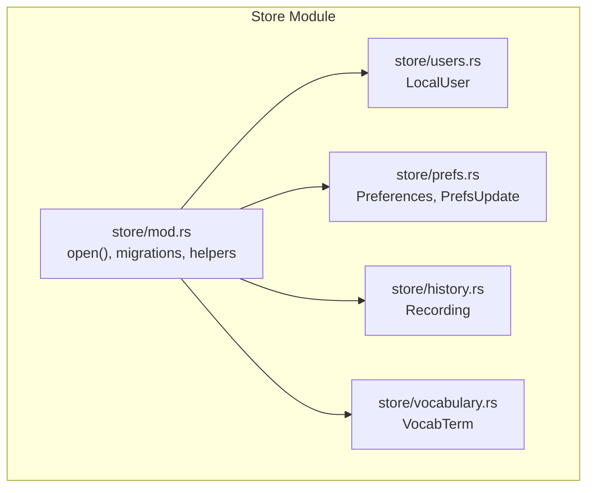
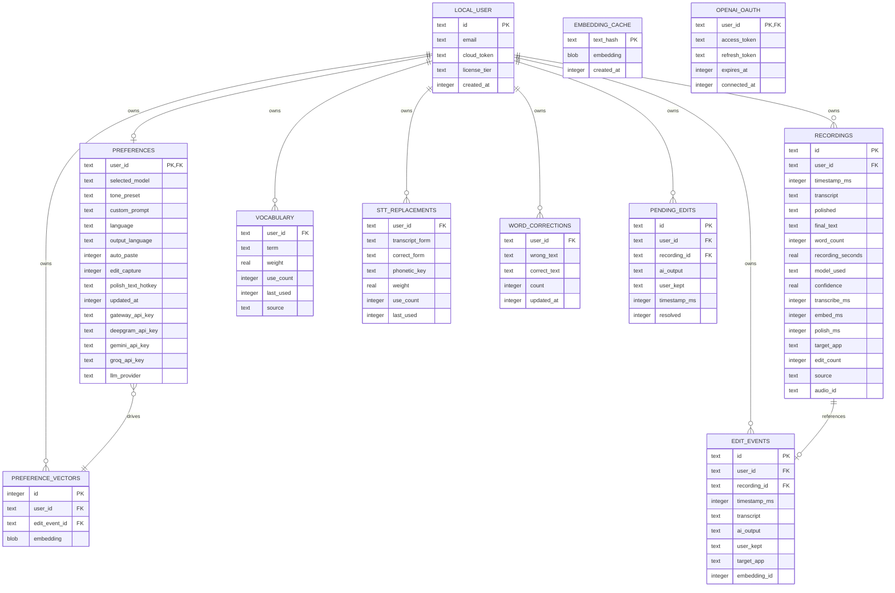
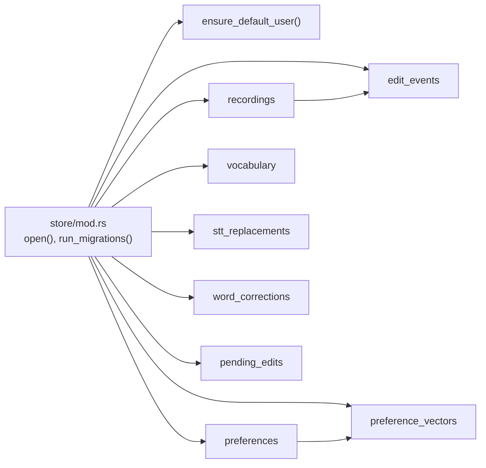

# Core Data Entities

<cite>
**Referenced Files in This Document**
- [store/mod.rs](file://crates/backend/src/store/mod.rs)
- [users.rs](file://crates/backend/src/store/users.rs)
- [prefs.rs](file://crates/backend/src/store/prefs.rs)
- [history.rs](file://crates/backend/src/store/history.rs)
- [vocabulary.rs](file://crates/backend/src/store/vocabulary.rs)
- [001_initial.sql](file://crates/backend/src/store/migrations/001_initial.sql)
- [002_vectors.sql](file://crates/backend/src/store/migrations/002_vectors.sql)
- [003_output_language.sql](file://crates/backend/src/store/migrations/003_output_language.sql)
- [004_api_keys.sql](file://crates/backend/src/store/migrations/004_api_keys.sql)
- [005_llm_provider.sql](file://crates/backend/src/store/migrations/005_llm_provider.sql)
- [006_openai_oauth.sql](file://crates/backend/src/store/migrations/006_openai_oauth.sql)
- [007_pending_edits.sql](file://crates/backend/src/store/migrations/007_pending_edits.sql)
- [008_recording_audio_id.sql](file://crates/backend/src/store/migrations/008_recording_audio_id.sql)
- [009_word_corrections.sql](file://crates/backend/src/store/migrations/009_word_corrections.sql)
- [010_groq_api_key.sql](file://crates/backend/src/store/migrations/010_groq_api_key.sql)
- [012_vocabulary_and_stt_replacements.sql](file://crates/backend/src/store/migrations/012_vocabulary_and_stt_replacements.sql)
</cite>

## Table of Contents
1. [Introduction](#introduction)
2. [Project Structure](#project-structure)
3. [Core Components](#core-components)
4. [Architecture Overview](#architecture-overview)
5. [Detailed Component Analysis](#detailed-component-analysis)
6. [Dependency Analysis](#dependency-analysis)
7. [Performance Considerations](#performance-considerations)
8. [Troubleshooting Guide](#troubleshooting-guide)
9. [Conclusion](#conclusion)

## Introduction
This document describes the core data entities in the WISPR Hindi Bridge backend database schema. It focuses on:
- Recording: audio metadata and processing results
- Preferences: user configuration and integrations
- VocabularyTerm: personal STT bias terms for learning
- User: account management

It explains entity fields, relationships, foreign key constraints, referential integrity, and typical queries/data access patterns.

## Project Structure
The backend uses a local SQLite store with migrations. The store module initializes the database, runs migrations, and exposes typed APIs for each entity.

**Diagram sources**
- [store/mod.rs:34-60](file://crates/backend/src/store/mod.rs#L34-L60)
- [users.rs:6-13](file://crates/backend/src/store/users.rs#L6-L13)
- [prefs.rs:6-25](file://crates/backend/src/store/prefs.rs#L6-L25)
- [history.rs:7-26](file://crates/backend/src/store/history.rs#L7-L26)
- [vocabulary.rs:22-29](file://crates/backend/src/store/vocabulary.rs#L22-L29)

**Section sources**
- [store/mod.rs:17-60](file://crates/backend/src/store/mod.rs#L17-L60)

## Core Components
- Recording: captures transcription, polishing, timing metrics, and optional audio identifier.
- Preferences: per-user settings including model selection, tone preset, language, auto-paste, edit capture, hotkeys, and provider configuration.
- VocabularyTerm: personal STT bias terms with weight, counts, recency, and source.
- User: local account with email, license tier, and creation timestamp.

**Section sources**
- [history.rs:7-26](file://crates/backend/src/store/history.rs#L7-L26)
- [prefs.rs:6-25](file://crates/backend/src/store/prefs.rs#L6-L25)
- [vocabulary.rs:22-29](file://crates/backend/src/store/vocabulary.rs#L22-L29)
- [users.rs:6-13](file://crates/backend/src/store/users.rs#L6-L13)

## Architecture Overview
The schema enforces referential integrity via foreign keys. Users own preferences and recordings. Learning-related tables (vocabulary, STT replacements, word corrections, edit events, pending edits) are owned by users. Embedding cache and preference vectors support vector-based retrieval.

**Diagram sources**
- [001_initial.sql:8-62](file://crates/backend/src/store/migrations/001_initial.sql#L8-L62)
- [002_vectors.sql:6-14](file://crates/backend/src/store/migrations/002_vectors.sql#L6-L14)
- [003_output_language.sql:1-3](file://crates/backend/src/store/migrations/003_output_language.sql#L1-L3)
- [004_api_keys.sql:1-5](file://crates/backend/src/store/migrations/004_api_keys.sql#L1-L5)
- [005_llm_provider.sql:1-4](file://crates/backend/src/store/migrations/005_llm_provider.sql#L1-L4)
- [006_openai_oauth.sql:4-10](file://crates/backend/src/store/migrations/006_openai_oauth.sql#L4-L10)
- [007_pending_edits.sql:2-12](file://crates/backend/src/store/migrations/007_pending_edits.sql#L2-L12)
- [008_recording_audio_id.sql:1-2](file://crates/backend/src/store/migrations/008_recording_audio_id.sql#L1-L2)
- [009_word_corrections.sql:3-10](file://crates/backend/src/store/migrations/009_word_corrections.sql#L3-L10)
- [010_groq_api_key.sql:1-4](file://crates/backend/src/store/migrations/010_groq_api_key.sql#L1-L4)
- [012_vocabulary_and_stt_replacements.sql:23-55](file://crates/backend/src/store/migrations/012_vocabulary_and_stt_replacements.sql#L23-L55)

## Detailed Component Analysis

### Recording Entity
Represents a single audio session with associated processing results and metadata.

Fields
- id: unique identifier
- user_id: owner
- timestamp_ms: creation time
- transcript: raw STT output
- polished: post-processing result
- final_text: user-confirmed edit
- word_count, recording_seconds
- model_used, confidence
- transcribe_ms, embed_ms, polish_ms: timing metrics
- target_app, source
- edit_count: number of user edits applied
- audio_id: optional persistent audio identifier

Constraints and Keys
- Primary key: id
- Foreign key: user_id references local_user(id) with cascade delete
- Index: user_id, timestamp_ms desc

Typical Queries and Access Patterns
- Insert a new recording
  - Use insert_recording with InsertRecording fields
- List recent recordings for a user
  - list_recordings(user_id, limit, before_ms)
- Get a specific recording
  - get_recording(id)
- Apply user edit feedback
  - apply_edit_feedback(recording_id, user_kept)
- Cleanup old recordings
  - cleanup_old_recordings()

Notes
- audio_id column added in migration 008

**Section sources**
- [history.rs:7-26](file://crates/backend/src/store/history.rs#L7-L26)
- [history.rs:45-63](file://crates/backend/src/store/history.rs#L45-L63)
- [history.rs:92-110](file://crates/backend/src/store/history.rs#L92-L110)
- [history.rs:129-133](file://crates/backend/src/store/history.rs#L129-L133)
- [history.rs:146-153](file://crates/backend/src/store/history.rs#L146-L153)
- [008_recording_audio_id.sql:1-2](file://crates/backend/src/store/migrations/008_recording_audio_id.sql#L1-L2)

### Preferences Entity
Per-user configuration including model selection, tone, language, auto-paste, edit capture, hotkeys, and provider settings.

Fields
- user_id: primary key and foreign key to local_user
- selected_model, tone_preset
- custom_prompt
- language, output_language (hinglish, hindi, english)
- auto_paste, edit_capture (boolean flags)
- polish_text_hotkey
- updated_at
- gateway_api_key, deepgram_api_key, gemini_api_key, groq_api_key
- llm_provider (gateway, gemini_direct, groq, openai_codex)

Constraints and Keys
- Primary key: user_id
- Foreign key: user_id references local_user(id)
- Defaults and constraints added via migrations

Typical Queries and Access Patterns
- Retrieve preferences for a user
  - get_prefs(user_id)
- Update preferences
  - update_prefs(user_id, PrefsUpdate) updates only provided fields and sets updated_at

Notes
- output_language added in migration 003
- API key columns added in migration 004
- llm_provider added in migration 005
- groq_api_key added in migration 010

**Section sources**
- [prefs.rs:6-25](file://crates/backend/src/store/prefs.rs#L6-L25)
- [prefs.rs:47-76](file://crates/backend/src/store/prefs.rs#L47-L76)
- [prefs.rs:78-162](file://crates/backend/src/store/prefs.rs#L78-L162)
- [003_output_language.sql:1-3](file://crates/backend/src/store/migrations/003_output_language.sql#L1-L3)
- [004_api_keys.sql:1-5](file://crates/backend/src/store/migrations/004_api_keys.sql#L1-L5)
- [005_llm_provider.sql:1-4](file://crates/backend/src/store/migrations/005_llm_provider.sql#L1-L4)
- [010_groq_api_key.sql:1-4](file://crates/backend/src/store/migrations/010_groq_api_key.sql#L1-L4)

### VocabularyTerm Entity
Personalized STT bias terms to improve recognition of jargon, names, brands, and code identifiers.

Fields
- term: the correctly spelled term
- weight: strength (capped at 5.0)
- use_count: number of times seen
- last_used: timestamp
- source: auto | manual | starred

Constraints and Keys
- Composite unique: (user_id, term)
- Foreign key: user_id references local_user(id) with cascade delete
- Indexes: user_id, weight desc

Typical Queries and Access Patterns
- Upsert a term (insert or strengthen)
  - upsert(user_id, term, bump, source)
- Demote a term (reduce weight; remove if <= 0 and not starred)
  - demote(user_id, term, penalty)
- Fetch top-N terms by weight and recency
  - top_terms(user_id, limit)
  - top_term_strings(user_id, limit)
- Count total terms for a user
  - count(user_id)

Notes
- Added in migration 012; replaces word_corrections for STT bias
- Weight capped at 5.0; starred terms persist through demotion

**Section sources**
- [vocabulary.rs:22-29](file://crates/backend/src/store/vocabulary.rs#L22-L29)
- [vocabulary.rs:33-72](file://crates/backend/src/store/vocabulary.rs#L33-L72)
- [vocabulary.rs:76-103](file://crates/backend/src/store/vocabulary.rs#L76-L103)
- [vocabulary.rs:106-141](file://crates/backend/src/store/vocabulary.rs#L106-L141)
- [vocabulary.rs:144-154](file://crates/backend/src/store/vocabulary.rs#L144-L154)
- [012_vocabulary_and_stt_replacements.sql:23-32](file://crates/backend/src/store/migrations/012_vocabulary_and_stt_replacements.sql#L23-L32)

### User Entity
Local account management with email, license tier, and creation timestamp.

Fields
- id: UUID primary key
- email
- cloud_token: optional
- license_tier: default free
- created_at: timestamp

Typical Queries and Access Patterns
- Get user by id
  - get_user(user_id)
- Update cloud auth token and tier
  - update_cloud_auth(user_id, token, tier)
- Clear cloud token and reset tier
  - clear_cloud_token(user_id)
- Ensure default local user and preferences on first run
  - ensure_default_user(pool) creates local user and default preferences

Notes
- Foreign keys enabled globally; cascade deletes handled by explicit constraints on related tables

**Section sources**
- [users.rs:6-13](file://crates/backend/src/store/users.rs#L6-L13)
- [users.rs:33-50](file://crates/backend/src/store/users.rs#L33-L50)
- [users.rs:15-31](file://crates/backend/src/store/users.rs#L15-L31)
- [store/mod.rs:179-215](file://crates/backend/src/store/mod.rs#L179-L215)
- [001_initial.sql:8-14](file://crates/backend/src/store/migrations/001_initial.sql#L8-L14)

## Dependency Analysis
- Store initialization configures SQLite pragmas, runs migrations, and ensures default user/preferences.
- Recording depends on User via foreign key with cascade delete.
- Vocabulary, STT replacements, word corrections, edit events, and pending edits depend on User with cascade delete.
- Preference vectors reference edit events; garbage edits are purged at startup to maintain referential integrity.

**Diagram sources**
- [store/mod.rs:34-60](file://crates/backend/src/store/mod.rs#L34-L60)
- [store/mod.rs:179-215](file://crates/backend/src/store/mod.rs#L179-L215)
- [001_initial.sql:30-62](file://crates/backend/src/store/migrations/001_initial.sql#L30-L62)
- [002_vectors.sql:6-14](file://crates/backend/src/store/migrations/002_vectors.sql#L6-L14)
- [007_pending_edits.sql:2-12](file://crates/backend/src/store/migrations/007_pending_edits.sql#L2-L12)
- [012_vocabulary_and_stt_replacements.sql:23-55](file://crates/backend/src/store/migrations/012_vocabulary_and_stt_replacements.sql#L23-L55)

**Section sources**
- [store/mod.rs:62-165](file://crates/backend/src/store/mod.rs#L62-L165)
- [store/mod.rs:229-271](file://crates/backend/src/store/mod.rs#L229-L271)

## Performance Considerations
- SQLite WAL mode and foreign keys enabled globally for concurrency and integrity.
- Indexes on recordings(user_id, timestamp_ms desc) and vocabulary(user_id, weight desc) optimize common queries.
- Background cleanup removes old recordings to bound table growth.
- Vector embeddings are stored as blobs; similarity computed in application code.

[No sources needed since this section provides general guidance]

## Troubleshooting Guide
Common issues and remedies
- Missing default user/preferences
  - Call ensure_default_user(pool) to create a single local user and default preferences.
- Garbage edit events
  - Purge runs at startup to remove edit events with negligible word overlap; verify logs for deletion counts.
- Foreign key constraint violations
  - Ensure user_id exists before inserting child records; cascading deletes remove dependent rows automatically.
- API key persistence
  - API keys are stored in preferences; use update_prefs to set or clear provider-specific keys.

**Section sources**
- [store/mod.rs:179-215](file://crates/backend/src/store/mod.rs#L179-L215)
- [store/mod.rs:229-271](file://crates/backend/src/store/mod.rs#L229-L271)
- [prefs.rs:78-162](file://crates/backend/src/store/prefs.rs#L78-L162)

## Conclusion
The schema centers around a single local user with strong referential integrity enforced by foreign keys. Recordings capture end-to-end processing results, Preferences encapsulate user configuration and provider settings, and VocabularyTerms enable personalized STT improvements. The store module manages initialization, migrations, and safe defaults, while supporting efficient queries through targeted indexes.