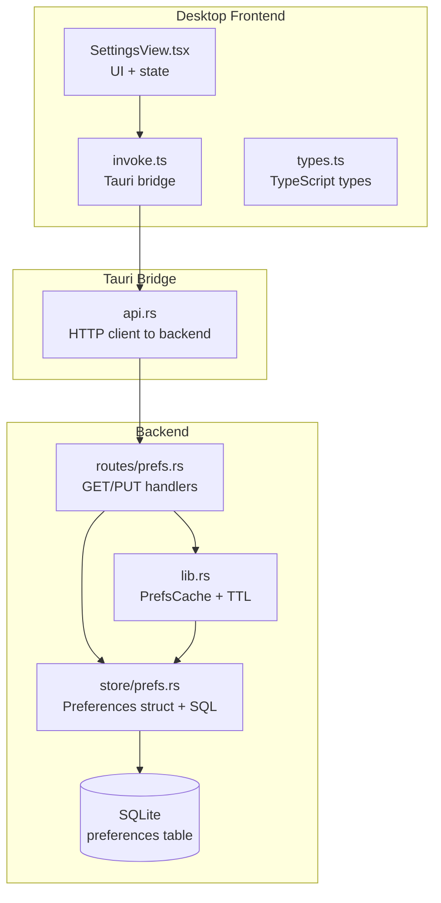
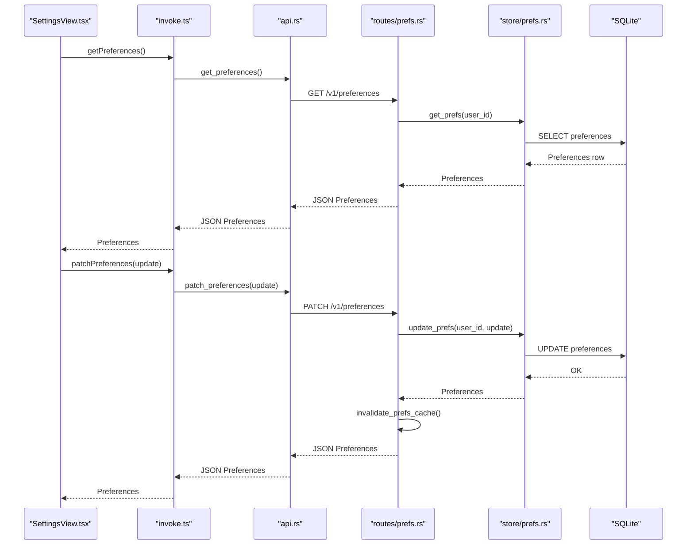
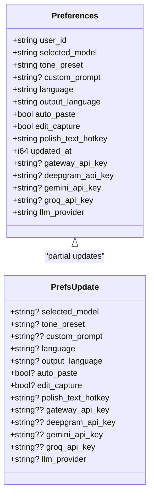
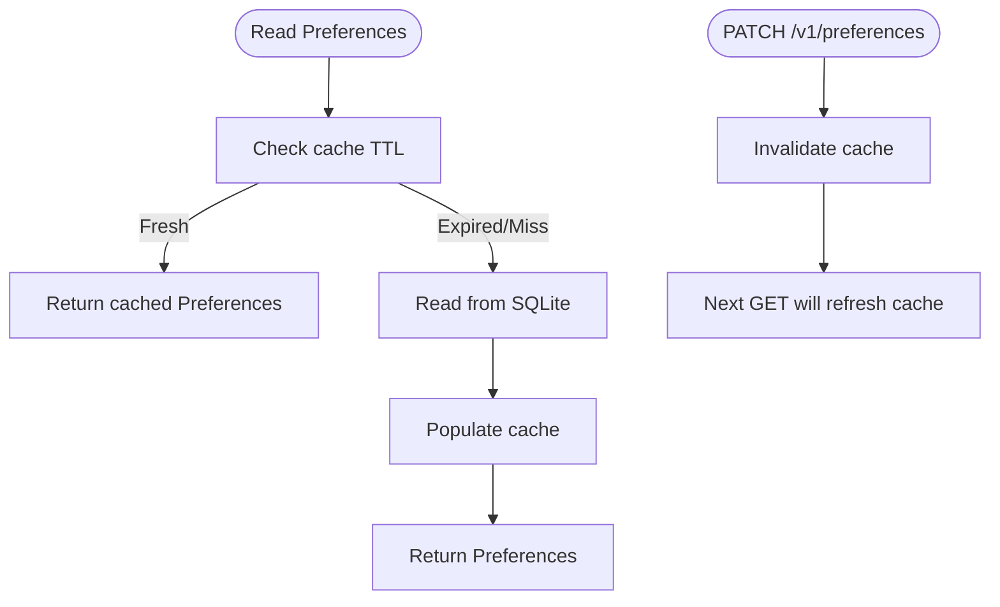
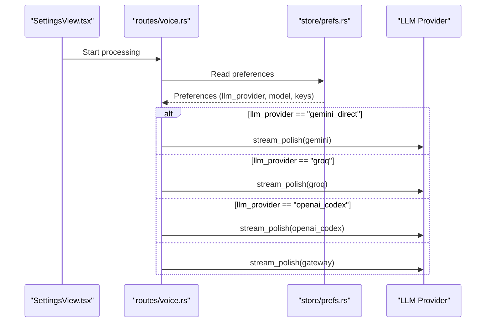
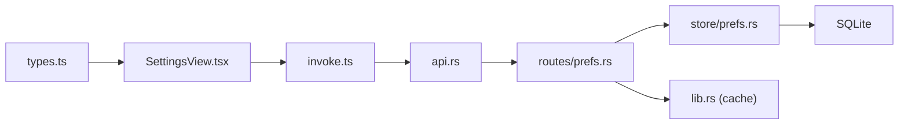

# Preferences Entity

<cite>
**Referenced Files in This Document**
- [prefs.rs](file://crates/backend/src/routes/prefs.rs)
- [prefs.rs](file://crates/backend/src/store/prefs.rs)
- [lib.rs](file://crates/backend/src/lib.rs)
- [types.ts](file://desktop/src/types.ts)
- [SettingsView.tsx](file://desktop/src/components/views/SettingsView.tsx)
- [invoke.ts](file://desktop/src/lib/invoke.ts)
- [api.rs](file://desktop/src-tauri/src/api.rs)
- [001_initial.sql](file://crates/backend/src/store/migrations/001_initial.sql)
- [004_api_keys.sql](file://crates/backend/src/store/migrations/004_api_keys.sql)
- [005_llm_provider.sql](file://crates/backend/src/store/migrations/005_llm_provider.sql)
- [voice.rs](file://crates/backend/src/routes/voice.rs)
- [gemini_direct.rs](file://crates/backend/src/llm/gemini_direct.rs)
</cite>

## Table of Contents
1. [Introduction](#introduction)
2. [Project Structure](#project-structure)
3. [Core Components](#core-components)
4. [Architecture Overview](#architecture-overview)
5. [Detailed Component Analysis](#detailed-component-analysis)
6. [Dependency Analysis](#dependency-analysis)
7. [Performance Considerations](#performance-considerations)
8. [Troubleshooting Guide](#troubleshooting-guide)
9. [Conclusion](#conclusion)
10. [Appendices](#appendices)

## Introduction
This document describes the Preferences entity that manages user configuration in WISPR Hindi Bridge. It covers all preference fields (selected_model, tone_preset, language/output language, auto_paste, edit_capture, global hotkeys, and LLM provider settings), how preferences are stored and cached, default value handling, and how updates propagate through the application stack. It also explains how preferences influence AI processing behavior, UI rendering, and system integration features such as clipboard automation and hotkeys.

## Project Structure
Preferences span three layers:
- Backend Rust: persistence, caching, and API endpoints
- Frontend TypeScript: type definitions and UI bindings
- Desktop Tauri bridge: HTTP calls to backend endpoints

**Diagram sources**
- [SettingsView.tsx:150-411](file://desktop/src/components/views/SettingsView.tsx#L150-L411)
- [invoke.ts:226-246](file://desktop/src/lib/invoke.ts#L226-L246)
- [api.rs:347-379](file://desktop/src-tauri/src/api.rs#L347-L379)
- [prefs.rs:29-56](file://crates/backend/src/routes/prefs.rs#L29-L56)
- [prefs.rs:6-25](file://crates/backend/src/store/prefs.rs#L6-L25)
- [lib.rs:37-69](file://crates/backend/src/lib.rs#L37-L69)
- [001_initial.sql:16-27](file://crates/backend/src/store/migrations/001_initial.sql#L16-L27)

**Section sources**
- [prefs.rs:1-57](file://crates/backend/src/routes/prefs.rs#L1-L57)
- [prefs.rs:1-163](file://crates/backend/src/store/prefs.rs#L1-L163)
- [lib.rs:37-69](file://crates/backend/src/lib.rs#L37-L69)
- [types.ts:54-90](file://desktop/src/types.ts#L54-L90)
- [SettingsView.tsx:150-411](file://desktop/src/components/views/SettingsView.tsx#L150-L411)
- [invoke.ts:226-246](file://desktop/src/lib/invoke.ts#L226-L246)
- [api.rs:347-379](file://desktop/src-tauri/src/api.rs#L347-L379)
- [001_initial.sql:16-27](file://crates/backend/src/store/migrations/001_initial.sql#L16-L27)

## Core Components
- Preferences struct: defines all user-facing settings and provider credentials
- PrefsUpdate: partial update payload for selective field changes
- Backend routes: GET /v1/preferences and PATCH /v1/preferences
- Store layer: SQLite-backed persistence with defaults and conversions
- Cache: in-memory cache with TTL to reduce DB reads
- Frontend types and UI: TypeScript types and SettingsView controls
- Bridge: Tauri HTTP calls to backend endpoints

Key preference fields:
- selected_model: AI model identifier used for processing
- tone_preset: writing style preset (neutral, professional, casual, assertive, concise, custom)
- language: transcription language (auto, hi, multi, en, en-IN)
- output_language: output language (hinglish, hindi, english)
- auto_paste: enable clipboard automation
- edit_capture: capture edits for feedback learning
- polish_text_hotkey: global hotkey to trigger processing
- llm_provider: routing strategy (gateway, gemini_direct, groq, openai_codex)
- API keys: gateway_api_key, deepgram_api_key, gemini_api_key, groq_api_key

Defaults and conversions:
- output_language defaults to "hinglish"
- llm_provider defaults to "gateway"
- auto_paste/edit_capture are stored as booleans (converted from integers in DB)
- Hotkey defaults to a platform-specific value (defined in schema)

**Section sources**
- [prefs.rs:6-25](file://crates/backend/src/store/prefs.rs#L6-L25)
- [prefs.rs:28-45](file://crates/backend/src/store/prefs.rs#L28-L45)
- [001_initial.sql:16-27](file://crates/backend/src/store/migrations/001_initial.sql#L16-L27)
- [004_api_keys.sql:1-5](file://crates/backend/src/store/migrations/004_api_keys.sql#L1-L5)
- [005_llm_provider.sql:1-4](file://crates/backend/src/store/migrations/005_llm_provider.sql#L1-L4)
- [types.ts:54-90](file://desktop/src/types.ts#L54-L90)

## Architecture Overview
End-to-end flow for reading and updating preferences:

**Diagram sources**
- [SettingsView.tsx:272-287](file://desktop/src/components/views/SettingsView.tsx#L272-L287)
- [invoke.ts:226-246](file://desktop/src/lib/invoke.ts#L226-L246)
- [api.rs:347-379](file://desktop/src-tauri/src/api.rs#L347-L379)
- [prefs.rs:29-56](file://crates/backend/src/routes/prefs.rs#L29-L56)
- [prefs.rs:47-162](file://crates/backend/src/store/prefs.rs#L47-L162)
- [lib.rs:64-69](file://crates/backend/src/lib.rs#L64-L69)

## Detailed Component Analysis

### Preferences Data Model
The Preferences struct and PrefsUpdate define the shape of persisted settings and partial updates. The backend converts DB booleans to integer storage and applies defaults when reading.

**Diagram sources**
- [prefs.rs:6-25](file://crates/backend/src/store/prefs.rs#L6-L25)
- [prefs.rs:28-45](file://crates/backend/src/store/prefs.rs#L28-L45)

**Section sources**
- [prefs.rs:6-25](file://crates/backend/src/store/prefs.rs#L6-L25)
- [prefs.rs:28-45](file://crates/backend/src/store/prefs.rs#L28-L45)
- [types.ts:54-90](file://desktop/src/types.ts#L54-L90)

### Preference Storage and Defaults
- Schema: preferences table with defaults for most fields
- Defaults:
  - selected_model: "smart"
  - tone_preset: "neutral"
  - language: "auto"
  - auto_paste: true
  - edit_capture: true
  - polish_text_hotkey: platform-specific default
  - output_language: "hinglish" (fallback in code)
  - llm_provider: "gateway" (fallback in code)
- Integer-to-boolean conversion: stored as INTEGER (1/0) in DB, mapped to bool in Rust/TS

**Section sources**
- [001_initial.sql:16-27](file://crates/backend/src/store/migrations/001_initial.sql#L16-L27)
- [004_api_keys.sql:1-5](file://crates/backend/src/store/migrations/004_api_keys.sql#L1-L5)
- [005_llm_provider.sql:1-4](file://crates/backend/src/store/migrations/005_llm_provider.sql#L1-L4)
- [prefs.rs:47-76](file://crates/backend/src/store/prefs.rs#L47-L76)
- [prefs.rs:62-70](file://crates/backend/src/store/prefs.rs#L62-L70)

### Preference Caching and TTL
- Cache type: RwLock<Option<CachedPrefs>>
- TTL: 30 seconds
- Behavior:
  - Fast path: return cached Preferences if fresh
  - Slow path: read from SQLite, populate cache, return
  - Invalidate after PATCH to ensure next GET sees fresh data

**Diagram sources**
- [lib.rs:37-69](file://crates/backend/src/lib.rs#L37-L69)
- [prefs.rs:29-56](file://crates/backend/src/routes/prefs.rs#L29-L56)

**Section sources**
- [lib.rs:37-69](file://crates/backend/src/lib.rs#L37-L69)
- [prefs.rs:29-56](file://crates/backend/src/routes/prefs.rs#L29-L56)

### API Endpoints and Serialization
- GET /v1/preferences: returns current Preferences
- PATCH /v1/preferences: accepts PrefsUpdate and returns updated Preferences
- Serialization:
  - Frontend types align with backend structs
  - API uses JSON; PATCH sends only provided fields

**Section sources**
- [prefs.rs:29-56](file://crates/backend/src/routes/prefs.rs#L29-L56)
- [types.ts:54-90](file://desktop/src/types.ts#L54-L90)
- [invoke.ts:226-246](file://desktop/src/lib/invoke.ts#L226-L246)
- [api.rs:347-379](file://desktop/src-tauri/src/api.rs#L347-L379)

### Frontend Integration and UI Controls
- SettingsView maintains a local Preferences state and patches changes via invoke.patchPreferences
- UI controls:
  - Writing style: tone presets and custom prompt
  - Language: output language toggle and transcription language dropdown
  - Permissions: Accessibility, Notifications, Input Monitoring
  - API keys: masked inputs with reveal toggle
  - LLM provider: provider selector with key requirements
- Auto-save behavior: immediate patch on user actions; error handling and feedback

**Section sources**
- [SettingsView.tsx:150-411](file://desktop/src/components/views/SettingsView.tsx#L150-L411)
- [SettingsView.tsx:989-1079](file://desktop/src/components/views/SettingsView.tsx#L989-L1079)
- [invoke.ts:226-246](file://desktop/src/lib/invoke.ts#L226-L246)

### How Preferences Affect AI Processing
- selected_model influences the model used for processing
- llm_provider selects the routing strategy:
  - gateway: default route
  - gemini_direct: uses Gemini OpenAI-compatible endpoint
  - groq: uses Groq LPU
  - openai_codex: uses OpenAI OAuth token
- language and output_language affect transcription and output formatting
- edit_capture feeds feedback loops for learning
- polish_text_hotkey triggers processing globally

**Diagram sources**
- [voice.rs:286-311](file://crates/backend/src/routes/voice.rs#L286-L311)
- [gemini_direct.rs:44-110](file://crates/backend/src/llm/gemini_direct.rs#L44-L110)
- [prefs.rs:6-25](file://crates/backend/src/store/prefs.rs#L6-L25)

**Section sources**
- [voice.rs:286-311](file://crates/backend/src/routes/voice.rs#L286-L311)
- [gemini_direct.rs:44-110](file://crates/backend/src/llm/gemini_direct.rs#L44-L110)

### Examples of Preference Patterns
- Casual writer: tone_preset "casual", output_language "hinglish", auto_paste enabled
- Professional writer: tone_preset "professional", output_language "english", edit_capture enabled
- Multilingual speaker: language "multi", output_language "hinglish", polish_text_hotkey customized
- Developer/Power user: llm_provider "groq" with groq_api_key, selected_model tuned for speed
- Enterprise user: llm_provider "gateway" or "openai_codex" depending on OAuth setup

[No sources needed since this section provides general guidance]

### Integration with Application State Management
- Frontend state: Preferences held in SettingsView state and synchronized via invoke.patchPreferences
- Backend state: Preferences cached per user; PATCH invalidates cache for freshness
- UI rendering: SettingsView reacts to preference changes for tone, language, and provider options

**Section sources**
- [SettingsView.tsx:396-411](file://desktop/src/components/views/SettingsView.tsx#L396-L411)
- [lib.rs:64-69](file://crates/backend/src/lib.rs#L64-L69)

## Dependency Analysis
- Backend depends on:
  - SQLite for persistence
  - In-memory cache for performance
  - HTTP client for provider integrations
- Frontend depends on:
  - Tauri bridge for backend calls
  - SettingsView for user-driven updates
- Cross-cutting concerns:
  - Type safety via shared types.ts
  - Consistent defaults across schema and code

**Diagram sources**
- [types.ts:54-90](file://desktop/src/types.ts#L54-L90)
- [SettingsView.tsx:150-411](file://desktop/src/components/views/SettingsView.tsx#L150-L411)
- [invoke.ts:226-246](file://desktop/src/lib/invoke.ts#L226-L246)
- [api.rs:347-379](file://desktop/src-tauri/src/api.rs#L347-L379)
- [prefs.rs:29-56](file://crates/backend/src/routes/prefs.rs#L29-L56)
- [prefs.rs:47-162](file://crates/backend/src/store/prefs.rs#L47-L162)
- [lib.rs:37-69](file://crates/backend/src/lib.rs#L37-L69)

**Section sources**
- [prefs.rs:47-162](file://crates/backend/src/store/prefs.rs#L47-L162)
- [lib.rs:37-69](file://crates/backend/src/lib.rs#L37-L69)
- [types.ts:54-90](file://desktop/src/types.ts#L54-L90)

## Performance Considerations
- Cache TTL: 30 seconds balances freshness and performance
- Partial updates: PATCH updates only provided fields, minimizing writes
- Boolean conversion: INTEGER storage avoids string parsing overhead
- UI responsiveness: immediate patch on user actions with optimistic feedback

[No sources needed since this section provides general guidance]

## Troubleshooting Guide
Common issues and resolutions:
- PATCH fails with backend unreachable:
  - Verify backend is running and reachable
  - Check network permissions and firewall
- Preferences not updating in UI:
  - Ensure cache invalidation occurred after PATCH
  - Confirm next GET retrieves fresh data
- API key not applied:
  - Verify llm_provider requires the key (e.g., gemini_direct, groq)
  - Masked inputs: clear placeholder bullets before typing a new key
- Hotkey not triggering:
  - Confirm Input Monitoring permission granted
  - Check platform-specific hotkey conflicts

**Section sources**
- [SettingsView.tsx:358-394](file://desktop/src/components/views/SettingsView.tsx#L358-L394)
- [prefs.rs:42-55](file://crates/backend/src/routes/prefs.rs#L42-L55)

## Conclusion
The Preferences entity centralizes user configuration for WISPR Hindi Bridge. It provides a robust, cached, and strongly-typed foundation for controlling AI processing behavior, language preferences, clipboard automation, feedback capture, global hotkeys, and LLM provider routing. The frontend integrates seamlessly with backend endpoints, ensuring a responsive and reliable user experience.

[No sources needed since this section summarizes without analyzing specific files]

## Appendices

### Preference Field Reference
- selected_model: AI model identifier
- tone_preset: writing style preset
- custom_prompt: optional custom persona instructions
- language: transcription language
- output_language: output language
- auto_paste: enable clipboard automation
- edit_capture: capture edits for feedback
- polish_text_hotkey: global hotkey to trigger processing
- gateway_api_key, deepgram_api_key, gemini_api_key, groq_api_key: provider credentials
- llm_provider: routing strategy

**Section sources**
- [prefs.rs:6-25](file://crates/backend/src/store/prefs.rs#L6-L25)
- [types.ts:54-90](file://desktop/src/types.ts#L54-L90)