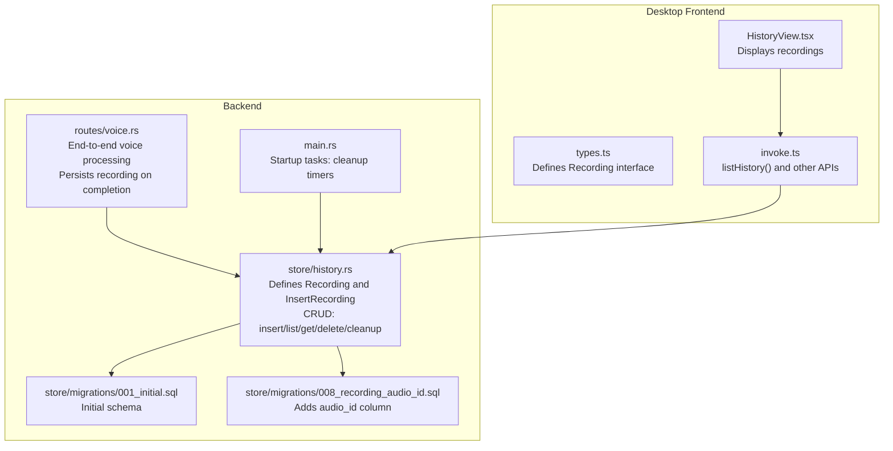
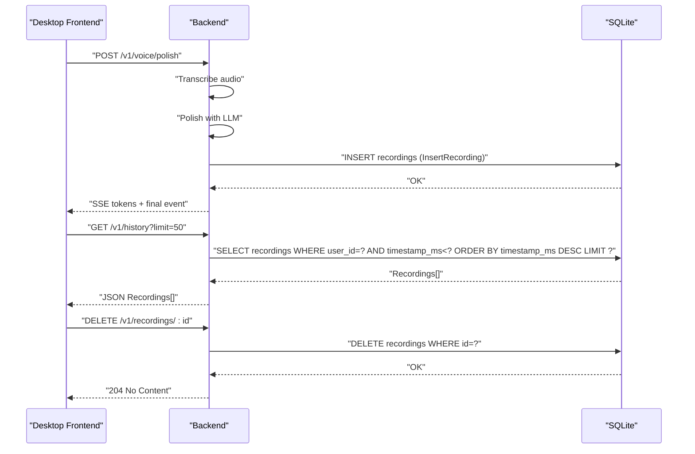
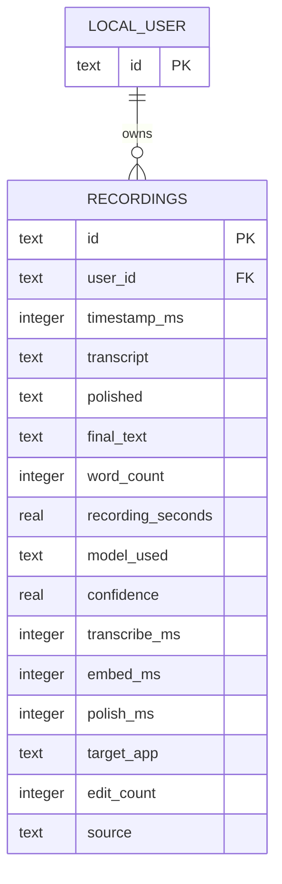
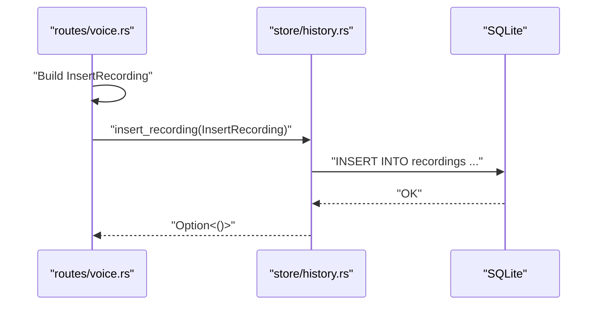
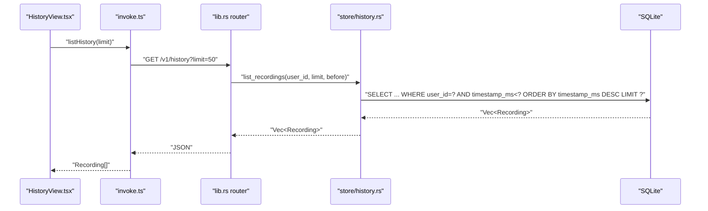
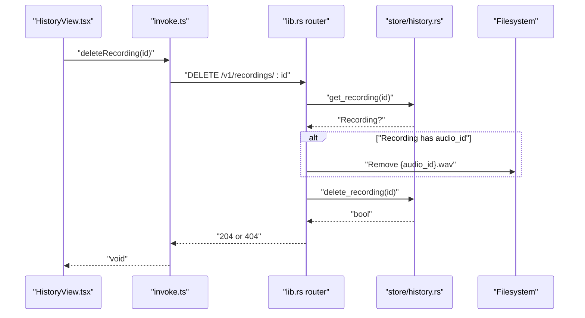
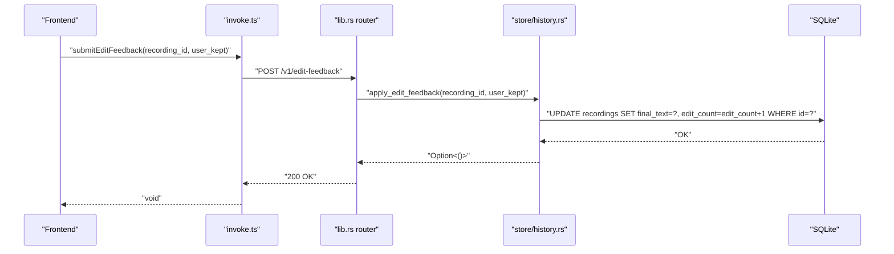
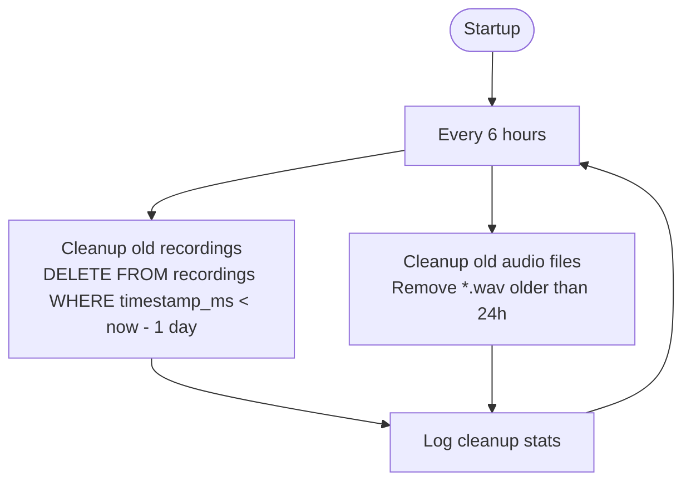
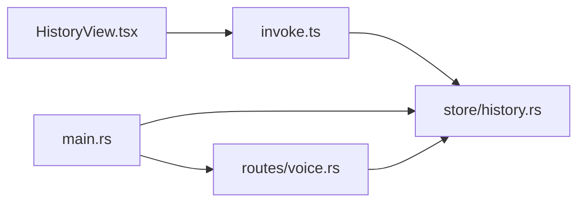

# Recording Entity

<cite>
**Referenced Files in This Document**
- [history.rs](file://crates/backend/src/store/history.rs)
- [voice.rs](file://crates/backend/src/routes/voice.rs)
- [history.rs (frontend)](file://desktop/src/components/views/HistoryView.tsx)
- [types.ts](file://desktop/src/types.ts)
- [invoke.ts](file://desktop/src/lib/invoke.ts)
- [001_initial.sql](file://crates/backend/src/store/migrations/001_initial.sql)
- [008_recording_audio_id.sql](file://crates/backend/src/store/migrations/008_recording_audio_id.sql)
- [main.rs](file://crates/backend/src/main.rs)
- [lib.rs](file://crates/backend/src/lib.rs)
</cite>

## Table of Contents
1. [Introduction](#introduction)
2. [Project Structure](#project-structure)
3. [Core Components](#core-components)
4. [Architecture Overview](#architecture-overview)
5. [Detailed Component Analysis](#detailed-component-analysis)
6. [Dependency Analysis](#dependency-analysis)
7. [Performance Considerations](#performance-considerations)
8. [Troubleshooting Guide](#troubleshooting-guide)
9. [Conclusion](#conclusion)

## Introduction
This document provides comprehensive documentation for the Recording entity in WISPR Hindi Bridge. It explains the Recording data model, the InsertRecording struct used for persistence, and the full CRUD lifecycle for recordings. It also covers how recordings are created during voice processing, how they are retrieved for display in the history view, and the automatic cleanup mechanisms for old recordings and audio files.

## Project Structure
The Recording entity spans backend storage, HTTP routes, and the desktop frontend:
- Backend storage defines the schema and CRUD operations
- Voice route orchestrates the end-to-end voice processing and persists the final result
- Frontend retrieves and displays recordings in the History view

**Diagram sources**
- [history.rs:7-154](file://crates/backend/src/store/history.rs#L7-L154)
- [voice.rs:85-419](file://crates/backend/src/routes/voice.rs#L85-L419)
- [001_initial.sql:29-48](file://crates/backend/src/store/migrations/001_initial.sql#L29-L48)
- [008_recording_audio_id.sql:1-2](file://crates/backend/src/store/migrations/008_recording_audio_id.sql#L1-L2)
- [main.rs:88-101](file://crates/backend/src/main.rs#L88-L101)
- [HistoryView.tsx:216-313](file://desktop/src/components/views/HistoryView.tsx#L216-L313)
- [types.ts:91-109](file://desktop/src/types.ts#L91-L109)
- [invoke.ts:248-256](file://desktop/src/lib/invoke.ts#L248-L256)

**Section sources**
- [history.rs:7-154](file://crates/backend/src/store/history.rs#L7-L154)
- [voice.rs:85-419](file://crates/backend/src/routes/voice.rs#L85-L419)
- [001_initial.sql:29-48](file://crates/backend/src/store/migrations/001_initial.sql#L29-L48)
- [008_recording_audio_id.sql:1-2](file://crates/backend/src/store/migrations/008_recording_audio_id.sql#L1-L2)
- [main.rs:88-101](file://crates/backend/src/main.rs#L88-L101)
- [HistoryView.tsx:216-313](file://desktop/src/components/views/HistoryView.tsx#L216-L313)
- [types.ts:91-109](file://desktop/src/types.ts#L91-L109)
- [invoke.ts:248-256](file://desktop/src/lib/invoke.ts#L248-L256)

## Core Components
- Recording struct: The persistent record returned by the backend to the frontend
- InsertRecording struct: The DTO used to insert a new recording
- CRUD functions: insert_recording, list_recordings, get_recording, delete_recording, apply_edit_feedback
- Automatic cleanup: Old recordings and audio files are periodically removed

Key fields of Recording:
- id: UUID primary key
- user_id: Foreign key to local_user
- timestamp_ms: Creation time in milliseconds
- transcript: Raw speech-to-text
- polished: AI-polished text
- final_text: User-finalized version (nullable)
- word_count: Number of words
- recording_seconds: Total processing duration in seconds
- model_used: AI provider/model identifier
- confidence: Transcription quality score (nullable)
- transcribe_ms: STT latency (nullable)
- embed_ms: Embedding latency (nullable)
- polish_ms: LLM polishing latency (nullable)
- target_app: Application context (nullable)
- edit_count: Number of user edits applied
- source: Input method (e.g., "voice")
- audio_id: Link to saved WAV file (nullable)

InsertRecording fields mirror Recording except for timestamp_ms, which is set automatically.

**Section sources**
- [history.rs:7-43](file://crates/backend/src/store/history.rs#L7-L43)
- [001_initial.sql:29-48](file://crates/backend/src/store/migrations/001_initial.sql#L29-L48)
- [008_recording_audio_id.sql:1-2](file://crates/backend/src/store/migrations/008_recording_audio_id.sql#L1-L2)

## Architecture Overview
The Recording lifecycle connects voice processing, persistence, and frontend display.

**Diagram sources**
- [voice.rs:85-419](file://crates/backend/src/routes/voice.rs#L85-L419)
- [history.rs:45-154](file://crates/backend/src/store/history.rs#L45-L154)
- [lib.rs:150-199](file://crates/backend/src/lib.rs#L150-L199)

## Detailed Component Analysis

### Recording Data Model
The backend schema defines the recordings table and indexes. The Recording struct mirrors the schema for serialization.

**Diagram sources**
- [001_initial.sql:29-48](file://crates/backend/src/store/migrations/001_initial.sql#L29-L48)
- [history.rs:7-26](file://crates/backend/src/store/history.rs#L7-L26)

**Section sources**
- [001_initial.sql:29-48](file://crates/backend/src/store/migrations/001_initial.sql#L29-L48)
- [history.rs:7-26](file://crates/backend/src/store/history.rs#L7-L26)

### Insertion Workflow
During voice processing, the backend builds InsertRecording and persists it asynchronously after streaming completes.

**Diagram sources**
- [voice.rs:363-392](file://crates/backend/src/routes/voice.rs#L363-L392)
- [history.rs:45-63](file://crates/backend/src/store/history.rs#L45-L63)

**Section sources**
- [voice.rs:363-392](file://crates/backend/src/routes/voice.rs#L363-L392)
- [history.rs:45-63](file://crates/backend/src/store/history.rs#L45-L63)

### Retrieval and Pagination
The history endpoint supports pagination via a before timestamp and a limit.

**Diagram sources**
- [HistoryView.tsx:220-222](file://desktop/src/components/views/HistoryView.tsx#L220-L222)
- [invoke.ts:248-256](file://desktop/src/lib/invoke.ts#L248-L256)
- [lib.rs:170-172](file://crates/backend/src/lib.rs#L170-L172)
- [history.rs:92-110](file://crates/backend/src/store/history.rs#L92-L110)

**Section sources**
- [HistoryView.tsx:220-222](file://desktop/src/components/views/HistoryView.tsx#L220-L222)
- [invoke.ts:248-256](file://desktop/src/lib/invoke.ts#L248-L256)
- [lib.rs:170-172](file://crates/backend/src/lib.rs#L170-L172)
- [history.rs:92-110](file://crates/backend/src/store/history.rs#L92-L110)

### Deletion and Audio Cleanup
Deleting a recording removes the SQLite row and the associated WAV file if present.

**Diagram sources**
- [HistoryView.tsx:224-228](file://desktop/src/components/views/HistoryView.tsx#L224-L228)
- [invoke.ts:302-305](file://desktop/src/lib/invoke.ts#L302-L305)
- [lib.rs:171-172](file://crates/backend/src/lib.rs#L171-L172)
- [history.rs:129-144](file://crates/backend/src/store/history.rs#L129-L144)

**Section sources**
- [HistoryView.tsx:224-228](file://desktop/src/components/views/HistoryView.tsx#L224-L228)
- [invoke.ts:302-305](file://desktop/src/lib/invoke.ts#L302-L305)
- [lib.rs:171-172](file://crates/backend/src/lib.rs#L171-L172)
- [history.rs:129-144](file://crates/backend/src/store/history.rs#L129-L144)

### Feedback Application
Users can submit feedback to finalize a recording, incrementing edit_count.

**Diagram sources**
- [invoke.ts:322-337](file://desktop/src/lib/invoke.ts#L322-L337)
- [lib.rs:160-160](file://crates/backend/src/lib.rs#L160-L160)
- [history.rs:146-153](file://crates/backend/src/store/history.rs#L146-L153)

**Section sources**
- [invoke.ts:322-337](file://desktop/src/lib/invoke.ts#L322-L337)
- [lib.rs:160-160](file://crates/backend/src/lib.rs#L160-L160)
- [history.rs:146-153](file://crates/backend/src/store/history.rs#L146-L153)

### Automatic Cleanup
The backend runs periodic cleanup tasks:
- Every 6 hours: remove recordings older than 1 day
- Every 6 hours: remove WAV audio files older than 24 hours

**Diagram sources**
- [main.rs:88-101](file://crates/backend/src/main.rs#L88-L101)
- [history.rs:112-127](file://crates/backend/src/store/history.rs#L112-L127)
- [voice.rs:53-69](file://crates/backend/src/routes/voice.rs#L53-L69)

**Section sources**
- [main.rs:88-101](file://crates/backend/src/main.rs#L88-L101)
- [history.rs:112-127](file://crates/backend/src/store/history.rs#L112-L127)
- [voice.rs:53-69](file://crates/backend/src/routes/voice.rs#L53-L69)

## Dependency Analysis
- Voice route depends on store/history.rs for persistence
- Frontend depends on invoke.ts for HTTP calls and types.ts for typing
- Cleanup tasks depend on both recording and audio cleanup functions

**Diagram sources**
- [voice.rs:76-83](file://crates/backend/src/routes/voice.rs#L76-L83)
- [history.rs:45-154](file://crates/backend/src/store/history.rs#L45-L154)
- [HistoryView.tsx:216-222](file://desktop/src/components/views/HistoryView.tsx#L216-L222)
- [invoke.ts:248-256](file://desktop/src/lib/invoke.ts#L248-L256)
- [main.rs:88-101](file://crates/backend/src/main.rs#L88-L101)

**Section sources**
- [voice.rs:76-83](file://crates/backend/src/routes/voice.rs#L76-L83)
- [history.rs:45-154](file://crates/backend/src/store/history.rs#L45-L154)
- [HistoryView.tsx:216-222](file://desktop/src/components/views/HistoryView.tsx#L216-L222)
- [invoke.ts:248-256](file://desktop/src/lib/invoke.ts#L248-L256)
- [main.rs:88-101](file://crates/backend/src/main.rs#L88-L101)

## Performance Considerations
- Persistence is fire-and-forget: the voice route spawns a background task to insert the recording, avoiding blocking the SSE stream.
- Indexes: recordings table has a composite index on (user_id, timestamp_ms DESC) to optimize history queries.
- Cleanup intervals: 6-hour cadence balances resource usage with data hygiene.
- Audio retention: WAV files are retained for 24 hours to support retries and playback.

[No sources needed since this section provides general guidance]

## Troubleshooting Guide
Common issues and resolutions:
- Empty audio received: The voice route validates presence of WAV bytes and returns a bad request status if missing.
- Missing preferences: If preferences are not found, the voice route yields an error event with audio_id for potential retry.
- Database connectivity: All store functions wrap operations with safe unwrapping; failures return None/empty results, preventing panics.
- Cleanup not running: Verify the background task is spawned at startup and that logging indicates cleanup activity.

**Section sources**
- [voice.rs:103-106](file://crates/backend/src/routes/voice.rs#L103-L106)
- [voice.rs:130-140](file://crates/backend/src/routes/voice.rs#L130-L140)
- [history.rs:92-110](file://crates/backend/src/store/history.rs#L92-L110)
- [main.rs:88-101](file://crates/backend/src/main.rs#L88-L101)

## Conclusion
The Recording entity is central to WISPR Hindi Bridge’s voice processing pipeline. It captures the full lifecycle of a polished utterance, including timing metrics and optional audio linkage. The backend provides robust CRUD operations and automated cleanup, while the frontend presents a user-friendly history view with playback and deletion capabilities.