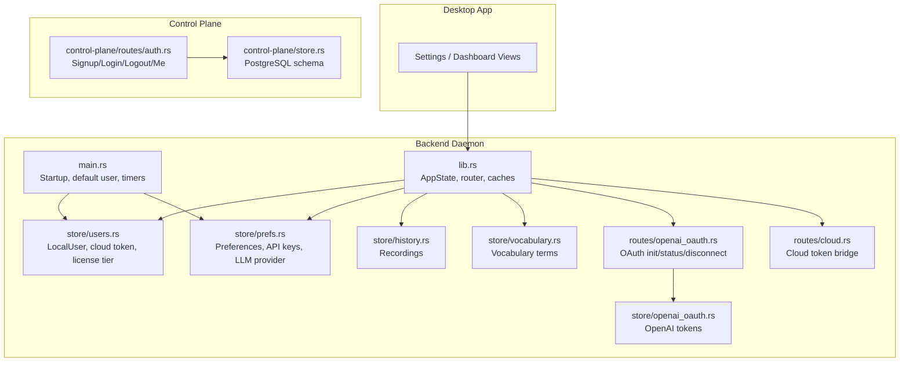
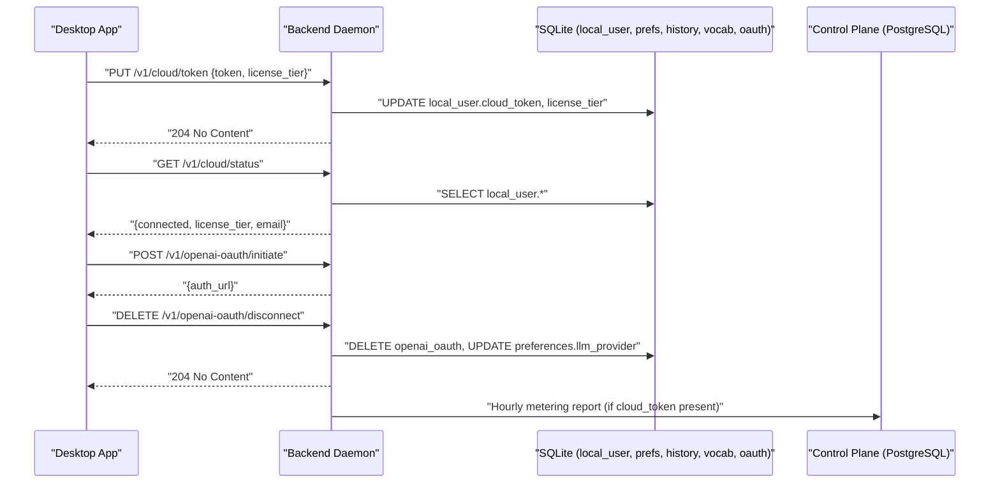
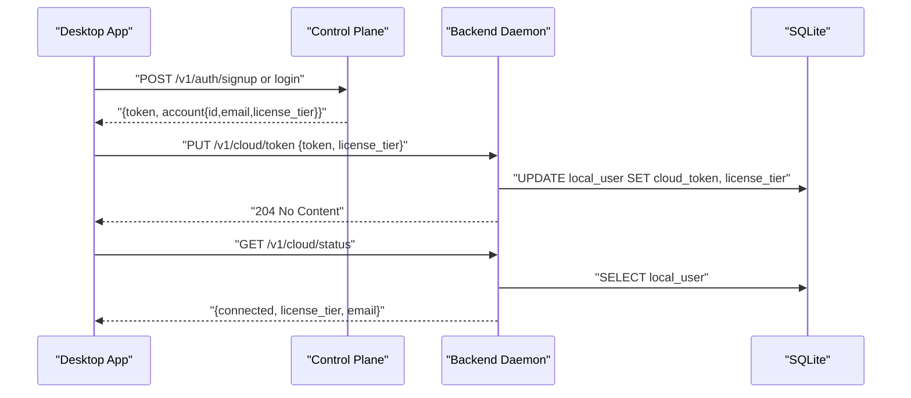
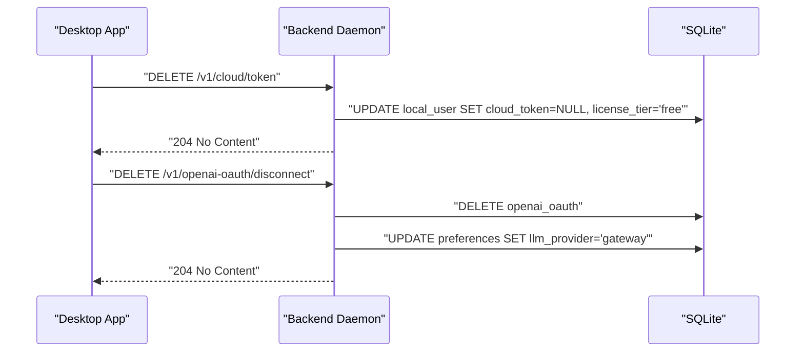
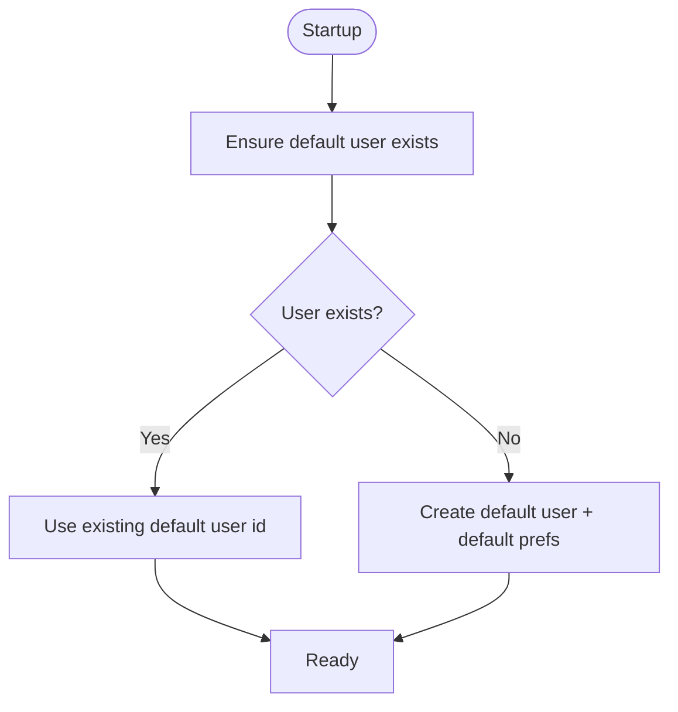
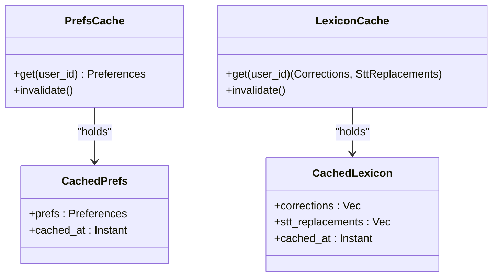
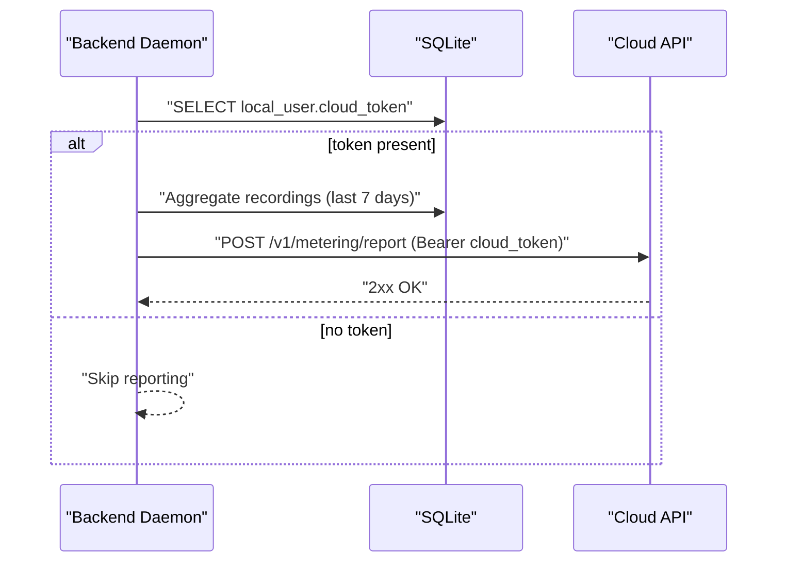
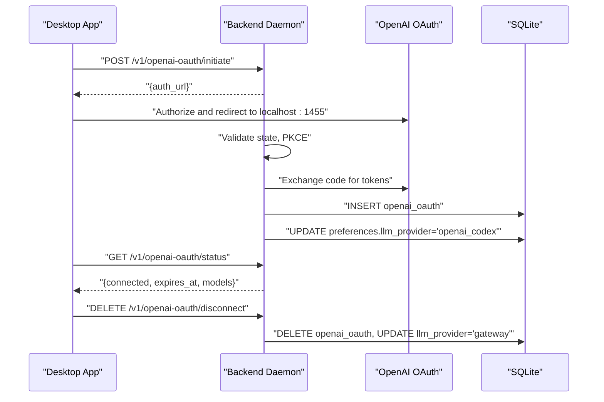
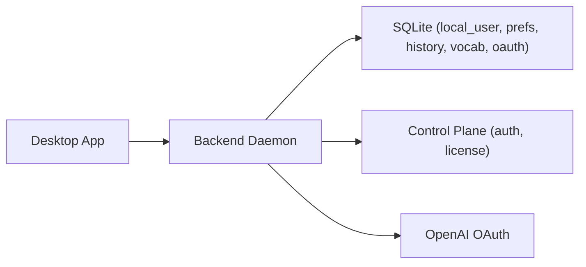

# User Entity

<cite>
**Referenced Files in This Document**
- [users.rs](file://crates/backend/src/store/users.rs)
- [openai_oauth.rs](file://crates/backend/src/store/openai_oauth.rs)
- [openai_oauth_route.rs](file://crates/backend/src/routes/openai_oauth.rs)
- [cloud.rs](file://crates/backend/src/routes/cloud.rs)
- [prefs.rs](file://crates/backend/src/store/prefs.rs)
- [history.rs](file://crates/backend/src/store/history.rs)
- [vocabulary.rs](file://crates/backend/src/store/vocabulary.rs)
- [lib.rs](file://crates/backend/src/lib.rs)
- [main.rs](file://crates/backend/src/main.rs)
- [001_initial.sql](file://crates/backend/src/store/migrations/001_initial.sql)
- [006_openai_oauth.sql](file://crates/backend/src/store/migrations/006_openai_oauth.sql)
- [auth.rs](file://crates/control-plane/src/routes/auth.rs)
- [store.rs](file://crates/control-plane/src/store.rs)
</cite>

## Table of Contents
1. [Introduction](#introduction)
2. [Project Structure](#project-structure)
3. [Core Components](#core-components)
4. [Architecture Overview](#architecture-overview)
5. [Detailed Component Analysis](#detailed-component-analysis)
6. [Dependency Analysis](#dependency-analysis)
7. [Performance Considerations](#performance-considerations)
8. [Troubleshooting Guide](#troubleshooting-guide)
9. [Conclusion](#conclusion)
10. [Appendices](#appendices)

## Introduction
This document describes the User entity and its lifecycle in WISPR Hindi Bridge. It covers the user record structure, license tier management, account creation timestamps, and user profile data. It also documents user account lifecycle operations including registration, authentication integration with OpenAI OAuth, license management, and account deactivation. The relationships between users and their data (recordings, preferences, vocabulary) are explained, along with multi-user support architecture and user data isolation. Examples of user account operations, cloud synchronization features, and user preference inheritance patterns are included. Privacy, security, and compliance considerations are addressed.

## Project Structure
The user domain spans two primary areas:
- Backend local daemon (SQLite): stores user identity, preferences, history, vocabulary, and OpenAI OAuth tokens.
- Control plane (PostgreSQL): manages cloud accounts, sessions, and license tiers.



**Diagram sources**
- [main.rs:56-78](file://crates/backend/src/main.rs#L56-L78)
- [lib.rs:150-199](file://crates/backend/src/lib.rs#L150-L199)
- [users.rs:6-13](file://crates/backend/src/store/users.rs#L6-L13)
- [prefs.rs:6-25](file://crates/backend/src/store/prefs.rs#L6-L25)
- [history.rs:7-26](file://crates/backend/src/store/history.rs#L7-L26)
- [vocabulary.rs:22-29](file://crates/backend/src/store/vocabulary.rs#L22-L29)
- [openai_oauth.rs:7-14](file://crates/backend/src/store/openai_oauth.rs#L7-L14)
- [openai_oauth_route.rs:116-201](file://crates/backend/src/routes/openai_oauth.rs#L116-L201)
- [cloud.rs:20-60](file://crates/backend/src/routes/cloud.rs#L20-L60)
- [store.rs:17-34](file://crates/control-plane/src/store.rs#L17-L34)
- [auth.rs:46-159](file://crates/control-plane/src/routes/auth.rs#L46-L159)

**Section sources**
- [main.rs:56-78](file://crates/backend/src/main.rs#L56-L78)
- [lib.rs:150-199](file://crates/backend/src/lib.rs#L150-L199)

## Core Components
- LocalUser: identity and cloud linkage for the single default user.
- Preferences: per-user settings, API keys, and LLM routing.
- Recordings: user’s speech-to-text polish history.
- Vocabulary: STT bias terms keyed by user.
- OpenAI OAuth: local token storage and provider switching.
- Cloud bridge: store/clear cloud token and license tier locally.
- Control plane auth: cloud account management and license tiers.

**Section sources**
- [users.rs:6-13](file://crates/backend/src/store/users.rs#L6-L13)
- [prefs.rs:6-25](file://crates/backend/src/store/prefs.rs#L6-L25)
- [history.rs:7-26](file://crates/backend/src/store/history.rs#L7-L26)
- [vocabulary.rs:22-29](file://crates/backend/src/store/vocabulary.rs#L22-L29)
- [openai_oauth.rs:7-14](file://crates/backend/src/store/openai_oauth.rs#L7-L14)
- [cloud.rs:20-60](file://crates/backend/src/routes/cloud.rs#L20-L60)
- [auth.rs:46-159](file://crates/control-plane/src/routes/auth.rs#L46-L159)

## Architecture Overview
WISPR Hindi Bridge runs a local backend daemon with a default single user. The desktop app communicates with the daemon via a shared-secret bearer token. Cloud account management and licensing live in the control plane. Users can connect an OpenAI account for enhanced LLM capabilities, and optionally synchronize usage metrics to the cloud.



**Diagram sources**
- [cloud.rs:28-60](file://crates/backend/src/routes/cloud.rs#L28-L60)
- [openai_oauth_route.rs:116-201](file://crates/backend/src/routes/openai_oauth.rs#L116-L201)
- [openai_oauth.rs:36-83](file://crates/backend/src/store/openai_oauth.rs#L36-L83)
- [main.rs:151-233](file://crates/backend/src/main.rs#L151-L233)

## Detailed Component Analysis

### User Record Structure
- Identity: unique id, email, license tier, created_at.
- Cloud linkage: optional cloud_token for cloud synchronization and metering.
- License tier: managed by the control plane; reflected locally for UI and feature gating.

```mermaid
erDiagram
LOCAL_USER {
text id PK
text email
text cloud_token
text license_tier
int created_at
}
PREFERENCES {
text user_id FK
text selected_model
text tone_preset
text custom_prompt
text language
text output_language
boolean auto_paste
boolean edit_capture
text polish_text_hotkey
int updated_at
text gateway_api_key
text deepgram_api_key
text gemini_api_key
text groq_api_key
text llm_provider
}
RECORDINGS {
text id PK
text user_id FK
int timestamp_ms
text transcript
text polished
text final_text
int word_count
float recording_seconds
text model_used
float confidence
int transcribe_ms
int embed_ms
int polish_ms
text target_app
int edit_count
text source
text audio_id
}
VOCABULARY {
text user_id FK
text term
float weight
int use_count
int last_used
text source
}
OPENAI_OAUTH {
text user_id PK FK
text access_token
text refresh_token
int expires_at
int connected_at
}
LOCAL_USER ||--o| PREFERENCES : "1:1"
LOCAL_USER ||--o{ RECORDINGS : "1:N"
LOCAL_USER ||--o{ VOCABULARY : "1:N"
LOCAL_USER ||--o| OPENAI_OAUTH : "1:1"
```

**Diagram sources**
- [001_initial.sql:8-48](file://crates/backend/src/store/migrations/001_initial.sql#L8-L48)
- [006_openai_oauth.sql:4-10](file://crates/backend/src/store/migrations/006_openai_oauth.sql#L4-L10)
- [users.rs:6-13](file://crates/backend/src/store/users.rs#L6-L13)
- [prefs.rs:6-25](file://crates/backend/src/store/prefs.rs#L6-L25)
- [history.rs:7-26](file://crates/backend/src/store/history.rs#L7-L26)
- [vocabulary.rs:22-29](file://crates/backend/src/store/vocabulary.rs#L22-L29)
- [openai_oauth.rs:7-14](file://crates/backend/src/store/openai_oauth.rs#L7-L14)

**Section sources**
- [users.rs:6-13](file://crates/backend/src/store/users.rs#L6-L13)
- [001_initial.sql:8-48](file://crates/backend/src/store/migrations/001_initial.sql#L8-L48)
- [006_openai_oauth.sql:4-10](file://crates/backend/src/store/migrations/006_openai_oauth.sql#L4-L10)

### User Account Lifecycle Operations

#### Registration and Authentication Integration
- Cloud account registration and login occur in the control plane. The backend does not manage cloud accounts directly.
- After login, the desktop app stores a cloud bearer token and license tier locally via the backend’s cloud bridge endpoints.



**Diagram sources**
- [auth.rs:46-159](file://crates/control-plane/src/routes/auth.rs#L46-L159)
- [cloud.rs:28-60](file://crates/backend/src/routes/cloud.rs#L28-L60)
- [users.rs:15-31](file://crates/backend/src/store/users.rs#L15-L31)

**Section sources**
- [auth.rs:46-159](file://crates/control-plane/src/routes/auth.rs#L46-L159)
- [cloud.rs:28-60](file://crates/backend/src/routes/cloud.rs#L28-L60)
- [users.rs:15-31](file://crates/backend/src/store/users.rs#L15-L31)

#### License Management
- License tier originates from the control plane and is mirrored locally.
- The backend enforces feature differences via license tier and preferences (e.g., history retention, model availability).
- The control plane defines feature sets per tier.

**Section sources**
- [auth.rs:233-248](file://crates/control-plane/src/routes/auth.rs#L233-L248)
- [users.rs:6-13](file://crates/backend/src/store/users.rs#L6-L13)

#### Account Deactivation and Token Clearing
- Clearing the cloud token locally removes cloud linkage and resets license tier to “free”.
- Disconnecting OpenAI OAuth removes tokens and reverts LLM provider to the default gateway.



**Diagram sources**
- [cloud.rs:43-46](file://crates/backend/src/routes/cloud.rs#L43-L46)
- [users.rs:24-31](file://crates/backend/src/store/users.rs#L24-L31)
- [openai_oauth_route.rs:195-201](file://crates/backend/src/routes/openai_oauth.rs#L195-L201)
- [openai_oauth.rs:70-83](file://crates/backend/src/store/openai_oauth.rs#L70-L83)

**Section sources**
- [cloud.rs:43-46](file://crates/backend/src/routes/cloud.rs#L43-L46)
- [users.rs:24-31](file://crates/backend/src/store/users.rs#L24-L31)
- [openai_oauth_route.rs:195-201](file://crates/backend/src/routes/openai_oauth.rs#L195-L201)
- [openai_oauth.rs:70-83](file://crates/backend/src/store/openai_oauth.rs#L70-L83)

### Multi-User Support and Data Isolation
- Single default user is created automatically at first run and identified by a fixed default user id.
- All local tables reference the default user id, ensuring strict per-user isolation.
- There is no multi-user branching in the backend; all data belongs to the default user.



**Diagram sources**
- [main.rs:58-78](file://crates/backend/src/main.rs#L58-L78)
- [store_mod.rs:182-215](file://crates/backend/src/store/mod.rs#L182-L215)

**Section sources**
- [main.rs:58-78](file://crates/backend/src/main.rs#L58-L78)
- [store_mod.rs:182-215](file://crates/backend/src/store/mod.rs#L182-L215)

### User Data Relationships and Inheritance Patterns
- Preferences are cached in memory to avoid frequent SQLite reads and are invalidated on updates.
- Lexicon cache combines corrections and STT replacements to reduce synchronous reads.
- Vocabulary terms influence STT behavior and are user-scoped.



**Diagram sources**
- [lib.rs:31-69](file://crates/backend/src/lib.rs#L31-L69)
- [lib.rs:79-131](file://crates/backend/src/lib.rs#L79-L131)

**Section sources**
- [lib.rs:31-69](file://crates/backend/src/lib.rs#L31-L69)
- [lib.rs:79-131](file://crates/backend/src/lib.rs#L79-L131)

### Cloud Synchronization and Metering
- The backend can send daily usage metrics to the cloud when a cloud token is present.
- The cloud token and license tier are stored locally for UI and feature decisions.



**Diagram sources**
- [main.rs:151-233](file://crates/backend/src/main.rs#L151-L233)
- [users.rs:33-50](file://crates/backend/src/store/users.rs#L33-L50)

**Section sources**
- [main.rs:151-233](file://crates/backend/src/main.rs#L151-L233)
- [users.rs:33-50](file://crates/backend/src/store/users.rs#L33-L50)

### OpenAI OAuth Integration
- The backend initiates OAuth with PKCE, validates state, exchanges code for tokens, and persists them locally.
- On successful connection, the LLM provider preference switches to OpenAI Codex; disconnecting reverts to the default gateway.



**Diagram sources**
- [openai_oauth_route.rs:116-201](file://crates/backend/src/routes/openai_oauth.rs#L116-L201)
- [openai_oauth_route.rs:205-308](file://crates/backend/src/routes/openai_oauth.rs#L205-L308)
- [openai_oauth.rs:36-83](file://crates/backend/src/store/openai_oauth.rs#L36-L83)

**Section sources**
- [openai_oauth_route.rs:116-201](file://crates/backend/src/routes/openai_oauth.rs#L116-L201)
- [openai_oauth_route.rs:205-308](file://crates/backend/src/routes/openai_oauth.rs#L205-L308)
- [openai_oauth.rs:36-83](file://crates/backend/src/store/openai_oauth.rs#L36-L83)

## Dependency Analysis
- Backend depends on SQLite for local persistence and on the control plane for cloud account management.
- The desktop app acts as the orchestrator for user actions against the backend and control plane.
- The backend maintains internal caches for preferences and lexicon to optimize performance.



**Diagram sources**
- [lib.rs:150-199](file://crates/backend/src/lib.rs#L150-L199)
- [main.rs:56-78](file://crates/backend/src/main.rs#L56-L78)
- [auth.rs:46-159](file://crates/control-plane/src/routes/auth.rs#L46-L159)

**Section sources**
- [lib.rs:150-199](file://crates/backend/src/lib.rs#L150-L199)
- [main.rs:56-78](file://crates/backend/src/main.rs#L56-L78)
- [auth.rs:46-159](file://crates/control-plane/src/routes/auth.rs#L46-L159)

## Performance Considerations
- Preference and lexicon caching reduces SQLite overhead for frequently accessed data.
- Background tasks handle periodic cleanup and metering to keep the daemon responsive.
- API keys and tokens are stored locally and never leave the device.

[No sources needed since this section provides general guidance]

## Troubleshooting Guide
- Unauthorized access: ensure the desktop app sends the shared-secret bearer token with every request.
- OAuth failures: verify PKCE state matches, network connectivity to OpenAI, and that the callback server binds successfully.
- Cloud token issues: confirm the token is stored locally and not expired; check metering reports for errors.
- Data isolation: confirm all tables reference the default user id and that no cross-user queries are attempted.

**Section sources**
- [auth/mod.rs:19-37](file://crates/backend/src/auth/mod.rs#L19-L37)
- [openai_oauth_route.rs:261-276](file://crates/backend/src/routes/openai_oauth.rs#L261-L276)
- [main.rs:151-233](file://crates/backend/src/main.rs#L151-L233)

## Conclusion
The User entity in WISPR Hindi Bridge centers on a single default user with robust local persistence and controlled cloud integration. Identity, preferences, history, vocabulary, and OAuth tokens are tightly scoped to the default user, ensuring strong data isolation. The control plane manages cloud accounts and licenses, while the backend provides secure, cached access to user data and integrates with OpenAI OAuth and cloud metering.

[No sources needed since this section summarizes without analyzing specific files]

## Appendices

### User Data Privacy, Security, and Compliance
- Tokens and API keys are stored locally and never leave the device.
- Metering reports are sent only when a cloud token is present and are protected by bearer authentication.
- OAuth uses PKCE and state validation to mitigate interception risks.
- License tiers and feature gating are enforced locally based on the stored license tier.

**Section sources**
- [openai_oauth_route.rs:30-48](file://crates/backend/src/routes/openai_oauth.rs#L30-L48)
- [openai_oauth.rs:36-83](file://crates/backend/src/store/openai_oauth.rs#L36-L83)
- [main.rs:151-233](file://crates/backend/src/main.rs#L151-L233)