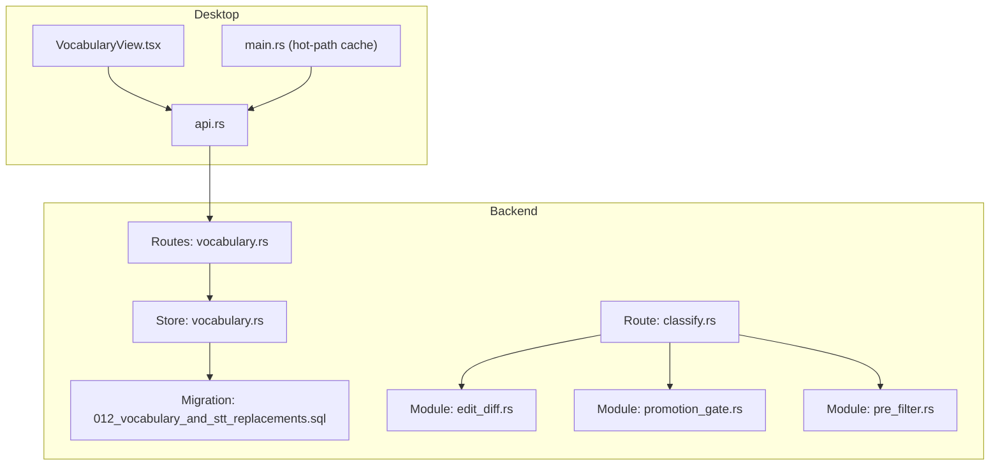
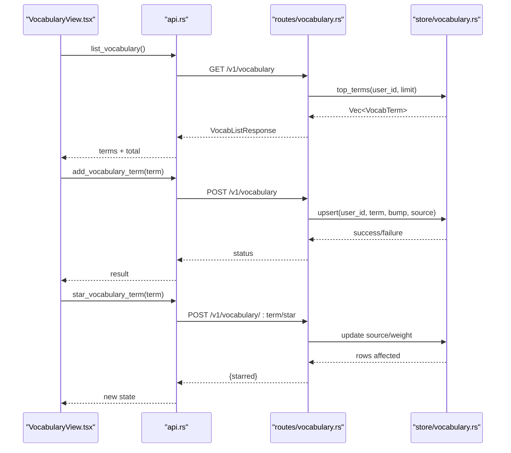
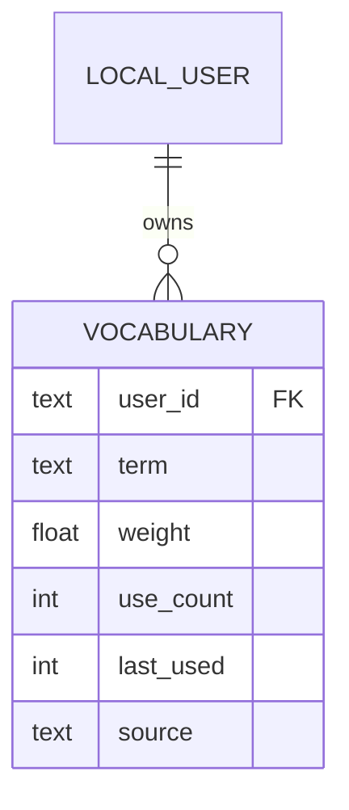
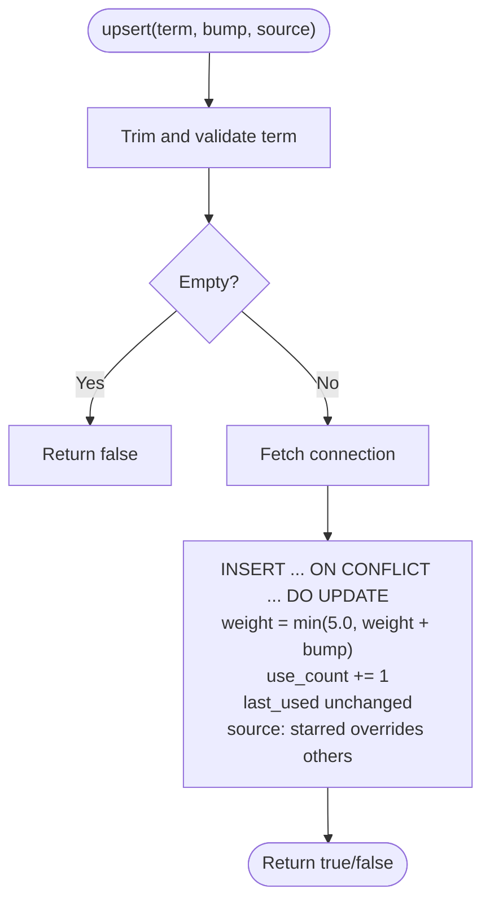
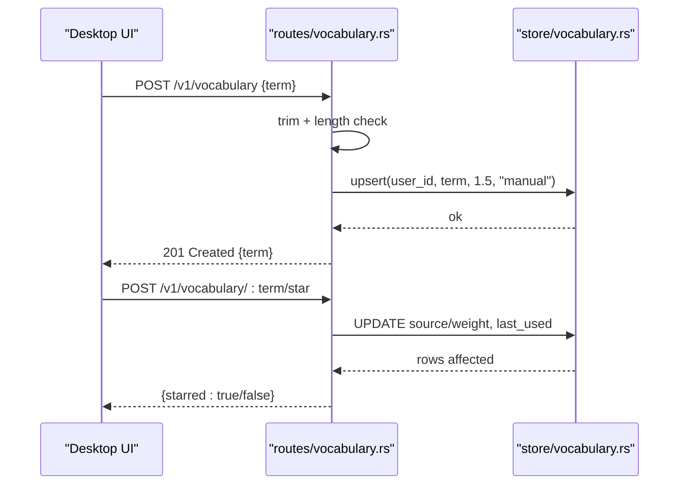
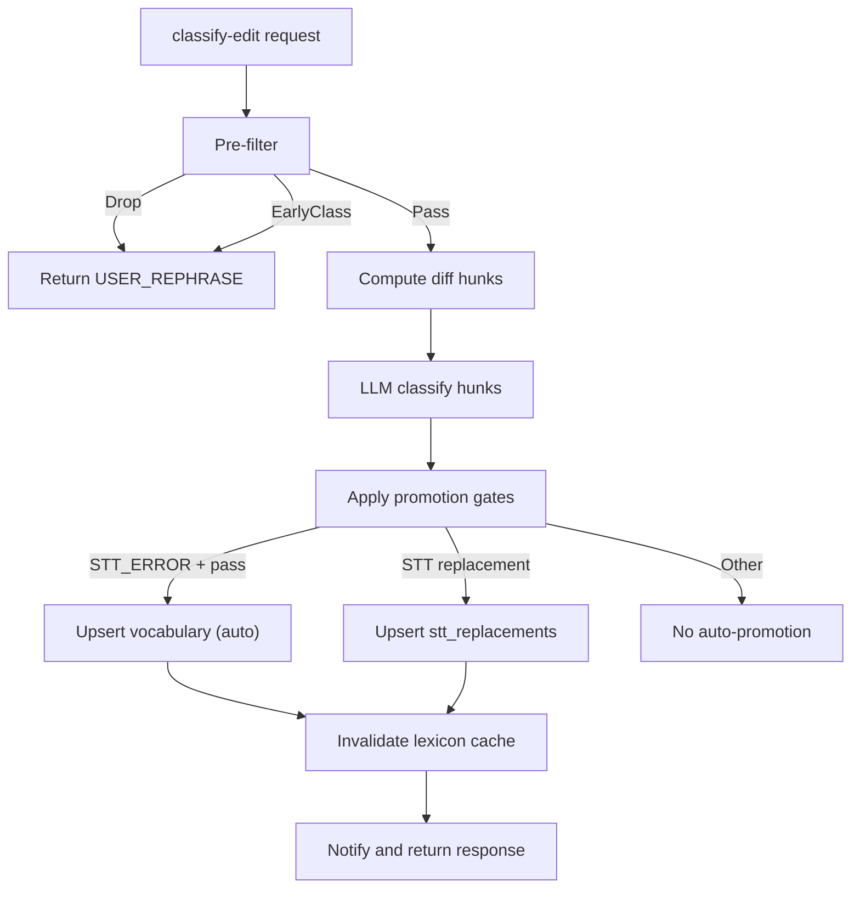
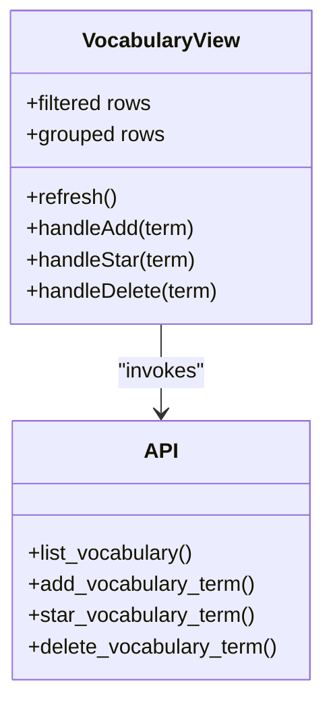
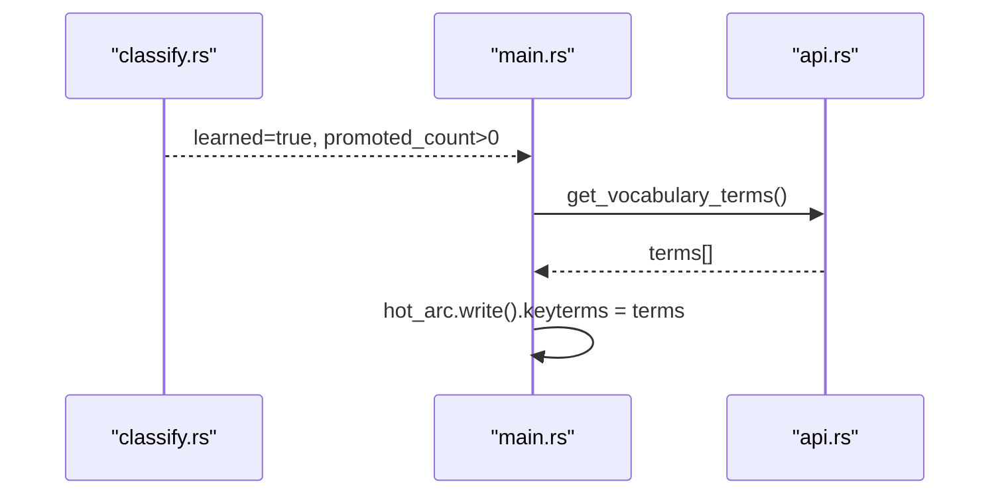
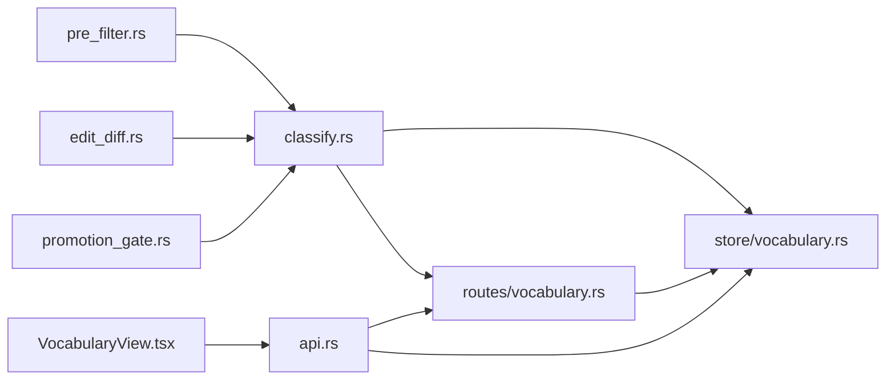

# Vocabulary Entity

<cite>
**Referenced Files in This Document**
- [vocabulary.rs](file://crates/backend/src/store/vocabulary.rs)
- [vocabulary.rs](file://crates/backend/src/routes/vocabulary.rs)
- [012_vocabulary_and_stt_replacements.sql](file://crates/backend/src/store/migrations/012_vocabulary_and_stt_replacements.sql)
- [classify.rs](file://crates/backend/src/routes/classify.rs)
- [edit_diff.rs](file://crates/backend/src/llm/edit_diff.rs)
- [promotion_gate.rs](file://crates/backend/src/llm/promotion_gate.rs)
- [pre_filter.rs](file://crates/backend/src/llm/pre_filter.rs)
- [api.rs](file://desktop/src-tauri/src/api.rs)
- [VocabularyView.tsx](file://desktop/src/components/views/VocabularyView.tsx)
- [main.rs](file://desktop/src-tauri/src/main.rs)
</cite>

## Table of Contents
1. [Introduction](#introduction)
2. [Project Structure](#project-structure)
3. [Core Components](#core-components)
4. [Architecture Overview](#architecture-overview)
5. [Detailed Component Analysis](#detailed-component-analysis)
6. [Dependency Analysis](#dependency-analysis)
7. [Performance Considerations](#performance-considerations)
8. [Troubleshooting Guide](#troubleshooting-guide)
9. [Conclusion](#conclusion)
10. [Appendices](#appendices)

## Introduction
This document describes the VocabularyTerm entity and vocabulary management in WISPR Hindi Bridge. It focuses on how vocabulary is modeled, stored, and manipulated; how learning progress is tracked; how the system integrates with AI-powered classification and promotion; and how vocabulary syncs with the broader learning pipeline. It also documents the user-facing vocabulary management UI and how vocabulary terms influence STT behavior.

## Project Structure
The vocabulary system spans backend storage and routes, frontend UI, and the AI classification pipeline:
- Backend storage: SQLite-backed vocabulary table with upsert, demotion, and retrieval helpers.
- Backend routes: HTTP endpoints to list, add, delete, and star vocabulary terms.
- Frontend UI: A dedicated vocabulary view for filtering, grouping, and managing terms.
- AI pipeline: Classification, diff, and promotion gates that decide whether to promote terms into vocabulary.
- Hot-path caching: Vocabulary terms are fetched quickly for STT keyterms.

**Diagram sources**
- [vocabulary.rs:1-151](file://crates/backend/src/routes/vocabulary.rs#L1-L151)
- [vocabulary.rs:1-248](file://crates/backend/src/store/vocabulary.rs#L1-L248)
- [012_vocabulary_and_stt_replacements.sql:22-31](file://crates/backend/src/store/migrations/012_vocabulary_and_stt_replacements.sql#L22-L31)
- [classify.rs:1-423](file://crates/backend/src/routes/classify.rs#L1-L423)
- [edit_diff.rs:1-246](file://crates/backend/src/llm/edit_diff.rs#L1-L246)
- [promotion_gate.rs:1-307](file://crates/backend/src/llm/promotion_gate.rs#L1-L307)
- [pre_filter.rs:1-34](file://crates/backend/src/llm/pre_filter.rs#L1-L34)
- [api.rs:747-844](file://desktop/src-tauri/src/api.rs#L747-L844)
- [VocabularyView.tsx:1-415](file://desktop/src/components/views/VocabularyView.tsx#L1-L415)
- [main.rs:1880-1898](file://desktop/src-tauri/src/main.rs#L1880-L1898)

**Section sources**
- [vocabulary.rs:1-248](file://crates/backend/src/store/vocabulary.rs#L1-L248)
- [vocabulary.rs:1-151](file://crates/backend/src/routes/vocabulary.rs#L1-L151)
- [012_vocabulary_and_stt_replacements.sql:1-55](file://crates/backend/src/store/migrations/012_vocabulary_and_stt_replacements.sql#L1-L55)
- [classify.rs:1-423](file://crates/backend/src/routes/classify.rs#L1-L423)
- [edit_diff.rs:1-246](file://crates/backend/src/llm/edit_diff.rs#L1-L246)
- [promotion_gate.rs:1-307](file://crates/backend/src/llm/promotion_gate.rs#L1-L307)
- [pre_filter.rs:1-34](file://crates/backend/src/llm/pre_filter.rs#L1-L34)
- [api.rs:747-844](file://desktop/src-tauri/src/api.rs#L747-L844)
- [VocabularyView.tsx:1-415](file://desktop/src/components/views/VocabularyView.tsx#L1-L415)
- [main.rs:1880-1898](file://desktop/src-tauri/src/main.rs#L1880-L1898)

## Core Components
- VocabularyTerm (backend store): Represents a single vocabulary entry with term text, weight, use_count, last_used timestamp, and source.
- Vocabulary store functions: Upsert (insert or strengthen), demote (reduce weight and optionally remove), top terms retrieval, and counts.
- Vocabulary routes: List terms (lightweight), list full vocabulary (with metadata), create (manual add), delete, and toggle star.
- Migration schema: Defines the vocabulary table, indexes, and columns.
- AI classification integration: Classification pipeline uses diff and promotion gates to decide whether to promote terms into vocabulary.
- Frontend vocabulary view: Filters, groups, and manages terms; triggers backend operations via API.

**Section sources**
- [vocabulary.rs:22-154](file://crates/backend/src/store/vocabulary.rs#L22-L154)
- [vocabulary.rs:20-151](file://crates/backend/src/routes/vocabulary.rs#L20-L151)
- [012_vocabulary_and_stt_replacements.sql:22-31](file://crates/backend/src/store/migrations/012_vocabulary_and_stt_replacements.sql#L22-L31)
- [classify.rs:85-291](file://crates/backend/src/routes/classify.rs#L85-L291)
- [VocabularyView.tsx:251-415](file://desktop/src/components/views/VocabularyView.tsx#L251-L415)

## Architecture Overview
The vocabulary system is layered:
- Data model: SQLite table with user-scoped terms and metadata.
- Store layer: Helper functions encapsulate SQL operations.
- Route layer: HTTP endpoints expose vocabulary operations.
- Pipeline integration: Classification and promotion gates conditionally write vocabulary entries.
- Frontend: UI for viewing, filtering, adding, starring, and deleting terms.
- Hot-path caching: Vocabulary terms are fetched quickly for STT keyterms.

**Diagram sources**
- [VocabularyView.tsx:260-287](file://desktop/src/components/views/VocabularyView.tsx#L260-L287)
- [api.rs:780-844](file://desktop/src-tauri/src/api.rs#L780-L844)
- [vocabulary.rs:40-151](file://crates/backend/src/routes/vocabulary.rs#L40-L151)
- [vocabulary.rs:33-103](file://crates/backend/src/store/vocabulary.rs#L33-L103)

## Detailed Component Analysis

### Vocabulary Data Model and Schema
- Table: vocabulary
  - Columns: user_id, term, weight, use_count, last_used, source
  - Indexes: user + weight descending for efficient retrieval
- VocabTerm struct: term, weight, use_count, last_used, source
- Upsert semantics: insert new term or strengthen existing term; cap weight; preserve starred source
- Demotion: reduce weight; remove if weight falls to zero (except starred)
- Retrieval: top-N by weight and recency; convenience method returns term strings for STT keyterms
- Count: total entries per user

**Diagram sources**
- [012_vocabulary_and_stt_replacements.sql:22-31](file://crates/backend/src/store/migrations/012_vocabulary_and_stt_replacements.sql#L22-L31)

**Section sources**
- [012_vocabulary_and_stt_replacements.sql:22-31](file://crates/backend/src/store/migrations/012_vocabulary_and_stt_replacements.sql#L22-L31)
- [vocabulary.rs:22-154](file://crates/backend/src/store/vocabulary.rs#L22-L154)

### Backend Store Functions
- upsert(pool, user_id, term, bump, source): Insert or strengthen; caps weight at 5.0; preserves starred source; increments use_count; sets last_used
- demote(pool, user_id, term, penalty): Decrease weight; delete if weight ≤ 0 and not starred
- top_terms(pool, user_id, limit): Ordered by weight desc, then last_used desc
- top_term_strings(pool, user_id, limit): Convenience returning term strings
- count(pool, user_id): Total entries for UI badge

**Diagram sources**
- [vocabulary.rs:33-72](file://crates/backend/src/store/vocabulary.rs#L33-L72)

**Section sources**
- [vocabulary.rs:33-154](file://crates/backend/src/store/vocabulary.rs#L33-L154)

### HTTP Routes for Vocabulary Management
- GET /v1/vocabulary/terms: Lightweight endpoint returning top term strings (used as STT keyterms)
- GET /v1/vocabulary: Full list with metadata and total count
- POST /v1/vocabulary: Manual add; validates term length and trims; inserts/upserts with source "manual" and weight bump
- DELETE /v1/vocabulary/:term: Hard delete by term
- POST /v1/vocabulary/:term/star: Toggle starred; starred terms become immune to demotion

**Diagram sources**
- [vocabulary.rs:27-151](file://crates/backend/src/routes/vocabulary.rs#L27-L151)
- [vocabulary.rs:33-103](file://crates/backend/src/store/vocabulary.rs#L33-L103)

**Section sources**
- [vocabulary.rs:20-151](file://crates/backend/src/routes/vocabulary.rs#L20-L151)

### AI-Powered Learning and Promotion
- Classification pipeline:
  - Pre-filter: Drops no-ops and user rewrites; short-circuits when possible
  - Diff: Structural hunks derived from transcript vs polish vs kept
  - Classify: LLM labels each hunk and overall edit class
  - Promotion gates: Validates candidates before writing to vocabulary or replacements
- Negative-signal demotion: After classification, terms that appear in polish but not kept are demoted
- Auto-promotion: STT_ERROR with strong signals leads to vocabulary upsert; STT replacements may be written too

**Diagram sources**
- [classify.rs:85-291](file://crates/backend/src/routes/classify.rs#L85-L291)
- [edit_diff.rs:44-153](file://crates/backend/src/llm/edit_diff.rs#L44-L153)
- [promotion_gate.rs:23-156](file://crates/backend/src/llm/promotion_gate.rs#L23-L156)

**Section sources**
- [classify.rs:1-423](file://crates/backend/src/routes/classify.rs#L1-L423)
- [edit_diff.rs:1-246](file://crates/backend/src/llm/edit_diff.rs#L1-L246)
- [promotion_gate.rs:1-307](file://crates/backend/src/llm/promotion_gate.rs#L1-L307)
- [pre_filter.rs:1-34](file://crates/backend/src/llm/pre_filter.rs#L1-L34)

### Frontend Vocabulary Management UI
- Filtering: Case-insensitive substring filter on term
- Grouping: Starred first, then learned (auto/manual) ordered by weight desc
- Actions: Add (max 64 chars), star/unstar, delete
- Integration: Uses API wrappers to list, add, star, and delete; subscribes to vocabulary-changed events; requests notification permissions

**Diagram sources**
- [VocabularyView.tsx:251-415](file://desktop/src/components/views/VocabularyView.tsx#L251-L415)
- [api.rs:780-844](file://desktop/src-tauri/src/api.rs#L780-L844)

**Section sources**
- [VocabularyView.tsx:1-415](file://desktop/src/components/views/VocabularyView.tsx#L1-L415)
- [api.rs:747-844](file://desktop/src-tauri/src/api.rs#L747-L844)

### Hot-Path Caching for STT Keyterms
- After successful learning, the desktop refreshes the hot-path cache by fetching top vocabulary terms and updating the in-memory keyterms list for immediate use in the next recording.

**Diagram sources**
- [classify.rs:188-248](file://crates/backend/src/routes/classify.rs#L188-L248)
- [main.rs:1884-1898](file://desktop/src-tauri/src/main.rs#L1884-L1898)
- [api.rs:747-760](file://desktop/src-tauri/src/api.rs#L747-L760)

**Section sources**
- [main.rs:1880-1898](file://desktop/src-tauri/src/main.rs#L1880-L1898)
- [api.rs:747-760](file://desktop/src-tauri/src/api.rs#L747-L760)

## Dependency Analysis
- Backend store depends on SQLite and exposes typed helpers for vocabulary operations.
- Routes depend on store functions and serialize responses.
- Classification route orchestrates pre-filter, diff, classification, and promotion gates; writes vocabulary and replacements when appropriate.
- Frontend depends on API wrappers for vocabulary operations and reacts to backend-emitted events.

**Diagram sources**
- [classify.rs:34-44](file://crates/backend/src/routes/classify.rs#L34-L44)
- [edit_diff.rs:26-40](file://crates/backend/src/llm/edit_diff.rs#L26-L40)
- [promotion_gate.rs:23-40](file://crates/backend/src/llm/promotion_gate.rs#L23-L40)
- [vocabulary.rs:18-18](file://crates/backend/src/routes/vocabulary.rs#L18-L18)
- [vocabulary.rs:16-20](file://crates/backend/src/store/vocabulary.rs#L16-L20)
- [VocabularyView.tsx:13-21](file://desktop/src/components/views/VocabularyView.tsx#L13-L21)
- [api.rs:780-844](file://desktop/src-tauri/src/api.rs#L780-L844)

**Section sources**
- [classify.rs:1-423](file://crates/backend/src/routes/classify.rs#L1-L423)
- [vocabulary.rs:1-151](file://crates/backend/src/routes/vocabulary.rs#L1-L151)
- [vocabulary.rs:1-248](file://crates/backend/src/store/vocabulary.rs#L1-L248)
- [VocabularyView.tsx:1-415](file://desktop/src/components/views/VocabularyView.tsx#L1-L415)
- [api.rs:747-844](file://desktop/src-tauri/src/api.rs#L747-L844)

## Performance Considerations
- Weight capping: Ensures vocabulary does not grow unbounded and maintains a manageable hot set for STT.
- Indexing: User + weight descending index supports efficient top-N retrieval.
- Hot-path caching: Frequent reads of top terms are served quickly to avoid repeated DB queries.
- Batch-like updates: Classification writes vocabulary and replacements in a single pass per edit.

[No sources needed since this section provides general guidance]

## Troubleshooting Guide
Common issues and diagnostics:
- Upsert fails: Check for empty or overly long terms; verify database connectivity; inspect returned status codes.
- Demotion removes term unexpectedly: Verify penalty amount and that term is not starred; starred terms are preserved.
- Star toggle has no effect: Confirm term exists; starred toggles source and weight; unstar reverts to manual.
- No vocabulary shown: Ensure user_id is correct; verify hot-path cache is refreshed after learning.

**Section sources**
- [vocabulary.rs:56-104](file://crates/backend/src/routes/vocabulary.rs#L56-L104)
- [vocabulary.rs:76-103](file://crates/backend/src/store/vocabulary.rs#L76-L103)
- [main.rs:1884-1898](file://desktop/src-tauri/src/main.rs#L1884-L1898)

## Conclusion
The vocabulary system in WISPR Hindi Bridge is a robust, layered mechanism that blends user-driven curation with AI-powered learning. It models vocabulary as a weighted, user-scoped dataset, enforces quality gates before promotion, and integrates tightly with the STT pipeline via a hot-path cache. The frontend provides a practical interface for managing vocabulary, while the backend ensures correctness, performance, and extensibility.

[No sources needed since this section summarizes without analyzing specific files]

## Appendices

### API Definitions: Vocabulary Endpoints
- GET /v1/vocabulary/terms
  - Purpose: Retrieve top vocabulary term strings for STT keyterms
  - Response: TermsResponse { terms: string[] }
- GET /v1/vocabulary
  - Purpose: Retrieve full vocabulary list with metadata and total count
  - Response: VocabListResponse { terms: VocabTerm[], total: number }
- POST /v1/vocabulary
  - Purpose: Manually add a term
  - Request: { term: string }
  - Response: 201 Created with term or error
- DELETE /v1/vocabulary/:term
  - Purpose: Hard delete a term
  - Response: 204 No Content or 404 Not Found
- POST /v1/vocabulary/:term/star
  - Purpose: Toggle starred status
  - Response: { starred: boolean }

**Section sources**
- [vocabulary.rs:20-151](file://crates/backend/src/routes/vocabulary.rs#L20-L151)

### Data Model: VocabTerm Fields
- term: string — the correctly spelled term to bias toward
- weight: number — strength; decays over time
- use_count: integer — number of times the term was involved in promotions/upserts
- last_used: integer — timestamp of last activity
- source: string — "auto" | "manual" | "starred"

**Section sources**
- [vocabulary.rs:22-29](file://crates/backend/src/store/vocabulary.rs#L22-L29)
- [012_vocabulary_and_stt_replacements.sql:22-31](file://crates/backend/src/store/migrations/012_vocabulary_and_stt_replacements.sql#L22-L31)

### Typical Workflows
- Manual add: User types a term in the UI → Desktop calls POST /v1/vocabulary → Backend upserts with source "manual" and weight bump → UI refreshes list.
- Star a term: User clicks star → Desktop calls POST /v1/vocabulary/:term/star → Backend updates source/weight → UI reflects new grouping and badges.
- Learning-based promotion: Classification detects STT_ERROR with strong signal → Backend upserts term with source "auto" → Desktop refreshes hot-path cache → STT uses new keyterms.

**Section sources**
- [VocabularyView.tsx:274-287](file://desktop/src/components/views/VocabularyView.tsx#L274-L287)
- [api.rs:794-844](file://desktop/src-tauri/src/api.rs#L794-L844)
- [classify.rs:194-218](file://crates/backend/src/routes/classify.rs#L194-L218)
- [main.rs:1884-1898](file://desktop/src-tauri/src/main.rs#L1884-L1898)

### Batch Operations and External Systems
- Import/export: Not implemented in the referenced code; vocabulary is primarily managed via manual add and AI-driven promotion. No explicit CSV or bulk APIs are present in the reviewed files.
- Sync with external systems: Not indicated in the reviewed code; vocabulary remains scoped to the local user and is synchronized via the hot-path cache refresh after learning.

[No sources needed since this section provides general guidance]