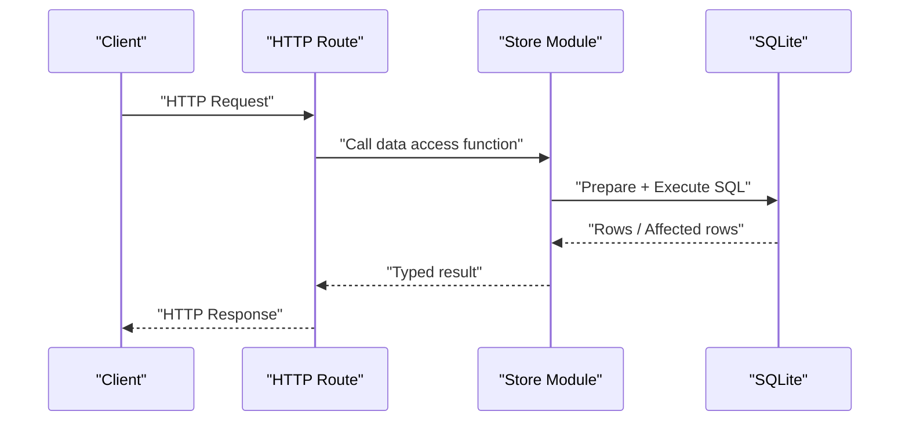
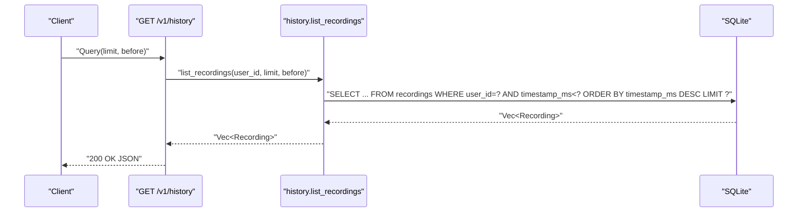
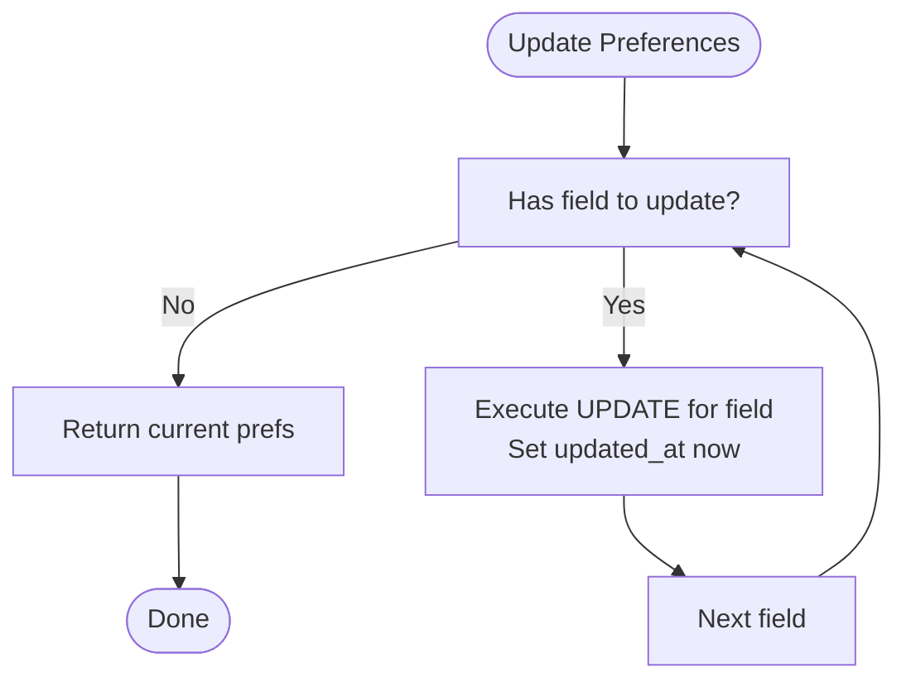
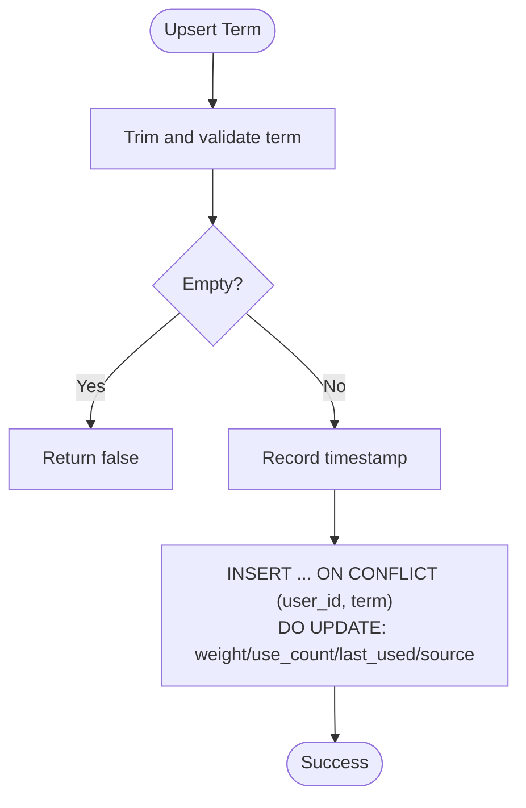
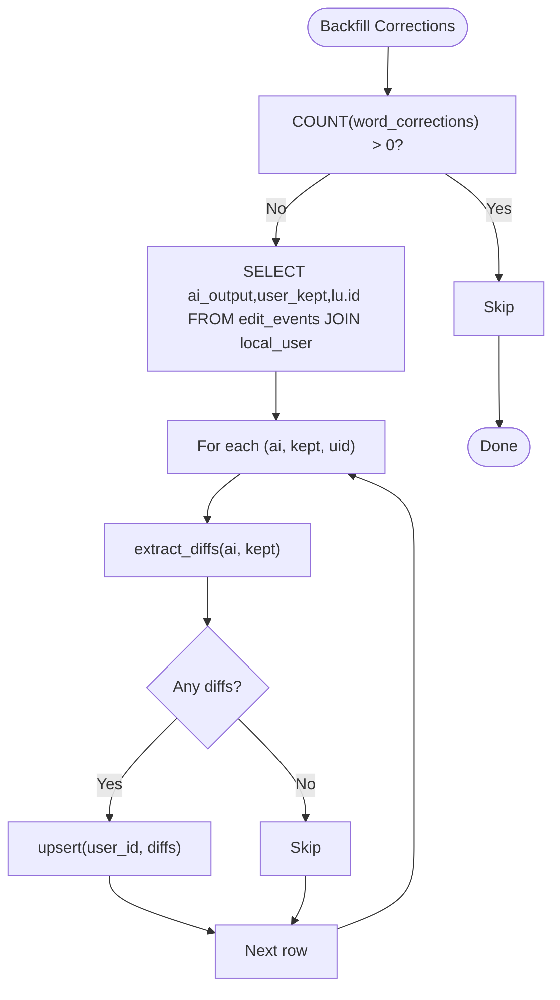
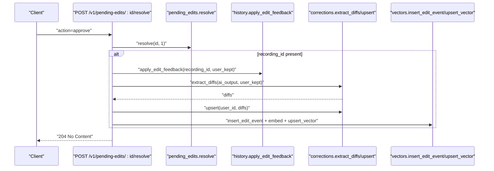
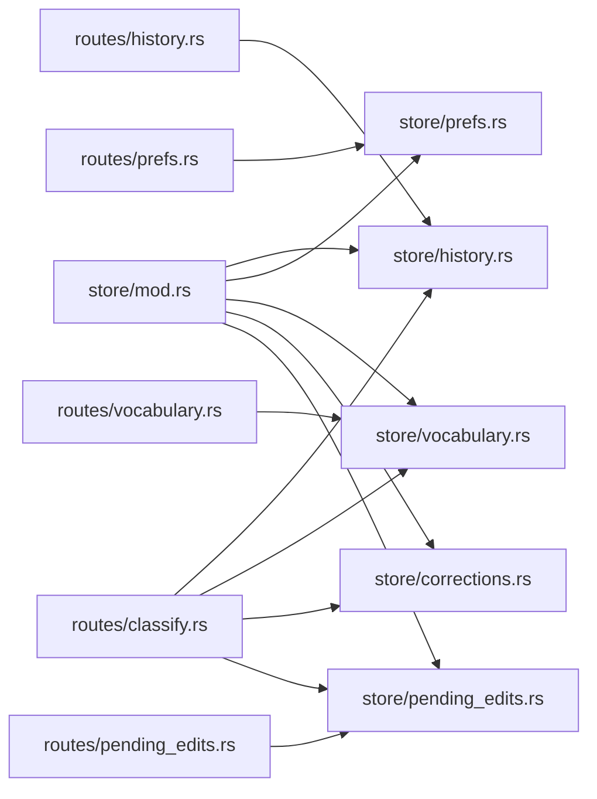

# Data Access and Query Patterns

<cite>
**Referenced Files in This Document**
- [mod.rs](file://crates/backend/src/store/mod.rs)
- [history.rs](file://crates/backend/src/store/history.rs)
- [prefs.rs](file://crates/backend/src/store/prefs.rs)
- [vocabulary.rs](file://crates/backend/src/store/vocabulary.rs)
- [corrections.rs](file://crates/backend/src/store/corrections.rs)
- [pending_edits.rs](file://crates/backend/src/store/pending_edits.rs)
- [001_initial.sql](file://crates/backend/src/store/migrations/001_initial.sql)
- [002_vectors.sql](file://crates/backend/src/store/migrations/002_vectors.sql)
- [007_pending_edits.sql](file://crates/backend/src/store/migrations/007_pending_edits.sql)
- [009_word_corrections.sql](file://crates/backend/src/store/migrations/009_word_corrections.sql)
- [012_vocabulary_and_stt_replacements.sql](file://crates/backend/src/store/migrations/012_vocabulary_and_stt_replacements.sql)
- [history.rs](file://crates/backend/src/routes/history.rs)
- [prefs.rs](file://crates/backend/src/routes/prefs.rs)
- [vocabulary.rs](file://crates/backend/src/routes/vocabulary.rs)
- [pending_edits.rs](file://crates/backend/src/routes/pending_edits.rs)
- [classify.rs](file://crates/backend/src/routes/classify.rs)
</cite>

## Table of Contents
1. [Introduction](#introduction)
2. [Project Structure](#project-structure)
3. [Core Components](#core-components)
4. [Architecture Overview](#architecture-overview)
5. [Detailed Component Analysis](#detailed-component-analysis)
6. [Dependency Analysis](#dependency-analysis)
7. [Performance Considerations](#performance-considerations)
8. [Troubleshooting Guide](#troubleshooting-guide)
9. [Conclusion](#conclusion)

## Introduction
This document describes data access patterns and query optimization for WISPR Hindi Bridge. It focuses on:
- Recording history retrieval with date-range filtering, confidence thresholds, and processing status
- Vocabulary search operations for term matching, example sentence retrieval, and learning progress aggregation
- Preference management queries for user configuration updates, validation rules, and default value handling
- Corrections system for tracking user edits and AI suggestions with overlap detection algorithms
- Pending edits functionality for capturing user modifications and AI recommendations
- Query performance optimization techniques, data consistency patterns, transaction management, error handling, and examples of complex queries

## Project Structure
The backend uses a SQLite-based local store with a connection pool and explicit migrations. Data access is encapsulated in dedicated modules under store/, with HTTP routes delegating to these modules.

```mermaid
graph TB
subgraph "Routes"
RH["routes/history.rs"]
RP["routes/prefs.rs"]
RV["routes/vocabulary.rs"]
RPE["routes/pending_edits.rs"]
RCL["routes/classify.rs"]
end
subgraph "Store"
SMOD["store/mod.rs"]
SH["store/history.rs"]
SP["store/prefs.rs"]
SV["store/vocabulary.rs"]
SC["store/corrections.rs"]
SPE["store/pending_edits.rs"]
end
subgraph "Migrations"
M001["001_initial.sql"]
M002["002_vectors.sql"]
M007["007_pending_edits.sql"]
M009["009_word_corrections.sql"]
M012["012_vocabulary_and_stt_replacements.sql"]
end
RH --> SH
RP --> SP
RV --> SV
RPE --> SPE
RCL --> SC
RCL --> SH
RCL --> SV
RCL --> SPE
SMOD --> SH
SMOD --> SP
SMOD --> SV
SMOD --> SC
SMOD --> SPE
SMOD -.-> M001
SMOD -.-> M002
SMOD -.-> M007
SMOD -.-> M009
SMOD -.-> M012
```

**Diagram sources**
- [history.rs:1-80](file://crates/backend/src/routes/history.rs#L1-L80)
- [prefs.rs:1-57](file://crates/backend/src/routes/prefs.rs#L1-L57)
- [vocabulary.rs:1-151](file://crates/backend/src/routes/vocabulary.rs#L1-L151)
- [pending_edits.rs:1-142](file://crates/backend/src/routes/pending_edits.rs#L1-L142)
- [classify.rs:1-423](file://crates/backend/src/routes/classify.rs#L1-L423)
- [mod.rs:1-284](file://crates/backend/src/store/mod.rs#L1-L284)
- [001_initial.sql:1-70](file://crates/backend/src/store/migrations/001_initial.sql#L1-L70)
- [002_vectors.sql:1-14](file://crates/backend/src/store/migrations/002_vectors.sql#L1-L14)
- [007_pending_edits.sql:1-13](file://crates/backend/src/store/migrations/007_pending_edits.sql#L1-L13)
- [009_word_corrections.sql:1-11](file://crates/backend/src/store/migrations/009_word_corrections.sql#L1-L11)
- [012_vocabulary_and_stt_replacements.sql:1-55](file://crates/backend/src/store/migrations/012_vocabulary_and_stt_replacements.sql#L1-L55)

**Section sources**
- [mod.rs:1-284](file://crates/backend/src/store/mod.rs#L1-L284)
- [001_initial.sql:1-70](file://crates/backend/src/store/migrations/001_initial.sql#L1-L70)
- [002_vectors.sql:1-14](file://crates/backend/src/store/migrations/002_vectors.sql#L1-L14)
- [007_pending_edits.sql:1-13](file://crates/backend/src/store/migrations/007_pending_edits.sql#L1-L13)
- [009_word_corrections.sql:1-11](file://crates/backend/src/store/migrations/009_word_corrections.sql#L1-L11)
- [012_vocabulary_and_stt_replacements.sql:1-55](file://crates/backend/src/store/migrations/012_vocabulary_and_stt_replacements.sql#L1-L55)

## Core Components
- Connection pool and initialization: SQLite with WAL mode, foreign keys enabled, busy timeout, and a fixed-size pool. Migrations are applied on open, and garbage edits are purged at startup.
- Recording history: CRUD plus list with pagination and optional before timestamp filter.
- Preferences: Get and partial update with default values and API key handling.
- Vocabulary: Upsert, demotion, top-N retrieval, counts, and star toggling.
- Corrections: Diff extraction, upsert, and bulk load from edit events.
- Pending edits: Insert, list unresolved, count, and resolve with approval-to-learning-path.

**Section sources**
- [mod.rs:32-60](file://crates/backend/src/store/mod.rs#L32-L60)
- [history.rs:45-154](file://crates/backend/src/store/history.rs#L45-L154)
- [prefs.rs:47-163](file://crates/backend/src/store/prefs.rs#L47-L163)
- [vocabulary.rs:33-154](file://crates/backend/src/store/vocabulary.rs#L33-L154)
- [corrections.rs:49-93](file://crates/backend/src/store/corrections.rs#L49-L93)
- [pending_edits.rs:15-106](file://crates/backend/src/store/pending_edits.rs#L15-L106)

## Architecture Overview
The backend follows a layered architecture:
- Routes define HTTP endpoints and validate inputs
- Store modules encapsulate SQL logic and data mapping
- Migrations define schema and indexes
- Background tasks (e.g., cleanup, garbage purge) run at startup or on schedules

**Diagram sources**
- [history.rs:23-30](file://crates/backend/src/routes/history.rs#L23-L30)
- [history.rs:92-110](file://crates/backend/src/store/history.rs#L92-L110)
- [mod.rs:34-60](file://crates/backend/src/store/mod.rs#L34-L60)

## Detailed Component Analysis

### Recording History Queries
Common patterns:
- List recordings for a user with pagination and optional before timestamp
- Retrieve a single recording by ID
- Delete a recording and associated audio file
- Apply edit feedback (final text and edit count)

Key filters and projections:
- Filter by user_id and timestamp_ms descending order
- Optional before_ms cutoff for pagination
- Select only necessary columns to reduce overhead

**Diagram sources**
- [history.rs:23-30](file://crates/backend/src/routes/history.rs#L23-L30)
- [history.rs:92-110](file://crates/backend/src/store/history.rs#L92-L110)

Additional operations:
- Cleanup old recordings by deleting entries older than a threshold
- Delete a recording and remove the linked audio file

**Section sources**
- [history.rs:92-154](file://crates/backend/src/store/history.rs#L92-L154)
- [history.rs:23-80](file://crates/backend/src/routes/history.rs#L23-L80)

### Preferences Management Queries
Operations:
- Get preferences with default handling for optional fields
- Partial update via multiple targeted UPDATE statements
- Validation rules: field presence, length limits, and boolean encoding

Default and validation behavior:
- output_language defaults to a specific value if NULL
- Boolean fields stored as integers and mapped to booleans
- API keys are optional and may be cleared by passing null

**Diagram sources**
- [prefs.rs:78-162](file://crates/backend/src/store/prefs.rs#L78-L162)

**Section sources**
- [prefs.rs:47-163](file://crates/backend/src/store/prefs.rs#L47-L163)
- [prefs.rs:29-56](file://crates/backend/src/routes/prefs.rs#L29-L56)

### Vocabulary Search and Learning Progress
Operations:
- Upsert vocabulary term with weight bump and source precedence
- Demote terms and remove when weight falls below threshold (except starred)
- Top-N retrieval ordered by weight and recency
- Count vocabulary entries per user
- Toggle starred status to make terms immune to demotion

**Diagram sources**
- [vocabulary.rs:33-72](file://crates/backend/src/store/vocabulary.rs#L33-L72)

**Section sources**
- [vocabulary.rs:33-154](file://crates/backend/src/store/vocabulary.rs#L33-L154)
- [vocabulary.rs:27-151](file://crates/backend/src/routes/vocabulary.rs#L27-L151)

### Corrections System and Overlap Detection
Operations:
- Extract word-level diffs from AI output vs user_kept when lengths match
- Upsert word corrections with counts and timestamps
- Load all corrections for a user (used as keyterms)
- Backfill corrections from existing edit events

Overlap detection:
- Startup purge removes edit_events where user_kept and ai_output have no meaningful word overlap

**Diagram sources**
- [corrections.rs:95-135](file://crates/backend/src/store/corrections.rs#L95-L135)
- [mod.rs:229-271](file://crates/backend/src/store/mod.rs#L229-L271)

**Section sources**
- [corrections.rs:25-93](file://crates/backend/src/store/corrections.rs#L25-L93)
- [mod.rs:229-284](file://crates/backend/src/store/mod.rs#L229-L284)

### Pending Edits and Approval Path
Operations:
- Insert pending edits with recording_id, ai_output, user_kept, and timestamp
- List unresolved edits with resolved=0 and recent-first ordering
- Resolve edits as approved (write to learning corpus) or skipped
- Approval path: insert edit event, apply feedback to recording, extract and upsert corrections, optionally embed and store preference vector

**Diagram sources**
- [pending_edits.rs:75-141](file://crates/backend/src/routes/pending_edits.rs#L75-L141)
- [pending_edits.rs:94-105](file://crates/backend/src/store/pending_edits.rs#L94-L105)
- [history.rs:146-153](file://crates/backend/src/store/history.rs#L146-L153)
- [corrections.rs:25-66](file://crates/backend/src/store/corrections.rs#L25-L66)
- [classify.rs:85-291](file://crates/backend/src/routes/classify.rs#L85-L291)

**Section sources**
- [pending_edits.rs:15-106](file://crates/backend/src/store/pending_edits.rs#L15-L106)
- [pending_edits.rs:23-142](file://crates/backend/src/routes/pending_edits.rs#L23-L142)

### Complex Queries and Multi-Entity Joins
Examples:
- Backfill corrections from edit_events joined with local_user
- Classification pipeline writes edit_events and vectors, then applies feedback to recordings

Performance characteristics:
- JOINs are bounded by existing rows and used sparingly
- Indexes on user_id and timestamp_ms support efficient filtering and ordering
- Bulk operations (e.g., upsert with ON CONFLICT) minimize round-trips

**Section sources**
- [corrections.rs:108-135](file://crates/backend/src/store/corrections.rs#L108-L135)
- [classify.rs:85-291](file://crates/backend/src/routes/classify.rs#L85-L291)

## Dependency Analysis
- Store modules depend on a shared connection pool and common helpers (now_ms).
- Routes depend on store modules for data access and on external services for embeddings.
- Migrations define schema and indexes; they are additive and versioned.

**Diagram sources**
- [mod.rs:1-16](file://crates/backend/src/store/mod.rs#L1-L16)
- [history.rs:1-80](file://crates/backend/src/routes/history.rs#L1-L80)
- [prefs.rs:1-57](file://crates/backend/src/routes/prefs.rs#L1-L57)
- [vocabulary.rs:1-151](file://crates/backend/src/routes/vocabulary.rs#L1-L151)
- [pending_edits.rs:1-142](file://crates/backend/src/routes/pending_edits.rs#L1-L142)
- [classify.rs:1-423](file://crates/backend/src/routes/classify.rs#L1-L423)

**Section sources**
- [mod.rs:1-16](file://crates/backend/src/store/mod.rs#L1-L16)

## Performance Considerations
Indexing strategies:
- recordings: composite index on (user_id, timestamp_ms DESC) to support fast paginated queries
- edit_events: composite index on (user_id, timestamp_ms DESC) for similar reasons
- pending_edits: composite index on (user_id, resolved, timestamp_ms DESC) to efficiently list unresolved edits
- vocabulary: index on (user_id, weight DESC) to accelerate top-N retrieval
- stt_replacements: indexes on (user_id) and (user_id, phonetic_key) to support lookups by phoneme keys
- preference_vectors: index on (user_id) for vector retrieval

Parameterized queries:
- All data access uses prepared statements with parameters to prevent SQL injection and enable reuse of compiled query plans.

Connection pooling best practices:
- Fixed-size pool with a reasonable max size
- Busy timeout configured to avoid indefinite blocking behind WAL locks
- Foreign keys enabled to maintain referential integrity

Data consistency and transactions:
- Multi-row updates are executed as separate statements; there is no explicit transaction block around unrelated updates
- Cascading deletes ensure child records are removed when parents are deleted
- Garbage edits purge ensures clean learning corpus by removing edits with no meaningful overlap

[No sources needed since this section provides general guidance]

## Troubleshooting Guide
Common issues and remedies:
- Pool acquisition failures: check connection timeout and pool size; verify busy timeout settings
- Missing or stale preferences: ensure default user creation and default preferences insertion occur at startup
- Slow queries: confirm indexes exist and are used; avoid scanning entire tables for user-scoped queries
- Stale or corrupted data: rely on migrations and purge routines; re-run corrections backfill if needed

**Section sources**
- [mod.rs:34-60](file://crates/backend/src/store/mod.rs#L34-L60)
- [mod.rs:229-284](file://crates/backend/src/store/mod.rs#L229-L284)
- [prefs.rs:177-215](file://crates/backend/src/store/prefs.rs#L177-L215)

## Conclusion
WISPR Hindi Bridge employs a straightforward, SQLite-backed data layer with careful indexing and parameterized queries. The store modules encapsulate domain-specific access patterns, while routes provide typed APIs. The corrections and pending edits systems enforce strong safeguards against hallucinations and low-quality edits. By leveraging indexes, connection pooling, and incremental migrations, the system balances simplicity with performance and reliability.