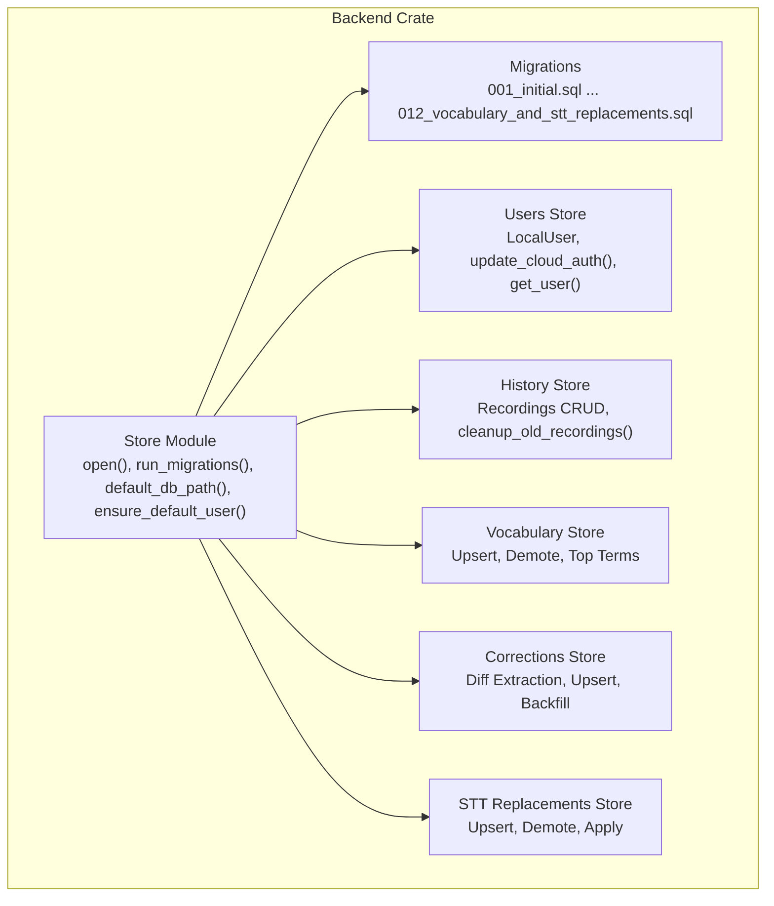
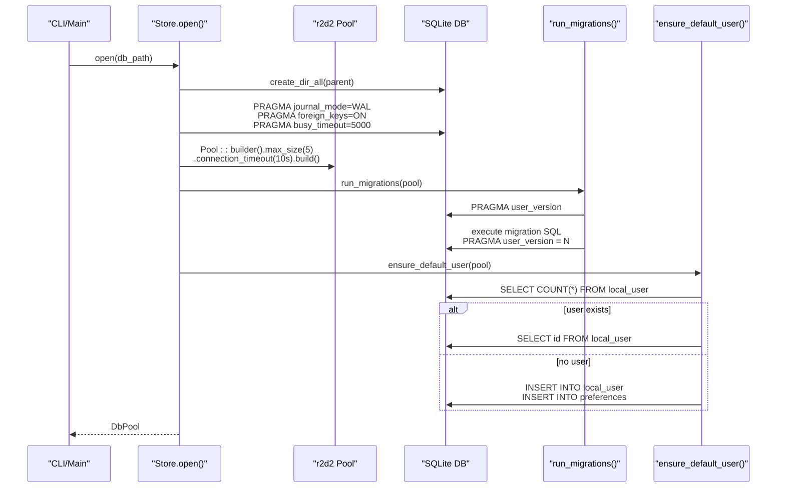
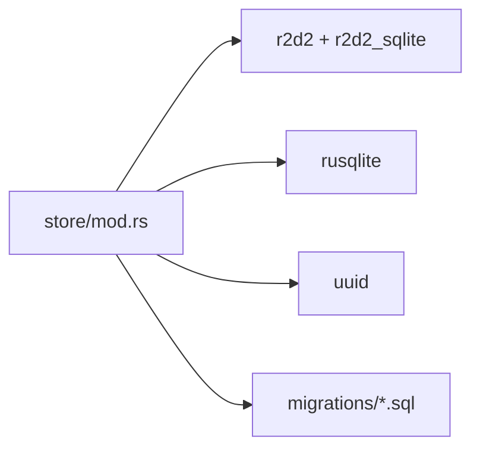

# Database Overview and Design

<cite>
**Referenced Files in This Document**
- [mod.rs](file://crates/backend/src/store/mod.rs)
- [users.rs](file://crates/backend/src/store/users.rs)
- [history.rs](file://crates/backend/src/store/history.rs)
- [vocabulary.rs](file://crates/backend/src/store/vocabulary.rs)
- [corrections.rs](file://crates/backend/src/store/corrections.rs)
- [stt_replacements.rs](file://crates/backend/src/store/stt_replacements.rs)
- [001_initial.sql](file://crates/backend/src/store/migrations/001_initial.sql)
- [002_vectors.sql](file://crates/backend/src/store/migrations/002_vectors.sql)
- [012_vocabulary_and_stt_replacements.sql](file://crates/backend/src/store/migrations/012_vocabulary_and_stt_replacements.sql)
- [lib.rs](file://crates/backend/src/lib.rs)
- [main.rs](file://crates/backend/src/main.rs)
- [Cargo.toml](file://crates/backend/Cargo.toml)
</cite>

## Table of Contents
1. [Introduction](#introduction)
2. [Project Structure](#project-structure)
3. [Core Components](#core-components)
4. [Architecture Overview](#architecture-overview)
5. [Detailed Component Analysis](#detailed-component-analysis)
6. [Dependency Analysis](#dependency-analysis)
7. [Performance Considerations](#performance-considerations)
8. [Troubleshooting Guide](#troubleshooting-guide)
9. [Conclusion](#conclusion)

## Introduction
This document describes the database architecture and design of the WISPR Hindi Bridge backend. The system uses SQLite as the primary storage engine with Write-Ahead Logging (WAL) mode enabled for concurrent access. It employs a connection pool managed by r2d2_sqlite to handle concurrent requests efficiently. The database is initialized with directory creation, foreign key enforcement, and a busy timeout configuration. Schema evolution is tracked using SQLite’s PRAGMA user_version, and migrations are executed automatically during startup. The default database path resides under the user’s Application Support directory, and a default local user is created automatically upon first run. Background tasks manage cleanup and reporting.

## Project Structure
The database layer is implemented in the backend crate under the store module. It includes:
- A central store initializer that sets up the database, runs migrations, and creates a connection pool.
- Migration scripts that define the evolving schema.
- Domain-specific stores for users, history, vocabulary, corrections, and STT replacements.
- An application state that holds the connection pool and caches for performance.

**Diagram sources**
- [mod.rs:32-60](file://crates/backend/src/store/mod.rs#L32-L60)
- [users.rs:1-51](file://crates/backend/src/store/users.rs#L1-L51)
- [history.rs:1-154](file://crates/backend/src/store/history.rs#L1-L154)
- [vocabulary.rs:1-248](file://crates/backend/src/store/vocabulary.rs#L1-L248)
- [corrections.rs:1-136](file://crates/backend/src/store/corrections.rs#L1-L136)
- [stt_replacements.rs:1-312](file://crates/backend/src/store/stt_replacements.rs#L1-L312)
- [001_initial.sql:1-70](file://crates/backend/src/store/migrations/001_initial.sql#L1-L70)
- [002_vectors.sql:1-14](file://crates/backend/src/store/migrations/002_vectors.sql#L1-L14)
- [012_vocabulary_and_stt_replacements.sql:1-55](file://crates/backend/src/store/migrations/012_vocabulary_and_stt_replacements.sql#L1-L55)

**Section sources**
- [mod.rs:1-60](file://crates/backend/src/store/mod.rs#L1-L60)
- [Cargo.toml:26-29](file://crates/backend/Cargo.toml#L26-L29)

## Core Components
- Database initializer and pool:
  - Creates the database directory if missing.
  - Initializes SQLite with WAL mode, foreign keys enabled, and a busy timeout.
  - Builds a connection pool with a maximum of five connections and a 10-second connection timeout.
  - Executes migrations and performs one-time data cleanup and backfills.
- Default database path:
  - Resolves to the user’s Application Support directory under a VoicePolish folder.
- Automatic user creation:
  - Ensures a single default local user exists and initializes default preferences.

Key implementation references:
- [open() and pool configuration:34-60](file://crates/backend/src/store/mod.rs#L34-L60)
- [run_migrations() and user_version tracking:62-165](file://crates/backend/src/store/mod.rs#L62-L165)
- [default_db_path():167-175](file://crates/backend/src/store/mod.rs#L167-L175)
- [ensure_default_user():177-215](file://crates/backend/src/store/mod.rs#L177-L215)

**Section sources**
- [mod.rs:32-60](file://crates/backend/src/store/mod.rs#L32-L60)
- [mod.rs:62-165](file://crates/backend/src/store/mod.rs#L62-L165)
- [mod.rs:167-175](file://crates/backend/src/store/mod.rs#L167-L175)
- [mod.rs:177-215](file://crates/backend/src/store/mod.rs#L177-L215)

## Architecture Overview
The backend initializes the database at startup, enforces schema versioning, and exposes a connection pool to all routes. The application state carries the pool and caches for preferences and lexicon. Background tasks periodically clean up old recordings and send metering reports.

**Diagram sources**
- [main.rs:46-58](file://crates/backend/src/main.rs#L46-L58)
- [mod.rs:34-60](file://crates/backend/src/store/mod.rs#L34-L60)
- [mod.rs:62-165](file://crates/backend/src/store/mod.rs#L62-L165)
- [mod.rs:177-215](file://crates/backend/src/store/mod.rs#L177-L215)

## Detailed Component Analysis

### Database Initialization and Lifecycle
- Directory creation:
  - Ensures the parent directory of the database file exists before opening.
- SQLite configuration:
  - Enables WAL mode for concurrency.
  - Enforces foreign key constraints.
  - Sets a 5-second busy timeout to prevent indefinite blocking during migrations.
- Connection pool:
  - Maximum pool size of five connections.
  - Connection acquisition timeout of ten seconds.
- Migration execution:
  - Reads PRAGMA user_version to determine the current schema level.
  - Applies migrations sequentially from 001 to 012, updating user_version after each.
- Startup cleanup and backfills:
  - Purges garbage edit events with no meaningful word overlap.
  - Backfills word corrections from existing edit events.

References:
- [open() and init PRAGMAs:34-60](file://crates/backend/src/store/mod.rs#L34-L60)
- [run_migrations() and user_version:62-165](file://crates/backend/src/store/mod.rs#L62-L165)
- [purge_garbage_edits():225-271](file://crates/backend/src/store/mod.rs#L225-L271)
- [backfill_from_edit_events():95-135](file://crates/backend/src/store/corrections.rs#L95-L135)

**Section sources**
- [mod.rs:34-60](file://crates/backend/src/store/mod.rs#L34-L60)
- [mod.rs:62-165](file://crates/backend/src/store/mod.rs#L62-L165)
- [mod.rs:225-271](file://crates/backend/src/store/mod.rs#L225-L271)
- [corrections.rs:95-135](file://crates/backend/src/store/corrections.rs#L95-L135)

### Schema Versioning and Migrations
- Initial schema (001):
  - Defines local_user, preferences, recordings, edit_events, and embedding_cache tables.
  - Includes foreign keys and indexes for performance.
- Preference vectors (002):
  - Adds preference_vectors table for storing embeddings and indexing by user.
- Vocabulary and STT replacements (012):
  - Introduces vocabulary and stt_replacements tables.
  - Extends edit_events with edit_class and adds weight/tier columns to word_corrections.

References:
- [001_initial.sql:1-70](file://crates/backend/src/store/migrations/001_initial.sql#L1-L70)
- [002_vectors.sql:1-14](file://crates/backend/src/store/migrations/002_vectors.sql#L1-L14)
- [012_vocabulary_and_stt_replacements.sql:1-55](file://crates/backend/src/store/migrations/012_vocabulary_and_stt_replacements.sql#L1-L55)

**Section sources**
- [001_initial.sql:1-70](file://crates/backend/src/store/migrations/001_initial.sql#L1-L70)
- [002_vectors.sql:1-14](file://crates/backend/src/store/migrations/002_vectors.sql#L1-L14)
- [012_vocabulary_and_stt_replacements.sql:1-55](file://crates/backend/src/store/migrations/012_vocabulary_and_stt_replacements.sql#L1-L55)

### Default Database Path and Automatic User Creation
- Default path:
  - Resolves to the user’s Application Support directory under VoicePolish.
- Default user:
  - Checks for existing users; if none, creates a new UUID-based user and inserts default preferences.

References:
- [default_db_path():167-175](file://crates/backend/src/store/mod.rs#L167-L175)
- [ensure_default_user():177-215](file://crates/backend/src/store/mod.rs#L177-L215)

**Section sources**
- [mod.rs:167-175](file://crates/backend/src/store/mod.rs#L167-L175)
- [mod.rs:177-215](file://crates/backend/src/store/mod.rs#L177-L215)

### Users Store
- Data model:
  - LocalUser with id, email, optional cloud_token, license_tier, and created_at.
- Operations:
  - Update cloud token and license tier.
  - Clear cloud token.
  - Retrieve user by id.

References:
- [LocalUser struct and operations:6-51](file://crates/backend/src/store/users.rs#L6-L51)

**Section sources**
- [users.rs:6-51](file://crates/backend/src/store/users.rs#L6-L51)

### History Store
- Data model:
  - Recording with fields for transcripts, polished text, timing metrics, and metadata.
- Operations:
  - Insert recording.
  - List recordings with pagination and time bounds.
  - Get a single recording by id.
  - Delete a recording by id.
  - Cleanup old recordings (background task).

References:
- [Recording struct and CRUD:7-154](file://crates/backend/src/store/history.rs#L7-L154)

**Section sources**
- [history.rs:7-154](file://crates/backend/src/store/history.rs#L7-L154)

### Vocabulary Store
- Purpose:
  - STT-layer bias terms to improve recognition of jargon, names, brands, and code identifiers.
- Operations:
  - Upsert term with weight bump and conflict resolution.
  - Demote term and remove when weight falls below zero.
  - Fetch top-N terms by weight and recency.
  - Count entries for UI badges.

References:
- [VocabTerm and operations:22-154](file://crates/backend/src/store/vocabulary.rs#L22-L154)

**Section sources**
- [vocabulary.rs:22-154](file://crates/backend/src/store/vocabulary.rs#L22-L154)

### Corrections Store
- Purpose:
  - Word-level correction rules derived from user edits.
- Operations:
  - Extract differences between AI output and user-kept text.
  - Upsert corrections with counts and timestamps.
  - Load all corrections for a user.
  - Backfill corrections from edit_events on startup.

References:
- [Correction and operations:12-135](file://crates/backend/src/store/corrections.rs#L12-L135)

**Section sources**
- [corrections.rs:12-135](file://crates/backend/src/store/corrections.rs#L12-L135)

### STT Replacements Store
- Purpose:
  - Post-STT literal and phonetic substitutions to fix persistent misrecognitions.
- Operations:
  - Upsert replacement rules with phonetic keys and weights.
  - Demote and evict rules.
  - Load all rules and apply them to transcripts in two passes (exact and phonetic).

References:
- [SttReplacement and operations:22-190](file://crates/backend/src/store/stt_replacements.rs#L22-L190)

**Section sources**
- [stt_replacements.rs:22-190](file://crates/backend/src/store/stt_replacements.rs#L22-L190)

### Application State and Routing
- Application state:
  - Holds the database pool, shared secret, default user id, preferences cache, lexicon cache, and a shared HTTP client.
- Router:
  - Exposes authenticated and public endpoints; requires a shared-secret bearer token for authenticated routes.
- Builder:
  - Loads environment, resolves database path, opens the database, ensures default user, and constructs the router.

References:
- [AppState and router_with_state():133-199](file://crates/backend/src/lib.rs#L133-L199)
- [router() builder:201-226](file://crates/backend/src/lib.rs#L201-L226)

**Section sources**
- [lib.rs:133-199](file://crates/backend/src/lib.rs#L133-L199)
- [lib.rs:201-226](file://crates/backend/src/lib.rs#L201-L226)

## Dependency Analysis
The store module depends on:
- r2d2 and r2d2_sqlite for connection pooling.
- rusqlite for SQLite operations.
- uuid for default user id generation.
- Migration SQL files for schema evolution.

**Diagram sources**
- [Cargo.toml:26-29](file://crates/backend/Cargo.toml#L26-L29)
- [mod.rs:1-60](file://crates/backend/src/store/mod.rs#L1-L60)

**Section sources**
- [Cargo.toml:26-29](file://crates/backend/Cargo.toml#L26-L29)
- [mod.rs:1-60](file://crates/backend/src/store/mod.rs#L1-L60)

## Performance Considerations
- WAL mode:
  - Improves concurrency by allowing readers and writers to operate simultaneously without blocking each other.
- Foreign key constraints:
  - Enforce referential integrity and prevent orphaned records, reducing maintenance overhead.
- Busy timeout:
  - Prevents indefinite blocking when a WAL checkpoint is in progress, enabling predictable migration behavior.
- Connection pooling:
  - Limits concurrent connections to five, balancing throughput and resource usage while preventing contention.
- Indexes:
  - Composite indexes on user_id and timestamps optimize frequent queries for recordings and edit events.
- Caching:
  - Preferences and lexicon caches reduce repeated SQLite reads for hot-path operations.

[No sources needed since this section provides general guidance]

## Troubleshooting Guide
- Database directory creation fails:
  - Verify permissions for the Application Support directory and ensure the path is writable.
- Migration hangs or fails:
  - Check for long-running transactions or stale locks; the busy timeout is configured to 5 seconds.
- Connection pool exhaustion:
  - Reduce concurrent workload or adjust pool size if necessary; the maximum is five connections.
- Garbage edit events:
  - The system automatically purges edit events with no meaningful word overlap; review logs for removal counts.
- Default user not created:
  - Confirm that the local_user table is empty or that the process has write permissions to the database file.

**Section sources**
- [mod.rs:34-60](file://crates/backend/src/store/mod.rs#L34-L60)
- [mod.rs:225-271](file://crates/backend/src/store/mod.rs#L225-L271)
- [main.rs:46-58](file://crates/backend/src/main.rs#L46-L58)

## Conclusion
The WISPR Hindi Bridge backend employs a robust, SQLite-based persistence layer with WAL mode for concurrency, foreign key enforcement for integrity, and a modest connection pool for balanced performance. The schema evolves through explicit migrations tracked by PRAGMA user_version, and the system automatically manages a default user and background cleanup. Together, these design choices deliver a reliable, maintainable, and efficient local-first database architecture suitable for personal-scale usage.