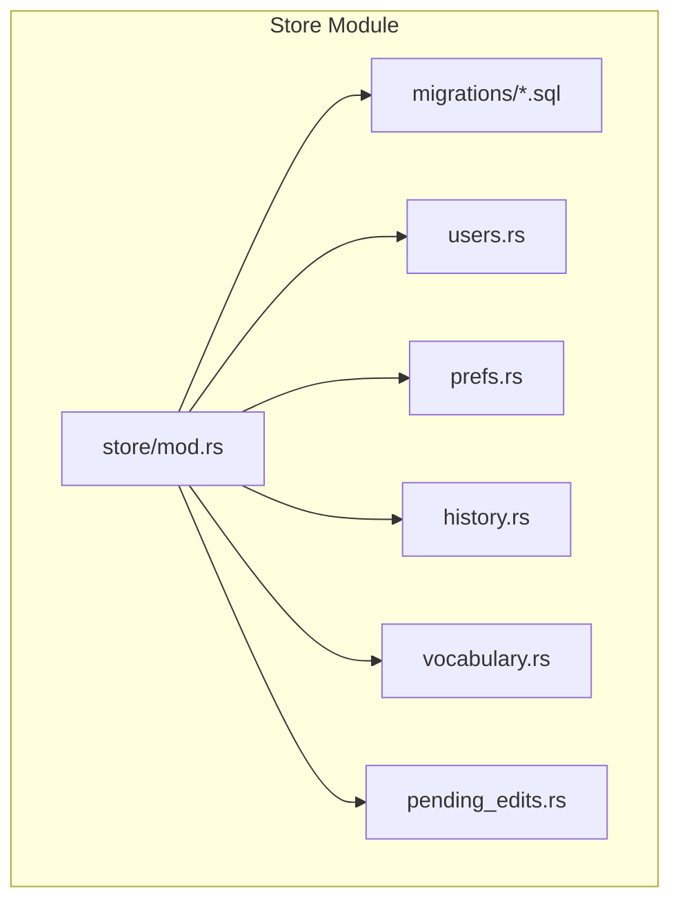
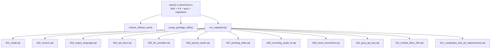
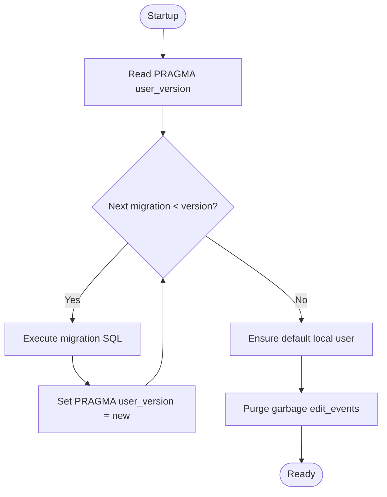
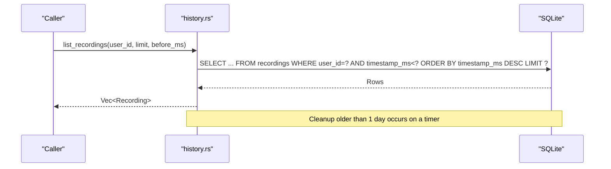
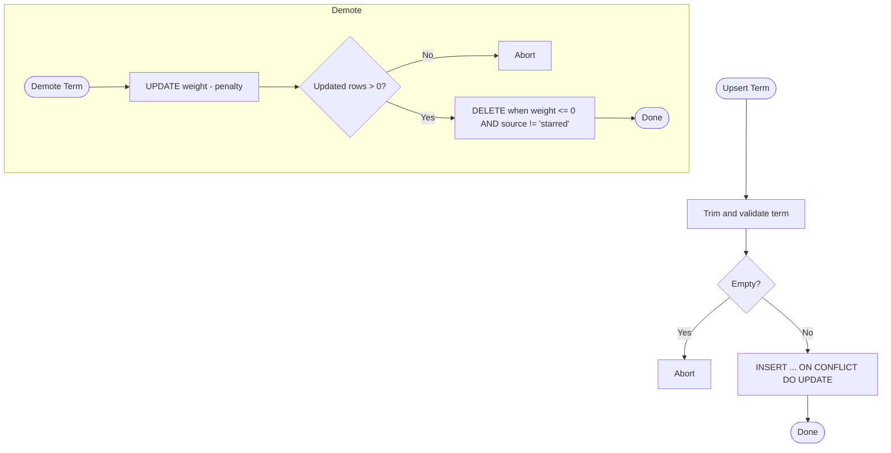
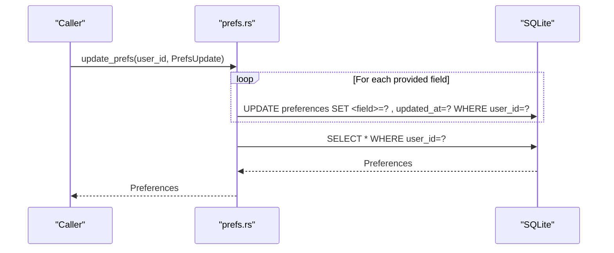
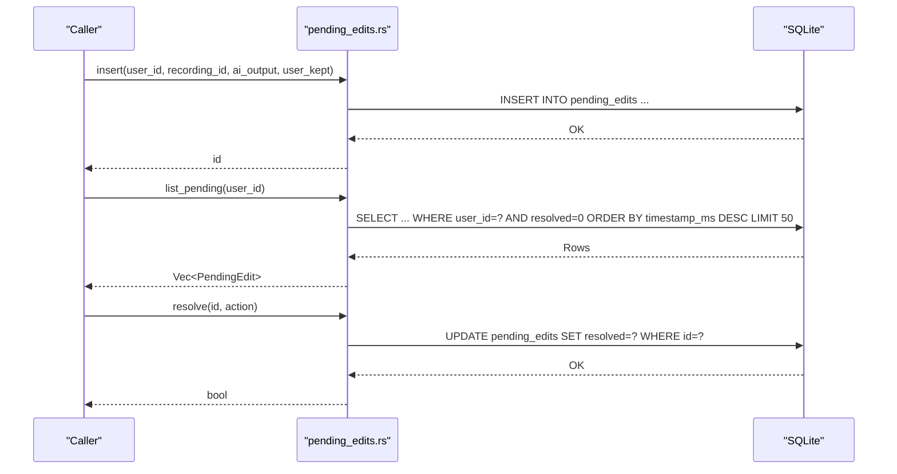
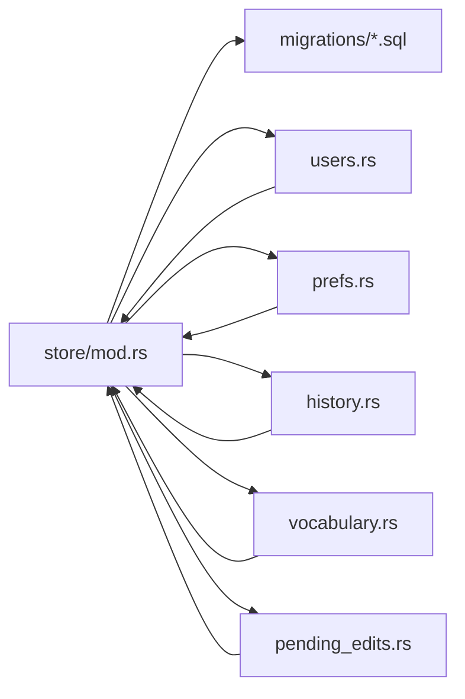

# Database Schema and Data Management

<cite>
**Referenced Files in This Document**
- [001_initial.sql](file://crates/backend/src/store/migrations/001_initial.sql)
- [002_vectors.sql](file://crates/backend/src/store/migrations/002_vectors.sql)
- [003_output_language.sql](file://crates/backend/src/store/migrations/003_output_language.sql)
- [004_api_keys.sql](file://crates/backend/src/store/migrations/004_api_keys.sql)
- [005_llm_provider.sql](file://crates/backend/src/store/migrations/005_llm_provider.sql)
- [006_openai_oauth.sql](file://crates/backend/src/store/migrations/006_openai_oauth.sql)
- [007_pending_edits.sql](file://crates/backend/src/store/migrations/007_pending_edits.sql)
- [008_recording_audio_id.sql](file://crates/backend/src/store/migrations/008_recording_audio_id.sql)
- [009_word_corrections.sql](file://crates/backend/src/store/migrations/009_word_corrections.sql)
- [010_groq_api_key.sql](file://crates/backend/src/store/migrations/010_groq_api_key.sql)
- [011_embed_dims_256.sql](file://crates/backend/src/store/migrations/011_embed_dims_256.sql)
- [012_vocabulary_and_stt_replacements.sql](file://crates/backend/src/store/migrations/012_vocabulary_and_stt_replacements.sql)
- [store/mod.rs](file://crates/backend/src/store/mod.rs)
- [users.rs](file://crates/backend/src/store/users.rs)
- [prefs.rs](file://crates/backend/src/store/prefs.rs)
- [history.rs](file://crates/backend/src/store/history.rs)
- [vocabulary.rs](file://crates/backend/src/store/vocabulary.rs)
- [pending_edits.rs](file://crates/backend/src/store/pending_edits.rs)
</cite>

## Table of Contents
1. [Introduction](#introduction)
2. [Project Structure](#project-structure)
3. [Core Components](#core-components)
4. [Architecture Overview](#architecture-overview)
5. [Detailed Component Analysis](#detailed-component-analysis)
6. [Dependency Analysis](#dependency-analysis)
7. [Performance Considerations](#performance-considerations)
8. [Troubleshooting Guide](#troubleshooting-guide)
9. [Conclusion](#conclusion)
10. [Appendices](#appendices)

## Introduction
This document describes the WISPR Hindi Bridge database schema and data management practices. It focuses on the local SQLite schema used by the backend, including the entity relationship diagram, core entities (Recording, Preferences, VocabularyTerm), migration strategy, query patterns, validation rules, integrity measures, and operational guidance such as backup/recovery, performance optimization, and data lifecycle management.

## Project Structure
The database schema is defined via SQL migrations under the backend store module. The schema evolves through numbered migrations that add tables, columns, and indexes while preserving user data where possible. The store module also provides initialization, migration execution, and runtime helpers such as default user creation and garbage edit purging.



**Diagram sources**
- [store/mod.rs:32-165](file://crates/backend/src/store/mod.rs#L32-L165)
- [001_initial.sql:1-70](file://crates/backend/src/store/migrations/001_initial.sql#L1-L70)
- [002_vectors.sql:1-14](file://crates/backend/src/store/migrations/002_vectors.sql#L1-L14)
- [003_output_language.sql:1-3](file://crates/backend/src/store/migrations/003_output_language.sql#L1-L3)
- [004_api_keys.sql:1-5](file://crates/backend/src/store/migrations/004_api_keys.sql#L1-L5)
- [005_llm_provider.sql:1-4](file://crates/backend/src/store/migrations/005_llm_provider.sql#L1-L4)
- [006_openai_oauth.sql:1-11](file://crates/backend/src/store/migrations/006_openai_oauth.sql#L1-L11)
- [007_pending_edits.sql:1-13](file://crates/backend/src/store/migrations/007_pending_edits.sql#L1-L13)
- [008_recording_audio_id.sql:1-2](file://crates/backend/src/store/migrations/008_recording_audio_id.sql#L1-L2)
- [009_word_corrections.sql:1-11](file://crates/backend/src/store/migrations/009_word_corrections.sql#L1-L11)
- [010_groq_api_key.sql:1-4](file://crates/backend/src/store/migrations/010_groq_api_key.sql#L1-L4)
- [011_embed_dims_256.sql:1-9](file://crates/backend/src/store/migrations/011_embed_dims_256.sql#L1-L9)
- [012_vocabulary_and_stt_replacements.sql:1-55](file://crates/backend/src/store/migrations/012_vocabulary_and_stt_replacements.sql#L1-L55)

**Section sources**
- [store/mod.rs:19-30](file://crates/backend/src/store/mod.rs#L19-L30)
- [store/mod.rs:32-60](file://crates/backend/src/store/mod.rs#L32-L60)

## Core Components
This section documents the core entities and their fields, data types, primary/foreign keys, indexes, and constraints. It also covers the migration strategy and schema evolution.

- LocalUser
  - Purpose: Single auto-created local user record.
  - Fields: id (TEXT, PK), email (TEXT, NOT NULL), cloud_token (TEXT), license_tier (TEXT, NOT NULL, DEFAULT 'free'), created_at (INTEGER, NOT NULL).
  - Constraints: PK on id; defaults applied at creation.
  - Notes: License tier can be updated via user operations.

- Preferences
  - Purpose: Per-user configuration and provider settings.
  - Fields: user_id (TEXT, PK, FK to local_user.id), selected_model (TEXT, NOT NULL, DEFAULT 'smart'), tone_preset (TEXT, NOT NULL, DEFAULT 'neutral'), custom_prompt (TEXT), language (TEXT, NOT NULL, DEFAULT 'auto'), auto_paste (INTEGER, NOT NULL, DEFAULT 1), edit_capture (INTEGER, NOT NULL, DEFAULT 1), polish_text_hotkey (TEXT, NOT NULL, DEFAULT 'cmd+shift+p'), updated_at (INTEGER, NOT NULL), output_language (TEXT, NOT NULL, DEFAULT 'hinglish'), gateway_api_key (TEXT), deepgram_api_key (TEXT), gemini_api_key (TEXT), groq_api_key (TEXT), llm_provider (TEXT, NOT NULL, DEFAULT 'gateway').
  - Constraints: PK on user_id; FK to local_user(id); defaults applied at creation.
  - Notes: API keys are stored locally; provider routing is configurable.

- Recordings
  - Purpose: Rolling history of voice/polish sessions.
  - Fields: id (TEXT, PK), user_id (TEXT, NOT NULL, FK to local_user.id), timestamp_ms (INTEGER, NOT NULL), transcript (TEXT, NOT NULL), polished (TEXT, NOT NULL), final_text (TEXT), word_count (INTEGER, NOT NULL), recording_seconds (REAL, NOT NULL), model_used (TEXT, NOT NULL), confidence (REAL), transcribe_ms (INTEGER), embed_ms (INTEGER), polish_ms (INTEGER), target_app (TEXT), edit_count (INTEGER, NOT NULL, DEFAULT 0), source (TEXT, NOT NULL, DEFAULT 'voice'), audio_id (TEXT).
  - Indexes: idx_rec_user_time (user_id, timestamp_ms DESC).
  - Constraints: FK to local_user(id) with ON DELETE CASCADE; DEFAULTS applied at insert.
  - Notes: Automatic cleanup runs daily to remove entries older than 1 day.

- EditEvents
  - Purpose: Permanent learning corpus capturing edits.
  - Fields: id (TEXT, PK), user_id (TEXT, NOT NULL, FK to local_user.id), recording_id (TEXT, FK to recordings.id, ON DELETE SET NULL), timestamp_ms (INTEGER, NOT NULL), transcript (TEXT, NOT NULL), ai_output (TEXT, NOT NULL), user_kept (TEXT, NOT NULL), target_app (TEXT), embedding_id (INTEGER).
  - Indexes: idx_edit_user_time (user_id, timestamp_ms DESC).
  - Constraints: FK to local_user(id) with ON DELETE CASCADE; optional FK to recordings(id) with ON DELETE SET NULL.

- EmbeddingCache
  - Purpose: Persistent embedding cache for texts.
  - Fields: text_hash (TEXT, PK), embedding (BLOB, NOT NULL), created_at (INTEGER, NOT NULL).

- PreferenceVectors
  - Purpose: Embeddings for preference modeling.
  - Fields: id (INTEGER, PK, AUTOINCREMENT), user_id (TEXT, NOT NULL), edit_event_id (TEXT, NOT NULL, UNIQUE), embedding (BLOB, NOT NULL).
  - Indexes: idx_vec_user (user_id).

- OpenAI_OAuth
  - Purpose: Store local OAuth tokens for ChatGPT.
  - Fields: user_id (TEXT, PK, FK to local_user.id), access_token (TEXT, NOT NULL), refresh_token (TEXT), expires_at (INTEGER, NOT NULL), connected_at (INTEGER, NOT NULL).
  - Constraints: PK on user_id; FK to local_user(id).

- PendingEdits
  - Purpose: Unresolved edits awaiting user approval.
  - Fields: id (TEXT, PK), user_id (TEXT, NOT NULL, FK to local_user.id), recording_id (TEXT, FK to recordings.id, ON DELETE SET NULL), ai_output (TEXT, NOT NULL), user_kept (TEXT, NOT NULL), timestamp_ms (INTEGER, NOT NULL), resolved (INTEGER, NOT NULL, DEFAULT 0).
  - Indexes: idx_pending_user (user_id, resolved, timestamp_ms DESC).
  - Constraints: FK to local_user(id) with ON DELETE CASCADE; optional FK to recordings(id) with ON DELETE SET NULL.

- WordCorrections (legacy)
  - Purpose: Legacy single-table word-level substitutions.
  - Fields: user_id (TEXT, NOT NULL), wrong_text (TEXT, NOT NULL), correct_text (TEXT, NOT NULL), count (INTEGER, NOT NULL, DEFAULT 1), updated_at (INTEGER, NOT NULL), UNIQUE(user_id, wrong_text).
  - Notes: Migrated to layered stores in later migrations.

- Vocabulary (STT-layer bias terms)
  - Purpose: Terms to bias STT recognition.
  - Fields: user_id (TEXT, NOT NULL, FK to local_user.id), term (TEXT, NOT NULL), weight (REAL, NOT NULL, DEFAULT 1.0), use_count (INTEGER, NOT NULL, DEFAULT 1), last_used (INTEGER, NOT NULL), source (TEXT, NOT NULL, DEFAULT 'auto'), UNIQUE(user_id, term).
  - Indexes: idx_vocab_user_weight (user_id, weight DESC).
  - Constraints: UNIQUE per user-term; FK to local_user(id) with ON DELETE CASCADE.

- STT_Replacements (post-STT literal + phonetic substitutions)
  - Purpose: Substitutions applied after STT.
  - Fields: user_id (TEXT, NOT NULL, FK to local_user.id), transcript_form (TEXT, NOT NULL), correct_form (TEXT, NOT NULL), phonetic_key (TEXT, NOT NULL), weight (REAL, NOT NULL, DEFAULT 1.0), use_count (INTEGER, NOT NULL, DEFAULT 1), last_used (INTEGER, NOT NULL), UNIQUE(user_id, transcript_form, correct_form).
  - Indexes: idx_stt_repl_user (user_id), idx_stt_repl_phon (user_id, phonetic_key).
  - Constraints: UNIQUE per triple; FK to local_user(id) with ON DELETE CASCADE.

- EditEvents (enhanced)
  - Purpose: Captured edits with classification.
  - Fields: edit_class (TEXT) added; values include STT_ERROR, POLISH_ERROR, USER_REPHRASE, USER_REWRITE.

**Section sources**
- [001_initial.sql:7-70](file://crates/backend/src/store/migrations/001_initial.sql#L7-L70)
- [002_vectors.sql:6-14](file://crates/backend/src/store/migrations/002_vectors.sql#L6-L14)
- [003_output_language.sql:1-3](file://crates/backend/src/store/migrations/003_output_language.sql#L1-L3)
- [004_api_keys.sql:1-5](file://crates/backend/src/store/migrations/004_api_keys.sql#L1-L5)
- [005_llm_provider.sql:1-4](file://crates/backend/src/store/migrations/005_llm_provider.sql#L1-L4)
- [006_openai_oauth.sql:4-11](file://crates/backend/src/store/migrations/006_openai_oauth.sql#L4-L11)
- [007_pending_edits.sql:2-13](file://crates/backend/src/store/migrations/007_pending_edits.sql#L2-L13)
- [008_recording_audio_id.sql:1-2](file://crates/backend/src/store/migrations/008_recording_audio_id.sql#L1-L2)
- [009_word_corrections.sql:3-11](file://crates/backend/src/store/migrations/009_word_corrections.sql#L3-L11)
- [010_groq_api_key.sql:1-4](file://crates/backend/src/store/migrations/010_groq_api_key.sql#L1-L4)
- [011_embed_dims_256.sql:1-9](file://crates/backend/src/store/migrations/011_embed_dims_256.sql#L1-L9)
- [012_vocabulary_and_stt_replacements.sql:22-55](file://crates/backend/src/store/migrations/012_vocabulary_and_stt_replacements.sql#L22-L55)

## Architecture Overview
The backend initializes SQLite with WAL mode and foreign keys enabled, runs migrations in order, ensures a default user exists, and performs startup cleanup of garbage edit events. Data access is encapsulated in typed modules for users, preferences, history, vocabulary, and pending edits.



**Diagram sources**
- [store/mod.rs:34-60](file://crates/backend/src/store/mod.rs#L34-L60)
- [store/mod.rs:62-165](file://crates/backend/src/store/mod.rs#L62-L165)
- [001_initial.sql:1-70](file://crates/backend/src/store/migrations/001_initial.sql#L1-L70)
- [002_vectors.sql:1-14](file://crates/backend/src/store/migrations/002_vectors.sql#L1-L14)
- [003_output_language.sql:1-3](file://crates/backend/src/store/migrations/003_output_language.sql#L1-L3)
- [004_api_keys.sql:1-5](file://crates/backend/src/store/migrations/004_api_keys.sql#L1-L5)
- [005_llm_provider.sql:1-4](file://crates/backend/src/store/migrations/005_llm_provider.sql#L1-L4)
- [006_openai_oauth.sql:1-11](file://crates/backend/src/store/migrations/006_openai_oauth.sql#L1-L11)
- [007_pending_edits.sql:1-13](file://crates/backend/src/store/migrations/007_pending_edits.sql#L1-L13)
- [008_recording_audio_id.sql:1-2](file://crates/backend/src/store/migrations/008_recording_audio_id.sql#L1-L2)
- [009_word_corrections.sql:1-11](file://crates/backend/src/store/migrations/009_word_corrections.sql#L1-L11)
- [010_groq_api_key.sql:1-4](file://crates/backend/src/store/migrations/010_groq_api_key.sql#L1-L4)
- [011_embed_dims_256.sql:1-9](file://crates/backend/src/store/migrations/011_embed_dims_256.sql#L1-L9)
- [012_vocabulary_and_stt_replacements.sql:1-55](file://crates/backend/src/store/migrations/012_vocabulary_and_stt_replacements.sql#L1-L55)

## Detailed Component Analysis

### Entity Relationship Diagram
The ER diagram below reflects the relationships among core entities defined by foreign keys and indexes.

```mermaid
erDiagram
LOCAL_USER {
text id PK
text email
text cloud_token
text license_tier
integer created_at
}
PREFERENCES {
text user_id PK,FK
text selected_model
text tone_preset
text custom_prompt
text language
integer auto_paste
integer edit_capture
text polish_text_hotkey
integer updated_at
text output_language
text gateway_api_key
text deepgram_api_key
text gemini_api_key
text groq_api_key
text llm_provider
}
RECORDINGS {
text id PK
text user_id FK
integer timestamp_ms
text transcript
text polished
text final_text
integer word_count
real recording_seconds
text model_used
real confidence
integer transcribe_ms
integer embed_ms
integer polish_ms
text target_app
integer edit_count
text source
text audio_id
}
EDIT_EVENTS {
text id PK
text user_id FK
text recording_id FK
integer timestamp_ms
text transcript
text ai_output
text user_kept
text target_app
integer embedding_id
}
PREFERENCE_VECTORS {
integer id PK
text user_id
text edit_event_id UNQ
blob embedding
}
OPENAI_OAUTH {
text user_id PK,FK
text access_token
text refresh_token
integer expires_at
integer connected_at
}
PENDING_EDITS {
text id PK
text user_id FK
text recording_id FK
text ai_output
text user_kept
integer timestamp_ms
integer resolved
}
VOCABULARY {
text user_id FK
text term
real weight
integer use_count
integer last_used
text source
unique user_id+term
}
STT_REPLACEMENTS {
text user_id FK
text transcript_form
text correct_form
text phonetic_key
real weight
integer use_count
integer last_used
unique user_id+transcript_form+correct_form
}
LOCAL_USER ||--o{ PREFERENCES : "1:1"
LOCAL_USER ||--o{ RECORDINGS : "1:N"
LOCAL_USER ||--o{ EDIT_EVENTS : "1:N"
LOCAL_USER ||--o{ PENDING_EDITS : "1:N"
LOCAL_USER ||--o{ VOCABULARY : "1:N"
LOCAL_USER ||--o{ STT_REPLACEMENTS : "1:N"
RECORDINGS ||--o{ EDIT_EVENTS : "0:N"
RECORDINGS ||--o{ PENDING_EDITS : "0:N"
EDIT_EVENTS ||--|| PREFERENCE_VECTORS : "1:1"
LOCAL_USER ||--|| OPENAI_OAUTH : "1:1"
```

**Diagram sources**
- [001_initial.sql:7-70](file://crates/backend/src/store/migrations/001_initial.sql#L7-L70)
- [002_vectors.sql:6-14](file://crates/backend/src/store/migrations/002_vectors.sql#L6-L14)
- [003_output_language.sql:1-3](file://crates/backend/src/store/migrations/003_output_language.sql#L1-L3)
- [004_api_keys.sql:1-5](file://crates/backend/src/store/migrations/004_api_keys.sql#L1-L5)
- [005_llm_provider.sql:1-4](file://crates/backend/src/store/migrations/005_llm_provider.sql#L1-L4)
- [006_openai_oauth.sql:4-11](file://crates/backend/src/store/migrations/006_openai_oauth.sql#L4-L11)
- [007_pending_edits.sql:2-13](file://crates/backend/src/store/migrations/007_pending_edits.sql#L2-L13)
- [008_recording_audio_id.sql:1-2](file://crates/backend/src/store/migrations/008_recording_audio_id.sql#L1-L2)
- [009_word_corrections.sql:3-11](file://crates/backend/src/store/migrations/009_word_corrections.sql#L3-L11)
- [010_groq_api_key.sql:1-4](file://crates/backend/src/store/migrations/010_groq_api_key.sql#L1-L4)
- [011_embed_dims_256.sql:1-9](file://crates/backend/src/store/migrations/011_embed_dims_256.sql#L1-L9)
- [012_vocabulary_and_stt_replacements.sql:22-55](file://crates/backend/src/store/migrations/012_vocabulary_and_stt_replacements.sql#L22-L55)

### Migration Strategy and Versioned Schema Evolution
- Initialization: SQLite opened with WAL mode and foreign keys enabled; a connection pool is created.
- Migration execution: The system checks the current schema version via PRAGMA user_version and applies migrations in ascending order.
- Data preservation: Some migrations drop and rebuild compatible caches (e.g., embedding vectors and cache) when embedding dimensions change, ensuring compatibility.
- Startup cleanup: Garbage edit events without meaningful overlap are removed to maintain data quality.



**Diagram sources**
- [store/mod.rs:62-165](file://crates/backend/src/store/mod.rs#L62-L165)

**Section sources**
- [store/mod.rs:34-60](file://crates/backend/src/store/mod.rs#L34-L60)
- [store/mod.rs:177-215](file://crates/backend/src/store/mod.rs#L177-L215)
- [store/mod.rs:225-271](file://crates/backend/src/store/mod.rs#L225-L271)

### Query Patterns and Business Logic

#### History Retrieval
- Retrieve paginated recordings for a user ordered by timestamp descending.
- Optional before_ms cutoff and limit support.
- Background cleanup removes entries older than 1 day.



**Diagram sources**
- [history.rs:92-110](file://crates/backend/src/store/history.rs#L92-L110)
- [history.rs:113-127](file://crates/backend/src/store/history.rs#L113-L127)

**Section sources**
- [history.rs:92-110](file://crates/backend/src/store/history.rs#L92-L110)
- [history.rs:113-127](file://crates/backend/src/store/history.rs#L113-L127)

#### Vocabulary Search and Management
- Upsert vocabulary terms with weight increase and source handling.
- Demote terms with penalties; remove when weight reaches zero (except starred).
- Fetch top-N terms by weight and recency for STT biasing.



**Diagram sources**
- [vocabulary.rs:33-72](file://crates/backend/src/store/vocabulary.rs#L33-L72)
- [vocabulary.rs:76-103](file://crates/backend/src/store/vocabulary.rs#L76-L103)
- [vocabulary.rs:106-133](file://crates/backend/src/store/vocabulary.rs#L106-L133)

**Section sources**
- [vocabulary.rs:33-72](file://crates/backend/src/store/vocabulary.rs#L33-L72)
- [vocabulary.rs:76-103](file://crates/backend/src/store/vocabulary.rs#L76-L103)
- [vocabulary.rs:106-133](file://crates/backend/src/store/vocabulary.rs#L106-L133)

#### Preference Updates
- Partial updates supported; updated_at timestamp is refreshed on change.
- API keys are stored locally; provider routing is configurable.



**Diagram sources**
- [prefs.rs:78-162](file://crates/backend/src/store/prefs.rs#L78-L162)

**Section sources**
- [prefs.rs:78-162](file://crates/backend/src/store/prefs.rs#L78-L162)

#### Pending Edits Workflow
- Insert pending edits with resolved=0.
- List pending edits for a user.
- Resolve pending edits (approve/skip).



**Diagram sources**
- [pending_edits.rs:15-32](file://crates/backend/src/store/pending_edits.rs#L15-L32)
- [pending_edits.rs:51-78](file://crates/backend/src/store/pending_edits.rs#L51-L78)
- [pending_edits.rs:94-105](file://crates/backend/src/store/pending_edits.rs#L94-L105)

**Section sources**
- [pending_edits.rs:15-32](file://crates/backend/src/store/pending_edits.rs#L15-L32)
- [pending_edits.rs:51-78](file://crates/backend/src/store/pending_edits.rs#L51-L78)
- [pending_edits.rs:94-105](file://crates/backend/src/store/pending_edits.rs#L94-L105)

### Data Validation Rules and Integrity Measures
- Foreign Keys: Enforced for local_user references across preferences, recordings, edit_events, pending_edits, vocabulary, and stt_replacements.
- Unique Constraints: Composite unique keys on (user_id, term) and (user_id, transcript_form, correct_form) prevent duplicates.
- Defaults: Many fields have sensible defaults at creation or insertion.
- Startup Integrity: Garbage edit events without meaningful overlap are purged to prevent poisoning learning corpora.
- Provider Routing: llm_provider is constrained to known values; API keys are optional and stored locally.

**Section sources**
- [001_initial.sql:17-47](file://crates/backend/src/store/migrations/001_initial.sql#L17-L47)
- [002_vectors.sql:6-14](file://crates/backend/src/store/migrations/002_vectors.sql#L6-L14)
- [005_llm_provider.sql:1-4](file://crates/backend/src/store/migrations/005_llm_provider.sql#L1-L4)
- [009_word_corrections.sql:3-11](file://crates/backend/src/store/migrations/009_word_corrections.sql#L3-L11)
- [012_vocabulary_and_stt_replacements.sql:22-55](file://crates/backend/src/store/migrations/012_vocabulary_and_stt_replacements.sql#L22-L55)
- [store/mod.rs:225-271](file://crates/backend/src/store/mod.rs#L225-L271)

## Dependency Analysis
- Initialization depends on migrations and filesystem creation.
- Runtime modules depend on the shared connection pool and typed models.
- Data integrity relies on foreign keys and startup cleanup.



**Diagram sources**
- [store/mod.rs:19-30](file://crates/backend/src/store/mod.rs#L19-L30)
- [store/mod.rs:32-60](file://crates/backend/src/store/mod.rs#L32-L60)

**Section sources**
- [store/mod.rs:19-30](file://crates/backend/src/store/mod.rs#L19-L30)
- [store/mod.rs:32-60](file://crates/backend/src/store/mod.rs#L32-L60)

## Performance Considerations
- Indexes
  - recordings: idx_rec_user_time(user_id, timestamp_ms DESC) supports history queries.
  - edit_events: idx_edit_user_time(user_id, timestamp_ms DESC) supports learning corpus queries.
  - preference_vectors: idx_vec_user(user_id) supports vector lookups.
  - pending_edits: idx_pending_user(user_id, resolved, timestamp_ms DESC) supports pending review lists.
  - vocabulary: idx_vocab_user_weight(user_id, weight DESC) supports STT biasing.
  - stt_replacements: idx_stt_repl_user(user_id), idx_stt_repl_phon(user_id, phonetic_key) support lookup patterns.
- WAL Mode: Enabled to improve concurrency and reduce writer stalls.
- Embedding Dimensions Change: On dimension switch, vectors and cache are cleared and rebuilt to avoid incompatibility.
- Cleanup: Daily removal of old recordings reduces table growth and maintains query performance.

**Section sources**
- [001_initial.sql:48-48](file://crates/backend/src/store/migrations/001_initial.sql#L48-L48)
- [001_initial.sql:62-62](file://crates/backend/src/store/migrations/001_initial.sql#L62-L62)
- [002_vectors.sql:13-13](file://crates/backend/src/store/migrations/002_vectors.sql#L13-L13)
- [007_pending_edits.sql:11-12](file://crates/backend/src/store/migrations/007_pending_edits.sql#L11-L12)
- [012_vocabulary_and_stt_replacements.sql:32-46](file://crates/backend/src/store/migrations/012_vocabulary_and_stt_replacements.sql#L32-L46)
- [store/mod.rs:44-47](file://crates/backend/src/store/mod.rs#L44-L47)
- [history.rs:113-127](file://crates/backend/src/store/history.rs#L113-L127)

## Troubleshooting Guide
- Migration Failures
  - Cause: user_version mismatch or SQL errors.
  - Action: Verify PRAGMA user_version, check migration SQL, and retry initialization.
- Garbage Edit Events
  - Symptom: Low-quality edits polluting learning corpus.
  - Action: Startup purge removes edits without meaningful overlap; verify purge logic if issues persist.
- Embedding Dimension Change
  - Symptom: Incompatible vectors or cache after dimension switch.
  - Action: Confirm that preference_vectors and embedding_cache were cleared and will be repopulated.
- History Growth
  - Symptom: Slow history queries or disk usage.
  - Action: Confirm daily cleanup is running; consider adjusting limits or indexes if needed.

**Section sources**
- [store/mod.rs:62-165](file://crates/backend/src/store/mod.rs#L62-L165)
- [store/mod.rs:225-271](file://crates/backend/src/store/mod.rs#L225-L271)
- [011_embed_dims_256.sql:7-8](file://crates/backend/src/store/migrations/011_embed_dims_256.sql#L7-L8)
- [history.rs:113-127](file://crates/backend/src/store/history.rs#L113-L127)

## Conclusion
The WISPR Hindi Bridge database employs a carefully designed local SQLite schema with explicit migrations, strong referential integrity, and targeted indexes. Core entities capture user preferences, recording history, and vocabulary-driven STT biasing, while supporting robust query patterns and operational hygiene such as daily cleanup and startup integrity checks. The layered vocabulary and STT replacement stores enable precise control over correction application, and the migration strategy preserves data continuity across evolving requirements.

## Appendices

### Appendix A: Field Reference Summary
- LocalUser: id, email, cloud_token, license_tier, created_at
- Preferences: user_id, selected_model, tone_preset, custom_prompt, language, output_language, auto_paste, edit_capture, polish_text_hotkey, updated_at, gateway_api_key, deepgram_api_key, gemini_api_key, groq_api_key, llm_provider
- Recordings: id, user_id, timestamp_ms, transcript, polished, final_text, word_count, recording_seconds, model_used, confidence, transcribe_ms, embed_ms, polish_ms, target_app, edit_count, source, audio_id
- EditEvents: id, user_id, recording_id, timestamp_ms, transcript, ai_output, user_kept, target_app, embedding_id
- PreferenceVectors: id, user_id, edit_event_id, embedding
- OpenAI_OAuth: user_id, access_token, refresh_token, expires_at, connected_at
- PendingEdits: id, user_id, recording_id, ai_output, user_kept, timestamp_ms, resolved
- Vocabulary: user_id, term, weight, use_count, last_used, source
- STT_Replacements: user_id, transcript_form, correct_form, phonetic_key, weight, use_count, last_used

**Section sources**
- [001_initial.sql:7-70](file://crates/backend/src/store/migrations/001_initial.sql#L7-L70)
- [002_vectors.sql:6-14](file://crates/backend/src/store/migrations/002_vectors.sql#L6-L14)
- [003_output_language.sql:1-3](file://crates/backend/src/store/migrations/003_output_language.sql#L1-L3)
- [004_api_keys.sql:1-5](file://crates/backend/src/store/migrations/004_api_keys.sql#L1-L5)
- [005_llm_provider.sql:1-4](file://crates/backend/src/store/migrations/005_llm_provider.sql#L1-L4)
- [006_openai_oauth.sql:4-11](file://crates/backend/src/store/migrations/006_openai_oauth.sql#L4-L11)
- [007_pending_edits.sql:2-13](file://crates/backend/src/store/migrations/007_pending_edits.sql#L2-L13)
- [008_recording_audio_id.sql:1-2](file://crates/backend/src/store/migrations/008_recording_audio_id.sql#L1-L2)
- [009_word_corrections.sql:3-11](file://crates/backend/src/store/migrations/009_word_corrections.sql#L3-L11)
- [010_groq_api_key.sql:1-4](file://crates/backend/src/store/migrations/010_groq_api_key.sql#L1-L4)
- [011_embed_dims_256.sql:1-9](file://crates/backend/src/store/migrations/011_embed_dims_256.sql#L1-L9)
- [012_vocabulary_and_stt_replacements.sql:22-55](file://crates/backend/src/store/migrations/012_vocabulary_and_stt_replacements.sql#L22-L55)

### Appendix B: Backup and Recovery Procedures
- Backup
  - Copy the database file from the default path: ~/Library/Application Support/VoicePolish/db.sqlite.
  - Ensure the application is idle or stopped to avoid WAL-related locks.
- Recovery
  - Restore the copied file over the original location.
  - Restart the application; migrations will run automatically if schema version requires updates.
- Notes
  - API keys and tokens are stored locally; treat backups as sensitive.
  - After restoring, verify preferences, history, and vocabulary integrity.

**Section sources**
- [store/mod.rs:167-175](file://crates/backend/src/store/mod.rs#L167-L175)

### Appendix C: Data Lifecycle Management
- Retention
  - Recordings are cleaned up after 1 day.
- Decay and Promotion
  - Vocabulary weight increases with use and caps at a maximum; demotion removes low-weight non-starred terms.
- Provider Changes
  - When embedding dimensions change, vectors and cache are cleared and rebuilt.

**Section sources**
- [history.rs:113-127](file://crates/backend/src/store/history.rs#L113-L127)
- [vocabulary.rs:33-72](file://crates/backend/src/store/vocabulary.rs#L33-L72)
- [vocabulary.rs:76-103](file://crates/backend/src/store/vocabulary.rs#L76-L103)
- [011_embed_dims_256.sql:7-8](file://crates/backend/src/store/migrations/011_embed_dims_256.sql#L7-L8)