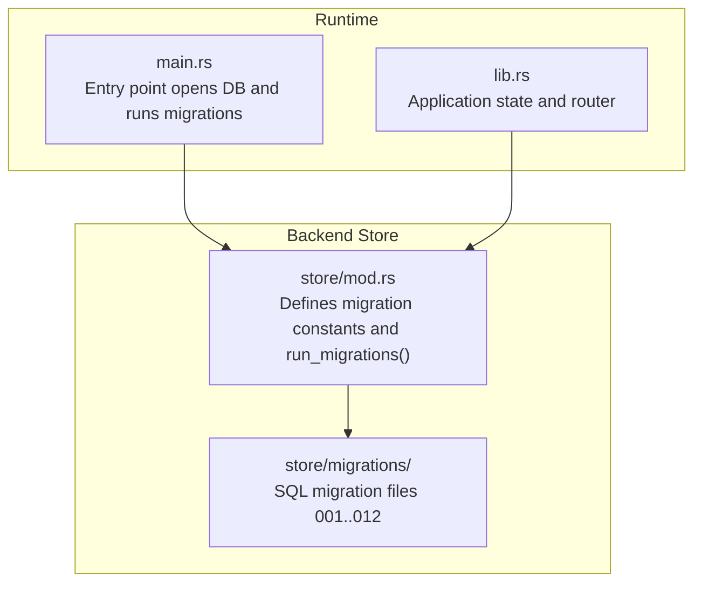
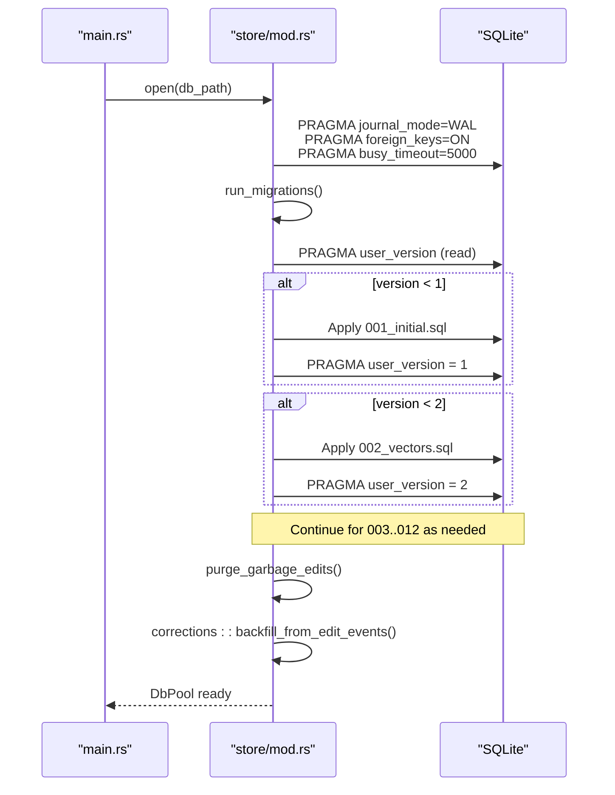
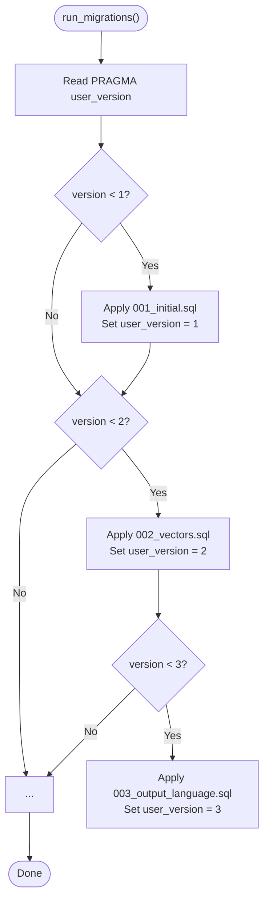
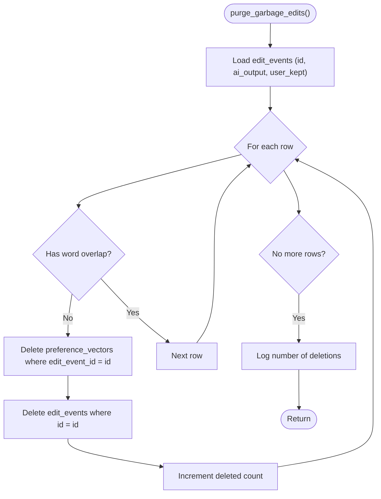
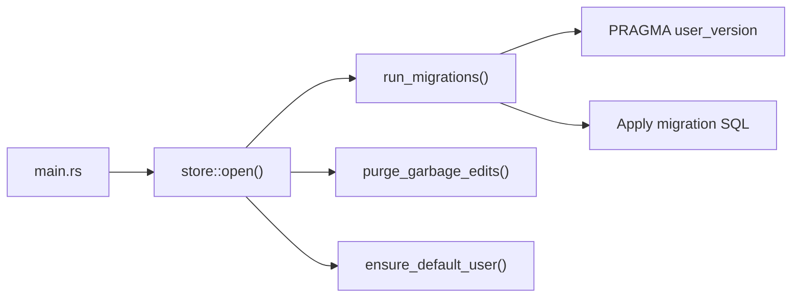

# Schema Migration System

<cite>
**Referenced Files in This Document**
- [crates/backend/src/store/mod.rs](file://crates/backend/src/store/mod.rs)
- [crates/backend/src/store/migrations/001_initial.sql](file://crates/backend/src/store/migrations/001_initial.sql)
- [crates/backend/src/store/migrations/002_vectors.sql](file://crates/backend/src/store/migrations/002_vectors.sql)
- [crates/backend/src/store/migrations/003_output_language.sql](file://crates/backend/src/store/migrations/003_output_language.sql)
- [crates/backend/src/store/migrations/004_api_keys.sql](file://crates/backend/src/store/migrations/004_api_keys.sql)
- [crates/backend/src/store/migrations/005_llm_provider.sql](file://crates/backend/src/store/migrations/005_llm_provider.sql)
- [crates/backend/src/store/migrations/006_openai_oauth.sql](file://crates/backend/src/store/migrations/006_openai_oauth.sql)
- [crates/backend/src/store/migrations/007_pending_edits.sql](file://crates/backend/src/store/migrations/007_pending_edits.sql)
- [crates/backend/src/store/migrations/008_recording_audio_id.sql](file://crates/backend/src/store/migrations/008_recording_audio_id.sql)
- [crates/backend/src/store/migrations/009_word_corrections.sql](file://crates/backend/src/store/migrations/009_word_corrections.sql)
- [crates/backend/src/store/migrations/010_groq_api_key.sql](file://crates/backend/src/store/migrations/010_groq_api_key.sql)
- [crates/backend/src/store/migrations/011_embed_dims_256.sql](file://crates/backend/src/store/migrations/011_embed_dims_256.sql)
- [crates/backend/src/store/migrations/012_vocabulary_and_stt_replacements.sql](file://crates/backend/src/store/migrations/012_vocabulary_and_stt_replacements.sql)
- [crates/backend/src/lib.rs](file://crates/backend/src/lib.rs)
- [crates/backend/src/main.rs](file://crates/backend/src/main.rs)
</cite>

## Table of Contents
1. [Introduction](#introduction)
2. [Project Structure](#project-structure)
3. [Core Components](#core-components)
4. [Architecture Overview](#architecture-overview)
5. [Detailed Component Analysis](#detailed-component-analysis)
6. [Dependency Analysis](#dependency-analysis)
7. [Performance Considerations](#performance-considerations)
8. [Troubleshooting Guide](#troubleshooting-guide)
9. [Conclusion](#conclusion)

## Introduction
This document describes the schema migration system used by the WISPR Hindi Bridge backend. It explains the versioned migration strategy using sequential numbered files (001–012), how migrations are executed automatically during database initialization, and what each migration adds or modifies. It also documents data preservation techniques during schema changes, rollback considerations, error handling, and best practices for extending the migration set.

## Project Structure
The migration system is implemented in the backend crate under the store module. Migrations are pure SQL scripts organized as numbered files and included at compile time. The database is opened and migrated when the backend starts.

**Diagram sources**
- [crates/backend/src/store/mod.rs:19-30](file://crates/backend/src/store/mod.rs#L19-L30)
- [crates/backend/src/main.rs:57](file://crates/backend/src/main.rs#L57)
- [crates/backend/src/lib.rs:203-226](file://crates/backend/src/lib.rs#L203-L226)

**Section sources**
- [crates/backend/src/store/mod.rs:19-30](file://crates/backend/src/store/mod.rs#L19-L30)
- [crates/backend/src/main.rs:57](file://crates/backend/src/main.rs#L57)
- [crates/backend/src/lib.rs:203-226](file://crates/backend/src/lib.rs#L203-L226)

## Core Components
- Migration constants: Compile-time inclusion of each migration script as a static string.
- Migration runner: A function that checks the current schema version via PRAGMA user_version and executes only missing migrations in order.
- Startup tasks: After migrations, the system purges invalid edit events, backfills corrections from edit events, and ensures a default user exists.

Key behaviors:
- Automatic execution during database initialization.
- Versioned execution: only runs migrations whose version is greater than the stored user_version.
- Data preservation: certain migrations preserve user data while updating schema (e.g., adding columns).
- Data rebuilding: a dimension change migration clears incompatible caches and allows natural rebuild.

**Section sources**
- [crates/backend/src/store/mod.rs:32-60](file://crates/backend/src/store/mod.rs#L32-L60)
- [crates/backend/src/store/mod.rs:62-165](file://crates/backend/src/store/mod.rs#L62-L165)
- [crates/backend/src/store/mod.rs:225-271](file://crates/backend/src/store/mod.rs#L225-L271)

## Architecture Overview
The migration pipeline integrates with the application lifecycle. The backend opens the database, sets essential SQLite pragmas, runs migrations, performs cleanup and backfill tasks, and then serves requests.

**Diagram sources**
- [crates/backend/src/main.rs:57](file://crates/backend/src/main.rs#L57)
- [crates/backend/src/store/mod.rs:34-60](file://crates/backend/src/store/mod.rs#L34-L60)
- [crates/backend/src/store/mod.rs:62-165](file://crates/backend/src/store/mod.rs#L62-L165)

## Detailed Component Analysis

### Migration Execution Logic
The migration runner reads PRAGMA user_version and applies each subsequent migration in order until the stored version reaches the latest. Each migration block checks whether the current version is less than the target migration’s version number, applies the SQL, and then updates user_version to that migration number.

Highlights:
- Uses PRAGMA user_version to track applied migrations.
- Applies only missing migrations to avoid redundant work.
- Updates user_version after each successful migration.
- Includes explicit messages for each migration step.

**Diagram sources**
- [crates/backend/src/store/mod.rs:62-165](file://crates/backend/src/store/mod.rs#L62-L165)

**Section sources**
- [crates/backend/src/store/mod.rs:62-165](file://crates/backend/src/store/mod.rs#L62-L165)

### Purge Garbage Edits at Startup
On startup, the system inspects edit_events and removes entries where the user_kept text has no meaningful word overlap with ai_output. It deletes dependent preference_vectors entries first, then the edit_events row itself. This prevents stale placeholder edits from poisoning future retrieval.

**Diagram sources**
- [crates/backend/src/store/mod.rs:225-271](file://crates/backend/src/store/mod.rs#L225-L271)

**Section sources**
- [crates/backend/src/store/mod.rs:225-271](file://crates/backend/src/store/mod.rs#L225-L271)

### Migration Catalog and Purpose

- 001 Initial schema
  - Creates local_user, preferences, recordings, edit_events, embedding_cache.
  - Sets journal_mode=WAL and foreign_keys=ON.
  - Adds indexes for efficient queries.

  **Section sources**
  - [crates/backend/src/store/migrations/001_initial.sql:1-70](file://crates/backend/src/store/migrations/001_initial.sql#L1-L70)

- 002 Vectors table
  - Adds preference_vectors table to cache embeddings as BLOBs.
  - Adds index on user_id for fast filtering.

  **Section sources**
  - [crates/backend/src/store/migrations/002_vectors.sql:1-14](file://crates/backend/src/store/migrations/002_vectors.sql#L1-L14)

- 003 Output language
  - Adds output_language column to preferences with default value.

  **Section sources**
  - [crates/backend/src/store/migrations/003_output_language.sql:1-3](file://crates/backend/src/store/migrations/003_output_language.sql#L1-L3)

- 004 API keys
  - Adds gateway_api_key, deepgram_api_key, gemini_api_key columns to preferences.

  **Section sources**
  - [crates/backend/src/store/migrations/004_api_keys.sql:1-5](file://crates/backend/src/store/migrations/004_api_keys.sql#L1-L5)

- 005 LLM provider
  - Adds llm_provider column to preferences with default value.

  **Section sources**
  - [crates/backend/src/store/migrations/005_llm_provider.sql:1-4](file://crates/backend/src/store/migrations/005_llm_provider.sql#L1-L4)

- 006 OpenAI OAuth
  - Adds openai_oauth table to store access/refresh tokens and expiration.

  **Section sources**
  - [crates/backend/src/store/migrations/006_openai_oauth.sql:1-11](file://crates/backend/src/store/migrations/006_openai_oauth.sql#L1-L11)

- 007 Pending edits
  - Adds pending_edits table for edits awaiting user approval.
  - Adds index for efficient listing.

  **Section sources**
  - [crates/backend/src/store/migrations/007_pending_edits.sql:1-13](file://crates/backend/src/store/migrations/007_pending_edits.sql#L1-L13)

- 008 Recording audio ID
  - Adds audio_id column to recordings.

  **Section sources**
  - [crates/backend/src/store/migrations/008_recording_audio_id.sql:1-2](file://crates/backend/src/store/migrations/008_recording_audio_id.sql#L1-L2)

- 009 Word corrections
  - Adds word_corrections table for explicit word-level substitutions.

  **Section sources**
  - [crates/backend/src/store/migrations/009_word_corrections.sql:1-11](file://crates/backend/src/store/migrations/009_word_corrections.sql#L1-L11)

- 010 Groq API key
  - Adds groq_api_key column to preferences.

  **Section sources**
  - [crates/backend/src/store/migrations/010_groq_api_key.sql:1-4](file://crates/backend/src/store/migrations/010_groq_api_key.sql#L1-L4)

- 011 Embedding dimension change (256)
  - Clears preference_vectors and embedding_cache to switch from 768-dimension to 256-dimension embeddings.
  - Allows natural rebuild of vectors and cache.

  **Section sources**
  - [crates/backend/src/store/migrations/011_embed_dims_256.sql:1-9](file://crates/backend/src/store/migrations/011_embed_dims_256.sql#L1-L9)

- 012 Vocabulary and STT replacements
  - Introduces layered learning architecture:
    - vocabulary table for STT-layer bias terms.
    - stt_replacements table for post-STT literal and phonetic substitutions.
    - edit_events.edit_class column to classify edits.
    - Adds weight and tier columns to word_corrections for improved control.

  **Section sources**
  - [crates/backend/src/store/migrations/012_vocabulary_and_stt_replacements.sql:1-55](file://crates/backend/src/store/migrations/012_vocabulary_and_stt_replacements.sql#L1-L55)

### Data Preservation Techniques
- Column additions: Migrations 003 through 010 add columns to existing tables without dropping data.
- Table additions: New capability tables (openai_oauth, pending_edits, vocabulary, stt_replacements) are created with appropriate constraints and indexes.
- Dimensional change: Migration 011 clears incompatible caches (preference_vectors and embedding_cache) to enable a clean rebuild with new embedding dimensions.
- Indexes: New indexes are added alongside new tables to maintain query performance.

**Section sources**
- [crates/backend/src/store/migrations/003_output_language.sql:1-3](file://crates/backend/src/store/migrations/003_output_language.sql#L1-L3)
- [crates/backend/src/store/migrations/004_api_keys.sql:1-5](file://crates/backend/src/store/migrations/004_api_keys.sql#L1-L5)
- [crates/backend/src/store/migrations/005_llm_provider.sql:1-4](file://crates/backend/src/store/migrations/005_llm_provider.sql#L1-L4)
- [crates/backend/src/store/migrations/006_openai_oauth.sql:1-11](file://crates/backend/src/store/migrations/006_openai_oauth.sql#L1-L11)
- [crates/backend/src/store/migrations/007_pending_edits.sql:1-13](file://crates/backend/src/store/migrations/007_pending_edits.sql#L1-L13)
- [crates/backend/src/store/migrations/008_recording_audio_id.sql:1-2](file://crates/backend/src/store/migrations/008_recording_audio_id.sql#L1-L2)
- [crates/backend/src/store/migrations/009_word_corrections.sql:1-11](file://crates/backend/src/store/migrations/009_word_corrections.sql#L1-L11)
- [crates/backend/src/store/migrations/010_groq_api_key.sql:1-4](file://crates/backend/src/store/migrations/010_groq_api_key.sql#L1-L4)
- [crates/backend/src/store/migrations/011_embed_dims_256.sql:1-9](file://crates/backend/src/store/migrations/011_embed_dims_256.sql#L1-L9)
- [crates/backend/src/store/migrations/012_vocabulary_and_stt_replacements.sql:1-55](file://crates/backend/src/store/migrations/012_vocabulary_and_stt_replacements.sql#L1-L55)

### Rollback Considerations
- The migration system is designed for forward-only evolution. There is no built-in rollback mechanism.
- To “rollback,” you would need to manually downgrade the database to a previous state or recreate the schema from earlier backups. This is not supported by the current implementation.

**Section sources**
- [crates/backend/src/store/mod.rs:62-165](file://crates/backend/src/store/mod.rs#L62-L165)

### Error Handling During Migration Failures
- Migration runner applies each migration inside expect(...) calls, which will panic on failure. This ensures that any SQL error or constraint violation stops startup and alerts operators.
- The system relies on SQLite’s transactional DDL behavior for individual statements within a migration batch.

Recommendations:
- Keep migrations small and focused.
- Test migrations on staging data before deployment.
- Monitor startup logs for migration-related panics.

**Section sources**
- [crates/backend/src/store/mod.rs:72](file://crates/backend/src/store/mod.rs#L72)
- [crates/backend/src/store/mod.rs:80](file://crates/backend/src/store/mod.rs#L80)
- [crates/backend/src/store/mod.rs:88](file://crates/backend/src/store/mod.rs#L88)
- [crates/backend/src/store/mod.rs:96](file://crates/backend/src/store/mod.rs#L96)
- [crates/backend/src/store/mod.rs:104](file://crates/backend/src/store/mod.rs#L104)
- [crates/backend/src/store/mod.rs:112](file://crates/backend/src/store/mod.rs#L112)
- [crates/backend/src/store/mod.rs:120](file://crates/backend/src/store/mod.rs#L120)
- [crates/backend/src/store/mod.rs:128](file://crates/backend/src/store/mod.rs#L128)
- [crates/backend/src/store/mod.rs:136](file://crates/backend/src/store/mod.rs#L136)
- [crates/backend/src/store/mod.rs:144](file://crates/backend/src/store/mod.rs#L144)
- [crates/backend/src/store/mod.rs:152](file://crates/backend/src/store/mod.rs#L152)
- [crates/backend/src/store/mod.rs:160](file://crates/backend/src/store/mod.rs#L160)

### Best Practices for Adding New Migrations
- Name the file sequentially (013_..., 014_...) and keep the filename suffix as .sql.
- Keep each migration minimal and idempotent where possible.
- Add indexes alongside new tables or columns frequently queried.
- Preserve backward compatibility by adding columns with defaults rather than removing or renaming existing ones.
- Document the purpose and impact of the migration in its header comment.
- Test the migration against representative datasets and verify PRAGMA user_version increments correctly.

**Section sources**
- [crates/backend/src/store/mod.rs:19-30](file://crates/backend/src/store/mod.rs#L19-L30)
- [crates/backend/src/store/migrations/012_vocabulary_and_stt_replacements.sql:1-55](file://crates/backend/src/store/migrations/012_vocabulary_and_stt_replacements.sql#L1-L55)

## Dependency Analysis
The migration system depends on:
- SQLite PRAGMA settings for durability and integrity.
- Static inclusion of migration SQL files at compile time.
- The presence of the store module and its public API for opening the database and ensuring default user existence.

**Diagram sources**
- [crates/backend/src/main.rs:57](file://crates/backend/src/main.rs#L57)
- [crates/backend/src/store/mod.rs:34-60](file://crates/backend/src/store/mod.rs#L34-L60)
- [crates/backend/src/store/mod.rs:62-165](file://crates/backend/src/store/mod.rs#L62-L165)

**Section sources**
- [crates/backend/src/main.rs:57](file://crates/backend/src/main.rs#L57)
- [crates/backend/src/store/mod.rs:34-60](file://crates/backend/src/store/mod.rs#L34-L60)
- [crates/backend/src/store/mod.rs:62-165](file://crates/backend/src/store/mod.rs#L62-L165)

## Performance Considerations
- WAL mode and foreign keys are enabled at connection initialization to improve concurrency and data integrity.
- Busy timeout is configured to prevent indefinite blocking during migrations.
- Indexes are added for frequently queried columns (e.g., user_id, timestamps) to maintain query performance across migrations.
- The purge_garbage_edits routine runs once at startup to remove stale data that could otherwise degrade retrieval quality.

**Section sources**
- [crates/backend/src/store/mod.rs:44-46](file://crates/backend/src/store/mod.rs#L44-L46)
- [crates/backend/src/store/mod.rs:225-271](file://crates/backend/src/store/mod.rs#L225-L271)

## Troubleshooting Guide
Common issues and remedies:
- Migration fails with a panic:
  - Inspect the startup logs around the failing migration number.
  - Verify that the migration SQL is syntactically correct and compatible with the current schema.
  - Ensure the database file permissions allow writes.
- user_version not incrementing:
  - Confirm that the migration batch completes successfully and sets PRAGMA user_version to the expected value.
- Stale edit events causing poor suggestions:
  - The purge_garbage_edits routine runs at startup; check logs for deletion counts.
  - If needed, manually verify word overlap logic and adjust as necessary.

**Section sources**
- [crates/backend/src/store/mod.rs:62-165](file://crates/backend/src/store/mod.rs#L62-L165)
- [crates/backend/src/store/mod.rs:225-271](file://crates/backend/src/store/mod.rs#L225-L271)

## Conclusion
The WISPR Hindi Bridge employs a robust, versioned migration system that automatically applies only missing schema changes during startup. It preserves user data where possible, handles dimensional changes carefully, and cleans stale artifacts at runtime. By following the established practices and testing procedures, new migrations can be safely introduced to evolve the schema over time.