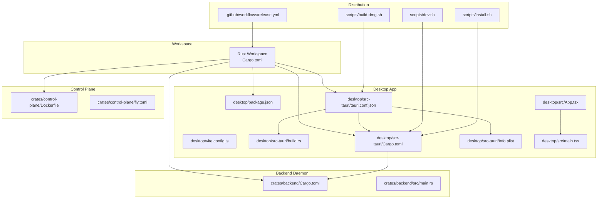
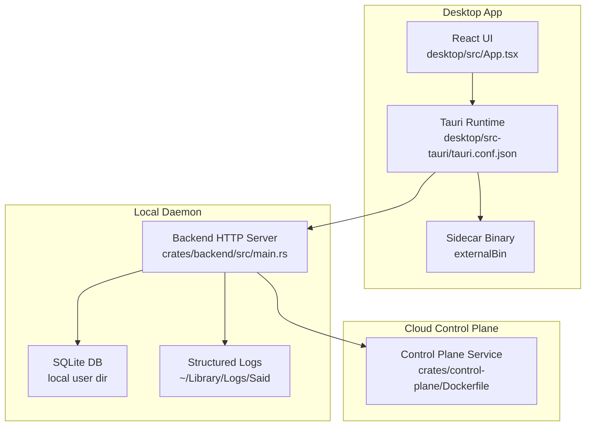
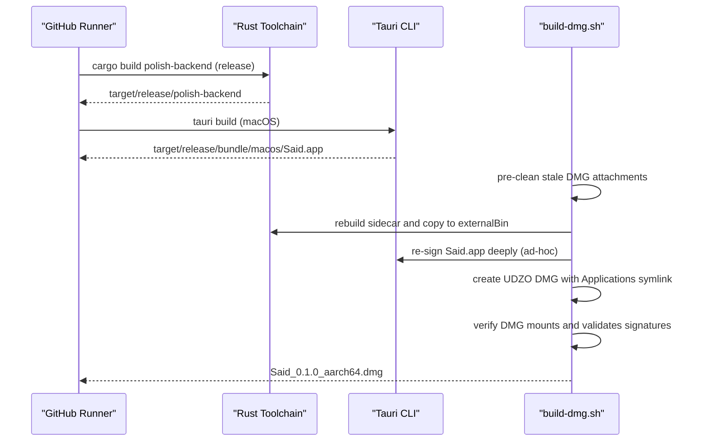
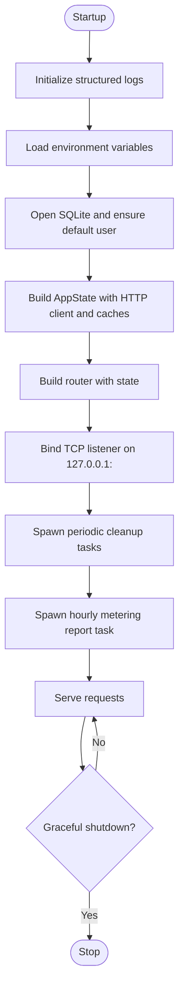
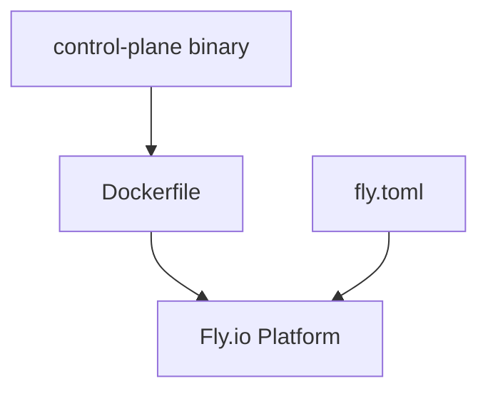
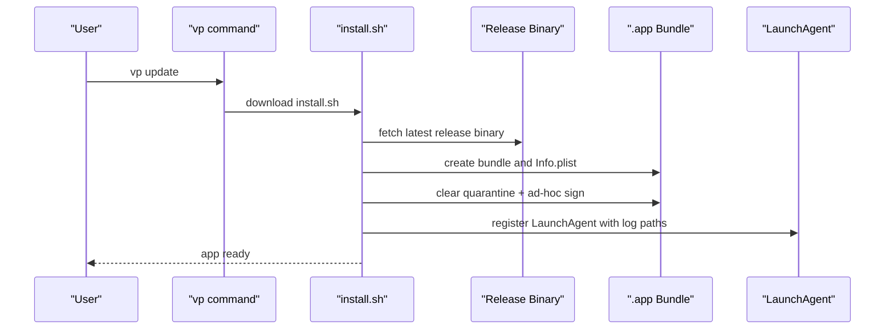
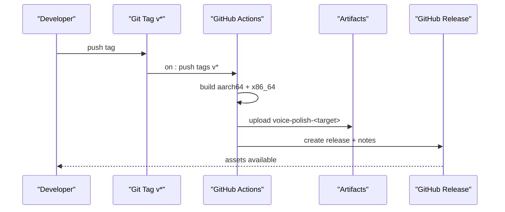
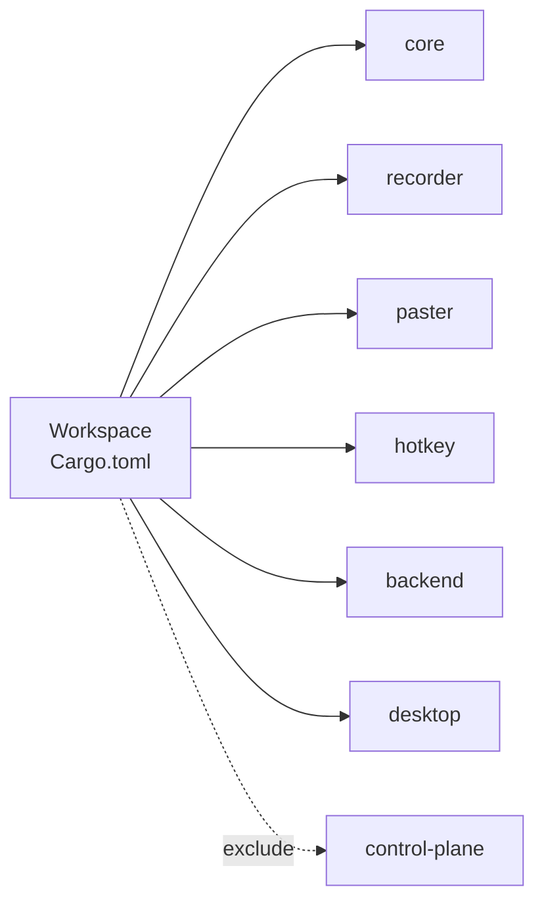

# Deployment and Operations

<cite>
**Referenced Files in This Document**
- [.github/workflows/release.yml](file://.github/workflows/release.yml)
- [Cargo.toml](file://Cargo.toml)
- [desktop/package.json](file://desktop/package.json)
- [desktop/vite.config.js](file://desktop/vite.config.js)
- [desktop/src-tauri/tauri.conf.json](file://desktop/src-tauri/tauri.conf.json)
- [desktop/src-tauri/build.rs](file://desktop/src-tauri/build.rs)
- [desktop/src-tauri/Info.plist](file://desktop/src-tauri/Info.plist)
- [desktop/src-tauri/Cargo.toml](file://desktop/src-tauri/Cargo.toml)
- [scripts/build-dmg.sh](file://scripts/build-dmg.sh)
- [dev.sh](file://dev.sh)
- [install.sh](file://install.sh)
- [crates/backend/Cargo.toml](file://crates/backend/Cargo.toml)
- [crates/backend/src/main.rs](file://crates/backend/src/main.rs)
- [crates/control-plane/Dockerfile](file://crates/control-plane/Dockerfile)
- [crates/control-plane/fly.toml](file://crates/control-plane/fly.toml)
- [desktop/src/App.tsx](file://desktop/src/App.tsx)
- [desktop/src/main.tsx](file://desktop/src/main.tsx)
</cite>

## Table of Contents
1. [Introduction](#introduction)
2. [Project Structure](#project-structure)
3. [Core Components](#core-components)
4. [Architecture Overview](#architecture-overview)
5. [Detailed Component Analysis](#detailed-component-analysis)
6. [Dependency Analysis](#dependency-analysis)
7. [Performance Considerations](#performance-considerations)
8. [Troubleshooting Guide](#troubleshooting-guide)
9. [Conclusion](#conclusion)
10. [Appendices](#appendices)

## Introduction
This document describes the deployment and operations of WISPR Hindi Bridge (“Said”). It covers build and packaging for desktop, distribution channels, CI/CD, monitoring/logging/error tracking, performance monitoring, operational procedures (maintenance releases, rollbacks, incident response), and the control plane service for cloud synchronization and analytics. It is intended for developers, DevOps engineers, and operators who maintain and operate the application.

## Project Structure
The repository is a Rust workspace with:
- A Tauri-based desktop application under desktop/
- A Rust backend daemon under crates/backend/
- A control plane service under crates/control-plane/
- Scripts for development, distribution, and installation under scripts/ and at repo root

**Diagram sources**
- [Cargo.toml:1-30](file://Cargo.toml#L1-L30)
- [desktop/package.json:1-38](file://desktop/package.json#L1-L38)
- [desktop/vite.config.js:1-22](file://desktop/vite.config.js#L1-L22)
- [desktop/src-tauri/tauri.conf.json:1-51](file://desktop/src-tauri/tauri.conf.json#L1-L51)
- [desktop/src-tauri/build.rs:1-4](file://desktop/src-tauri/build.rs#L1-L4)
- [desktop/src-tauri/Cargo.toml:1-53](file://desktop/src-tauri/Cargo.toml#L1-L53)
- [desktop/src-tauri/Info.plist:1-18](file://desktop/src-tauri/Info.plist#L1-L18)
- [desktop/src/App.tsx:1-671](file://desktop/src/App.tsx#L1-L671)
- [desktop/src/main.tsx:1-11](file://desktop/src/main.tsx#L1-L11)
- [crates/backend/Cargo.toml:1-42](file://crates/backend/Cargo.toml#L1-L42)
- [crates/backend/src/main.rs:1-234](file://crates/backend/src/main.rs#L1-L234)
- [crates/control-plane/Dockerfile:1-23](file://crates/control-plane/Dockerfile#L1-L23)
- [crates/control-plane/fly.toml:1-31](file://crates/control-plane/fly.toml#L1-L31)
- [scripts/build-dmg.sh:1-168](file://scripts/build-dmg.sh#L1-L168)
- [dev.sh:1-21](file://dev.sh#L1-L21)
- [install.sh:1-410](file://install.sh#L1-L410)
- [.github/workflows/release.yml:1-55](file://.github/workflows/release.yml#L1-L55)

**Section sources**
- [Cargo.toml:1-30](file://Cargo.toml#L1-L30)
- [desktop/package.json:1-38](file://desktop/package.json#L1-L38)
- [desktop/vite.config.js:1-22](file://desktop/vite.config.js#L1-L22)
- [desktop/src-tauri/tauri.conf.json:1-51](file://desktop/src-tauri/tauri.conf.json#L1-L51)
- [desktop/src-tauri/build.rs:1-4](file://desktop/src-tauri/build.rs#L1-L4)
- [desktop/src-tauri/Cargo.toml:1-53](file://desktop/src-tauri/Cargo.toml#L1-L53)
- [desktop/src-tauri/Info.plist:1-18](file://desktop/src-tauri/Info.plist#L1-L18)
- [desktop/src/App.tsx:1-671](file://desktop/src/App.tsx#L1-L671)
- [desktop/src/main.tsx:1-11](file://desktop/src/main.tsx#L1-L11)
- [crates/backend/Cargo.toml:1-42](file://crates/backend/Cargo.toml#L1-L42)
- [crates/backend/src/main.rs:1-234](file://crates/backend/src/main.rs#L1-L234)
- [crates/control-plane/Dockerfile:1-23](file://crates/control-plane/Dockerfile#L1-L23)
- [crates/control-plane/fly.toml:1-31](file://crates/control-plane/fly.toml#L1-L31)
- [scripts/build-dmg.sh:1-168](file://scripts/build-dmg.sh#L1-L168)
- [dev.sh:1-21](file://dev.sh#L1-L21)
- [install.sh:1-410](file://install.sh#L1-L410)
- [.github/workflows/release.yml:1-55](file://.github/workflows/release.yml#L1-L55)

## Core Components
- Desktop application: React + Tauri UI packaged with a Rust backend daemon. The desktop app is configured via tauri.conf.json and bundles a sidecar binary from the backend crate.
- Backend daemon: A local HTTP server exposing routes for history, preferences, feedback, and voice processing. It writes structured logs to a user-specific log file and periodically reports usage metrics to the cloud.
- Control plane service: A separate Rust service containerized for deployment to Fly.io, handling cloud auth, health, license, and metering endpoints.
- Distribution assets: A shell script builds a DMG with a stable ad-hoc signature and verifies deep signing; a developer helper script keeps the sidecar in sync; an installer script manages a standalone .app bundle and LaunchAgent lifecycle.

**Section sources**
- [desktop/src-tauri/tauri.conf.json:1-51](file://desktop/src-tauri/tauri.conf.json#L1-L51)
- [crates/backend/src/main.rs:18-145](file://crates/backend/src/main.rs#L18-L145)
- [crates/control-plane/Dockerfile:1-23](file://crates/control-plane/Dockerfile#L1-L23)
- [crates/control-plane/fly.toml:1-31](file://crates/control-plane/fly.toml#L1-L31)
- [scripts/build-dmg.sh:1-168](file://scripts/build-dmg.sh#L1-L168)
- [dev.sh:1-21](file://dev.sh#L1-L21)
- [install.sh:1-410](file://install.sh#L1-L410)

## Architecture Overview
The desktop app communicates with the local backend daemon over localhost. The backend interacts with cloud services for analytics and optional cloud features. The control plane service provides cloud endpoints consumed by the backend.

**Diagram sources**
- [desktop/src/App.tsx:1-671](file://desktop/src/App.tsx#L1-L671)
- [desktop/src-tauri/tauri.conf.json:1-51](file://desktop/src-tauri/tauri.conf.json#L1-L51)
- [crates/backend/src/main.rs:18-145](file://crates/backend/src/main.rs#L18-L145)
- [crates/control-plane/Dockerfile:1-23](file://crates/control-plane/Dockerfile#L1-L23)

## Detailed Component Analysis

### Desktop Application Packaging and Signing
- Tauri configuration defines product metadata, bundling targets, icons, external sidecar, and macOS minimum system version and Info.plist location.
- The sidecar binary is built from the backend crate and copied into the Tauri externalBin slot for inclusion in the .app bundle.
- A dedicated DMG build script performs pre-cleanup of stale hdiutil attachments, builds the backend sidecar, signs deeply with an ad-hoc signature, stages a clean DMG, and verifies end-to-end mountability and signature validity.

**Diagram sources**
- [scripts/build-dmg.sh:1-168](file://scripts/build-dmg.sh#L1-L168)
- [desktop/src-tauri/tauri.conf.json:31-49](file://desktop/src-tauri/tauri.conf.json#L31-L49)

**Section sources**
- [desktop/src-tauri/tauri.conf.json:1-51](file://desktop/src-tauri/tauri.conf.json#L1-L51)
- [scripts/build-dmg.sh:1-168](file://scripts/build-dmg.sh#L1-L168)

### Local Backend Daemon
- The backend is a Tokio-based HTTP server that:
  - Initializes structured logging to a user-specific log file.
  - Loads environment variables and sets up a SQLite connection pool.
  - Exposes routes for preferences, history, feedback, and voice processing.
  - Periodically cleans up old recordings and audio files.
  - Sends hourly metering reports to the cloud when a cloud token is present.
  - Supports graceful shutdown on signals.

**Diagram sources**
- [crates/backend/src/main.rs:18-145](file://crates/backend/src/main.rs#L18-L145)

**Section sources**
- [crates/backend/src/main.rs:18-145](file://crates/backend/src/main.rs#L18-L145)

### Control Plane Service (Cloud)
- The control plane is a Rust binary packaged in a multi-stage Dockerfile and deployed to Fly.io via fly.toml.
- It exposes health, auth, license, and metering endpoints and is intended to be colocated with the backend for analytics reporting.

**Diagram sources**
- [crates/control-plane/Dockerfile:1-23](file://crates/control-plane/Dockerfile#L1-L23)
- [crates/control-plane/fly.toml:1-31](file://crates/control-plane/fly.toml#L1-L31)

**Section sources**
- [crates/control-plane/Dockerfile:1-23](file://crates/control-plane/Dockerfile#L1-L23)
- [crates/control-plane/fly.toml:1-31](file://crates/control-plane/fly.toml#L1-L31)

### Distribution and Installation
- Standalone installer script:
  - Downloads the latest release binary by architecture.
  - Creates a .app bundle with a minimal Info.plist.
  - Clears quarantine and ad-hoc signs the bundle to preserve permissions across updates.
  - Registers a LaunchAgent to auto-start the app and redirects stdout/stderr to log files.
  - Provides a vp command for start/stop/status/logs/errors/doctor/update/delete.
- DMG distribution:
  - The build-dmg.sh script creates a standard UDZO DMG with an Applications symlink for drag-to-install, ensuring deep ad-hoc signature validation.

**Diagram sources**
- [install.sh:1-410](file://install.sh#L1-L410)

**Section sources**
- [install.sh:1-410](file://install.sh#L1-L410)
- [scripts/build-dmg.sh:1-168](file://scripts/build-dmg.sh#L1-L168)

### CI/CD Pipeline
- GitHub Actions workflow:
  - Triggers on pushing a semantic version tag.
  - Builds the backend for macOS targets (aarch64/x86_64) with Rust stable toolchain.
  - Uploads the resulting binaries as artifacts.
  - Creates a GitHub Release with generated release notes and attaches the artifacts.

**Diagram sources**
- [.github/workflows/release.yml:1-55](file://.github/workflows/release.yml#L1-L55)

**Section sources**
- [.github/workflows/release.yml:1-55](file://.github/workflows/release.yml#L1-L55)

## Dependency Analysis
- Workspace configuration:
  - The workspace aggregates core, recorder, paster, hotkey, backend, and desktop crates. The control-plane crate is intentionally excluded from the workspace to avoid dependency conflicts and is built separately.
  - A shared profile.release optimizes for small binary size with LTO and symbol stripping.
- Desktop dependencies:
  - Tauri 2 runtime, notification plugin, platform-specific hotkey support on macOS, and React UI with Vite.
- Backend dependencies:
  - Axum web framework, SQLite with rusqlite, HTTP client, tracing, and CLI parsing.
- Control plane dependencies:
  - Containerized build with a minimal runtime image and exposed port.

**Diagram sources**
- [Cargo.toml:1-30](file://Cargo.toml#L1-L30)

**Section sources**
- [Cargo.toml:1-30](file://Cargo.toml#L1-L30)
- [desktop/src-tauri/Cargo.toml:1-53](file://desktop/src-tauri/Cargo.toml#L1-L53)
- [crates/backend/Cargo.toml:1-42](file://crates/backend/Cargo.toml#L1-L42)

## Performance Considerations
- Binary size and startup:
  - Release profile enables opt-level “z”, LTO, and strip to minimize binary size and improve cold-start characteristics.
- Logging and I/O:
  - Backend writes structured logs to a dedicated file; ensure disk I/O is considered in constrained environments.
- Network concurrency:
  - Backend’s HTTP client is configured with idle pools and timeouts; adjust as needed for network conditions.
- UI responsiveness:
  - Frontend uses React with event-driven updates; keep rendering paths lightweight and avoid unnecessary re-renders.

[No sources needed since this section provides general guidance]

## Troubleshooting Guide
- Permissions not persisting after updates:
  - Ensure ad-hoc signature is applied to the .app bundle so TCC tracks by bundle ID rather than binary hash.
  - Use the installer script’s ad-hoc signing and LaunchAgent registration.
- DMG build failures:
  - The build-dmg.sh script pre-detaches stale DMG attachments and rebuilds the sidecar; re-run the script to resolve transient hdiutil issues.
- Local daemon not reachable:
  - Confirm the backend is listening on 127.0.0.1:<port>; check logs in ~/Library/Logs/Said/backend.log.
- Cloud metering not reporting:
  - Verify cloud token presence and connectivity; the backend sends hourly reports when a token is present.
- Frontend not updating after permission changes:
  - The UI polls snapshots periodically; wait a few seconds or trigger a refresh to reflect permission state.

**Section sources**
- [scripts/build-dmg.sh:1-168](file://scripts/build-dmg.sh#L1-L168)
- [install.sh:1-410](file://install.sh#L1-L410)
- [crates/backend/src/main.rs:18-145](file://crates/backend/src/main.rs#L18-L145)
- [desktop/src/App.tsx:307-320](file://desktop/src/App.tsx#L307-L320)

## Conclusion
WISPR Hindi Bridge combines a Tauri desktop app with a local backend daemon and a cloud control plane service. The build and distribution pipeline emphasizes reproducible macOS packaging with ad-hoc signatures, robust CI/CD release automation, and a user-friendly installer with LaunchAgent integration. Monitoring and logging are built-in, with structured logs and periodic metering to the cloud. Operational procedures cover maintenance releases, permission persistence, and incident response.

[No sources needed since this section summarizes without analyzing specific files]

## Appendices

### Build and Packaging Reference
- Desktop packaging:
  - tauri.conf.json: product, bundle, externalBin, macOS signing identity, and Info.plist.
  - build-dmg.sh: DMG creation, deep ad-hoc signing, verification.
- Developer workflow:
  - dev.sh: builds backend and syncs sidecar for Tauri dev.
- Distribution:
  - install.sh: installs .app, registers LaunchAgent, manages logs, and provides vp command.

**Section sources**
- [desktop/src-tauri/tauri.conf.json:1-51](file://desktop/src-tauri/tauri.conf.json#L1-L51)
- [scripts/build-dmg.sh:1-168](file://scripts/build-dmg.sh#L1-L168)
- [dev.sh:1-21](file://dev.sh#L1-L21)
- [install.sh:1-410](file://install.sh#L1-L410)

### Monitoring and Logging Strategies
- Backend structured logs:
  - Logs are written to a user-specific file path and initialized with an environment filter.
- Frontend telemetry:
  - The UI subscribes to Tauri events for state, status, tokens, and errors; displays actionable toasts and banners.
- Cloud analytics:
  - Hourly metering reports are sent to the control plane when a cloud token is present.

**Section sources**
- [crates/backend/src/main.rs:20-39](file://crates/backend/src/main.rs#L20-L39)
- [desktop/src/App.tsx:199-305](file://desktop/src/App.tsx#L199-L305)

### Error Tracking Implementation
- Frontend:
  - Error banners and toasts capture and surface errors from Tauri commands and event handlers.
- Backend:
  - Structured logs include timestamps and severity; use log aggregation tools to correlate events.
- Installer:
  - The vp command exposes logs and errors via /tmp/voice-polish.log and /tmp/voice-polish.err.

**Section sources**
- [desktop/src/App.tsx:650-667](file://desktop/src/App.tsx#L650-L667)
- [crates/backend/src/main.rs:20-39](file://crates/backend/src/main.rs#L20-L39)
- [install.sh:197-267](file://install.sh#L197-L267)

### Performance Monitoring Approaches
- Backend:
  - Track request latency, error rates, and resource usage via logs and external monitoring.
- Frontend:
  - Observe UI responsiveness and event throughput; reduce unnecessary re-renders and heavy computations.
- Network:
  - Monitor HTTP client idle timeouts and pool saturation; adjust as needed.

[No sources needed since this section provides general guidance]

### Operational Procedures
- Maintenance releases:
  - Tag a new semantic version; the CI job builds and uploads artifacts; the installer script fetches the latest release.
- Rollback:
  - Re-run the installer with the previous release tag or pin the vp command to a known-good version.
- Incident response:
  - Collect backend logs, frontend error logs, and DMG verification output; reproduce with ad-hoc signing enabled.

**Section sources**
- [.github/workflows/release.yml:1-55](file://.github/workflows/release.yml#L1-L55)
- [install.sh:246-256](file://install.sh#L246-L256)