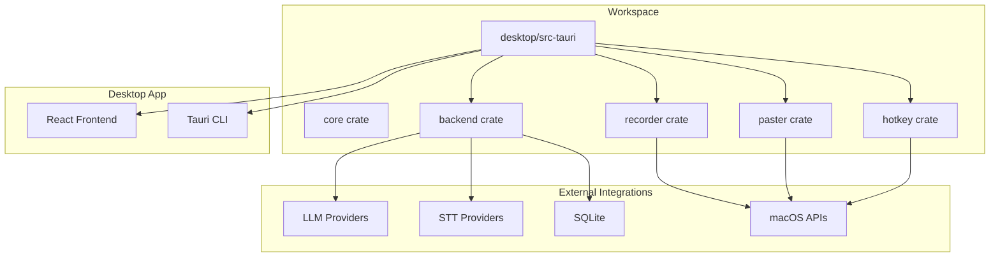
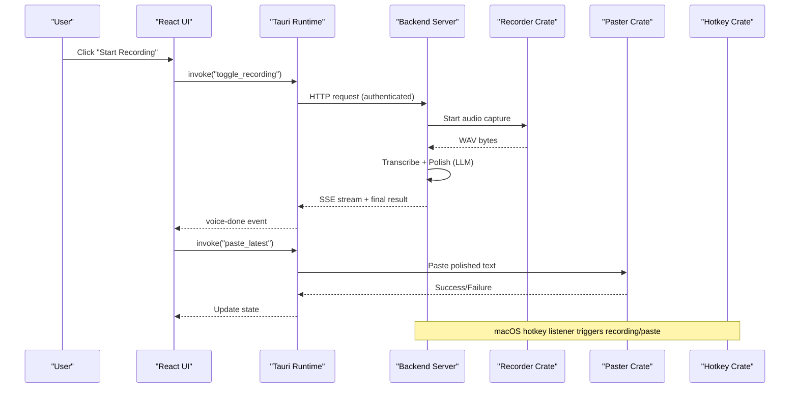
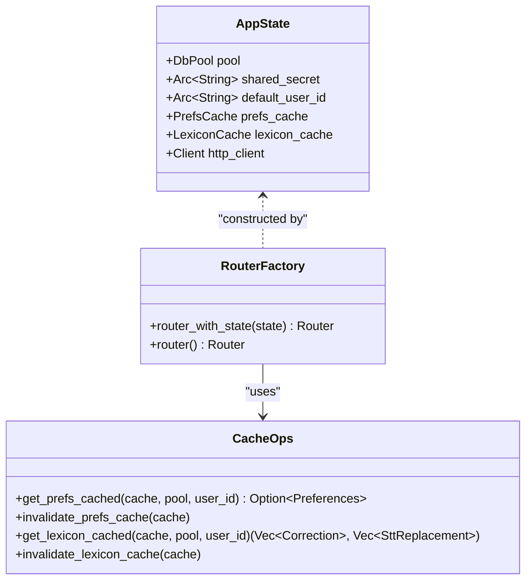
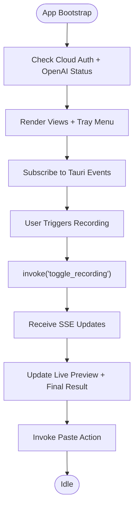
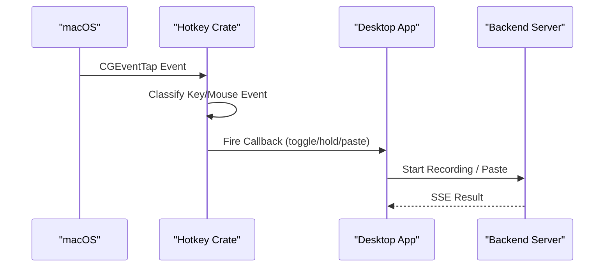
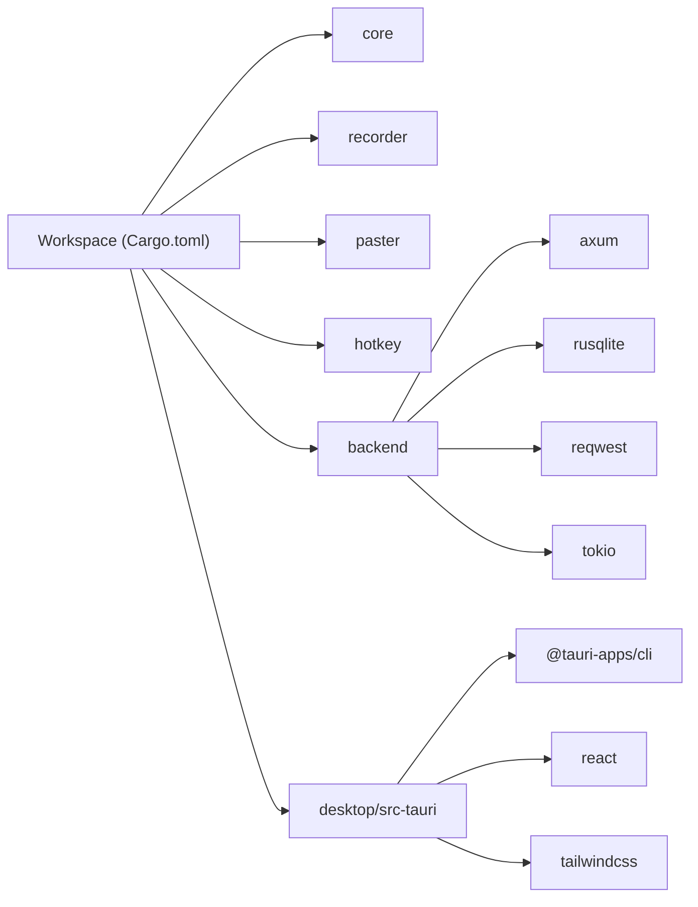

# Development and Contributing

<cite>
**Referenced Files in This Document**
- [Cargo.toml](file://Cargo.toml)
- [dev.sh](file://dev.sh)
- [install.sh](file://install.sh)
- [package.json](file://desktop/package.json)
- [release.yml](file://.github/workflows/release.yml)
- [crates/backend/Cargo.toml](file://crates/backend/Cargo.toml)
- [crates/backend/src/lib.rs](file://crates/backend/src/lib.rs)
- [crates/backend/src/main.rs](file://crates/backend/src/main.rs)
- [crates/core/src/lib.rs](file://crates/core/src/lib.rs)
- [crates/recorder/src/lib.rs](file://crates/recorder/src/lib.rs)
- [crates/paster/src/lib.rs](file://crates/paster/src/lib.rs)
- [crates/hotkey/src/lib.rs](file://crates/hotkey/src/lib.rs)
- [desktop/src-tauri/src/main.rs](file://desktop/src-tauri/src/main.rs)
- [desktop/src/App.tsx](file://desktop/src/App.tsx)
</cite>

## Table of Contents
1. [Introduction](#introduction)
2. [Project Structure](#project-structure)
3. [Core Components](#core-components)
4. [Architecture Overview](#architecture-overview)
5. [Detailed Component Analysis](#detailed-component-analysis)
6. [Dependency Analysis](#dependency-analysis)
7. [Performance Considerations](#performance-considerations)
8. [Testing Strategy](#testing-strategy)
9. [Development Environment Setup](#development-environment-setup)
10. [Build Instructions](#build-instructions)
11. [Debugging Configuration](#debugging-configuration)
12. [Code Organization Principles](#code-organization-principles)
13. [Coding Standards](#coding-standards)
14. [Documentation Guidelines](#documentation-guidelines)
15. [Pull Request Process](#pull-request-process)
16. [Release Workflow](#release-workflow)
17. [Continuous Integration](#continuous-integration)
18. [Deployment Procedures](#deployment-procedures)
19. [Common Development Tasks](#common-development-tasks)
20. [Contribution Guidelines](#contribution-guidelines)
21. [Issue Reporting Process](#issue-reporting-process)
22. [Community Engagement Practices](#community-engagement-practices)
23. [Troubleshooting Guide](#troubleshooting-guide)
24. [Conclusion](#conclusion)

## Introduction
WISPR Hindi Bridge is a cross-platform desktop application that combines a Rust-powered backend with a Tauri/React frontend to deliver voice-to-text polishing and editing capabilities. It integrates native macOS features for accessibility, input monitoring, and hotkey handling, while leveraging AI providers for speech-to-text and language model processing. The project emphasizes modular architecture, performance, and developer productivity through a well-defined workspace and build system.

## Project Structure
The repository follows a workspace-first organization with clear separation of concerns:
- Workspace: A Cargo workspace coordinates multiple crates and a Tauri desktop application.
- Crates: Core libraries for shared data types, recording, pasting, and hotkey handling.
- Backend: A Rust Axum-based HTTP server exposing REST endpoints for voice/text processing, preferences, history, and vocabulary.
- Desktop: A Tauri application with React/TypeScript frontend and Tailwind CSS styling.
- Landing: A Next.js marketing site for product awareness.
- Scripts: Automation for development and release packaging.

**Diagram sources**
- [Cargo.toml:1-30](file://Cargo.toml#L1-L30)
- [crates/backend/src/lib.rs:148-199](file://crates/backend/src/lib.rs#L148-L199)
- [desktop/src-tauri/src/main.rs:1-100](file://desktop/src-tauri/src/main.rs#L1-L100)

**Section sources**
- [Cargo.toml:1-30](file://Cargo.toml#L1-L30)
- [crates/backend/Cargo.toml:1-42](file://crates/backend/Cargo.toml#L1-L42)

## Core Components
- Core library: Defines shared data types, constants, and environment loading utilities used across crates.
- Recorder: Handles audio capture, resampling, and WAV generation for downstream processing.
- Paster: Implements clipboard and paste operations with Accessibility support on macOS and cross-platform clipboard handling elsewhere.
- Hotkey: Provides macOS CGEventTap-based hotkey listeners for toggle and hold-to-record modes, plus edit detection via keystroke buffering.
- Backend: Exposes REST endpoints for voice/text polishing, preferences, history, vocabulary, and cloud integration.
- Desktop: Orchestrates UI, state synchronization, and Tauri command bindings between frontend and backend.

**Section sources**
- [crates/core/src/lib.rs:1-130](file://crates/core/src/lib.rs#L1-L130)
- [crates/recorder/src/lib.rs:1-235](file://crates/recorder/src/lib.rs#L1-L235)
- [crates/paster/src/lib.rs:1-800](file://crates/paster/src/lib.rs#L1-L800)
- [crates/hotkey/src/lib.rs:1-596](file://crates/hotkey/src/lib.rs#L1-L596)
- [crates/backend/src/lib.rs:1-227](file://crates/backend/src/lib.rs#L1-L227)
- [desktop/src-tauri/src/main.rs:1-800](file://desktop/src-tauri/src/main.rs#L1-L800)

## Architecture Overview
The system architecture centers around a local backend service that the desktop application communicates with via HTTP. Native functionality (recording, pasting, hotkeys) is integrated through dedicated crates and Tauri plugins. The frontend renders views, manages state, and triggers backend operations through Tauri commands.

**Diagram sources**
- [desktop/src/App.tsx:200-320](file://desktop/src/App.tsx#L200-L320)
- [desktop/src-tauri/src/main.rs:744-800](file://desktop/src-tauri/src/main.rs#L744-L800)
- [crates/backend/src/lib.rs:148-199](file://crates/backend/src/lib.rs#L148-L199)

**Section sources**
- [desktop/src/App.tsx:1-671](file://desktop/src/App.tsx#L1-L671)
- [desktop/src-tauri/src/main.rs:1-800](file://desktop/src-tauri/src/main.rs#L1-L800)
- [crates/backend/src/lib.rs:1-227](file://crates/backend/src/lib.rs#L1-L227)

## Detailed Component Analysis

### Backend Server
The backend is an Axum-based HTTP server that:
- Manages application state including database pools, preference caches, and HTTP clients.
- Exposes authenticated routes for voice/text polishing, preferences, history, vocabulary, and cloud integration.
- Implements caching strategies for preferences and lexicon to reduce database load.
- Runs periodic tasks for cleanup and metering reports.

**Diagram sources**
- [crates/backend/src/lib.rs:135-146](file://crates/backend/src/lib.rs#L135-L146)
- [crates/backend/src/lib.rs:148-226](file://crates/backend/src/lib.rs#L148-L226)

**Section sources**
- [crates/backend/src/lib.rs:1-227](file://crates/backend/src/lib.rs#L1-L227)
- [crates/backend/src/main.rs:1-234](file://crates/backend/src/main.rs#L1-L234)

### Desktop Application
The desktop app orchestrates UI rendering, state management, and Tauri command bindings. It:
- Bootstraps the application snapshot and checks authentication and connectivity.
- Listens to real-time events from the backend for status updates and results.
- Manages tray menus, settings, and navigation.
- Integrates with native crates for recording, pasting, and hotkey handling.

**Diagram sources**
- [desktop/src/App.tsx:129-320](file://desktop/src/App.tsx#L129-L320)
- [desktop/src-tauri/src/main.rs:602-750](file://desktop/src-tauri/src/main.rs#L602-L750)

**Section sources**
- [desktop/src/App.tsx:1-671](file://desktop/src/App.tsx#L1-L671)
- [desktop/src-tauri/src/main.rs:1-800](file://desktop/src-tauri/src/main.rs#L1-L800)

### Native Functionality: Recorder, Paster, Hotkey
- Recorder: Captures audio via CPAL, resamples to 16 kHz, and produces WAV data for transcription.
- Paster: Uses Accessibility APIs on macOS to read and modify text in applications, with clipboard fallbacks.
- Hotkey: Listens for system-wide hotkeys via CGEventTap, supports toggle and hold-to-record modes, and buffers keystrokes for edit detection.

**Diagram sources**
- [crates/hotkey/src/lib.rs:384-596](file://crates/hotkey/src/lib.rs#L384-L596)
- [crates/recorder/src/lib.rs:69-218](file://crates/recorder/src/lib.rs#L69-L218)
- [crates/paster/src/lib.rs:214-513](file://crates/paster/src/lib.rs#L214-L513)

**Section sources**
- [crates/recorder/src/lib.rs:1-235](file://crates/recorder/src/lib.rs#L1-L235)
- [crates/paster/src/lib.rs:1-800](file://crates/paster/src/lib.rs#L1-L800)
- [crates/hotkey/src/lib.rs:1-596](file://crates/hotkey/src/lib.rs#L1-L596)

## Dependency Analysis
The workspace defines shared dependency versions and build profiles, while individual crates declare their specific dependencies. The backend integrates with SQLite for persistence and HTTP clients for external services. The desktop application depends on Tauri and React ecosystem packages.

**Diagram sources**
- [Cargo.toml:16-30](file://Cargo.toml#L16-L30)
- [crates/backend/Cargo.toml:14-42](file://crates/backend/Cargo.toml#L14-L42)
- [package.json:12-37](file://desktop/package.json#L12-L37)

**Section sources**
- [Cargo.toml:1-30](file://Cargo.toml#L1-L30)
- [crates/backend/Cargo.toml:1-42](file://crates/backend/Cargo.toml#L1-L42)
- [package.json:1-38](file://desktop/package.json#L1-L38)

## Performance Considerations
- Backend build profile optimizes for size and speed with LTO and symbol stripping.
- Caching strategies reduce database queries for preferences and lexicon.
- Shared HTTP client maintains persistent connections to minimize overhead.
- Audio resampling reduces payload sizes for transcription services.
- Asynchronous processing and background tasks prevent UI blocking.

[No sources needed since this section provides general guidance]

## Testing Strategy
- Unit tests: Implemented within crates for core logic (e.g., recorder resampling, hotkey event classification).
- Integration tests: Validate backend endpoints and database interactions.
- End-to-end testing: Manual verification of recording, transcription, polishing, and paste flows; automated UI tests recommended for critical user journeys.
- CI testing: GitHub Actions workflow builds and tests releases across targets.

[No sources needed since this section provides general guidance]

## Development Environment Setup
Prerequisites:
- Rust toolchain (nightly recommended for development)
- Node.js and npm for the desktop frontend
- Xcode command-line tools for macOS native integrations

Recommended setup steps:
- Install Rust via rustup and ensure the stable toolchain is available.
- Install Node.js and npm; verify with node --version and npm --version.
- Install Xcode command-line tools for macOS native dependencies.
- Clone the repository and initialize submodules if applicable.

**Section sources**
- [Cargo.toml:1-30](file://Cargo.toml#L1-L30)
- [package.json:1-38](file://desktop/package.json#L1-L38)

## Build Instructions
Development build:
- Use the provided development script to build the backend and synchronize the binary for Tauri.
- Run the desktop development server via npm scripts.

Production build:
- Build the backend with release profile and package the desktop application for distribution.
- The release workflow automates cross-compilation and artifact creation.

**Section sources**
- [dev.sh:1-21](file://dev.sh#L1-L21)
- [release.yml:28-41](file://.github/workflows/release.yml#L28-L41)

## Debugging Configuration
- Backend logging: Structured logs are written to a dedicated log file with environment filtering.
- Frontend logging: Console output and Tauri event logs provide visibility into UI state and backend communication.
- macOS permissions: Use diagnostic tools and installer scripts to verify Accessibility, Input Monitoring, and microphone permissions.

**Section sources**
- [crates/backend/src/main.rs:20-50](file://crates/backend/src/main.rs#L20-L50)
- [install.sh:382-410](file://install.sh#L382-L410)

## Code Organization Principles
- Workspace-first: Centralized dependency management and shared versions.
- Feature-based crates: Separate concerns into core, recorder, paster, and hotkey crates.
- Layered backend: Clear separation between HTTP routing, business logic, and persistence.
- Tauri integration: Minimal frontend logic with robust command bindings.

**Section sources**
- [Cargo.toml:1-30](file://Cargo.toml#L1-L30)
- [crates/backend/src/lib.rs:1-227](file://crates/backend/src/lib.rs#L1-L227)

## Coding Standards
- Rust: Follow idiomatic patterns, use async/await, and maintain thread safety for shared state.
- TypeScript/React: Use functional components, hooks, and strict typing.
- Logging: Prefer structured logging with tracing and consistent directive usage.
- Error handling: Propagate errors with context and avoid silent failures.

[No sources needed since this section provides general guidance]

## Documentation Guidelines
- Inline comments: Explain complex logic and trade-offs.
- Module-level docs: Describe purpose and public interfaces.
- README updates: Reflect changes in setup, build, and usage.
- Diagrams: Include Mermaid diagrams for architecture and flows.

[No sources needed since this section provides general guidance]

## Pull Request Process
- Branch naming: Use descriptive names indicating feature or fix.
- Commits: Keep commits atomic and well-scoped.
- Review: Request reviews from maintainers; address feedback promptly.
- Tests: Ensure tests pass locally and CI checks succeed.
- Changelog: Summarize user-visible changes in PR description.

[No sources needed since this section provides general guidance]

## Release Workflow
- Tagging: Create semantic version tags (e.g., v1.2.3).
- CI: GitHub Actions builds for multiple targets and uploads artifacts.
- Packaging: Artifacts are attached to the release with generated notes.

**Section sources**
- [release.yml:1-55](file://.github/workflows/release.yml#L1-L55)

## Continuous Integration
- Jobs: Matrix builds for macOS targets with Rust toolchain installation.
- Steps: Checkout, install toolchain, build, package, and upload artifacts.
- Permissions: Artifact upload permissions configured for release publishing.

**Section sources**
- [release.yml:11-55](file://.github/workflows/release.yml#L11-L55)

## Deployment Procedures
- Local deployment: Use the installer script to deploy and configure the application on macOS.
- Production deployment: Distribute packaged binaries and ensure proper permissions and signing.

**Section sources**
- [install.sh:1-410](file://install.sh#L1-L410)

## Common Development Tasks

### Adding a New AI Provider
- Define provider-specific modules under the backend’s LLM subsystem.
- Integrate HTTP client calls and response parsing.
- Update routing and authentication as needed.
- Add configuration and environment variables for credentials.

**Section sources**
- [crates/backend/src/lib.rs:13-18](file://crates/backend/src/lib.rs#L13-L18)
- [crates/backend/Cargo.toml:14-42](file://crates/backend/Cargo.toml#L14-L42)

### Extending Native Functionality
- Recorder: Modify capture configuration or add new resampling logic.
- Paster: Extend text reading strategies or improve clipboard handling.
- Hotkey: Add new key combinations or refine event classification.

**Section sources**
- [crates/recorder/src/lib.rs:1-235](file://crates/recorder/src/lib.rs#L1-L235)
- [crates/paster/src/lib.rs:1-800](file://crates/paster/src/lib.rs#L1-L800)
- [crates/hotkey/src/lib.rs:1-596](file://crates/hotkey/src/lib.rs#L1-L596)

### Modifying UI Components
- React components: Update TypeScript/JSX and Tailwind classes.
- Tauri commands: Ensure command signatures and event handlers remain consistent.
- State management: Keep snapshots and event subscriptions synchronized.

**Section sources**
- [desktop/src/App.tsx:1-671](file://desktop/src/App.tsx#L1-L671)
- [desktop/src-tauri/src/main.rs:602-750](file://desktop/src-tauri/src/main.rs#L602-L750)

## Contribution Guidelines
- Fork and branch from the default branch.
- Follow coding standards and include tests.
- Submit PRs with clear descriptions and screenshots where applicable.
- Engage respectfully in discussions and reviews.

[No sources needed since this section provides general guidance]

## Issue Reporting Process
- Search existing issues to avoid duplicates.
- Provide environment details, reproduction steps, and expected vs. actual behavior.
- Include logs and relevant configuration snippets.

[No sources needed since this section provides general guidance]

## Community Engagement Practices
- Respond to issues and PRs in a timely manner.
- Encourage newcomers with guidance and examples.
- Recognize contributions and maintain a welcoming environment.

[No sources needed since this section provides general guidance]

## Troubleshooting Guide
- Backend logs: Inspect the structured log file for errors and warnings.
- macOS permissions: Use diagnostic commands and installer prompts to verify permissions.
- Network connectivity: Ensure API keys and endpoints are reachable.
- Audio issues: Verify microphone permissions and device availability.

**Section sources**
- [crates/backend/src/main.rs:20-50](file://crates/backend/src/main.rs#L20-L50)
- [install.sh:269-325](file://install.sh#L269-L325)

## Conclusion
WISPR Hindi Bridge provides a robust foundation for voice-driven text polishing with a modular architecture, native macOS integrations, and a responsive desktop interface. By following the development practices outlined here—workspace organization, build and release procedures, testing strategies, and contribution guidelines—you can effectively contribute to and extend the project.