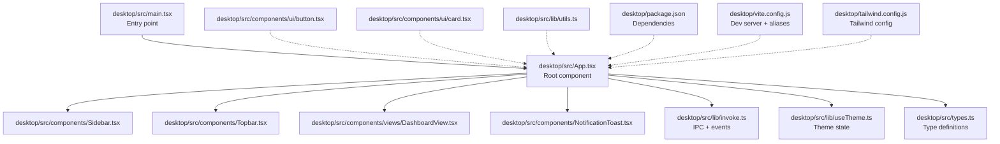
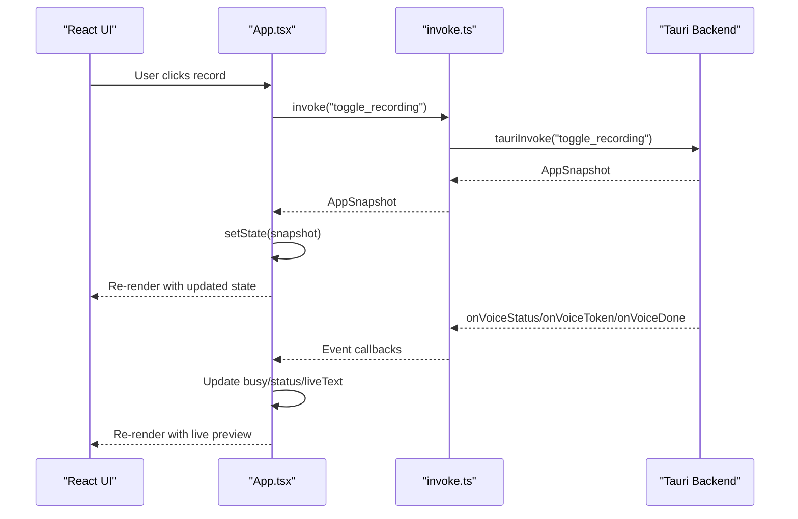
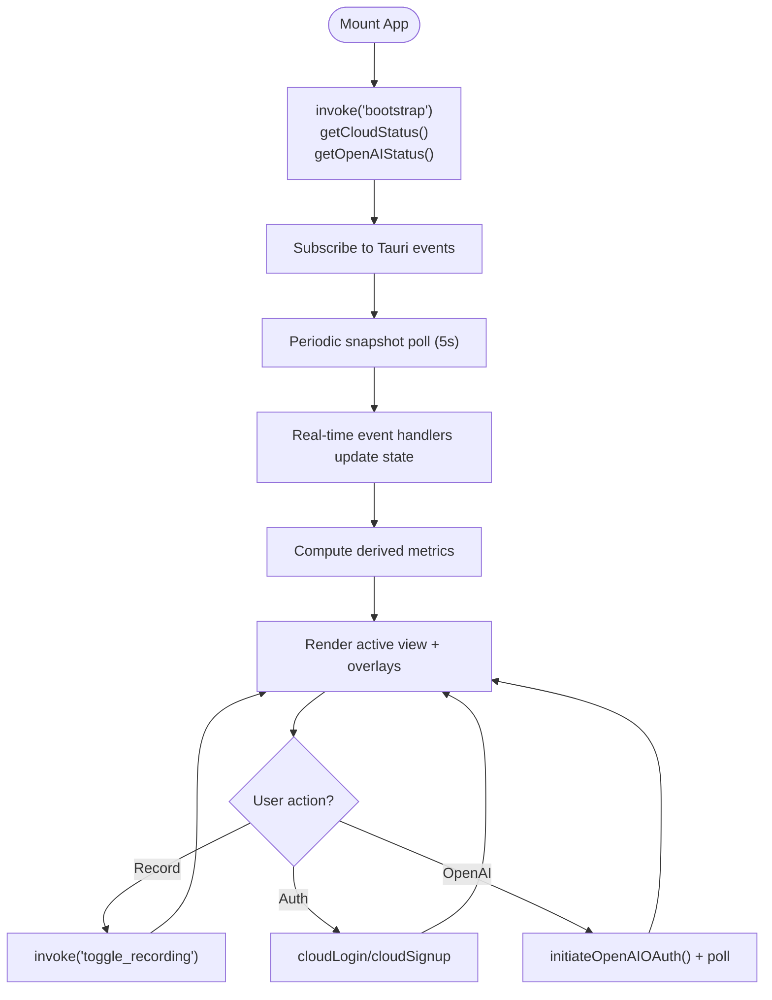
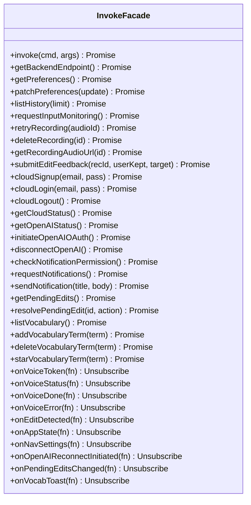
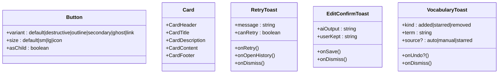
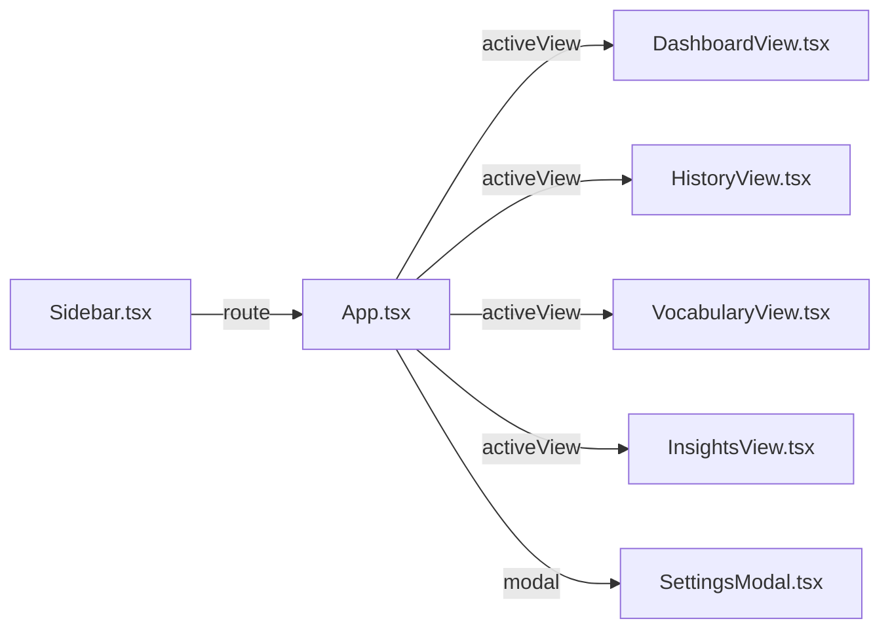
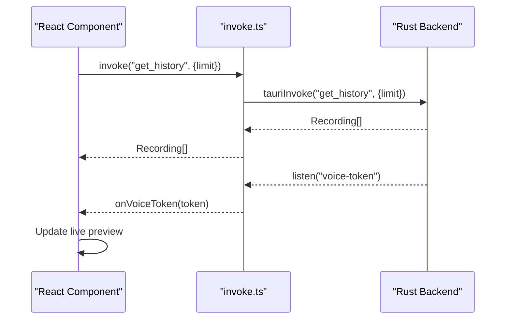
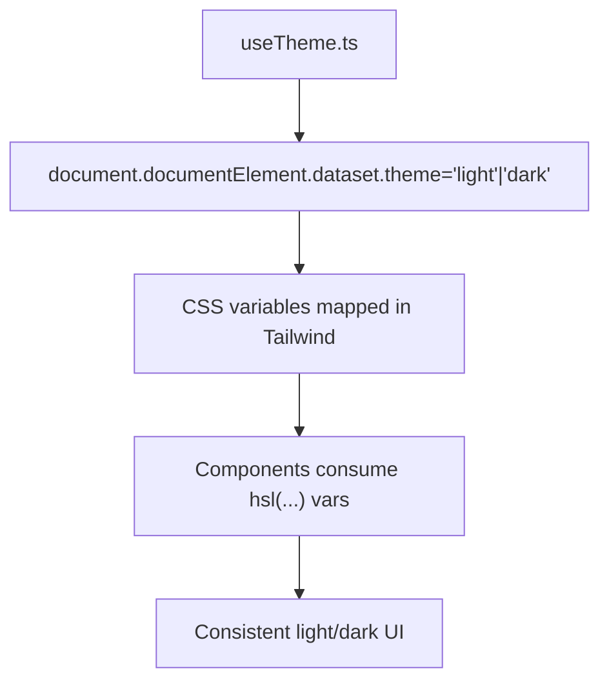
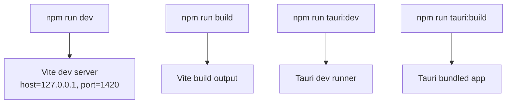
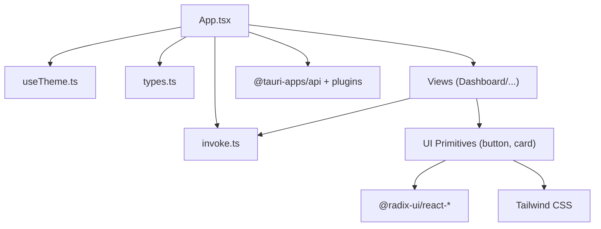

# Frontend Application

<cite>
**Referenced Files in This Document**
- [main.tsx](file://desktop/src/main.tsx)
- [App.tsx](file://desktop/src/App.tsx)
- [invoke.ts](file://desktop/src/lib/invoke.ts)
- [useTheme.ts](file://desktop/src/lib/useTheme.ts)
- [types.ts](file://desktop/src/types.ts)
- [Sidebar.tsx](file://desktop/src/components/Sidebar.tsx)
- [Topbar.tsx](file://desktop/src/components/Topbar.tsx)
- [DashboardView.tsx](file://desktop/src/components/views/DashboardView.tsx)
- [button.tsx](file://desktop/src/components/ui/button.tsx)
- [card.tsx](file://desktop/src/components/ui/card.tsx)
- [NotificationToast.tsx](file://desktop/src/components/NotificationToast.tsx)
- [utils.ts](file://desktop/src/lib/utils.ts)
- [package.json](file://desktop/package.json)
- [vite.config.js](file://desktop/vite.config.js)
- [tailwind.config.js](file://desktop/tailwind.config.js)
</cite>

## Table of Contents
1. [Introduction](#introduction)
2. [Project Structure](#project-structure)
3. [Core Components](#core-components)
4. [Architecture Overview](#architecture-overview)
5. [Detailed Component Analysis](#detailed-component-analysis)
6. [Dependency Analysis](#dependency-analysis)
7. [Performance Considerations](#performance-considerations)
8. [Troubleshooting Guide](#troubleshooting-guide)
9. [Conclusion](#conclusion)
10. [Appendices](#appendices)

## Introduction
This document describes the React-based desktop frontend for the application. It covers the component hierarchy, state management patterns, event handling architecture, and the Tauri integration that enables communication between the React frontend and the Rust backend. It also documents the UI component catalog, view system, styling architecture, theme system, responsive design, accessibility, build process, and the synchronization between frontend state and backend data.

## Project Structure
The desktop frontend is organized around a small set of core files and a clear separation of concerns:
- Entry point initializes the React root and mounts the App.
- App orchestrates global state, Tauri event subscriptions, and renders the active view.
- A thin invoke abstraction encapsulates Tauri IPC and event listeners, with a mock fallback for non-Tauri environments.
- Views and UI components are modular and reusable.
- Styling leverages Tailwind CSS with a custom theme and Radix UI primitives.

**Diagram sources**
- [main.tsx:1-11](file://desktop/src/main.tsx#L1-L11)
- [App.tsx:1-671](file://desktop/src/App.tsx#L1-L671)
- [invoke.ts:1-667](file://desktop/src/lib/invoke.ts#L1-L667)
- [useTheme.ts:1-33](file://desktop/src/lib/useTheme.ts#L1-L33)
- [types.ts:1-247](file://desktop/src/types.ts#L1-L247)
- [Sidebar.tsx:1-348](file://desktop/src/components/Sidebar.tsx#L1-L348)
- [Topbar.tsx:1-87](file://desktop/src/components/Topbar.tsx#L1-L87)
- [DashboardView.tsx:1-260](file://desktop/src/components/views/DashboardView.tsx#L1-L260)
- [button.tsx:1-59](file://desktop/src/components/ui/button.tsx#L1-L59)
- [card.tsx:1-71](file://desktop/src/components/ui/card.tsx#L1-L71)
- [NotificationToast.tsx:1-319](file://desktop/src/components/NotificationToast.tsx#L1-L319)
- [utils.ts:1-7](file://desktop/src/lib/utils.ts#L1-L7)
- [package.json:1-38](file://desktop/package.json#L1-L38)
- [vite.config.js:1-22](file://desktop/vite.config.js#L1-L22)
- [tailwind.config.js:1-45](file://desktop/tailwind.config.js#L1-L45)

**Section sources**
- [main.tsx:1-11](file://desktop/src/main.tsx#L1-L11)
- [package.json:1-38](file://desktop/package.json#L1-L38)
- [vite.config.js:1-22](file://desktop/vite.config.js#L1-L22)
- [tailwind.config.js:1-45](file://desktop/tailwind.config.js#L1-L45)

## Core Components
- App: Central orchestrator managing global state, Tauri bootstrapping, real-time event subscriptions, navigation, and rendering the active view. It computes derived metrics (streak, totals, WPM) and passes them down to child components.
- Sidebar: Left navigation with general sections, status card, and footer actions. Integrates with Tauri drag regions and handles navigation.
- Topbar: Right-aligned controls including theme toggle, notifications, and mode indicator. Uses drag regions for window movement.
- DashboardView: Primary view displaying stats, live transcription preview, pending edits, and recent recordings. Handles accessibility prompts and navigation to history.
- NotificationToast: In-app toasts for retry, edit confirmation, and vocabulary actions with auto-dismiss and undo support.
- invoke: Unified IPC facade wrapping Tauri commands and event listeners, with a mock implementation for non-Tauri runs.
- useTheme: Theme persistence and synchronization with document dataset and localStorage.
- UI primitives: Button and Card components built on Radix UI and Tailwind, with consistent variants and sizes.

**Section sources**
- [App.tsx:80-671](file://desktop/src/App.tsx#L80-L671)
- [Sidebar.tsx:145-348](file://desktop/src/components/Sidebar.tsx#L145-L348)
- [Topbar.tsx:13-87](file://desktop/src/components/Topbar.tsx#L13-L87)
- [DashboardView.tsx:32-260](file://desktop/src/components/views/DashboardView.tsx#L32-L260)
- [NotificationToast.tsx:15-319](file://desktop/src/components/NotificationToast.tsx#L15-L319)
- [invoke.ts:204-667](file://desktop/src/lib/invoke.ts#L204-L667)
- [useTheme.ts:7-33](file://desktop/src/lib/useTheme.ts#L7-L33)
- [button.tsx:6-59](file://desktop/src/components/ui/button.tsx#L6-L59)
- [card.tsx:4-71](file://desktop/src/components/ui/card.tsx#L4-L71)

## Architecture Overview
The frontend follows a unidirectional data flow:
- App bootstraps the app snapshot and subscribes to Tauri events.
- Event handlers update React state, which drives UI re-rendering.
- User interactions call invoke-bound commands to the backend.
- Derived data (history totals, streaks, WPM) is computed in App and passed to views.

**Diagram sources**
- [App.tsx:200-342](file://desktop/src/App.tsx#L200-L342)
- [invoke.ts:344-418](file://desktop/src/lib/invoke.ts#L344-L418)

**Section sources**
- [App.tsx:129-342](file://desktop/src/App.tsx#L129-L342)
- [invoke.ts:204-418](file://desktop/src/lib/invoke.ts#L204-L418)

## Detailed Component Analysis

### App Component
- Responsibilities:
  - Initialize and refresh history.
  - Manage auth and OpenAI connection gates.
  - Subscribe to Tauri events (app-state, voice status/token/done/error, edits, pending edits, vocab toast, tray navigation).
  - Periodically poll snapshot for permission changes.
  - Compute derived metrics and pass them to children.
  - Render modals (invite, settings) and toasts conditionally.
- State management:
  - Local React state for UI state, toasts, pending edits, and auth gating.
  - Snapshot-derived props for child components.
- Event handling:
  - Subscriptions are established on mount and cleaned up on unmount.
  - Handlers update state and trigger re-renders.

**Diagram sources**
- [App.tsx:129-320](file://desktop/src/App.tsx#L129-L320)

**Section sources**
- [App.tsx:80-671](file://desktop/src/App.tsx#L80-L671)

### invoke Abstraction
- Purpose: Provide a unified interface for Tauri IPC and event listening, with a mock fallback for non-Tauri environments.
- Key areas:
  - Command wrappers: bootstrap, toggle_recording, get_history, request_accessibility, request_input_monitoring, retry_recording, delete_recording, get_recording_audio_url, submit_edit_feedback, get_backend_endpoint, get_preferences, patch_preferences, cloud_* and OpenAI OAuth commands, notifications, pending edits, vocabulary.
  - Event listeners: onVoiceToken, onVoiceStatus, onVoiceDone, onVoiceError, onEditDetected, onAppState, onNavSettings, onOpenAIReconnectInitiated, onPendingEditsChanged, onVocabToast.
  - Detection: isTauriRuntime() determines runtime and switches between Tauri and mock implementations.

**Diagram sources**
- [invoke.ts:204-667](file://desktop/src/lib/invoke.ts#L204-L667)

**Section sources**
- [invoke.ts:191-667](file://desktop/src/lib/invoke.ts#L191-L667)

### UI Component Catalog
- Button (variants and sizes):
  - Variants: default, destructive, outline, secondary, ghost, link.
  - Sizes: default, sm, lg, icon.
  - Built with Radix Slot and class variance authority for consistent styling.
- Card (layout primitives):
  - Card, CardHeader, CardTitle, CardDescription, CardContent, CardFooter.
  - Tailwind-based with semantic roles and consistent spacing.
- NotificationToast:
  - RetryToast: retry, open history, dismiss; supports disabled retry when no audioId.
  - EditConfirmToast: diff preview, save or skip.
  - VocabularyToast: added/starred/removed with optional undo and auto-dismiss.

**Diagram sources**
- [button.tsx:6-59](file://desktop/src/components/ui/button.tsx#L6-L59)
- [card.tsx:4-71](file://desktop/src/components/ui/card.tsx#L4-L71)
- [NotificationToast.tsx:15-319](file://desktop/src/components/NotificationToast.tsx#L15-L319)

**Section sources**
- [button.tsx:1-59](file://desktop/src/components/ui/button.tsx#L1-L59)
- [card.tsx:1-71](file://desktop/src/components/ui/card.tsx#L1-L71)
- [NotificationToast.tsx:1-319](file://desktop/src/components/NotificationToast.tsx#L1-L319)

### View System
- DashboardView: Shows hero stats, pace, donut distribution, time saved, activity heatmap, recent recordings, and accessibility prompt. Supports pending edits review and live transcription preview.
- HistoryView, VocabularyView, InsightsView, SettingsView: Rendered as views; Settings is now a modal.
- Navigation: Sidebar routes to views; clicking “settings” opens the Settings modal instead of navigating.

**Diagram sources**
- [Sidebar.tsx:27-32](file://desktop/src/components/Sidebar.tsx#L27-L32)
- [App.tsx:372-384](file://desktop/src/App.tsx#L372-L384)

**Section sources**
- [DashboardView.tsx:32-260](file://desktop/src/components/views/DashboardView.tsx#L32-L260)
- [Sidebar.tsx:27-32](file://desktop/src/components/Sidebar.tsx#L27-L32)
- [App.tsx:372-384](file://desktop/src/App.tsx#L372-L384)

### Tauri Integration and IPC
- IPC Commands:
  - App lifecycle: bootstrap, get_snapshot, toggle_recording, request_accessibility, request_input_monitoring.
  - History: get_history, retry_recording, delete_recording, get_recording_audio_url.
  - Preferences: get_preferences, patch_preferences, get_backend_endpoint.
  - Cloud: cloud_signup, cloud_login, cloud_logout, get_cloud_status.
  - OpenAI OAuth: get_openai_status, initiate_openai_oauth, disconnect_openai.
  - Notifications: check_notification_permission, request_notifications, send_notification.
  - Pending edits: get_pending_edits, resolve_pending_edit, onPendingEditsChanged.
  - Vocabulary: list_vocabulary, add_vocabulary_term, delete_vocabulary_term, star_vocabulary_term, onVocabularyChanged, onVocabToast.
- Events:
  - voice-token, voice-status, voice-done, voice-error, edit-detected, app-state, nav-settings, openai-reconnect-initiated, pending-edits-changed, vocab-toast.
- Runtime detection:
  - isTauriRuntime() switches between Tauri invoke and mock invoke.

**Diagram sources**
- [invoke.ts:248-256](file://desktop/src/lib/invoke.ts#L248-L256)
- [invoke.ts:344-353](file://desktop/src/lib/invoke.ts#L344-L353)

**Section sources**
- [invoke.ts:204-667](file://desktop/src/lib/invoke.ts#L204-L667)

### Styling Architecture and Theme System
- Tailwind CSS:
  - Uses CSS variables for theme tokens (background, foreground, card, muted, etc.) and dynamic safelist entries to avoid purging.
  - Provides custom animations (e.g., pulse-orb) and radius variables.
- Radix UI:
  - Components like Button and Card integrate with Tailwind classes for consistent styling.
- Theme:
  - useTheme persists theme in localStorage and applies it to document.documentElement.dataset.theme.
  - Topbar integrates ThemeToggle to switch themes.

**Diagram sources**
- [useTheme.ts:17-32](file://desktop/src/lib/useTheme.ts#L17-L32)
- [tailwind.config.js:10-45](file://desktop/tailwind.config.js#L10-L45)

**Section sources**
- [tailwind.config.js:1-45](file://desktop/tailwind.config.js#L1-L45)
- [button.tsx:6-59](file://desktop/src/components/ui/button.tsx#L6-L59)
- [card.tsx:4-71](file://desktop/src/components/ui/card.tsx#L4-L71)
- [Topbar.tsx:13-87](file://desktop/src/components/Topbar.tsx#L13-L87)

### Responsive Design and Accessibility
- Responsive patterns:
  - Grid-based stat cards with auto-fit columns adapt to viewport width.
  - Scroll areas for content overflow.
  - Drag regions for window movement on supported platforms.
- Accessibility:
  - Drag regions use data-tauri-drag-region.
  - Focus-visible styles via Tailwind focus rings on interactive elements.
  - Semantic markup with Radix UI primitives.

**Section sources**
- [DashboardView.tsx:187-201](file://desktop/src/components/views/DashboardView.tsx#L187-L201)
- [Sidebar.tsx:159-164](file://desktop/src/components/Sidebar.tsx#L159-L164)
- [Topbar.tsx:17-21](file://desktop/src/components/Topbar.tsx#L17-L21)

### Build Process and Development Workflow
- Scripts:
  - dev, build, tauri:dev, tauri:build.
- Dev server:
  - Vite with React plugin, TypeScript path aliases (@ -> src), host/port configuration.
- Dependencies:
  - React, Radix UI, Tailwind, Lucide icons, Tauri APIs and plugins.

**Diagram sources**
- [package.json:6-11](file://desktop/package.json#L6-L11)
- [vite.config.js:16-21](file://desktop/vite.config.js#L16-L21)

**Section sources**
- [package.json:1-38](file://desktop/package.json#L1-L38)
- [vite.config.js:1-22](file://desktop/vite.config.js#L1-L22)

## Dependency Analysis
- Internal dependencies:
  - App depends on invoke, useTheme, types, and view components.
  - Views depend on invoke for data and UI primitives.
  - UI primitives depend on Radix UI and Tailwind utilities.
- External dependencies:
  - Tauri core and notification plugin for native integrations.
  - Radix UI for accessible component primitives.
  - Tailwind for utility-first styling.

**Diagram sources**
- [App.tsx:1-40](file://desktop/src/App.tsx#L1-L40)
- [invoke.ts:1-16](file://desktop/src/lib/invoke.ts#L1-L16)
- [button.tsx:1-5](file://desktop/src/components/ui/button.tsx#L1-L5)
- [card.tsx:1-3](file://desktop/src/components/ui/card.tsx#L1-L3)

**Section sources**
- [App.tsx:1-40](file://desktop/src/App.tsx#L1-L40)
- [invoke.ts:1-16](file://desktop/src/lib/invoke.ts#L1-L16)
- [button.tsx:1-5](file://desktop/src/components/ui/button.tsx#L1-L5)
- [card.tsx:1-3](file://desktop/src/components/ui/card.tsx#L1-L3)

## Performance Considerations
- Minimize re-renders:
  - Use memoization and useCallback for event handlers and derived computations.
  - Keep heavy computations outside render paths (e.g., streak calculation).
- Efficient event subscriptions:
  - Clean up listeners on unmount to prevent leaks.
- Virtualization:
  - Consider virtualizing long lists (history/recording tables) if performance becomes a concern.
- Asset bundling:
  - Use Vite’s built-in code splitting and lazy loading for views if needed.

## Troubleshooting Guide
- Tauri runtime detection:
  - If UI appears blank or commands fail, verify isTauriRuntime() behavior and ensure Tauri is available in production builds.
- Event subscriptions:
  - Confirm event listeners are registered and unsubscribed properly; check for unhandled errors in event handlers.
- Permissions:
  - Accessibility and input monitoring prompts require explicit user grants; guide users to System Settings when permissions are denied.
- Network and OAuth:
  - OpenAI OAuth requires a working browser session; poll for status and surface timeouts clearly.
- Notifications:
  - Respect platform permission states; request permissions when needed and handle “denied” state gracefully.

**Section sources**
- [invoke.ts:191-200](file://desktop/src/lib/invoke.ts#L191-L200)
- [App.tsx:200-305](file://desktop/src/App.tsx#L200-L305)
- [NotificationToast.tsx:508-540](file://desktop/src/components/NotificationToast.tsx#L508-L540)

## Conclusion
The frontend is a modular, event-driven React application integrated with Tauri for native capabilities. It uses a clean separation of concerns, a robust IPC abstraction, and a consistent styling system with Tailwind and Radix UI. The App component centralizes state and event handling, while views and UI primitives remain reusable and testable. The architecture supports responsive design, theming, and accessibility, and the build system is straightforward with Vite and Tauri CLI.

## Appendices

### Type Definitions Overview
- AppSnapshot: application state, modes, history, totals, and derived metrics.
- Preferences and PrefsUpdate: user preferences and partial updates.
- Recording and HistoryItem: backend storage and display representations.
- Cloud and OpenAI status types: connection and credential states.
- PendingEdit and related: learning review payloads.
- Utilities: grouping history into timeline buckets.

**Section sources**
- [types.ts:32-247](file://desktop/src/types.ts#L32-L247)