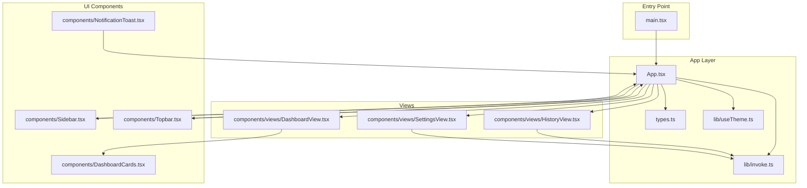
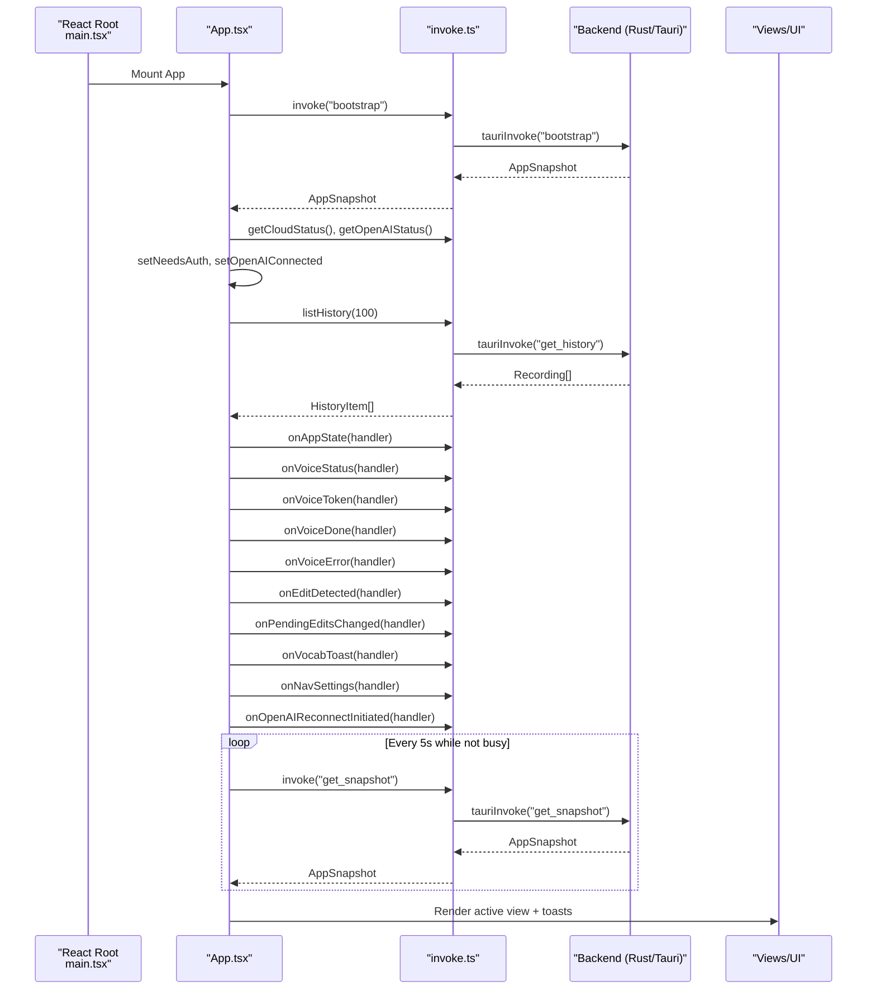
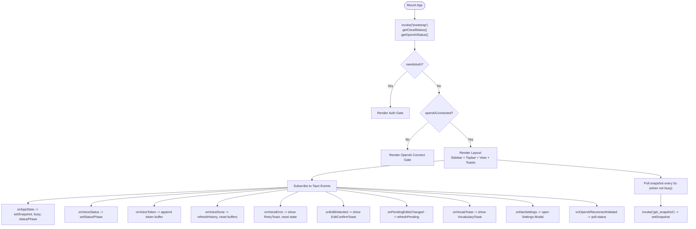
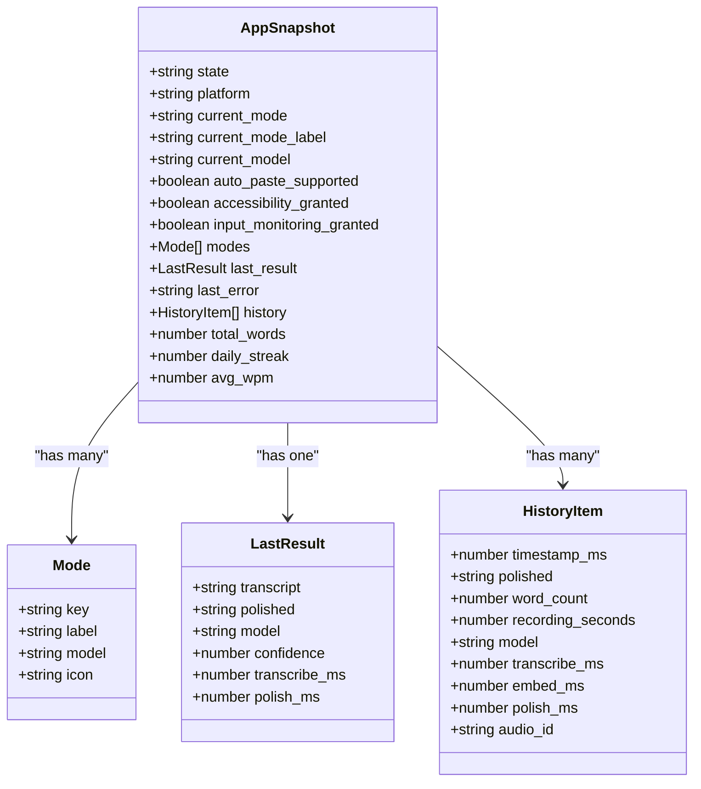
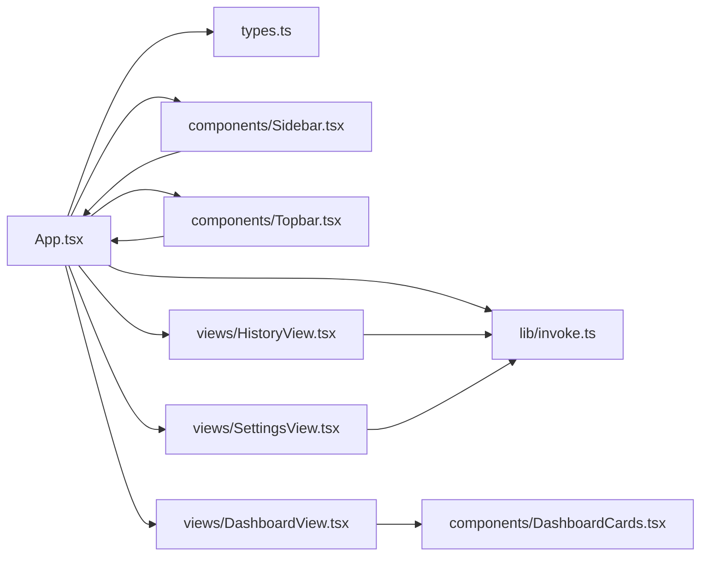

# React Application Architecture

<cite>
**Referenced Files in This Document**
- [App.tsx](file://desktop/src/App.tsx)
- [main.tsx](file://desktop/src/main.tsx)
- [types.ts](file://desktop/src/types.ts)
- [invoke.ts](file://desktop/src/lib/invoke.ts)
- [Sidebar.tsx](file://desktop/src/components/Sidebar.tsx)
- [Topbar.tsx](file://desktop/src/components/Topbar.tsx)
- [DashboardView.tsx](file://desktop/src/components/views/DashboardView.tsx)
- [HistoryView.tsx](file://desktop/src/components/views/HistoryView.tsx)
- [SettingsView.tsx](file://desktop/src/components/views/SettingsView.tsx)
- [DashboardCards.tsx](file://desktop/src/components/DashboardCards.tsx)
- [NotificationToast.tsx](file://desktop/src/components/NotificationToast.tsx)
- [useTheme.ts](file://desktop/src/lib/useTheme.ts)
- [utils.ts](file://desktop/src/lib/utils.ts)
</cite>

## Table of Contents
1. [Introduction](#introduction)
2. [Project Structure](#project-structure)
3. [Core Components](#core-components)
4. [Architecture Overview](#architecture-overview)
5. [Detailed Component Analysis](#detailed-component-analysis)
6. [Dependency Analysis](#dependency-analysis)
7. [Performance Considerations](#performance-considerations)
8. [Troubleshooting Guide](#troubleshooting-guide)
9. [Conclusion](#conclusion)

## Introduction
This document explains the React application architecture for the desktop client. It covers the component hierarchy starting from the root App component, state management patterns using React hooks, the application state flow from backend snapshots to frontend rendering, the event-driven architecture with Tauri event subscriptions, component composition and prop passing, authentication and permissions, real-time status updates, and error handling and user feedback mechanisms.

## Project Structure
The desktop client is a React application bootstrapped with Vite and styled with Tailwind CSS. The entry point initializes the React root and mounts the App component. The App orchestrates global state, integrates with the backend via Tauri commands and events, and composes views and UI components.

**Diagram sources**
- [main.tsx:1-11](file://desktop/src/main.tsx#L1-L11)
- [App.tsx:1-671](file://desktop/src/App.tsx#L1-L671)
- [types.ts:1-247](file://desktop/src/types.ts#L1-L247)
- [invoke.ts:1-667](file://desktop/src/lib/invoke.ts#L1-L667)
- [Sidebar.tsx:1-348](file://desktop/src/components/Sidebar.tsx#L1-L348)
- [Topbar.tsx:1-87](file://desktop/src/components/Topbar.tsx#L1-L87)
- [DashboardView.tsx:1-260](file://desktop/src/components/views/DashboardView.tsx#L1-L260)
- [HistoryView.tsx:1-314](file://desktop/src/components/views/HistoryView.tsx#L1-L314)
- [SettingsView.tsx:1-800](file://desktop/src/components/views/SettingsView.tsx#L1-L800)
- [DashboardCards.tsx:1-800](file://desktop/src/components/DashboardCards.tsx#L1-L800)
- [NotificationToast.tsx:1-319](file://desktop/src/components/NotificationToast.tsx#L1-L319)

**Section sources**
- [main.tsx:1-11](file://desktop/src/main.tsx#L1-L11)
- [App.tsx:1-671](file://desktop/src/App.tsx#L1-L671)

## Core Components
- Root App component: Orchestrates global state, lifecycle initialization, Tauri event subscriptions, authentication gates, and renders the sidebar, topbar, active view, and toasts.
- Views: DashboardView, HistoryView, SettingsView compose cards and lists to render domain-specific UI.
- UI primitives: Sidebar, Topbar, DashboardCards, NotificationToast encapsulate reusable UI and interactions.
- Utilities: invoke.ts abstracts Tauri commands and event listeners; useTheme.ts manages theme persistence; utils.ts merges Tailwind classes.

Key state management patterns:
- useState: Manages snapshot, history, UI flags (busy, errorBanner), auth and OpenAI connection states, toasts, and navigation.
- useEffect: Handles one-time bootstrap, periodic snapshot polling, and event subscription cleanup.
- useCallback: Memoizes handlers to avoid unnecessary re-renders and stabilize event callbacks.

**Section sources**
- [App.tsx:80-420](file://desktop/src/App.tsx#L80-L420)
- [types.ts:32-50](file://desktop/src/types.ts#L32-L50)
- [invoke.ts:204-212](file://desktop/src/lib/invoke.ts#L204-L212)

## Architecture Overview
The App component is the center of gravity. It:
- Bootstraps the app by fetching an initial AppSnapshot and checking cloud/OpenAI status.
- Subscribes to Tauri events for real-time updates (app-state, voice-status, voice-token, voice-done, voice-error, edit-detected, pending-edits-changed, vocab-toast, nav-settings, openai-reconnect-initiated).
- Periodically polls the backend for permission changes (e.g., Accessibility/Input Monitoring grants).
- Merges history into the snapshot to enrich downstream components.
- Renders the active view and overlays toasts for user feedback.

**Diagram sources**
- [main.tsx:6-10](file://desktop/src/main.tsx#L6-L10)
- [App.tsx:129-147](file://desktop/src/App.tsx#L129-L147)
- [App.tsx:200-320](file://desktop/src/App.tsx#L200-L320)
- [invoke.ts:409-433](file://desktop/src/lib/invoke.ts#L409-L433)
- [invoke.ts:318-320](file://desktop/src/lib/invoke.ts#L318-L320)

## Detailed Component Analysis

### App Component
Responsibilities:
- Global state: snapshot, history, busy/error banners, auth/OpenAI gates, toasts, navigation, and pending edits.
- Lifecycle: bootstrap, periodic snapshot polling, and event subscriptions.
- Authentication: cloud account gating and OpenAI OAuth flow.
- Navigation: view routing and modal toggles.
- UI composition: sidebar, topbar, active view, and floating toasts.

State management highlights:
- Snapshot enrichment: merges history, computes totals, streak, and rolling WPM.
- Event-driven updates: updates UI state in response to backend events.
- Error handling: displays banner and resets state on failures.

**Diagram sources**
- [App.tsx:129-147](file://desktop/src/App.tsx#L129-L147)
- [App.tsx:200-320](file://desktop/src/App.tsx#L200-L320)
- [invoke.ts:409-433](file://desktop/src/lib/invoke.ts#L409-L433)
- [invoke.ts:318-320](file://desktop/src/lib/invoke.ts#L318-L320)

**Section sources**
- [App.tsx:80-420](file://desktop/src/App.tsx#L80-L420)
- [App.tsx:420-671](file://desktop/src/App.tsx#L420-L671)

### Types and Data Models
The AppSnapshot is the central data model bridging backend state and frontend rendering. It includes:
- Runtime state, platform, current mode, and flags for permissions.
- Modes and last result.
- History items, aggregated metrics (total words, daily streak, rolling WPM).
- Backend status and preferences-related fields.

**Diagram sources**
- [types.ts:32-50](file://desktop/src/types.ts#L32-L50)
- [types.ts:3-8](file://desktop/src/types.ts#L3-L8)
- [types.ts:10-17](file://desktop/src/types.ts#L10-L17)
- [types.ts:19-30](file://desktop/src/types.ts#L19-L30)

**Section sources**
- [types.ts:1-247](file://desktop/src/types.ts#L1-L247)

### Sidebar Component
Responsibilities:
- Navigation: general and contextual actions.
- Status indicator: shows recording/processing/ready with animated pulses.
- Integration: receives snapshot, active view, and handlers from App.

Patterns:
- Uses local state for dropdowns and controlled interactions.
- Receives props for snapshot, active view, and callbacks.

**Section sources**
- [Sidebar.tsx:145-348](file://desktop/src/components/Sidebar.tsx#L145-L348)

### Topbar Component
Responsibilities:
- Search affordance and keyboard shortcut hint.
- Theme toggle and notification bell.
- Mode indicator derived from snapshot.

**Section sources**
- [Topbar.tsx:13-87](file://desktop/src/components/Topbar.tsx#L13-L87)

### DashboardView
Responsibilities:
- Presents statistics and activity visualization.
- Streams live LLM tokens for polished text preview.
- Manages pending edits review panel.
- Requests recent recordings for the table.

Patterns:
- Uses local state for review panel visibility and recordings list.
- Subscribes to Tauri events for live updates.
- Delegates playback to a shared audio player hook.

**Section sources**
- [DashboardView.tsx:32-260](file://desktop/src/components/views/DashboardView.tsx#L32-L260)

### HistoryView
Responsibilities:
- Lists recordings grouped by calendar day.
- Provides quick actions: play, copy, delete.
- Integrates with audio playback and deletion APIs.

Patterns:
- Uses local state for menu visibility and playback.
- Groups HistoryItem entries into TimelineGroup using a helper.

**Section sources**
- [HistoryView.tsx:216-314](file://desktop/src/components/views/HistoryView.tsx#L216-L314)
- [types.ts:192-246](file://desktop/src/types.ts#L192-L246)

### SettingsView
Responsibilities:
- Writing style and language preferences.
- Permissions management: Accessibility, Notifications, Input Monitoring.
- Cloud and OpenAI account management.
- Diagnostics for accessibility field reading.

Patterns:
- Local state for preferences, API keys, and diagnostics.
- Uses invoke.ts for all backend interactions.

**Section sources**
- [SettingsView.tsx:130-800](file://desktop/src/components/views/SettingsView.tsx#L130-L800)

### DashboardCards
Responsibilities:
- Stat tiles: HeroStat, DonutCard, TimeSavedCard, PaceCard.
- RecordingsTable: filters, copies text, plays audio.
- ActivityHeatmap: weekly/monthly activity visualization.

Patterns:
- Pure functional components with props from parent.
- Uses shared audio player hook for playback.

**Section sources**
- [DashboardCards.tsx:116-800](file://desktop/src/components/DashboardCards.tsx#L116-L800)

### NotificationToast
Responsibilities:
- RetryToast: retry failed recordings, open history, dismiss.
- EditConfirmToast: confirm edits and submit feedback.
- VocabularyToast: in-app notifications for vocabulary actions.

Patterns:
- Controlled visibility from App.tsx.
- Auto-dismiss timers for vocabulary toast.

**Section sources**
- [NotificationToast.tsx:15-319](file://desktop/src/components/NotificationToast.tsx#L15-L319)

### Utilities
- useTheme.ts: Theme persistence and toggle with dataset propagation.
- utils.ts: Tailwind class merging helper.

**Section sources**
- [useTheme.ts:12-33](file://desktop/src/lib/useTheme.ts#L12-L33)
- [utils.ts:4-7](file://desktop/src/lib/utils.ts#L4-L7)

## Dependency Analysis
High-level dependencies:
- App.tsx depends on invoke.ts for commands and event subscriptions, types.ts for data models, and UI components for rendering.
- Views depend on invoke.ts for data and playback, and on DashboardCards for shared UI.
- Sidebar and Topbar receive props from App.tsx and do not directly call backend.

**Diagram sources**
- [App.tsx:1-671](file://desktop/src/App.tsx#L1-L671)
- [invoke.ts:1-667](file://desktop/src/lib/invoke.ts#L1-L667)
- [types.ts:1-247](file://desktop/src/types.ts#L1-L247)
- [Sidebar.tsx:1-348](file://desktop/src/components/Sidebar.tsx#L1-L348)
- [Topbar.tsx:1-87](file://desktop/src/components/Topbar.tsx#L1-L87)
- [DashboardView.tsx:1-260](file://desktop/src/components/views/DashboardView.tsx#L1-L260)
- [HistoryView.tsx:1-314](file://desktop/src/components/views/HistoryView.tsx#L1-L314)
- [SettingsView.tsx:1-800](file://desktop/src/components/views/SettingsView.tsx#L1-L800)
- [DashboardCards.tsx:1-800](file://desktop/src/components/DashboardCards.tsx#L1-L800)

**Section sources**
- [App.tsx:1-671](file://desktop/src/App.tsx#L1-L671)

## Performance Considerations
- Event subscriptions: Handlers are memoized with useCallback to prevent unnecessary re-registrations; returned unsubscribe functions are used in cleanup.
- Rendering: App merges history into snapshot to avoid prop drilling; views compute derived data locally to minimize re-renders.
- Polling: Snapshot polling runs only when not busy to avoid redundant network calls.
- Audio playback: Shared audio player hook avoids repeated initialization and state duplication.
- Class merging: utils.ts consolidates Tailwind classes to reduce DOM churn.

[No sources needed since this section provides general guidance]

## Troubleshooting Guide
Common issues and resolutions:
- Authentication gate appears unexpectedly:
  - Verify cloud status and OpenAI connection checks in bootstrap.
  - Ensure getCloudStatus and getOpenAIStatus return expected values.
- OpenAI OAuth timeout:
  - Confirm browser flow completes and backend polls for status.
  - Check onOpenAIReconnectInitiated handler for re-polling.
- Recording fails and RetryToast shows:
  - Inspect onVoiceError handler and errorBanner state.
  - Use retryRecording with audioId when available.
- Pending edits not updating:
  - Ensure onPendingEditsChanged triggers refreshPending and sets pendingEdits.
- Accessibility/Input Monitoring prompts:
  - Use request_accessibility and request_input_monitoring; poll get_snapshot to reflect permission changes.
- Notifications not firing:
  - Check notification permission state and requestNotifications flow.

**Section sources**
- [App.tsx:149-177](file://desktop/src/App.tsx#L149-L177)
- [App.tsx:228-235](file://desktop/src/App.tsx#L228-L235)
- [App.tsx:246-261](file://desktop/src/App.tsx#L246-L261)
- [invoke.ts:428-433](file://desktop/src/lib/invoke.ts#L428-L433)
- [invoke.ts:509-556](file://desktop/src/lib/invoke.ts#L509-L556)

## Conclusion
The React application centers around a robust App component that harmonizes backend snapshots and Tauri events with declarative UI updates. State is managed with React hooks, with careful attention to event subscription lifecycles, periodic polling, and user feedback through toasts. The component hierarchy emphasizes composition and separation of concerns, enabling maintainable growth of views and UI primitives.