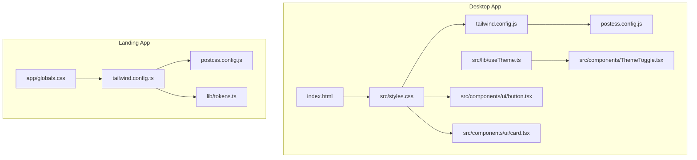
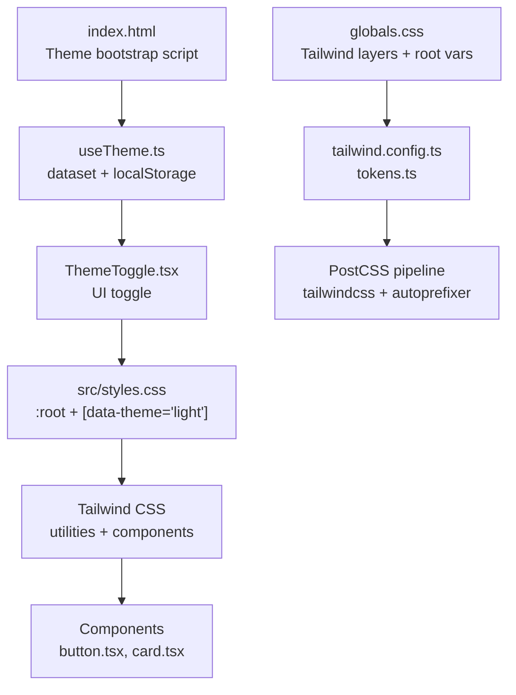
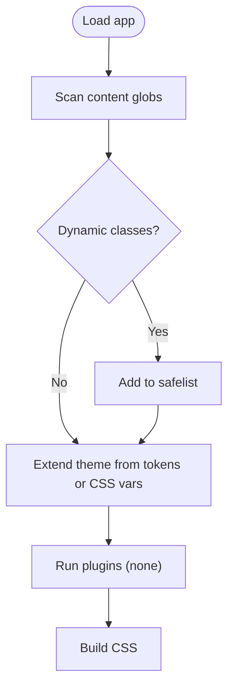
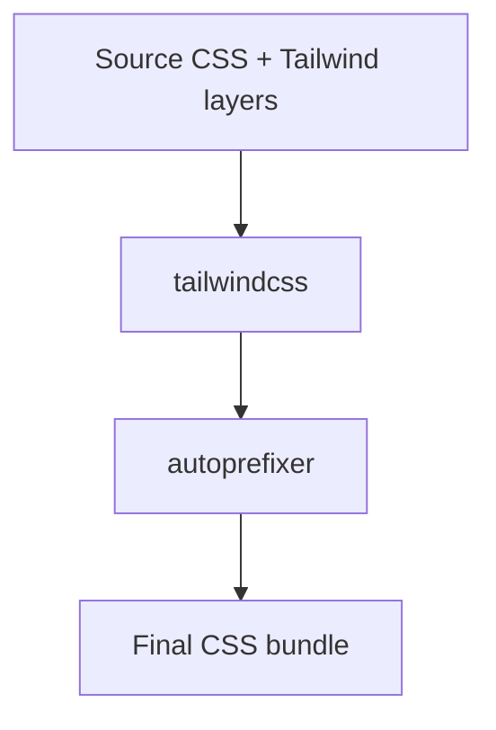
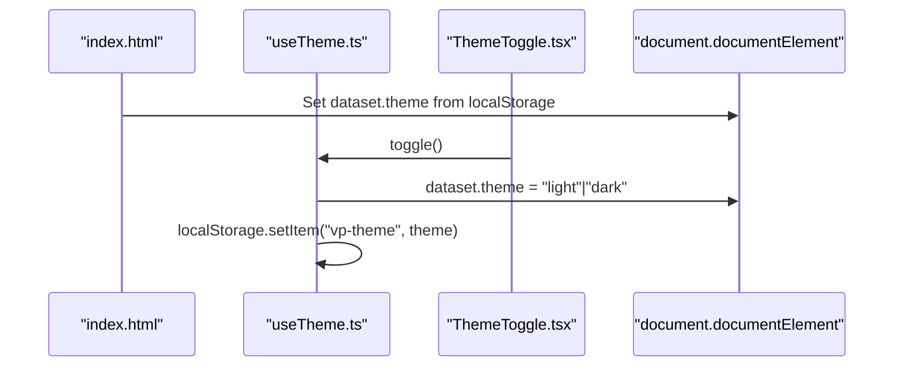
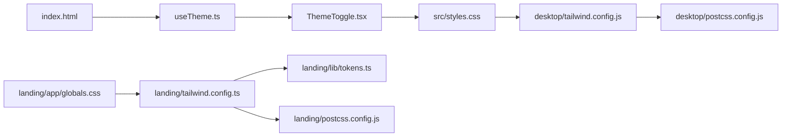

# Styling Architecture

<cite>
**Referenced Files in This Document**
- [desktop/tailwind.config.js](file://desktop/tailwind.config.js)
- [landing/tailwind.config.ts](file://landing/tailwind.config.ts)
- [desktop/postcss.config.js](file://desktop/postcss.config.js)
- [landing/postcss.config.js](file://landing/postcss.config.js)
- [desktop/src/styles.css](file://desktop/src/styles.css)
- [landing/app/globals.css](file://landing/app/globals.css)
- [landing/lib/tokens.ts](file://landing/lib/tokens.ts)
- [desktop/src/lib/useTheme.ts](file://desktop/src/lib/useTheme.ts)
- [desktop/index.html](file://desktop/index.html)
- [desktop/src/components/ThemeToggle.tsx](file://desktop/src/components/ThemeToggle.tsx)
- [desktop/src/components/ui/button.tsx](file://desktop/src/components/ui/button.tsx)
- [desktop/src/components/ui/card.tsx](file://desktop/src/components/ui/card.tsx)
- [desktop/src/main.tsx](file://desktop/src/main.tsx)
- [desktop/vite.config.js](file://desktop/vite.config.js)
- [landing/next.config.js](file://landing/next.config.js)
</cite>

## Table of Contents
1. [Introduction](#introduction)
2. [Project Structure](#project-structure)
3. [Core Components](#core-components)
4. [Architecture Overview](#architecture-overview)
5. [Detailed Component Analysis](#detailed-component-analysis)
6. [Dependency Analysis](#dependency-analysis)
7. [Performance Considerations](#performance-considerations)
8. [Troubleshooting Guide](#troubleshooting-guide)
9. [Conclusion](#conclusion)
10. [Appendices](#appendices)

## Introduction
This document describes the styling architecture for the project, focusing on Tailwind CSS configuration, PostCSS integration, theme systems, and component styling patterns. It covers how design tokens are centralized, how light/dark mode is implemented, and how utility-first and custom CSS approaches coexist. It also provides best practices for extending styles, maintaining consistency, and optimizing CSS delivery.

## Project Structure
The styling architecture is split across two distinct applications:
- Desktop application (Tauri + React + Vite): Tailwind-driven with a custom glass-like theme and dynamic color variables.
- Landing application (Next.js): Tailwind-driven with centralized design tokens and a cohesive color/typography system.

Key characteristics:
- Tailwind CSS configured per app with scoped content globs and safelisted classes where necessary.
- PostCSS pipeline enabled with Tailwind and Autoprefixer.
- Global CSS establishes base styles, theme variables, and reusable component patterns.
- Theme system is driven by a dataset attribute on the root element and persisted in localStorage.



**Diagram sources**
- [desktop/index.html:1-36](file://desktop/index.html#L1-L36)
- [desktop/src/styles.css:1-512](file://desktop/src/styles.css#L1-L512)
- [desktop/tailwind.config.js:1-45](file://desktop/tailwind.config.js#L1-L45)
- [desktop/postcss.config.js:1-7](file://desktop/postcss.config.js#L1-L7)
- [desktop/src/lib/useTheme.ts:1-33](file://desktop/src/lib/useTheme.ts#L1-L33)
- [desktop/src/components/ThemeToggle.tsx:1-82](file://desktop/src/components/ThemeToggle.tsx#L1-L82)
- [desktop/src/components/ui/button.tsx:1-59](file://desktop/src/components/ui/button.tsx#L1-L59)
- [desktop/src/components/ui/card.tsx:1-71](file://desktop/src/components/ui/card.tsx#L1-L71)
- [landing/app/globals.css:1-41](file://landing/app/globals.css#L1-L41)
- [landing/tailwind.config.ts:1-43](file://landing/tailwind.config.ts#L1-L43)
- [landing/postcss.config.js:1-7](file://landing/postcss.config.js#L1-L7)
- [landing/lib/tokens.ts:1-59](file://landing/lib/tokens.ts#L1-L59)

**Section sources**
- [desktop/tailwind.config.js:1-45](file://desktop/tailwind.config.js#L1-L45)
- [landing/tailwind.config.ts:1-43](file://landing/tailwind.config.ts#L1-L43)
- [desktop/postcss.config.js:1-7](file://desktop/postcss.config.js#L1-L7)
- [landing/postcss.config.js:1-7](file://landing/postcss.config.js#L1-L7)
- [desktop/src/styles.css:1-512](file://desktop/src/styles.css#L1-L512)
- [landing/app/globals.css:1-41](file://landing/app/globals.css#L1-L41)
- [landing/lib/tokens.ts:1-59](file://landing/lib/tokens.ts#L1-L59)
- [desktop/src/lib/useTheme.ts:1-33](file://desktop/src/lib/useTheme.ts#L1-L33)
- [desktop/index.html:1-36](file://desktop/index.html#L1-L36)
- [desktop/src/components/ThemeToggle.tsx:1-82](file://desktop/src/components/ThemeToggle.tsx#L1-L82)
- [desktop/src/components/ui/button.tsx:1-59](file://desktop/src/components/ui/button.tsx#L1-L59)
- [desktop/src/components/ui/card.tsx:1-71](file://desktop/src/components/ui/card.tsx#L1-L71)
- [desktop/src/main.tsx:1-11](file://desktop/src/main.tsx#L1-L11)
- [desktop/vite.config.js:1-22](file://desktop/vite.config.js#L1-L22)
- [landing/next.config.js:1-7](file://landing/next.config.js#L1-L7)

## Core Components
- Tailwind configuration
  - Desktop: content scanning, safelisted dynamic classes, theme extensions for colors, radii, keyframes, and animations.
  - Landing: content scanning, theme extensions for colors, fonts, spacing tokens, radii, and shadows, consuming centralized tokens.
- PostCSS pipeline
  - Tailwind and Autoprefixer enabled in both apps.
- Global CSS and theme variables
  - Desktop: base layer defines HSL-based CSS variables for dark/light themes, component patterns, and animations.
  - Landing: base layer imports Tailwind layers and sets root color variables; tokens module centralizes design values.
- Theme system
  - Dataset-driven theme switching with localStorage persistence and a no-flash bootstrap script.
- Component styling
  - Desktop: Radix slots + class variance authority (CVA) for buttons; explicit component classes for cards and patterns.
  - Landing: Tailwind utilities dominate; tokens consumed in Tailwind config.

**Section sources**
- [desktop/tailwind.config.js:1-45](file://desktop/tailwind.config.js#L1-L45)
- [landing/tailwind.config.ts:1-43](file://landing/tailwind.config.ts#L1-L43)
- [desktop/postcss.config.js:1-7](file://desktop/postcss.config.js#L1-L7)
- [landing/postcss.config.js:1-7](file://landing/postcss.config.js#L1-L7)
- [desktop/src/styles.css:1-512](file://desktop/src/styles.css#L1-L512)
- [landing/app/globals.css:1-41](file://landing/app/globals.css#L1-L41)
- [landing/lib/tokens.ts:1-59](file://landing/lib/tokens.ts#L1-L59)
- [desktop/src/lib/useTheme.ts:1-33](file://desktop/src/lib/useTheme.ts#L1-L33)
- [desktop/src/components/ui/button.tsx:1-59](file://desktop/src/components/ui/button.tsx#L1-L59)
- [desktop/src/components/ui/card.tsx:1-71](file://desktop/src/components/ui/card.tsx#L1-L71)

## Architecture Overview
The styling architecture follows a hybrid approach:
- Utility-first with Tailwind for rapid composition.
- Centralized design tokens and theme variables for consistency.
- Custom CSS layers for component patterns and animations.
- Theme toggling controlled by a dataset attribute synchronized with localStorage.



**Diagram sources**
- [desktop/index.html:16-28](file://desktop/index.html#L16-L28)
- [desktop/src/lib/useTheme.ts:12-32](file://desktop/src/lib/useTheme.ts#L12-L32)
- [desktop/src/components/ThemeToggle.tsx:14-81](file://desktop/src/components/ThemeToggle.tsx#L14-L81)
- [desktop/src/styles.css:12-186](file://desktop/src/styles.css#L12-L186)
- [desktop/src/components/ui/button.tsx:6-36](file://desktop/src/components/ui/button.tsx#L6-L36)
- [desktop/src/components/ui/card.tsx:4-14](file://desktop/src/components/ui/card.tsx#L4-L14)
- [landing/app/globals.css:1-3](file://landing/app/globals.css#L1-L3)
- [landing/tailwind.config.ts:2-42](file://landing/tailwind.config.ts#L2-L42)
- [landing/lib/tokens.ts:6-58](file://landing/lib/tokens.ts#L6-L58)
- [desktop/postcss.config.js:1-7](file://desktop/postcss.config.js#L1-L7)
- [landing/postcss.config.js:1-7](file://landing/postcss.config.js#L1-L7)

## Detailed Component Analysis

### Tailwind Configuration
- Desktop
  - Content scanning includes HTML and TS/TSX sources.
  - Safelisted dynamic classes to avoid purging.
  - Theme extensions:
    - Colors mapped to CSS variables for theme switching.
    - Border radii using tokenized variables.
    - Keyframes and animation utilities for UI effects.
  - Plugins array currently empty.
- Landing
  - Content scanning for app and components.
  - Consumes tokens module for colors, font family, font sizes, spacing, radii, and shadows.
  - Extends Tailwind theme with token-derived values.



**Diagram sources**
- [desktop/tailwind.config.js:3-44](file://desktop/tailwind.config.js#L3-L44)
- [landing/tailwind.config.ts:4-42](file://landing/tailwind.config.ts#L4-L42)

**Section sources**
- [desktop/tailwind.config.js:1-45](file://desktop/tailwind.config.js#L1-L45)
- [landing/tailwind.config.ts:1-43](file://landing/tailwind.config.ts#L1-L43)

### PostCSS Pipeline
- Both apps enable Tailwind and Autoprefixer.
- Ensures vendor prefixes and deterministic ordering of generated utilities.



**Diagram sources**
- [desktop/postcss.config.js:1-7](file://desktop/postcss.config.js#L1-L7)
- [landing/postcss.config.js:1-7](file://landing/postcss.config.js#L1-L7)

**Section sources**
- [desktop/postcss.config.js:1-7](file://desktop/postcss.config.js#L1-L7)
- [landing/postcss.config.js:1-7](file://landing/postcss.config.js#L1-L7)

### Global Styles and Theme Variables
- Desktop
  - Base layer defines HSL-based CSS variables for dark and light modes.
  - Component patterns (glass, tiles, panels, buttons, chips, heatmaps) defined under components layer.
  - Animations defined at bottom of file.
  - Scrollbar and selection styles included.
- Landing
  - Imports Tailwind layers and sets root color variables.
  - Provides a water background pattern and pulse dot animation.

```mermaid
classDiagram
class DesktopStyles {
"+CSS variables for dark/light"
"+Component patterns (.glass, .panel, .btn-*...)"
"+Animations (@keyframes)"
"+Scrollbar + selection styles"
}
class LandingGlobals {
"+Tailwind layers"
"+Root color variables"
"+Background pattern + animations"
}
DesktopStyles <.. LandingGlobals : "shared utility-first approach"
```

**Diagram sources**
- [desktop/src/styles.css:12-512](file://desktop/src/styles.css#L12-L512)
- [landing/app/globals.css:1-41](file://landing/app/globals.css#L1-L41)

**Section sources**
- [desktop/src/styles.css:1-512](file://desktop/src/styles.css#L1-L512)
- [landing/app/globals.css:1-41](file://landing/app/globals.css#L1-L41)

### Theme System Implementation
- No-flash bootstrap script initializes the dataset attribute from localStorage before React mounts.
- Hook persists theme to localStorage and updates the dataset attribute.
- ThemeToggle renders a glass-style toggle with smooth transitions and dynamic gradients.
- Desktop theme toggles between dark and light via a dataset attribute applied to the root element.



**Diagram sources**
- [desktop/index.html:17-27](file://desktop/index.html#L17-L27)
- [desktop/src/lib/useTheme.ts:17-25](file://desktop/src/lib/useTheme.ts#L17-L25)
- [desktop/src/components/ThemeToggle.tsx:14-81](file://desktop/src/components/ThemeToggle.tsx#L14-L81)

**Section sources**
- [desktop/index.html:16-28](file://desktop/index.html#L16-L28)
- [desktop/src/lib/useTheme.ts:1-33](file://desktop/src/lib/useTheme.ts#L1-L33)
- [desktop/src/components/ThemeToggle.tsx:1-82](file://desktop/src/components/ThemeToggle.tsx#L1-L82)

### Component Styling Patterns
- Desktop
  - Button uses CVA for variants and sizes; integrates Tailwind utilities for focus, ring, and disabled states.
  - Card composes Tailwind utilities and CSS variables for consistent theming.
  - Component classes (.glass, .panel, .btn-primary, .chip, .pill) encapsulate patterns.
- Landing
  - Utilities dominate; tokens module supplies values for Tailwind extensions.

```mermaid
classDiagram
class Button {
"+CVA variants (default, destructive, outline, secondary, ghost, link)"
"+CVA sizes (default, sm, lg, icon)"
"+Radix Slot for composition"
}
class Card {
"+Tailwind utilities"
"+CSS variables for theme"
}
Button <.. Card : "shared theming via CSS variables"
```

**Diagram sources**
- [desktop/src/components/ui/button.tsx:6-36](file://desktop/src/components/ui/button.tsx#L6-L36)
- [desktop/src/components/ui/card.tsx:4-14](file://desktop/src/components/ui/card.tsx#L4-L14)

**Section sources**
- [desktop/src/components/ui/button.tsx:1-59](file://desktop/src/components/ui/button.tsx#L1-L59)
- [desktop/src/components/ui/card.tsx:1-71](file://desktop/src/components/ui/card.tsx#L1-L71)
- [landing/tailwind.config.ts:8-37](file://landing/tailwind.config.ts#L8-L37)

### Responsive Design and Breakpoints
- Tailwind’s default breakpoints apply; content scanning ensures purge-safe usage.
- Landing config imports tokens for spacing and typography scales, enabling consistent responsive spacing.

**Section sources**
- [desktop/tailwind.config.js:3-4](file://desktop/tailwind.config.js#L3-L4)
- [landing/tailwind.config.ts:4-42](file://landing/tailwind.config.ts#L4-L42)
- [landing/lib/tokens.ts:39-45](file://landing/lib/tokens.ts#L39-L45)

### Integration Between Tailwind Utilities and Custom CSS Classes
- Desktop: Tailwind utilities compose with custom component classes (e.g., .glass, .panel, .btn-primary) to achieve design system consistency.
- Landing: Tailwind utilities primarily drive styling; tokens inform theme extensions.

**Section sources**
- [desktop/src/styles.css:244-488](file://desktop/src/styles.css#L244-L488)
- [landing/tailwind.config.ts:8-37](file://landing/tailwind.config.ts#L8-L37)

## Dependency Analysis
- Desktop
  - index.html bootstraps theme before React mounts.
  - useTheme manages dataset and persistence.
  - ThemeToggle triggers theme changes.
  - src/styles.css defines base and component layers.
  - tailwind.config.js extends theme and safelists dynamic classes.
  - postcss.config.js enables Tailwind and Autoprefixer.
- Landing
  - globals.css imports Tailwind layers and sets root variables.
  - tailwind.config.ts consumes tokens.ts for theme extensions.
  - postcss.config.js enables Tailwind and Autoprefixer.



**Diagram sources**
- [desktop/index.html:16-28](file://desktop/index.html#L16-L28)
- [desktop/src/lib/useTheme.ts:17-25](file://desktop/src/lib/useTheme.ts#L17-L25)
- [desktop/src/components/ThemeToggle.tsx:14-81](file://desktop/src/components/ThemeToggle.tsx#L14-L81)
- [desktop/src/styles.css:12-512](file://desktop/src/styles.css#L12-L512)
- [desktop/tailwind.config.js:3-44](file://desktop/tailwind.config.js#L3-L44)
- [desktop/postcss.config.js:1-7](file://desktop/postcss.config.js#L1-L7)
- [landing/app/globals.css:1-3](file://landing/app/globals.css#L1-L3)
- [landing/tailwind.config.ts:2-42](file://landing/tailwind.config.ts#L2-L42)
- [landing/lib/tokens.ts:6-58](file://landing/lib/tokens.ts#L6-L58)
- [landing/postcss.config.js:1-7](file://landing/postcss.config.js#L1-L7)

**Section sources**
- [desktop/src/main.tsx:1-11](file://desktop/src/main.tsx#L1-L11)
- [desktop/vite.config.js:1-22](file://desktop/vite.config.js#L1-L22)
- [landing/next.config.js:1-7](file://landing/next.config.js#L1-L7)

## Performance Considerations
- Purge and safelist
  - Desktop safelists dynamic classes to prevent unintended purging.
  - Ensure content globs remain accurate to avoid missing utilities.
- CSS delivery
  - Import Tailwind layers once in global CSS to minimize duplication.
  - Keep animations lightweight; prefer GPU-friendly properties.
- Theme switching
  - Minimal DOM writes; dataset + CSS variables reduce repaint cost.
- Build pipeline
  - Tailwind + Autoprefixer in PostCSS ensures deterministic output and vendor compatibility.

[No sources needed since this section provides general guidance]

## Troubleshooting Guide
- Dynamic classes being removed
  - Verify safelist entries match runtime class generation.
  - Confirm content globs include all relevant files.
- Theme not sticking
  - Check localStorage availability and correctness of dataset attribute.
  - Ensure the bootstrap script runs before React mounts.
- Unexpected color or spacing
  - Validate CSS variable values in base layer and theme overrides.
  - Confirm Tailwind extensions align with token values.

**Section sources**
- [desktop/tailwind.config.js:7-9](file://desktop/tailwind.config.js#L7-L9)
- [desktop/index.html:17-27](file://desktop/index.html#L17-L27)
- [desktop/src/lib/useTheme.ts:17-25](file://desktop/src/lib/useTheme.ts#L17-L25)
- [desktop/src/styles.css:14-186](file://desktop/src/styles.css#L14-L186)
- [landing/tailwind.config.ts:8-37](file://landing/tailwind.config.ts#L8-L37)
- [landing/lib/tokens.ts:6-58](file://landing/lib/tokens.ts#L6-L58)

## Conclusion
The styling architecture blends utility-first Tailwind with centralized design tokens and theme variables. Desktop emphasizes custom component classes and a robust theme system, while Landing focuses on token-driven Tailwind extensions. Together, they provide a scalable, consistent, and performant styling foundation.

[No sources needed since this section summarizes without analyzing specific files]

## Appendices

### Best Practices and Guidelines
- Adding new styles
  - Prefer Tailwind utilities for quick iterations; extract to component classes when reused.
  - Define new tokens in tokens.ts (Landing) or base layer variables (Desktop) to maintain consistency.
- Modifying existing components
  - Update CVA variants/sizes (Desktop) or Tailwind extensions (Landing) consistently.
  - Keep theme variables aligned with design intent.
- Naming conventions
  - Use kebab-case for component classes; use semantic names (e.g., .panel, .btn-primary).
  - Maintain consistent suffixes for states (e.g., .active, .disabled).
- Maintainability
  - Centralize design tokens; extend Tailwind theme from tokens.
  - Safelist dynamic classes; keep content globs accurate.
  - Keep animations simple and performant.

[No sources needed since this section provides general guidance]