# Tauri Integration

<cite>
**Referenced Files in This Document**
- [invoke.ts](file://desktop/src/lib/invoke.ts)
- [App.tsx](file://desktop/src/App.tsx)
- [types.ts](file://desktop/src/types.ts)
- [main.rs](file://desktop/src-tauri/src/main.rs)
- [api.rs](file://desktop/src-tauri/src/api.rs)
- [desktop.rs](file://desktop/src-tauri/src/desktop.rs)
- [backend.rs](file://desktop/src-tauri/src/backend.rs)
- [tauri.conf.json](file://desktop/src-tauri/tauri.conf.json)
- [package.json](file://desktop/package.json)
- [vite.config.js](file://desktop/vite.config.js)
- [DashboardView.tsx](file://desktop/src/components/views/DashboardView.tsx)
- [default.json](file://desktop/src-tauri/capabilities/default.json)
- [main.rs (backend daemon)](file://crates/backend/src/main.rs)
</cite>

## Table of Contents
1. [Introduction](#introduction)
2. [Project Structure](#project-structure)
3. [Core Components](#core-components)
4. [Architecture Overview](#architecture-overview)
5. [Detailed Component Analysis](#detailed-component-analysis)
6. [Dependency Analysis](#dependency-analysis)
7. [Performance Considerations](#performance-considerations)
8. [Troubleshooting Guide](#troubleshooting-guide)
9. [Conclusion](#conclusion)
10. [Appendices](#appendices)

## Introduction
This document explains the Tauri integration patterns between the React frontend and the Rust backend in the desktop application. It covers the command system using the invoke pattern, IPC architecture, event-driven real-time updates, type safety across languages, security and capability-based permissions, build and bundling integration, and practical examples for recording control, history retrieval, and preference management. It also includes debugging tips and performance considerations for cross-language calls.

## Project Structure
The desktop application is organized into:
- Frontend (React + TypeScript): located under the desktop directory, with UI components, typed models, and the invoke wrapper for Tauri commands/events.
- Tauri backend (Rust): defines Tauri commands, manages the local backend daemon, and emits events to the frontend.
- Local backend daemon (Rust): a separate HTTP server process that handles LLM, STT, and persistence tasks.

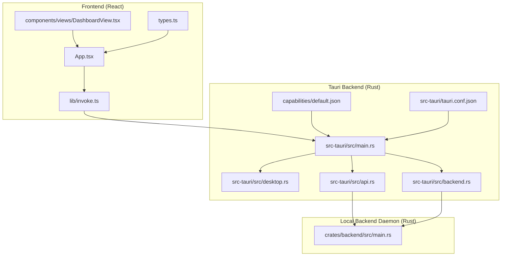

**Diagram sources**
- [App.tsx:1-671](file://desktop/src/App.tsx#L1-L671)
- [invoke.ts:1-667](file://desktop/src/lib/invoke.ts#L1-L667)
- [types.ts:1-247](file://desktop/src/types.ts#L1-L247)
- [main.rs (Tauri backend):1-800](file://desktop/src-tauri/src/main.rs#L1-L800)
- [desktop.rs:1-123](file://desktop/src-tauri/src/desktop.rs#L1-L123)
- [api.rs:1-920](file://desktop/src-tauri/src/api.rs#L1-L920)
- [backend.rs:1-152](file://desktop/src-tauri/src/backend.rs#L1-L152)
- [default.json:1-11](file://desktop/src-tauri/capabilities/default.json#L1-L11)
- [tauri.conf.json:1-51](file://desktop/src-tauri/tauri.conf.json#L1-L51)
- [main.rs (backend daemon):1-234](file://crates/backend/src/main.rs#L1-L234)

**Section sources**
- [tauri.conf.json:1-51](file://desktop/src-tauri/tauri.conf.json#L1-L51)
- [package.json:1-38](file://desktop/package.json#L1-L38)
- [vite.config.js:1-22](file://desktop/vite.config.js#L1-L22)

## Core Components
- Frontend invoke wrapper: Provides a unified invoke function and typed wrappers for commands and event subscriptions. It detects the Tauri runtime and falls back to a mock implementation in browser previews.
- Tauri commands: Exposed via #[tauri::command] macros in the Tauri backend, implementing the bridge between frontend and backend services.
- Local backend daemon: A separate HTTP server process spawned by the Tauri backend, exposing REST endpoints for preferences, history, cloud auth, OpenAI OAuth, and voice/text polish operations.
- Event system: The Tauri backend emits named events (e.g., voice-token, voice-status, voice-done, voice-error) that the frontend listens to for real-time updates.
- Type safety: TypeScript interfaces mirror Rust structs for seamless serialization/deserialization across IPC boundaries.

**Section sources**
- [invoke.ts:1-667](file://desktop/src/lib/invoke.ts#L1-L667)
- [main.rs (Tauri backend):656-800](file://desktop/src-tauri/src/main.rs#L656-L800)
- [api.rs:1-920](file://desktop/src-tauri/src/api.rs#L1-L920)
- [types.ts:1-247](file://desktop/src/types.ts#L1-L247)

## Architecture Overview
The integration follows a layered architecture:
- Frontend (React) communicates with Tauri via invoke and event listeners.
- Tauri backend exposes commands and emits events, orchestrating the local backend daemon.
- The local backend daemon serves REST endpoints and SSE streams for streaming polish results.

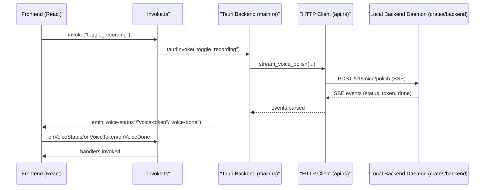

**Diagram sources**
- [invoke.ts:204-212](file://desktop/src/lib/invoke.ts#L204-L212)
- [main.rs (Tauri backend):656-800](file://desktop/src-tauri/src/main.rs#L656-L800)
- [api.rs:128-178](file://desktop/src-tauri/src/api.rs#L128-L178)
- [main.rs (backend daemon):18-145](file://crates/backend/src/main.rs#L18-L145)

## Detailed Component Analysis

### Command System: invoke Pattern
- Runtime detection: The invoke wrapper checks for the Tauri environment and either uses the real IPC or a mock implementation for browser previews.
- Typed commands: Functions like get_backend_endpoint, get_preferences, patch_preferences, get_history, retry_recording, delete_recording, getRecordingAudioUrl, submitEditFeedback, getPendingEdits, resolvePendingEdit, listVocabulary, addVocabularyTerm, deleteVocabularyTerm, starVocabularyTerm, list_vocabulary, and cloud authentication wrappers encapsulate command invocation with argument passing and response parsing.
- Parameter passing: Arguments are passed as JSON-serializable records; the wrapper ensures type-safe invocation and returns typed results.
- Response handling: Commands return typed data or null/empty arrays on failure, enabling robust UI handling.

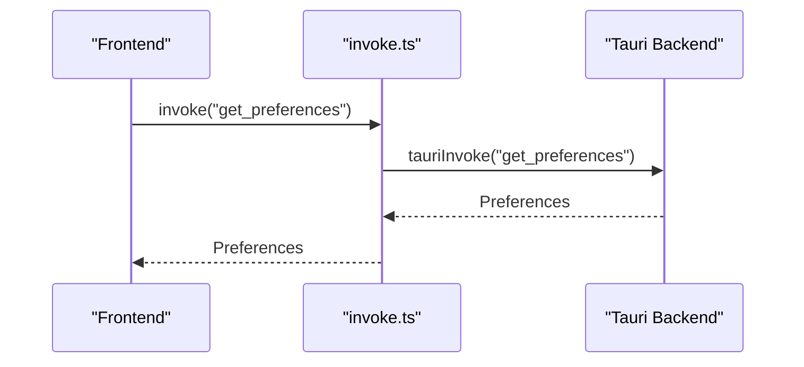

**Diagram sources**
- [invoke.ts:227-234](file://desktop/src/lib/invoke.ts#L227-L234)
- [main.rs (Tauri backend):682-685](file://desktop/src-tauri/src/main.rs#L682-L685)

**Section sources**
- [invoke.ts:204-212](file://desktop/src/lib/invoke.ts#L204-L212)
- [invoke.ts:217-224](file://desktop/src/lib/invoke.ts#L217-L224)
- [invoke.ts:227-246](file://desktop/src/lib/invoke.ts#L227-L246)
- [invoke.ts:249-256](file://desktop/src/lib/invoke.ts#L249-L256)
- [invoke.ts:296-305](file://desktop/src/lib/invoke.ts#L296-L305)
- [invoke.ts:308-319](file://desktop/src/lib/invoke.ts#L308-L319)
- [invoke.ts:322-337](file://desktop/src/lib/invoke.ts#L322-L337)
- [invoke.ts:560-579](file://desktop/src/lib/invoke.ts#L560-L579)
- [invoke.ts:599-611](file://desktop/src/lib/invoke.ts#L599-L611)
- [invoke.ts:613-621](file://desktop/src/lib/invoke.ts#L613-L621)
- [invoke.ts:623-630](file://desktop/src/lib/invoke.ts#L623-L630)

### IPC Architecture: Commands and Events
- Command registration: Tauri commands are declared with #[tauri::command] and registered in the Tauri backend. Examples include bootstrap, get_snapshot, get_backend_endpoint, get_preferences, patch_preferences, get_history, submit_edit_feedback, set_mode, request_accessibility, request_input_monitoring, diagnose_ax, and many others.
- Parameter passing: Commands accept typed arguments (e.g., limit:i64, update:PrefsUpdate) and return typed results wrapped in Result.
- Response handling: Commands return serialized JSON-compatible structures; the frontend receives typed results.
- Event emission: The Tauri backend emits named events (voice-token, voice-status, voice-done, voice-error, edit-detected, app-state, nav-settings, openai-reconnect-initiated, pending-edits-changed, vocabulary-changed, vocab-toast) for real-time updates.
- Event subscriptions: The frontend subscribes to events via listen and returns unsubscribe functions for cleanup.

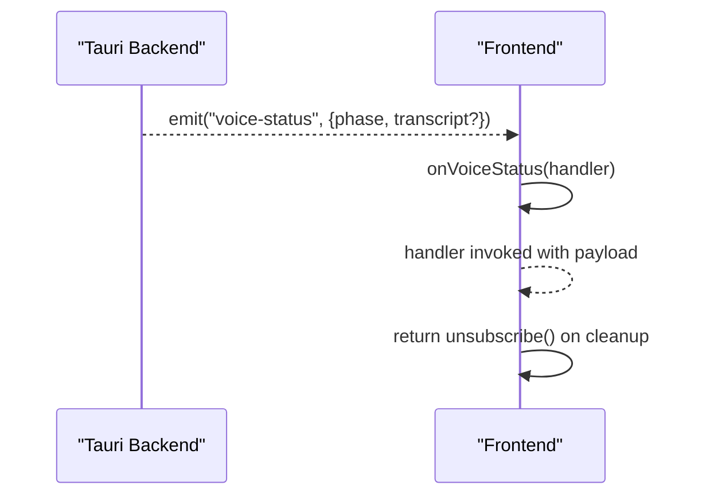

**Diagram sources**
- [main.rs (Tauri backend):656-720](file://desktop/src-tauri/src/main.rs#L656-L720)
- [invoke.ts:344-377](file://desktop/src/lib/invoke.ts#L344-L377)
- [invoke.ts:409-418](file://desktop/src/lib/invoke.ts#L409-L418)
- [invoke.ts:421-433](file://desktop/src/lib/invoke.ts#L421-L433)
- [invoke.ts:582-587](file://desktop/src/lib/invoke.ts#L582-L587)
- [invoke.ts:633-638](file://desktop/src/lib/invoke.ts#L633-L638)
- [invoke.ts:647-652](file://desktop/src/lib/invoke.ts#L647-L652)

**Section sources**
- [main.rs (Tauri backend):656-720](file://desktop/src-tauri/src/main.rs#L656-L720)
- [invoke.ts:344-377](file://desktop/src/lib/invoke.ts#L344-L377)
- [invoke.ts:409-418](file://desktop/src/lib/invoke.ts#L409-L418)
- [invoke.ts:421-433](file://desktop/src/lib/invoke.ts#L421-L433)
- [invoke.ts:582-587](file://desktop/src/lib/invoke.ts#L582-L587)
- [invoke.ts:633-638](file://desktop/src/lib/invoke.ts#L633-L638)
- [invoke.ts:647-652](file://desktop/src/lib/invoke.ts#L647-L652)

### Event System: Real-Time Updates and Cleanup
- Subscription patterns: The frontend subscribes to events in useEffect hooks and returns unsubscribe functions in the cleanup phase to prevent leaks.
- Event categories:
  - Voice pipeline: voice-token, voice-status, voice-done, voice-error.
  - Backend state: app-state, pending-edits-changed, vocabulary-changed, vocab-toast.
  - Navigation and auth: nav-settings, openai-reconnect-initiated.
- Cleanup procedures: Each subscription returns an unsubscribe function; the cleanup phase invokes these to remove listeners.

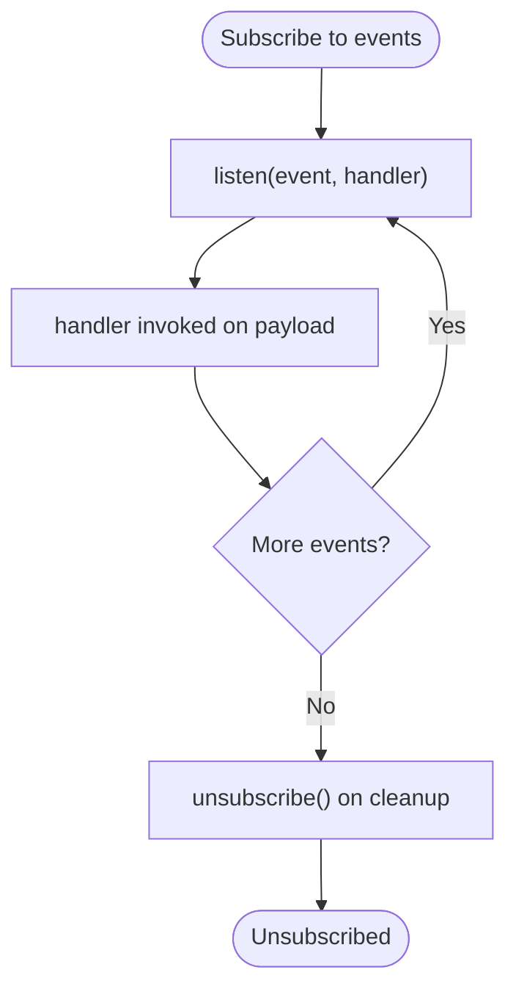

**Diagram sources**
- [App.tsx:199-305](file://desktop/src/App.tsx#L199-L305)
- [invoke.ts:344-377](file://desktop/src/lib/invoke.ts#L344-L377)
- [invoke.ts:409-418](file://desktop/src/lib/invoke.ts#L409-L418)
- [invoke.ts:421-433](file://desktop/src/lib/invoke.ts#L421-L433)
- [invoke.ts:582-587](file://desktop/src/lib/invoke.ts#L582-L587)
- [invoke.ts:633-638](file://desktop/src/lib/invoke.ts#L633-L638)
- [invoke.ts:647-652](file://desktop/src/lib/invoke.ts#L647-L652)

**Section sources**
- [App.tsx:199-305](file://desktop/src/App.tsx#L199-L305)
- [invoke.ts:344-377](file://desktop/src/lib/invoke.ts#L344-L377)
- [invoke.ts:409-418](file://desktop/src/lib/invoke.ts#L409-L418)
- [invoke.ts:421-433](file://desktop/src/lib/invoke.ts#L421-L433)
- [invoke.ts:582-587](file://desktop/src/lib/invoke.ts#L582-L587)
- [invoke.ts:633-638](file://desktop/src/lib/invoke.ts#L633-L638)
- [invoke.ts:647-652](file://desktop/src/lib/invoke.ts#L647-L652)

### Type Safety Between TypeScript and Rust
- TypeScript interfaces mirror Rust structs for preferences, history items, recordings, backend endpoints, cloud/OpenAI statuses, pending edits, and vocabulary entries.
- Serialization/deserialization: Tauri serializes command arguments and results to JSON; the frontend consumes typed payloads.
- Consistency: The frontend types.ts file defines the shapes used by the UI and invoke wrappers, ensuring compile-time checks and IDE support.

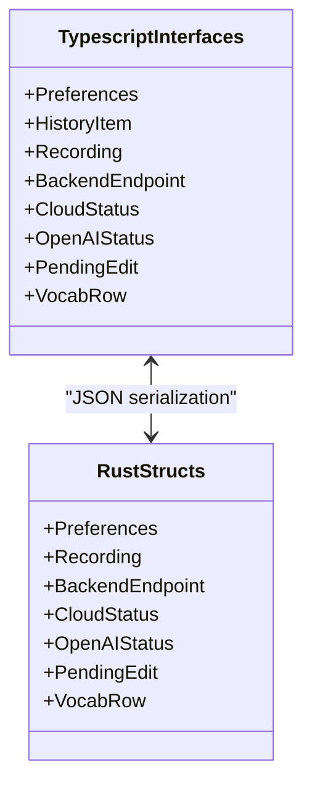

**Diagram sources**
- [types.ts:54-175](file://desktop/src/types.ts#L54-L175)
- [api.rs:16-94](file://desktop/src-tauri/src/api.rs#L16-L94)

**Section sources**
- [types.ts:54-175](file://desktop/src/types.ts#L54-L175)
- [api.rs:16-94](file://desktop/src-tauri/src/api.rs#L16-L94)

### Security Model and Capability-Based Permissions
- Capability definition: The default capability restricts permissions to core and notification defaults and targets the main window.
- Plugin usage: The notification plugin is conditionally imported and used for native notifications when permissions are granted.
- Runtime checks: The invoke wrapper checks for Tauri availability and adapts behavior accordingly.

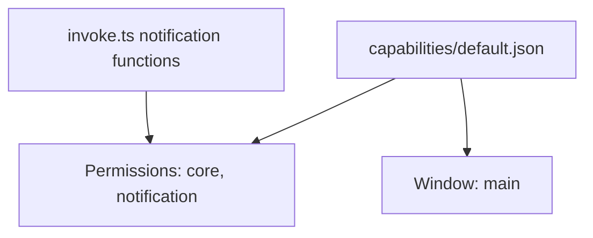

**Diagram sources**
- [default.json:1-11](file://desktop/src-tauri/capabilities/default.json#L1-L11)
- [invoke.ts:509-556](file://desktop/src/lib/invoke.ts#L509-L556)

**Section sources**
- [default.json:1-11](file://desktop/src-tauri/capabilities/default.json#L1-L11)
- [invoke.ts:509-556](file://desktop/src/lib/invoke.ts#L509-L556)

### Build Process Integration, Asset Bundling, and Native API Access
- Build scripts: The desktop package.json defines dev/build scripts for Vite and Tauri.
- Dev server: Vite runs on 127.0.0.1:1420 and integrates with Tauri’s dev URL.
- Tauri configuration: tauri.conf.json sets the product name, build commands, dev URL, frontend dist, window properties, security (CSP null), and external binaries (local backend daemon).
- Native APIs: The frontend uses @tauri-apps/api for invoke and event listeners, and @tauri-apps/plugin-notification for native notifications.

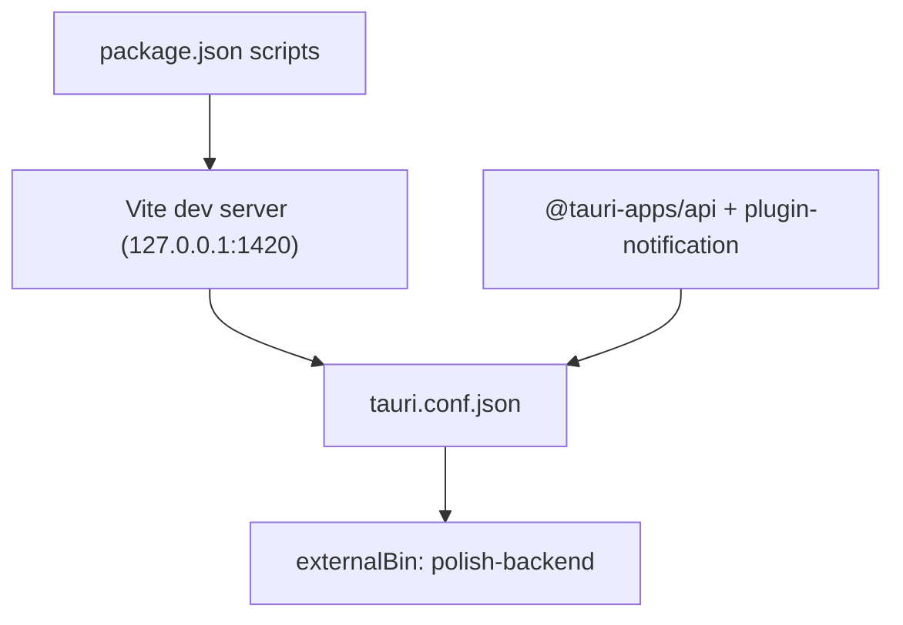

**Diagram sources**
- [package.json:6-11](file://desktop/package.json#L6-L11)
- [vite.config.js:16-21](file://desktop/vite.config.js#L16-L21)
- [tauri.conf.json:6-11](file://desktop/src-tauri/tauri.conf.json#L6-L11)
- [tauri.conf.json:41-43](file://desktop/src-tauri/tauri.conf.json#L41-L43)

**Section sources**
- [package.json:6-11](file://desktop/package.json#L6-L11)
- [vite.config.js:16-21](file://desktop/vite.config.js#L16-L21)
- [tauri.conf.json:6-11](file://desktop/src-tauri/tauri.conf.json#L6-L11)
- [tauri.conf.json:41-43](file://desktop/src-tauri/tauri.conf.json#L41-L43)

### Practical Examples

#### Recording Control
- Toggle recording: The frontend calls invoke("toggle_recording"); the Tauri backend transitions the state machine and triggers the local backend to process audio. Real-time events (voice-status, voice-token, voice-done) update the UI live.
- Retry recording: The frontend calls invoke("retry_recording", { audioId }) to reprocess a saved WAV.
- Delete recording: The frontend calls invoke("delete_recording", { id }) to remove a recording from storage.

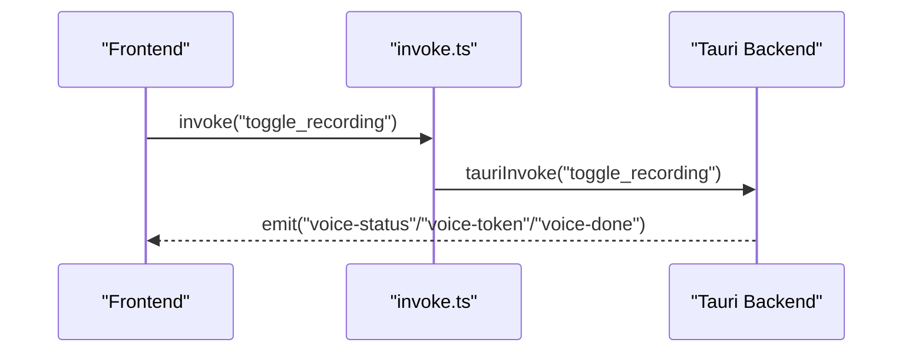

**Diagram sources**
- [App.tsx:322-342](file://desktop/src/App.tsx#L322-L342)
- [invoke.ts:296-305](file://desktop/src/lib/invoke.ts#L296-L305)
- [invoke.ts:302-305](file://desktop/src/lib/invoke.ts#L302-L305)

**Section sources**
- [App.tsx:322-342](file://desktop/src/App.tsx#L322-L342)
- [invoke.ts:296-305](file://desktop/src/lib/invoke.ts#L296-L305)
- [invoke.ts:302-305](file://desktop/src/lib/invoke.ts#L302-L305)

#### History Retrieval
- Fetch history: The frontend calls listHistory(limit) which wraps invoke("get_history", { limit }), receiving a typed array of Recording objects.

**Section sources**
- [invoke.ts:249-256](file://desktop/src/lib/invoke.ts#L249-L256)
- [types.ts:92-109](file://desktop/src/types.ts#L92-L109)

#### Preference Management
- Get preferences: The frontend calls getPreferences() which wraps invoke("get_preferences").
- Patch preferences: The frontend calls patchPreferences(update) which wraps invoke("patch_preferences", { update }); the Tauri backend updates the backend daemon and synchronizes caches.

**Section sources**
- [invoke.ts:227-234](file://desktop/src/lib/invoke.ts#L227-L234)
- [invoke.ts:237-246](file://desktop/src/lib/invoke.ts#L237-L246)
- [main.rs (Tauri backend):682-720](file://desktop/src-tauri/src/main.rs#L682-L720)

#### Cloud Authentication and OpenAI OAuth
- Cloud signup/login/logout: The frontend calls cloudSignup, cloudLogin, cloudLogout; the Tauri backend proxies to the cloud control plane and stores tokens locally.
- OpenAI OAuth: The frontend calls initiateOpenAIOAuth to get an auth URL, opens the browser, and polls getOpenAIStatus until connected.

**Section sources**
- [invoke.ts:438-459](file://desktop/src/lib/invoke.ts#L438-L459)
- [invoke.ts:474-495](file://desktop/src/lib/invoke.ts#L474-L495)
- [api.rs:433-521](file://desktop/src-tauri/src/api.rs#L433-L521)
- [api.rs:568-596](file://desktop/src-tauri/src/api.rs#L568-L596)

#### Vocabulary Management
- List/add/delete/star vocabulary terms: The frontend calls listVocabulary, addVocabularyTerm, deleteVocabularyTerm, starVocabularyTerm; the Tauri backend updates the local SQLite database and emits vocabulary-changed and vocab-toast events.

**Section sources**
- [invoke.ts:599-630](file://desktop/src/lib/invoke.ts#L599-L630)
- [invoke.ts:633-652](file://desktop/src/lib/invoke.ts#L633-L652)

### Conceptual Overview
The integration centers on a clean separation of concerns:
- Frontend: UI rendering, user interactions, and event-driven updates.
- Tauri backend: Command orchestration, state management, and event emission.
- Local backend daemon: HTTP endpoints and SSE streams for LLM/STT operations.

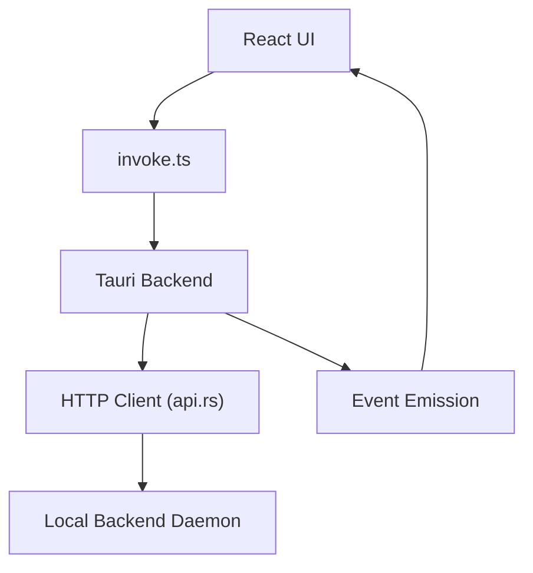

[No sources needed since this diagram shows conceptual workflow, not actual code structure]

[No sources needed since this section doesn't analyze specific source files]

## Dependency Analysis
- Frontend depends on @tauri-apps/api and @tauri-apps/plugin-notification for IPC and native notifications.
- Tauri backend depends on the desktop state machine, HTTP client, and the local backend daemon.
- Local backend daemon depends on the backend crate and exposes REST endpoints.

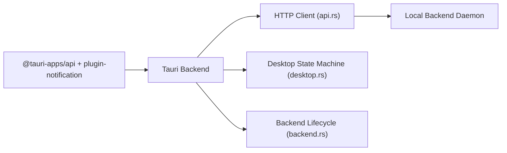

**Diagram sources**
- [package.json:18-19](file://desktop/package.json#L18-L19)
- [main.rs (Tauri backend):11-24](file://desktop/src-tauri/src/main.rs#L11-L24)
- [api.rs:6-10](file://desktop/src-tauri/src/api.rs#L6-L10)
- [desktop.rs:7-11](file://desktop/src-tauri/src/desktop.rs#L7-L11)
- [backend.rs:6-8](file://desktop/src-tauri/src/backend.rs#L6-L8)

**Section sources**
- [package.json:18-19](file://desktop/package.json#L18-L19)
- [main.rs (Tauri backend):11-24](file://desktop/src-tauri/src/main.rs#L11-L24)
- [api.rs:6-10](file://desktop/src-tauri/src/api.rs#L6-L10)
- [desktop.rs:7-11](file://desktop/src-tauri/src/desktop.rs#L7-L11)
- [backend.rs:6-8](file://desktop/src-tauri/src/backend.rs#L6-L8)

## Performance Considerations
- Minimize IPC overhead: Batch frequent queries (e.g., periodic snapshot polling) and avoid excessive event subscriptions.
- SSE streaming: The backend uses SSE for token streaming; ensure handlers are efficient and avoid heavy work in event callbacks.
- Hot-path caching: The Tauri backend maintains caches (language and vocabulary keyterms) to reduce latency during recording.
- Asynchronous operations: Use async runtime for long-running tasks and avoid blocking the UI thread.

[No sources needed since this section provides general guidance]

## Troubleshooting Guide
- Tauri runtime detection: If invoke falls back to mock behavior, verify the Tauri environment is present.
- Command failures: Wrap invoke calls in try/catch and handle null/empty responses gracefully.
- Event subscriptions: Always return unsubscribe functions in cleanup phases to prevent memory leaks.
- Backend daemon: Ensure the local backend daemon is reachable at the returned endpoint and that the shared secret is correct.
- Notifications: Check permission state via checkNotificationPermission and request permissions when needed.

**Section sources**
- [invoke.ts:193-212](file://desktop/src/lib/invoke.ts#L193-L212)
- [App.tsx:199-305](file://desktop/src/App.tsx#L199-L305)
- [main.rs (Tauri backend):674-679](file://desktop/src-tauri/src/main.rs#L674-L679)
- [invoke.ts:509-556](file://desktop/src/lib/invoke.ts#L509-L556)

## Conclusion
The Tauri integration provides a robust, type-safe bridge between the React frontend and the Rust backend. Commands and events enable responsive UI updates, while the local backend daemon handles complex LLM/STT operations efficiently. The capability-based permissions and build configuration ensure secure and predictable deployments. Following the patterns documented here will help maintain performance and reliability as the application evolves.

## Appendices
- Example usage patterns are demonstrated in the DashboardView and App components, showing how to integrate recording control, history retrieval, preferences, and vocabulary management with real-time updates.

**Section sources**
- [DashboardView.tsx:1-260](file://desktop/src/components/views/DashboardView.tsx#L1-L260)
- [App.tsx:129-147](file://desktop/src/App.tsx#L129-L147)
- [App.tsx:149-177](file://desktop/src/App.tsx#L149-L177)
- [App.tsx:179-197](file://desktop/src/App.tsx#L179-L197)
- [App.tsx:322-342](file://desktop/src/App.tsx#L322-L342)
- [App.tsx:408-536](file://desktop/src/App.tsx#L408-L536)