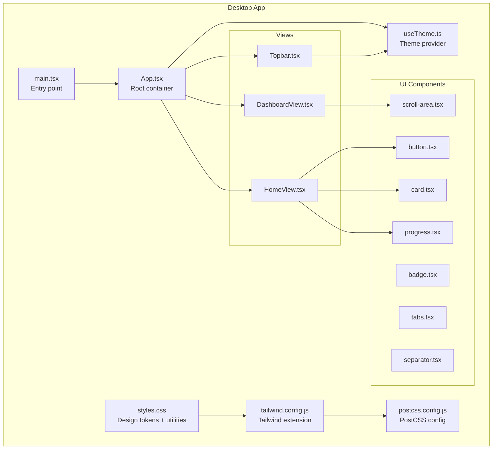
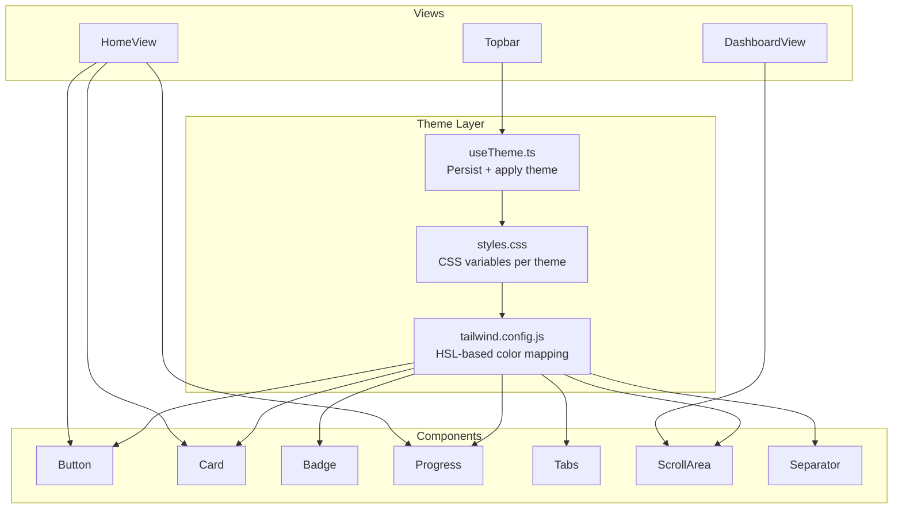
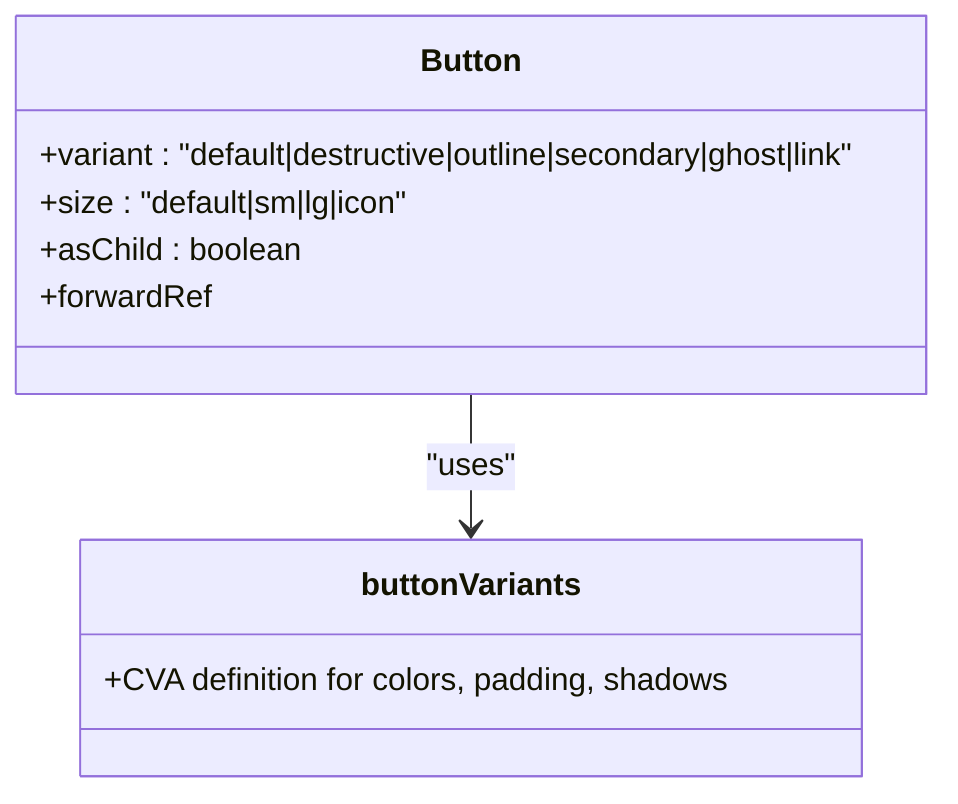
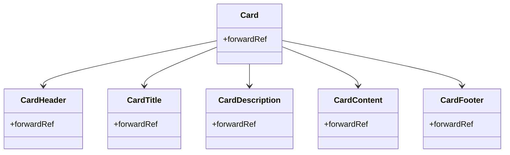
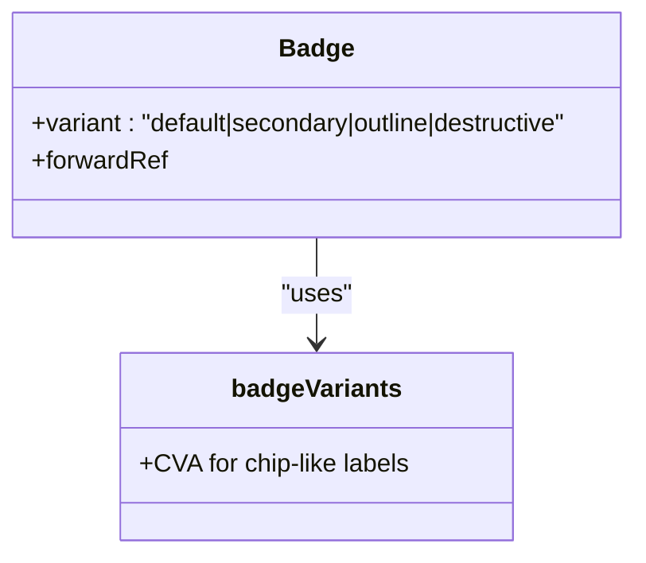
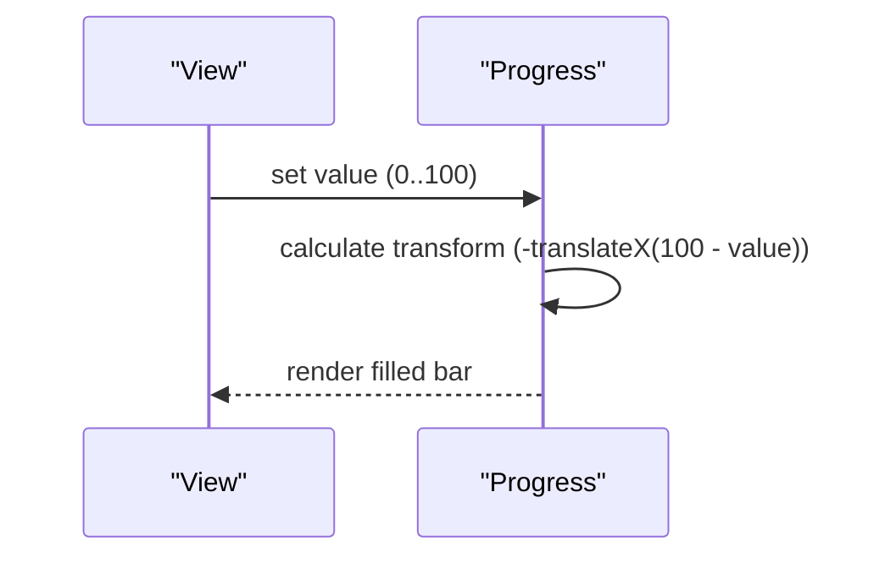
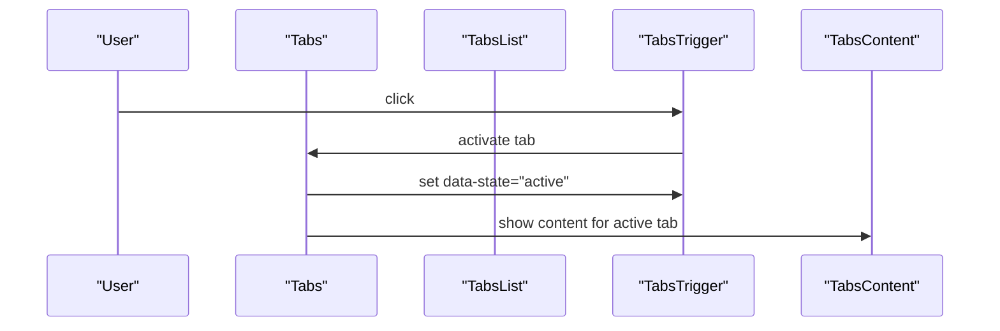
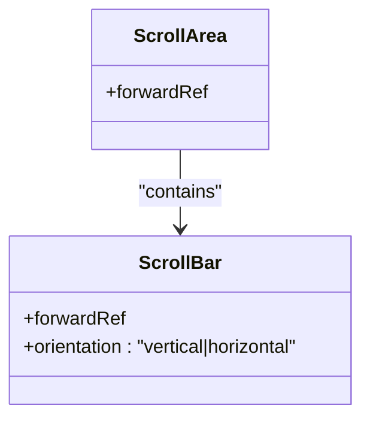
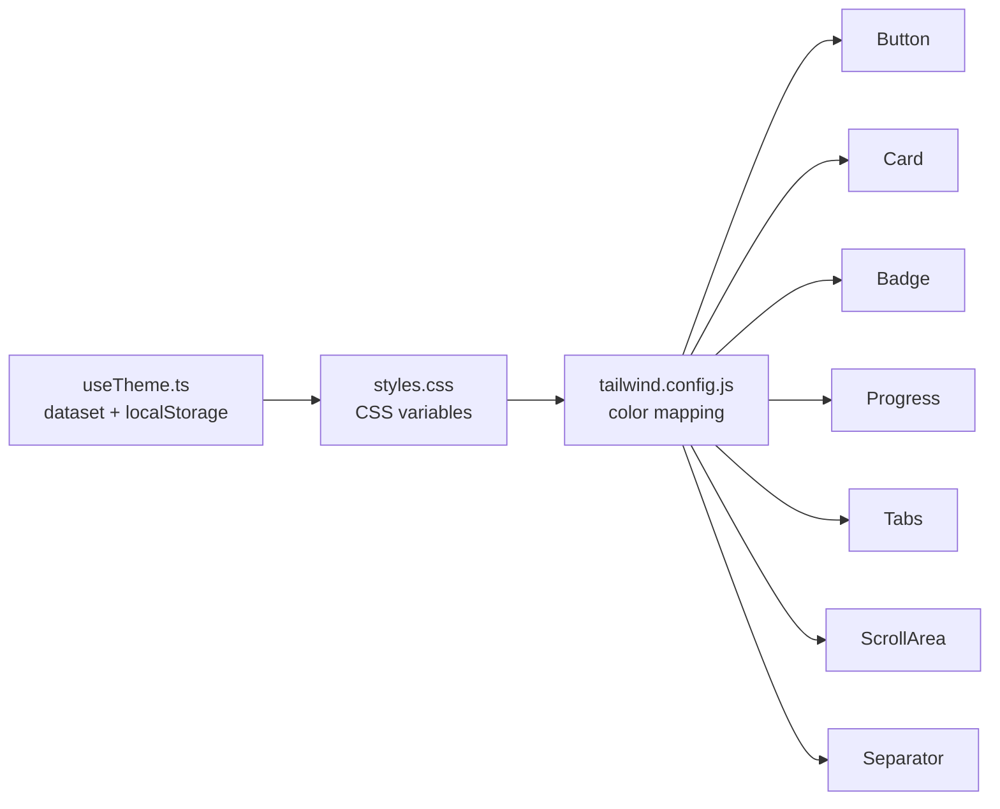

# UI Components

<cite>
**Referenced Files in This Document**
- [button.tsx](file://desktop/src/components/ui/button.tsx)
- [card.tsx](file://desktop/src/components/ui/card.tsx)
- [badge.tsx](file://desktop/src/components/ui/badge.tsx)
- [progress.tsx](file://desktop/src/components/ui/progress.tsx)
- [tabs.tsx](file://desktop/src/components/ui/tabs.tsx)
- [scroll-area.tsx](file://desktop/src/components/ui/scroll-area.tsx)
- [separator.tsx](file://desktop/src/components/ui/separator.tsx)
- [useTheme.ts](file://desktop/src/lib/useTheme.ts)
- [styles.css](file://desktop/src/styles.css)
- [tailwind.config.js](file://desktop/tailwind.config.js)
- [postcss.config.js](file://desktop/postcss.config.js)
- [App.tsx](file://desktop/src/App.tsx)
- [DashboardView.tsx](file://desktop/src/components/views/DashboardView.tsx)
- [HomeView.tsx](file://desktop/src/components/views/HomeView.tsx)
- [Topbar.tsx](file://desktop/src/components/Topbar.tsx)
- [main.tsx](file://desktop/src/main.tsx)
</cite>

## Table of Contents
1. [Introduction](#introduction)
2. [Project Structure](#project-structure)
3. [Core Components](#core-components)
4. [Architecture Overview](#architecture-overview)
5. [Detailed Component Analysis](#detailed-component-analysis)
6. [Dependency Analysis](#dependency-analysis)
7. [Performance Considerations](#performance-considerations)
8. [Accessibility and WCAG Compliance](#accessibility-and-wcag-compliance)
9. [Usage Examples and Integration Patterns](#usage-examples-and-integration-patterns)
10. [Customization, CSS Variables, and Styling Overrides](#customization-css-variables-and-styling-overrides)
11. [Responsive Design and Mobile-First Considerations](#responsive-design-and-mobile-first-considerations)
12. [Extending the Component Library](#extending-the-component-library)
13. [Troubleshooting Guide](#troubleshooting-guide)
14. [Conclusion](#conclusion)

## Introduction
This document describes the UI component library built with Radix UI primitives and custom components for the desktop application. It covers each component’s props, variants, composition patterns, and usage within the broader design system. It also documents the theming system (light/dark), color schemes, typography scale, spacing conventions, accessibility features, responsive behavior, and guidelines for extending the library consistently.

## Project Structure
The UI components are located under the desktop application’s source tree. They integrate with a Tailwind-based design system and a theme hook that switches between light and dark modes.

**Diagram sources**
- [main.tsx:1-11](file://desktop/src/main.tsx#L1-L11)
- [App.tsx:1-671](file://desktop/src/App.tsx#L1-L671)
- [styles.css:1-492](file://desktop/src/styles.css#L1-L492)
- [tailwind.config.js:1-45](file://desktop/tailwind.config.js#L1-L45)
- [postcss.config.js:1-7](file://desktop/postcss.config.js#L1-L7)
- [useTheme.ts:1-33](file://desktop/src/lib/useTheme.ts#L1-L33)
- [button.tsx:1-59](file://desktop/src/components/ui/button.tsx#L1-L59)
- [card.tsx:1-71](file://desktop/src/components/ui/card.tsx#L1-L71)
- [badge.tsx:1-37](file://desktop/src/components/ui/badge.tsx#L1-L37)
- [progress.tsx:1-26](file://desktop/src/components/ui/progress.tsx#L1-L26)
- [tabs.tsx:1-54](file://desktop/src/components/ui/tabs.tsx#L1-L54)
- [scroll-area.tsx:1-48](file://desktop/src/components/ui/scroll-area.tsx#L1-L48)
- [separator.tsx:1-24](file://desktop/src/components/ui/separator.tsx#L1-L24)
- [DashboardView.tsx:1-260](file://desktop/src/components/views/DashboardView.tsx#L1-L260)
- [HomeView.tsx:1-319](file://desktop/src/components/views/HomeView.tsx#L1-L319)
- [Topbar.tsx:1-87](file://desktop/src/components/Topbar.tsx#L1-L87)

**Section sources**
- [main.tsx:1-11](file://desktop/src/main.tsx#L1-L11)
- [App.tsx:120-122](file://desktop/src/App.tsx#L120-L122)
- [styles.css:12-186](file://desktop/src/styles.css#L12-L186)
- [tailwind.config.js:10-45](file://desktop/tailwind.config.js#L10-L45)
- [postcss.config.js:1-7](file://desktop/postcss.config.js#L1-L7)

## Core Components
This section summarizes each component’s purpose, props, variants, and typical usage patterns.

- Button
  - Purpose: Action trigger with multiple variants and sizes.
  - Variants: default, destructive, outline, secondary, ghost, link.
  - Sizes: default, sm, lg, icon.
  - Composition: Uses Radix Slot to support asChild rendering; integrates with design tokens for colors and shadows.
  - Accessibility: Inherits focus-visible ring and disabled state handling from base class.
  - Usage patterns: Primary actions, secondary actions, icon-only triggers, links styled as buttons.

- Card
  - Purpose: Container with header, title, description, content, and footer segments.
  - Composition: Provides semantic subcomponents for structured layouts.
  - Accessibility: No explicit ARIA roles; relies on semantic HTML and proper heading hierarchy.

- Badge
  - Purpose: Short label or indicator with status emphasis.
  - Variants: default, secondary, outline, destructive.
  - Accessibility: Stateless; ensure sufficient color contrast against backgrounds.

- Progress
  - Purpose: Visual progress indicator with animated fill.
  - Props: value (number), supports indeterminate via missing value.
  - Accessibility: Uses Radix Progress primitive; ensure labels or aria-describedby for context.

- Tabs
  - Purpose: Organize content into selectable sections.
  - Composition: Root, List, Trigger, Content with data-state selectors for active visuals.
  - Accessibility: Uses Radix Tabs; ensures keyboard navigation and ARIA attributes.

- ScrollArea
  - Purpose: Customizable scrollable region with overlay scrollbar.
  - Composition: Root, Viewport, ScrollAreaScrollbar, ScrollAreaThumb, Corner.
  - Accessibility: Integrates with OS-native scrolling semantics.

- Separator
  - Purpose: Visual divider with horizontal/vertical orientation.
  - Props: orientation, decorative flag.
  - Accessibility: Supports decorative flag to hide from assistive technologies.

**Section sources**
- [button.tsx:6-36](file://desktop/src/components/ui/button.tsx#L6-L36)
- [card.tsx:4-70](file://desktop/src/components/ui/card.tsx#L4-L70)
- [badge.tsx:5-24](file://desktop/src/components/ui/badge.tsx#L5-L24)
- [progress.tsx:5-23](file://desktop/src/components/ui/progress.tsx#L5-L23)
- [tabs.tsx:5-53](file://desktop/src/components/ui/tabs.tsx#L5-L53)
- [scroll-area.tsx:5-47](file://desktop/src/components/ui/scroll-area.tsx#L5-L47)
- [separator.tsx:5-21](file://desktop/src/components/ui/separator.tsx#L5-L21)

## Architecture Overview
The UI system is composed of:
- Radix UI primitives for accessible, unstyled foundations.
- Tailwind CSS for design tokens and utilities.
- A theme hook that persists and applies light/dark mode via dataset and localStorage.
- Component wrappers that apply design tokens and maintain consistent spacing and typography.

**Diagram sources**
- [useTheme.ts:12-32](file://desktop/src/lib/useTheme.ts#L12-L32)
- [styles.css:12-186](file://desktop/src/styles.css#L12-L186)
- [tailwind.config.js:10-45](file://desktop/tailwind.config.js#L10-L45)
- [button.tsx:1-59](file://desktop/src/components/ui/button.tsx#L1-L59)
- [card.tsx:1-71](file://desktop/src/components/ui/card.tsx#L1-L71)
- [badge.tsx:1-37](file://desktop/src/components/ui/badge.tsx#L1-L37)
- [progress.tsx:1-26](file://desktop/src/components/ui/progress.tsx#L1-L26)
- [tabs.tsx:1-54](file://desktop/src/components/ui/tabs.tsx#L1-L54)
- [scroll-area.tsx:1-48](file://desktop/src/components/ui/scroll-area.tsx#L1-L48)
- [separator.tsx:1-24](file://desktop/src/components/ui/separator.tsx#L1-L24)
- [DashboardView.tsx:1-260](file://desktop/src/components/views/DashboardView.tsx#L1-L260)
- [HomeView.tsx:1-319](file://desktop/src/components/views/HomeView.tsx#L1-L319)
- [Topbar.tsx:1-87](file://desktop/src/components/Topbar.tsx#L1-L87)

## Detailed Component Analysis

### Button
- Props and Variants
  - variant: default, destructive, outline, secondary, ghost, link.
  - size: default, sm, lg, icon.
  - asChild: renders children as a slot to preserve semantics.
- Implementation Notes
  - Uses class variance authority (CVA) for variant sizing.
  - Integrates focus-visible ring and disabled pointer-events.
- Accessibility
  - Inherits focus-visible ring and disabled state handling.
  - Prefer native button element; asChild enables anchor-like semantics when needed.

**Diagram sources**
- [button.tsx:6-36](file://desktop/src/components/ui/button.tsx#L6-L36)

**Section sources**
- [button.tsx:38-56](file://desktop/src/components/ui/button.tsx#L38-L56)

### Card
- Composition
  - Card, CardHeader, CardTitle, CardDescription, CardContent, CardFooter.
- Spacing and Typography
  - Uses consistent spacing utilities and heading font settings.
- Accessibility
  - Encourages semantic headings inside CardTitle.

**Diagram sources**
- [card.tsx:4-70](file://desktop/src/components/ui/card.tsx#L4-L70)

**Section sources**
- [card.tsx:18-70](file://desktop/src/components/ui/card.tsx#L18-L70)

### Badge
- Props and Variants
  - variant: default, secondary, outline, destructive.
- Accessibility
  - Stateless; ensure sufficient contrast and avoid conveying critical info without labels.

**Diagram sources**
- [badge.tsx:5-24](file://desktop/src/components/ui/badge.tsx#L5-L24)

**Section sources**
- [badge.tsx:26-34](file://desktop/src/components/ui/badge.tsx#L26-L34)

### Progress
- Behavior
  - Animated indicator based on value prop; transforms to reflect percentage.
- Accessibility
  - Use aria-describedby or surrounding labels to describe progress meaning.

**Diagram sources**
- [progress.tsx:5-23](file://desktop/src/components/ui/progress.tsx#L5-L23)

**Section sources**
- [progress.tsx:5-23](file://desktop/src/components/ui/progress.tsx#L5-L23)

### Tabs
- Behavior
  - Uses Radix Tabs; active state indicated via data-state selectors.
- Accessibility
  - Keyboard navigation and ARIA attributes handled by Radix Tabs.

**Diagram sources**
- [tabs.tsx:5-53](file://desktop/src/components/ui/tabs.tsx#L5-L53)

**Section sources**
- [tabs.tsx:7-51](file://desktop/src/components/ui/tabs.tsx#L7-L51)

### ScrollArea
- Behavior
  - Custom scrollbar with vertical/horizontal orientation; thumb and track styling.
- Accessibility
  - Preserves native scrolling semantics.

**Diagram sources**
- [scroll-area.tsx:5-47](file://desktop/src/components/ui/scroll-area.tsx#L5-L47)

**Section sources**
- [scroll-area.tsx:5-47](file://desktop/src/components/ui/scroll-area.tsx#L5-L47)

### Separator
- Props
  - orientation: horizontal|vertical.
  - decorative: boolean to hide from assistive tech.
- Accessibility
  - Use decorative=true for purely visual separators.

**Section sources**
- [separator.tsx:5-21](file://desktop/src/components/ui/separator.tsx#L5-L21)

## Dependency Analysis
- Theme and Tokens
  - CSS variables define HSL-based color palettes per theme.
  - Tailwind maps CSS variables to utilities for consistent usage across components.
- Component Coupling
  - Components depend on shared design tokens via Tailwind and CSS variables.
  - Views compose components and supply data/state.

**Diagram sources**
- [styles.css:12-186](file://desktop/src/styles.css#L12-L186)
- [tailwind.config.js:10-45](file://desktop/tailwind.config.js#L10-L45)
- [useTheme.ts:12-32](file://desktop/src/lib/useTheme.ts#L12-L32)
- [button.tsx:1-59](file://desktop/src/components/ui/button.tsx#L1-L59)
- [card.tsx:1-71](file://desktop/src/components/ui/card.tsx#L1-L71)
- [badge.tsx:1-37](file://desktop/src/components/ui/badge.tsx#L1-L37)
- [progress.tsx:1-26](file://desktop/src/components/ui/progress.tsx#L1-L26)
- [tabs.tsx:1-54](file://desktop/src/components/ui/tabs.tsx#L1-L54)
- [scroll-area.tsx:1-48](file://desktop/src/components/ui/scroll-area.tsx#L1-L48)
- [separator.tsx:1-24](file://desktop/src/components/ui/separator.tsx#L1-L24)

**Section sources**
- [styles.css:12-186](file://desktop/src/styles.css#L12-L186)
- [tailwind.config.js:10-45](file://desktop/tailwind.config.js#L10-L45)
- [useTheme.ts:12-32](file://desktop/src/lib/useTheme.ts#L12-L32)

## Performance Considerations
- Prefer Radix UI primitives for lightweight, accessible behavior.
- Use Tailwind utilities for efficient styling; avoid excessive custom CSS.
- Keep component trees shallow in scrollable regions to minimize reflows.
- Defer heavy computations in views; memoize derived values.

## Accessibility and WCAG Compliance
- Focus Management
  - Components inherit focus-visible rings; ensure visible focus states remain consistent across themes.
- Contrast and Color
  - Verify sufficient contrast between foreground and background tokens in both light and dark modes.
- Semantics
  - Use headings inside CardTitle and appropriate labels for Progress and Tabs.
- ARIA and Roles
  - Tabs and Progress rely on Radix ARIA attributes; ensure surrounding labels describe purpose for assistive technologies.

[No sources needed since this section provides general guidance]

## Usage Examples and Integration Patterns
- Button
  - Primary call-to-action: use default variant with appropriate size.
  - Icon-only: use icon size and asChild with anchor for links.
- Card
  - Compose CardHeader with CardTitle and CardDescription; place content in CardContent.
- Badge
  - Use outline for neutral labels; default/secondary/destructive for status.
- Progress
  - Wrap around long-running tasks; pair with labels or tooltips.
- Tabs
  - Use TabsList for triggers; ensure each Tab has a unique ID and descriptive label.
- ScrollArea
  - Wrap content-heavy lists or dashboards; ensure scrollbars are visible and usable.
- Separator
  - Use horizontal for section dividers; vertical for column separation.

**Section sources**
- [HomeView.tsx:119-132](file://desktop/src/components/views/HomeView.tsx#L119-L132)
- [HomeView.tsx:183-205](file://desktop/src/components/views/HomeView.tsx#L183-L205)
- [HomeView.tsx:269-286](file://desktop/src/components/views/HomeView.tsx#L269-L286)
- [DashboardView.tsx:60-61](file://desktop/src/components/views/DashboardView.tsx#L60-L61)
- [Topbar.tsx:13-87](file://desktop/src/components/Topbar.tsx#L13-L87)

## Customization, CSS Variables, and Styling Overrides
- Design Tokens
  - CSS variables define HSL palettes for background, foreground, primary, secondary, muted, destructive, border, input, ring, and recording.
  - Tailwind theme maps these variables to utilities for consistent usage.
- Utilities
  - Layered utilities (.glass, .panel, .btn-primary, .pill, .chip, .input) encapsulate common patterns.
- Overrides
  - To customize a component, override Tailwind utilities or add new ones; avoid hardcoding HSL values directly in components.
  - For global changes, adjust CSS variables in the root and data-theme selectors.

**Section sources**
- [styles.css:12-186](file://desktop/src/styles.css#L12-L186)
- [styles.css:244-468](file://desktop/src/styles.css#L244-L468)
- [tailwind.config.js:10-45](file://desktop/tailwind.config.js#L10-L45)

## Responsive Design and Mobile-First Considerations
- Mobile-first utilities
  - Use responsive utilities and container queries where appropriate.
- Layouts
  - Grids and flex layouts adapt to smaller screens; ensure adequate spacing and touch targets.
- Scrolling
  - ScrollArea improves usability on small screens; ensure content remains readable.

**Section sources**
- [HomeView.tsx:57-61](file://desktop/src/components/views/HomeView.tsx#L57-L61)
- [DashboardView.tsx:187-192](file://desktop/src/components/views/DashboardView.tsx#L187-L192)

## Extending the Component Library
- Follow CVA patterns for variants and sizes.
- Use Radix UI primitives to preserve accessibility.
- Centralize design tokens in CSS variables and Tailwind config.
- Add new utilities in the components layer when patterns repeat.
- Maintain consistent naming and composition across views.

[No sources needed since this section provides general guidance]

## Troubleshooting Guide
- Theme not applying
  - Ensure dataset theme is set and localStorage persists the value.
- Styles not updating
  - Confirm Tailwind scans the correct paths and safelist dynamic classes if used.
- Scrollbar visibility
  - Verify ScrollArea and ScrollBar are composed correctly and CSS variables are defined.

**Section sources**
- [useTheme.ts:17-32](file://desktop/src/lib/useTheme.ts#L17-L32)
- [tailwind.config.js:3-9](file://desktop/tailwind.config.js#L3-L9)
- [scroll-area.tsx:5-47](file://desktop/src/components/ui/scroll-area.tsx#L5-L47)

## Conclusion
The UI component library leverages Radix UI primitives and a Tailwind-driven design system with a robust theming mechanism. Components are designed for accessibility, composability, and consistency across light and dark modes. By adhering to the design tokens, variant patterns, and composition guidelines, teams can extend the library while maintaining a cohesive user experience.