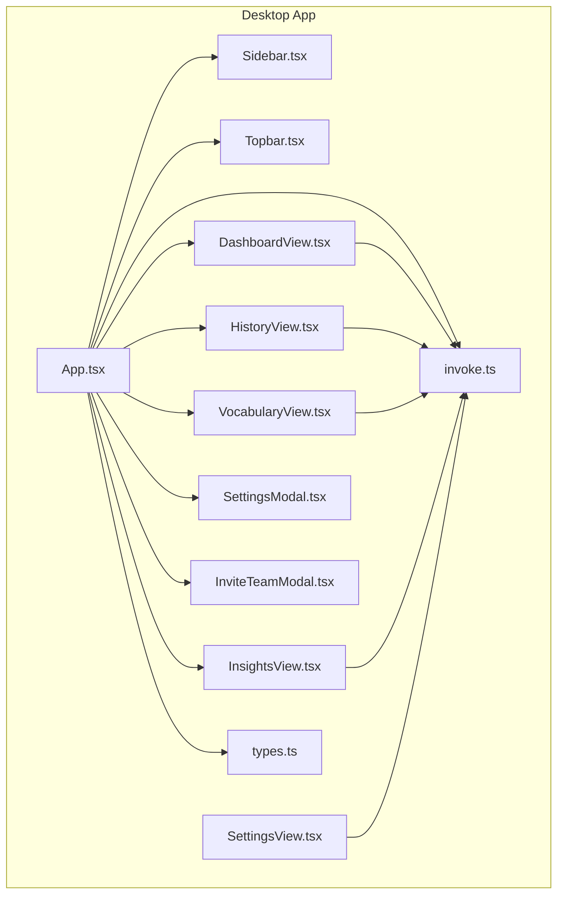
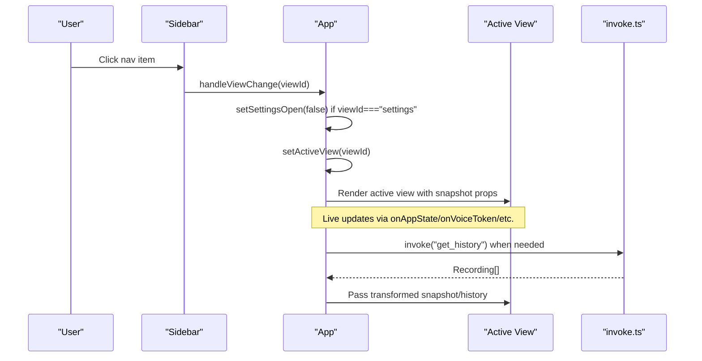
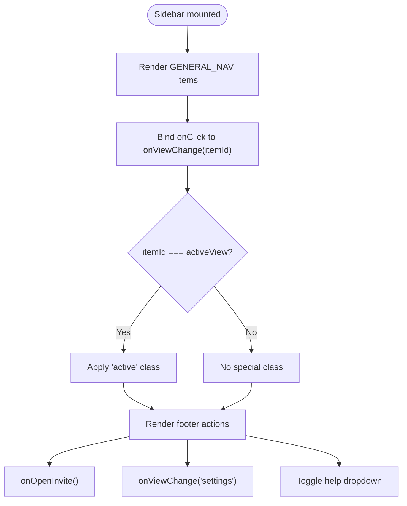
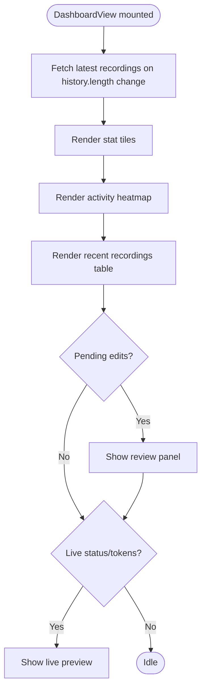
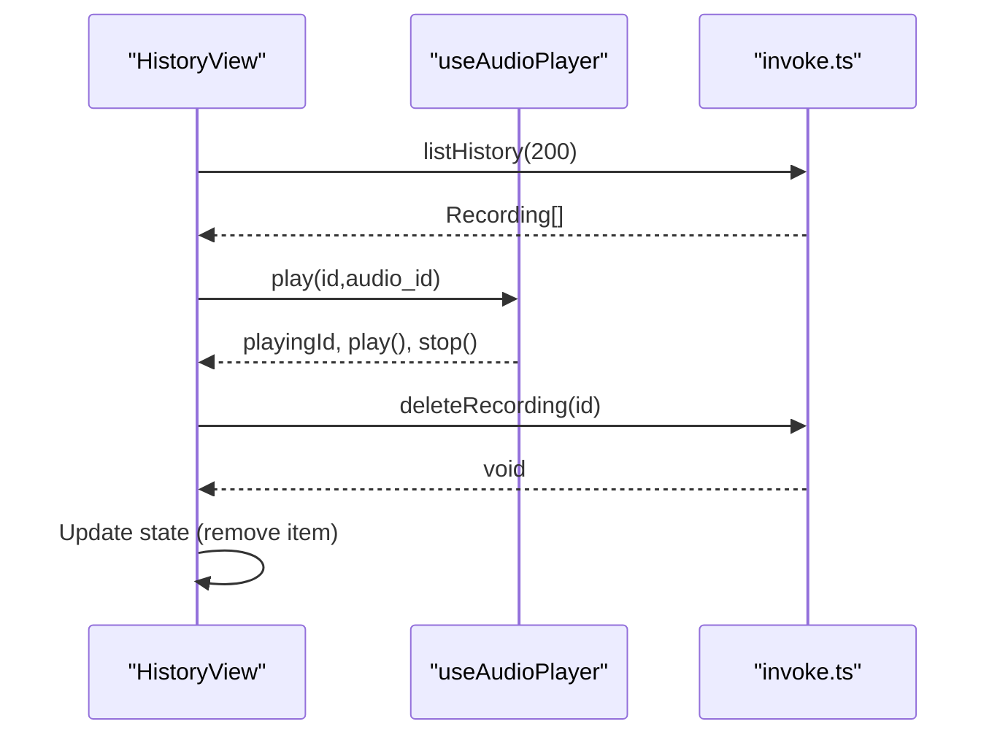
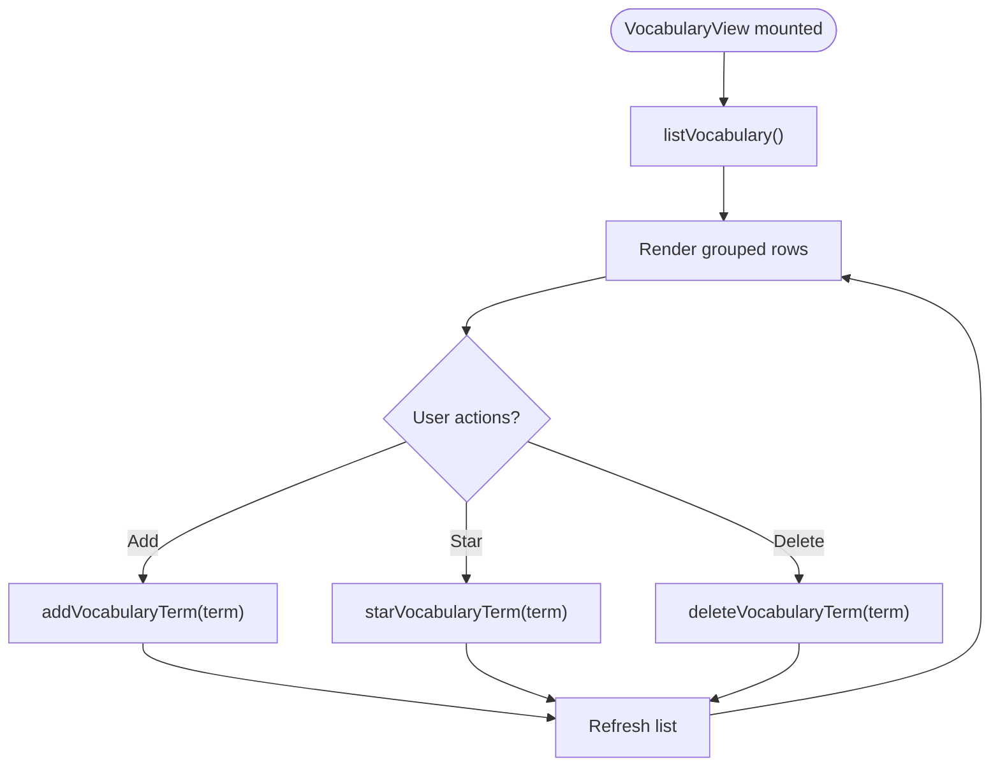
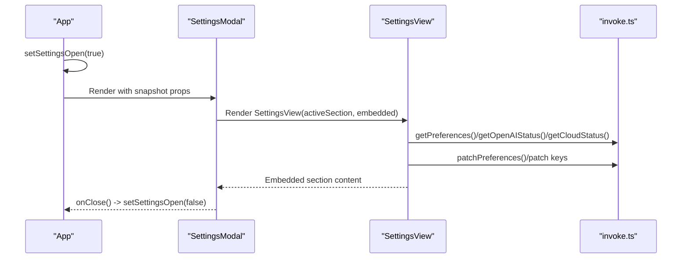
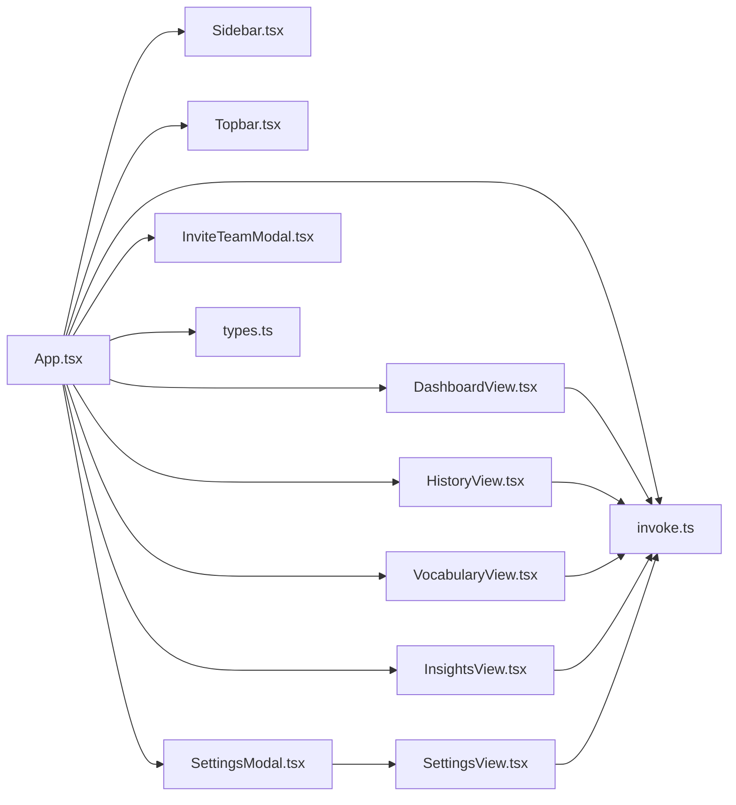

# View System and Navigation

<cite>
**Referenced Files in This Document**
- [App.tsx](file://desktop/src/App.tsx)
- [Sidebar.tsx](file://desktop/src/components/Sidebar.tsx)
- [Topbar.tsx](file://desktop/src/components/Topbar.tsx)
- [DashboardView.tsx](file://desktop/src/components/views/DashboardView.tsx)
- [HistoryView.tsx](file://desktop/src/components/views/HistoryView.tsx)
- [VocabularyView.tsx](file://desktop/src/components/views/VocabularyView.tsx)
- [InsightsView.tsx](file://desktop/src/components/views/InsightsView.tsx)
- [SettingsView.tsx](file://desktop/src/components/views/SettingsView.tsx)
- [SettingsModal.tsx](file://desktop/src/components/SettingsModal.tsx)
- [InviteTeamModal.tsx](file://desktop/src/components/InviteTeamModal.tsx)
- [invoke.ts](file://desktop/src/lib/invoke.ts)
- [types.ts](file://desktop/src/types.ts)
</cite>

## Table of Contents
1. [Introduction](#introduction)
2. [Project Structure](#project-structure)
3. [Core Components](#core-components)
4. [Architecture Overview](#architecture-overview)
5. [Detailed Component Analysis](#detailed-component-analysis)
6. [Dependency Analysis](#dependency-analysis)
7. [Performance Considerations](#performance-considerations)
8. [Troubleshooting Guide](#troubleshooting-guide)
9. [Conclusion](#conclusion)

## Introduction
This document explains the view system and navigation architecture of the desktop application. It covers the major views (Dashboard, History, Vocabulary, Insights), the replaced Settings route now operating as a modal, sidebar navigation, topbar controls, view transitions, data loading strategies, state preservation, modal system, responsive design, backend integration, and real-time updates. The goal is to help developers and product stakeholders understand how views are organized, how navigation works, and how data flows through the system.

## Project Structure
The desktop application is a React + Tauri app. Views are React components under desktop/src/components/views/, with supporting UI components under desktop/src/components/. Global state and navigation are orchestrated in App.tsx, while backend integration is handled via a thin invoke layer in desktop/src/lib/invoke.ts. Types are centralized in desktop/src/types.ts.

**Diagram sources**
- [App.tsx:1-671](file://desktop/src/App.tsx#L1-L671)
- [Sidebar.tsx:1-348](file://desktop/src/components/Sidebar.tsx#L1-L348)
- [Topbar.tsx:1-87](file://desktop/src/components/Topbar.tsx#L1-L87)
- [DashboardView.tsx:1-260](file://desktop/src/components/views/DashboardView.tsx#L1-L260)
- [HistoryView.tsx:1-314](file://desktop/src/components/views/HistoryView.tsx#L1-L314)
- [VocabularyView.tsx:1-415](file://desktop/src/components/views/VocabularyView.tsx#L1-L415)
- [InsightsView.tsx:1-362](file://desktop/src/components/views/InsightsView.tsx#L1-L362)
- [SettingsView.tsx:1-1406](file://desktop/src/components/views/SettingsView.tsx#L1-L1406)
- [SettingsModal.tsx:1-273](file://desktop/src/components/SettingsModal.tsx#L1-L273)
- [InviteTeamModal.tsx:1-429](file://desktop/src/components/InviteTeamModal.tsx#L1-L429)
- [invoke.ts:1-667](file://desktop/src/lib/invoke.ts#L1-L667)
- [types.ts:1-247](file://desktop/src/types.ts#L1-L247)

**Section sources**
- [App.tsx:1-671](file://desktop/src/App.tsx#L1-L671)
- [Sidebar.tsx:1-348](file://desktop/src/components/Sidebar.tsx#L1-L348)
- [Topbar.tsx:1-87](file://desktop/src/components/Topbar.tsx#L1-L87)
- [DashboardView.tsx:1-260](file://desktop/src/components/views/DashboardView.tsx#L1-L260)
- [HistoryView.tsx:1-314](file://desktop/src/components/views/HistoryView.tsx#L1-L314)
- [VocabularyView.tsx:1-415](file://desktop/src/components/views/VocabularyView.tsx#L1-L415)
- [InsightsView.tsx:1-362](file://desktop/src/components/views/InsightsView.tsx#L1-L362)
- [SettingsView.tsx:1-1406](file://desktop/src/components/views/SettingsView.tsx#L1-L1406)
- [SettingsModal.tsx:1-273](file://desktop/src/components/SettingsModal.tsx#L1-L273)
- [InviteTeamModal.tsx:1-429](file://desktop/src/components/InviteTeamModal.tsx#L1-L429)
- [invoke.ts:1-667](file://desktop/src/lib/invoke.ts#L1-L667)
- [types.ts:1-247](file://desktop/src/types.ts#L1-L247)

## Core Components
- App orchestrates global state, navigation, real-time events, and view composition. It merges backend snapshots with computed metrics and passes them down to views.
- Sidebar provides persistent navigation, status indicators, and quick actions. It manages active view state and triggers navigation callbacks.
- Topbar hosts global controls: theme toggle, notifications, and mode indicator.
- Views implement domain-specific UI and data fetching:
  - DashboardView: stats, recent recordings, pending edits, live transcription preview.
  - HistoryView: grouped timeline of recordings with playback and actions.
  - VocabularyView: term management with filtering and source badges.
  - InsightsView: analytics and usage charts.
  - SettingsView: preferences, permissions, API keys, accounts, diagnostics.
- Modals:
  - SettingsModal: two-pane modal replacing the Settings route.
  - InviteTeamModal: two-pane modal for team invitations.

**Section sources**
- [App.tsx:80-671](file://desktop/src/App.tsx#L80-L671)
- [Sidebar.tsx:145-348](file://desktop/src/components/Sidebar.tsx#L145-L348)
- [Topbar.tsx:13-87](file://desktop/src/components/Topbar.tsx#L13-L87)
- [DashboardView.tsx:32-260](file://desktop/src/components/views/DashboardView.tsx#L32-L260)
- [HistoryView.tsx:216-314](file://desktop/src/components/views/HistoryView.tsx#L216-L314)
- [VocabularyView.tsx:251-415](file://desktop/src/components/views/VocabularyView.tsx#L251-L415)
- [InsightsView.tsx:113-362](file://desktop/src/components/views/InsightsView.tsx#L113-L362)
- [SettingsView.tsx:130-1406](file://desktop/src/components/views/SettingsView.tsx#L130-L1406)
- [SettingsModal.tsx:57-273](file://desktop/src/components/SettingsModal.tsx#L57-L273)
- [InviteTeamModal.tsx:48-429](file://desktop/src/components/InviteTeamModal.tsx#L48-L429)

## Architecture Overview
The navigation pattern is a simple route-to-view mapping controlled by App.tsx. The sidebar invokes a navigation callback that sets the active view. Settings is intercepted to open the modal instead of navigating to a route. Views receive a merged snapshot with computed metrics and live streaming tokens. Real-time updates are subscribed via Tauri events and reflected immediately in the UI.

**Diagram sources**
- [App.tsx:372-384](file://desktop/src/App.tsx#L372-L384)
- [Sidebar.tsx:233-241](file://desktop/src/components/Sidebar.tsx#L233-L241)
- [invoke.ts:248-256](file://desktop/src/lib/invoke.ts#L248-L256)

**Section sources**
- [App.tsx:372-384](file://desktop/src/App.tsx#L372-L384)
- [Sidebar.tsx:233-241](file://desktop/src/components/Sidebar.tsx#L233-L241)
- [invoke.ts:248-256](file://desktop/src/lib/invoke.ts#L248-L256)

## Detailed Component Analysis

### Sidebar Navigation Component
- Purpose: Persistent left navigation with general sections, status card, and footer actions.
- Active state management: Receives activeView and applies "active" class to the matching NavButton. Disabled states prevent navigation during recording/processing.
- Icons: Uses Lucide icons mapped to nav items.
- Footer actions: Invite team opens InviteTeamModal; Settings opens SettingsModal; Help dropdown toggles a contextual menu.

**Diagram sources**
- [Sidebar.tsx:27-32](file://desktop/src/components/Sidebar.tsx#L27-L32)
- [Sidebar.tsx:233-241](file://desktop/src/components/Sidebar.tsx#L233-L241)
- [Sidebar.tsx:318-327](file://desktop/src/components/Sidebar.tsx#L318-L327)

**Section sources**
- [Sidebar.tsx:19-66](file://desktop/src/components/Sidebar.tsx#L19-L66)
- [Sidebar.tsx:27-32](file://desktop/src/components/Sidebar.tsx#L27-L32)
- [Sidebar.tsx:233-241](file://desktop/src/components/Sidebar.tsx#L233-L241)
- [Sidebar.tsx:318-327](file://desktop/src/components/Sidebar.tsx#L318-L327)

### Topbar Component
- Purpose: Global controls at the top of the content area.
- Controls: Search field with keyboard shortcut hint, theme toggle, notification bell, and mode avatar.
- Drag region: Entire topbar is draggable for window movement on supported platforms.

**Section sources**
- [Topbar.tsx:13-87](file://desktop/src/components/Topbar.tsx#L13-L87)

### DashboardView
- Responsibilities:
  - Renders hero stats, pace, donut, and time saved cards.
  - Shows activity heatmap and recent recordings table.
  - Displays pending edits banner and review panel.
  - Shows live transcription preview during streaming.
  - Provides accessibility nudges and actions.
- Data loading: Fetches recent recordings when snapshot history length changes.
- State: Manages review panel visibility and pending edits resolution callback.

**Diagram sources**
- [DashboardView.tsx:53-57](file://desktop/src/components/views/DashboardView.tsx#L53-L57)
- [DashboardView.tsx:193-217](file://desktop/src/components/views/DashboardView.tsx#L193-L217)
- [DashboardView.tsx:152-178](file://desktop/src/components/views/DashboardView.tsx#L152-L178)

**Section sources**
- [DashboardView.tsx:32-260](file://desktop/src/components/views/DashboardView.tsx#L32-L260)

### HistoryView
- Responsibilities:
  - Groups recordings by calendar day and renders a scrollable timeline.
  - Provides row actions: play/pause, copy text, delete, and context menu.
  - Integrates audio player hook for playback.
- Data loading: Loads a larger batch on mount; uses grouped timeline helper for display.

**Diagram sources**
- [HistoryView.tsx:216-232](file://desktop/src/components/views/HistoryView.tsx#L216-L232)
- [HistoryView.tsx:224-228](file://desktop/src/components/views/HistoryView.tsx#L224-L228)
- [invoke.ts:248-256](file://desktop/src/lib/invoke.ts#L248-L256)

**Section sources**
- [HistoryView.tsx:216-314](file://desktop/src/components/views/HistoryView.tsx#L216-L314)

### VocabularyView
- Responsibilities:
  - Lists vocabulary terms grouped by source (starred, manual, auto).
  - Supports adding terms, starring/unstarring, and deleting.
  - Provides filtering and search.
  - Requests notification permission on mount.
- Data loading: Subscribes to vocabulary-changed events and refreshes list.

**Diagram sources**
- [VocabularyView.tsx:260-272](file://desktop/src/components/views/VocabularyView.tsx#L260-L272)
- [VocabularyView.tsx:274-287](file://desktop/src/components/views/VocabularyView.tsx#L274-L287)
- [invoke.ts:604-638](file://desktop/src/lib/invoke.ts#L604-L638)

**Section sources**
- [VocabularyView.tsx:251-415](file://desktop/src/components/views/VocabularyView.tsx#L251-L415)

### InsightsView
- Responsibilities:
  - Displays WPM gauge, session counts, total words, and usage analytics.
  - Builds weekly heatmap from history and computes streaks.
- Data computation: Uses memoized helpers to derive day maps and usage rows.

**Section sources**
- [InsightsView.tsx:113-362](file://desktop/src/components/views/InsightsView.tsx#L113-L362)

### SettingsView and SettingsModal
- SettingsView:
  - Full-screen settings page with sections: writing style, permissions, API keys, account, diagnostics, about.
  - Handles preference updates, API key storage, OpenAI cloud connections, diagnostics, and notifications.
- SettingsModal:
  - Two-pane modal replacing the Settings route.
  - Left nav lists sections; right pane renders the active section in embedded mode.
  - Handles keyboard close, resets to initial section when reopened.

**Diagram sources**
- [App.tsx:554-561](file://desktop/src/App.tsx#L554-L561)
- [SettingsModal.tsx:57-273](file://desktop/src/components/SettingsModal.tsx#L57-L273)
- [SettingsView.tsx:130-1406](file://desktop/src/components/views/SettingsView.tsx#L130-L1406)
- [invoke.ts:227-246](file://desktop/src/lib/invoke.ts#L227-L246)
- [invoke.ts:473-495](file://desktop/src/lib/invoke.ts#L473-L495)
- [invoke.ts:461-469](file://desktop/src/lib/invoke.ts#L461-L469)

**Section sources**
- [SettingsView.tsx:130-1406](file://desktop/src/components/views/SettingsView.tsx#L130-L1406)
- [SettingsModal.tsx:57-273](file://desktop/src/components/SettingsModal.tsx#L57-L273)

### InviteTeamModal
- Purpose: Two-pane modal for inviting team members with validation and mailto integration.
- Behavior: Resets state on reopen, validates emails, and opens mail client with prefilled recipients.

**Section sources**
- [InviteTeamModal.tsx:48-429](file://desktop/src/components/InviteTeamModal.tsx#L48-L429)

## Dependency Analysis
- App.tsx depends on:
  - Sidebar, Topbar, and all view components.
  - invoke.ts for backend commands and event subscriptions.
  - types.ts for shared types and helpers (e.g., groupHistory).
- Views depend on:
  - invoke.ts for data fetching and mutations.
  - types.ts for typing and display helpers.
- Modals depend on SettingsView and invoke.ts for embedded settings.

**Diagram sources**
- [App.tsx:1-671](file://desktop/src/App.tsx#L1-L671)
- [Sidebar.tsx:1-348](file://desktop/src/components/Sidebar.tsx#L1-L348)
- [Topbar.tsx:1-87](file://desktop/src/components/Topbar.tsx#L1-L87)
- [DashboardView.tsx:1-260](file://desktop/src/components/views/DashboardView.tsx#L1-L260)
- [HistoryView.tsx:1-314](file://desktop/src/components/views/HistoryView.tsx#L1-L314)
- [VocabularyView.tsx:1-415](file://desktop/src/components/views/VocabularyView.tsx#L1-L415)
- [InsightsView.tsx:1-362](file://desktop/src/components/views/InsightsView.tsx#L1-L362)
- [SettingsModal.tsx:1-273](file://desktop/src/components/SettingsModal.tsx#L1-L273)
- [InviteTeamModal.tsx:1-429](file://desktop/src/components/InviteTeamModal.tsx#L1-L429)
- [SettingsView.tsx:1-1406](file://desktop/src/components/views/SettingsView.tsx#L1-L1406)
- [invoke.ts:1-667](file://desktop/src/lib/invoke.ts#L1-L667)
- [types.ts:1-247](file://desktop/src/types.ts#L1-L247)

**Section sources**
- [App.tsx:1-671](file://desktop/src/App.tsx#L1-L671)
- [invoke.ts:1-667](file://desktop/src/lib/invoke.ts#L1-L667)
- [types.ts:1-247](file://desktop/src/types.ts#L1-L247)

## Performance Considerations
- Efficient rendering:
  - DashboardView uses a grid layout with auto-fit columns to adapt to screen size without expensive calculations.
  - HistoryView and VocabularyView use virtualization-friendly scrolling with grouped/tiled layouts.
- Data fetching:
  - HistoryView fetches a smaller batch for the dashboard preview and a larger batch for the dedicated History view.
  - VocabularyView subscribes to vocabulary-changed events to avoid polling.
- Real-time updates:
  - App subscribes to Tauri events and updates state immediately, minimizing UI delays.
- Computed metrics:
  - App computes streak, totals, and averages from the snapshot to avoid repeated heavy computations in views.

[No sources needed since this section provides general guidance]

## Troubleshooting Guide
- Navigation does not switch views:
  - Verify handleViewChange receives a valid view ID and that the view is included in VALID_VIEWS.
  - Ensure busy state is not preventing clicks in Sidebar.
- Settings opens as a modal instead of a route:
  - Confirm the navigation interception logic in App.tsx is active and setSettingsOpen(true) is invoked.
- Live preview not updating:
  - Check onVoiceToken and onVoiceStatus subscriptions are active and tokenBuf/statusPhase are being updated.
- History not refreshing:
  - Ensure onVoiceDone triggers refreshHistory and listHistory is called with appropriate limits.
- Vocabulary actions failing:
  - Confirm onVocabularyChanged subscription and that listVocabulary is called after mutations.

**Section sources**
- [App.tsx:372-384](file://desktop/src/App.tsx#L372-L384)
- [App.tsx:200-305](file://desktop/src/App.tsx#L200-L305)
- [Sidebar.tsx:233-241](file://desktop/src/components/Sidebar.tsx#L233-L241)
- [invoke.ts:343-433](file://desktop/src/lib/invoke.ts#L343-L433)

## Conclusion
The view system is centered around a clean separation of concerns: App.tsx orchestrates navigation and state, Sidebar provides persistent navigation, Topbar hosts global controls, and individual views encapsulate domain logic and data fetching. The replaced Settings route now operates as a modal, improving UX consistency. Real-time updates and backend integration are handled via a thin invoke layer, ensuring responsiveness and reliability. The architecture supports responsive design and efficient rendering while maintaining a consistent developer experience.