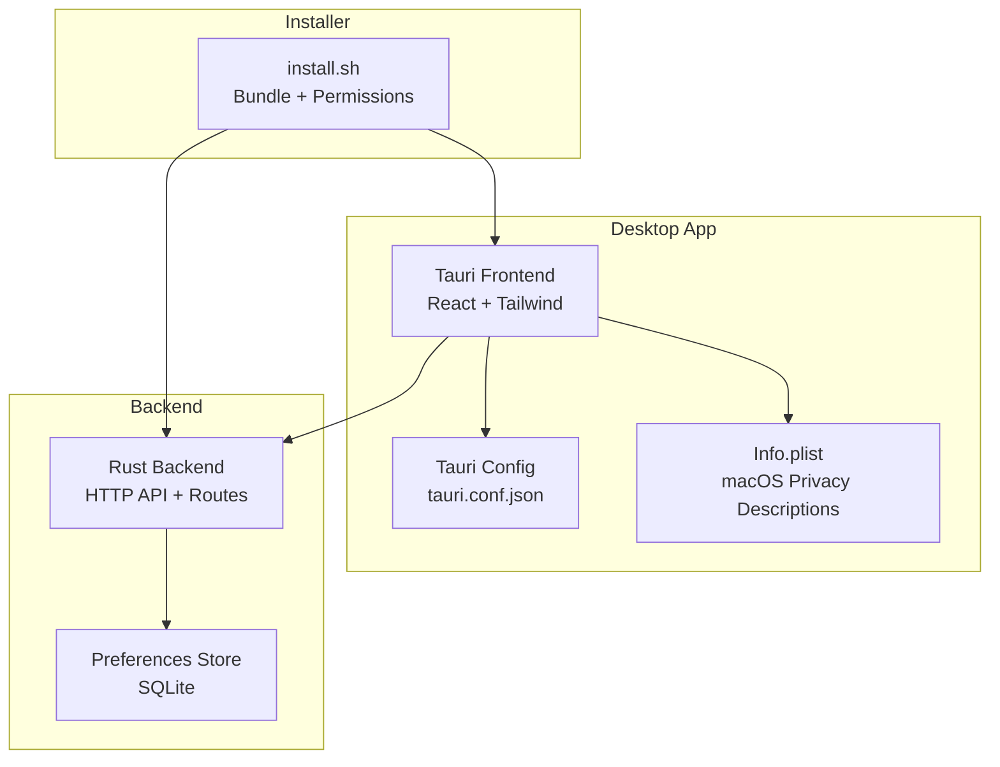
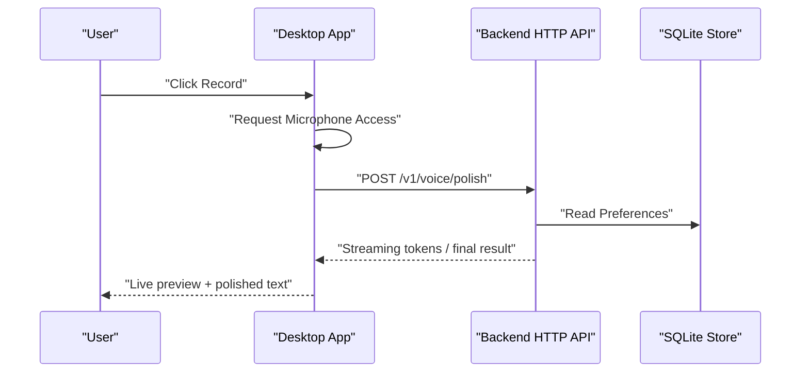
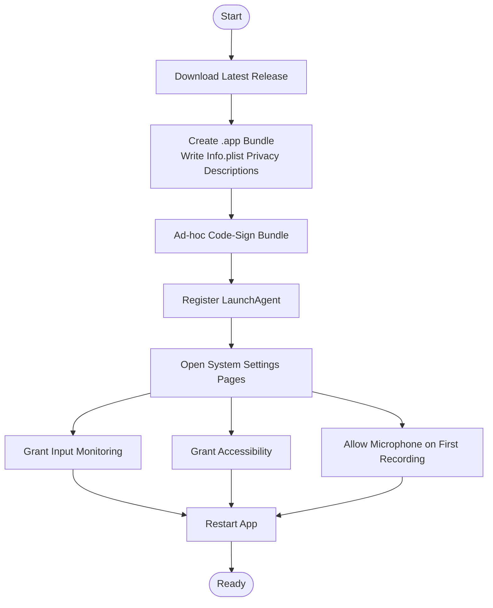
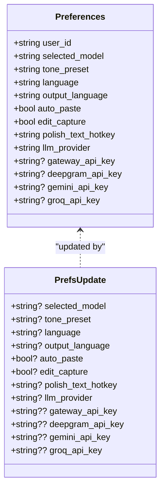
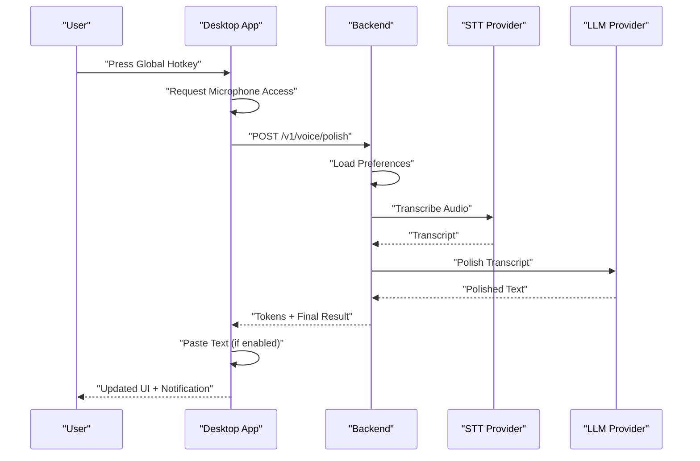
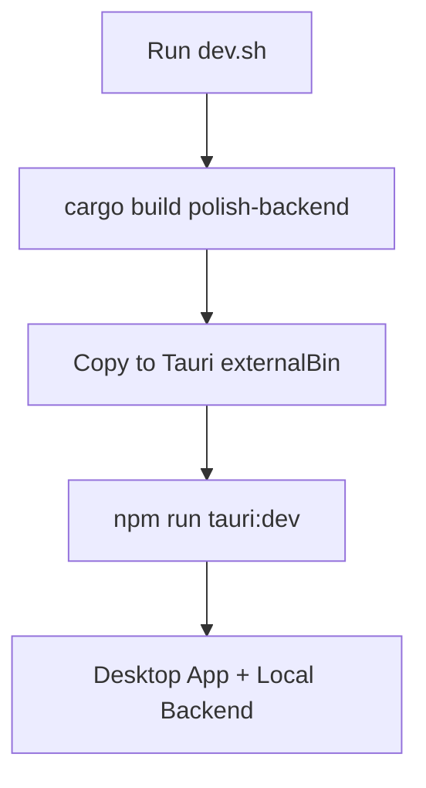
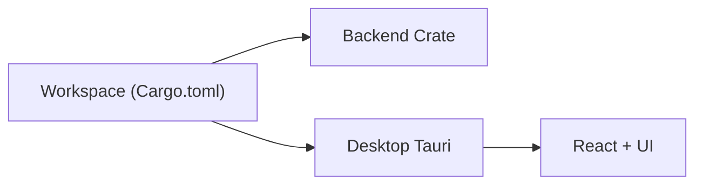

# Getting Started

<cite>
**Referenced Files in This Document**
- [install.sh](file://install.sh)
- [dev.sh](file://dev.sh)
- [Cargo.toml](file://Cargo.toml)
- [tauri.conf.json](file://desktop/src-tauri/tauri.conf.json)
- [Info.plist](file://desktop/src-tauri/Info.plist)
- [package.json](file://desktop/package.json)
- [App.tsx](file://desktop/src/App.tsx)
- [lib.rs](file://crates/backend/src/lib.rs)
- [main.rs](file://crates/backend/src/main.rs)
- [prefs.rs](file://crates/backend/src/store/prefs.rs)
- [mod.rs](file://crates/backend/src/stt/mod.rs)
- [mod.rs](file://crates/backend/src/embedder/mod.rs)
</cite>

## Table of Contents
1. [Introduction](#introduction)
2. [Project Structure](#project-structure)
3. [Core Components](#core-components)
4. [Architecture Overview](#architecture-overview)
5. [Detailed Component Analysis](#detailed-component-analysis)
6. [Dependency Analysis](#dependency-analysis)
7. [Performance Considerations](#performance-considerations)
8. [Troubleshooting Guide](#troubleshooting-guide)
9. [Conclusion](#conclusion)
10. [Appendices](#appendices)

## Introduction
This guide helps you install and configure WISPR Hindi Bridge (also known as “Said”) on macOS, set up AI providers, and use the app for voice recording and text processing. It covers:
- System requirements and permission grants for Accessibility, Input Monitoring, and Microphone
- Step-by-step installation and first-time setup
- Initial configuration for AI providers (Gemini/OpenAI), microphone access, and preferences
- First-time user tutorial for recording, processing, and navigating the interface
- Troubleshooting common issues
- Development environment setup for building and debugging locally

## Project Structure
WISPR Hindi Bridge is a Tauri desktop app with a Rust backend and a React frontend. The backend exposes HTTP APIs consumed by the desktop app. The installer script automates bundling and permission setup on macOS.

**Diagram sources**
- [tauri.conf.json:1-51](file://desktop/src-tauri/tauri.conf.json#L1-L51)
- [Info.plist:1-18](file://desktop/src-tauri/Info.plist#L1-L18)
- [lib.rs:150-227](file://crates/backend/src/lib.rs#L150-L227)
- [prefs.rs:47-163](file://crates/backend/src/store/prefs.rs#L47-L163)
- [install.sh:1-410](file://install.sh#L1-L410)

**Section sources**
- [tauri.conf.json:1-51](file://desktop/src-tauri/tauri.conf.json#L1-L51)
- [Info.plist:1-18](file://desktop/src-tauri/Info.plist#L1-L18)
- [Cargo.toml:1-30](file://Cargo.toml#L1-L30)

## Core Components
- Desktop app: React-based UI with Tauri integration, handles UI state, permissions prompts, and invokes backend APIs.
- Backend service: Rust Axum server exposing REST endpoints for voice/text processing, preferences, history, and cloud integration.
- Installer: Automates app bundling, sets privacy descriptions, signs the bundle, registers LaunchAgent, and guides permission grants.

Key responsibilities:
- Desktop app: Hotkey detection, microphone access, Accessibility and Input Monitoring grants, invoking backend endpoints, rendering UI and notifications.
- Backend: Preferences caching, database-backed preferences and history, STT and embedding provider integrations, CORS configuration, metering reporting.

**Section sources**
- [App.tsx:1-671](file://desktop/src/App.tsx#L1-L671)
- [lib.rs:135-227](file://crates/backend/src/lib.rs#L135-L227)
- [main.rs:1-234](file://crates/backend/src/main.rs#L1-L234)
- [install.sh:1-410](file://install.sh#L1-L410)

## Architecture Overview
The desktop app communicates with the Rust backend over a local HTTP server. The backend manages preferences, history, and integrates with AI/STT providers. The installer configures macOS privacy permissions and packaging metadata.

**Diagram sources**
- [App.tsx:322-342](file://desktop/src/App.tsx#L322-L342)
- [lib.rs:150-227](file://crates/backend/src/lib.rs#L150-L227)
- [main.rs:189-142](file://crates/backend/src/main.rs#L189-L142)

## Detailed Component Analysis

### macOS Installation and Permission Grants
Follow the installer’s guided steps to:
- Download and place the app bundle
- Write privacy descriptions for microphone, Accessibility, Input Monitoring, and Apple Events
- Sign the bundle to preserve permissions across updates
- Register a LaunchAgent for auto-start
- Open System Settings pages to grant required permissions

Required permissions:
- Input Monitoring: Detect global hotkeys
- Accessibility: Paste polished text into other apps
- Microphone: Transcription and voice processing

**Diagram sources**
- [install.sh:52-163](file://install.sh#L52-L163)
- [Info.plist:5-15](file://desktop/src-tauri/Info.plist#L5-L15)

**Section sources**
- [install.sh:382-410](file://install.sh#L382-L410)
- [Info.plist:1-18](file://desktop/src-tauri/Info.plist#L1-L18)

### Initial Configuration: AI Providers and Preferences
On first run, the backend initializes defaults and the desktop app checks for required connections. Configure AI providers and preferences as follows:

- AI provider selection:
  - Supported providers include a gateway, Gemini direct, Groq, and OpenAI Codex. Provider routing is stored in preferences.
- API keys:
  - Keys are stored locally in the SQLite preferences table and never leave the device.
- Preferences:
  - Includes model selection, tone preset, custom prompt, languages, auto-paste, edit capture, hotkeys, and provider routing.

**Diagram sources**
- [prefs.rs:6-45](file://crates/backend/src/store/prefs.rs#L6-L45)

**Section sources**
- [prefs.rs:47-163](file://crates/backend/src/store/prefs.rs#L47-L163)
- [lib.rs:150-227](file://crates/backend/src/lib.rs#L150-L227)

### First-Time User Tutorial
- Start the app via the installer-managed command or LaunchAgent.
- Grant permissions in System Settings if prompted.
- Connect your OpenAI account (required) and optionally connect cloud credentials.
- Choose a model and tone preset in Settings.
- Press the global hotkey to start/stop recording; microphone permission will be requested on first use.
- Watch the live preview while the backend polishes the text; the polished result can be pasted automatically if enabled.

**Diagram sources**
- [App.tsx:322-342](file://desktop/src/App.tsx#L322-L342)
- [lib.rs:150-227](file://crates/backend/src/lib.rs#L150-L227)
- [main.rs:189-142](file://crates/backend/src/main.rs#L189-L142)

**Section sources**
- [App.tsx:129-147](file://desktop/src/App.tsx#L129-L147)
- [App.tsx:487-536](file://desktop/src/App.tsx#L487-L536)
- [main.rs:18-86](file://crates/backend/src/main.rs#L18-L86)

### Development Environment Setup
Prerequisites:
- Rust toolchain and Cargo
- Node.js and npm
- Tauri CLI
- macOS with appropriate minimum OS version as configured

Build and run:
- Use the provided script to build the backend and sync the binary into the Tauri external binaries folder, then launch Tauri dev mode.
- The backend listens on a local port and serves HTTP APIs consumed by the desktop app.

**Diagram sources**
- [dev.sh:1-21](file://dev.sh#L1-L21)
- [tauri.conf.json:41-43](file://desktop/src-tauri/tauri.conf.json#L41-L43)

**Section sources**
- [dev.sh:1-21](file://dev.sh#L1-L21)
- [tauri.conf.json:1-51](file://desktop/src-tauri/tauri.conf.json#L1-L51)
- [package.json:1-38](file://desktop/package.json#L1-L38)

## Dependency Analysis
The workspace uses a shared resolver and common dependency versions. The desktop app depends on Tauri APIs and UI libraries, while the backend depends on Axum, Tokio, and HTTP clients.

**Diagram sources**
- [Cargo.toml:1-30](file://Cargo.toml#L1-L30)
- [package.json:12-36](file://desktop/package.json#L12-L36)

**Section sources**
- [Cargo.toml:16-24](file://Cargo.toml#L16-L24)
- [package.json:12-36](file://desktop/package.json#L12-L36)

## Performance Considerations
- Backend HTTP client keeps persistent connections to reduce overhead.
- Preferences and lexicon caches minimize database reads for frequently accessed data.
- Cleanup tasks periodically remove old recordings and audio files to control storage growth.

[No sources needed since this section provides general guidance]

## Troubleshooting Guide
Common issues and resolutions:

- Permission denials
  - Symptoms: Hotkey or paste not working; UI indicates missing permissions.
  - Resolution: Use the installer’s helper to open System Settings pages and grant Input Monitoring and Accessibility. Restart the app after granting permissions.
  - Reference: [install.sh:382-410](file://install.sh#L382-L410), [install.sh:309-325](file://install.sh#L309-L325)

- Microphone access problems
  - Symptoms: No audio recorded; microphone prompt not appearing.
  - Resolution: Allow microphone access when prompted on first recording; ensure the app has microphone permission in System Settings.
  - Reference: [Info.plist:11-12](file://desktop/src-tauri/Info.plist#L11-L12), [App.tsx:322-342](file://desktop/src/App.tsx#L322-L342)

- Network connectivity issues
  - Symptoms: OpenAI connection fails or timeouts; metering reports not sent.
  - Resolution: Verify outbound connectivity; ensure OpenAI OAuth flow completes; check backend logs for errors.
  - Reference: [main.rs:103-118](file://crates/backend/src/main.rs#L103-L118), [App.tsx:149-177](file://desktop/src/App.tsx#L149-L177)

- App not starting or crashing
  - Symptoms: Process not running; logs indicate startup failures.
  - Resolution: Use the installer diagnostics command to check process, binary presence, and LaunchAgent registration; review recent logs.
  - Reference: [install.sh:269-310](file://install.sh#L269-L310), [install.sh:362-381](file://install.sh#L362-L381)

**Section sources**
- [install.sh:269-325](file://install.sh#L269-L325)
- [install.sh:362-381](file://install.sh#L362-L381)
- [App.tsx:149-177](file://desktop/src/App.tsx#L149-L177)
- [main.rs:103-118](file://crates/backend/src/main.rs#L103-L118)

## Conclusion
You are now ready to install WISPR Hindi Bridge on macOS, grant the required permissions, connect your AI providers, and start using the voice-to-polished-text workflow. For development, use the provided scripts to build and run the app locally. Refer to the troubleshooting section for resolving common issues.

[No sources needed since this section summarizes without analyzing specific files]

## Appendices

### A. AI Provider Setup Notes
- Provider routing is configurable in preferences and supports multiple backends.
- STT provider module exists for Deepgram; embedding provider module exists for Gemini.
- Reference: [prefs.rs:23-24](file://crates/backend/src/store/prefs.rs#L23-L24), [mod.rs:1-2](file://crates/backend/src/stt/mod.rs#L1-L2), [mod.rs:1-2](file://crates/backend/src/embedder/mod.rs#L1-L2)

**Section sources**
- [prefs.rs:23-24](file://crates/backend/src/store/prefs.rs#L23-L24)
- [mod.rs:1-2](file://crates/backend/src/stt/mod.rs#L1-L2)
- [mod.rs:1-2](file://crates/backend/src/embedder/mod.rs#L1-L2)