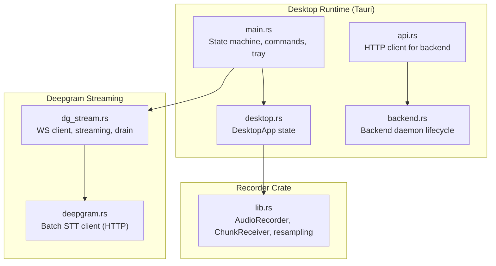
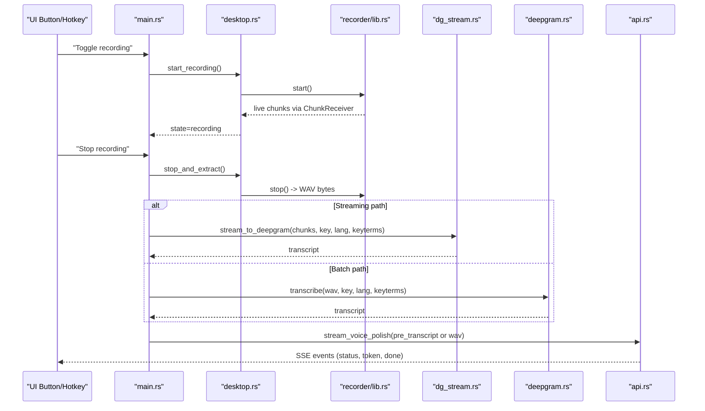
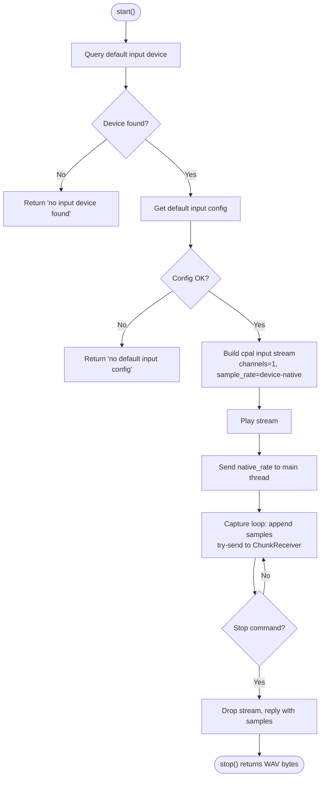
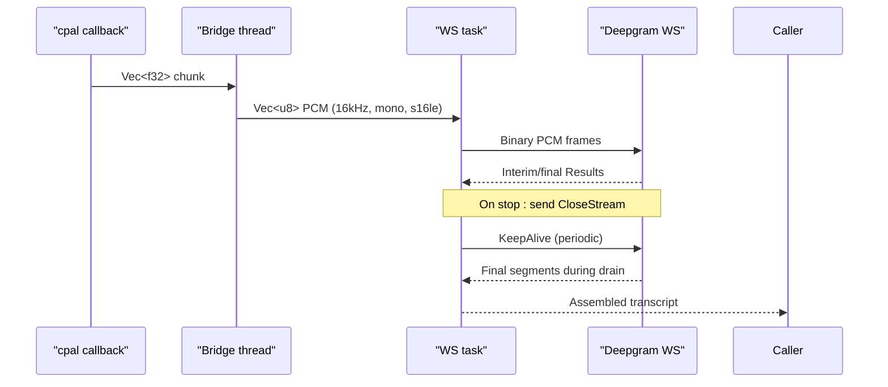
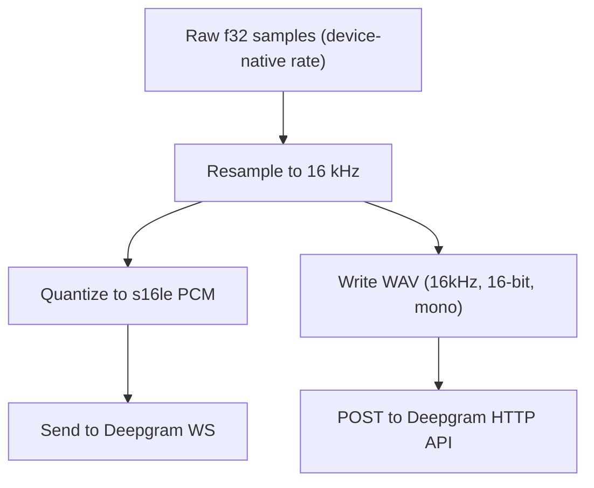
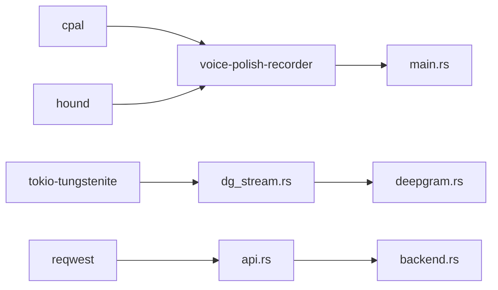

# Audio Capture System

<cite>
**Referenced Files in This Document**
- [main.rs](file://desktop/src-tauri/src/main.rs)
- [dg_stream.rs](file://desktop/src-tauri/src/dg_stream.rs)
- [lib.rs](file://crates/recorder/src/lib.rs)
- [desktop.rs](file://desktop/src-tauri/src/desktop.rs)
- [api.rs](file://desktop/src-tauri/src/api.rs)
- [backend.rs](file://desktop/src-tauri/src/backend.rs)
- [deepgram.rs](file://crates/backend/src/stt/deepgram.rs)
- [Cargo.toml](file://desktop/src-tauri/Cargo.toml)
- [tauri.conf.json](file://desktop/src-tauri/tauri.conf.json)
- [Info.plist](file://desktop/src-tauri/Info.plist)
</cite>

## Table of Contents
1. [Introduction](#introduction)
2. [Project Structure](#project-structure)
3. [Core Components](#core-components)
4. [Architecture Overview](#architecture-overview)
5. [Detailed Component Analysis](#detailed-component-analysis)
6. [Dependency Analysis](#dependency-analysis)
7. [Performance Considerations](#performance-considerations)
8. [Troubleshooting Guide](#troubleshooting-guide)
9. [Conclusion](#conclusion)

## Introduction
This document describes the audio capture and processing system used to record microphone input, preprocess audio, and deliver it to Deepgram for real-time speech-to-text (STT). It covers microphone access, audio stream initialization, real-time capture pipeline, audio quality and format settings, Deepgram streaming integration, the audio processing pipeline, buffer management and latency considerations, error handling, platform-specific audio handling, permissions, and fallback mechanisms.

## Project Structure
The audio system spans three layers:
- Desktop runtime (Tauri) orchestrates recording state, triggers capture, and manages the Deepgram streaming pipeline.
- Recorder crate captures live audio from the default input device and prepares PCM buffers.
- Deepgram integration streams PCM frames to Deepgram’s WebSocket API and aggregates transcripts.

**Diagram sources**
- [main.rs:1-2481](file://desktop/src-tauri/src/main.rs#L1-L2481)
- [desktop.rs:1-123](file://desktop/src-tauri/src/desktop.rs#L1-L123)
- [lib.rs:1-235](file://crates/recorder/src/lib.rs#L1-L235)
- [dg_stream.rs:1-500](file://desktop/src-tauri/src/dg_stream.rs#L1-L500)
- [deepgram.rs:1-200](file://crates/backend/src/stt/deepgram.rs#L1-L200)
- [backend.rs:1-152](file://desktop/src-tauri/src/backend.rs#L1-L152)
- [api.rs:1-920](file://desktop/src-tauri/src/api.rs#L1-L920)

**Section sources**
- [main.rs:1-2481](file://desktop/src-tauri/src/main.rs#L1-L2481)
- [lib.rs:1-235](file://crates/recorder/src/lib.rs#L1-L235)
- [dg_stream.rs:1-500](file://desktop/src-tauri/src/dg_stream.rs#L1-L500)
- [desktop.rs:1-123](file://desktop/src-tauri/src/desktop.rs#L1-L123)
- [api.rs:1-920](file://desktop/src-tauri/src/api.rs#L1-L920)
- [backend.rs:1-152](file://desktop/src-tauri/src/backend.rs#L1-L152)
- [deepgram.rs:1-200](file://crates/backend/src/stt/deepgram.rs#L1-L200)
- [Cargo.toml:1-53](file://desktop/src-tauri/Cargo.toml#L1-L53)
- [tauri.conf.json:1-51](file://desktop/src-tauri/tauri.conf.json#L1-L51)
- [Info.plist:1-17](file://desktop/src-tauri/Info.plist#L1-L17)

## Core Components
- AudioRecorder: Initializes the default input device, builds a cpal input stream, and emits live audio chunks to a channel. It also produces a WAV file upon stopping for batch STT when needed.
- ChunkReceiver: A handle passed to the streaming pipeline to receive live float32 PCM chunks and the native sample rate.
- Deepgram WebSocket client: Connects to Deepgram, sends PCM frames, receives interim and final results, and drains remaining messages after CloseStream.
- DesktopApp: Manages recording state transitions and exposes the ChunkReceiver for streaming.
- Backend integration: Provides HTTP-based STT client and SSE orchestration for polish operations.

**Section sources**
- [lib.rs:1-235](file://crates/recorder/src/lib.rs#L1-L235)
- [dg_stream.rs:1-500](file://desktop/src-tauri/src/dg_stream.rs#L1-L500)
- [desktop.rs:1-123](file://desktop/src-tauri/src/desktop.rs#L1-L123)
- [deepgram.rs:1-200](file://crates/backend/src/stt/deepgram.rs#L1-L200)
- [api.rs:1-920](file://desktop/src-tauri/src/api.rs#L1-L920)

## Architecture Overview
The system supports two paths:
- Real-time streaming: Live PCM chunks are sent to Deepgram via WebSocket during recording. The first results appear quickly after the user stops speaking.
- Batch STT: On-demand WAV is uploaded to Deepgram for transcription when streaming is not used.

**Diagram sources**
- [main.rs:800-920](file://desktop/src-tauri/src/main.rs#L800-L920)
- [desktop.rs:84-122](file://desktop/src-tauri/src/desktop.rs#L84-L122)
- [lib.rs:69-218](file://crates/recorder/src/lib.rs#L69-L218)
- [dg_stream.rs:37-388](file://desktop/src-tauri/src/dg_stream.rs#L37-L388)
- [deepgram.rs:59-146](file://crates/backend/src/stt/deepgram.rs#L59-L146)
- [api.rs:128-178](file://desktop/src-tauri/src/api.rs#L128-L178)

## Detailed Component Analysis

### Microphone Access and Audio Stream Initialization
- Device selection: The recorder queries the default input device and validates a default input configuration.
- Stream configuration: Uses cpal with mono channel and the device-native sample rate. Buffer size is left to cpal’s default.
- Callback behavior: Incoming f32 samples are appended to an internal buffer and asynchronously forwarded to the ChunkReceiver channel. The callback also attempts a non-blocking send to the WS pipeline to avoid backpressure.
- Thread model: A dedicated thread owns the cpal stream and the recording loop. The thread reports readiness (success or error) and handles stop commands by tearing down the stream and replying with captured samples.

**Diagram sources**
- [lib.rs:69-157](file://crates/recorder/src/lib.rs#L69-L157)
- [lib.rs:167-218](file://crates/recorder/src/lib.rs#L167-L218)

**Section sources**
- [lib.rs:69-157](file://crates/recorder/src/lib.rs#L69-L157)
- [lib.rs:167-218](file://crates/recorder/src/lib.rs#L167-L218)

### Real-Time Audio Capture Pipeline (Streaming to Deepgram)
- Chunk delivery: The cpal callback forwards f32 PCM chunks to a bounded channel. A separate thread bridges the synchronous cpal receiver to an asynchronous Tokio channel for the WS task.
- Resampling and quantization: Each chunk is resampled to 16 kHz and converted to signed 16-bit little-endian PCM bytes.
- WebSocket connection: The client constructs a WS URL with model, language, punctuation, encoding, sample rate, channels, interim results, endpointing, and optional keyterms. Authentication is set via an Authorization header. A strict 5-second upgrade timeout is enforced.
- Streaming loop: The WS task concurrently:
  - Receives PCM chunks and sends them as binary messages.
  - Sends KeepAlive messages every 8 seconds when no audio is being sent.
  - Processes incoming Results messages, capturing is_final segments and speech_final markers.
- Drain phase: After the audio channel closes, the client sends CloseStream and waits for a configurable drain window. It resets a 500ms timer on each speech_final or UtteranceEnd, exiting only after no new results arrive within that period.

**Diagram sources**
- [dg_stream.rs:118-253](file://desktop/src-tauri/src/dg_stream.rs#L118-L253)
- [dg_stream.rs:260-362](file://desktop/src-tauri/src/dg_stream.rs#L260-L362)

**Section sources**
- [dg_stream.rs:37-114](file://desktop/src-tauri/src/dg_stream.rs#L37-L114)
- [dg_stream.rs:118-253](file://desktop/src-tauri/src/dg_stream.rs#L118-L253)
- [dg_stream.rs:260-362](file://desktop/src-tauri/src/dg_stream.rs#L260-L362)

### Audio Quality Settings, Sampling Rates, and Format Configurations
- Target sample rate: 16 kHz (mono, 16-bit PCM) for Deepgram compatibility and efficient streaming.
- Encoding: linear16 (signed 16-bit little-endian) for WS frames.
- Channels: 1 (mono).
- Endpointing: 100 ms for multilingual mode, 500 ms for Hindi/English to reduce premature segmentation.
- Keyterms: Up to 100 personal vocabulary terms are appended to the WS URL to improve recognition.
- Confidence markers: Low-confidence words (< 85%) are annotated with [word?XX%] markers for downstream correction.

**Section sources**
- [dg_stream.rs:49-83](file://desktop/src-tauri/src/dg_stream.rs#L49-L83)
- [dg_stream.rs:390-422](file://desktop/src-tauri/src/dg_stream.rs#L390-L422)
- [deepgram.rs:12-14](file://crates/backend/src/stt/deepgram.rs#L12-L14)

### Integration with Deepgram Streaming for Speech-to-Text
- Connection establishment: WS URL built with model, language, punctuation, encoding, sample rate, channels, interim results, endpointing, and keyterms. Authorization header set from the configured API key. Upgrade timeout enforced.
- Streaming protocols: Binary frames carry PCM; text frames include CloseStream and KeepAlive. Results messages include is_final and speech_final flags.
- Audio data transmission: PCM chunks are sent continuously; the first chunk logs a note; periodic logging tracks throughput.
- Drain behavior: After CloseStream, the client waits for a dynamic drain window, resetting a 500ms timer on speech_final/UtteranceEnd until exhaustion.

**Section sources**
- [dg_stream.rs:57-114](file://desktop/src-tauri/src/dg_stream.rs#L57-L114)
- [dg_stream.rs:140-253](file://desktop/src-tauri/src/dg_stream.rs#L140-L253)
- [dg_stream.rs:260-362](file://desktop/src-tauri/src/dg_stream.rs#L260-L362)

### Audio Processing Pipeline from Raw Input to STT Model Input
- Raw input: f32 samples from cpal.
- Live streaming path:
  - Resample to 16 kHz using linear interpolation.
  - Clamp and convert to signed 16-bit PCM.
  - Send as binary frames to Deepgram.
- Batch path:
  - Resample to 16 kHz.
  - Write WAV with 16 kHz, 16-bit, mono specification.
  - Upload WAV to Deepgram HTTP API for transcription.

**Diagram sources**
- [lib.rs:20-36](file://crates/recorder/src/lib.rs#L20-L36)
- [lib.rs:202-217](file://crates/recorder/src/lib.rs#L202-L217)
- [dg_stream.rs:123-138](file://desktop/src-tauri/src/dg_stream.rs#L123-L138)
- [deepgram.rs:59-95](file://crates/backend/src/stt/deepgram.rs#L59-L95)

**Section sources**
- [lib.rs:20-36](file://crates/recorder/src/lib.rs#L20-L36)
- [lib.rs:202-217](file://crates/recorder/src/lib.rs#L202-L217)
- [dg_stream.rs:123-138](file://desktop/src-tauri/src/dg_stream.rs#L123-L138)
- [deepgram.rs:59-95](file://crates/backend/src/stt/deepgram.rs#L59-L95)

### Audio Buffer Management, Latency, and Performance Optimization
- Channel buffering: Live chunks are buffered in a bounded channel (256 slots) to decouple the cpal thread from the WS task.
- Backpressure handling: The cpal callback uses a non-blocking send to the WS pipeline; if the channel is full, chunks are dropped to prevent audio loss.
- Drain window: A dynamic drain window (min 2.5 seconds, scaled by chunk count) ensures Deepgram flushes remaining utterances after CloseStream.
- KeepAlive: Periodic KeepAlive messages maintain the WS connection during silence.
- Latency targets: First results arrive ~100–200 ms after stop due to streaming; endpointing tuned for Hindi/English reduces premature splits.

**Section sources**
- [lib.rs:81-85](file://crates/recorder/src/lib.rs#L81-L85)
- [dg_stream.rs:118-147](file://desktop/src-tauri/src/dg_stream.rs#L118-L147)
- [dg_stream.rs:273-277](file://desktop/src-tauri/src/dg_stream.rs#L273-L277)
- [dg_stream.rs:205-213](file://desktop/src-tauri/src/dg_stream.rs#L205-L213)

### Error Handling for Microphone Access, Device Changes, and Streaming Interruptions
- Microphone access failures:
  - No input device found or default input configuration unavailable.
  - Silence detected (peak amplitude below threshold) often indicates missing microphone permission.
- Device changes:
  - If the default device changes mid-recording, the cpal stream may fail to open or produce errors.
- Streaming interruptions:
  - WS connect timeout or failure.
  - WS send errors or server-closed events.
  - Drain timeouts without speech_final.
- Human-readable errors:
  - The desktop maps common error strings to user-friendly messages for UI display.

**Section sources**
- [lib.rs:89-103](file://crates/recorder/src/lib.rs#L89-L103)
- [lib.rs:188-192](file://crates/recorder/src/lib.rs#L188-L192)
- [dg_stream.rs:102-112](file://desktop/src-tauri/src/dg_stream.rs#L102-L112)
- [dg_stream.rs:160-164](file://desktop/src-tauri/src/dg_stream.rs#L160-L164)
- [main.rs:76-128](file://desktop/src-tauri/src/main.rs#L76-L128)

### Platform-Specific Audio Handling, Permissions, and Fallbacks
- Platform audio backends:
  - cpal integrates with platform-specific audio stacks (e.g., CoreAudio on macOS, ALSA on Linux, Windows WASAPI).
- Permission requirements:
  - macOS Info.plist entries request microphone, accessibility, input monitoring, and Apple events usage.
  - The desktop checks for accessibility and input monitoring grants and surfaces actionable requests to the user.
- Fallback mechanisms:
  - If streaming fails or no API key is present, the system can fall back to batch STT using the generated WAV.
  - If no audio is captured or duration is too short, the system discards the recording and suggests checking microphone permissions.

**Section sources**
- [Cargo.toml:45-52](file://desktop/src-tauri/Cargo.toml#L45-L52)
- [Info.plist:5-15](file://desktop/src-tauri/Info.plist#L5-L15)
- [desktop.rs:63-67](file://desktop/src-tauri/src/desktop.rs#L63-L67)
- [lib.rs:220-227](file://crates/recorder/src/lib.rs#L220-L227)
- [dg_stream.rs:44-47](file://desktop/src-tauri/src/dg_stream.rs#L44-L47)
- [deepgram.rs:59-66](file://crates/backend/src/stt/deepgram.rs#L59-L66)

## Dependency Analysis
The audio system relies on:
- cpal for cross-platform audio input.
- hound for WAV writing in the batch path.
- tokio-tungstenite for Deepgram WebSocket client.
- reqwest for HTTP-based STT and backend SSE orchestration.

**Diagram sources**
- [Cargo.toml:42-43](file://desktop/src-tauri/Cargo.toml#L42-L43)
- [Cargo.toml:24-25](file://desktop/src-tauri/Cargo.toml#L24-L25)
- [Cargo.toml:18-19](file://desktop/src-tauri/Cargo.toml#L18-L19)
- [lib.rs:1-9](file://crates/recorder/src/lib.rs#L1-L9)
- [dg_stream.rs:12-18](file://desktop/src-tauri/src/dg_stream.rs#L12-L18)
- [api.rs:6-10](file://desktop/src-tauri/src/api.rs#L6-L10)
- [backend.rs:1-10](file://desktop/src-tauri/src/backend.rs#L1-L10)

**Section sources**
- [Cargo.toml:1-53](file://desktop/src-tauri/Cargo.toml#L1-L53)
- [lib.rs:1-9](file://crates/recorder/src/lib.rs#L1-L9)
- [dg_stream.rs:12-18](file://desktop/src-tauri/src/dg_stream.rs#L12-L18)
- [api.rs:6-10](file://desktop/src-tauri/src/api.rs#L6-L10)
- [backend.rs:1-10](file://desktop/src-tauri/src/backend.rs#L1-L10)

## Performance Considerations
- Minimize CPU overhead by resampling only once per chunk and using linear interpolation.
- Use a bounded channel (256) to prevent memory growth under sustained load; non-blocking sends avoid stalls.
- Tune endpointing per language to balance responsiveness and accuracy.
- Prefer streaming for low-latency transcription; batch STT is suitable when streaming is unavailable.
- Reduce payload size by limiting keyterms and avoiding unnecessary metadata.

[No sources needed since this section provides general guidance]

## Troubleshooting Guide
Common issues and resolutions:
- No microphone device found: Verify the default input device and permissions.
- Cannot open audio stream: Check default input configuration and device availability.
- Silence detected: Confirm microphone permissions and ensure the mic is not muted.
- WS connect timeout or failure: Validate the Deepgram API key and network connectivity.
- WS send errors or server-closed: Inspect network stability and Deepgram service status.
- Empty transcript: Ensure sufficient speech duration and consider enabling batch STT fallback.
- Drain timeouts: Adjust expectations; the system waits for a reset 500ms timer on speech_final/UtteranceEnd.

**Section sources**
- [lib.rs:89-103](file://crates/recorder/src/lib.rs#L89-L103)
- [lib.rs:188-192](file://crates/recorder/src/lib.rs#L188-L192)
- [dg_stream.rs:102-112](file://desktop/src-tauri/src/dg_stream.rs#L102-L112)
- [dg_stream.rs:160-164](file://desktop/src-tauri/src/dg_stream.rs#L160-L164)
- [main.rs:76-128](file://desktop/src-tauri/src/main.rs#L76-L128)

## Conclusion
The audio capture and processing system combines a robust live capture pipeline with a real-time Deepgram WebSocket integration and a reliable batch STT fallback. It balances low latency with accuracy through targeted endpointing, efficient resampling, and careful buffer management. Platform-specific audio backends and explicit permission handling ensure broad compatibility, while comprehensive error mapping improves user experience.