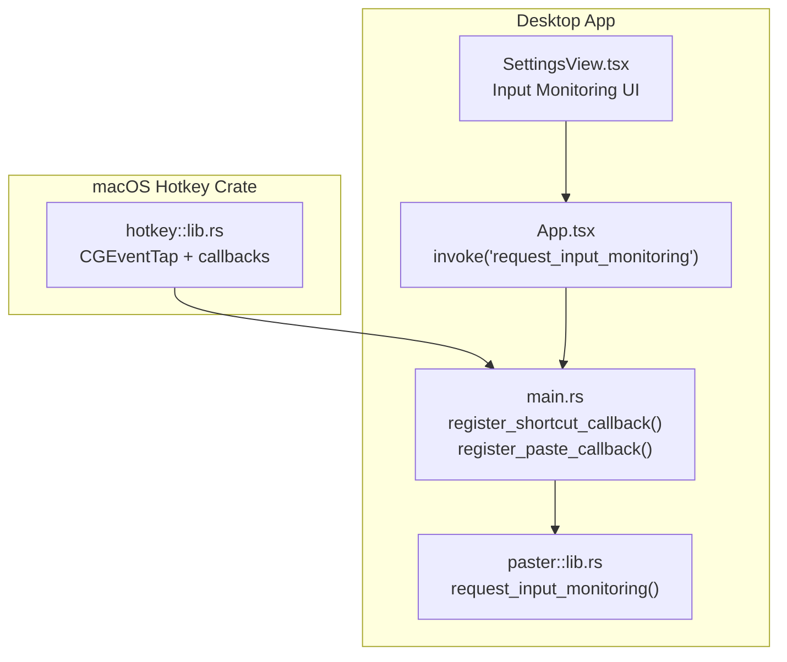
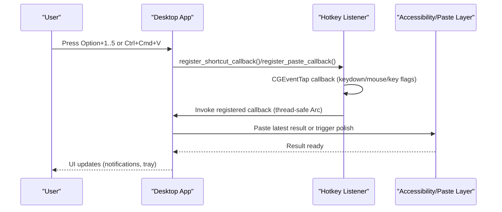
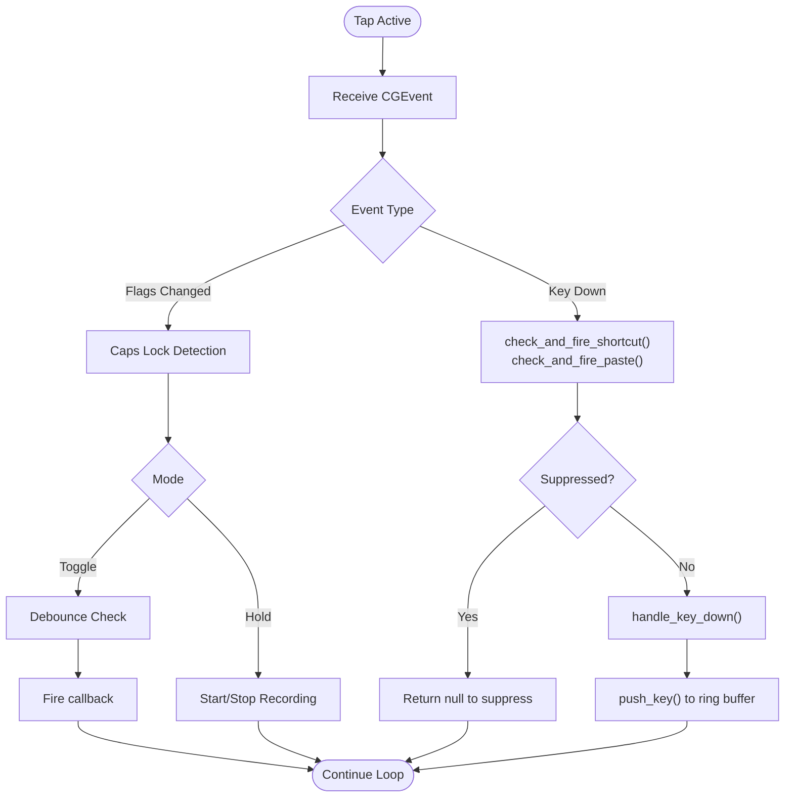
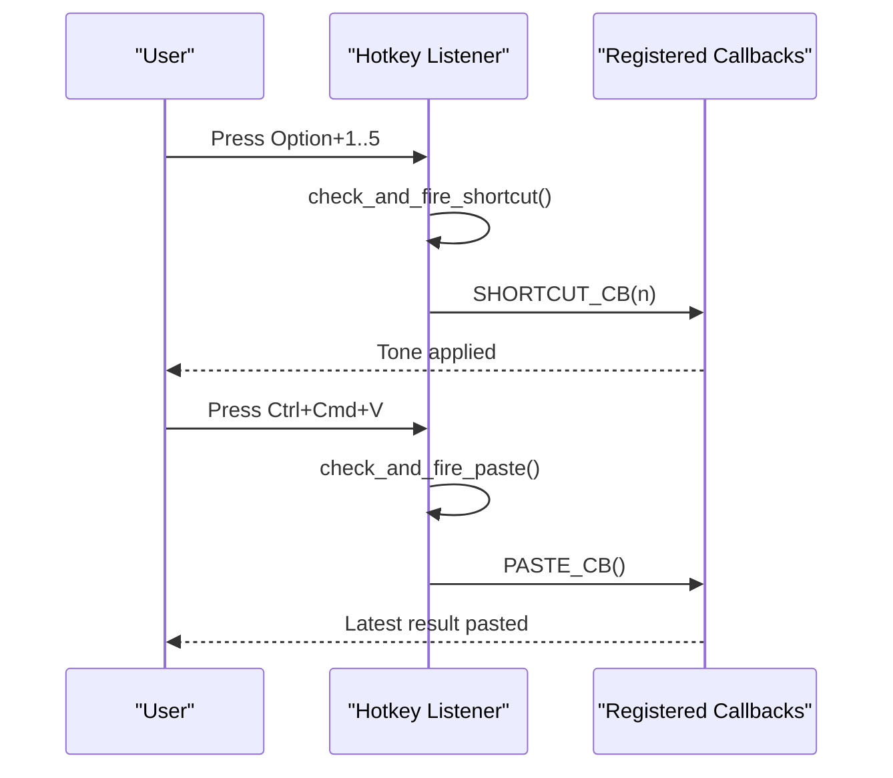
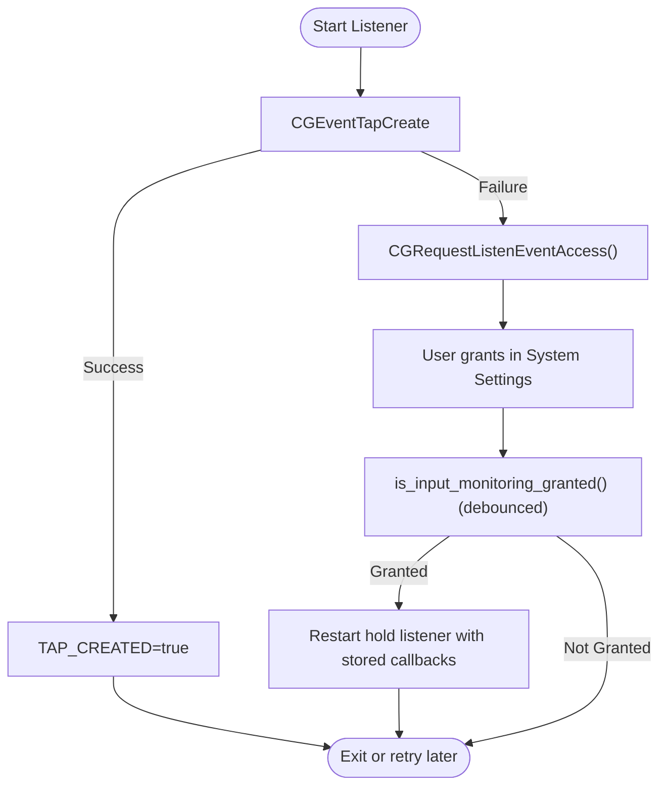
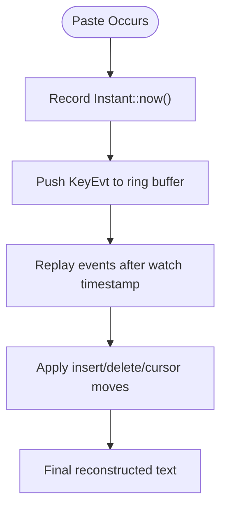
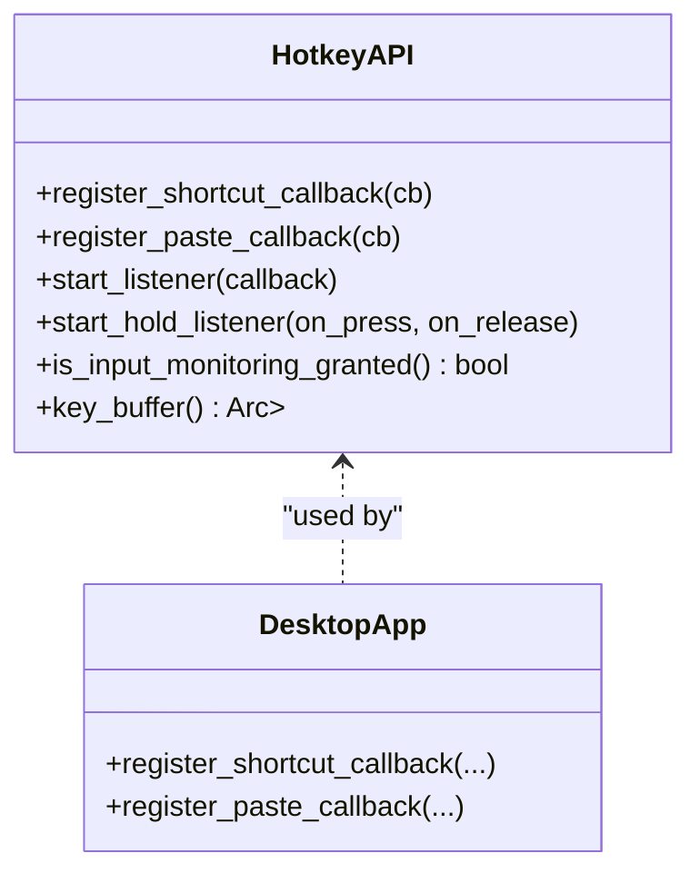
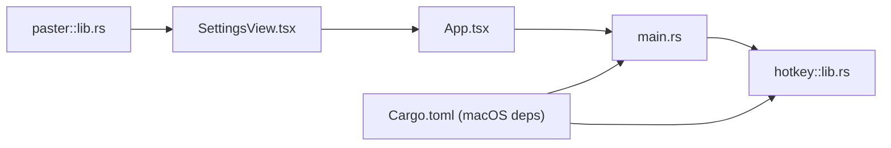

# Global Keyboard Shortcuts

<cite>
**Referenced Files in This Document**
- [lib.rs](file://crates/hotkey/src/lib.rs)
- [main.rs](file://desktop/src-tauri/src/main.rs)
- [Cargo.toml](file://desktop/src-tauri/Cargo.toml)
- [lib.rs](file://crates/paster/src/lib.rs)
- [SettingsView.tsx](file://desktop/src/components/views/SettingsView.tsx)
- [App.tsx](file://desktop/src/App.tsx)
</cite>

## Table of Contents
1. [Introduction](#introduction)
2. [Project Structure](#project-structure)
3. [Core Components](#core-components)
4. [Architecture Overview](#architecture-overview)
5. [Detailed Component Analysis](#detailed-component-analysis)
6. [Dependency Analysis](#dependency-analysis)
7. [Performance Considerations](#performance-considerations)
8. [Troubleshooting Guide](#troubleshooting-guide)
9. [Conclusion](#conclusion)

## Introduction
This document explains the global keyboard shortcut system used to intercept low-level keyboard and mouse events on macOS. It covers:
- CGEventTap-based interception and the two operational modes (toggle listener for Caps Lock press/release and hold listener for continuous Caps Lock press detection)
- Hotkey registration for Option+1 through Option+5 tone selection and Ctrl+Cmd+V paste
- Input Monitoring permission integration, including automatic prompting and fallback handling
- Keystroke buffering for edit detection in applications without Accessibility API access
- Debouncing, event classification, and callback registration patterns
- Platform-specific considerations, error handling, and performance optimization techniques

## Project Structure
The global keyboard shortcut system spans three layers:
- macOS-specific hotkey crate implementing CGEventTap and permission checks
- Desktop application wiring callbacks and registering hotkeys
- Frontend controls to trigger permission prompts and reflect status

**Diagram sources**
- [lib.rs:543-588](file://crates/hotkey/src/lib.rs#L543-L588)
- [main.rs:2305-2352](file://desktop/src-tauri/src/main.rs#L2305-L2352)
- [lib.rs:887-893](file://crates/paster/src/lib.rs#L887-L893)
- [SettingsView.tsx:766-788](file://desktop/src/components/views/SettingsView.tsx#L766-L788)
- [App.tsx:355-370](file://desktop/src/App.tsx#L355-L370)

**Section sources**
- [lib.rs:1-110](file://crates/hotkey/src/lib.rs#L1-L110)
- [main.rs:2305-2352](file://desktop/src-tauri/src/main.rs#L2305-L2352)
- [Cargo.toml:45-52](file://desktop/src-tauri/Cargo.toml#L45-L52)

## Core Components
- CGEventTap integration: Creates a run loop source and listens for keyboard/mouse events, enabling suppression of system actions to avoid duplicates.
- Two operational modes:
  - Toggle listener: Fires a callback on every Caps Lock press with a debounce window.
  - Hold listener: Fires on press and release when Caps Lock remains physically held.
- Hotkey registration:
  - Option+1..5: Tone selection callback registration and classification logic.
  - Ctrl+Cmd+V: Paste latest result callback registration and suppression of the system paste action.
- Input Monitoring permission:
  - Authoritative check via CGPreflightListenEventAccess().
  - Automatic prompting via CGRequestListenEventAccess() when tap creation fails.
  - Debounced permission polling and automatic restart of the hold listener upon permission grant.
- Keystroke buffering:
  - Ring buffer of recent key events for edit detection in AX-blind apps.
  - Classification of printable characters, navigation, selection, and destructive actions.
- Event classification and suppression:
  - Flags and keycodes are decoded to route events to callbacks or suppress system actions.
- Callback registration patterns:
  - Shortcuts and paste callbacks are registered once before listeners start.
  - Hold listener callbacks are stored to retry after permission grant.

**Section sources**
- [lib.rs:113-170](file://crates/hotkey/src/lib.rs#L113-L170)
- [lib.rs:172-253](file://crates/hotkey/src/lib.rs#L172-L253)
- [lib.rs:257-317](file://crates/hotkey/src/lib.rs#L257-L317)
- [lib.rs:328-382](file://crates/hotkey/src/lib.rs#L328-L382)
- [lib.rs:384-445](file://crates/hotkey/src/lib.rs#L384-L445)
- [lib.rs:447-509](file://crates/hotkey/src/lib.rs#L447-L509)
- [lib.rs:543-588](file://crates/hotkey/src/lib.rs#L543-L588)

## Architecture Overview
The system integrates a CGEventTap-based listener with Tauri commands and UI controls to manage permissions and hotkeys.

**Diagram sources**
- [main.rs:2305-2352](file://desktop/src-tauri/src/main.rs#L2305-L2352)
- [lib.rs:172-253](file://crates/hotkey/src/lib.rs#L172-L253)
- [lib.rs:384-509](file://crates/hotkey/src/lib.rs#L384-L509)

## Detailed Component Analysis

### CGEventTap Implementation and Modes
- Tap creation and run loop:
  - Listens for keydown, mouse-down, and flags-changed events.
  - Creates a CFMachPort run loop source and runs it on the current run loop.
  - Enables the tap and logs status; if disabled, re-enables on timeout/user input events.
- Toggle listener:
  - On Caps Lock flags-changed, fires a callback if the elapsed time exceeds a debounce threshold.
- Hold listener:
  - On Caps Lock flags-changed, toggles internal state and invokes on_press/on_release callbacks.
  - Suppresses system actions for recognized hotkeys to avoid duplicate effects.

**Diagram sources**
- [lib.rs:543-588](file://crates/hotkey/src/lib.rs#L543-L588)
- [lib.rs:384-445](file://crates/hotkey/src/lib.rs#L384-L445)
- [lib.rs:447-509](file://crates/hotkey/src/lib.rs#L447-L509)
- [lib.rs:328-382](file://crates/hotkey/src/lib.rs#L328-L382)

**Section sources**
- [lib.rs:543-588](file://crates/hotkey/src/lib.rs#L543-L588)
- [lib.rs:384-445](file://crates/hotkey/src/lib.rs#L384-L445)
- [lib.rs:447-509](file://crates/hotkey/src/lib.rs#L447-L509)

### Hotkey Registration: Option+1..5 and Ctrl+Cmd+V
- Option+1..5:
  - Registered via a callback that receives a digit 1–5.
  - Classification ensures only bare Option is considered; other modifiers are rejected.
- Ctrl+Cmd+V:
  - Registered via a callback that pastes the latest polished result.
  - Strict matching: exactly Ctrl+Cmd+V with no other modifiers; suppression prevents system paste.

**Diagram sources**
- [lib.rs:172-214](file://crates/hotkey/src/lib.rs#L172-L214)
- [lib.rs:227-253](file://crates/hotkey/src/lib.rs#L227-L253)
- [main.rs:2305-2352](file://desktop/src-tauri/src/main.rs#L2305-L2352)

**Section sources**
- [lib.rs:164-225](file://crates/hotkey/src/lib.rs#L164-L225)
- [main.rs:2305-2352](file://desktop/src-tauri/src/main.rs#L2305-L2352)

### Input Monitoring Permission System
- Permission check:
  - Uses CGPreflightListenEventAccess() for an authoritative yes/no without creating a tap.
  - Debounced to at most once every 2 seconds to reduce overhead.
- Tap creation failure:
  - If CGEventTapCreate fails, triggers CGRequestListenEventAccess() to prompt the user.
  - Sets a flag indicating the tap was created successfully when it succeeds.
- Automatic restart:
  - If permission is granted after launch and a hold listener was previously attempted, restarts the listener with stored callbacks.

**Diagram sources**
- [lib.rs:257-317](file://crates/hotkey/src/lib.rs#L257-L317)
- [lib.rs:543-588](file://crates/hotkey/src/lib.rs#L543-L588)

**Section sources**
- [lib.rs:257-317](file://crates/hotkey/src/lib.rs#L257-L317)
- [lib.rs:543-588](file://crates/hotkey/src/lib.rs#L543-L588)

### Keystroke Buffering and Edit Detection
- Buffer:
  - A ring buffer of up to 2048 recent key events with timestamps.
  - Stores classified KeyEvt variants for printable characters, navigation, selection, and destructive actions.
- Edit detection:
  - The desktop app replays buffered events after a paste to reconstruct the final text in AX-blind apps.
  - Uses a cursor-and-event replay algorithm to reconcile characters, backspaces, and mouse clicks.

**Diagram sources**
- [lib.rs:113-170](file://crates/hotkey/src/lib.rs#L113-L170)
- [lib.rs:328-382](file://crates/hotkey/src/lib.rs#L328-L382)
- [main.rs:134-200](file://desktop/src-tauri/src/main.rs#L134-L200)

**Section sources**
- [lib.rs:113-170](file://crates/hotkey/src/lib.rs#L113-L170)
- [lib.rs:328-382](file://crates/hotkey/src/lib.rs#L328-L382)
- [main.rs:134-200](file://desktop/src-tauri/src/main.rs#L134-L200)

### Callback Registration Patterns
- Shortcuts:
  - Register once before starting listeners; callbacks receive the digit 1–5.
- Paste:
  - Register once; callback pastes the latest stored result.
- Hold listener:
  - Store callbacks to retry after permission grant; run on a background CFRunLoop thread.

**Diagram sources**
- [lib.rs:164-225](file://crates/hotkey/src/lib.rs#L164-L225)
- [lib.rs:435-445](file://crates/hotkey/src/lib.rs#L435-L445)
- [lib.rs:511-527](file://crates/hotkey/src/lib.rs#L511-L527)
- [main.rs:2305-2352](file://desktop/src-tauri/src/main.rs#L2305-L2352)

**Section sources**
- [lib.rs:164-225](file://crates/hotkey/src/lib.rs#L164-L225)
- [lib.rs:435-445](file://crates/hotkey/src/lib.rs#L435-L445)
- [lib.rs:511-527](file://crates/hotkey/src/lib.rs#L511-L527)
- [main.rs:2305-2352](file://desktop/src-tauri/src/main.rs#L2305-L2352)

## Dependency Analysis
- macOS-only crate hotkey depends on Core Graphics and Core Foundation for CGEventTap and run loop integration.
- Desktop app links the hotkey crate conditionally on macOS and wires Tauri commands to request permissions and register callbacks.
- Frontend invokes Tauri commands to open System Settings for Input Monitoring.

**Diagram sources**
- [Cargo.toml:45-52](file://desktop/src-tauri/Cargo.toml#L45-L52)
- [lib.rs:887-893](file://crates/paster/src/lib.rs#L887-L893)
- [SettingsView.tsx:766-788](file://desktop/src/components/views/SettingsView.tsx#L766-L788)
- [App.tsx:355-370](file://desktop/src/App.tsx#L355-L370)
- [main.rs:2374-2376](file://desktop/src-tauri/src/main.rs#L2374-L2376)
- [lib.rs:66-107](file://crates/hotkey/src/lib.rs#L66-L107)

**Section sources**
- [Cargo.toml:45-52](file://desktop/src-tauri/Cargo.toml#L45-L52)
- [lib.rs:887-893](file://crates/paster/src/lib.rs#L887-L893)
- [SettingsView.tsx:766-788](file://desktop/src/components/views/SettingsView.tsx#L766-L788)
- [App.tsx:355-370](file://desktop/src/App.tsx#L355-L370)
- [main.rs:2374-2376](file://desktop/src-tauri/src/main.rs#L2374-L2376)
- [lib.rs:66-107](file://crates/hotkey/src/lib.rs#L66-L107)

## Performance Considerations
- Debouncing:
  - Toggle mode uses a 300ms debounce to avoid rapid toggling on mechanical keyboards.
  - Permission checks are debounced to 2 seconds to minimize repeated syscalls.
- Event filtering:
  - Only interested event types are subscribed to reduce overhead.
  - Early returns in callbacks prevent unnecessary work.
- Background execution:
  - Hold listener callbacks run on a background CFRunLoop thread; heavy work is offloaded to spawned threads to keep the run loop responsive.
- Buffer sizing:
  - Ring buffer capped at 2048 entries balances memory usage and detection accuracy.

[No sources needed since this section provides general guidance]

## Troubleshooting Guide
- No hotkeys firing:
  - Verify Input Monitoring permission is granted; the system requests it automatically on tap creation failure.
  - Confirm callbacks are registered before starting listeners.
- Duplicate actions:
  - The system suppresses system paste and shortcut typing to avoid duplicates; ensure suppression is working.
- AX-blind apps:
  - Use the keystroke buffer and paste-time watch to reconstruct edits; rely on clipboard reconciliation when AX is unavailable.
- Permission prompts:
  - Use the frontend “Open Settings” button to navigate to System Settings → Privacy & Security → Input Monitoring.

**Section sources**
- [lib.rs:543-588](file://crates/hotkey/src/lib.rs#L543-L588)
- [lib.rs:257-317](file://crates/hotkey/src/lib.rs#L257-L317)
- [lib.rs:172-253](file://crates/hotkey/src/lib.rs#L172-L253)
- [lib.rs:328-382](file://crates/hotkey/src/lib.rs#L328-L382)
- [lib.rs:887-893](file://crates/paster/src/lib.rs#L887-L893)
- [SettingsView.tsx:766-788](file://desktop/src/components/views/SettingsView.tsx#L766-L788)
- [App.tsx:355-370](file://desktop/src/App.tsx#L355-L370)

## Conclusion
The global keyboard shortcut system provides robust, low-level input interception on macOS with two operational modes, strict hotkey classification, and a resilient permission model. It integrates seamlessly with the desktop app’s UI and paste layer, offering reliable tone selection and paste hotkeys while gracefully handling permission changes and platform limitations.