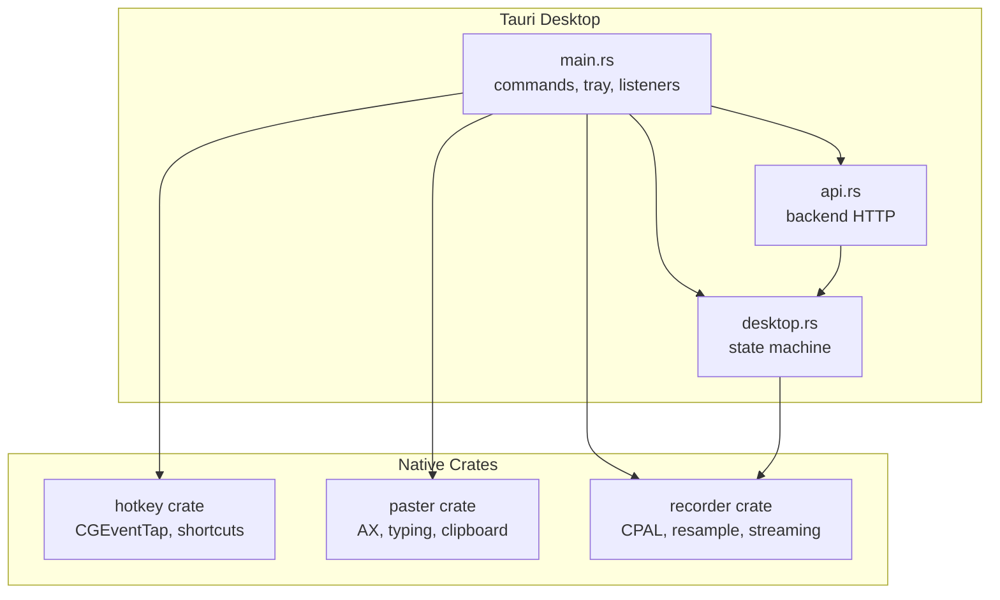
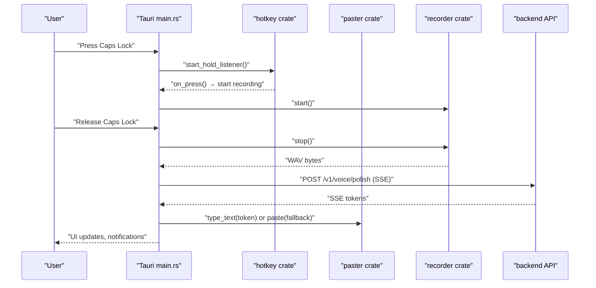
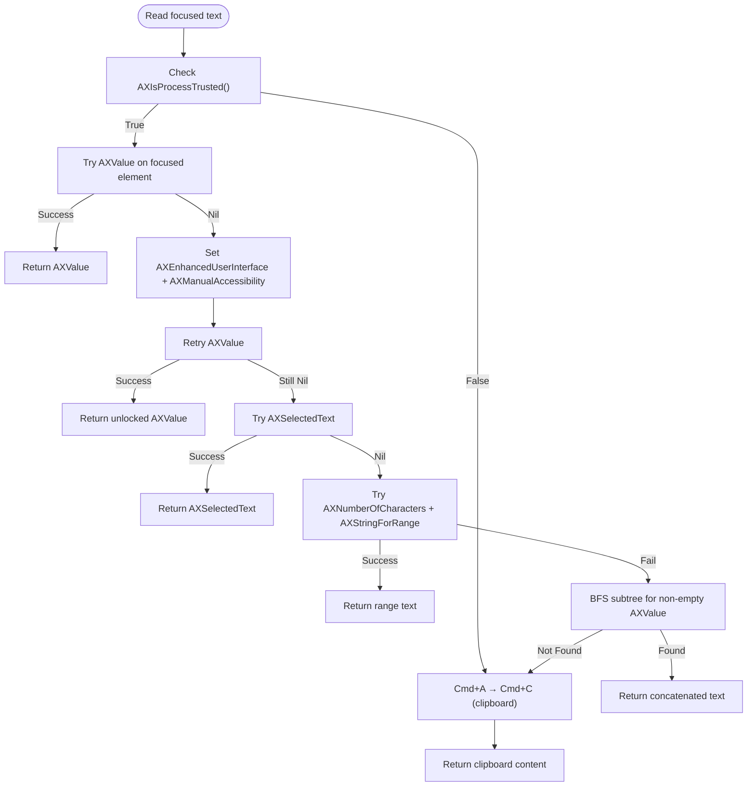
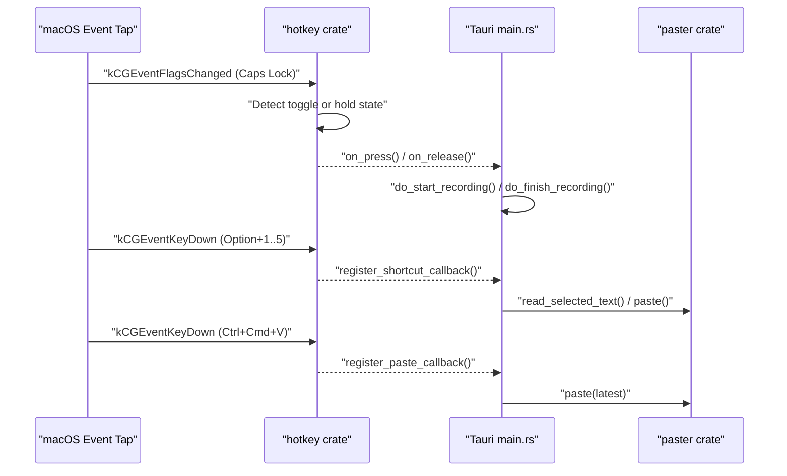
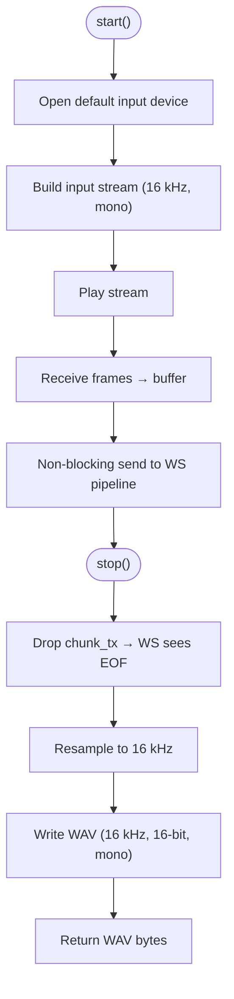
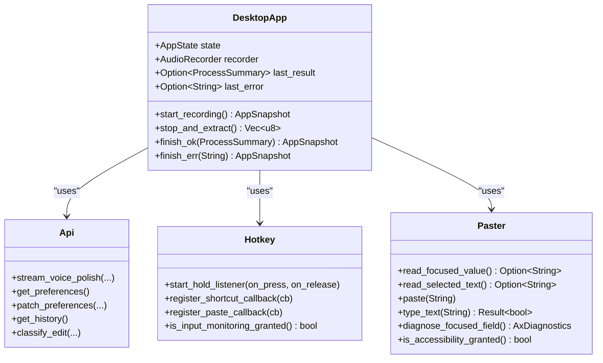
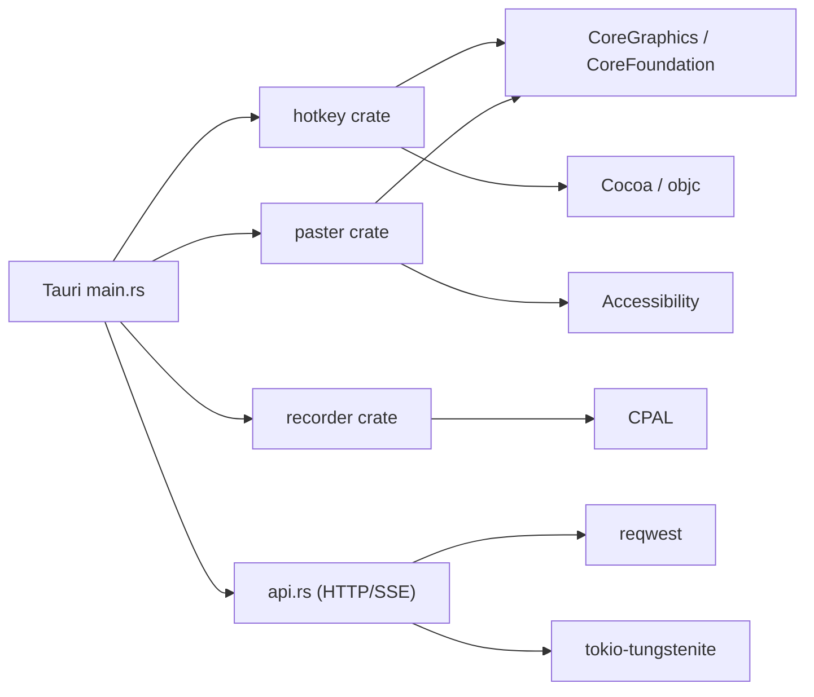

# Native Integration

<cite>
**Referenced Files in This Document**
- [hotkey/lib.rs](file://crates/hotkey/src/lib.rs)
- [paster/lib.rs](file://crates/paster/src/lib.rs)
- [recorder/lib.rs](file://crates/recorder/src/lib.rs)
- [desktop main.rs](file://desktop/src-tauri/src/main.rs)
- [desktop desktop.rs](file://desktop/src-tauri/src/desktop.rs)
- [desktop api.rs](file://desktop/src-tauri/src/api.rs)
- [Cargo.toml](file://desktop/src-tauri/Cargo.toml)
- [tauri.conf.json](file://desktop/src-tauri/tauri.conf.json)
- [capabilities/default.json](file://desktop/src-tauri/capabilities/default.json)
- [Info.plist](file://desktop/src-tauri/Info.plist)
</cite>

## Table of Contents
1. [Introduction](#introduction)
2. [Project Structure](#project-structure)
3. [Core Components](#core-components)
4. [Architecture Overview](#architecture-overview)
5. [Detailed Component Analysis](#detailed-component-analysis)
6. [Dependency Analysis](#dependency-analysis)
7. [Performance Considerations](#performance-considerations)
8. [Troubleshooting Guide](#troubleshooting-guide)
9. [Conclusion](#conclusion)

## Introduction
This document explains the native macOS integration for the desktop application, focusing on:
- Accessibility API integration for text manipulation and clipboard operations, including permission management and security considerations
- Global keyboard shortcut system with hotkey registration, event handling, and platform-specific behavior differences
- Audio capture system covering microphone access, audio processing pipeline, quality settings, and real-time audio streaming
- Native library architecture with separate crates for hotkey functionality, text pasting operations, and audio recording
- Tauri desktop integration showing how native capabilities are exposed to the frontend through safe APIs
- Permission flows, error handling, and fallback mechanisms for unsupported platforms

## Project Structure
The native integration spans three Rust crates and the Tauri desktop layer:
- Hotkey crate: macOS CGEventTap-based listeners for Caps Lock toggle and hold-to-record, plus global shortcuts and paste hotkey
- Paster crate: macOS Accessibility (AX) and CGEvent-based text reading and typing, plus clipboard operations and diagnostics
- Recorder crate: cross-platform audio capture using CPAL, resampling to 16 kHz, and chunk streaming for WebSocket STT
- Tauri desktop: orchestrates state, commands, permissions, and integrates the native crates into the UI

**Diagram sources**
- [desktop main.rs:2007-2348](file://desktop/src-tauri/src/main.rs#L2007-L2348)
- [desktop desktop.rs:1-123](file://desktop/src-tauri/src/desktop.rs#L1-L123)
- [hotkey/lib.rs:1-596](file://crates/hotkey/src/lib.rs#L1-L596)
- [paster/lib.rs:1-1067](file://crates/paster/src/lib.rs#L1-L1067)
- [recorder/lib.rs:1-235](file://crates/recorder/src/lib.rs#L1-L235)

**Section sources**
- [Cargo.toml:1-53](file://desktop/src-tauri/Cargo.toml#L1-L53)
- [tauri.conf.json:1-51](file://desktop/src-tauri/tauri.conf.json#L1-L51)

## Core Components
- Hotkey listener (Caps Lock toggle and hold-to-record) with Input Monitoring permission checks and automatic restart after permission grant
- Accessibility-based text reading and typing with Chrome/Electron unlocking, clipboard fallback, and keystroke replay for AX-blind apps
- Audio recording pipeline with CPAL, resampling to 16 kHz, and optional real-time Deepgram WebSocket streaming
- Tauri commands exposing native capabilities to the frontend, including permission requests, diagnostics, and paste operations

**Section sources**
- [hotkey/lib.rs:257-317](file://crates/hotkey/src/lib.rs#L257-L317)
- [paster/lib.rs:214-316](file://crates/paster/src/lib.rs#L214-L316)
- [recorder/lib.rs:69-228](file://crates/recorder/src/lib.rs#L69-L228)
- [desktop main.rs:2212-2283](file://desktop/src-tauri/src/main.rs#L2212-L2283)

## Architecture Overview
The desktop app initializes native capabilities, registers global listeners, and exposes safe commands to the frontend. Permissions are checked at startup and surfaced to the UI. The hotkey crate listens for Caps Lock and Option+1..5 shortcuts, while the paster crate reads and types text using Accessibility APIs. The recorder crate captures audio and optionally streams it to Deepgram for live transcription.

**Diagram sources**
- [desktop main.rs:827-1145](file://desktop/src-tauri/src/main.rs#L827-L1145)
- [hotkey/lib.rs:511-527](file://crates/hotkey/src/lib.rs#L511-L527)
- [recorder/lib.rs:69-157](file://crates/recorder/src/lib.rs#L69-L157)
- [paster/lib.rs:1061-1144](file://crates/paster/src/lib.rs#L1061-L1144)

## Detailed Component Analysis

### Accessibility API Integration (Text Manipulation and Clipboard)
The paster crate provides:
- Accessibility permission checks and request flows
- AX-based text reading with multiple strategies (direct AXValue, Chrome/Electron unlock, AXSelectedText, AXStringForRange, tree traversal)
- Clipboard-based fallback for AX-blind apps (Cmd+A → Cmd+C)
- Synthetic key posting for typing and selection operations
- Diagnostics for AX attribute inspection and method evaluation

Key behaviors:
- Permission gating via AXIsProcessTrusted
- Chrome/Electron unlock via AXEnhancedUserInterface and AXManualAccessibility
- Keystroke replay buffer for AX-blind app reconstruction
- Fallback to clipboard capture when AX is unavailable

**Diagram sources**
- [paster/lib.rs:214-316](file://crates/paster/src/lib.rs#L214-L316)
- [paster/lib.rs:386-429](file://crates/paster/src/lib.rs#L386-L429)
- [paster/lib.rs:556-652](file://crates/paster/src/lib.rs#L556-L652)

**Section sources**
- [paster/lib.rs:190-212](file://crates/paster/src/lib.rs#L190-L212)
- [paster/lib.rs:228-316](file://crates/paster/src/lib.rs#L228-L316)
- [paster/lib.rs:386-429](file://crates/paster/src/lib.rs#L386-L429)
- [paster/lib.rs:556-652](file://crates/paster/src/lib.rs#L556-L652)

### Global Keyboard Shortcut System
The hotkey crate implements:
- Toggle listener on Caps Lock press (toggle mode)
- Hold-to-record listener on Caps Lock hold/release
- Option+1..5 shortcuts for tone presets
- Ctrl+Cmd+V paste hotkey for latest polished result
- Input Monitoring permission management with automatic restart after grant

Permission flow:
- CGEventTapCreate failure triggers CGRequestListenEventAccess()
- is_input_monitoring_granted() uses CGPreflightListenEventAccess() with debouncing
- Saved callbacks are retried when permission becomes available

**Diagram sources**
- [hotkey/lib.rs:384-527](file://crates/hotkey/src/lib.rs#L384-L527)
- [hotkey/lib.rs:257-317](file://crates/hotkey/src/lib.rs#L257-L317)
- [desktop main.rs:2212-2283](file://desktop/src-tauri/src/main.rs#L2212-L2283)

**Section sources**
- [hotkey/lib.rs:110-111](file://crates/hotkey/src/lib.rs#L110-L111)
- [hotkey/lib.rs:257-317](file://crates/hotkey/src/lib.rs#L257-L317)
- [hotkey/lib.rs:511-527](file://crates/hotkey/src/lib.rs#L511-L527)
- [desktop main.rs:2212-2283](file://desktop/src-tauri/src/main.rs#L2212-L2283)

### Audio Capture System
The recorder crate provides:
- Cross-platform audio capture using CPAL
- Live chunk streaming for WebSocket STT
- Resampling to 16 kHz with linear interpolation
- WAV generation for fallback HTTP STT
- Minimum duration and silence detection safeguards

**Diagram sources**
- [recorder/lib.rs:69-157](file://crates/recorder/src/lib.rs#L69-L157)
- [recorder/lib.rs:167-218](file://crates/recorder/src/lib.rs#L167-L218)

**Section sources**
- [recorder/lib.rs:8-11](file://crates/recorder/src/lib.rs#L8-L11)
- [recorder/lib.rs:20-36](file://crates/recorder/src/lib.rs#L20-L36)
- [recorder/lib.rs:69-157](file://crates/recorder/src/lib.rs#L69-L157)
- [recorder/lib.rs:167-218](file://crates/recorder/src/lib.rs#L167-L218)

### Tauri Desktop Integration
The desktop app manages:
- Shared state machine for recording and processing
- Commands for preferences, history, vocabulary, and cloud auth
- Permission requests and diagnostics
- Real-time SSE consumption and word-by-word typing
- Edit detection and classification after paste
- macOS-specific integrations (notifications, keystroke replay)

**Diagram sources**
- [desktop desktop.rs:33-122](file://desktop/src-tauri/src/desktop.rs#L33-L122)
- [desktop api.rs:128-178](file://desktop/src-tauri/src/api.rs#L128-L178)
- [hotkey/lib.rs:511-527](file://crates/hotkey/src/lib.rs#L511-L527)
- [paster/lib.rs:1148-1166](file://crates/paster/src/lib.rs#L1148-L1166)

**Section sources**
- [desktop desktop.rs:18-76](file://desktop/src-tauri/src/desktop.rs#L18-L76)
- [desktop main.rs:602-743](file://desktop/src-tauri/src/main.rs#L602-L743)
- [desktop main.rs:1028-1145](file://desktop/src-tauri/src/main.rs#L1028-L1145)

## Dependency Analysis
External dependencies and platform bindings:
- macOS frameworks: CoreGraphics, CoreFoundation, Cocoa, Objective-C runtime
- Audio: CPAL for device enumeration and streaming
- Networking: reqwest for SSE, tokio-tungstenite for WebSocket
- Serialization: serde for HTTP payloads

**Diagram sources**
- [Cargo.toml:45-52](file://desktop/src-tauri/Cargo.toml#L45-L52)
- [hotkey/lib.rs:6-107](file://crates/hotkey/src/lib.rs#L6-L107)
- [paster/lib.rs:25-107](file://crates/paster/src/lib.rs#L25-L107)
- [recorder/lib.rs:1-4](file://crates/recorder/src/lib.rs#L1-L4)

**Section sources**
- [Cargo.toml:45-52](file://desktop/src-tauri/Cargo.toml#L45-L52)

## Performance Considerations
- Hotkey listener runs on a dedicated CFRunLoop thread; callbacks must avoid blocking work
- AX reads are polled at ~30 ms intervals during edit detection; ensure minimal work in the hot path
- Audio resampling is linear interpolation in pure Rust; CPU cost scales with input rate and duration
- WebSocket streaming uses a buffered channel to decouple audio capture from network I/O
- Silence detection and minimum duration checks prevent unnecessary uploads

[No sources needed since this section provides general guidance]

## Troubleshooting Guide
Common issues and resolutions:
- Accessibility permission denied: Use the frontend command to request permission; verify AXIsProcessTrusted
- Input Monitoring denied: Use the frontend command to request permission; ensure Info.plist usage descriptions are present
- Microphone permission denied: Check System Settings privacy; silence detection warns when no audio captured
- AX blind apps: rely on clipboard fallback and keystroke replay; Chrome/Electron unlocking improves reliability
- Hotkey not firing: verify Input Monitoring grant and that the app is trusted for accessibility

**Section sources**
- [desktop main.rs:2056-2066](file://desktop/src-tauri/src/main.rs#L2056-L2066)
- [Info.plist:5-15](file://desktop/src-tauri/Info.plist#L5-L15)
- [recorder/lib.rs:188-192](file://crates/recorder/src/lib.rs#L188-L192)
- [paster/lib.rs:214-316](file://crates/paster/src/lib.rs#L214-L316)
- [hotkey/lib.rs:257-317](file://crates/hotkey/src/lib.rs#L257-L317)

## Conclusion
The native integration leverages macOS frameworks and Tauri to deliver a seamless voice-to-polished-text workflow. The hotkey crate provides reliable global shortcuts, the paster crate ensures robust text manipulation across diverse applications, and the recorder crate delivers high-quality audio capture with optional real-time streaming. Tauri exposes these capabilities through safe commands, with clear permission flows and fallback strategies for unsupported environments.