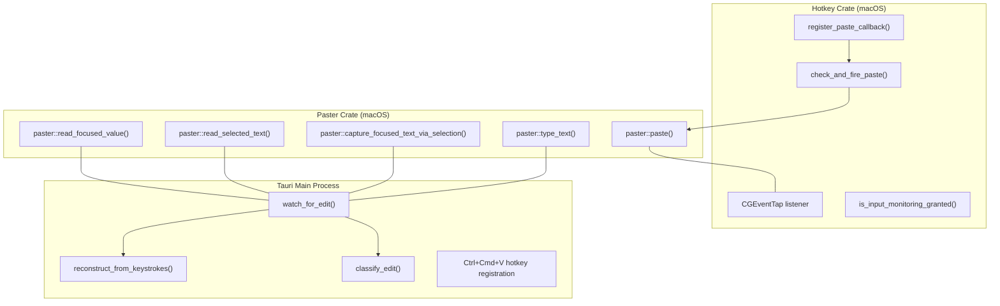
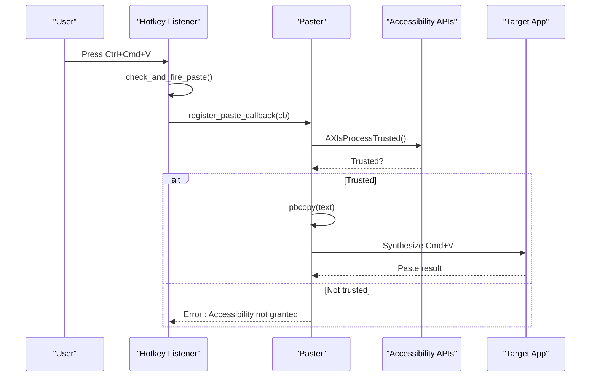
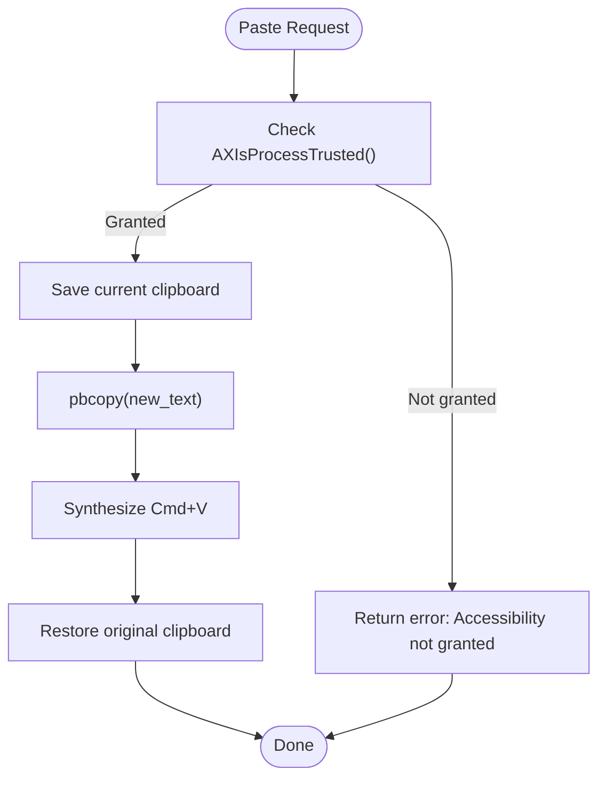
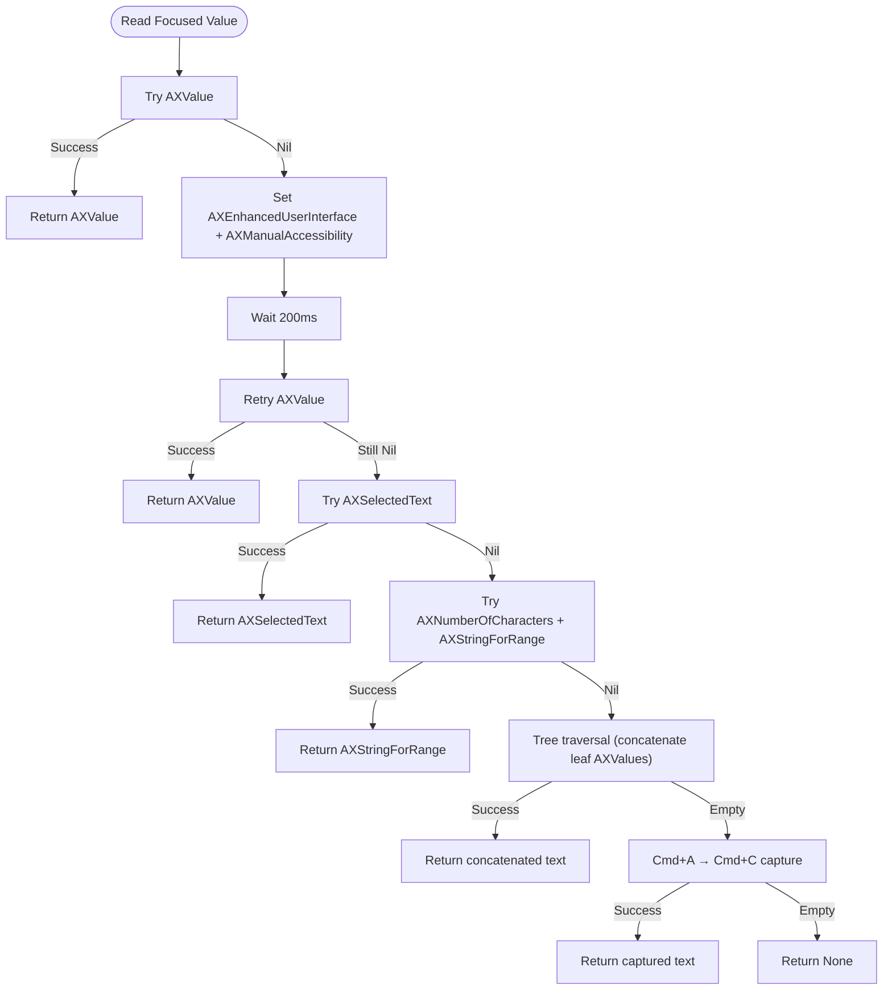
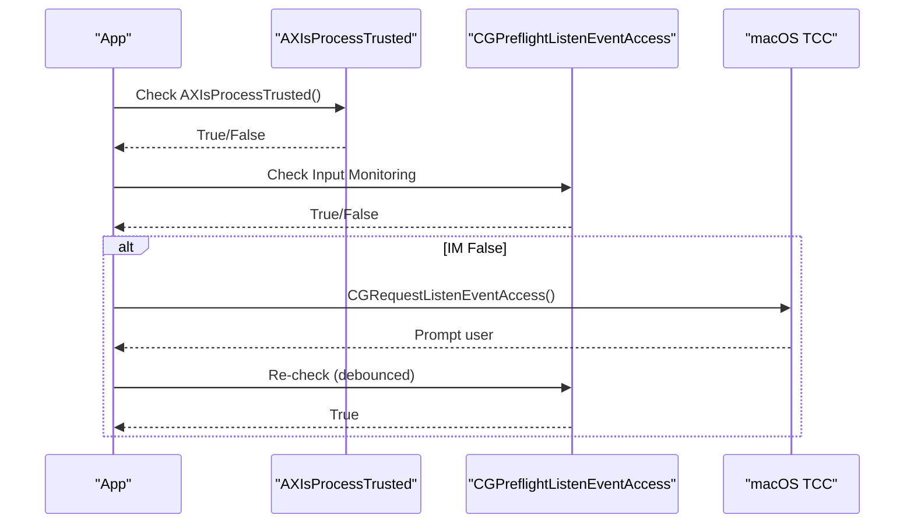
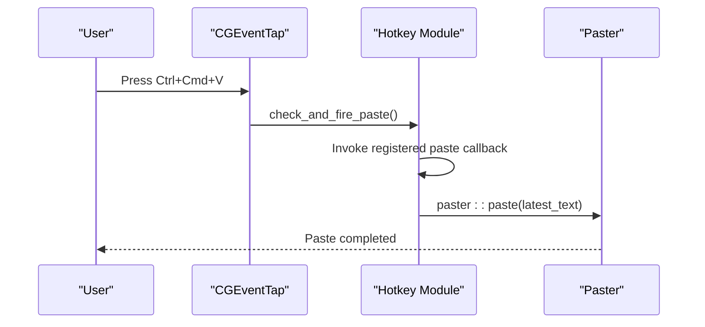
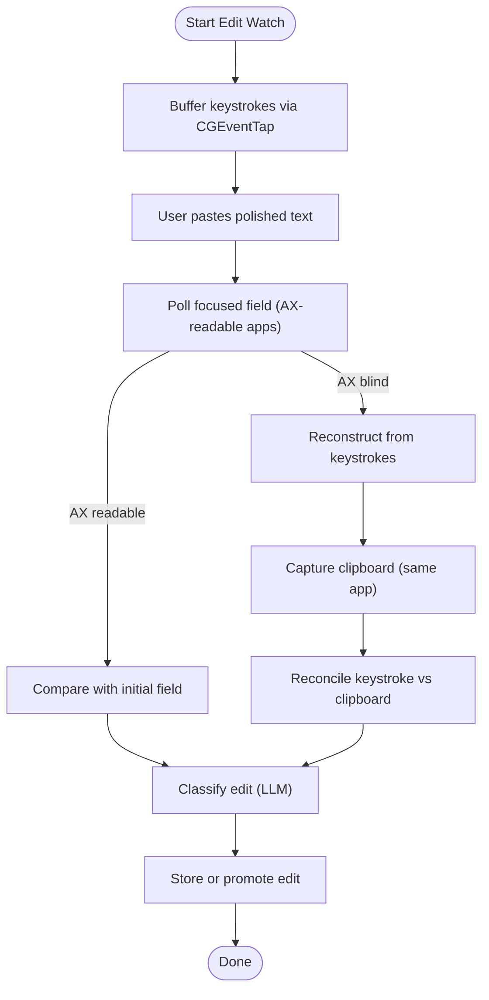
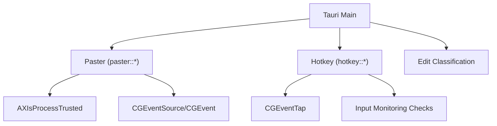

# macOS Accessibility Integration

<cite>
**Referenced Files in This Document**
- [lib.rs](file://crates/paster/src/lib.rs)
- [lib.rs](file://crates/hotkey/src/lib.rs)
- [main.rs](file://desktop/src-tauri/src/main.rs)
- [api.rs](file://desktop/src-tauri/src/api.rs)
- [App.tsx](file://desktop/src/App.tsx)
- [invoke.ts](file://desktop/src/lib/invoke.ts)
- [default.json](file://desktop/src-tauri/capabilities/default.json)
- [macOS-schema.json](file://desktop/src-tauri/gen/schemas/macOS-schema.json)
- [test_ax_methods.rs](file://crates/paster/examples/test_ax_methods.rs)
</cite>

## Table of Contents
1. [Introduction](#introduction)
2. [Project Structure](#project-structure)
3. [Core Components](#core-components)
4. [Architecture Overview](#architecture-overview)
5. [Detailed Component Analysis](#detailed-component-analysis)
6. [Dependency Analysis](#dependency-analysis)
7. [Performance Considerations](#performance-considerations)
8. [Troubleshooting Guide](#troubleshooting-guide)
9. [Conclusion](#conclusion)

## Introduction
This document explains the macOS Accessibility API integration used by the application to manipulate text programmatically. It covers clipboard operations, text selection, programmatic text insertion, permission management (Accessibility and Input Monitoring), paste hotkey handling, edit detection using keystroke buffering, and security considerations. Practical integration patterns and workflows are included for developers working with the main application.

## Project Structure
The macOS Accessibility integration spans three key areas:
- Text manipulation and paste: implemented in the paster crate
- Hotkey handling and permission tracking: implemented in the hotkey crate
- Application orchestration and edit detection: implemented in the Tauri main process

**Diagram sources**
- [lib.rs:961-997](file://crates/paster/src/lib.rs#L961-L997)
- [lib.rs:228-316](file://crates/paster/src/lib.rs#L228-L316)
- [lib.rs:439-513](file://crates/paster/src/lib.rs#L439-L513)
- [lib.rs:386-429](file://crates/paster/src/lib.rs#L386-L429)
- [lib.rs:929-959](file://crates/paster/src/lib.rs#L929-L959)
- [lib.rs:219-253](file://crates/hotkey/src/lib.rs#L219-L253)
- [lib.rs:279-317](file://crates/hotkey/src/lib.rs#L279-L317)
- [main.rs:1500-1750](file://desktop/src-tauri/src/main.rs#L1500-L1750)
- [main.rs:1750-1955](file://desktop/src-tauri/src/main.rs#L1750-L1955)

**Section sources**
- [lib.rs:1-1067](file://crates/paster/src/lib.rs#L1-L1067)
- [lib.rs:1-596](file://crates/hotkey/src/lib.rs#L1-L596)
- [main.rs:1-2408](file://desktop/src-tauri/src/main.rs#L1-L2408)

## Core Components
- Paster (macOS): Provides clipboard operations, text reading, paste simulation, and programmatic text typing. It uses Accessibility APIs for reading and typing, and synthesizes keyboard events for paste.
- Hotkey (macOS): Implements CGEventTap-based hotkey listeners for Caps Lock toggles and Ctrl+Cmd+V paste, tracks Input Monitoring permission, and buffers keystrokes for edit detection.
- Tauri Main Process: Orchestrates edit detection, keystroke reconstruction, classification, and paste hotkey integration.

Key responsibilities:
- Clipboard operations: copy/paste via system utilities and synthetic key events
- Text selection: AX attribute reading and fallback Cmd+A/C capture
- Programmatic text insertion: AX value writes and Unicode keyboard synthesis
- Permission management: Accessibility and Input Monitoring checks and prompts
- Paste hotkeys: Ctrl+Cmd+V handling and paste callback invocation
- Edit detection: AX reads for accessible apps and keystroke replay for AX-blind apps

**Section sources**
- [lib.rs:925-997](file://crates/paster/src/lib.rs#L925-L997)
- [lib.rs:279-317](file://crates/hotkey/src/lib.rs#L279-L317)
- [main.rs:1500-1750](file://desktop/src-tauri/src/main.rs#L1500-L1750)

## Architecture Overview
The system integrates three layers:
- macOS Accessibility layer: AXIsProcessTrusted, AX UI element queries, and keyboard event synthesis
- Event capture layer: CGEventTap for keystroke buffering and hotkey detection
- Application orchestration layer: edit detection, classification, and paste hotkey handling

**Diagram sources**
- [lib.rs:219-253](file://crates/hotkey/src/lib.rs#L219-L253)
- [lib.rs:961-997](file://crates/paster/src/lib.rs#L961-L997)

**Section sources**
- [lib.rs:219-253](file://crates/hotkey/src/lib.rs#L219-L253)
- [lib.rs:961-997](file://crates/paster/src/lib.rs#L961-L997)

## Detailed Component Analysis

### Text Manipulation and Clipboard Operations
- Clipboard copy/paste: Uses pbcopy/pbpaste system utilities to manage the system clipboard safely, preserving original content and restoring it after paste.
- Paste simulation: When Accessibility is granted, the system synthesizes keyboard events (Cmd+V) to paste into the focused field. Otherwise, it falls back to clipboard copy/paste.
- Programmatic text typing: Synthesizes Unicode keyboard events directly into the focused app without clipboard involvement, supporting any script.

**Diagram sources**
- [lib.rs:961-997](file://crates/paster/src/lib.rs#L961-L997)

**Section sources**
- [lib.rs:906-997](file://crates/paster/src/lib.rs#L906-L997)

### Text Selection and Reading Strategies
The system implements a layered approach to read text from the focused field:
1. Direct AXValue read
2. Unlock AX tree for Chrome/Electron, then retry AXValue
3. AXSelectedText read
4. AXStringForRange using character count
5. Tree traversal to concatenate leaf text nodes
6. Fallback: Cmd+A → Cmd+C capture via clipboard

**Diagram sources**
- [lib.rs:228-316](file://crates/paster/src/lib.rs#L228-L316)
- [lib.rs:624-872](file://crates/paster/src/lib.rs#L624-L872)
- [lib.rs:386-429](file://crates/paster/src/lib.rs#L386-L429)

**Section sources**
- [lib.rs:228-316](file://crates/paster/src/lib.rs#L228-L316)
- [lib.rs:624-872](file://crates/paster/src/lib.rs#L624-L872)
- [lib.rs:386-429](file://crates/paster/src/lib.rs#L386-L429)

### Permission Management: Accessibility and Input Monitoring
- Accessibility permission: Determined by AXIsProcessTrusted. The system can trigger the system dialog via AXIsProcessTrustedWithOptions and open the Privacy pane for Accessibility.
- Input Monitoring permission: Determined by CGPreflightListenEventAccess. The system requests permission via CGRequestListenEventAccess and tracks state to restart listeners when permission is granted.

**Diagram sources**
- [lib.rs:880-893](file://crates/paster/src/lib.rs#L880-L893)
- [lib.rs:279-317](file://crates/hotkey/src/lib.rs#L279-L317)

**Section sources**
- [lib.rs:880-893](file://crates/paster/src/lib.rs#L880-L893)
- [lib.rs:279-317](file://crates/hotkey/src/lib.rs#L279-L317)

### Paste Hotkey Handling: Ctrl+Cmd+V
- Registration: The application registers a paste callback for Ctrl+Cmd+V.
- Detection: The CGEventTap detects the key combination and invokes the registered callback.
- Execution: The callback retrieves the latest polished text and triggers paster::paste().

**Diagram sources**
- [lib.rs:219-253](file://crates/hotkey/src/lib.rs#L219-L253)
- [main.rs:2263-2282](file://desktop/src-tauri/src/main.rs#L2263-L2282)
- [lib.rs:961-997](file://crates/paster/src/lib.rs#L961-L997)

**Section sources**
- [lib.rs:219-253](file://crates/hotkey/src/lib.rs#L219-L253)
- [main.rs:2263-2282](file://desktop/src-tauri/src/main.rs#L2263-L2282)
- [lib.rs:961-997](file://crates/paster/src/lib.rs#L961-L997)

### Edit Detection Using Keystroke Buffering
For applications without Accessibility API access (AX-blind), the system uses keystroke buffering and reconstruction:
- Keystroke buffering: CGEventTap captures keydown events into a rolling buffer with timestamps.
- Reconstruction: After paste, the system replays buffered keystrokes against the initial text to infer user edits.
- Cross-verification: Clipboard capture is used to reconcile keystroke reconstruction when available.

**Diagram sources**
- [main.rs:1500-1750](file://desktop/src-tauri/src/main.rs#L1500-L1750)
- [main.rs:1750-1955](file://desktop/src-tauri/src/main.rs#L1750-L1955)

**Section sources**
- [main.rs:80-200](file://desktop/src-tauri/src/main.rs#L80-L200)
- [main.rs:1500-1750](file://desktop/src-tauri/src/main.rs#L1500-L1750)
- [main.rs:1750-1955](file://desktop/src-tauri/src/main.rs#L1750-L1955)

### Security Considerations and Platform Differences
- Accessibility permission: Required for AX reads and typing. The system checks AXIsProcessTrusted and surfaces errors when not granted.
- Input Monitoring permission: Required for CGEventTap and keystroke capture. The system uses CGPreflightListenEventAccess for authoritative checks and CGRequestListenEventAccess to prompt.
- Clipboard safety: Original clipboard content is saved and restored to avoid disrupting user workflows.
- Platform differences: Non-macOS platforms rely on clipboard copy/paste and lack AX capabilities.

**Section sources**
- [lib.rs:925-997](file://crates/paster/src/lib.rs#L925-L997)
- [lib.rs:279-317](file://crates/hotkey/src/lib.rs#L279-L317)
- [lib.rs:1000-1067](file://crates/paster/src/lib.rs#L1000-L1067)

### Practical Integration Patterns
- Clipboard operations: Use pbcopy/pbpaste wrappers for safe clipboard management.
- Text insertion: Prefer AX-based typing for supported apps; fall back to paste when AX is not granted.
- Edit detection: Enable edit_capture preference and rely on AX reads when available; use keystroke reconstruction for AX-blind apps.
- Hotkey integration: Register paste callbacks and handle Ctrl+Cmd+V to paste the latest polished result.

**Section sources**
- [lib.rs:906-997](file://crates/paster/src/lib.rs#L906-L997)
- [main.rs:1500-1750](file://desktop/src-tauri/src/main.rs#L1500-L1750)
- [api.rs:682-738](file://desktop/src-tauri/src/api.rs#L682-L738)

## Dependency Analysis
The integration involves tight coupling between the paster and hotkey crates, coordinated by the Tauri main process. Permissions drive capability availability, and the edit detection pipeline depends on both AX reads and keystroke reconstruction.

**Diagram sources**
- [lib.rs:925-997](file://crates/paster/src/lib.rs#L925-L997)
- [lib.rs:279-317](file://crates/hotkey/src/lib.rs#L279-L317)
- [main.rs:1500-1750](file://desktop/src-tauri/src/main.rs#L1500-L1750)

**Section sources**
- [lib.rs:925-997](file://crates/paster/src/lib.rs#L925-L997)
- [lib.rs:279-317](file://crates/hotkey/src/lib.rs#L279-L317)
- [main.rs:1500-1750](file://desktop/src-tauri/src/main.rs#L1500-L1750)

## Performance Considerations
- AX polling interval: 30 ms for edit detection to balance responsiveness and CPU usage.
- Permission checks: Debounced Input Monitoring checks (every 2 seconds) to minimize overhead.
- Clipboard operations: Short delays between actions to allow target apps to process clipboard changes.
- Keystroke reconstruction: Limits recursion depth and buffer size to maintain reliability and performance.

[No sources needed since this section provides general guidance]

## Troubleshooting Guide
Common issues and resolutions:
- Accessibility not granted: Trigger permission prompt via request_accessibility and ensure the app is listed in System Settings → Privacy & Security → Accessibility.
- Input Monitoring not granted: Trigger permission prompt via request_input_monitoring and ensure the app is listed in System Settings → Privacy & Security → Input Monitoring.
- Paste fails: Verify AXIsProcessTrusted returns true; if not, guide the user to grant Accessibility permission.
- Edit detection incomplete: For AX-blind apps, ensure edit_capture is enabled and keystroke buffering is active; consider clipboard reconciliation for accuracy.

**Section sources**
- [lib.rs:880-893](file://crates/paster/src/lib.rs#L880-L893)
- [lib.rs:279-317](file://crates/hotkey/src/lib.rs#L279-L317)
- [App.tsx:344-370](file://desktop/src/App.tsx#L344-L370)

## Conclusion
The macOS Accessibility integration provides robust text manipulation, reliable permission management, and accurate edit detection across both accessible and AX-blind applications. By combining AX APIs, CGEventTap-based keystroke buffering, and clipboard reconciliation, the system delivers a secure and efficient user experience with clear fallback mechanisms and diagnostic capabilities.