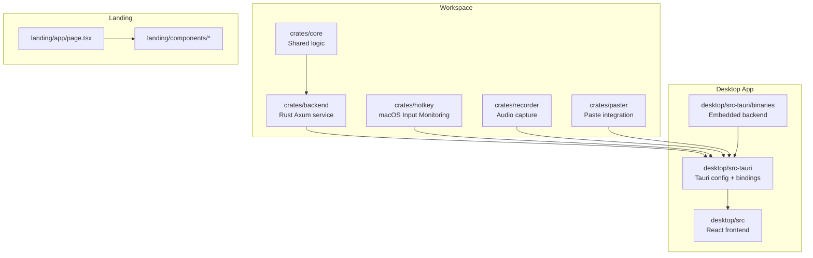
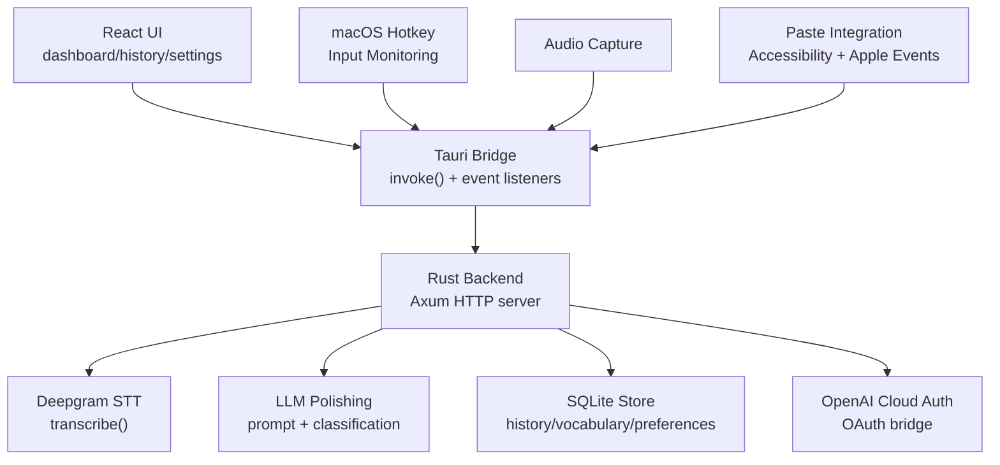
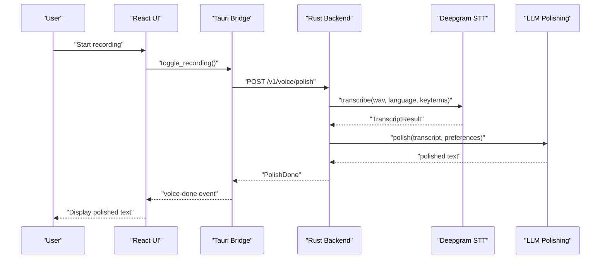
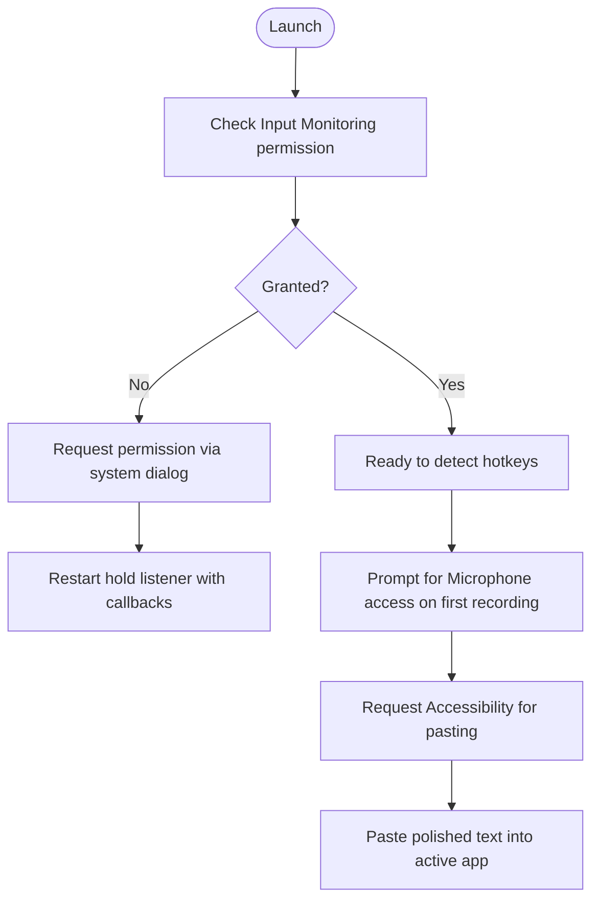
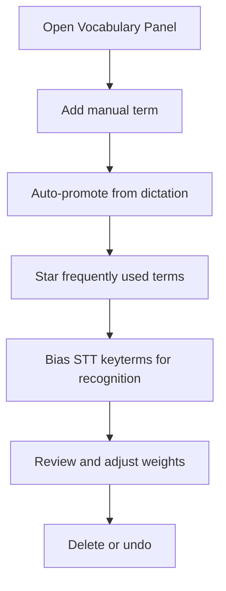
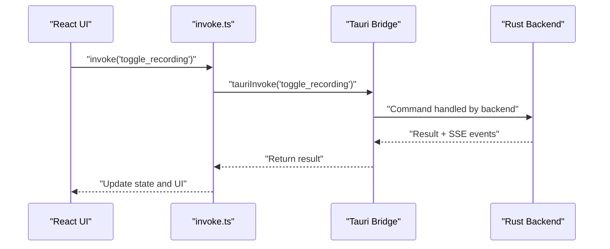
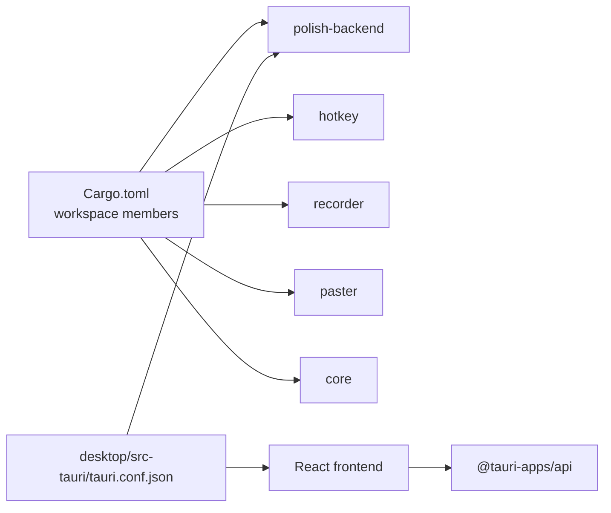

# Project Overview

<cite>
**Referenced Files in This Document**
- [Cargo.toml](file://Cargo.toml)
- [package.json](file://desktop/package.json)
- [tauri.conf.json](file://desktop/src-tauri/tauri.conf.json)
- [lib.rs](file://crates/backend/src/lib.rs)
- [App.tsx](file://desktop/src/App.tsx)
- [invoke.ts](file://desktop/src/lib/invoke.ts)
- [lib.rs (hotkey)](file://crates/hotkey/src/lib.rs)
- [install.sh](file://install.sh)
- [main.tsx](file://desktop/src/main.tsx)
- [page.tsx](file://landing/app/page.tsx)
- [FeaturesSection.tsx](file://landing/components/FeaturesSection.tsx)
- [Hero.tsx](file://landing/components/Hero.tsx)
- [SettingsView.tsx](file://desktop/src/components/views/SettingsView.tsx)
- [VocabularyView.tsx](file://desktop/src/components/views/VocabularyView.tsx)
- [Info.plist](file://desktop/src-tauri/Info.plist)
- [Info.plist (installer)](file://install.sh)
- [dev.sh](file://dev.sh)
</cite>

## Table of Contents
1. [Introduction](#introduction)
2. [Project Structure](#project-structure)
3. [Core Components](#core-components)
4. [Architecture Overview](#architecture-overview)
5. [Detailed Component Analysis](#detailed-component-analysis)
6. [Dependency Analysis](#dependency-analysis)
7. [Performance Considerations](#performance-considerations)
8. [Troubleshooting Guide](#troubleshooting-guide)
9. [Conclusion](#conclusion)

## Introduction
WISPR Hindi Bridge (formerly known as Said) is a desktop application designed to help Hindi/Hinglish speakers improve their English communication skills. It captures spoken input in real time, transcribes it, and applies AI-powered language polishing to produce grammatically correct, natural-sounding English text. The system emphasizes accessibility and productivity by integrating deeply with macOS, enabling hands-free operation via global shortcuts and native system permissions.

Key benefits:
- Real-time voice processing with live transcription and polishing previews
- Multi-language support for Hindi/Hinglish, English, and Hinglish output
- Personal vocabulary management that biases speech recognition toward user-defined terms
- Accessibility integration for seamless text insertion into any app
- Desktop-native experience powered by Tauri and Rust backend

Target audience:
- Language learners practicing English pronunciation and grammar
- Professionals who want to refine spoken English for meetings, presentations, and documentation
- Anyone seeking a frictionless way to convert spoken thoughts into polished English text

Unique value proposition:
By combining speech-to-text with AI language polishing in a single desktop application, WISPR Hindi Bridge delivers immediate, accurate results without leaving the user’s workflow. The integration with macOS accessibility and input monitoring enables a truly hands-free experience.

## Project Structure
The repository follows a workspace-first organization with a Rust backend, a React frontend, and a Tauri wrapper for native capabilities. The desktop application bundles a Rust-built backend binary and exposes a Tauri API to the React UI.

**Diagram sources**
- [Cargo.toml:1-14](file://Cargo.toml#L1-L14)
- [tauri.conf.json:31-43](file://desktop/src-tauri/tauri.conf.json#L31-L43)
- [package.json:1-38](file://desktop/package.json#L1-L38)

**Section sources**
- [Cargo.toml:1-14](file://Cargo.toml#L1-L14)
- [package.json:1-38](file://desktop/package.json#L1-L38)
- [tauri.conf.json:1-51](file://desktop/src-tauri/tauri.conf.json#L1-L51)

## Core Components
- Rust backend service: Provides HTTP endpoints for voice processing, text polishing, history, preferences, vocabulary, and cloud/OpenAI integration. It caches preferences and lexicon data to optimize latency.
- Hotkey crate: Detects global keystrokes (e.g., Caps Lock) and manages Input Monitoring permission on macOS.
- Recorder and paster crates: Capture audio and paste polished text into the active application using macOS Accessibility and Apple Events.
- Tauri desktop shell: Embeds the backend binary, exposes safe APIs to the React UI, and handles native notifications and system settings.
- React frontend: Presents a dashboard, history, vocabulary, insights, and settings panels with live status updates and error handling.

**Section sources**
- [lib.rs:135-146](file://crates/backend/src/lib.rs#L135-L146)
- [lib.rs (hotkey):279-281](file://crates/hotkey/src/lib.rs#L279-L281)
- [tauri.conf.json:31-43](file://desktop/src-tauri/tauri.conf.json#L31-L43)
- [App.tsx:80-147](file://desktop/src/App.tsx#L80-L147)

## Architecture Overview
The desktop app runs a Rust backend embedded inside a Tauri application. The React frontend communicates with the backend via Tauri commands and listens to server-sent events for live updates. macOS permissions (microphone, Accessibility, Input Monitoring) are requested and managed through system dialogs.

**Diagram sources**
- [lib.rs:150-199](file://crates/backend/src/lib.rs#L150-L199)
- [invoke.ts:204-212](file://desktop/src/lib/invoke.ts#L204-L212)
- [lib.rs (hotkey):543-567](file://crates/hotkey/src/lib.rs#L543-L567)
- [Info.plist:4-16](file://desktop/src-tauri/Info.plist#L4-L16)

**Section sources**
- [lib.rs:150-199](file://crates/backend/src/lib.rs#L150-L199)
- [invoke.ts:343-377](file://desktop/src/lib/invoke.ts#L343-L377)
- [lib.rs (hotkey):279-281](file://crates/hotkey/src/lib.rs#L279-L281)

## Detailed Component Analysis

### Speech Pipeline and Language Polishing
The voice pipeline integrates speech-to-text with AI-driven language polishing. The backend supports configurable output languages (Hinglish, English, Hindi) and enriches transcripts with uncertainty markers to guide the LLM. Preferences and vocabulary are cached to reduce database overhead.

**Diagram sources**
- [lib.rs:156-168](file://crates/backend/src/lib.rs#L156-L168)
- [invoke.ts:367-377](file://desktop/src/lib/invoke.ts#L367-L377)
- [lib.rs:59-66](file://crates/backend/src/stt/deepgram.rs#L59-L66)
- [prompt.rs:213-275](file://crates/backend/src/llm/prompt.rs#L213-L275)

**Section sources**
- [lib.rs:29-69](file://crates/backend/src/lib.rs#L29-L69)
- [lib.rs:77-131](file://crates/backend/src/lib.rs#L77-L131)
- [lib.rs:43-66](file://crates/backend/src/stt/deepgram.rs#L43-L66)
- [prompt.rs:213-275](file://crates/backend/src/llm/prompt.rs#L213-L275)

### Accessibility and Input Monitoring
The application leverages macOS Accessibility to paste polished text into any app and Input Monitoring to detect global hotkeys. The hotkey crate uses authoritative APIs to check and request permissions, restarting listeners when permissions change.

**Diagram sources**
- [lib.rs (hotkey):279-281](file://crates/hotkey/src/lib.rs#L279-L281)
- [lib.rs (hotkey):543-567](file://crates/hotkey/src/lib.rs#L543-L567)
- [Info.plist:4-16](file://desktop/src-tauri/Info.plist#L4-L16)
- [SettingsView.tsx:661-788](file://desktop/src/components/views/SettingsView.tsx#L661-L788)

**Section sources**
- [lib.rs (hotkey):279-281](file://crates/hotkey/src/lib.rs#L279-L281)
- [SettingsView.tsx:661-788](file://desktop/src/components/views/SettingsView.tsx#L661-L788)
- [Info.plist:4-16](file://desktop/src-tauri/Info.plist#L4-L16)

### Personal Vocabulary Management
Users can add, star, and manage vocabulary terms that influence speech recognition bias and promote learning. The UI surfaces vocabulary changes and supports undo actions.

**Diagram sources**
- [VocabularyView.tsx:284-327](file://desktop/src/components/views/VocabularyView.tsx#L284-L327)
- [invoke.ts:613-631](file://desktop/src/lib/invoke.ts#L613-L631)
- [invoke.ts:647-652](file://desktop/src/lib/invoke.ts#L647-L652)

**Section sources**
- [VocabularyView.tsx:284-327](file://desktop/src/components/views/VocabularyView.tsx#L284-L327)
- [invoke.ts:599-631](file://desktop/src/lib/invoke.ts#L599-L631)

### Frontend-Backend Communication
The React frontend uses Tauri’s invoke API to communicate with the backend and subscribes to server-sent events for live updates. It also manages cloud and OpenAI OAuth flows and displays notifications.

**Diagram sources**
- [App.tsx:322-342](file://desktop/src/App.tsx#L322-L342)
- [invoke.ts:204-212](file://desktop/src/lib/invoke.ts#L204-L212)
- [invoke.ts:343-377](file://desktop/src/lib/invoke.ts#L343-L377)

**Section sources**
- [App.tsx:129-147](file://desktop/src/App.tsx#L129-L147)
- [App.tsx:200-305](file://desktop/src/App.tsx#L200-L305)
- [invoke.ts:204-212](file://desktop/src/lib/invoke.ts#L204-L212)

## Dependency Analysis
The workspace coordinates multiple crates and the desktop app. The backend depends on Axum for HTTP, SQLite for persistence, and external services for STT and LLMs. The desktop app bundles the backend binary and exposes a Tauri API to the React UI.

**Diagram sources**
- [Cargo.toml:1-14](file://Cargo.toml#L1-L14)
- [tauri.conf.json:31-43](file://desktop/src-tauri/tauri.conf.json#L31-L43)
- [package.json:12-26](file://desktop/package.json#L12-L26)

**Section sources**
- [Cargo.toml:1-14](file://Cargo.toml#L1-L14)
- [tauri.conf.json:31-43](file://desktop/src-tauri/tauri.conf.json#L31-L43)
- [package.json:12-26](file://desktop/package.json#L12-L26)

## Performance Considerations
- Backend caching: Preferences and lexicon are cached with TTLs to minimize database queries during voice/text processing.
- Parallel reads: Lexicon loads corrections and replacements concurrently to reduce latency.
- Shared HTTP client: Keeps connections alive across requests to external services.
- Streaming tokens: The UI renders live LLM tokens to provide immediate feedback during polishing.

Recommendations:
- Keep the backend binary synchronized with the desktop build using the provided development script.
- Monitor SQLite migration performance and ensure indexes are optimized for frequent queries.
- Consider rate-limiting and backpressure for high-frequency voice sessions.

**Section sources**
- [lib.rs:29-69](file://crates/backend/src/lib.rs#L29-L69)
- [lib.rs:77-131](file://crates/backend/src/lib.rs#L77-L131)
- [lib.rs:210-214](file://crates/backend/src/lib.rs#L210-L214)
- [dev.sh:1-21](file://dev.sh#L1-L21)

## Troubleshooting Guide
Common issues and resolutions:
- Permissions not granted: The installer and settings panel guide users to enable Input Monitoring, Accessibility, and Microphone access. Use the provided commands to open System Settings and verify permissions.
- Hotkey not responding: Ensure Input Monitoring is granted and restart the app after granting permissions.
- Paste not working: Confirm Accessibility permission is granted; the app uses Apple Events to paste into other applications.
- Backend not starting: Verify the embedded binary exists and matches the built version; use the development script to keep them in sync.
- Cloud/OpenAI connectivity: Use the built-in gates to connect accounts and poll for status.

**Section sources**
- [install.sh:382-410](file://install.sh#L382-L410)
- [SettingsView.tsx:661-788](file://desktop/src/components/views/SettingsView.tsx#L661-L788)
- [lib.rs (hotkey):543-567](file://crates/hotkey/src/lib.rs#L543-L567)
- [dev.sh:8-21](file://dev.sh#L8-L21)

## Conclusion
WISPR Hindi Bridge combines real-time speech processing with AI language polishing to help Hindi/Hinglish speakers develop fluent English communication. Its desktop-native architecture, deep macOS integration, and personal vocabulary management deliver a seamless, accessible, and productive experience. The technology stack—Rust backend, React frontend, Tauri framework, and macOS native capabilities—ensures reliability, performance, and ease of use for learners and professionals alike.