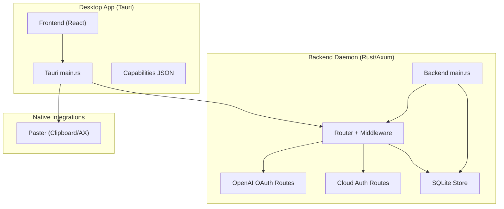
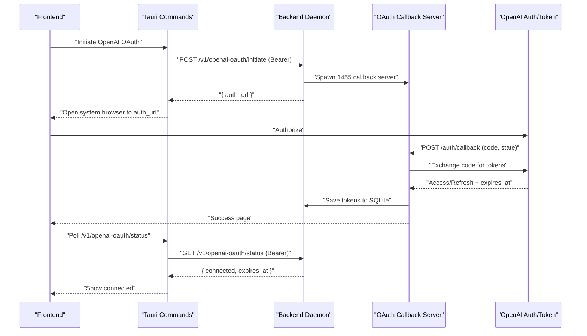
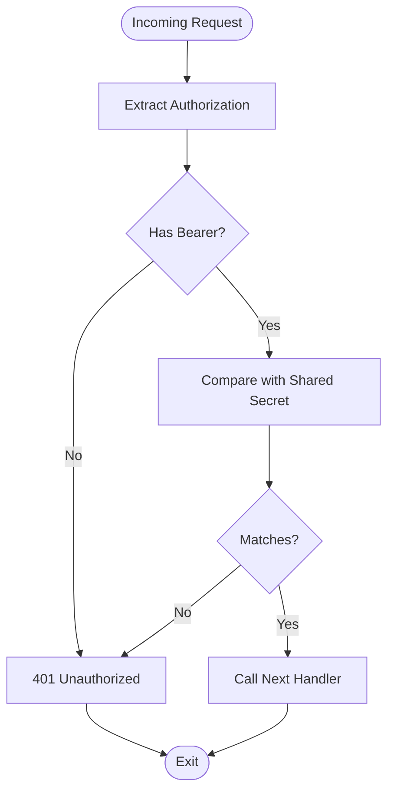
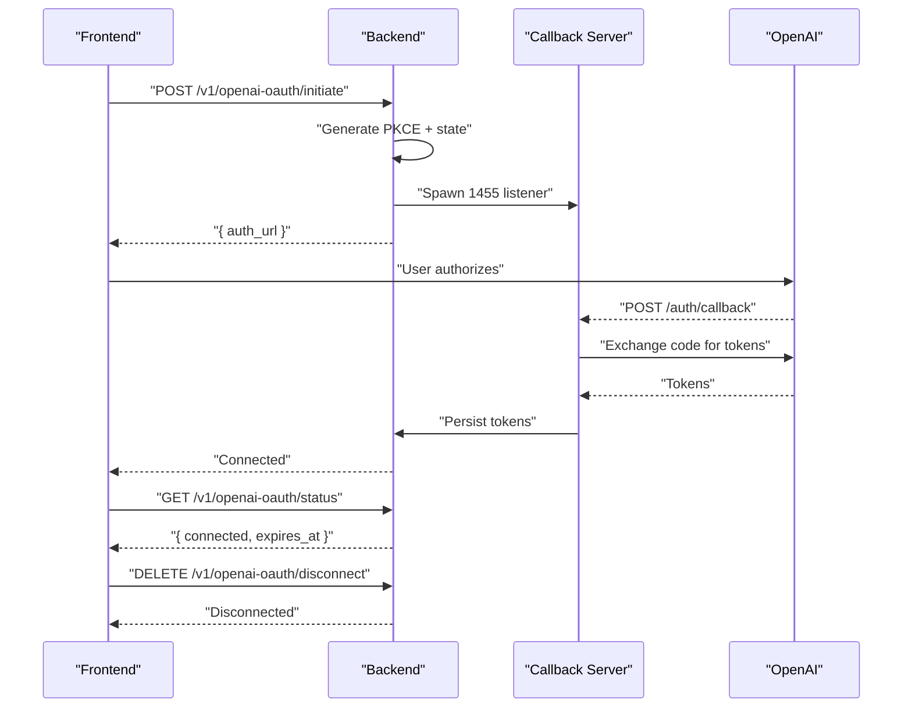
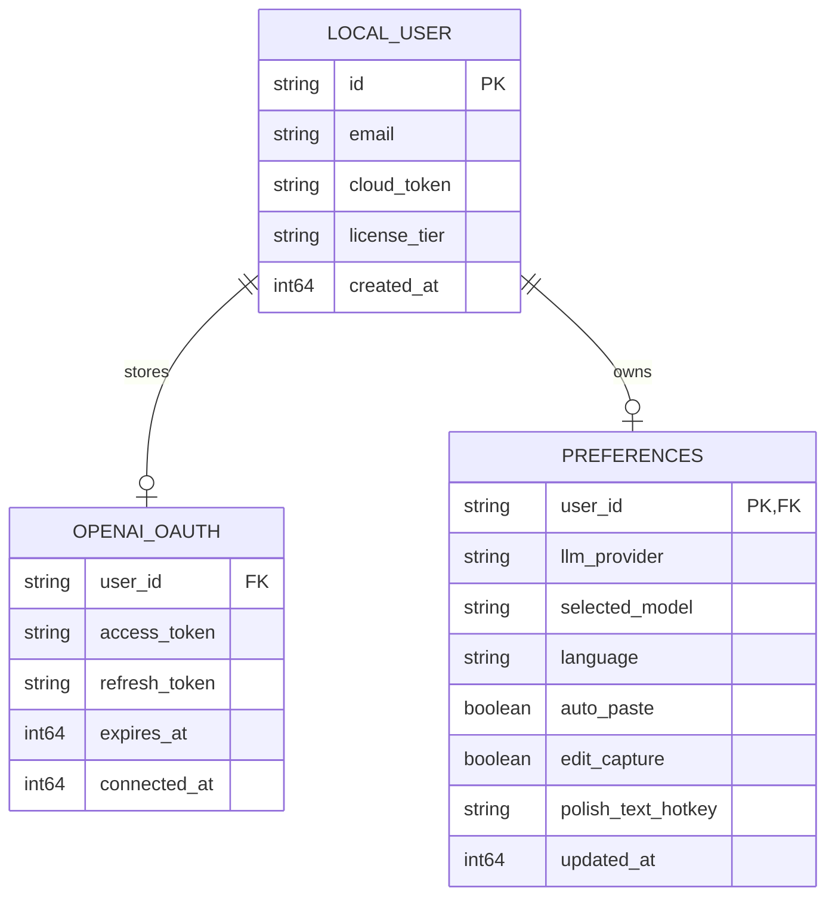
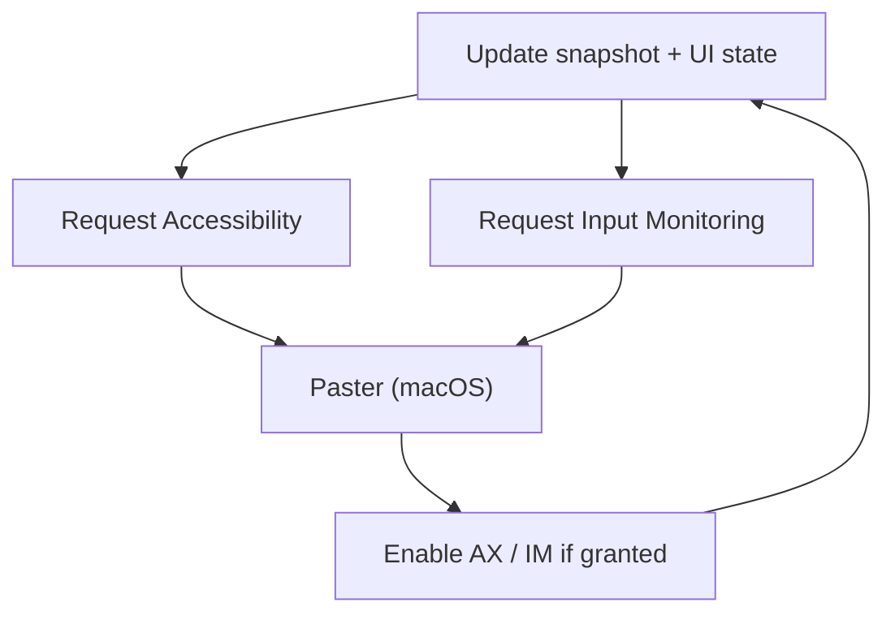
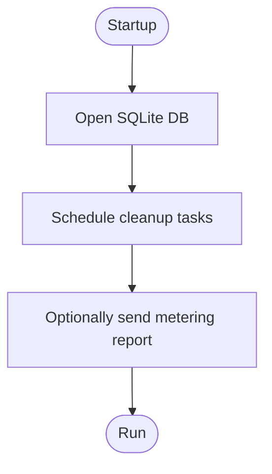
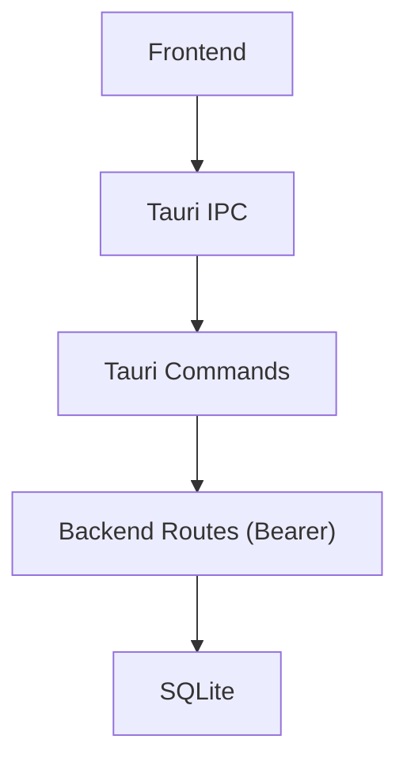
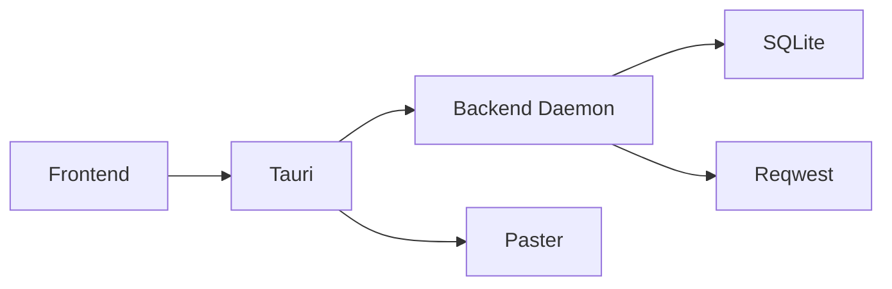

# Security and Privacy

<cite>
**Referenced Files in This Document**
- [auth/mod.rs](file://crates/backend/src/auth/mod.rs)
- [lib.rs](file://crates/backend/src/lib.rs)
- [main.rs](file://crates/backend/src/main.rs)
- [openai_oauth.rs](file://crates/backend/src/routes/openai_oauth.rs)
- [openai_oauth_store.rs](file://crates/backend/src/store/openai_oauth.rs)
- [cloud.rs](file://crates/backend/src/routes/cloud.rs)
- [users.rs](file://crates/backend/src/store/users.rs)
- [store/mod.rs](file://crates/backend/src/store/mod.rs)
- [tauri.conf.json](file://desktop/src-tauri/tauri.conf.json)
- [capabilities/default.json](file://desktop/src-tauri/capabilities/default.json)
- [src/main.rs](file://desktop/src-tauri/src/main.rs)
- [paster/lib.rs](file://crates/paster/src/lib.rs)
- [App.tsx](file://desktop/src/App.tsx)
- [SettingsView.tsx](file://desktop/src/components/views/SettingsView.tsx)
</cite>

## Table of Contents
1. [Introduction](#introduction)
2. [Project Structure](#project-structure)
3. [Core Components](#core-components)
4. [Architecture Overview](#architecture-overview)
5. [Detailed Component Analysis](#detailed-component-analysis)
6. [Dependency Analysis](#dependency-analysis)
7. [Performance Considerations](#performance-considerations)
8. [Troubleshooting Guide](#troubleshooting-guide)
9. [Conclusion](#conclusion)
10. [Appendices](#appendices)

## Introduction
This document provides comprehensive security and privacy documentation for the WISPR Hindi Bridge (Said). It covers the authentication system (including OpenAI OAuth integration), token and session management, secure credential storage, permission management (Accessibility, Input Monitoring, Clipboard), data privacy approaches (local-first processing, optional cloud sync, retention), Tauri security model (capability-based permissions, sandboxing, IPC), data handling and retention policies, user controls over personal information, best practices for native integration and API key management, and compliance considerations grounded in privacy-by-design.

## Project Structure
The application comprises:
- A Tauri desktop app (Rust) that orchestrates UI, permissions, and IPC.
- A Rust backend daemon (Axum) that exposes authenticated HTTP endpoints and manages local state.
- A Rust crate for clipboard and accessibility integration (platform-specific).
- A frontend (TypeScript/React) that invokes Tauri commands and renders settings.

**Diagram sources**
- [src/main.rs:1-80](file://desktop/src-tauri/src/main.rs#L1-L80)
- [lib.rs:150-227](file://crates/backend/src/lib.rs#L150-L227)
- [main.rs:18-145](file://crates/backend/src/main.rs#L18-L145)
- [openai_oauth.rs:1-394](file://crates/backend/src/routes/openai_oauth.rs#L1-L394)
- [cloud.rs:1-61](file://crates/backend/src/routes/cloud.rs#L1-L61)
- [store/mod.rs:34-60](file://crates/backend/src/store/mod.rs#L34-L60)
- [paster/lib.rs:1-200](file://crates/paster/src/lib.rs#L1-L200)
- [tauri.conf.json:1-51](file://desktop/src-tauri/tauri.conf.json#L1-L51)
- [capabilities/default.json:1-11](file://desktop/src-tauri/capabilities/default.json#L1-L11)

**Section sources**
- [src/main.rs:1-80](file://desktop/src-tauri/src/main.rs#L1-L80)
- [lib.rs:150-227](file://crates/backend/src/lib.rs#L150-L227)
- [main.rs:18-145](file://crates/backend/src/main.rs#L18-L145)
- [store/mod.rs:34-60](file://crates/backend/src/store/mod.rs#L34-L60)
- [tauri.conf.json:1-51](file://desktop/src-tauri/tauri.conf.json#L1-L51)
- [capabilities/default.json:1-11](file://desktop/src-tauri/capabilities/default.json#L1-L11)

## Core Components
- Authentication middleware enforcing a shared-secret bearer token for all authenticated backend routes.
- OpenAI OAuth 2.0 + PKCE flow with a one-shot callback server bound to localhost.
- Secure local credential storage in SQLite for OpenAI tokens and cloud tokens.
- Permission orchestration for Accessibility, Input Monitoring, and Clipboard via Tauri commands and native integrations.
- Optional cloud sync with bearer token authentication and metering reporting.
- Tauri capability-based permissions and minimal CSP configuration.

**Section sources**
- [auth/mod.rs:19-37](file://crates/backend/src/auth/mod.rs#L19-L37)
- [lib.rs:150-227](file://crates/backend/src/lib.rs#L150-L227)
- [openai_oauth.rs:116-201](file://crates/backend/src/routes/openai_oauth.rs#L116-L201)
- [openai_oauth_store.rs:16-83](file://crates/backend/src/store/openai_oauth.rs#L16-L83)
- [cloud.rs:20-60](file://crates/backend/src/routes/cloud.rs#L20-L60)
- [users.rs:15-50](file://crates/backend/src/store/users.rs#L15-L50)
- [tauri.conf.json:27-29](file://desktop/src-tauri/tauri.conf.json#L27-L29)
- [capabilities/default.json:6-9](file://desktop/src-tauri/capabilities/default.json#L6-L9)

## Architecture Overview
The system enforces strict boundary separation:
- The desktop app communicates with the backend via a shared-secret bearer token over localhost.
- The backend binds only to 127.0.0.1 and exposes authenticated routes protected by middleware.
- OAuth flows are isolated to a one-shot callback server on a fixed port and promptly terminated.
- Cloud sync is opt-in and controlled by storing a bearer token locally; metering reports are sent with explicit credentials.

**Diagram sources**
- [openai_oauth.rs:116-201](file://crates/backend/src/routes/openai_oauth.rs#L116-L201)
- [openai_oauth.rs:205-308](file://crates/backend/src/routes/openai_oauth.rs#L205-L308)
- [openai_oauth.rs:310-345](file://crates/backend/src/routes/openai_oauth.rs#L310-L345)
- [openai_oauth_store.rs:36-59](file://crates/backend/src/store/openai_oauth.rs#L36-L59)
- [lib.rs:184-187](file://crates/backend/src/lib.rs#L184-L187)

**Section sources**
- [openai_oauth.rs:1-394](file://crates/backend/src/routes/openai_oauth.rs#L1-L394)
- [openai_oauth_store.rs:1-84](file://crates/backend/src/store/openai_oauth.rs#L1-L84)
- [lib.rs:150-227](file://crates/backend/src/lib.rs#L150-L227)

## Detailed Component Analysis

### Authentication and Session Management
- Shared-secret bearer middleware validates Authorization headers against a runtime-generated UUID passed to the backend at startup.
- All authenticated routes are layered behind this middleware.
- The backend listens only on localhost and binds to a configurable port.
- CORS allows the Tauri webview origin and development server origins.

**Diagram sources**
- [auth/mod.rs:19-37](file://crates/backend/src/auth/mod.rs#L19-L37)
- [lib.rs:184-187](file://crates/backend/src/lib.rs#L184-L187)

**Section sources**
- [auth/mod.rs:1-38](file://crates/backend/src/auth/mod.rs#L1-L38)
- [lib.rs:150-227](file://crates/backend/src/lib.rs#L150-L227)
- [main.rs:80-86](file://crates/backend/src/main.rs#L80-L86)

### OpenAI OAuth Integration (PKCE)
- Uses a fixed client ID and PKCE challenge-response flow.
- Generates a random PKCE verifier and state, stores the pending session in module-level state, and builds an authorization URL with required scopes.
- Spawns a one-shot Axum server on 127.0.0.1:1455 to receive the callback.
- Validates state, exchanges the authorization code for tokens, and persists them to SQLite.
- Exposes status and disconnect endpoints; disconnect clears tokens and reverts provider.

**Diagram sources**
- [openai_oauth.rs:116-158](file://crates/backend/src/routes/openai_oauth.rs#L116-L158)
- [openai_oauth.rs:205-308](file://crates/backend/src/routes/openai_oauth.rs#L205-L308)
- [openai_oauth.rs:310-345](file://crates/backend/src/routes/openai_oauth.rs#L310-L345)
- [openai_oauth_store.rs:36-59](file://crates/backend/src/store/openai_oauth.rs#L36-L59)
- [openai_oauth_store.rs:70-83](file://crates/backend/src/store/openai_oauth.rs#L70-L83)

**Section sources**
- [openai_oauth.rs:1-394](file://crates/backend/src/routes/openai_oauth.rs#L1-L394)
- [openai_oauth_store.rs:1-84](file://crates/backend/src/store/openai_oauth.rs#L1-L84)

### Token and Credential Storage
- OpenAI tokens are stored in SQLite with access token, optional refresh token, expiration timestamp, and connection timestamp.
- Cloud tokens and license tier are stored per user in the local database.
- Tokens are updated on refresh and cleared on disconnect; metering reports are sent only when a cloud token exists.

**Diagram sources**
- [openai_oauth_store.rs:7-14](file://crates/backend/src/store/openai_oauth.rs#L7-L14)
- [users.rs:6-13](file://crates/backend/src/store/users.rs#L6-L13)
- [store/mod.rs:19-31](file://crates/backend/src/store/mod.rs#L19-L31)

**Section sources**
- [openai_oauth_store.rs:16-83](file://crates/backend/src/store/openai_oauth.rs#L16-L83)
- [users.rs:15-50](file://crates/backend/src/store/users.rs#L15-L50)
- [store/mod.rs:167-215](file://crates/backend/src/store/mod.rs#L167-L215)

### Permission Management
- Accessibility: The desktop app exposes a command to request Accessibility permission; the underlying crate checks and enables AX for supported applications.
- Input Monitoring: A command requests input monitoring permission; the UI reflects permission state.
- Clipboard: On macOS, synthesized paste events require Accessibility; on other platforms, clipboard copy is used where supported.

**Diagram sources**
- [src/main.rs:715-724](file://desktop/src-tauri/src/main.rs#L715-L724)
- [paster/lib.rs:1-200](file://crates/paster/src/lib.rs#L1-L200)
- [App.tsx:344-370](file://desktop/src/App.tsx#L344-L370)
- [SettingsView.tsx:635-663](file://desktop/src/components/views/SettingsView.tsx#L635-L663)

**Section sources**
- [src/main.rs:715-724](file://desktop/src-tauri/src/main.rs#L715-L724)
- [paster/lib.rs:1-200](file://crates/paster/src/lib.rs#L1-L200)
- [App.tsx:344-370](file://desktop/src/App.tsx#L344-L370)
- [SettingsView.tsx:635-663](file://desktop/src/components/views/SettingsView.tsx#L635-L663)

### Data Privacy and Retention
- Local-first processing: All processing occurs on-device; the backend binds to localhost and does not expose external endpoints.
- Optional cloud sync: Cloud token is stored locally; metering reports are sent only when present.
- Retention: Automatic cleanup of old recordings and audio files is scheduled periodically.
- Consent: Users explicitly connect cloud accounts and can disconnect at any time.

**Diagram sources**
- [main.rs:56-101](file://crates/backend/src/main.rs#L56-L101)
- [main.rs:149-233](file://crates/backend/src/main.rs#L149-L233)
- [store/mod.rs:34-60](file://crates/backend/src/store/mod.rs#L34-L60)

**Section sources**
- [main.rs:88-118](file://crates/backend/src/main.rs#L88-L118)
- [main.rs:149-233](file://crates/backend/src/main.rs#L149-L233)
- [store/mod.rs:167-215](file://crates/backend/src/store/mod.rs#L167-L215)

### Tauri Security Model
- Capability-based permissions: The default capability grants core and notification permissions to the main window.
- CSP: Disabled in configuration; the app relies on localhost-bound backend and Tauri commands for IPC.
- IPC security: Desktop app commands are invoked from the frontend; backend routes require shared-secret bearer.

**Diagram sources**
- [capabilities/default.json:6-9](file://desktop/src-tauri/capabilities/default.json#L6-L9)
- [tauri.conf.json:27-29](file://desktop/src-tauri/tauri.conf.json#L27-L29)
- [lib.rs:184-187](file://crates/backend/src/lib.rs#L184-L187)

**Section sources**
- [capabilities/default.json:1-11](file://desktop/src-tauri/capabilities/default.json#L1-L11)
- [tauri.conf.json:1-51](file://desktop/src-tauri/tauri.conf.json#L1-L51)
- [lib.rs:150-227](file://crates/backend/src/lib.rs#L150-L227)

## Dependency Analysis
- Backend depends on:
  - Axum for routing and middleware.
  - Rusqlite for local storage.
  - Tokio for async runtime and timers.
  - Reqwest for outbound HTTP calls (cloud metering).
- Desktop app depends on:
  - Tauri for commands and window management.
  - Paster crate for clipboard and accessibility integration.

**Diagram sources**
- [lib.rs:1-227](file://crates/backend/src/lib.rs#L1-L227)
- [main.rs:1-234](file://crates/backend/src/main.rs#L1-L234)
- [src/main.rs:1-80](file://desktop/src-tauri/src/main.rs#L1-L80)
- [paster/lib.rs:1-200](file://crates/paster/src/lib.rs#L1-L200)

**Section sources**
- [lib.rs:1-227](file://crates/backend/src/lib.rs#L1-L227)
- [main.rs:1-234](file://crates/backend/src/main.rs#L1-L234)
- [src/main.rs:1-80](file://desktop/src-tauri/src/main.rs#L1-L80)
- [paster/lib.rs:1-200](file://crates/paster/src/lib.rs#L1-L200)

## Performance Considerations
- HTTP client pooling: The backend maintains a shared HTTP client with pooled connections to reduce overhead for outbound requests.
- Caching: Preferences and lexicon caches reduce SQLite reads under load.
- Cleanup tasks: Periodic cleanup of old recordings and audio files prevent unbounded growth.

[No sources needed since this section provides general guidance]

## Troubleshooting Guide
- OAuth callback server binding failures: The one-shot server attempts to bind to 127.0.0.1:1455; if the port is in use, the server exits early. Ensure no lingering OAuth flows and retry.
- Missing shared-secret: Requests without a matching Authorization header return 401.
- Cloud token missing: Metering reports are skipped when no cloud token is present.
- Permission prompts: If Accessibility or Input Monitoring prompts do not appear, trigger the respective commands again; the UI snapshots reflect current state.

**Section sources**
- [openai_oauth.rs:213-220](file://crates/backend/src/routes/openai_oauth.rs#L213-L220)
- [auth/mod.rs:32-36](file://crates/backend/src/auth/mod.rs#L32-L36)
- [main.rs:160-165](file://crates/backend/src/main.rs#L160-L165)
- [src/main.rs:715-724](file://desktop/src-tauri/src/main.rs#L715-L724)

## Conclusion
WISPR Hindi Bridge employs a robust local-first architecture with strict boundary enforcement via a shared-secret bearer token, isolated OAuth flows, and capability-based Tauri permissions. Data remains primarily on-device, with optional cloud sync controlled by explicit user consent and securely stored credentials. Scheduled cleanup and caching improve performance while preserving privacy. Adhering to these patterns supports privacy-by-design and reduces risk exposure.

## Appendices

### Best Practices Summary
- Native integration
  - Use platform APIs judiciously; request only required permissions.
  - On macOS, synthesize paste events via Accessibility; on other platforms, use clipboard APIs where available.
- API key and token management
  - Store tokens in SQLite; avoid logging sensitive values.
  - Rotate tokens when possible; support refresh flows.
- Secure communication
  - Use localhost-only backend binding.
  - Enforce bearer authentication on all internal routes.
  - Prefer HTTPS for external services; validate certificates.

[No sources needed since this section provides general guidance]