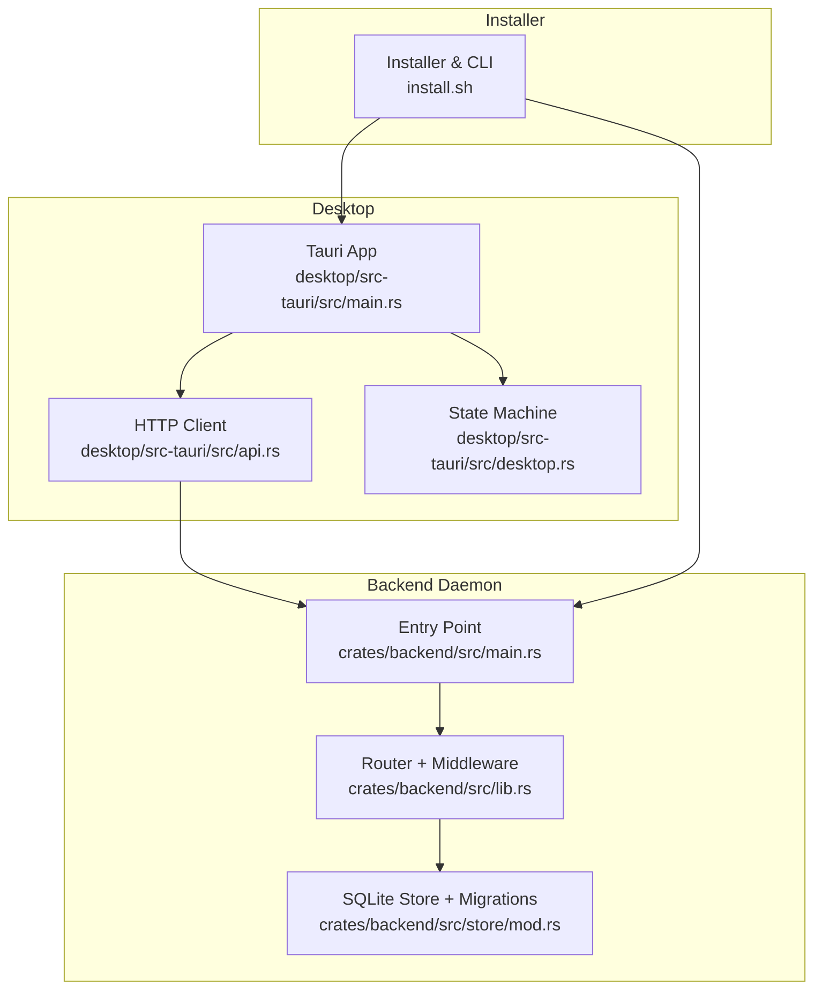
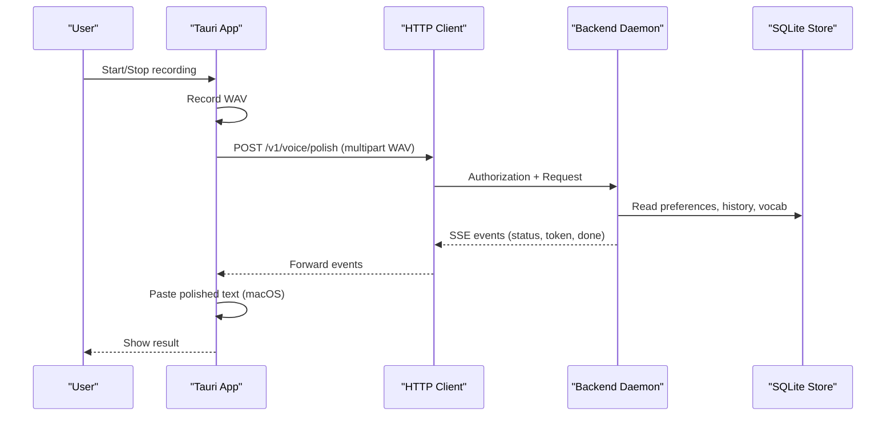

# Troubleshooting and FAQ

<cite>
**Referenced Files in This Document**
- [install.sh](file://install.sh)
- [dev.sh](file://dev.sh)
- [Cargo.toml](file://Cargo.toml)
- [crates/backend/src/main.rs](file://crates/backend/src/main.rs)
- [crates/backend/src/lib.rs](file://crates/backend/src/lib.rs)
- [crates/backend/src/store/mod.rs](file://crates/backend/src/store/mod.rs)
- [desktop/src-tauri/src/main.rs](file://desktop/src-tauri/src/main.rs)
- [desktop/src-tauri/src/api.rs](file://desktop/src-tauri/src/api.rs)
- [desktop/src-tauri/src/desktop.rs](file://desktop/src-tauri/src/desktop.rs)
- [desktop/src-tauri/tauri.conf.json](file://desktop/src-tauri/tauri.conf.json)
</cite>

## Table of Contents
1. [Introduction](#introduction)
2. [Project Structure](#project-structure)
3. [Core Components](#core-components)
4. [Architecture Overview](#architecture-overview)
5. [Installation Troubleshooting](#installation-troubleshooting)
6. [Runtime Troubleshooting](#runtime-troubleshooting)
7. [Error Reference](#error-reference)
8. [Diagnostic Procedures](#diagnostic-procedures)
9. [Performance Troubleshooting](#performance-troubleshooting)
10. [Recovery Procedures](#recovery-procedures)
11. [Platform-Specific Guidance](#platform-specific-guidance)
12. [Conclusion](#conclusion)

## Introduction
This document provides comprehensive troubleshooting and FAQ guidance for the WISPR Hindi Bridge (Said). It covers installation issues, runtime problems, error messages, diagnostics, performance tuning, recovery from corruption or failed updates, and platform-specific pitfalls. The goal is to help users resolve common issues quickly and confidently.

## Project Structure
The system comprises:
- A desktop application built with Tauri and React
- A local backend daemon exposing HTTP APIs and SSE streams
- A SQLite-backed persistence layer with migrations
- A macOS-focused installer and management script

**Diagram sources**
- [desktop/src-tauri/src/main.rs](file://desktop/src-tauri/src/main.rs)
- [desktop/src-tauri/src/api.rs](file://desktop/src-tauri/src/api.rs)
- [desktop/src-tauri/src/desktop.rs](file://desktop/src-tauri/src/desktop.rs)
- [crates/backend/src/main.rs](file://crates/backend/src/main.rs)
- [crates/backend/src/lib.rs](file://crates/backend/src/lib.rs)
- [crates/backend/src/store/mod.rs](file://crates/backend/src/store/mod.rs)
- [install.sh](file://install.sh)

**Section sources**
- [Cargo.toml](file://Cargo.toml)
- [desktop/src-tauri/tauri.conf.json](file://desktop/src-tauri/tauri.conf.json)

## Core Components
- Desktop app orchestrates recording, preferences, SSE consumption, and UI state.
- Backend daemon exposes health, voice/text polish, history, preferences, vocabulary, and cloud/auth endpoints.
- SQLite store manages user data, preferences, vocabulary, corrections, and history with automatic migrations.
- Installer configures the app bundle, registers LaunchAgent, and provides diagnostics and permission helpers.

**Section sources**
- [desktop/src-tauri/src/main.rs](file://desktop/src-tauri/src/main.rs)
- [desktop/src-tauri/src/api.rs](file://desktop/src-tauri/src/api.rs)
- [crates/backend/src/lib.rs](file://crates/backend/src/lib.rs)
- [crates/backend/src/store/mod.rs](file://crates/backend/src/store/mod.rs)
- [install.sh](file://install.sh)

## Architecture Overview
The desktop communicates with the backend over a local HTTP API protected by a shared secret. SSE streams deliver incremental polish results. The backend persists state in SQLite and periodically cleans up old recordings and audio files.

**Diagram sources**
- [desktop/src-tauri/src/api.rs](file://desktop/src-tauri/src/api.rs)
- [crates/backend/src/lib.rs](file://crates/backend/src/lib.rs)
- [crates/backend/src/store/mod.rs](file://crates/backend/src/store/mod.rs)

## Installation Troubleshooting
Common installation issues and resolutions:

- Unsupported architecture
  - Symptom: Installer fails with unsupported architecture.
  - Resolution: Ensure you are on arm64 or x86_64. The installer checks uname -m and aborts otherwise.
  - References: [install.sh](file://install.sh)

- Permission prompts not persisting after updates
  - Symptom: After updating, Input Monitoring and Accessibility permissions must be re-granted.
  - Cause: Unsigned binaries cause macOS to revoke permissions on hash changes.
  - Resolution: Use ad-hoc signing to tie permissions to bundle ID; or re-grant via System Settings.
  - References: [install.sh](file://install.sh)

- Missing or misconfigured LaunchAgent
  - Symptom: App does not start automatically or vp status shows stopped.
  - Resolution: Run vp doctor to verify LaunchAgent registration; reinstall with vp update if missing.
  - References: [install.sh](file://install.sh)

- Missing .env API key
  - Symptom: Backend may use a default shared key; custom key not applied.
  - Resolution: Ensure ~/.env contains GATEWAY_API_KEY; installer writes it if missing.
  - References: [install.sh](file://install.sh)

- Developer builds and binary sync
  - Symptom: Changes to backend not reflected in Tauri dev.
  - Resolution: Use dev.sh to build backend and sync external binary into Tauri’s binaries dir.
  - References: [dev.sh](file://dev.sh), [desktop/src-tauri/tauri.conf.json](file://desktop/src-tauri/tauri.conf.json)

**Section sources**
- [install.sh](file://install.sh)
- [dev.sh](file://dev.sh)
- [desktop/src-tauri/tauri.conf.json](file://desktop/src-tauri/tauri.conf.json)

## Runtime Troubleshooting
Common runtime issues and resolutions:

- Microphone access denied
  - Symptom: First recording triggers a macOS microphone prompt; if declined, recording fails.
  - Resolution: Grant microphone access when prompted; re-run recording.
  - References: [install.sh](file://install.sh)

- Accessibility and Input Monitoring not granted
  - Symptom: Paste does not work or hotkey detection fails.
  - Resolution: Use vp permissions to open System Settings panes; grant both Accessibility and Input Monitoring; restart app.
  - References: [install.sh](file://install.sh)

- Backend not reachable or slow
  - Symptom: Desktop shows “backend not ready” or SSE stalls.
  - Resolution: Verify backend is running locally; check logs; ensure port binding succeeds.
  - References: [crates/backend/src/main.rs](file://crates/backend/src/main.rs)

- SSE parsing or stream errors
  - Symptom: Desktop receives unparseable SSE data or stream ends without done.
  - Resolution: Inspect backend logs; ensure backend responds with valid SSE; retry.
  - References: [desktop/src-tauri/src/api.rs](file://desktop/src-tauri/src/api.rs)

- Preferences and vocabulary not applying
  - Symptom: Changes to language or output language do not reflect.
  - Resolution: Use patch_preferences; ensure backend returns updated preferences; desktop caches preferences for tray and hot path.
  - References: [desktop/src-tauri/src/api.rs](file://desktop/src-tauri/src/api.rs), [desktop/src-tauri/src/main.rs](file://desktop/src-tauri/src/main.rs)

- Cloud token persistence and OAuth
  - Symptom: Cloud status shows disconnected or OAuth fails.
  - Resolution: Use cloud token endpoints to store/clear token; initiate OAuth and poll status; ensure bearer auth is set.
  - References: [desktop/src-tauri/src/api.rs](file://desktop/src-tauri/src/api.rs)

**Section sources**
- [install.sh](file://install.sh)
- [crates/backend/src/main.rs](file://crates/backend/src/main.rs)
- [desktop/src-tauri/src/api.rs](file://desktop/src-tauri/src/api.rs)
- [desktop/src-tauri/src/main.rs](file://desktop/src-tauri/src/main.rs)

## Error Reference
Common error categories and typical causes:

- Installer errors
  - Unsupported architecture: [install.sh](file://install.sh)
  - Download failure: [install.sh](file://install.sh)
  - Permission revocation after updates: [install.sh](file://install.sh)

- Backend startup and binding
  - Port binding failure: [crates/backend/src/main.rs](file://crates/backend/src/main.rs)

- HTTP client errors
  - Request failures, timeouts, non-success status codes: [desktop/src-tauri/src/api.rs](file://desktop/src-tauri/src/api.rs)

- SSE parsing
  - Unparseable data lines or missing done event: [desktop/src-tauri/src/api.rs](file://desktop/src-tauri/src/api.rs)

- Database initialization and migrations
  - Migration failures or busy timeouts: [crates/backend/src/store/mod.rs](file://crates/backend/src/store/mod.rs)

- Desktop state and permissions
  - Not recording or not processing states; permission checks: [desktop/src-tauri/src/desktop.rs](file://desktop/src-tauri/src/desktop.rs)

**Section sources**
- [install.sh](file://install.sh)
- [crates/backend/src/main.rs](file://crates/backend/src/main.rs)
- [desktop/src-tauri/src/api.rs](file://desktop/src-tauri/src/api.rs)
- [crates/backend/src/store/mod.rs](file://crates/backend/src/store/mod.rs)
- [desktop/src-tauri/src/desktop.rs](file://desktop/src-tauri/src/desktop.rs)

## Diagnostic Procedures
Use these steps to isolate issues:

- Verify backend status and logs
  - Use vp status to check process; vp logs and vp errors to inspect recent output and errors.
  - References: [install.sh](file://install.sh)

- Run diagnostics
  - Use vp doctor to check process presence, binary, LaunchAgent, and recent errors.
  - References: [install.sh](file://install.sh)

- Accessibility and Input Monitoring diagnostics
  - Use the desktop command to run AX diagnostics on the focused field; delay if needed.
  - References: [desktop/src-tauri/src/main.rs](file://desktop/src-tauri/src/main.rs)

- Network and OAuth checks
  - Confirm backend is reachable on localhost; verify bearer auth; test cloud endpoints.
  - References: [desktop/src-tauri/src/api.rs](file://desktop/src-tauri/src/api.rs)

- Database health
  - Check default DB path and migration status; ensure WAL mode and foreign keys are enabled.
  - References: [crates/backend/src/store/mod.rs](file://crates/backend/src/store/mod.rs)

**Section sources**
- [install.sh](file://install.sh)
- [desktop/src-tauri/src/main.rs](file://desktop/src-tauri/src/main.rs)
- [desktop/src-tauri/src/api.rs](file://desktop/src-tauri/src/api.rs)
- [crates/backend/src/store/mod.rs](file://crates/backend/src/store/mod.rs)

## Performance Troubleshooting
Optimization recommendations:

- Reduce overhead on the hot path
  - Preferences and lexicon caches minimize SQLite reads; invalidate on updates.
  - References: [crates/backend/src/lib.rs](file://crates/backend/src/lib.rs)

- Manage HTTP client reuse
  - Shared HTTP client with pooled idle connections reduces handshake overhead.
  - References: [crates/backend/src/lib.rs](file://crates/backend/src/lib.rs), [crates/backend/src/main.rs](file://crates/backend/src/main.rs)

- Disk and cleanup tasks
  - Periodic cleanup of old recordings and audio files prevents disk growth.
  - References: [crates/backend/src/main.rs](file://crates/backend/src/main.rs)

- Logging and verbosity
  - Backend writes structured logs to ~/Library/Logs/Said/backend.log; adjust env filter for debug.
  - References: [crates/backend/src/main.rs](file://crates/backend/src/main.rs)

- Frontend responsiveness
  - SSE streaming and caching reduce UI blocking; ensure backend remains responsive.
  - References: [desktop/src-tauri/src/api.rs](file://desktop/src-tauri/src/api.rs)

**Section sources**
- [crates/backend/src/lib.rs](file://crates/backend/src/lib.rs)
- [crates/backend/src/main.rs](file://crates/backend/src/main.rs)
- [desktop/src-tauri/src/api.rs](file://desktop/src-tauri/src/api.rs)

## Recovery Procedures
Recover from common failures:

- Corrupted or stale database
  - Steps: Stop backend; back up current db.sqlite; remove or rename it; restart backend to recreate with migrations.
  - References: [crates/backend/src/store/mod.rs](file://crates/backend/src/store/mod.rs)

- Failed update or broken binary
  - Steps: Use vp delete to remove all traces; run installer again; re-grant permissions; restart.
  - References: [install.sh](file://install.sh)

- Lost preferences or vocabulary
  - Steps: Recreate defaults by removing DB and restarting; re-apply preferences and vocabulary.
  - References: [crates/backend/src/store/mod.rs](file://crates/backend/src/store/mod.rs)

- Garbage edit events poisoning learning
  - Steps: Startup purges edit_events with no meaningful word overlap; verify logs indicate removal.
  - References: [crates/backend/src/store/mod.rs](file://crates/backend/src/store/mod.rs)

**Section sources**
- [install.sh](file://install.sh)
- [crates/backend/src/store/mod.rs](file://crates/backend/src/store/mod.rs)

## Platform-Specific Guidance
- macOS
  - Permissions: Input Monitoring, Accessibility, and Microphone are required. Use vp permissions to open System Settings panes.
  - Bundle identity: Ad-hoc signing ties permissions to bundle ID; improves stability across updates.
  - Minimum OS version: Ensure macOS 13.0 or later.
  - References: [install.sh](file://install.sh), [desktop/src-tauri/tauri.conf.json](file://desktop/src-tauri/tauri.conf.json)

- Linux and Windows
  - Installer and LaunchAgent are macOS-specific. Use Tauri dev mode or build locally for other platforms.
  - References: [install.sh](file://install.sh), [dev.sh](file://dev.sh)

**Section sources**
- [install.sh](file://install.sh)
- [dev.sh](file://dev.sh)
- [desktop/src-tauri/tauri.conf.json](file://desktop/src-tauri/tauri.conf.json)

## Conclusion
By following the installation, runtime, diagnostic, performance, and recovery procedures outlined above, most issues can be resolved efficiently. Use the provided references to locate relevant code and configuration for deeper investigation when needed.